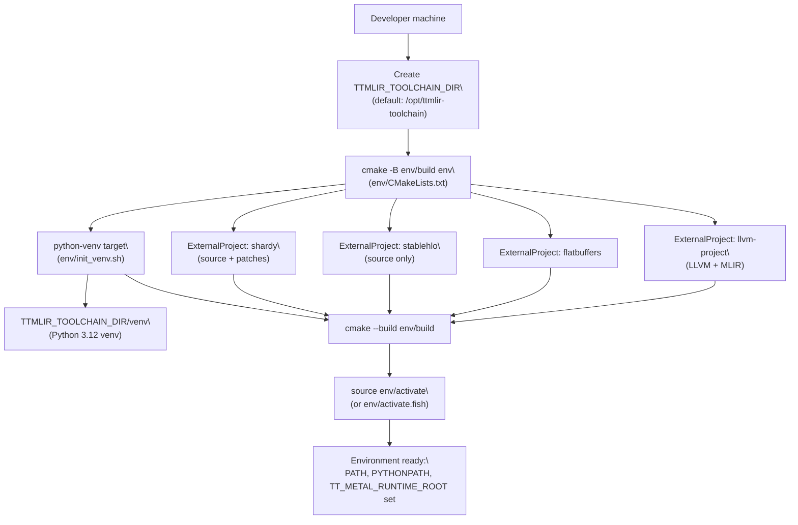
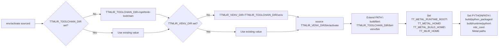
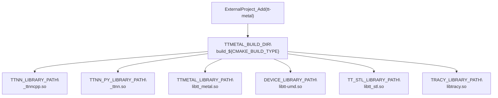
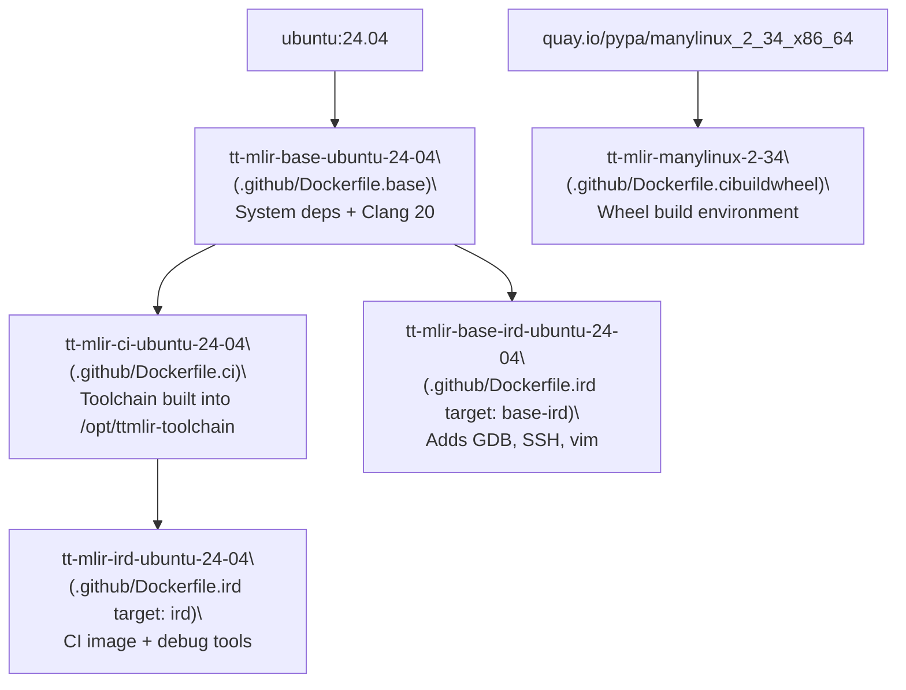

# System Requirements and Setup

Relevant source files
*   [.github/Dockerfile.base](https://github.com/tenstorrent/tt-mlir/blob/c7d92e92/.github/Dockerfile.base)
*   [.github/Dockerfile.ci](https://github.com/tenstorrent/tt-mlir/blob/c7d92e92/.github/Dockerfile.ci)
*   [.github/Dockerfile.cibuildwheel](https://github.com/tenstorrent/tt-mlir/blob/c7d92e92/.github/Dockerfile.cibuildwheel)
*   [.github/Dockerfile.ird](https://github.com/tenstorrent/tt-mlir/blob/c7d92e92/.github/Dockerfile.ird)
*   [.github/build-docker-images.sh](https://github.com/tenstorrent/tt-mlir/blob/c7d92e92/.github/build-docker-images.sh)
*   [.github/get-docker-tag.sh](https://github.com/tenstorrent/tt-mlir/blob/c7d92e92/.github/get-docker-tag.sh)
*   [.github/workflows/manual-build-wheels.yml](https://github.com/tenstorrent/tt-mlir/blob/c7d92e92/.github/workflows/manual-build-wheels.yml)
*   [.gitignore](https://github.com/tenstorrent/tt-mlir/blob/c7d92e92/.gitignore)
*   [CMakeLists.txt](https://github.com/tenstorrent/tt-mlir/blob/c7d92e92/CMakeLists.txt)
*   [docs/src/adding-an-op.md](https://github.com/tenstorrent/tt-mlir/blob/c7d92e92/docs/src/adding-an-op.md?plain=1)
*   [docs/src/getting-started.md](https://github.com/tenstorrent/tt-mlir/blob/c7d92e92/docs/src/getting-started.md?plain=1)
*   [docs/src/ttmlir-translate.md](https://github.com/tenstorrent/tt-mlir/blob/c7d92e92/docs/src/ttmlir-translate.md?plain=1)
*   [env/CMakeLists.txt](https://github.com/tenstorrent/tt-mlir/blob/c7d92e92/env/CMakeLists.txt)
*   [env/activate](https://github.com/tenstorrent/tt-mlir/blob/c7d92e92/env/activate)
*   [env/activate.fish](https://github.com/tenstorrent/tt-mlir/blob/c7d92e92/env/activate.fish)
*   [env/init_venv.sh](https://github.com/tenstorrent/tt-mlir/blob/c7d92e92/env/init_venv.sh)
*   [env/patches/shardy.patch](https://github.com/tenstorrent/tt-mlir/blob/c7d92e92/env/patches/shardy.patch)
*   [env/ttnn-requirements.txt](https://github.com/tenstorrent/tt-mlir/blob/c7d92e92/env/ttnn-requirements.txt)
*   [include/ttmlir/CMakeLists.txt](https://github.com/tenstorrent/tt-mlir/blob/c7d92e92/include/ttmlir/CMakeLists.txt)
*   [include/ttmlir/Conversion/CMakeLists.txt](https://github.com/tenstorrent/tt-mlir/blob/c7d92e92/include/ttmlir/Conversion/CMakeLists.txt)
*   [include/ttmlir/Conversion/Passes.h](https://github.com/tenstorrent/tt-mlir/blob/c7d92e92/include/ttmlir/Conversion/Passes.h)
*   [include/ttmlir/Conversion/Passes.td](https://github.com/tenstorrent/tt-mlir/blob/c7d92e92/include/ttmlir/Conversion/Passes.td)
*   [include/ttmlir/Conversion/TTNNToEmitC/TTNNToEmitC.h](https://github.com/tenstorrent/tt-mlir/blob/c7d92e92/include/ttmlir/Conversion/TTNNToEmitC/TTNNToEmitC.h)
*   [lib/CMakeLists.txt](https://github.com/tenstorrent/tt-mlir/blob/c7d92e92/lib/CMakeLists.txt)
*   [lib/Conversion/CMakeLists.txt](https://github.com/tenstorrent/tt-mlir/blob/c7d92e92/lib/Conversion/CMakeLists.txt)
*   [lib/Conversion/TTNNToEmitC/CMakeLists.txt](https://github.com/tenstorrent/tt-mlir/blob/c7d92e92/lib/Conversion/TTNNToEmitC/CMakeLists.txt)
*   [lib/Conversion/TTNNToEmitC/TTNNToEmitCPass.cpp](https://github.com/tenstorrent/tt-mlir/blob/c7d92e92/lib/Conversion/TTNNToEmitC/TTNNToEmitCPass.cpp)
*   [lib/Dialect/TTNN/Transforms/TTNNToCpp.cpp](https://github.com/tenstorrent/tt-mlir/blob/c7d92e92/lib/Dialect/TTNN/Transforms/TTNNToCpp.cpp)
*   [lib/RegisterAll.cpp](https://github.com/tenstorrent/tt-mlir/blob/c7d92e92/lib/RegisterAll.cpp)
*   [test/ttmlir/Dialect/StableHLO/ComplexDataTypeConversion/deepseek_v3_2_rope.mlir](https://github.com/tenstorrent/tt-mlir/blob/c7d92e92/test/ttmlir/Dialect/StableHLO/ComplexDataTypeConversion/deepseek_v3_2_rope.mlir)
*   [test/ttmlir/Dialect/StableHLO/shardy/op_propagation_registry/gather_2d_mesh.mlir](https://github.com/tenstorrent/tt-mlir/blob/c7d92e92/test/ttmlir/Dialect/StableHLO/shardy/op_propagation_registry/gather_2d_mesh.mlir)
*   [test/ttmlir/Dialect/TTNN/eltwise/operand_broadcasts.mlir](https://github.com/tenstorrent/tt-mlir/blob/c7d92e92/test/ttmlir/Dialect/TTNN/eltwise/operand_broadcasts.mlir)
*   [third_party/CMakeLists.txt](https://github.com/tenstorrent/tt-mlir/blob/c7d92e92/third_party/CMakeLists.txt)
*   [tools/tt-alchemist/templates/cpp/local/CMakeLists.txt](https://github.com/tenstorrent/tt-mlir/blob/c7d92e92/tools/tt-alchemist/templates/cpp/local/CMakeLists.txt)
*   [tools/ttmlir-opt/CMakeLists.txt](https://github.com/tenstorrent/tt-mlir/blob/c7d92e92/tools/ttmlir-opt/CMakeLists.txt)
*   [tools/ttnn-standalone/CMakeLists.txt](https://github.com/tenstorrent/tt-mlir/blob/c7d92e92/tools/ttnn-standalone/CMakeLists.txt)
*   [tools/ttnn-standalone/README.md](https://github.com/tenstorrent/tt-mlir/blob/c7d92e92/tools/ttnn-standalone/README.md?plain=1)
*   [tools/ttnn-standalone/run](https://github.com/tenstorrent/tt-mlir/blob/c7d92e92/tools/ttnn-standalone/run)
*   [tools/ttnn-standalone/ttnn-standalone.cpp](https://github.com/tenstorrent/tt-mlir/blob/c7d92e92/tools/ttnn-standalone/ttnn-standalone.cpp)

This page documents the prerequisites, environment setup scripts, Docker images, and key environment variables needed to build and develop `tt-mlir`. It covers everything from installing system dependencies to activating the toolchain and configuring CMake.

For information about what the build produces and how the compilation pipeline is structured, see **Architecture Overview (1.1)**. For details on CI/CD automation and test execution, see **CI/CD Pipeline and Automation (6.3)**.

* * *

## System Requirements

### Supported Operating Systems

| OS | Offline Compiler Only | Runtime Build | Runtime + Perf Build |
| --- | --- | --- | --- |
| Ubuntu 24.04 | ✅ | ✅ | ✅ |
| Ubuntu 20.04 | ✅ | ❌ | ❌ |
| macOS | ✅ | ❌ | ❌ |

Runtime support (TTNN and TTMetal backends) requires Ubuntu 24.04. macOS can build the compiler front-end but cannot execute compiled programs on Tenstorrent hardware. Note that `TTNNOpModelLib` is specifically disabled on Apple platforms, which affects optimizer performance estimates.

Sources: [docs/src/getting-started.md 123-127](https://github.com/tenstorrent/tt-mlir/blob/c7d92e92/docs/src/getting-started.md?plain=1#L123-L127)[CMakeLists.txt 88-91](https://github.com/tenstorrent/tt-mlir/blob/c7d92e92/CMakeLists.txt#L88-L91)

* * *

### Required System Packages

The following packages must be present before building the toolchain or the project itself.

| Package | Minimum Version | Notes |
| --- | --- | --- |
| Clang | 20 | Required for runtime; defined in Docker base |
| CMake | 3.24 |  |
| Ninja | 1.11+ |  |
| Python | 3.12 | `python3.12-venv` also required |
| Git | any |  |

On Ubuntu 24.04, install the core set:

`sudo apt install git clang cmake ninja-build pip python3.12-venv`
The full developer package list used inside the CI Docker image includes `libhwloc-dev`, `libtbb-dev`, `libcapstone-dev`, `libyaml-cpp-dev`, `zstd`, `ccache`, `doxygen`, and `graphviz`.

Sources: [.github/Dockerfile.base 10-41](https://github.com/tenstorrent/tt-mlir/blob/c7d92e92/.github/Dockerfile.base#L10-L41)[docs/src/getting-started.md 15-32](https://github.com/tenstorrent/tt-mlir/blob/c7d92e92/docs/src/getting-started.md?plain=1#L15-L32)

Clang 20 is the required version for modern runtime builds and is installed via the LLVM apt repository in the base Docker image. The build system specifically searches for versioned `ld.lld` matching the Clang major version to ensure toolchain consistency.

Sources: [.github/Dockerfile.base 53-64](https://github.com/tenstorrent/tt-mlir/blob/c7d92e92/.github/Dockerfile.base#L53-L64)[CMakeLists.txt 111-126](https://github.com/tenstorrent/tt-mlir/blob/c7d92e92/CMakeLists.txt#L111-L126)

When the runtime is enabled (`-DTTMLIR_ENABLE_RUNTIME=ON`), the `tt-metal` dependency installer must also be run to set up SFPI and hardware driver dependencies.

Sources: [.github/Dockerfile.base 43-46](https://github.com/tenstorrent/tt-mlir/blob/c7d92e92/.github/Dockerfile.base#L43-L46)[third_party/CMakeLists.txt 157-170](https://github.com/tenstorrent/tt-mlir/blob/c7d92e92/third_party/CMakeLists.txt#L157-L170)

* * *

## Environment Setup Overview

The following diagram shows how the environment scripts, toolchain directory, and venv relate to each other.

**Environment Bootstrap Flow**

Sources: [env/CMakeLists.txt 1-105](https://github.com/tenstorrent/tt-mlir/blob/c7d92e92/env/CMakeLists.txt#L1-L105)[env/activate 1-32](https://github.com/tenstorrent/tt-mlir/blob/c7d92e92/env/activate#L1-L32)

* * *




Sources: [env/CMakeLists.txt:1-105](), [env/activate:1-32]()

---
```
## The Toolchain Directory (`TTMLIR_TOOLCHAIN_DIR`)

The toolchain is a self-contained installation of LLVM/MLIR, FlatBuffers, and a Python venv. It defaults to `/opt/ttmlir-toolchain` but can be overridden.

`export TTMLIR_TOOLCHAIN_DIR=/opt/ttmlir-toolchainsudo mkdir -p "${TTMLIR_TOOLCHAIN_DIR}"sudo chown -R "${USER}" "${TTMLIR_TOOLCHAIN_DIR}"`
The `env/CMakeLists.txt` project builds these `ExternalProject` components into `TTMLIR_TOOLCHAIN_DIR`:

| ExternalProject | Pinned Version | Purpose |
| --- | --- | --- |
| `llvm-project` | `4efe170d858eb54432f520abb4e7f0086236748b` | LLVM/MLIR core, `mlir-opt`, TableGen |
| `flatbuffers` | `fb9afbafc7dfe226b9db54d4923bfb8839635274` | Binary serialization schema compiler |
| `stablehlo` | `0a4440a5c8de45c4f9649bf3eb4913bf3f97da0d` | StableHLO dialect source |
| `shardy` | `edfd6730ddfc39da5fbea8b6b202357fdf1cdb90` | Sharding dialect (patched) |

Sources: [env/CMakeLists.txt 4-105](https://github.com/tenstorrent/tt-mlir/blob/c7d92e92/env/CMakeLists.txt#L4-L105)

Shardy receives custom patches before build (e.g., `shardy.patch` and `shardy_mpmd_pybinds.patch`) to enable integration with `tt-mlir`. The LLVM build also applies `affine-allow-symbol-vars.patch` and pins `nanobind` to avoid ODR violations with `tt-metal`.

Sources: [env/CMakeLists.txt 55](https://github.com/tenstorrent/tt-mlir/blob/c7d92e92/env/CMakeLists.txt#L55-L55)[env/CMakeLists.txt 101](https://github.com/tenstorrent/tt-mlir/blob/c7d92e92/env/CMakeLists.txt#L101-L101)

* * *

## The `env/activate` Script

`env/activate` must be sourced before building or running any `tt-mlir` tools. It ensures the virtual environment is active and all paths are correctly exported.

**Environment Variable Resolution in `env/activate`**

Sources: [env/activate 1-32](https://github.com/tenstorrent/tt-mlir/blob/c7d92e92/env/activate#L1-L32)

* * *




Sources: [env/activate:1-32]()

---
```
## Key Environment Variables

| Variable | Default Value | Consumed By |
| --- | --- | --- |
| `TTMLIR_TOOLCHAIN_DIR` | `/opt/ttmlir-toolchain` | `env/CMakeLists.txt`, CMake find-package |
| `TTMLIR_VENV_DIR` | `$TTMLIR_TOOLCHAIN_DIR/venv` | `env/activate` |
| `TT_METAL_RUNTIME_ROOT` | `$(pwd)/third_party/tt-metal/src/tt-metal` | Runtime CMake, `ttnn-standalone` |
| `TT_METAL_HOME` | Same as `TT_METAL_RUNTIME_ROOT` | `tt-metal` runtime |
| `TT_METAL_BUILD_HOME` | `$(pwd)/third_party/tt-metal/src/tt-metal/build` | Runtime, profiler tools |
| `TT_MLIR_HOME` | `$(pwd)` | Utility scripts |
| `PYTHONPATH` | Multiple paths | Python test runner, `ttrt`, `ttnn` |

`TT_METAL_RUNTIME_ROOT` is critical for locating `tt-metal` headers and libraries during the build of standalone tools like `ttnn-standalone`.

Sources: [env/activate 1-32](https://github.com/tenstorrent/tt-mlir/blob/c7d92e92/env/activate#L1-L32)[tools/ttnn-standalone/CMakeLists.txt 58-69](https://github.com/tenstorrent/tt-mlir/blob/c7d92e92/tools/ttnn-standalone/CMakeLists.txt#L58-L69)

* * *

## Python Virtual Environment

The venv is created by `env/init_venv.sh`, which is invoked as a CMake custom target (`python-venv`) during the toolchain build. It installs requirements for the compiler, `ttnn`, and testing, using constraints from `env/pip-constraints.txt`.

Sources: [env/CMakeLists.txt 31](https://github.com/tenstorrent/tt-mlir/blob/c7d92e92/env/CMakeLists.txt#L31-L31)[env/CMakeLists.txt 55](https://github.com/tenstorrent/tt-mlir/blob/c7d92e92/env/CMakeLists.txt#L55-L55)

* * *

## Building the tt-mlir Project

After the toolchain is installed and `env/activate` is sourced, the project can be built using standard CMake commands.

`source env/activatecmake -G Ninja -B buildcmake --build build`
### CMake Build Options

| Flag | Effect |
| --- | --- |
| `-DTTMLIR_ENABLE_RUNTIME=ON` | Build TTNN and TTMetal runtime; requires Clang 20 |
| `-DTT_RUNTIME_ENABLE_PERF_TRACE=ON` | Enable Tracy-based perf tracing |
| `-DTTMLIR_ENABLE_OPMODEL=ON` | Enable OpModel optimizer pass |
| `-DTTMLIR_ENABLE_STABLEHLO=ON` | Enable StableHLO support |
| `-DTTMLIR_ENABLE_TTRT=ON` | Enable building the `ttrt` runtime tool |
| `-DTTMLIR_ENABLE_PYKERNEL=ON` | Enable python kernels support |
| `-DCMAKE_CXX_COMPILER_LAUNCHER=ccache` | Use ccache to cache object files |

Sources: [CMakeLists.txt 32-47](https://github.com/tenstorrent/tt-mlir/blob/c7d92e92/CMakeLists.txt#L32-L47)[docs/src/getting-started.md 111-121](https://github.com/tenstorrent/tt-mlir/blob/c7d92e92/docs/src/getting-started.md?plain=1#L111-L121)

When `-DTTMLIR_ENABLE_RUNTIME=ON` or `-DTTMLIR_ENABLE_OPMODEL=ON` is set, CMake fetches and builds `tt-metal` as an `ExternalProject`.

Sources: [third_party/CMakeLists.txt 126-158](https://github.com/tenstorrent/tt-mlir/blob/c7d92e92/third_party/CMakeLists.txt#L126-L158)

* * *

## tt-metal Integration

`tt-metal` is fetched at a pinned commit hash defined in `third_party/CMakeLists.txt`:

`set(TT_METAL_VERSION "c5ebc6351098dfb68ce913eedcc20ee5abd1509f")`
Users can override this by setting `TTMLIR_TTMETAL_SOURCE_DIR` to point to a local checkout, in which case the build system creates a symbolic link at `third_party/tt-metal/src/tt-metal` to maintain compatibility with hardcoded paths used in `env/activate` and CI workflows.

Sources: [third_party/CMakeLists.txt 3-35](https://github.com/tenstorrent/tt-mlir/blob/c7d92e92/third_party/CMakeLists.txt#L3-L35)

**tt-metal ExternalProject Build Artifacts**

Sources: [third_party/CMakeLists.txt 94-117](https://github.com/tenstorrent/tt-mlir/blob/c7d92e92/third_party/CMakeLists.txt#L94-L117)

The build system handles CPM cache for `tt-metal` dependencies and configures it to use the same compiler launcher (e.g., `ccache`) as the main project. It also disables distributed support if the system processor is not x86-based due to MPI dependencies.

Sources: [third_party/CMakeLists.txt 44-52](https://github.com/tenstorrent/tt-mlir/blob/c7d92e92/third_party/CMakeLists.txt#L44-L52)[third_party/CMakeLists.txt 119-124](https://github.com/tenstorrent/tt-mlir/blob/c7d92e92/third_party/CMakeLists.txt#L119-L124)[third_party/CMakeLists.txt 134-139](https://github.com/tenstorrent/tt-mlir/blob/c7d92e92/third_party/CMakeLists.txt#L134-L139)

* * *




Sources: [third_party/CMakeLists.txt:94-117]()

The build system handles CPM cache for `tt-metal` dependencies and configures it to use the same compiler launcher (e.g., `ccache`) as the main project. It also disables distributed support if the system processor is not x86-based due to MPI dependencies.

Sources: [third_party/CMakeLists.txt:44-52](), [third_party/CMakeLists.txt:119-124](), [third_party/CMakeLists.txt:134-139]()

---
```
## Docker Images

Docker images are used in CI and are recommended for local development on Ubuntu.

**Docker Image Hierarchy**

Sources: [.github/Dockerfile.base 1-64](https://github.com/tenstorrent/tt-mlir/blob/c7d92e92/.github/Dockerfile.base#L1-L64)

* * *




Sources: [.github/Dockerfile.base:1-64]()

---
```
## Build Verification

Verify the build with the lit-based test suite. The project includes silicon tests that require actual Tenstorrent hardware to pass.

`source env/activatecmake --build build -- check-ttmlir`
Sources: [docs/src/getting-started.md 129-136](https://github.com/tenstorrent/tt-mlir/blob/c7d92e92/docs/src/getting-started.md?plain=1#L129-L136)

This wiki is featured in the [repository](https://github.com/tenstorrent/tt-mlir/blob/main/README.md)

Dismiss
Refresh this wiki

Enter email to refresh
