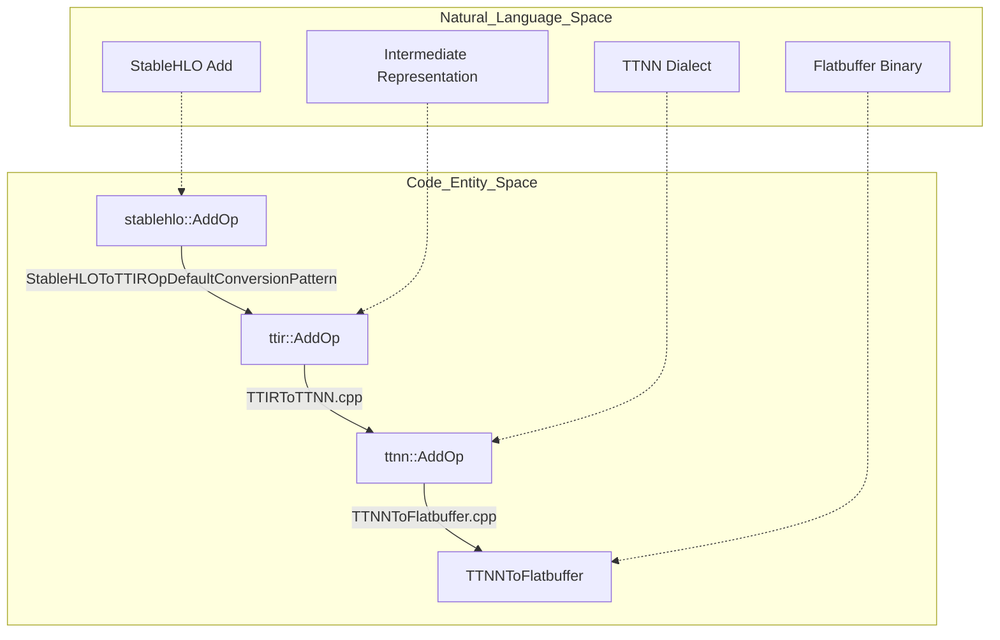
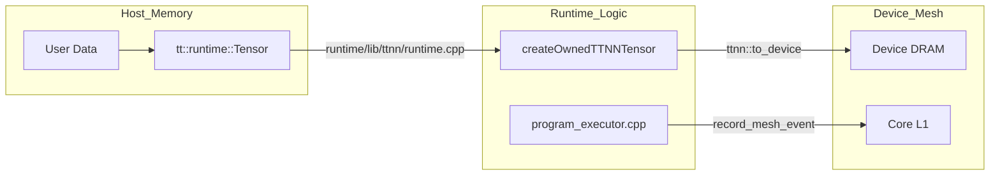
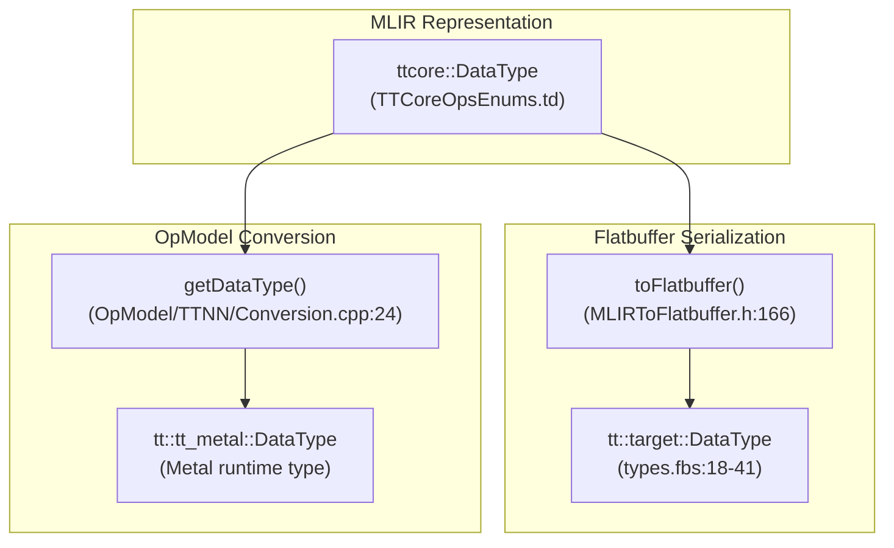
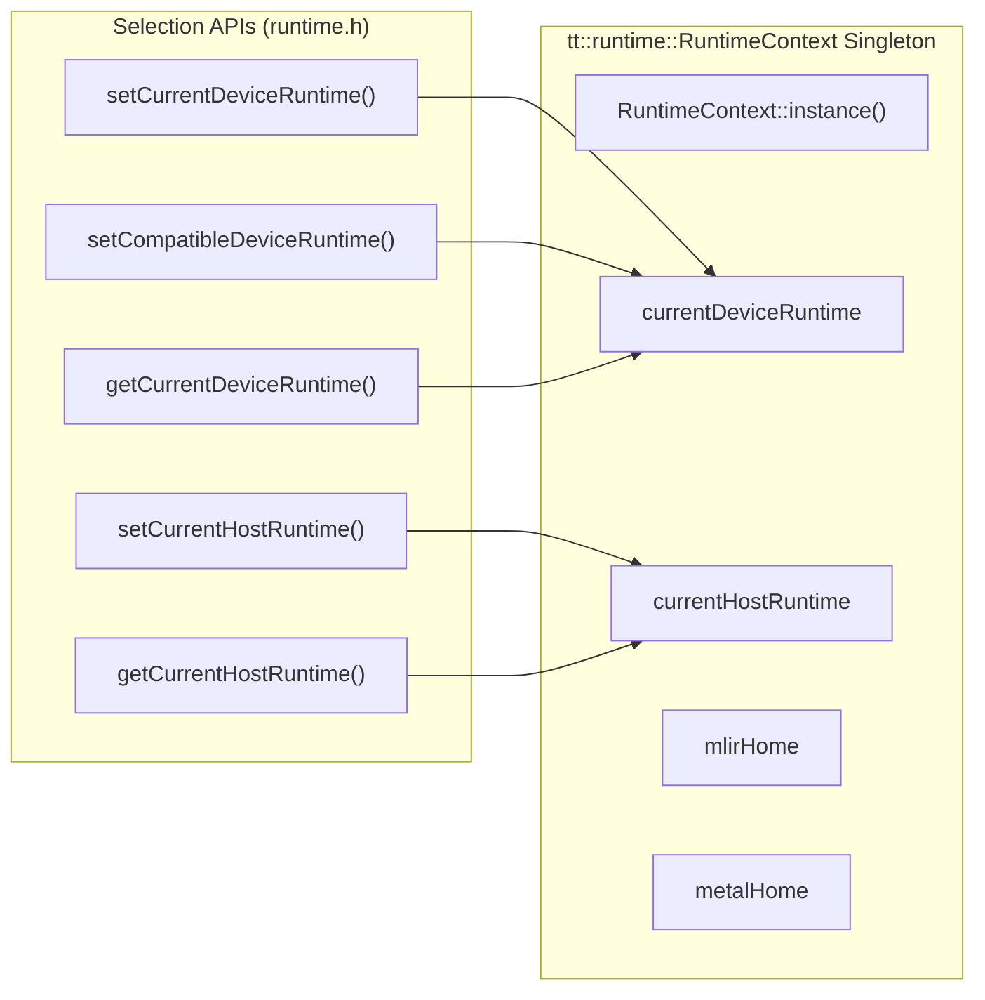
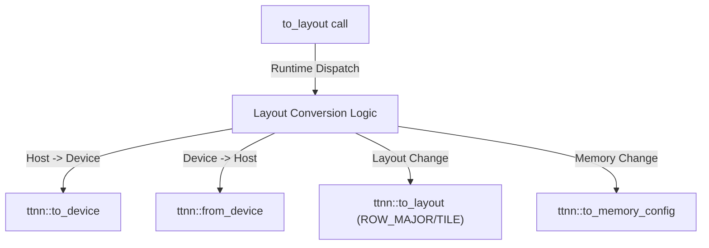
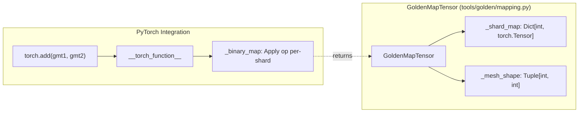
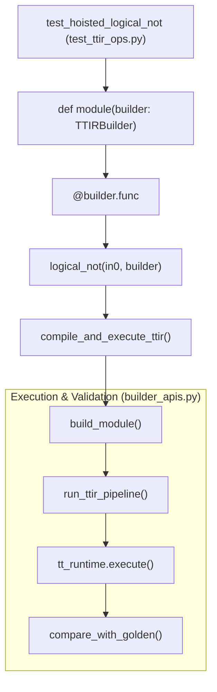
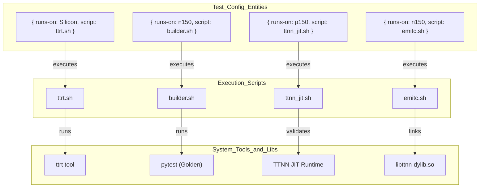

# Glossary

Relevant source files
*   [.claude/skills/add-op/references/ttnn_type_mapping.md](https://github.com/tenstorrent/tt-mlir/blob/c7d92e92/.claude/skills/add-op/references/ttnn_type_mapping.md?plain=1)
*   [include/ttmlir-c/TTAttrs.h](https://github.com/tenstorrent/tt-mlir/blob/c7d92e92/include/ttmlir-c/TTAttrs.h)
*   [include/ttmlir/Dialect/D2M/IR/D2MGenericRegionOps.td](https://github.com/tenstorrent/tt-mlir/blob/c7d92e92/include/ttmlir/Dialect/D2M/IR/D2MGenericRegionOps.td)
*   [include/ttmlir/Dialect/D2M/IR/D2MOps.td](https://github.com/tenstorrent/tt-mlir/blob/c7d92e92/include/ttmlir/Dialect/D2M/IR/D2MOps.td)
*   [include/ttmlir/Dialect/D2M/Utils/Utils.h](https://github.com/tenstorrent/tt-mlir/blob/c7d92e92/include/ttmlir/Dialect/D2M/Utils/Utils.h)
*   [include/ttmlir/Dialect/SFPI/IR/SFPIOpsTypes.td](https://github.com/tenstorrent/tt-mlir/blob/c7d92e92/include/ttmlir/Dialect/SFPI/IR/SFPIOpsTypes.td)
*   [include/ttmlir/Dialect/TTCore/IR/TTCoreOpsEnums.td](https://github.com/tenstorrent/tt-mlir/blob/c7d92e92/include/ttmlir/Dialect/TTCore/IR/TTCoreOpsEnums.td)
*   [include/ttmlir/Dialect/TTCore/IR/TTCoreOpsTypes.td](https://github.com/tenstorrent/tt-mlir/blob/c7d92e92/include/ttmlir/Dialect/TTCore/IR/TTCoreOpsTypes.td)
*   [include/ttmlir/Dialect/TTCore/Transforms/Passes.td](https://github.com/tenstorrent/tt-mlir/blob/c7d92e92/include/ttmlir/Dialect/TTCore/Transforms/Passes.td)
*   [include/ttmlir/Dialect/TTIR/IR/TTIROps.td](https://github.com/tenstorrent/tt-mlir/blob/c7d92e92/include/ttmlir/Dialect/TTIR/IR/TTIROps.td)
*   [include/ttmlir/Dialect/TTKernel/IR/TTKernelOps.td](https://github.com/tenstorrent/tt-mlir/blob/c7d92e92/include/ttmlir/Dialect/TTKernel/IR/TTKernelOps.td)
*   [include/ttmlir/Dialect/TTNN/IR/TTNNOps.td](https://github.com/tenstorrent/tt-mlir/blob/c7d92e92/include/ttmlir/Dialect/TTNN/IR/TTNNOps.td)
*   [include/ttmlir/OpModel/TTNN/MetalHeaders.h](https://github.com/tenstorrent/tt-mlir/blob/c7d92e92/include/ttmlir/OpModel/TTNN/MetalHeaders.h)
*   [include/ttmlir/OpModel/TTNN/TTNNOpModel.h](https://github.com/tenstorrent/tt-mlir/blob/c7d92e92/include/ttmlir/OpModel/TTNN/TTNNOpModel.h)
*   [include/ttmlir/Target/Common/types.fbs](https://github.com/tenstorrent/tt-mlir/blob/c7d92e92/include/ttmlir/Target/Common/types.fbs)
*   [include/ttmlir/Target/TTKernel/TTKernelIncludesMap.h](https://github.com/tenstorrent/tt-mlir/blob/c7d92e92/include/ttmlir/Target/TTKernel/TTKernelIncludesMap.h)
*   [include/ttmlir/Target/TTNN/program.fbs](https://github.com/tenstorrent/tt-mlir/blob/c7d92e92/include/ttmlir/Target/TTNN/program.fbs)
*   [include/ttmlir/Target/Utils/MLIRToFlatbuffer.h](https://github.com/tenstorrent/tt-mlir/blob/c7d92e92/include/ttmlir/Target/Utils/MLIRToFlatbuffer.h)
*   [lib/CAPI/TTCoreAttrs.cpp](https://github.com/tenstorrent/tt-mlir/blob/c7d92e92/lib/CAPI/TTCoreAttrs.cpp)
*   [lib/Conversion/D2MToTTKernel/D2MToTTKernel.cpp](https://github.com/tenstorrent/tt-mlir/blob/c7d92e92/lib/Conversion/D2MToTTKernel/D2MToTTKernel.cpp)
*   [lib/Conversion/StableHLOToTTIR/StableHLOToTTIRPatterns.cpp](https://github.com/tenstorrent/tt-mlir/blob/c7d92e92/lib/Conversion/StableHLOToTTIR/StableHLOToTTIRPatterns.cpp)
*   [lib/Conversion/TTIRToD2M/TTIRToD2M.cpp](https://github.com/tenstorrent/tt-mlir/blob/c7d92e92/lib/Conversion/TTIRToD2M/TTIRToD2M.cpp)
*   [lib/Conversion/TTIRToTTNN/TTIRToTTNN.cpp](https://github.com/tenstorrent/tt-mlir/blob/c7d92e92/lib/Conversion/TTIRToTTNN/TTIRToTTNN.cpp)
*   [lib/Conversion/TTKernelToEmitC/TTKernelToEmitC.cpp](https://github.com/tenstorrent/tt-mlir/blob/c7d92e92/lib/Conversion/TTKernelToEmitC/TTKernelToEmitC.cpp)
*   [lib/Conversion/TTNNToEmitC/TTNNToEmitC.cpp](https://github.com/tenstorrent/tt-mlir/blob/c7d92e92/lib/Conversion/TTNNToEmitC/TTNNToEmitC.cpp)
*   [lib/Dialect/D2M/IR/D2MGenericRegionOps.cpp](https://github.com/tenstorrent/tt-mlir/blob/c7d92e92/lib/Dialect/D2M/IR/D2MGenericRegionOps.cpp)
*   [lib/Dialect/D2M/IR/D2MOps.cpp](https://github.com/tenstorrent/tt-mlir/blob/c7d92e92/lib/Dialect/D2M/IR/D2MOps.cpp)
*   [lib/Dialect/D2M/Transforms/GridSelection.cpp](https://github.com/tenstorrent/tt-mlir/blob/c7d92e92/lib/Dialect/D2M/Transforms/GridSelection.cpp)
*   [lib/Dialect/D2M/Transforms/LowerToLayout/LowerToLayout.cpp](https://github.com/tenstorrent/tt-mlir/blob/c7d92e92/lib/Dialect/D2M/Transforms/LowerToLayout/LowerToLayout.cpp)
*   [lib/Dialect/D2M/Transforms/LowerToLayout/Plan.cpp](https://github.com/tenstorrent/tt-mlir/blob/c7d92e92/lib/Dialect/D2M/Transforms/LowerToLayout/Plan.cpp)
*   [lib/Dialect/D2M/Transforms/MarkSynchronizedBuffers.cpp](https://github.com/tenstorrent/tt-mlir/blob/c7d92e92/lib/Dialect/D2M/Transforms/MarkSynchronizedBuffers.cpp)
*   [lib/Dialect/D2M/Utils/Utils.cpp](https://github.com/tenstorrent/tt-mlir/blob/c7d92e92/lib/Dialect/D2M/Utils/Utils.cpp)
*   [lib/Dialect/TTCore/IR/TTCoreOpsTypes.cpp](https://github.com/tenstorrent/tt-mlir/blob/c7d92e92/lib/Dialect/TTCore/IR/TTCoreOpsTypes.cpp)
*   [lib/Dialect/TTIR/IR/TTIROps.cpp](https://github.com/tenstorrent/tt-mlir/blob/c7d92e92/lib/Dialect/TTIR/IR/TTIROps.cpp)
*   [lib/Dialect/TTKernel/IR/TTKernelOps.cpp](https://github.com/tenstorrent/tt-mlir/blob/c7d92e92/lib/Dialect/TTKernel/IR/TTKernelOps.cpp)
*   [lib/Dialect/TTNN/IR/TTNNOps.cpp](https://github.com/tenstorrent/tt-mlir/blob/c7d92e92/lib/Dialect/TTNN/IR/TTNNOps.cpp)
*   [lib/Dialect/TTNN/Interfaces/TTNNOpModelInterface.cpp](https://github.com/tenstorrent/tt-mlir/blob/c7d92e92/lib/Dialect/TTNN/Interfaces/TTNNOpModelInterface.cpp)
*   [lib/OpModel/TTNN/TTNNOpModel.cpp](https://github.com/tenstorrent/tt-mlir/blob/c7d92e92/lib/OpModel/TTNN/TTNNOpModel.cpp)
*   [lib/Target/TTKernel/TTKernelToCpp.cpp](https://github.com/tenstorrent/tt-mlir/blob/c7d92e92/lib/Target/TTKernel/TTKernelToCpp.cpp)
*   [lib/Target/TTNN/TTNNToFlatbuffer.cpp](https://github.com/tenstorrent/tt-mlir/blob/c7d92e92/lib/Target/TTNN/TTNNToFlatbuffer.cpp)
*   [python/TTModule.cpp](https://github.com/tenstorrent/tt-mlir/blob/c7d92e92/python/TTModule.cpp)
*   [runtime/include/tt/runtime/detail/ttmetal/ttmetal.h](https://github.com/tenstorrent/tt-mlir/blob/c7d92e92/runtime/include/tt/runtime/detail/ttmetal/ttmetal.h)
*   [runtime/include/tt/runtime/detail/ttnn/ttnn.h](https://github.com/tenstorrent/tt-mlir/blob/c7d92e92/runtime/include/tt/runtime/detail/ttnn/ttnn.h)
*   [runtime/include/tt/runtime/runtime.h](https://github.com/tenstorrent/tt-mlir/blob/c7d92e92/runtime/include/tt/runtime/runtime.h)
*   [runtime/include/tt/runtime/types.h](https://github.com/tenstorrent/tt-mlir/blob/c7d92e92/runtime/include/tt/runtime/types.h)
*   [runtime/lib/binary.cpp](https://github.com/tenstorrent/tt-mlir/blob/c7d92e92/runtime/lib/binary.cpp)
*   [runtime/lib/common/system_desc.cpp](https://github.com/tenstorrent/tt-mlir/blob/c7d92e92/runtime/lib/common/system_desc.cpp)
*   [runtime/lib/runtime.cpp](https://github.com/tenstorrent/tt-mlir/blob/c7d92e92/runtime/lib/runtime.cpp)
*   [runtime/lib/ttmetal/runtime.cpp](https://github.com/tenstorrent/tt-mlir/blob/c7d92e92/runtime/lib/ttmetal/runtime.cpp)
*   [runtime/lib/ttnn/operations/CMakeLists.txt](https://github.com/tenstorrent/tt-mlir/blob/c7d92e92/runtime/lib/ttnn/operations/CMakeLists.txt)
*   [runtime/lib/ttnn/program_executor.cpp](https://github.com/tenstorrent/tt-mlir/blob/c7d92e92/runtime/lib/ttnn/program_executor.cpp)
*   [runtime/lib/ttnn/runtime.cpp](https://github.com/tenstorrent/tt-mlir/blob/c7d92e92/runtime/lib/ttnn/runtime.cpp)
*   [runtime/python/binary/binary.cpp](https://github.com/tenstorrent/tt-mlir/blob/c7d92e92/runtime/python/binary/binary.cpp)
*   [runtime/python/runtime/runtime.cpp](https://github.com/tenstorrent/tt-mlir/blob/c7d92e92/runtime/python/runtime/runtime.cpp)
*   [test/python/golden/d2m/test_dma.py](https://github.com/tenstorrent/tt-mlir/blob/c7d92e92/test/python/golden/d2m/test_dma.py)
*   [test/python/golden/d2m/test_dram_ops.py](https://github.com/tenstorrent/tt-mlir/blob/c7d92e92/test/python/golden/d2m/test_dram_ops.py)
*   [test/ttmlir/Conversion/StableHLOToTTIR/scatter_op.mlir](https://github.com/tenstorrent/tt-mlir/blob/c7d92e92/test/ttmlir/Conversion/StableHLOToTTIR/scatter_op.mlir)
*   [test/ttmlir/Conversion/TTIRToD2M/named_to_generic.mlir](https://github.com/tenstorrent/tt-mlir/blob/c7d92e92/test/ttmlir/Conversion/TTIRToD2M/named_to_generic.mlir)
*   [test/ttmlir/Conversion/TTKernelToEmitC/ttkernel.mlir](https://github.com/tenstorrent/tt-mlir/blob/c7d92e92/test/ttmlir/Conversion/TTKernelToEmitC/ttkernel.mlir)
*   [test/ttmlir/Dialect/D2M/Transforms/grid_selection.mlir](https://github.com/tenstorrent/tt-mlir/blob/c7d92e92/test/ttmlir/Dialect/D2M/Transforms/grid_selection.mlir)
*   [test/ttmlir/Dialect/D2M/Transforms/lower_to_layout_host_dram.mlir](https://github.com/tenstorrent/tt-mlir/blob/c7d92e92/test/ttmlir/Dialect/D2M/Transforms/lower_to_layout_host_dram.mlir)
*   [test/ttmlir/Dialect/D2M/Transforms/lower_to_layout_sharded_to_interleaved.mlir](https://github.com/tenstorrent/tt-mlir/blob/c7d92e92/test/ttmlir/Dialect/D2M/Transforms/lower_to_layout_sharded_to_interleaved.mlir)
*   [test/ttmlir/Dialect/D2M/generic/mark_synchronized_buffers.mlir](https://github.com/tenstorrent/tt-mlir/blob/c7d92e92/test/ttmlir/Dialect/D2M/generic/mark_synchronized_buffers.mlir)
*   [test/ttmlir/Dialect/D2M/lower_to_layout.mlir](https://github.com/tenstorrent/tt-mlir/blob/c7d92e92/test/ttmlir/Dialect/D2M/lower_to_layout.mlir)
*   [test/ttmlir/Dialect/TTKernel/canonicalize_barriers.mlir](https://github.com/tenstorrent/tt-mlir/blob/c7d92e92/test/ttmlir/Dialect/TTKernel/canonicalize_barriers.mlir)
*   [test/ttmlir/Dialect/TTKernel/invalid.mlir](https://github.com/tenstorrent/tt-mlir/blob/c7d92e92/test/ttmlir/Dialect/TTKernel/invalid.mlir)
*   [test/ttmlir/Dialect/TTKernel/ops.mlir](https://github.com/tenstorrent/tt-mlir/blob/c7d92e92/test/ttmlir/Dialect/TTKernel/ops.mlir)
*   [test/ttmlir/Dialect/TTKernel/remote_sram_write_u32_invalid.mlir](https://github.com/tenstorrent/tt-mlir/blob/c7d92e92/test/ttmlir/Dialect/TTKernel/remote_sram_write_u32_invalid.mlir)
*   [test/ttmlir/Dialect/TTNN/simple_scatter.mlir](https://github.com/tenstorrent/tt-mlir/blob/c7d92e92/test/ttmlir/Dialect/TTNN/simple_scatter.mlir)
*   [test/ttmlir/Translate/TTKernel/ttkernel_noc.mlir](https://github.com/tenstorrent/tt-mlir/blob/c7d92e92/test/ttmlir/Translate/TTKernel/ttkernel_noc.mlir)
*   [test/unittests/LowerToLayout/TestPlan.cpp](https://github.com/tenstorrent/tt-mlir/blob/c7d92e92/test/unittests/LowerToLayout/TestPlan.cpp)
*   [test/unittests/OpModel/TTNN/Lib/TestOpModelLib.cpp](https://github.com/tenstorrent/tt-mlir/blob/c7d92e92/test/unittests/OpModel/TTNN/Lib/TestOpModelLib.cpp)
*   [test/unittests/OpModel/TTNN/Op/TestOpModelInterface.cpp](https://github.com/tenstorrent/tt-mlir/blob/c7d92e92/test/unittests/OpModel/TTNN/Op/TestOpModelInterface.cpp)

This page provides definitions and technical context for codebase-specific terms, jargon, and domain concepts used within the `tt-mlir` project. It serves as a reference for onboarding engineers to understand the mapping between high-level Tenstorrent hardware concepts and their representation in the MLIR dialects and runtime.

## Core Architectural Terms

### Tiling and Tiles

The fundamental data unit in Tenstorrent hardware. Tensors are typically divided into tiles, commonly of size $32 \times 32$.

*   **Implementation**: Represented in the `TTNN` dialect via `ttnn::Layout::Tile`[lib/Conversion/TTIRToTTNN/TTIRToTTNN.cpp 65-67](https://github.com/tenstorrent/tt-mlir/blob/c7d92e92/lib/Conversion/TTIRToTTNN/TTIRToTTNN.cpp#L65-L67)
*   **Layout Casts**: Tensors can transition between Row-Major and Tiled layouts using the `ToLayoutOp`[include/ttmlir/Dialect/TTNN/IR/TTNNOps.td 58-65](https://github.com/tenstorrent/tt-mlir/blob/c7d92e92/include/ttmlir/Dialect/TTNN/IR/TTNNOps.td#L58-L65)

### Memory Configurations (MemoryConfig)

Defines how a tensor is stored on the device, including the buffer type (DRAM, L1, SystemMemory) and the sharding strategy.

*   **Code Entity**: `TTNN_MemoryConfigAttr`[include/ttmlir/Dialect/TTNN/IR/TTNNOps.td 12](https://github.com/tenstorrent/tt-mlir/blob/c7d92e92/include/ttmlir/Dialect/TTNN/IR/TTNNOps.td#L12-L12)
*   **Usage**: Operations like `ToMemoryConfigOp` handle transitions between DRAM and L1, or Interleaved and Sharded layouts [include/ttmlir/Dialect/TTNN/IR/TTNNOps.td 40-50](https://github.com/tenstorrent/tt-mlir/blob/c7d92e92/include/ttmlir/Dialect/TTNN/IR/TTNNOps.td#L40-L50)

### Grid and Mesh

*   **Grid**: A 2D array of Tensix cores on a single chip. Represented by `GridAttr`[include/ttmlir/Dialect/TTCore/IR/TTCoreOpsTypes.td 158-164](https://github.com/tenstorrent/tt-mlir/blob/c7d92e92/include/ttmlir/Dialect/TTCore/IR/TTCoreOpsTypes.td#L158-L164)
*   **Mesh**: A collection of devices (chips) acting as a single logical compute unit.
*   **Submesh**: A subset of a parent device mesh, retrieved via `GetDeviceOp`[include/ttmlir/Dialect/TTNN/IR/TTNNOps.td 27-32](https://github.com/tenstorrent/tt-mlir/blob/c7d92e92/include/ttmlir/Dialect/TTNN/IR/TTNNOps.td#L27-L32)

Sources: [include/ttmlir/Dialect/TTNN/IR/TTNNOps.td 12-65](https://github.com/tenstorrent/tt-mlir/blob/c7d92e92/include/ttmlir/Dialect/TTNN/IR/TTNNOps.td#L12-L65)[lib/Conversion/TTIRToTTNN/TTIRToTTNN.cpp 65-67](https://github.com/tenstorrent/tt-mlir/blob/c7d92e92/lib/Conversion/TTIRToTTNN/TTIRToTTNN.cpp#L65-L67)[include/ttmlir/Dialect/TTCore/IR/TTCoreOpsTypes.td 158-164](https://github.com/tenstorrent/tt-mlir/blob/c7d92e92/include/ttmlir/Dialect/TTCore/IR/TTCoreOpsTypes.td#L158-L164)

* * *

## Dialect and Transformation Terms

### DPS (Destination Passing Style)

A pattern where an operation takes an explicit "output" or "init" buffer as an argument instead of allocating its own result. This is a core concept for bufferization.

*   **Implementation**: `TTIR_DPSOp` class in the TTIR dialect [include/ttmlir/Dialect/TTIR/IR/TTIROps.td 24-30](https://github.com/tenstorrent/tt-mlir/blob/c7d92e92/include/ttmlir/Dialect/TTIR/IR/TTIROps.td#L24-L30)
*   **Key Function**: `getDpsInitsMutable()` retrieves the output operands [include/ttmlir/Dialect/TTIR/IR/TTIROps.td 28](https://github.com/tenstorrent/tt-mlir/blob/c7d92e92/include/ttmlir/Dialect/TTIR/IR/TTIROps.td#L28-L28)

### Layout Casting

The process of reinterpreting or converting tensor metadata (layout, data type, memory space) without necessarily changing the underlying data on host, or performing a physical move on device.

*   **TTIR to TTNN**: Handled by `ToLayoutOpConversionPattern`[lib/Conversion/TTIRToTTNN/TTIRToTTNN.cpp 169-176](https://github.com/tenstorrent/tt-mlir/blob/c7d92e92/lib/Conversion/TTIRToTTNN/TTIRToTTNN.cpp#L169-L176)
*   **Metal Cast**: `TTNNMetalLayoutCastOp` reinterprets between `#ttnn.ttnn_layout` and `#ttcore.metal_layout`[include/ttmlir/Dialect/TTIR/IR/TTIROps.td 93-107](https://github.com/tenstorrent/tt-mlir/blob/c7d92e92/include/ttmlir/Dialect/TTIR/IR/TTIROps.td#L93-L107)

### OpModel

An infrastructure for querying hardware-specific constraints and performance estimates (runtime, memory usage) for specific operations.

*   **Implementation**: `TTNNOpModel` utilizes `query_op_constraints` and `query_op_runtime` from the underlying `ttnn` graph API [lib/OpModel/TTNN/TTNNOpModel.cpp 50-55](https://github.com/tenstorrent/tt-mlir/blob/c7d92e92/lib/OpModel/TTNN/TTNNOpModel.cpp#L50-L55)
*   **Validation**: It checks for peak memory usage and validates valid output layouts [lib/OpModel/TTNN/TTNNOpModel.cpp 158-163](https://github.com/tenstorrent/tt-mlir/blob/c7d92e92/lib/OpModel/TTNN/TTNNOpModel.cpp#L158-L163)

Sources: [include/ttmlir/Dialect/TTIR/IR/TTIROps.td 24-107](https://github.com/tenstorrent/tt-mlir/blob/c7d92e92/include/ttmlir/Dialect/TTIR/IR/TTIROps.td#L24-L107)[lib/Conversion/TTIRToTTNN/TTIRToTTNN.cpp 169-176](https://github.com/tenstorrent/tt-mlir/blob/c7d92e92/lib/Conversion/TTIRToTTNN/TTIRToTTNN.cpp#L169-L176)[lib/OpModel/TTNN/TTNNOpModel.cpp 50-163](https://github.com/tenstorrent/tt-mlir/blob/c7d92e92/lib/OpModel/TTNN/TTNNOpModel.cpp#L50-L163)

* * *

## System Diagrams

### Data Flow: From Frontend to Binary


Sources: [lib/Conversion/StableHLOToTTIR/StableHLOToTTIRPatterns.cpp:187-198](), [lib/Conversion/TTIRToTTNN/TTIRToTTNN.cpp:5-18](), [lib/Target/TTNN/TTNNToFlatbuffer.cpp:17-25]()
```


The following diagram illustrates how a high-level operation flows through the compiler stages into a serialized Flatbuffer.

Title: "Compilation Pipeline Entity Mapping"

Sources: [lib/Conversion/StableHLOToTTIR/StableHLOToTTIRPatterns.cpp 187-198](https://github.com/tenstorrent/tt-mlir/blob/c7d92e92/lib/Conversion/StableHLOToTTIR/StableHLOToTTIRPatterns.cpp#L187-L198)[lib/Conversion/TTIRToTTNN/TTIRToTTNN.cpp 5-18](https://github.com/tenstorrent/tt-mlir/blob/c7d92e92/lib/Conversion/TTIRToTTNN/TTIRToTTNN.cpp#L5-L18)[lib/Target/TTNN/TTNNToFlatbuffer.cpp 17-25](https://github.com/tenstorrent/tt-mlir/blob/c7d92e92/lib/Target/TTNN/TTNNToFlatbuffer.cpp#L17-L25)

### Runtime and Memory Management


Sources: [runtime/lib/ttnn/runtime.cpp:43-46](), [runtime/lib/ttnn/runtime.cpp:128-135](), [runtime/lib/ttnn/runtime.cpp:164-166]()

---
```


This diagram shows how the Runtime system manages tensors and dispatches programs to the hardware.

Title: "Runtime Memory and Execution Flow"

Sources: [runtime/lib/ttnn/runtime.cpp 43-46](https://github.com/tenstorrent/tt-mlir/blob/c7d92e92/runtime/lib/ttnn/runtime.cpp#L43-L46)[runtime/lib/ttnn/runtime.cpp 128-135](https://github.com/tenstorrent/tt-mlir/blob/c7d92e92/runtime/lib/ttnn/runtime.cpp#L128-L135)[runtime/lib/ttnn/runtime.cpp 164-166](https://github.com/tenstorrent/tt-mlir/blob/c7d92e92/runtime/lib/ttnn/runtime.cpp#L164-L166)

* * *

## Technical Jargon and Abbreviations

| Term | Definition | Code Pointer |
| --- | --- | --- |
| **CB** | Circular Buffer: A region in L1 memory used for data movement between Tensix cores. | [lib/OpModel/TTNN/TTNNOpModel.cpp 158](https://github.com/tenstorrent/tt-mlir/blob/c7d92e92/lib/OpModel/TTNN/TTNNOpModel.cpp#L158-L158) |
| **L1** | Local SRAM memory on each Tensix core. | [include/ttmlir/Dialect/TTIR/IR/TTIROps.td 41](https://github.com/tenstorrent/tt-mlir/blob/c7d92e92/include/ttmlir/Dialect/TTIR/IR/TTIROps.td#L41-L41) |
| **Tilize** | The process of converting a Row-Major tensor to the Tiled hardware format. | [include/ttmlir/Dialect/TTNN/IR/TTNNOps.td 62](https://github.com/tenstorrent/tt-mlir/blob/c7d92e92/include/ttmlir/Dialect/TTNN/IR/TTNNOps.td#L62-L62) |
| **Untilize** | The inverse of Tilize; converting Tiled data back to Row-Major. | [runtime/lib/ttnn/runtime.cpp 107-109](https://github.com/tenstorrent/tt-mlir/blob/c7d92e92/runtime/lib/ttnn/runtime.cpp#L107-L109) |
| **System Memory** | Host-side memory, typically where tensors reside before being moved to the device. | [lib/Conversion/TTIRToTTNN/TTIRToTTNN.cpp 73](https://github.com/tenstorrent/tt-mlir/blob/c7d92e92/lib/Conversion/TTIRToTTNN/TTIRToTTNN.cpp#L73-L73) |
| **MeshDevice** | A software abstraction for a collection of physical Tenstorrent chips. | [lib/Conversion/TTNNToEmitC/TTNNToEmitC.cpp 43-46](https://github.com/tenstorrent/tt-mlir/blob/c7d92e92/lib/Conversion/TTNNToEmitC/TTNNToEmitC.cpp#L43-L46) |
| **EmitC** | MLIR dialect used as an intermediate step to generate C++ source code for host runtime. | [lib/Conversion/TTNNToEmitC/TTNNToEmitC.cpp 102-104](https://github.com/tenstorrent/tt-mlir/blob/c7d92e92/lib/Conversion/TTNNToEmitC/TTNNToEmitC.cpp#L102-L104) |
| **Flatbuffer** | The serialization format used for the final compiled Tenstorrent binary. | [lib/Target/TTNN/TTNNToFlatbuffer.cpp 17-25](https://github.com/tenstorrent/tt-mlir/blob/c7d92e92/lib/Target/TTNN/TTNNToFlatbuffer.cpp#L17-L25) |
| **DST** | Destination registers in the Tensix core; used to store results of compute operations before packing to L1. | [include/ttmlir/Dialect/TTKernel/IR/TTKernelOps.td 61-64](https://github.com/tenstorrent/tt-mlir/blob/c7d92e92/include/ttmlir/Dialect/TTKernel/IR/TTKernelOps.td#L61-L64) |

* * *

## Low-Level Kernel Concepts (TTKernel)

### Hardware Synchronization

Tenstorrent kernels use hardware semaphores and sync primitives to coordinate between the Unpack, Math, and Pack threads.

*   **TTKernel_TileRegsAcquireOp**: MATH thread locks the DST register for computation [include/ttmlir/Dialect/TTKernel/IR/TTKernelOps.td 58-69](https://github.com/tenstorrent/tt-mlir/blob/c7d92e92/include/ttmlir/Dialect/TTKernel/IR/TTKernelOps.td#L58-L69)
*   **TTKernel_TileRegsCommitOp**: MATH thread releases the DST register [include/ttmlir/Dialect/TTKernel/IR/TTKernelOps.td 71-80](https://github.com/tenstorrent/tt-mlir/blob/c7d92e92/include/ttmlir/Dialect/TTKernel/IR/TTKernelOps.td#L71-L80)
*   **TTKernel_TileRegsWaitOp**: PACK thread waits for MATH to finish before moving data from DST to L1 [include/ttmlir/Dialect/TTKernel/IR/TTKernelOps.td 82-93](https://github.com/tenstorrent/tt-mlir/blob/c7d92e92/include/ttmlir/Dialect/TTKernel/IR/TTKernelOps.td#L82-L93)

### Data Formats

The hardware supports various compressed and high-precision formats.

*   **Implementation**: Handled by `DataType` enums and converted to TTNN types.
*   **Examples**: `FLOAT32`, `BFLOAT16`, `UINT32`, `UINT16`, `UINT8`, `INT32`[runtime/lib/ttnn/runtime.cpp 78-94](https://github.com/tenstorrent/tt-mlir/blob/c7d92e92/runtime/lib/ttnn/runtime.cpp#L78-L94)

Sources: [runtime/lib/ttnn/runtime.cpp 43-97](https://github.com/tenstorrent/tt-mlir/blob/c7d92e92/runtime/lib/ttnn/runtime.cpp#L43-L97)[lib/OpModel/TTNN/TTNNOpModel.cpp 50-163](https://github.com/tenstorrent/tt-mlir/blob/c7d92e92/lib/OpModel/TTNN/TTNNOpModel.cpp#L50-L163)[include/ttmlir/Dialect/TTNN/IR/TTNNOps.td 27-75](https://github.com/tenstorrent/tt-mlir/blob/c7d92e92/include/ttmlir/Dialect/TTNN/IR/TTNNOps.td#L27-L75)[include/ttmlir/Dialect/TTKernel/IR/TTKernelOps.td 58-93](https://github.com/tenstorrent/tt-mlir/blob/c7d92e92/include/ttmlir/Dialect/TTKernel/IR/TTKernelOps.td#L58-L93)

Dismiss
Refresh this wiki

Enter email to refresh

## Additional Diagrams


#### DataType Conversion




Sources: [include/ttmlir/Target/Utils/MLIRToFlatbuffer.h:166-198](), [lib/OpModel/TTNN/Conversion.cpp:24-45]()
```


#### Runtime Context Management




Sources: [runtime/lib/runtime.cpp:170-225](), [runtime/include/tt/runtime/runtime.h:35-42](), [runtime/include/tt/runtime/detail/common/runtime_context.h:10-40]()

---
```


#### Layout Conversion Logic





#### GoldenMapTensor Class




**Key Features** [tools/golden/mapping.py:50-143]():

| Feature | Description |
|---------|-------------|
| **Attribute forwarding** | Read-only tensor attributes (shape, dtype, etc.) forwarded to first shard [tools/golden/mapping.py:50-69]() |
| **Mutating methods** | Operations like `to()`, `reshape()`, `permute()` return new `GoldenMapTensor` instances [tools/golden/mapping.py:72-96]() |
| **BF16 Upcasting** | Automatically upcasts BF16 for CPU matmuls to avoid slowness on hardware without BF16 support [tools/golden/mapping.py:98-99]() |
| **Runtime conversion** | `golden_map_tensor_as_torch_tensors()` ensures shards are contiguous and compatible with runtime [tools/golden/mapping.py:138-153]() |

Sources: [tools/golden/mapping.py:36-153]()

---
```


#### Test Function Structure




**Key API Functions** [tools/builder/base/builder_apis.py:46-127]():

| Function | Purpose |
|----------|---------|
| `compile_and_execute_ttir()` | Orchestrates full pipeline for `TTIR` dialect [tools/builder/base/builder_apis.py:46-74]() |
| `compile_and_execute_shlo()` | Orchestrates full pipeline for `StableHLO` dialect [tools/builder/base/builder_apis.py:76-104]() |
| `build_module()` | Context manager that handles builder instantiation and module construction [tools/builder/base/builder_apis.py:150-184]() |

Sources: [test/python/golden/test_ttir_ops.py:47-71](), [tools/builder/base/builder_apis.py:46-184]()

---
```


#### Test Definitions




Sources: [.github/settings/tests.json:1-43](), [.github/test_scripts/builder.sh:12-35]()
```

