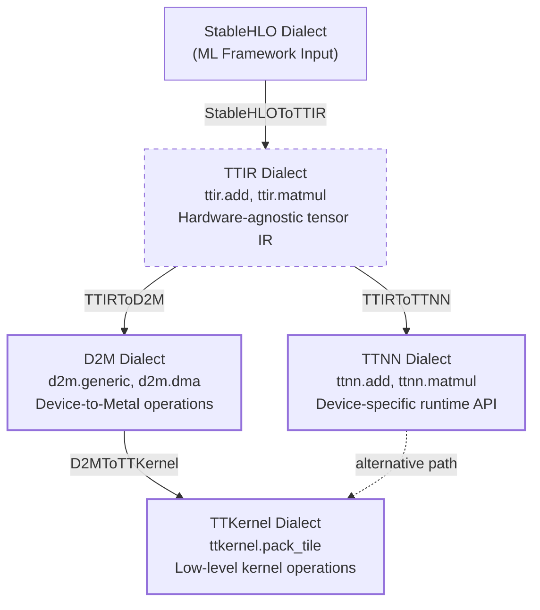
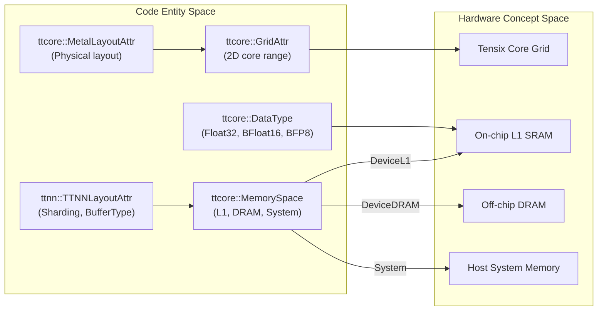

# Core MLIR Dialects

Relevant source files
*   [include/ttmlir/Dialect/D2M/IR/D2MGenericRegionOps.td](https://github.com/tenstorrent/tt-mlir/blob/c7d92e92/include/ttmlir/Dialect/D2M/IR/D2MGenericRegionOps.td)
*   [include/ttmlir/Dialect/D2M/IR/D2MOps.td](https://github.com/tenstorrent/tt-mlir/blob/c7d92e92/include/ttmlir/Dialect/D2M/IR/D2MOps.td)
*   [include/ttmlir/Dialect/D2M/Utils/Utils.h](https://github.com/tenstorrent/tt-mlir/blob/c7d92e92/include/ttmlir/Dialect/D2M/Utils/Utils.h)
*   [include/ttmlir/Dialect/TTIR/IR/TTIROps.td](https://github.com/tenstorrent/tt-mlir/blob/c7d92e92/include/ttmlir/Dialect/TTIR/IR/TTIROps.td)
*   [include/ttmlir/Dialect/TTKernel/IR/TTKernelOps.td](https://github.com/tenstorrent/tt-mlir/blob/c7d92e92/include/ttmlir/Dialect/TTKernel/IR/TTKernelOps.td)
*   [include/ttmlir/Dialect/TTNN/IR/TTNNOps.td](https://github.com/tenstorrent/tt-mlir/blob/c7d92e92/include/ttmlir/Dialect/TTNN/IR/TTNNOps.td)
*   [include/ttmlir/Target/TTKernel/TTKernelIncludesMap.h](https://github.com/tenstorrent/tt-mlir/blob/c7d92e92/include/ttmlir/Target/TTKernel/TTKernelIncludesMap.h)
*   [include/ttmlir/Target/TTNN/program.fbs](https://github.com/tenstorrent/tt-mlir/blob/c7d92e92/include/ttmlir/Target/TTNN/program.fbs)
*   [lib/Conversion/D2MToTTKernel/D2MToTTKernel.cpp](https://github.com/tenstorrent/tt-mlir/blob/c7d92e92/lib/Conversion/D2MToTTKernel/D2MToTTKernel.cpp)
*   [lib/Conversion/StableHLOToTTIR/StableHLOToTTIRPatterns.cpp](https://github.com/tenstorrent/tt-mlir/blob/c7d92e92/lib/Conversion/StableHLOToTTIR/StableHLOToTTIRPatterns.cpp)
*   [lib/Conversion/TTIRToD2M/TTIRToD2M.cpp](https://github.com/tenstorrent/tt-mlir/blob/c7d92e92/lib/Conversion/TTIRToD2M/TTIRToD2M.cpp)
*   [lib/Conversion/TTIRToTTNN/TTIRToTTNN.cpp](https://github.com/tenstorrent/tt-mlir/blob/c7d92e92/lib/Conversion/TTIRToTTNN/TTIRToTTNN.cpp)
*   [lib/Conversion/TTKernelToEmitC/TTKernelToEmitC.cpp](https://github.com/tenstorrent/tt-mlir/blob/c7d92e92/lib/Conversion/TTKernelToEmitC/TTKernelToEmitC.cpp)
*   [lib/Conversion/TTNNToEmitC/TTNNToEmitC.cpp](https://github.com/tenstorrent/tt-mlir/blob/c7d92e92/lib/Conversion/TTNNToEmitC/TTNNToEmitC.cpp)
*   [lib/Dialect/D2M/IR/D2MGenericRegionOps.cpp](https://github.com/tenstorrent/tt-mlir/blob/c7d92e92/lib/Dialect/D2M/IR/D2MGenericRegionOps.cpp)
*   [lib/Dialect/D2M/IR/D2MOps.cpp](https://github.com/tenstorrent/tt-mlir/blob/c7d92e92/lib/Dialect/D2M/IR/D2MOps.cpp)
*   [lib/Dialect/D2M/Transforms/GridSelection.cpp](https://github.com/tenstorrent/tt-mlir/blob/c7d92e92/lib/Dialect/D2M/Transforms/GridSelection.cpp)
*   [lib/Dialect/D2M/Transforms/LowerToLayout/LowerToLayout.cpp](https://github.com/tenstorrent/tt-mlir/blob/c7d92e92/lib/Dialect/D2M/Transforms/LowerToLayout/LowerToLayout.cpp)
*   [lib/Dialect/D2M/Transforms/LowerToLayout/Plan.cpp](https://github.com/tenstorrent/tt-mlir/blob/c7d92e92/lib/Dialect/D2M/Transforms/LowerToLayout/Plan.cpp)
*   [lib/Dialect/D2M/Transforms/MarkSynchronizedBuffers.cpp](https://github.com/tenstorrent/tt-mlir/blob/c7d92e92/lib/Dialect/D2M/Transforms/MarkSynchronizedBuffers.cpp)
*   [lib/Dialect/D2M/Utils/Utils.cpp](https://github.com/tenstorrent/tt-mlir/blob/c7d92e92/lib/Dialect/D2M/Utils/Utils.cpp)
*   [lib/Dialect/TTIR/IR/TTIROps.cpp](https://github.com/tenstorrent/tt-mlir/blob/c7d92e92/lib/Dialect/TTIR/IR/TTIROps.cpp)
*   [lib/Dialect/TTKernel/IR/TTKernelOps.cpp](https://github.com/tenstorrent/tt-mlir/blob/c7d92e92/lib/Dialect/TTKernel/IR/TTKernelOps.cpp)
*   [lib/Dialect/TTNN/IR/TTNNOps.cpp](https://github.com/tenstorrent/tt-mlir/blob/c7d92e92/lib/Dialect/TTNN/IR/TTNNOps.cpp)
*   [lib/Target/TTKernel/TTKernelToCpp.cpp](https://github.com/tenstorrent/tt-mlir/blob/c7d92e92/lib/Target/TTKernel/TTKernelToCpp.cpp)
*   [lib/Target/TTNN/TTNNToFlatbuffer.cpp](https://github.com/tenstorrent/tt-mlir/blob/c7d92e92/lib/Target/TTNN/TTNNToFlatbuffer.cpp)
*   [runtime/lib/ttnn/operations/CMakeLists.txt](https://github.com/tenstorrent/tt-mlir/blob/c7d92e92/runtime/lib/ttnn/operations/CMakeLists.txt)
*   [test/python/golden/d2m/test_dma.py](https://github.com/tenstorrent/tt-mlir/blob/c7d92e92/test/python/golden/d2m/test_dma.py)
*   [test/python/golden/d2m/test_dram_ops.py](https://github.com/tenstorrent/tt-mlir/blob/c7d92e92/test/python/golden/d2m/test_dram_ops.py)
*   [test/ttmlir/Conversion/StableHLOToTTIR/scatter_op.mlir](https://github.com/tenstorrent/tt-mlir/blob/c7d92e92/test/ttmlir/Conversion/StableHLOToTTIR/scatter_op.mlir)
*   [test/ttmlir/Conversion/TTIRToD2M/named_to_generic.mlir](https://github.com/tenstorrent/tt-mlir/blob/c7d92e92/test/ttmlir/Conversion/TTIRToD2M/named_to_generic.mlir)
*   [test/ttmlir/Conversion/TTKernelToEmitC/ttkernel.mlir](https://github.com/tenstorrent/tt-mlir/blob/c7d92e92/test/ttmlir/Conversion/TTKernelToEmitC/ttkernel.mlir)
*   [test/ttmlir/Dialect/D2M/Transforms/grid_selection.mlir](https://github.com/tenstorrent/tt-mlir/blob/c7d92e92/test/ttmlir/Dialect/D2M/Transforms/grid_selection.mlir)
*   [test/ttmlir/Dialect/D2M/Transforms/lower_to_layout_host_dram.mlir](https://github.com/tenstorrent/tt-mlir/blob/c7d92e92/test/ttmlir/Dialect/D2M/Transforms/lower_to_layout_host_dram.mlir)
*   [test/ttmlir/Dialect/D2M/Transforms/lower_to_layout_sharded_to_interleaved.mlir](https://github.com/tenstorrent/tt-mlir/blob/c7d92e92/test/ttmlir/Dialect/D2M/Transforms/lower_to_layout_sharded_to_interleaved.mlir)
*   [test/ttmlir/Dialect/D2M/generic/mark_synchronized_buffers.mlir](https://github.com/tenstorrent/tt-mlir/blob/c7d92e92/test/ttmlir/Dialect/D2M/generic/mark_synchronized_buffers.mlir)
*   [test/ttmlir/Dialect/D2M/lower_to_layout.mlir](https://github.com/tenstorrent/tt-mlir/blob/c7d92e92/test/ttmlir/Dialect/D2M/lower_to_layout.mlir)
*   [test/ttmlir/Dialect/TTKernel/canonicalize_barriers.mlir](https://github.com/tenstorrent/tt-mlir/blob/c7d92e92/test/ttmlir/Dialect/TTKernel/canonicalize_barriers.mlir)
*   [test/ttmlir/Dialect/TTKernel/invalid.mlir](https://github.com/tenstorrent/tt-mlir/blob/c7d92e92/test/ttmlir/Dialect/TTKernel/invalid.mlir)
*   [test/ttmlir/Dialect/TTKernel/ops.mlir](https://github.com/tenstorrent/tt-mlir/blob/c7d92e92/test/ttmlir/Dialect/TTKernel/ops.mlir)
*   [test/ttmlir/Dialect/TTKernel/remote_sram_write_u32_invalid.mlir](https://github.com/tenstorrent/tt-mlir/blob/c7d92e92/test/ttmlir/Dialect/TTKernel/remote_sram_write_u32_invalid.mlir)
*   [test/ttmlir/Dialect/TTNN/simple_scatter.mlir](https://github.com/tenstorrent/tt-mlir/blob/c7d92e92/test/ttmlir/Dialect/TTNN/simple_scatter.mlir)
*   [test/ttmlir/Translate/TTKernel/ttkernel_noc.mlir](https://github.com/tenstorrent/tt-mlir/blob/c7d92e92/test/ttmlir/Translate/TTKernel/ttkernel_noc.mlir)
*   [test/unittests/LowerToLayout/TestPlan.cpp](https://github.com/tenstorrent/tt-mlir/blob/c7d92e92/test/unittests/LowerToLayout/TestPlan.cpp)

This page provides an overview of the custom MLIR dialects that form the `tt-mlir` compilation pipeline abstractions. These dialects progressively lower high-level tensor operations to hardware-executable code for Tenstorrent accelerators.

**Scope**: This page introduces the four core dialects (TTIR, TTNN, D2M, TTKernel) and their shared type system. For detailed information about each dialect's operations and transformations, see the individual dialect pages: [TTIR Dialect](https://deepwiki.com/tenstorrent/tt-mlir/2.1-ttir-dialect), [TTNN Dialect](https://deepwiki.com/tenstorrent/tt-mlir/2.2-ttnn-dialect), [TTKernel and SFPI Dialects](https://deepwiki.com/tenstorrent/tt-mlir/2.3-ttkernel-and-sfpi-dialects), [D2M Dialect](https://deepwiki.com/tenstorrent/tt-mlir/2.4-d2m-dialect), and [Type System and Attributes](https://deepwiki.com/tenstorrent/tt-mlir/2.5-type-system-and-attributes).

## Dialect Hierarchy Overview

The compilation flow transitions through several levels of abstraction, from hardware-agnostic tensor math to device-specific kernel primitives.

### Compilation Path Abstractions



**Dialect Abstraction Levels:**
- **TTIR (Tenstorrent Intermediate Representation)**: A high-level, hardware-agnostic dialect for mathematical tensor operations, supporting destination-passing style (DPS) via `TTIR_DPSOp` [include/ttmlir/Dialect/TTIR/IR/TTIROps.td:24-30]().
- **TTNN (Tenstorrent Neural Network)**: Maps directly to the `ttnn` C++ runtime library. It introduces device awareness, memory configurations (L1 vs DRAM), and sharding [include/ttmlir/Dialect/TTNN/IR/TTNNOps.td:39-49]().
- **D2M (Data-to-Metal)**: A mid-level dialect that bridges tensors to hardware-specific memory layouts and compute grids, using `d2m.generic` regions for compute [lib/Conversion/TTIRToD2M/TTIRToD2M.cpp:9-13]().
- **TTKernel**: The lowest level of abstraction, representing the compute and data movement operations executed directly on Tensix cores (e.g., Circular Buffer management, DST register locking) [include/ttmlir/Dialect/TTKernel/IR/TTKernelOps.td:26-40]().

Sources: [include/ttmlir/Dialect/TTIR/IR/TTIROps.td:24-30](), [include/ttmlir/Dialect/TTNN/IR/TTNNOps.td:39-49](), [include/ttmlir/Dialect/TTKernel/IR/TTKernelOps.td:26-40](), [lib/Conversion/TTIRToD2M/TTIRToD2M.cpp:9-13]()

---
```


**Dialect Abstraction Levels:**

*   **TTIR (Tenstorrent Intermediate Representation)**: A high-level, hardware-agnostic dialect for mathematical tensor operations, supporting destination-passing style (DPS) via `TTIR_DPSOp`[include/ttmlir/Dialect/TTIR/IR/TTIROps.td 24-30](https://github.com/tenstorrent/tt-mlir/blob/c7d92e92/include/ttmlir/Dialect/TTIR/IR/TTIROps.td#L24-L30)
*   **TTNN (Tenstorrent Neural Network)**: Maps directly to the `ttnn` C++ runtime library. It introduces device awareness, memory configurations (L1 vs DRAM), and sharding [include/ttmlir/Dialect/TTNN/IR/TTNNOps.td 39-49](https://github.com/tenstorrent/tt-mlir/blob/c7d92e92/include/ttmlir/Dialect/TTNN/IR/TTNNOps.td#L39-L49)
*   **D2M (Data-to-Metal)**: A mid-level dialect that bridges tensors to hardware-specific memory layouts and compute grids, using `d2m.generic` regions for compute [lib/Conversion/TTIRToD2M/TTIRToD2M.cpp 9-13](https://github.com/tenstorrent/tt-mlir/blob/c7d92e92/lib/Conversion/TTIRToD2M/TTIRToD2M.cpp#L9-L13)
*   **TTKernel**: The lowest level of abstraction, representing the compute and data movement operations executed directly on Tensix cores (e.g., Circular Buffer management, DST register locking) [include/ttmlir/Dialect/TTKernel/IR/TTKernelOps.td 26-40](https://github.com/tenstorrent/tt-mlir/blob/c7d92e92/include/ttmlir/Dialect/TTKernel/IR/TTKernelOps.td#L26-L40)

Sources: [include/ttmlir/Dialect/TTIR/IR/TTIROps.td 24-30](https://github.com/tenstorrent/tt-mlir/blob/c7d92e92/include/ttmlir/Dialect/TTIR/IR/TTIROps.td#L24-L30)[include/ttmlir/Dialect/TTNN/IR/TTNNOps.td 39-49](https://github.com/tenstorrent/tt-mlir/blob/c7d92e92/include/ttmlir/Dialect/TTNN/IR/TTNNOps.td#L39-L49)[include/ttmlir/Dialect/TTKernel/IR/TTKernelOps.td 26-40](https://github.com/tenstorrent/tt-mlir/blob/c7d92e92/include/ttmlir/Dialect/TTKernel/IR/TTKernelOps.td#L26-L40)[lib/Conversion/TTIRToD2M/TTIRToD2M.cpp 9-13](https://github.com/tenstorrent/tt-mlir/blob/c7d92e92/lib/Conversion/TTIRToD2M/TTIRToD2M.cpp#L9-L13)

* * *

## Core Dialects

### TTIR Dialect

TTIR serves as the entry point for frontend conversions (e.g., from StableHLO via `StableHLOToTTIROpDefaultConversionPattern`[lib/Conversion/StableHLOToTTIR/StableHLOToTTIRPatterns.cpp 189-195](https://github.com/tenstorrent/tt-mlir/blob/c7d92e92/lib/Conversion/StableHLOToTTIR/StableHLOToTTIRPatterns.cpp#L189-L195)). It focuses on high-level tensor ops like `ttir.matmul`, `ttir.add`, and `ttir.reduce`. It uses `ttir.to_layout` to represent transitions between memory spaces or data types [include/ttmlir/Dialect/TTIR/IR/TTIROps.td 36-52](https://github.com/tenstorrent/tt-mlir/blob/c7d92e92/include/ttmlir/Dialect/TTIR/IR/TTIROps.td#L36-L52) It also includes specialized ops like `ttir.ttnn_metal_layout_cast` for transitioning between layout encodings [include/ttmlir/Dialect/TTIR/IR/TTIROps.td 93-103](https://github.com/tenstorrent/tt-mlir/blob/c7d92e92/include/ttmlir/Dialect/TTIR/IR/TTIROps.td#L93-L103) For details, see [TTIR Dialect](https://deepwiki.com/tenstorrent/tt-mlir/2.1-ttir-dialect).

### TTNN Dialect

The TTNN dialect models the `ttnn` runtime API. Key operations include `ttnn.to_device`, `ttnn.to_layout`, and `ttnn.to_memory_config` for managing tensor residency and layout on the accelerator [include/ttmlir/Dialect/TTNN/IR/TTNNOps.td 39-145](https://github.com/tenstorrent/tt-mlir/blob/c7d92e92/include/ttmlir/Dialect/TTNN/IR/TTNNOps.td#L39-L145) It utilizes `TTNNLayoutAttr` to track sharding and buffer types during conversion [lib/Conversion/TTIRToTTNN/TTIRToTTNN.cpp 51-69](https://github.com/tenstorrent/tt-mlir/blob/c7d92e92/lib/Conversion/TTIRToTTNN/TTIRToTTNN.cpp#L51-L69) Serialization to Flatbuffers for runtime execution is handled by `TTNNToFlatbuffer`[lib/Target/TTNN/TTNNToFlatbuffer.cpp 5-25](https://github.com/tenstorrent/tt-mlir/blob/c7d92e92/lib/Target/TTNN/TTNNToFlatbuffer.cpp#L5-L25) For details, see [TTNN Dialect](https://deepwiki.com/tenstorrent/tt-mlir/2.2-ttnn-dialect).

### D2M Dialect

D2M (Data-to-Metal) provides device-aware transformations. It lowers high-level ops into `d2m.generic` regions which define how work is distributed across a physical or virtual core grid. The conversion logic extracts grid information from `TTNNLayoutAttr` or `TTNNNDLayoutAttr` to map logical tensors to hardware [lib/Conversion/TTIRToD2M/TTIRToD2M.cpp 180-189](https://github.com/tenstorrent/tt-mlir/blob/c7d92e92/lib/Conversion/TTIRToD2M/TTIRToD2M.cpp#L180-L189) It distinguishes between standard reductions and "outer" reductions that touch dimensions before the tile dimensions [lib/Conversion/TTIRToD2M/TTIRToD2M.cpp 44-62](https://github.com/tenstorrent/tt-mlir/blob/c7d92e92/lib/Conversion/TTIRToD2M/TTIRToD2M.cpp#L44-L62) For details, see [D2M Dialect](https://deepwiki.com/tenstorrent/tt-mlir/2.4-d2m-dialect).

### TTKernel and SFPI Dialects

TTKernel provides hardware-level primitives for authoring kernels. It manages Circular Buffers (CBs) for data streaming and the DST register for Tensix math operations via ops like `ttkernel.tile_regs_acquire` and `ttkernel.pack_tile`[include/ttmlir/Dialect/TTKernel/IR/TTKernelOps.td 58-135](https://github.com/tenstorrent/tt-mlir/blob/c7d92e92/include/ttmlir/Dialect/TTKernel/IR/TTKernelOps.td#L58-L135) The dialect is converted to C++ via `TTKernelToEmitC`[lib/Conversion/TTKernelToEmitC/TTKernelToEmitC.cpp 193-210](https://github.com/tenstorrent/tt-mlir/blob/c7d92e92/lib/Conversion/TTKernelToEmitC/TTKernelToEmitC.cpp#L193-L210) For details, see [TTKernel and SFPI Dialects](https://deepwiki.com/tenstorrent/tt-mlir/2.3-ttkernel-and-sfpi-dialects).

* * *

## Shared Type System and Attributes

All dialects leverage a common foundation defined in the `TTCore` dialect and specialized attributes.

### Mapping Code Entities to System Concepts




The following diagram associates MLIR code entities (Attributes/Types) with their physical hardware and logical counterparts.

### Key Components

| Component | Role | Code Pointer |
| --- | --- | --- |
| **DataType** | Defines element types (Float32, BFloat16, BFP8, etc.) | [lib/Conversion/TTKernelToEmitC/TTKernelToEmitC.cpp 45-91](https://github.com/tenstorrent/tt-mlir/blob/c7d92e92/lib/Conversion/TTKernelToEmitC/TTKernelToEmitC.cpp#L45-L91) |
| **MemorySpace** | Identifies if data is in System, L1, or DRAM | [lib/Conversion/TTIRToD2M/TTIRToD2M.cpp 67-73](https://github.com/tenstorrent/tt-mlir/blob/c7d92e92/lib/Conversion/TTIRToD2M/TTIRToD2M.cpp#L67-L73) |
| **GridAttr** | Defines a 2D range of cores (e.g., 8x8) for execution | [lib/Target/TTNN/TTNNToFlatbuffer.cpp 118-121](https://github.com/tenstorrent/tt-mlir/blob/c7d92e92/lib/Target/TTNN/TTNNToFlatbuffer.cpp#L118-L121) |
| **TTNNLayoutAttr** | Tracks device-specific layout, sharding, and buffer types | [lib/Dialect/TTNN/IR/TTNNOps.cpp 152-160](https://github.com/tenstorrent/tt-mlir/blob/c7d92e92/lib/Dialect/TTNN/IR/TTNNOps.cpp#L152-L160) |
| **MetalLayoutAttr** | Describes physical tensor layout on hardware grids | [include/ttmlir/Dialect/TTIR/IR/TTIROps.td 48-52](https://github.com/tenstorrent/tt-mlir/blob/c7d92e92/include/ttmlir/Dialect/TTIR/IR/TTIROps.td#L48-L52) |

### Tensor Layouts and Memory Configs

The system uses specialized attributes to manage how tensors are tiled and sharded:

*   **Tilization**: Tensors are typically stored in 32x32 tiles for optimal hardware throughput. This is checked during D2M lowering where row-major layouts are often unsupported [lib/Conversion/TTIRToD2M/TTIRToD2M.cpp 123-133](https://github.com/tenstorrent/tt-mlir/blob/c7d92e92/lib/Conversion/TTIRToD2M/TTIRToD2M.cpp#L123-L133)
*   **Memory Config**: Attributes like `ttnn::MemoryConfigAttr` specify whether a tensor is interleaved across DRAM/L1 or sharded (Height, Width, or Block sharding) [include/ttmlir/Dialect/TTNN/IR/TTNNOps.td 40-50](https://github.com/tenstorrent/tt-mlir/blob/c7d92e92/include/ttmlir/Dialect/TTNN/IR/TTNNOps.td#L40-L50)
*   **ND Layouts**: Support for multi-dimensional sharding is provided via `TTNNNDLayoutAttr`, which implies a grid based on the tensor and shard shapes [lib/Conversion/TTIRToD2M/TTIRToD2M.cpp 137-158](https://github.com/tenstorrent/tt-mlir/blob/c7d92e92/lib/Conversion/TTIRToD2M/TTIRToD2M.cpp#L137-L158)

For details, see [Type System and Attributes](https://deepwiki.com/tenstorrent/tt-mlir/2.5-type-system-and-attributes).

Sources: [include/ttmlir/Dialect/TTCore/IR/TTCoreOpsTypes.td](https://github.com/tenstorrent/tt-mlir/blob/c7d92e92/include/ttmlir/Dialect/TTCore/IR/TTCoreOpsTypes.td)[lib/Dialect/TTNN/IR/TTNNOps.cpp 152-160](https://github.com/tenstorrent/tt-mlir/blob/c7d92e92/lib/Dialect/TTNN/IR/TTNNOps.cpp#L152-L160)[lib/Conversion/TTIRToTTNN/TTIRToTTNN.cpp 51-69](https://github.com/tenstorrent/tt-mlir/blob/c7d92e92/lib/Conversion/TTIRToTTNN/TTIRToTTNN.cpp#L51-L69)[lib/Conversion/TTIRToD2M/TTIRToD2M.cpp 92-133](https://github.com/tenstorrent/tt-mlir/blob/c7d92e92/lib/Conversion/TTIRToD2M/TTIRToD2M.cpp#L92-L133)[lib/Conversion/TTKernelToEmitC/TTKernelToEmitC.cpp 45-91](https://github.com/tenstorrent/tt-mlir/blob/c7d92e92/lib/Conversion/TTKernelToEmitC/TTKernelToEmitC.cpp#L45-L91)

This wiki is featured in the [repository](https://github.com/tenstorrent/tt-mlir/blob/main/README.md)

Dismiss
Refresh this wiki

Enter email to refresh