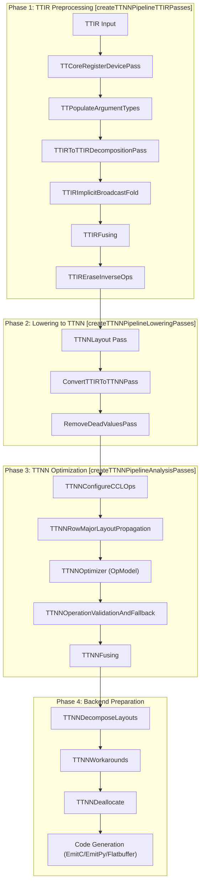
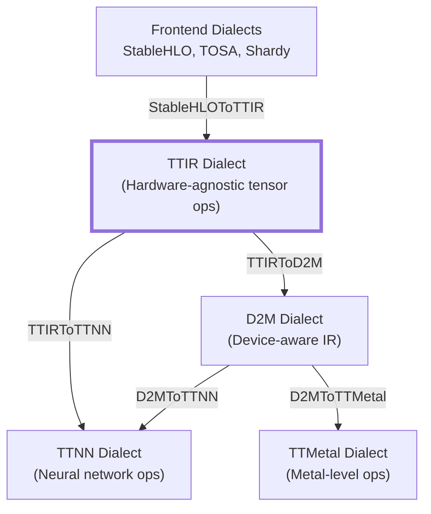
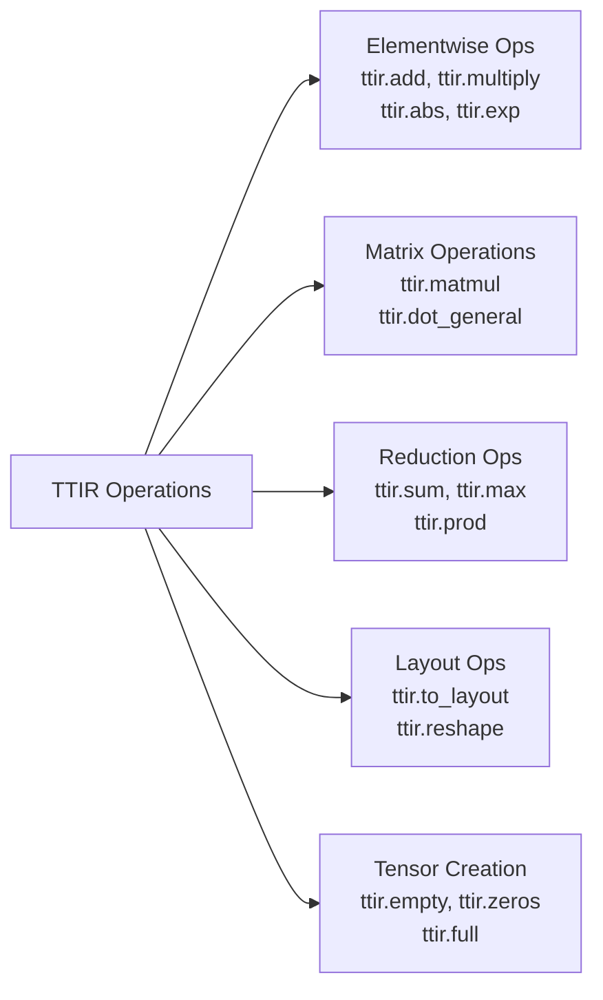
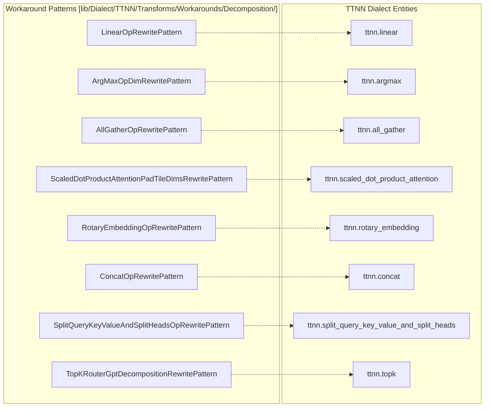
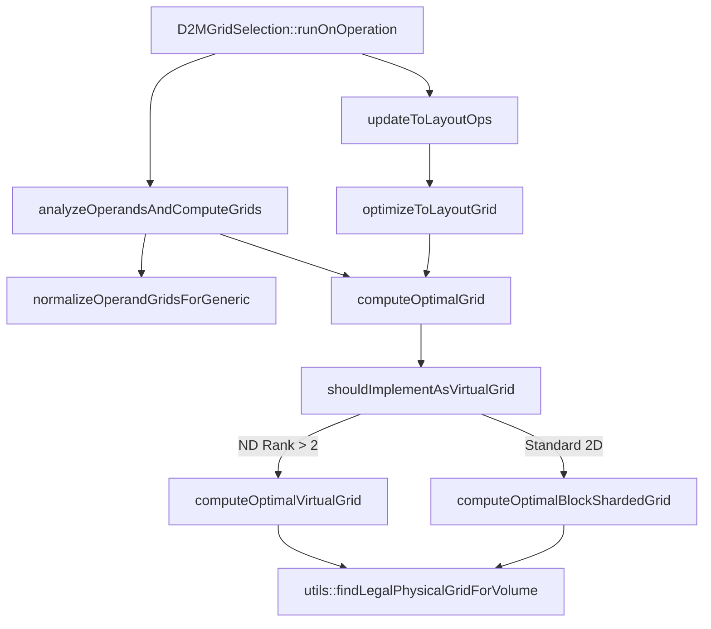
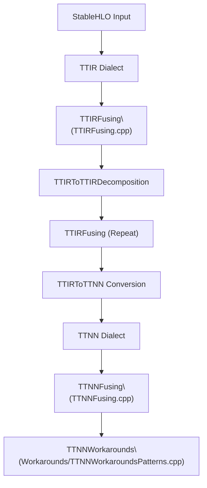
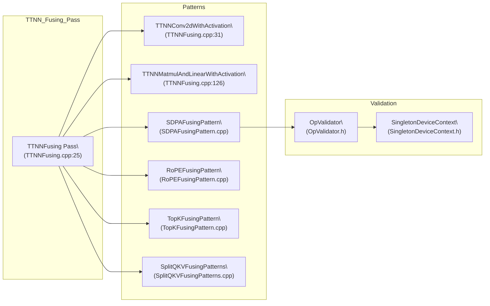
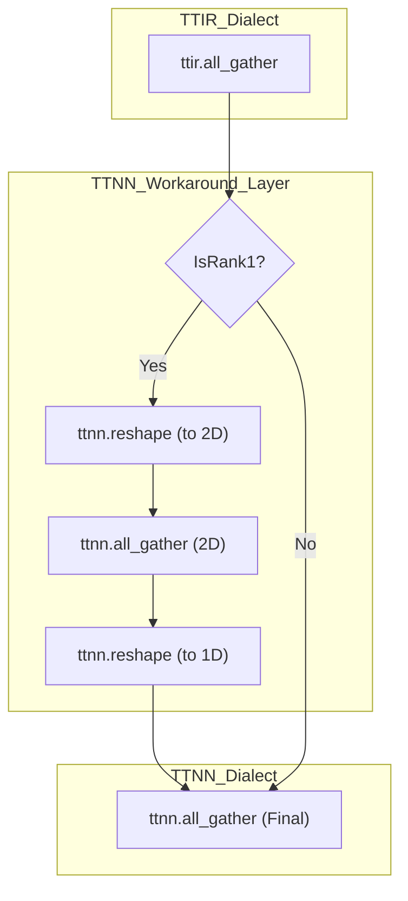
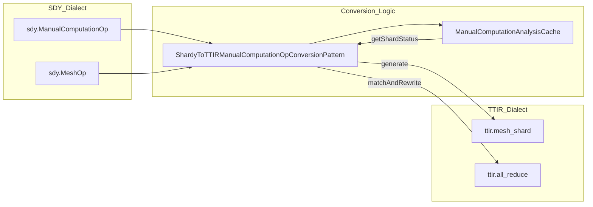

# TTIR Dialect

Relevant source files
*   [include/ttmlir/Dialect/TTIR/IR/TTIROps.td](https://github.com/tenstorrent/tt-mlir/blob/c7d92e92/include/ttmlir/Dialect/TTIR/IR/TTIROps.td)
*   [include/ttmlir/Dialect/TTIR/IR/TTIROpsInterfaces.h](https://github.com/tenstorrent/tt-mlir/blob/c7d92e92/include/ttmlir/Dialect/TTIR/IR/TTIROpsInterfaces.h)
*   [include/ttmlir/Dialect/TTIR/IR/TTIROpsInterfaces.td](https://github.com/tenstorrent/tt-mlir/blob/c7d92e92/include/ttmlir/Dialect/TTIR/IR/TTIROpsInterfaces.td)
*   [include/ttmlir/Dialect/TTIR/IR/TTIRTraits.h](https://github.com/tenstorrent/tt-mlir/blob/c7d92e92/include/ttmlir/Dialect/TTIR/IR/TTIRTraits.h)
*   [include/ttmlir/Dialect/TTIR/Transforms/HoistCPUOps/HoistCPUOps.h](https://github.com/tenstorrent/tt-mlir/blob/c7d92e92/include/ttmlir/Dialect/TTIR/Transforms/HoistCPUOps/HoistCPUOps.h)
*   [include/ttmlir/Dialect/TTIR/Transforms/Passes.h](https://github.com/tenstorrent/tt-mlir/blob/c7d92e92/include/ttmlir/Dialect/TTIR/Transforms/Passes.h)
*   [include/ttmlir/Dialect/TTIR/Transforms/Passes.td](https://github.com/tenstorrent/tt-mlir/blob/c7d92e92/include/ttmlir/Dialect/TTIR/Transforms/Passes.td)
*   [include/ttmlir/Dialect/TTIR/Utils/Utils.h](https://github.com/tenstorrent/tt-mlir/blob/c7d92e92/include/ttmlir/Dialect/TTIR/Utils/Utils.h)
*   [include/ttmlir/Dialect/TTNN/IR/TTNNOps.td](https://github.com/tenstorrent/tt-mlir/blob/c7d92e92/include/ttmlir/Dialect/TTNN/IR/TTNNOps.td)
*   [include/ttmlir/Dialect/TTNN/IR/TTNNWorkaroundsPass.h](https://github.com/tenstorrent/tt-mlir/blob/c7d92e92/include/ttmlir/Dialect/TTNN/IR/TTNNWorkaroundsPass.h)
*   [include/ttmlir/Dialect/TTNN/Pipelines/TTNNPipelines.h](https://github.com/tenstorrent/tt-mlir/blob/c7d92e92/include/ttmlir/Dialect/TTNN/Pipelines/TTNNPipelines.h)
*   [include/ttmlir/Dialect/TTNN/Transforms/Passes.td](https://github.com/tenstorrent/tt-mlir/blob/c7d92e92/include/ttmlir/Dialect/TTNN/Transforms/Passes.td)
*   [include/ttmlir/Target/TTNN/program.fbs](https://github.com/tenstorrent/tt-mlir/blob/c7d92e92/include/ttmlir/Target/TTNN/program.fbs)
*   [lib/Conversion/StableHLOToTTIR/StableHLOToTTIRPatterns.cpp](https://github.com/tenstorrent/tt-mlir/blob/c7d92e92/lib/Conversion/StableHLOToTTIR/StableHLOToTTIRPatterns.cpp)
*   [lib/Conversion/TTIRToTTNN/TTIRToTTNN.cpp](https://github.com/tenstorrent/tt-mlir/blob/c7d92e92/lib/Conversion/TTIRToTTNN/TTIRToTTNN.cpp)
*   [lib/Conversion/TTNNToEmitC/TTNNToEmitC.cpp](https://github.com/tenstorrent/tt-mlir/blob/c7d92e92/lib/Conversion/TTNNToEmitC/TTNNToEmitC.cpp)
*   [lib/Dialect/TTIR/IR/TTIRDialect.cpp](https://github.com/tenstorrent/tt-mlir/blob/c7d92e92/lib/Dialect/TTIR/IR/TTIRDialect.cpp)
*   [lib/Dialect/TTIR/IR/TTIROps.cpp](https://github.com/tenstorrent/tt-mlir/blob/c7d92e92/lib/Dialect/TTIR/IR/TTIROps.cpp)
*   [lib/Dialect/TTIR/IR/TTIRTraits.cpp](https://github.com/tenstorrent/tt-mlir/blob/c7d92e92/lib/Dialect/TTIR/IR/TTIRTraits.cpp)
*   [lib/Dialect/TTIR/Transforms/CMakeLists.txt](https://github.com/tenstorrent/tt-mlir/blob/c7d92e92/lib/Dialect/TTIR/Transforms/CMakeLists.txt)
*   [lib/Dialect/TTIR/Transforms/HoistCPUOps/CMakeLists.txt](https://github.com/tenstorrent/tt-mlir/blob/c7d92e92/lib/Dialect/TTIR/Transforms/HoistCPUOps/CMakeLists.txt)
*   [lib/Dialect/TTIR/Transforms/HoistCPUOps/CPUHoistConstEval.cpp](https://github.com/tenstorrent/tt-mlir/blob/c7d92e92/lib/Dialect/TTIR/Transforms/HoistCPUOps/CPUHoistConstEval.cpp)
*   [lib/Dialect/TTIR/Transforms/HoistCPUOps/HoistCPUOps.cpp](https://github.com/tenstorrent/tt-mlir/blob/c7d92e92/lib/Dialect/TTIR/Transforms/HoistCPUOps/HoistCPUOps.cpp)
*   [lib/Dialect/TTIR/Utils/Utils.cpp](https://github.com/tenstorrent/tt-mlir/blob/c7d92e92/lib/Dialect/TTIR/Utils/Utils.cpp)
*   [lib/Dialect/TTNN/IR/TTNNOps.cpp](https://github.com/tenstorrent/tt-mlir/blob/c7d92e92/lib/Dialect/TTNN/IR/TTNNOps.cpp)
*   [lib/Dialect/TTNN/IR/TTNNWorkaroundsPass.cpp](https://github.com/tenstorrent/tt-mlir/blob/c7d92e92/lib/Dialect/TTNN/IR/TTNNWorkaroundsPass.cpp)
*   [lib/Dialect/TTNN/Pipelines/TTNNPipelines.cpp](https://github.com/tenstorrent/tt-mlir/blob/c7d92e92/lib/Dialect/TTNN/Pipelines/TTNNPipelines.cpp)
*   [lib/Dialect/TTNN/Transforms/CMakeLists.txt](https://github.com/tenstorrent/tt-mlir/blob/c7d92e92/lib/Dialect/TTNN/Transforms/CMakeLists.txt)
*   [lib/Dialect/TTNN/Transforms/Passes.cpp](https://github.com/tenstorrent/tt-mlir/blob/c7d92e92/lib/Dialect/TTNN/Transforms/Passes.cpp)
*   [lib/Dialect/TTNN/Transforms/Workarounds/TTNNWorkaroundsPatterns.cpp](https://github.com/tenstorrent/tt-mlir/blob/c7d92e92/lib/Dialect/TTNN/Transforms/Workarounds/TTNNWorkaroundsPatterns.cpp)
*   [lib/Target/TTNN/TTNNToFlatbuffer.cpp](https://github.com/tenstorrent/tt-mlir/blob/c7d92e92/lib/Target/TTNN/TTNNToFlatbuffer.cpp)
*   [runtime/lib/ttnn/operations/CMakeLists.txt](https://github.com/tenstorrent/tt-mlir/blob/c7d92e92/runtime/lib/ttnn/operations/CMakeLists.txt)
*   [test/ttmlir/Conversion/StableHLOToTTIR/complex/complex_chain.mlir](https://github.com/tenstorrent/tt-mlir/blob/c7d92e92/test/ttmlir/Conversion/StableHLOToTTIR/complex/complex_chain.mlir)
*   [test/ttmlir/Conversion/StableHLOToTTIR/get_dimension_size_op.mlir](https://github.com/tenstorrent/tt-mlir/blob/c7d92e92/test/ttmlir/Conversion/StableHLOToTTIR/get_dimension_size_op.mlir)
*   [test/ttmlir/Conversion/StableHLOToTTIR/reshape_op.mlir](https://github.com/tenstorrent/tt-mlir/blob/c7d92e92/test/ttmlir/Conversion/StableHLOToTTIR/reshape_op.mlir)
*   [test/ttmlir/Conversion/StableHLOToTTIR/scatter_op.mlir](https://github.com/tenstorrent/tt-mlir/blob/c7d92e92/test/ttmlir/Conversion/StableHLOToTTIR/scatter_op.mlir)
*   [test/ttmlir/Conversion/StableHLOToTTIR/unary/erf_mhlo_op.mlir](https://github.com/tenstorrent/tt-mlir/blob/c7d92e92/test/ttmlir/Conversion/StableHLOToTTIR/unary/erf_mhlo_op.mlir)
*   [test/ttmlir/Dialect/StableHLO/op_by_op_infra_examples/add_op_with_reshape.mlir](https://github.com/tenstorrent/tt-mlir/blob/c7d92e92/test/ttmlir/Dialect/StableHLO/op_by_op_infra_examples/add_op_with_reshape.mlir)
*   [test/ttmlir/Dialect/TTIR/Transforms/EraseInverseOps/CommuteDownwards/commute_reshape_reduce.mlir](https://github.com/tenstorrent/tt-mlir/blob/c7d92e92/test/ttmlir/Dialect/TTIR/Transforms/EraseInverseOps/CommuteDownwards/commute_reshape_reduce.mlir)
*   [test/ttmlir/Dialect/TTIR/Transforms/EraseInverseOps/CommuteUpwards/commute_reshape_reduce.mlir](https://github.com/tenstorrent/tt-mlir/blob/c7d92e92/test/ttmlir/Dialect/TTIR/Transforms/EraseInverseOps/CommuteUpwards/commute_reshape_reduce.mlir)
*   [test/ttmlir/Dialect/TTIR/Transforms/HoistCPUOps/const_eval_hoist.mlir](https://github.com/tenstorrent/tt-mlir/blob/c7d92e92/test/ttmlir/Dialect/TTIR/Transforms/HoistCPUOps/const_eval_hoist.mlir)
*   [test/ttmlir/Dialect/TTIR/canonicalize/logical_identity_fold_tests.mlir](https://github.com/tenstorrent/tt-mlir/blob/c7d92e92/test/ttmlir/Dialect/TTIR/canonicalize/logical_identity_fold_tests.mlir)
*   [test/ttmlir/Dialect/TTIR/canonicalize/neg_fold_tests.mlir](https://github.com/tenstorrent/tt-mlir/blob/c7d92e92/test/ttmlir/Dialect/TTIR/canonicalize/neg_fold_tests.mlir)
*   [test/ttmlir/Dialect/TTIR/fusing/gelu_fusing.mlir](https://github.com/tenstorrent/tt-mlir/blob/c7d92e92/test/ttmlir/Dialect/TTIR/fusing/gelu_fusing.mlir)
*   [test/ttmlir/Dialect/TTIR/fusing/relu6_fusing.mlir](https://github.com/tenstorrent/tt-mlir/blob/c7d92e92/test/ttmlir/Dialect/TTIR/fusing/relu6_fusing.mlir)
*   [test/ttmlir/Dialect/TTIR/fusing/rms_norm_fusion.mlir](https://github.com/tenstorrent/tt-mlir/blob/c7d92e92/test/ttmlir/Dialect/TTIR/fusing/rms_norm_fusion.mlir)
*   [test/ttmlir/Dialect/TTIR/fusing/zero_maximum_to_relu.mlir](https://github.com/tenstorrent/tt-mlir/blob/c7d92e92/test/ttmlir/Dialect/TTIR/fusing/zero_maximum_to_relu.mlir)
*   [test/ttmlir/Dialect/TTNN/Transforms/Workarounds/reshape_workaround.mlir](https://github.com/tenstorrent/tt-mlir/blob/c7d92e92/test/ttmlir/Dialect/TTNN/Transforms/Workarounds/reshape_workaround.mlir)
*   [test/ttmlir/Dialect/TTNN/const-eval/const-eval.mlir](https://github.com/tenstorrent/tt-mlir/blob/c7d92e92/test/ttmlir/Dialect/TTNN/const-eval/const-eval.mlir)
*   [test/ttmlir/Dialect/TTNN/quantization/simple_dequantize.mlir](https://github.com/tenstorrent/tt-mlir/blob/c7d92e92/test/ttmlir/Dialect/TTNN/quantization/simple_dequantize.mlir)
*   [test/ttmlir/Dialect/TTNN/quantization/simple_requantize.mlir](https://github.com/tenstorrent/tt-mlir/blob/c7d92e92/test/ttmlir/Dialect/TTNN/quantization/simple_requantize.mlir)
*   [test/ttmlir/Dialect/TTNN/simple_scatter.mlir](https://github.com/tenstorrent/tt-mlir/blob/c7d92e92/test/ttmlir/Dialect/TTNN/simple_scatter.mlir)
*   [test/ttmlir/Silicon/StableHLO/n150/reshape_op.mlir](https://github.com/tenstorrent/tt-mlir/blob/c7d92e92/test/ttmlir/Silicon/StableHLO/n150/reshape_op.mlir)
*   [test/ttmlir/Silicon/TTNN/n150/quantization/simple_requantize.mlir](https://github.com/tenstorrent/tt-mlir/blob/c7d92e92/test/ttmlir/Silicon/TTNN/n150/quantization/simple_requantize.mlir)

The TTIR (Tenstorrent Intermediate Representation) Dialect is the high-level IR abstraction in the `tt-mlir` compiler. It provides a hardware-agnostic representation of tensor operations (elementwise, matmul, reductions, etc.) before they are lowered to device-specific dialects like TTNN or TTMetal. It serves as the primary interface between frontend frameworks (like StableHLO) and the Tenstorrent compilation backend [include/ttmlir/Dialect/TTIR/IR/TTIRBase.td 9-15](https://github.com/tenstorrent/tt-mlir/blob/c7d92e92/include/ttmlir/Dialect/TTIR/IR/TTIRBase.td#L9-L15)

## TTIR in the Compilation Pipeline

TTIR occupies a critical position, serving as the bridge between high-level ML framework representations and device-aware transformations. It handles the initial decomposition of complex ops and normalizes element types before backend-specific optimizations take over.

### Compilation Flow Diagram


Sources: [lib/Dialect/TTNN/Pipelines/TTNNPipelines.cpp:32-97](), [lib/Dialect/TTNN/Pipelines/TTNNPipelines.cpp:99-185](), [lib/Dialect/TTNN/Pipelines/TTNNPipelines.cpp:187-215]()
```



Sources: [lib/Conversion/StableHLOToTTIR/StableHLOToTTIRPatterns.cpp:5-18](), [lib/Conversion/TTIRToTTNN/TTIRToTTNN.cpp:5-18](), [include/ttmlir/Dialect/TTIR/IR/TTIROps.td:1-12]()

The TTIR dialect provides:
- Hardware-agnostic operation semantics.
- Implicit broadcast resolution via the `TTIRImplicitBroadcastFold` pass [lib/Dialect/TTNN/Pipelines/TTNNPipelines.cpp:59-61]().
- Type inference and shape propagation via `InferTypeOpInterface` [include/ttmlir/Dialect/TTIR/IR/TTIROps.td:15-15]().
- Operation decomposition primitives, such as decomposing `ttir.index` into `ttir.slice_static` [lib/Conversion/TTIRToTTIRDecomposition/TTIRToTTIRDecomposition.cpp:35-92]().
- Layout transition operations via `ttir.to_layout` [include/ttmlir/Dialect/TTIR/IR/TTIROps.td:36-50]().
```


Title: TTIR Compilation Path

Sources: [lib/Conversion/StableHLOToTTIR/StableHLOToTTIRPatterns.cpp 5-18](https://github.com/tenstorrent/tt-mlir/blob/c7d92e92/lib/Conversion/StableHLOToTTIR/StableHLOToTTIRPatterns.cpp#L5-L18)[lib/Conversion/TTIRToTTNN/TTIRToTTNN.cpp 5-18](https://github.com/tenstorrent/tt-mlir/blob/c7d92e92/lib/Conversion/TTIRToTTNN/TTIRToTTNN.cpp#L5-L18)[include/ttmlir/Dialect/TTIR/IR/TTIROps.td 1-12](https://github.com/tenstorrent/tt-mlir/blob/c7d92e92/include/ttmlir/Dialect/TTIR/IR/TTIROps.td#L1-L12)

The TTIR dialect provides:

*   Hardware-agnostic operation semantics.
*   Implicit broadcast resolution via the `TTIRImplicitBroadcastFold` pass [lib/Dialect/TTNN/Pipelines/TTNNPipelines.cpp 59-61](https://github.com/tenstorrent/tt-mlir/blob/c7d92e92/lib/Dialect/TTNN/Pipelines/TTNNPipelines.cpp#L59-L61)
*   Type inference and shape propagation via `InferTypeOpInterface`[include/ttmlir/Dialect/TTIR/IR/TTIROps.td 15](https://github.com/tenstorrent/tt-mlir/blob/c7d92e92/include/ttmlir/Dialect/TTIR/IR/TTIROps.td#L15-L15)
*   Operation decomposition primitives, such as decomposing `ttir.index` into `ttir.slice_static`[lib/Conversion/TTIRToTTIRDecomposition/TTIRToTTIRDecomposition.cpp 35-92](https://github.com/tenstorrent/tt-mlir/blob/c7d92e92/lib/Conversion/TTIRToTTIRDecomposition/TTIRToTTIRDecomposition.cpp#L35-L92)
*   Layout transition operations via `ttir.to_layout`[include/ttmlir/Dialect/TTIR/IR/TTIROps.td 36-50](https://github.com/tenstorrent/tt-mlir/blob/c7d92e92/include/ttmlir/Dialect/TTIR/IR/TTIROps.td#L36-L50)

## Operation Categories

TTIR operations are organized into several functional categories, following the Destination-Passing Style (DPS) pattern where appropriate via the `TTIR_DPSOp` base class [include/ttmlir/Dialect/TTIR/IR/TTIROps.td 24-30](https://github.com/tenstorrent/tt-mlir/blob/c7d92e92/include/ttmlir/Dialect/TTIR/IR/TTIROps.td#L24-L30)

### Operation Taxonomy Diagram


Sources: [include/ttmlir/Dialect/TTIR/IR/TTIROps.td:32-200]()
```


Title: TTIR Operation Taxonomy

Sources: [include/ttmlir/Dialect/TTIR/IR/TTIROps.td 32-200](https://github.com/tenstorrent/tt-mlir/blob/c7d92e92/include/ttmlir/Dialect/TTIR/IR/TTIROps.td#L32-L200)

### Elementwise Operations

Elementwise operations follow a base class hierarchy in TableGen. Binary operations typically support implicit broadcasting through the `TTIR_Broadcastable` trait.

| Base Class | Traits | Example Operations |
| --- | --- | --- |
| `TTIR_ElementwiseUnaryOp` | `TTIROpInterface`, `ElementwiseUnary` | `abs`, `neg`, `exp`, `log`, `sqrt` |
| `TTIR_ElementwiseBinaryOp` | `TTIROpInterface`, `ElementwiseBinary` | `add`, `multiply`, `sub`, `div` |
| `TTIR_ElementwiseTernaryOp` | `TTIROpInterface`, `ElementwiseTernary` | `where`, `clamp` |

**Key Characteristics:**

*   **Implicit Broadcasting**: Binary ops automatically handle shape mismatch between operands by resolving broadcasting logic during conversion or via folding passes [lib/Dialect/TTNN/Pipelines/TTNNPipelines.cpp 59-61](https://github.com/tenstorrent/tt-mlir/blob/c7d92e92/lib/Dialect/TTNN/Pipelines/TTNNPipelines.cpp#L59-L61)
*   **Quantization Support**: Operations implement `TTIR_QuantizableOpInterface`. They provide `isQuantizedRewriteFavorable` to check if operands have aligned quantization parameters and `rewriteWithQuantizedInputs` to lower to quantized kernels [include/ttmlir/Dialect/TTIR/IR/TTIROpsInterfaces.td 77-104](https://github.com/tenstorrent/tt-mlir/blob/c7d92e92/include/ttmlir/Dialect/TTIR/IR/TTIROpsInterfaces.td#L77-L104)

Sources: [include/ttmlir/Dialect/TTIR/IR/TTIROps.td 24-30](https://github.com/tenstorrent/tt-mlir/blob/c7d92e92/include/ttmlir/Dialect/TTIR/IR/TTIROps.td#L24-L30)[lib/Dialect/TTIR/IR/TTIROps.cpp 160-188](https://github.com/tenstorrent/tt-mlir/blob/c7d92e92/lib/Dialect/TTIR/IR/TTIROps.cpp#L160-L188)

### Matrix and Convolution Operations

TTIR provides flexible matrix multiplication and convolution primitives:

*   **`ttir.dot_general`**: A generalized contraction op specifying batch and contracting dimensions for LHS and RHS [include/ttmlir/Dialect/TTIR/IR/TTIROps.td 182-190](https://github.com/tenstorrent/tt-mlir/blob/c7d92e92/include/ttmlir/Dialect/TTIR/IR/TTIROps.td#L182-L190)
*   **`ttir.matmul`**: Standard matrix multiplication, which lowerings map to `ttnn.matmul`[lib/Conversion/TTIRToTTNN/TTIRToTTNN.cpp 1110-1115](https://github.com/tenstorrent/tt-mlir/blob/c7d92e92/lib/Conversion/TTIRToTTNN/TTIRToTTNN.cpp#L1110-L1115)
*   **`ttir.conv2d`**: 2D convolution with attributes for `stride`, `padding`, `dilation`, and `groups`. StableHLO conversion uses helpers like `getI64ArrayOrDefault` to parse these attributes [lib/Conversion/StableHLOToTTIR/StableHLOToTTIRPatterns.cpp 94-101](https://github.com/tenstorrent/tt-mlir/blob/c7d92e92/lib/Conversion/StableHLOToTTIR/StableHLOToTTIRPatterns.cpp#L94-L101)

Sources: [include/ttmlir/Dialect/TTIR/IR/TTIROps.td 182-195](https://github.com/tenstorrent/tt-mlir/blob/c7d92e92/include/ttmlir/Dialect/TTIR/IR/TTIROps.td#L182-L195)[lib/Conversion/StableHLOToTTIR/StableHLOToTTIRPatterns.cpp 94-111](https://github.com/tenstorrent/tt-mlir/blob/c7d92e92/lib/Conversion/StableHLOToTTIR/StableHLOToTTIRPatterns.cpp#L94-L111)

### Reduction Operations

Reduction operations support reducing across specific dimensions or the entire tensor:

| Operation | Description | Init Logic |
| --- | --- | --- |
| `ttir.sum` | Summation reduction | Initialized to 0 [lib/Conversion/StableHLOToTTIR/StableHLOToTTIRPatterns.cpp 140-147](https://github.com/tenstorrent/tt-mlir/blob/c7d92e92/lib/Conversion/StableHLOToTTIR/StableHLOToTTIRPatterns.cpp#L140-L147) |
| `ttir.max` | Maximum reduction | Initialized to -inf [lib/Conversion/StableHLOToTTIR/StableHLOToTTIRPatterns.cpp 132-139](https://github.com/tenstorrent/tt-mlir/blob/c7d92e92/lib/Conversion/StableHLOToTTIR/StableHLOToTTIRPatterns.cpp#L132-L139) |
| `ttir.prod` | Product reduction | Lowered to `ttnn.prod` via conversion [lib/Conversion/TTIRToTTNN/TTIRToTTNN.cpp 2500-2510](https://github.com/tenstorrent/tt-mlir/blob/c7d92e92/lib/Conversion/TTIRToTTNN/TTIRToTTNN.cpp#L2500-L2510) |

Reduction operations can be fused with trailing reshapes if the reshape adds back the reduced dimensions (setting `keep_dim=true`) [lib/Dialect/TTNN/Pipelines/TTNNPipelines.cpp 48-53](https://github.com/tenstorrent/tt-mlir/blob/c7d92e92/lib/Dialect/TTNN/Pipelines/TTNNPipelines.cpp#L48-L53)

Sources: [lib/Conversion/StableHLOToTTIR/StableHLOToTTIRPatterns.cpp 113-187](https://github.com/tenstorrent/tt-mlir/blob/c7d92e92/lib/Conversion/StableHLOToTTIR/StableHLOToTTIRPatterns.cpp#L113-L187)[lib/Conversion/TTIRToTTNN/TTIRToTTNN.cpp 2450-2550](https://github.com/tenstorrent/tt-mlir/blob/c7d92e92/lib/Conversion/TTIRToTTNN/TTIRToTTNN.cpp#L2450-L2550)

## Key Interfaces and Traits

### TTIROpInterface

This interface provides access to the hardware context in which an operation exists.

*   `getSystemDesc()`: Returns the `SystemDescAttr` of the current scope [include/ttmlir/Dialect/TTIR/IR/TTIROpsInterfaces.td 14-23](https://github.com/tenstorrent/tt-mlir/blob/c7d92e92/include/ttmlir/Dialect/TTIR/IR/TTIROpsInterfaces.td#L14-L23)
*   `getDevice()`: Returns the `DeviceAttr` associated with the operation [include/ttmlir/Dialect/TTIR/IR/TTIROpsInterfaces.td 24-33](https://github.com/tenstorrent/tt-mlir/blob/c7d92e92/include/ttmlir/Dialect/TTIR/IR/TTIROpsInterfaces.td#L24-L33)
*   `supportsCPUExecution()`: Identifies if the op can be hoisted to the host [include/ttmlir/Dialect/TTIR/IR/TTIROpsInterfaces.td 34-43](https://github.com/tenstorrent/tt-mlir/blob/c7d92e92/include/ttmlir/Dialect/TTIR/IR/TTIROpsInterfaces.td#L34-L43)

### TTIR_TTNNMetalLayoutCastOp

This purely representational operation reinterprets a tensor's layout encoding between `#ttnn.ttnn_layout` and `#ttcore.metal_layout` without modifying data [include/ttmlir/Dialect/TTIR/IR/TTIROps.td 93-107](https://github.com/tenstorrent/tt-mlir/blob/c7d92e92/include/ttmlir/Dialect/TTIR/IR/TTIROps.td#L93-L107) It is critical during bufferization where tensors encoded with metal layout are converted to memrefs [include/ttmlir/Dialect/TTIR/IR/TTIROps.td 119-122](https://github.com/tenstorrent/tt-mlir/blob/c7d92e92/include/ttmlir/Dialect/TTIR/IR/TTIROps.td#L119-L122)

## System Names to Code Entities

Title: TTIR Interface and Trait Mapping

Sources: [include/ttmlir/Dialect/TTIR/IR/TTIROpsInterfaces.td 11-104](https://github.com/tenstorrent/tt-mlir/blob/c7d92e92/include/ttmlir/Dialect/TTIR/IR/TTIROpsInterfaces.td#L11-L104)[include/ttmlir/Dialect/TTIR/IR/TTIROps.td 24-30](https://github.com/tenstorrent/tt-mlir/blob/c7d92e92/include/ttmlir/Dialect/TTIR/IR/TTIROps.td#L24-L30)

## Transformation and Fusing Passes

TTIR includes several passes to normalize and optimize the IR before backend lowering.

*   **`TTIRFusing`**: Implements patterns to fuse operations. For example, it can fuse `ttir.conv2d` followed by `ttir.multiply`[lib/Dialect/TTNN/Pipelines/TTNNPipelines.cpp 48-53](https://github.com/tenstorrent/tt-mlir/blob/c7d92e92/lib/Dialect/TTNN/Pipelines/TTNNPipelines.cpp#L48-L53)
*   **`CPUHoistConstEvalTransform`**: Hoists ops from const-eval subgraphs to the CPU module to improve precision and reduce device memory usage [lib/Target/TTNN/TTNNToFlatbuffer.cpp 46-48](https://github.com/tenstorrent/tt-mlir/blob/c7d92e92/lib/Target/TTNN/TTNNToFlatbuffer.cpp#L46-L48)
*   **`TTIRToTTIRDecomposition`**: Decomposes complex operations like `ttir.reverse` into sequences of `ttir.permute`, `ttir.reshape`, and `ttir.embedding`[lib/Dialect/TTNN/Pipelines/TTNNPipelines.cpp 57-58](https://github.com/tenstorrent/tt-mlir/blob/c7d92e92/lib/Dialect/TTNN/Pipelines/TTNNPipelines.cpp#L57-L58)

Sources: [lib/Dialect/TTNN/Pipelines/TTNNPipelines.cpp 32-97](https://github.com/tenstorrent/tt-mlir/blob/c7d92e92/lib/Dialect/TTNN/Pipelines/TTNNPipelines.cpp#L32-L97)[lib/Target/TTNN/TTNNToFlatbuffer.cpp 46-48](https://github.com/tenstorrent/tt-mlir/blob/c7d92e92/lib/Target/TTNN/TTNNToFlatbuffer.cpp#L46-L48)

## Canonicalization and Constant Folding

TTIR implements sophisticated constant folding logic in `lib/Dialect/TTIR/IR/TTIROps.cpp`.

*   **Heuristic-based Folding**: `shouldFold()` limits constant folding to tensors with fewer than 1,000,000 elements to avoid excessive compile times [lib/Dialect/TTIR/IR/TTIROps.cpp 74-82](https://github.com/tenstorrent/tt-mlir/blob/c7d92e92/lib/Dialect/TTIR/IR/TTIROps.cpp#L74-L82)
*   **TM Folding**: Tensor manipulation (TM) operations like `Reshape` use `constantFoldTM` with index mapping functions to calculate folded results [lib/Dialect/TTIR/IR/TTIROps.cpp 122-147](https://github.com/tenstorrent/tt-mlir/blob/c7d92e92/lib/Dialect/TTIR/IR/TTIROps.cpp#L122-L147)
*   **Elementwise Folding**: Supports folding of unary and binary operations when inputs are constants (e.g., `constantFoldEltwiseUnaryFloat`) [lib/Dialect/TTIR/IR/TTIROps.cpp 166-189](https://github.com/tenstorrent/tt-mlir/blob/c7d92e92/lib/Dialect/TTIR/IR/TTIROps.cpp#L166-L189)

Sources: [lib/Dialect/TTIR/IR/TTIROps.cpp 57-189](https://github.com/tenstorrent/tt-mlir/blob/c7d92e92/lib/Dialect/TTIR/IR/TTIROps.cpp#L57-L189)

## Flatbuffer Serialization

During the final stages of compilation, TTIR and TTNN operations are serialized into a Flatbuffer binary format for the Tenstorrent runtime.

*   **`TensorDesc`**: Represents the physical layout and shape of a tensor in the binary [lib/Target/TTNN/TTNNToFlatbuffer.cpp 57-76](https://github.com/tenstorrent/tt-mlir/blob/c7d92e92/lib/Target/TTNN/TTNNToFlatbuffer.cpp#L57-L76)
*   **CPU Hoisting**: If an operation is marked for CPU execution via `ttmlir::utils::g_cpuHoistFuncCallAttrName`, the serializer handles it as a host-side function call [lib/Target/TTNN/TTNNToFlatbuffer.cpp 46-48](https://github.com/tenstorrent/tt-mlir/blob/c7d92e92/lib/Target/TTNN/TTNNToFlatbuffer.cpp#L46-L48)

Sources: [lib/Target/TTNN/TTNNToFlatbuffer.cpp 46-139](https://github.com/tenstorrent/tt-mlir/blob/c7d92e92/lib/Target/TTNN/TTNNToFlatbuffer.cpp#L46-L139)[include/ttmlir/Target/TTNN/program.fbs 34-168](https://github.com/tenstorrent/tt-mlir/blob/c7d92e92/include/ttmlir/Target/TTNN/program.fbs#L34-L168)

Dismiss
Refresh this wiki

Enter email to refresh

## Additional Diagrams


#### TTNN Workaround Pattern Association




Key Workaround Behaviors:
- **Operand Workarounds**: `TTNNOperandsWorkaroundsFactory` creates specific rules for ops like `Pool2D` (forcing Row-Major BF16) or `Embedding` (forcing Row-Major UInt32 for indices) [lib/Dialect/TTNN/IR/TTNNWorkaroundsPass.cpp:97-160]().
- **Layout Compatibility**: Specific patterns handle hardware limitations for ops like `LinearOp`, `ArgMaxOp`, and `AllGatherOp` [lib/Dialect/TTNN/Transforms/CMakeLists.txt:49-61]().
- **Output Reversion**: If a workaround changes the layout of a result, `revertOutputLayout` inserts a `ToLayoutOp` to maintain compatibility with consumers [lib/Dialect/TTNN/Transforms/Workarounds/TTNNWorkaroundsPatterns.cpp:70-95]().
- **Input Workarounds**: `workaroundInputOperand` inserts `ToLayoutOp` to convert input operands to desired hardware-compatible layouts [lib/Dialect/TTNN/Transforms/Workarounds/TTNNWorkaroundsPatterns.cpp:100-135]().

Sources: [lib/Dialect/TTNN/Transforms/Workarounds/TTNNWorkaroundsPatterns.cpp:61-135](), [lib/Dialect/TTNN/Transforms/CMakeLists.txt:43-74](), [lib/Dialect/TTNN/IR/TTNNWorkaroundsPass.cpp:97-160]()
```


#### Core Functions and Decision Logic




Sources: [lib/Dialect/D2M/Transforms/GridSelection.cpp:37-140](), [lib/Dialect/D2M/Utils/GridSelectionUtils.cpp:1-20]()
```


### Factory Pattern for Operation-Specific Workarounds


```mermaid
graph LR
    subgraph "wa::TTNNOperandsWorkaroundsFactory"
        [createPool2DOpOperandsWorkarounds]
        [createEmbeddingOpOperandsWorkarounds]
        [createBinaryOpOperandsWorkarounds]
        [createConvOpOperandsWorkarounds]
        [createReductionOpOperandsWorkarounds]
        [createMeshShardOpOperandsWorkarounds]
    end

    subgraph "Constraint Constants"
        [Layout::RowMajor]
        [DataType::BFloat16]
        [DataType::UInt32]
        [Layout::Tile]
        [BufferType::SystemMemory]
    end

    [createPool2DOpOperandsWorkarounds] --> [Layout::RowMajor]
    [createPool2DOpOperandsWorkarounds] --> [DataType::BFloat16]
    [createEmbeddingOpOperandsWorkarounds] --> [DataType::UInt32]
    [createEmbeddingOpOperandsWorkarounds] --> [DataType::BFloat16]
    [createBinaryOpOperandsWorkarounds] --> [Layout::Tile]
    [createConvOpOperandsWorkarounds] --> [Layout::RowMajor]
    [createReductionOpOperandsWorkarounds] --> [DataType::BFloat16]
    [createMeshShardOpOperandsWorkarounds] --> [BufferType::SystemMemory]
```

**Complete Factory Method Reference**

| Factory Method | Target Op(s) | Key Constraint | Notes |
|---|---|---|---|
| `createPool2DOpOperandsWorkarounds()` | `MaxPool2dOp`, `AvgPool2dOp` | RowMajor, BFloat16 | [lib/Dialect/TTNN/IR/TTNNWorkaroundsPass.cpp:97-105]() |
| `createPool2DWithIndicesOpOperandsWorkarounds()` | `MaxPool2dWithIndicesOp` | Output[0]: RM+BF16; Output[1]: RM+UInt16 | [lib/Dialect/TTNN/IR/TTNNWorkaroundsPass.cpp:114-135]() |
| `createEmbeddingOpOperandsWorkarounds()` | `EmbeddingOp` | Input: RM+UInt32; weight: RM+BF16; output: Tile+BF16 | [lib/Dialect/TTNN/IR/TTNNWorkaroundsPass.cpp:149-165]() |
| `createScatterOpOperandsWorkarounds()` | `ScatterOp` | RowMajor if tiled with f32/bf16/int32 element type | Conditional [lib/Dialect/TTNN/IR/TTNNWorkaroundsPass.cpp:333-350]() |
| `createMeshShardOpOperandsWorkarounds()` | `MeshShardOp` | SystemMemory + null mem layout for non-Identity shards | [lib/Dialect/TTNN/IR/TTNNWorkaroundsPass.cpp:231-255]() |
| `createConstantOpOperandsWorkarounds()` | `ConstantOp` | SystemMemory, RowMajor | Host placement invariant |
| `createBinaryOpOperandsWorkarounds()` | Binary elementwise ops | Tile layout; op-specific dtype | [lib/Dialect/TTNN/IR/TTNNWorkaroundsPass.cpp:446-455]() |
| `createConvOpOperandsWorkarounds<T>()` | `Conv2dOp`, `ConvTranspose2dOp` | Input: RowMajor; BFloat16 if BFP8 input | [lib/Dialect/TTNN/IR/TTNNWorkaroundsPass.cpp:637-660]() |
| `createReductionOpOperandsWorkarounds()` | Reduction ops | BFloat16 if not f32/bf16 | [lib/Dialect/TTNN/IR/TTNNWorkaroundsPass.cpp:685-703]() |
| `createSortOpOperandsWorkarounds()` | `SortOp` | BF16 or UInt16 input; UInt16/UInt32 indices | [lib/Dialect/TTNN/IR/TTNNWorkaroundsPass.cpp:726-788]() |

Sources: [include/ttmlir/Dialect/TTNN/IR/TTNNWorkaroundsPass.h:231-336](), [lib/Dialect/TTNN/IR/TTNNWorkaroundsPass.cpp:84-880]()
```


### Where Fusion Fits in the Pipeline




**Code locations:**

| Pass | Implementation | Purpose |
| :--- | :--- | :--- |
| `TTIRFusing` | [lib/Dialect/TTIR/Transforms/TTIRFusing.cpp:27-28]() | General TTIR pattern matching (Conv+Bias, Softmax, etc.) |
| `TTNNFusing` | [lib/Dialect/TTNN/Transforms/TTNNFusing.cpp:25-26]() | Fuses activations and complex patterns (SDPA, RoPE, TopK) |

Sources: [lib/Dialect/TTIR/Transforms/TTIRFusing.cpp:27-28](), [lib/Dialect/TTNN/Transforms/TTNNFusing.cpp:25-26]()

---
```


#### Complex Kernel Fusing




Sources: [lib/Dialect/TTNN/Transforms/TTNNFusing.cpp:12-21](), [lib/Dialect/TTNN/Transforms/TTNNFusing.cpp:31-146](), [lib/Dialect/TTNN/Transforms/Fusing/RoPEFusingPattern.cpp:69-111]()

---
```


#### CCL Lowering and Workaround Pipeline



Sources: [lib/Dialect/TTNN/Transforms/Workarounds/Decomposition/AllGatherOpRewritePattern.cpp:14-74](), [runtime/lib/ttnn/operations/ccl/all_gather.cpp:17-49]().
```


#### Shardy to TTIR Conversion Logic



Sources: [lib/Conversion/StableHLOToTTIR/ShardyToTTIRPatterns.cpp:44-52](), [lib/Conversion/StableHLOToTTIR/ShardyToTTIRPatterns.cpp:149-185]().
```

