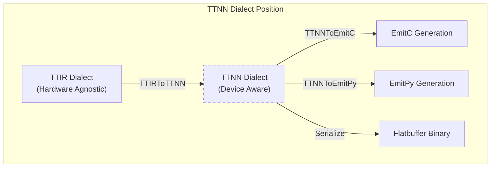
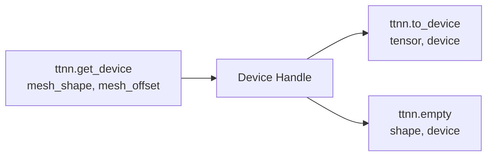
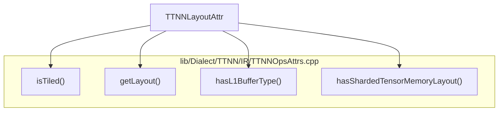
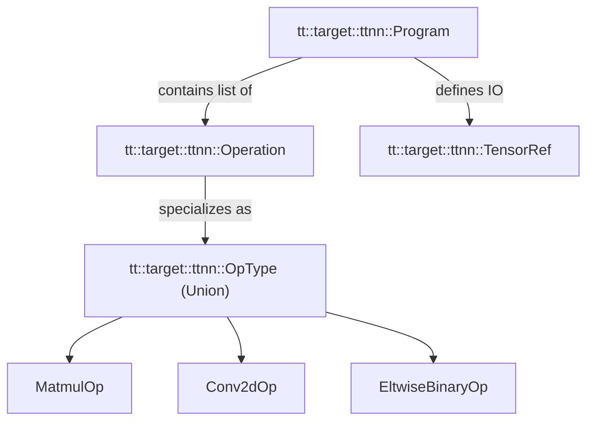
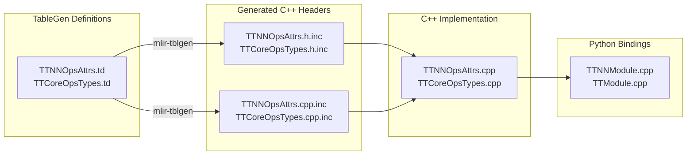

# TTNN Dialect

Relevant source files
*   [include/ttmlir/Conversion/TTNNToEmitC/EmitCConversion.h](https://github.com/tenstorrent/tt-mlir/blob/c7d92e92/include/ttmlir/Conversion/TTNNToEmitC/EmitCConversion.h)
*   [include/ttmlir/Conversion/TTNNToEmitPy/EmitPyConversion.h](https://github.com/tenstorrent/tt-mlir/blob/c7d92e92/include/ttmlir/Conversion/TTNNToEmitPy/EmitPyConversion.h)
*   [include/ttmlir/Dialect/TTIR/IR/TTIROps.td](https://github.com/tenstorrent/tt-mlir/blob/c7d92e92/include/ttmlir/Dialect/TTIR/IR/TTIROps.td)
*   [include/ttmlir/Dialect/TTNN/Analysis/BFInterleavedPolicy.h](https://github.com/tenstorrent/tt-mlir/blob/c7d92e92/include/ttmlir/Dialect/TTNN/Analysis/BFInterleavedPolicy.h)
*   [include/ttmlir/Dialect/TTNN/Analysis/GreedyL1InterleavedPolicy.h](https://github.com/tenstorrent/tt-mlir/blob/c7d92e92/include/ttmlir/Dialect/TTNN/Analysis/GreedyL1InterleavedPolicy.h)
*   [include/ttmlir/Dialect/TTNN/IR/TTNNOps.td](https://github.com/tenstorrent/tt-mlir/blob/c7d92e92/include/ttmlir/Dialect/TTNN/IR/TTNNOps.td)
*   [include/ttmlir/Dialect/TTNN/IR/TTNNOpsAttrs.td](https://github.com/tenstorrent/tt-mlir/blob/c7d92e92/include/ttmlir/Dialect/TTNN/IR/TTNNOpsAttrs.td)
*   [include/ttmlir/Dialect/TTNN/IR/TTNNOpsEnums.td](https://github.com/tenstorrent/tt-mlir/blob/c7d92e92/include/ttmlir/Dialect/TTNN/IR/TTNNOpsEnums.td)
*   [include/ttmlir/Dialect/TTNN/Utils/TransformUtils.h](https://github.com/tenstorrent/tt-mlir/blob/c7d92e92/include/ttmlir/Dialect/TTNN/Utils/TransformUtils.h)
*   [include/ttmlir/Dialect/TTNN/Utils/Utils.h](https://github.com/tenstorrent/tt-mlir/blob/c7d92e92/include/ttmlir/Dialect/TTNN/Utils/Utils.h)
*   [include/ttmlir/OpModel/TTNN/Conversion.h](https://github.com/tenstorrent/tt-mlir/blob/c7d92e92/include/ttmlir/OpModel/TTNN/Conversion.h)
*   [include/ttmlir/Target/TTNN/operations/conv.fbs](https://github.com/tenstorrent/tt-mlir/blob/c7d92e92/include/ttmlir/Target/TTNN/operations/conv.fbs)
*   [include/ttmlir/Target/TTNN/program.fbs](https://github.com/tenstorrent/tt-mlir/blob/c7d92e92/include/ttmlir/Target/TTNN/program.fbs)
*   [include/ttmlir/Target/TTNN/types.fbs](https://github.com/tenstorrent/tt-mlir/blob/c7d92e92/include/ttmlir/Target/TTNN/types.fbs)
*   [lib/Conversion/StableHLOToTTIR/StableHLOToTTIRPatterns.cpp](https://github.com/tenstorrent/tt-mlir/blob/c7d92e92/lib/Conversion/StableHLOToTTIR/StableHLOToTTIRPatterns.cpp)
*   [lib/Conversion/TTIRToTTNN/TTIRToTTNN.cpp](https://github.com/tenstorrent/tt-mlir/blob/c7d92e92/lib/Conversion/TTIRToTTNN/TTIRToTTNN.cpp)
*   [lib/Conversion/TTNNToEmitC/TTNNToEmitC.cpp](https://github.com/tenstorrent/tt-mlir/blob/c7d92e92/lib/Conversion/TTNNToEmitC/TTNNToEmitC.cpp)
*   [lib/Conversion/TTNNToEmitPy/TTNNToEmitPy.cpp](https://github.com/tenstorrent/tt-mlir/blob/c7d92e92/lib/Conversion/TTNNToEmitPy/TTNNToEmitPy.cpp)
*   [lib/Conversion/TTNNToEmitPy/TTNNToEmitPyPass.cpp](https://github.com/tenstorrent/tt-mlir/blob/c7d92e92/lib/Conversion/TTNNToEmitPy/TTNNToEmitPyPass.cpp)
*   [lib/Dialect/TTIR/IR/TTIROps.cpp](https://github.com/tenstorrent/tt-mlir/blob/c7d92e92/lib/Dialect/TTIR/IR/TTIROps.cpp)
*   [lib/Dialect/TTNN/Analysis/BFInterleavedPolicy.cpp](https://github.com/tenstorrent/tt-mlir/blob/c7d92e92/lib/Dialect/TTNN/Analysis/BFInterleavedPolicy.cpp)
*   [lib/Dialect/TTNN/Analysis/GreedyL1InterleavedPolicy.cpp](https://github.com/tenstorrent/tt-mlir/blob/c7d92e92/lib/Dialect/TTNN/Analysis/GreedyL1InterleavedPolicy.cpp)
*   [lib/Dialect/TTNN/IR/TTNNOps.cpp](https://github.com/tenstorrent/tt-mlir/blob/c7d92e92/lib/Dialect/TTNN/IR/TTNNOps.cpp)
*   [lib/Dialect/TTNN/IR/TTNNOpsAttrs.cpp](https://github.com/tenstorrent/tt-mlir/blob/c7d92e92/lib/Dialect/TTNN/IR/TTNNOpsAttrs.cpp)
*   [lib/Dialect/TTNN/Transforms/OptimizerPasses/GreedyL1SpillManagement.cpp](https://github.com/tenstorrent/tt-mlir/blob/c7d92e92/lib/Dialect/TTNN/Transforms/OptimizerPasses/GreedyL1SpillManagement.cpp)
*   [lib/Dialect/TTNN/Utils/TransformUtils.cpp](https://github.com/tenstorrent/tt-mlir/blob/c7d92e92/lib/Dialect/TTNN/Utils/TransformUtils.cpp)
*   [lib/Dialect/TTNN/Utils/Utils.cpp](https://github.com/tenstorrent/tt-mlir/blob/c7d92e92/lib/Dialect/TTNN/Utils/Utils.cpp)
*   [lib/OpModel/TTNN/Conversion.cpp](https://github.com/tenstorrent/tt-mlir/blob/c7d92e92/lib/OpModel/TTNN/Conversion.cpp)
*   [lib/Target/TTNN/TTNNToFlatbuffer.cpp](https://github.com/tenstorrent/tt-mlir/blob/c7d92e92/lib/Target/TTNN/TTNNToFlatbuffer.cpp)
*   [lib/Transforms/ConstEvalHoist.cpp](https://github.com/tenstorrent/tt-mlir/blob/c7d92e92/lib/Transforms/ConstEvalHoist.cpp)
*   [python/TTNNModule.cpp](https://github.com/tenstorrent/tt-mlir/blob/c7d92e92/python/TTNNModule.cpp)
*   [runtime/include/tt/runtime/detail/ttnn/operations/utils.h](https://github.com/tenstorrent/tt-mlir/blob/c7d92e92/runtime/include/tt/runtime/detail/ttnn/operations/utils.h)
*   [runtime/lib/ttnn/operations/CMakeLists.txt](https://github.com/tenstorrent/tt-mlir/blob/c7d92e92/runtime/lib/ttnn/operations/CMakeLists.txt)
*   [runtime/lib/ttnn/operations/utils/utils.cpp](https://github.com/tenstorrent/tt-mlir/blob/c7d92e92/runtime/lib/ttnn/operations/utils/utils.cpp)
*   [test/ttmlir/Conversion/StableHLOToTTIR/scatter_op.mlir](https://github.com/tenstorrent/tt-mlir/blob/c7d92e92/test/ttmlir/Conversion/StableHLOToTTIR/scatter_op.mlir)
*   [test/ttmlir/Dialect/TTNN/const-eval/const-eval-l1-untagged-error.mlir](https://github.com/tenstorrent/tt-mlir/blob/c7d92e92/test/ttmlir/Dialect/TTNN/const-eval/const-eval-l1-untagged-error.mlir)
*   [test/ttmlir/Dialect/TTNN/simple_scatter.mlir](https://github.com/tenstorrent/tt-mlir/blob/c7d92e92/test/ttmlir/Dialect/TTNN/simple_scatter.mlir)
*   [test/ttmlir/Dialect/TTNN/trace/scenarios/multichip_kv_cache.mlir](https://github.com/tenstorrent/tt-mlir/blob/c7d92e92/test/ttmlir/Dialect/TTNN/trace/scenarios/multichip_kv_cache.mlir)
*   [test/ttmlir/EmitC/TTNN/conv/conv2d_conv2dconfig.mlir](https://github.com/tenstorrent/tt-mlir/blob/c7d92e92/test/ttmlir/EmitC/TTNN/conv/conv2d_conv2dconfig.mlir)
*   [test/ttmlir/Silicon/TTNN/n150/perf/test_perf_conv2d_config.mlir](https://github.com/tenstorrent/tt-mlir/blob/c7d92e92/test/ttmlir/Silicon/TTNN/n150/perf/test_perf_conv2d_config.mlir)
*   [test/ttmlir/Silicon/TTNN/n150/perf/test_perf_conv_transpose2d_with_conv2d_config.mlir](https://github.com/tenstorrent/tt-mlir/blob/c7d92e92/test/ttmlir/Silicon/TTNN/n150/perf/test_perf_conv_transpose2d_with_conv2d_config.mlir)
*   [test/unittests/OpModel/TTNN/Conversion/TestConversion.cpp](https://github.com/tenstorrent/tt-mlir/blob/c7d92e92/test/unittests/OpModel/TTNN/Conversion/TestConversion.cpp)
*   [test/unittests/OpModel/TTNN/OpModelFixture.h](https://github.com/tenstorrent/tt-mlir/blob/c7d92e92/test/unittests/OpModel/TTNN/OpModelFixture.h)
*   [tools/tt-alchemist/templates/cpp/local/ttnn-precompiled.hpp](https://github.com/tenstorrent/tt-mlir/blob/c7d92e92/tools/tt-alchemist/templates/cpp/local/ttnn-precompiled.hpp)
*   [tools/tt-alchemist/templates/cpp/standalone/ttnn-precompiled.hpp](https://github.com/tenstorrent/tt-mlir/blob/c7d92e92/tools/tt-alchemist/templates/cpp/standalone/ttnn-precompiled.hpp)
*   [tools/tt-alchemist/templates/python/local/utils.py](https://github.com/tenstorrent/tt-mlir/blob/c7d92e92/tools/tt-alchemist/templates/python/local/utils.py)
*   [tools/ttnn-standalone/ttnn-precompiled.hpp](https://github.com/tenstorrent/tt-mlir/blob/c7d92e92/tools/ttnn-standalone/ttnn-precompiled.hpp)

The TTNN (Tenstorrent Neural Network) Dialect is an MLIR dialect that represents neural network operations optimized for Tenstorrent hardware. It serves as a backend-specific intermediate representation that captures device-aware execution details including memory layout, sharding configuration, and hardware-specific constraints. TTNN sits between the higher-level TTIR dialect and the final code generation targets.

For information about the higher-level hardware-agnostic representation, see **TTIR Dialect (2.1)**. For details on the data-to-metal intermediate representation, see **D2M Dialect (2.4)**. For the compilation pipeline, see **TTIR to TTNN Backend Pipeline (3.2)**.

## Overview and Purpose

The TTNN dialect provides a rich set of operations specifically designed for neural network execution on Tenstorrent hardware. Unlike TTIR which represents operations in a hardware-agnostic manner, TTNN operations explicitly model:

*   **Device allocation and placement** - Operations to move tensors to/from devices.
*   **Memory configuration** - Buffer types (L1, DRAM, system memory) and layout (interleaved, sharded).
*   **Tensor layouts** - Row-major vs tile layouts with explicit conversion operations.
*   **Sharding specifications** - Distribution of tensor data across compute cores.
*   **Hardware-specific attributes** - Compute kernel configurations, math fidelity, etc.

The dialect is defined in [include/ttmlir/Dialect/TTNN/IR/TTNNOps.td 5-17](https://github.com/tenstorrent/tt-mlir/blob/c7d92e92/include/ttmlir/Dialect/TTNN/IR/TTNNOps.td#L5-L17) and implemented in [lib/Dialect/TTNN/IR/TTNNOps.cpp 5-37](https://github.com/tenstorrent/tt-mlir/blob/c7d92e92/lib/Dialect/TTNN/IR/TTNNOps.cpp#L5-L37)

### Compilation Flow Context


Sources: [include/ttmlir/Dialect/TTNN/IR/TTNNOps.td:26-56](), [lib/Conversion/TTIRToTTNN/TTIRToTTNN.cpp:5-101](), [lib/Conversion/TTNNToEmitC/TTNNToEmitC.cpp:5-28](), [lib/Conversion/TTNNToEmitPy/TTNNToEmitPy.cpp:5-25]()
```


TTNN acts as the primary lowering target for the `TTIRToTTNN` pass. From TTNN, the compiler can either generate C++ code via `EmitC`, generate Python code via `EmitPy`, or serialize the operations into a Flatbuffer binary for direct runtime execution.

Title: TTNN Dialect in Compilation Flow

Sources: [include/ttmlir/Dialect/TTNN/IR/TTNNOps.td 26-56](https://github.com/tenstorrent/tt-mlir/blob/c7d92e92/include/ttmlir/Dialect/TTNN/IR/TTNNOps.td#L26-L56)[lib/Conversion/TTIRToTTNN/TTIRToTTNN.cpp 5-101](https://github.com/tenstorrent/tt-mlir/blob/c7d92e92/lib/Conversion/TTIRToTTNN/TTIRToTTNN.cpp#L5-L101)[lib/Conversion/TTNNToEmitC/TTNNToEmitC.cpp 5-28](https://github.com/tenstorrent/tt-mlir/blob/c7d92e92/lib/Conversion/TTNNToEmitC/TTNNToEmitC.cpp#L5-L28)[lib/Conversion/TTNNToEmitPy/TTNNToEmitPy.cpp 5-25](https://github.com/tenstorrent/tt-mlir/blob/c7d92e92/lib/Conversion/TTNNToEmitPy/TTNNToEmitPy.cpp#L5-L25)

## Operation Categories

TTNN operations are organized into several functional categories, each serving specific purposes in neural network execution.

### Device and Memory Operations


Sources: [include/ttmlir/Dialect/TTNN/IR/TTNNOps.td:26-125](), [lib/Target/TTNN/TTNNToFlatbuffer.cpp:50-55]()
```


Operations that manage device resources and tensor placement:

| Operation | Purpose | Definition |
| --- | --- | --- |
| `ttnn.get_device` | Acquire device/submesh for execution | [include/ttmlir/Dialect/TTNN/IR/TTNNOps.td 26-37](https://github.com/tenstorrent/tt-mlir/blob/c7d92e92/include/ttmlir/Dialect/TTNN/IR/TTNNOps.td#L26-L37) |
| `ttnn.to_device` | Move tensor from host to device | [include/ttmlir/Dialect/TTNN/IR/TTNNOps.td 106-115](https://github.com/tenstorrent/tt-mlir/blob/c7d92e92/include/ttmlir/Dialect/TTNN/IR/TTNNOps.td#L106-L115) |
| `ttnn.from_device` | Move tensor from device to host | [include/ttmlir/Dialect/TTNN/IR/TTNNOps.td 117-125](https://github.com/tenstorrent/tt-mlir/blob/c7d92e92/include/ttmlir/Dialect/TTNN/IR/TTNNOps.td#L117-L125) |
| `ttnn.to_memory_config` | Change tensor memory configuration | [include/ttmlir/Dialect/TTNN/IR/TTNNOps.td 39-55](https://github.com/tenstorrent/tt-mlir/blob/c7d92e92/include/ttmlir/Dialect/TTNN/IR/TTNNOps.td#L39-L55) |
| `ttnn.to_layout` | Convert tensor layout (tilize/untilize) | [include/ttmlir/Dialect/TTNN/IR/TTNNOps.td 57-73](https://github.com/tenstorrent/tt-mlir/blob/c7d92e92/include/ttmlir/Dialect/TTNN/IR/TTNNOps.td#L57-L73) |
| `ttnn.typecast` | Convert tensor data type | [include/ttmlir/Dialect/TTNN/IR/TTNNOps.td 75-90](https://github.com/tenstorrent/tt-mlir/blob/c7d92e92/include/ttmlir/Dialect/TTNN/IR/TTNNOps.td#L75-L90) |
| `ttnn.bitcast_convert` | Reinterpret bits as different data type | [include/ttmlir/Dialect/TTNN/IR/TTNNOps.td 92-104](https://github.com/tenstorrent/tt-mlir/blob/c7d92e92/include/ttmlir/Dialect/TTNN/IR/TTNNOps.td#L92-L104) |

The `GetDeviceOp` returns a `Device` type that represents a submesh carved from the parent runtime device [include/ttmlir/Dialect/TTNN/IR/TTNNOps.td 26-31](https://github.com/tenstorrent/tt-mlir/blob/c7d92e92/include/ttmlir/Dialect/TTNN/IR/TTNNOps.td#L26-L31)

Title: Device Handle Flow

Sources: [include/ttmlir/Dialect/TTNN/IR/TTNNOps.td 26-125](https://github.com/tenstorrent/tt-mlir/blob/c7d92e92/include/ttmlir/Dialect/TTNN/IR/TTNNOps.td#L26-L125)[lib/Target/TTNN/TTNNToFlatbuffer.cpp 50-55](https://github.com/tenstorrent/tt-mlir/blob/c7d92e92/lib/Target/TTNN/TTNNToFlatbuffer.cpp#L50-L55)

### Elementwise Operations

TTNN provides extensive elementwise operation support through base classes:

*   **Unary Operations**: Defined via `TTNN_ElementwiseUnaryOp`[include/ttmlir/Dialect/TTNN/IR/TTNNOps.td 127-144](https://github.com/tenstorrent/tt-mlir/blob/c7d92e92/include/ttmlir/Dialect/TTNN/IR/TTNNOps.td#L127-L144) These include standard activations (ReLU, Sigmoid) and math functions.
*   **Binary Operations**: Defined via `TTNN_ElementwiseBinaryOp`[include/ttmlir/Dialect/TTNN/IR/TTNNOps.td 146-179](https://github.com/tenstorrent/tt-mlir/blob/c7d92e92/include/ttmlir/Dialect/TTNN/IR/TTNNOps.td#L146-L179) Includes arithmetic (Add, Multiply) and comparison operations.
*   **Composite Operations**: Defined via `TTNN_ElementwiseBinaryCompositeOp`[include/ttmlir/Dialect/TTNN/IR/TTNNOps.td 181-200](https://github.com/tenstorrent/tt-mlir/blob/c7d92e92/include/ttmlir/Dialect/TTNN/IR/TTNNOps.td#L181-L200) for ops that decompose into multiple primitives.
*   **Workarounds**: Binary operations include an interface for `wa::TTNNOperandsWorkarounds` to handle hardware-specific constraints [include/ttmlir/Dialect/TTNN/IR/TTNNOps.td 158-163](https://github.com/tenstorrent/tt-mlir/blob/c7d92e92/include/ttmlir/Dialect/TTNN/IR/TTNNOps.td#L158-L163)

Sources: [include/ttmlir/Dialect/TTNN/IR/TTNNOps.td 127-200](https://github.com/tenstorrent/tt-mlir/blob/c7d92e92/include/ttmlir/Dialect/TTNN/IR/TTNNOps.td#L127-L200)[lib/Dialect/TTNN/IR/TTNNOps.cpp 174-202](https://github.com/tenstorrent/tt-mlir/blob/c7d92e92/lib/Dialect/TTNN/IR/TTNNOps.cpp#L174-L202)

## Memory Configuration and Layout System

TTNN's memory management is central to its design, with explicit control over tensor storage and layout.

### Memory Config Attribute


Sources: [lib/Dialect/TTNN/IR/TTNNOpsAttrs.cpp:23-79](), [include/ttmlir/Dialect/TTNN/IR/TTNNOpsAttrs.td:118-128]()
```


The `TTNNLayoutAttr` encoding captures all memory-related information for tensors. It includes:

*   **BufferType**: `SystemMemory`, `L1`, `DRAM`, etc. [include/ttmlir/Dialect/TTNN/IR/TTNNOpsAttrs.td 126-128](https://github.com/tenstorrent/tt-mlir/blob/c7d92e92/include/ttmlir/Dialect/TTNN/IR/TTNNOpsAttrs.td#L126-L128)
*   **TensorMemoryLayout**: `Interleaved`, `HeightSharded`, `WidthSharded`, or `BlockSharded`[include/ttmlir/Dialect/TTNN/IR/TTNNOpsAttrs.td 122-124](https://github.com/tenstorrent/tt-mlir/blob/c7d92e92/include/ttmlir/Dialect/TTNN/IR/TTNNOpsAttrs.td#L122-L124)
*   **Layout**: `RowMajor` or `Tile`[include/ttmlir/Dialect/TTNN/IR/TTNNOpsAttrs.td 118-120](https://github.com/tenstorrent/tt-mlir/blob/c7d92e92/include/ttmlir/Dialect/TTNN/IR/TTNNOpsAttrs.td#L118-L120)

Title: TTNN Layout Attribute Analysis

Sources: [lib/Dialect/TTNN/IR/TTNNOpsAttrs.cpp 23-79](https://github.com/tenstorrent/tt-mlir/blob/c7d92e92/lib/Dialect/TTNN/IR/TTNNOpsAttrs.cpp#L23-L79)[include/ttmlir/Dialect/TTNN/IR/TTNNOpsAttrs.td 118-128](https://github.com/tenstorrent/tt-mlir/blob/c7d92e92/include/ttmlir/Dialect/TTNN/IR/TTNNOpsAttrs.td#L118-L128)

### Sharding Specifications

Sharding is controlled by attributes like `ShardSpecAttr`[include/ttmlir/Dialect/TTNN/IR/TTNNOpsAttrs.td 148-171](https://github.com/tenstorrent/tt-mlir/blob/c7d92e92/include/ttmlir/Dialect/TTNN/IR/TTNNOpsAttrs.td#L148-L171) which specifies:

*   **CoreRangeSet**: Which cores the tensor is distributed across.
*   **Shape**: The shape of each shard.
*   **Orientation**: Row-major or Column-major.

The dialect also supports `NDShardSpecAttr` for N-dimensional sharding strategies where multiple shards can be assigned to the same core [include/ttmlir/Dialect/TTNN/IR/TTNNOpsAttrs.td 189-203](https://github.com/tenstorrent/tt-mlir/blob/c7d92e92/include/ttmlir/Dialect/TTNN/IR/TTNNOpsAttrs.td#L189-L203)

Sources: [include/ttmlir/Dialect/TTNN/IR/TTNNOpsAttrs.td 148-203](https://github.com/tenstorrent/tt-mlir/blob/c7d92e92/include/ttmlir/Dialect/TTNN/IR/TTNNOpsAttrs.td#L148-L203)[lib/Dialect/TTNN/IR/TTNNOpsAttrs.cpp 54-67](https://github.com/tenstorrent/tt-mlir/blob/c7d92e92/lib/Dialect/TTNN/IR/TTNNOpsAttrs.cpp#L54-L67)

## Conversion from TTIR

The conversion from TTIR to TTNN is the primary lowering path for neural network models.

### Conversion Patterns

Implementation in [lib/Conversion/TTIRToTTNN/TTIRToTTNN.cpp](https://github.com/tenstorrent/tt-mlir/blob/c7d92e92/lib/Conversion/TTIRToTTNN/TTIRToTTNN.cpp) handles:

*   **EmptyOp**: Converted to `ttnn.zeros` if in system memory, or `ttnn.empty` if on device [lib/Conversion/TTIRToTTNN/TTIRToTTNN.cpp 41-93](https://github.com/tenstorrent/tt-mlir/blob/c7d92e92/lib/Conversion/TTIRToTTNN/TTIRToTTNN.cpp#L41-L93)
*   **FullOp**: Converted to `ttnn.full` with device insertion if needed [lib/Conversion/TTIRToTTNN/TTIRToTTNN.cpp 144-165](https://github.com/tenstorrent/tt-mlir/blob/c7d92e92/lib/Conversion/TTIRToTTNN/TTIRToTTNN.cpp#L144-L165)
*   **ToLayoutOp**: Converts `ttir.to_layout` to TTNN-specific layout transitions, specifically tilize/untilize operations [lib/Conversion/TTIRToTTNN/TTIRToTTNN.cpp 169-203](https://github.com/tenstorrent/tt-mlir/blob/c7d92e92/lib/Conversion/TTIRToTTNN/TTIRToTTNN.cpp#L169-L203)

### Device Insertion

The utility `::ttnn::utils::getOrInsertDevice` is used during conversion to ensure a device handle is available for device-resident tensors [lib/Conversion/TTIRToTTNN/TTIRToTTNN.cpp 83-89](https://github.com/tenstorrent/tt-mlir/blob/c7d92e92/lib/Conversion/TTIRToTTNN/TTIRToTTNN.cpp#L83-L89)

Sources: [lib/Conversion/TTIRToTTNN/TTIRToTTNN.cpp 41-203](https://github.com/tenstorrent/tt-mlir/blob/c7d92e92/lib/Conversion/TTIRToTTNN/TTIRToTTNN.cpp#L41-L203)[include/ttmlir/Dialect/TTIR/IR/TTIROps.td 36-57](https://github.com/tenstorrent/tt-mlir/blob/c7d92e92/include/ttmlir/Dialect/TTIR/IR/TTIROps.td#L36-L57)

## Target Generation

### EmitC Generation

Lowering to C++ via EmitC maps TTNN operations to the `ttnn::` namespace in the runtime library.

*   `TTNNToEmitCBaseOpConversionPattern` replaces the `ttnn.` prefix with `ttnn::`[lib/Conversion/TTNNToEmitC/TTNNToEmitC.cpp 52-75](https://github.com/tenstorrent/tt-mlir/blob/c7d92e92/lib/Conversion/TTNNToEmitC/TTNNToEmitC.cpp#L52-L75)
*   Unary operations use `EltwiseUnaryOpConversionPattern` to handle memory configurations and optional parameters [lib/Conversion/TTNNToEmitC/TTNNToEmitC.cpp 122-146](https://github.com/tenstorrent/tt-mlir/blob/c7d92e92/lib/Conversion/TTNNToEmitC/TTNNToEmitC.cpp#L122-L146)
*   The `EmitCTTNNEmitter` helper class manages the emission of TTNN-specific types and arguments into valid C++ calls [include/ttmlir/Conversion/TTNNToEmitC/EmitCConversion.h 122-124](https://github.com/tenstorrent/tt-mlir/blob/c7d92e92/include/ttmlir/Conversion/TTNNToEmitC/EmitCConversion.h#L122-L124)

### EmitPy Generation

Lowering to Python via EmitPy enables "Golden Mode" and script-based execution.

*   `TTNNToEmitPyBaseOpConversionPattern` manages prefix swapping for Python API calls [lib/Conversion/TTNNToEmitPy/TTNNToEmitPy.cpp 30-63](https://github.com/tenstorrent/tt-mlir/blob/c7d92e92/lib/Conversion/TTNNToEmitPy/TTNNToEmitPy.cpp#L30-L63)
*   Handles specialized ops like `ttnn.clamp` which might come from scalar or tensor variants in MLIR [lib/Conversion/TTNNToEmitPy/TTNNToEmitPy.cpp 68-131](https://github.com/tenstorrent/tt-mlir/blob/c7d92e92/lib/Conversion/TTNNToEmitPy/TTNNToEmitPy.cpp#L68-L131)

### Flatbuffer Serialization

Sources: [lib/Target/TTNN/TTNNToFlatbuffer.cpp:78-168](), [include/ttmlir/Target/TTNN/program.fbs:34-171](), [lib/Conversion/TTNNToEmitC/TTNNToEmitC.cpp:52-146](), [lib/Conversion/TTNNToEmitPy/TTNNToEmitPy.cpp:30-131]()
1d:T370b,
```


TTNN modules are serialized to a binary format for the Tenstorrent runtime.

*   **TensorDesc**: Serialized using `tensorTypeToFlatbuffer` which handles global shapes, mesh shapes, and layout attributes [lib/Target/TTNN/TTNNToFlatbuffer.cpp 78-139](https://github.com/tenstorrent/tt-mlir/blob/c7d92e92/lib/Target/TTNN/TTNNToFlatbuffer.cpp#L78-L139)
*   **Operation Union**: The `OpType` union in `program.fbs` defines the supported serialized operations including `MatmulOp`, `Conv2dOp`, and `EltwiseBinaryOp`[include/ttmlir/Target/TTNN/program.fbs 34-153](https://github.com/tenstorrent/tt-mlir/blob/c7d92e92/include/ttmlir/Target/TTNN/program.fbs#L34-L153)

Title: Runtime Program Execution Structure

Sources: [lib/Target/TTNN/TTNNToFlatbuffer.cpp 78-168](https://github.com/tenstorrent/tt-mlir/blob/c7d92e92/lib/Target/TTNN/TTNNToFlatbuffer.cpp#L78-L168)[include/ttmlir/Target/TTNN/program.fbs 34-171](https://github.com/tenstorrent/tt-mlir/blob/c7d92e92/include/ttmlir/Target/TTNN/program.fbs#L34-L171)[lib/Conversion/TTNNToEmitC/TTNNToEmitC.cpp 52-146](https://github.com/tenstorrent/tt-mlir/blob/c7d92e92/lib/Conversion/TTNNToEmitC/TTNNToEmitC.cpp#L52-L146)[lib/Conversion/TTNNToEmitPy/TTNNToEmitPy.cpp 30-131](https://github.com/tenstorrent/tt-mlir/blob/c7d92e92/lib/Conversion/TTNNToEmitPy/TTNNToEmitPy.cpp#L30-L131)

This wiki is featured in the [repository](https://github.com/tenstorrent/tt-mlir/blob/main/README.md)

Dismiss
Refresh this wiki

Enter email to refresh


### Related: TableGen to C++ Class Generation


