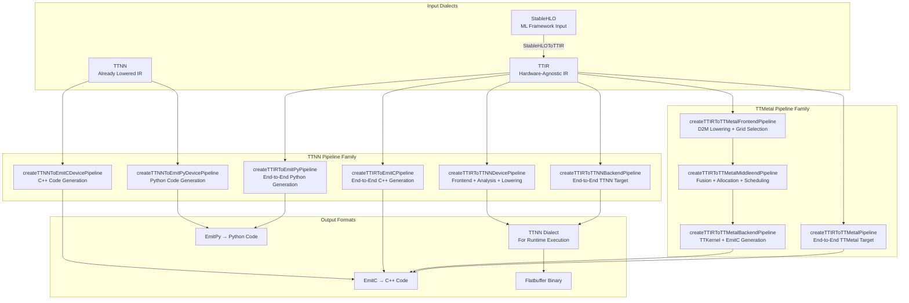
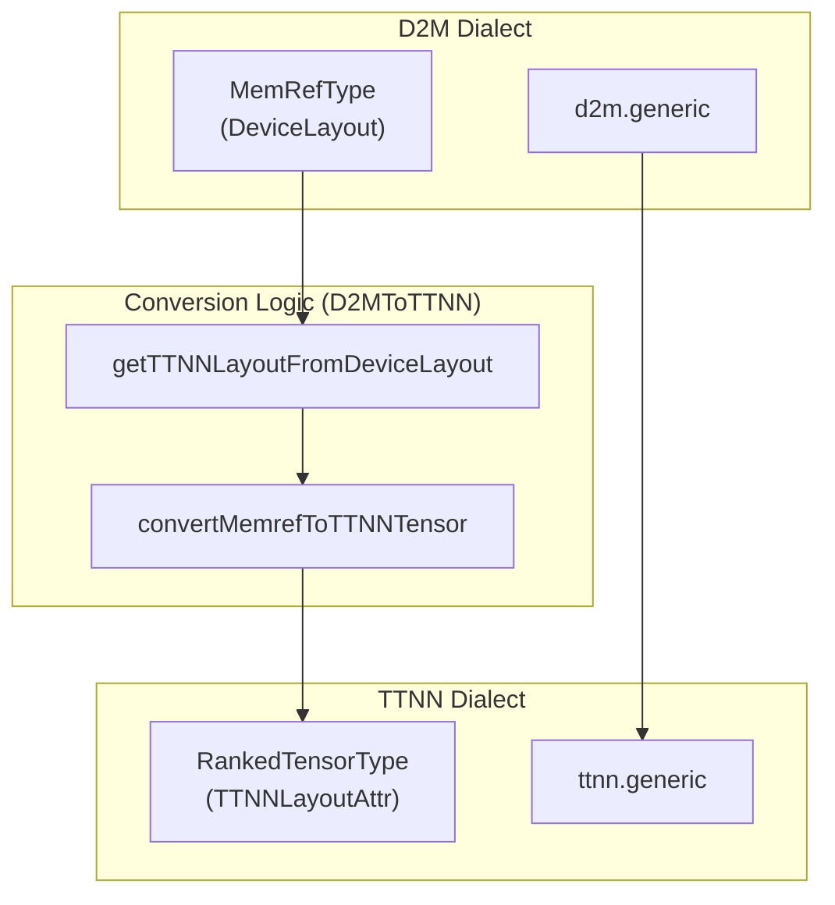
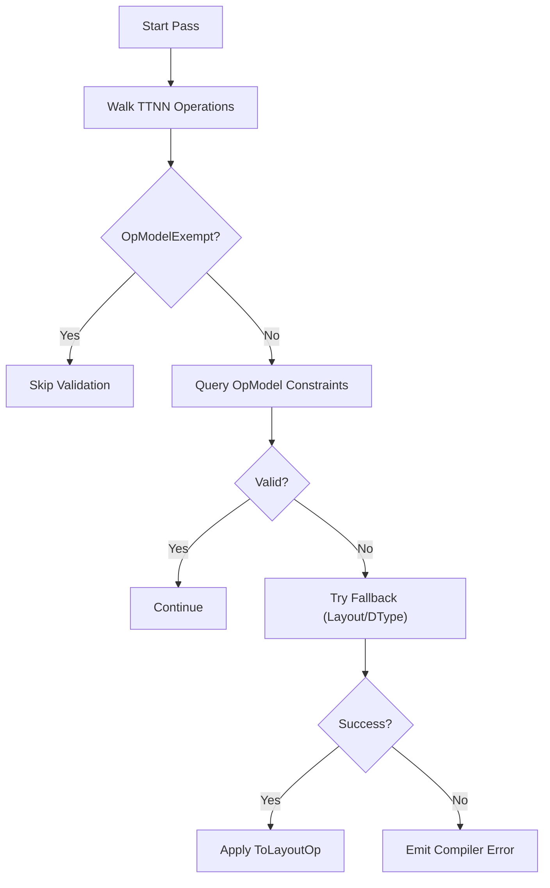

# Compilation Pipelines

Relevant source files
*   [env/patches/stablehlo-complex-mul-expander.patch](https://github.com/tenstorrent/tt-mlir/blob/c7d92e92/env/patches/stablehlo-complex-mul-expander.patch)
*   [include/ttmlir/Dialect/StableHLO/Transforms/Passes.td](https://github.com/tenstorrent/tt-mlir/blob/c7d92e92/include/ttmlir/Dialect/StableHLO/Transforms/Passes.td)
*   [include/ttmlir/Dialect/TTIR/IR/TTIROpsAttrs.td](https://github.com/tenstorrent/tt-mlir/blob/c7d92e92/include/ttmlir/Dialect/TTIR/IR/TTIROpsAttrs.td)
*   [include/ttmlir/Dialect/TTIR/IR/TTIROpsInterfaces.h](https://github.com/tenstorrent/tt-mlir/blob/c7d92e92/include/ttmlir/Dialect/TTIR/IR/TTIROpsInterfaces.h)
*   [include/ttmlir/Dialect/TTIR/IR/TTIROpsInterfaces.td](https://github.com/tenstorrent/tt-mlir/blob/c7d92e92/include/ttmlir/Dialect/TTIR/IR/TTIROpsInterfaces.td)
*   [include/ttmlir/Dialect/TTIR/IR/TTIRTraits.h](https://github.com/tenstorrent/tt-mlir/blob/c7d92e92/include/ttmlir/Dialect/TTIR/IR/TTIRTraits.h)
*   [include/ttmlir/Dialect/TTIR/Pipelines/TTIRPipelines.h](https://github.com/tenstorrent/tt-mlir/blob/c7d92e92/include/ttmlir/Dialect/TTIR/Pipelines/TTIRPipelines.h)
*   [include/ttmlir/Dialect/TTIR/Transforms/Passes.h](https://github.com/tenstorrent/tt-mlir/blob/c7d92e92/include/ttmlir/Dialect/TTIR/Transforms/Passes.h)
*   [include/ttmlir/Dialect/TTIR/Transforms/Passes.td](https://github.com/tenstorrent/tt-mlir/blob/c7d92e92/include/ttmlir/Dialect/TTIR/Transforms/Passes.td)
*   [include/ttmlir/Dialect/TTNN/IR/TTNNWorkaroundsPass.h](https://github.com/tenstorrent/tt-mlir/blob/c7d92e92/include/ttmlir/Dialect/TTNN/IR/TTNNWorkaroundsPass.h)
*   [include/ttmlir/Dialect/TTNN/Pipelines/TTNNPipelines.h](https://github.com/tenstorrent/tt-mlir/blob/c7d92e92/include/ttmlir/Dialect/TTNN/Pipelines/TTNNPipelines.h)
*   [include/ttmlir/Dialect/TTNN/Transforms/Passes.td](https://github.com/tenstorrent/tt-mlir/blob/c7d92e92/include/ttmlir/Dialect/TTNN/Transforms/Passes.td)
*   [include/ttmlir/Transforms/Passes.td](https://github.com/tenstorrent/tt-mlir/blob/c7d92e92/include/ttmlir/Transforms/Passes.td)
*   [lib/Conversion/StableHLOToTTIR/CMakeLists.txt](https://github.com/tenstorrent/tt-mlir/blob/c7d92e92/lib/Conversion/StableHLOToTTIR/CMakeLists.txt)
*   [lib/Dialect/StableHLO/Pipelines/StableHLOPipelines.cpp](https://github.com/tenstorrent/tt-mlir/blob/c7d92e92/lib/Dialect/StableHLO/Pipelines/StableHLOPipelines.cpp)
*   [lib/Dialect/StableHLO/Transforms/CMakeLists.txt](https://github.com/tenstorrent/tt-mlir/blob/c7d92e92/lib/Dialect/StableHLO/Transforms/CMakeLists.txt)
*   [lib/Dialect/StableHLO/Transforms/ComplexDataTypeConversion.cpp](https://github.com/tenstorrent/tt-mlir/blob/c7d92e92/lib/Dialect/StableHLO/Transforms/ComplexDataTypeConversion.cpp)
*   [lib/Dialect/StableHLO/Transforms/DecoupleConstFanout.cpp](https://github.com/tenstorrent/tt-mlir/blob/c7d92e92/lib/Dialect/StableHLO/Transforms/DecoupleConstFanout.cpp)
*   [lib/Dialect/StableHLO/Transforms/RegisterCustomShardingRule.cpp](https://github.com/tenstorrent/tt-mlir/blob/c7d92e92/lib/Dialect/StableHLO/Transforms/RegisterCustomShardingRule.cpp)
*   [lib/Dialect/StableHLO/Utils/CMakeLists.txt](https://github.com/tenstorrent/tt-mlir/blob/c7d92e92/lib/Dialect/StableHLO/Utils/CMakeLists.txt)
*   [lib/Dialect/TTIR/IR/TTIRTraits.cpp](https://github.com/tenstorrent/tt-mlir/blob/c7d92e92/lib/Dialect/TTIR/IR/TTIRTraits.cpp)
*   [lib/Dialect/TTIR/Pipelines/CMakeLists.txt](https://github.com/tenstorrent/tt-mlir/blob/c7d92e92/lib/Dialect/TTIR/Pipelines/CMakeLists.txt)
*   [lib/Dialect/TTIR/Pipelines/TTIRPipelines.cpp](https://github.com/tenstorrent/tt-mlir/blob/c7d92e92/lib/Dialect/TTIR/Pipelines/TTIRPipelines.cpp)
*   [lib/Dialect/TTIR/Transforms/CMakeLists.txt](https://github.com/tenstorrent/tt-mlir/blob/c7d92e92/lib/Dialect/TTIR/Transforms/CMakeLists.txt)
*   [lib/Dialect/TTNN/IR/TTNNWorkaroundsPass.cpp](https://github.com/tenstorrent/tt-mlir/blob/c7d92e92/lib/Dialect/TTNN/IR/TTNNWorkaroundsPass.cpp)
*   [lib/Dialect/TTNN/Pipelines/TTNNPipelines.cpp](https://github.com/tenstorrent/tt-mlir/blob/c7d92e92/lib/Dialect/TTNN/Pipelines/TTNNPipelines.cpp)
*   [lib/Dialect/TTNN/Transforms/CMakeLists.txt](https://github.com/tenstorrent/tt-mlir/blob/c7d92e92/lib/Dialect/TTNN/Transforms/CMakeLists.txt)
*   [lib/Dialect/TTNN/Transforms/Passes.cpp](https://github.com/tenstorrent/tt-mlir/blob/c7d92e92/lib/Dialect/TTNN/Transforms/Passes.cpp)
*   [lib/Dialect/TTNN/Transforms/Workarounds/TTNNWorkaroundsPatterns.cpp](https://github.com/tenstorrent/tt-mlir/blob/c7d92e92/lib/Dialect/TTNN/Transforms/Workarounds/TTNNWorkaroundsPatterns.cpp)
*   [lib/Transforms/CMakeLists.txt](https://github.com/tenstorrent/tt-mlir/blob/c7d92e92/lib/Transforms/CMakeLists.txt)
*   [test/ttmlir/Conversion/StableHLOToTTIR/complex/complex_op.mlir](https://github.com/tenstorrent/tt-mlir/blob/c7d92e92/test/ttmlir/Conversion/StableHLOToTTIR/complex/complex_op.mlir)
*   [test/ttmlir/Conversion/StableHLOToTTIR/complex/imag_op.mlir](https://github.com/tenstorrent/tt-mlir/blob/c7d92e92/test/ttmlir/Conversion/StableHLOToTTIR/complex/imag_op.mlir)
*   [test/ttmlir/Dialect/StableHLO/ComplexDataTypeConversion/complex_concat.mlir](https://github.com/tenstorrent/tt-mlir/blob/c7d92e92/test/ttmlir/Dialect/StableHLO/ComplexDataTypeConversion/complex_concat.mlir)
*   [test/ttmlir/Dialect/StableHLO/ComplexDataTypeConversion/complex_manual_computation.mlir](https://github.com/tenstorrent/tt-mlir/blob/c7d92e92/test/ttmlir/Dialect/StableHLO/ComplexDataTypeConversion/complex_manual_computation.mlir)
*   [test/ttmlir/Dialect/StableHLO/ComplexDataTypeConversion/complex_slice.mlir](https://github.com/tenstorrent/tt-mlir/blob/c7d92e92/test/ttmlir/Dialect/StableHLO/ComplexDataTypeConversion/complex_slice.mlir)
*   [test/ttmlir/Dialect/StableHLO/decouple_constant_fanout/broadcast_in_dim_clone.mlir](https://github.com/tenstorrent/tt-mlir/blob/c7d92e92/test/ttmlir/Dialect/StableHLO/decouple_constant_fanout/broadcast_in_dim_clone.mlir)
*   [test/ttmlir/Dialect/StableHLO/register_custom_sharding_rule/batch_norm.mlir](https://github.com/tenstorrent/tt-mlir/blob/c7d92e92/test/ttmlir/Dialect/StableHLO/register_custom_sharding_rule/batch_norm.mlir)
*   [test/ttmlir/Dialect/StableHLO/register_custom_sharding_rule/custom_op_sdpa.mlir](https://github.com/tenstorrent/tt-mlir/blob/c7d92e92/test/ttmlir/Dialect/StableHLO/register_custom_sharding_rule/custom_op_sdpa.mlir)
*   [test/ttmlir/Dialect/StableHLO/register_custom_sharding_rule/paged_attention.mlir](https://github.com/tenstorrent/tt-mlir/blob/c7d92e92/test/ttmlir/Dialect/StableHLO/register_custom_sharding_rule/paged_attention.mlir)
*   [test/ttmlir/Dialect/TTNN/Transforms/DecomposeLayouts/decomposing_layouts_cpu_hoisted.mlir](https://github.com/tenstorrent/tt-mlir/blob/c7d92e92/test/ttmlir/Dialect/TTNN/Transforms/DecomposeLayouts/decomposing_layouts_cpu_hoisted.mlir)
*   [test/ttmlir/Dialect/TTNN/construct_tensor.mlir](https://github.com/tenstorrent/tt-mlir/blob/c7d92e92/test/ttmlir/Dialect/TTNN/construct_tensor.mlir)
*   [test/ttmlir/Dialect/TTNN/ttir_to_ttnn_pipeline_hoist_call.mlir](https://github.com/tenstorrent/tt-mlir/blob/c7d92e92/test/ttmlir/Dialect/TTNN/ttir_to_ttnn_pipeline_hoist_call.mlir)
*   [test/ttmlir/Silicon/StableHLO/n150/fallback/unsupported.mlir](https://github.com/tenstorrent/tt-mlir/blob/c7d92e92/test/ttmlir/Silicon/StableHLO/n150/fallback/unsupported.mlir)

This page provides an overview of the compilation pipeline system in tt-mlir. Pipelines orchestrate sequences of transformation passes that progressively lower operations from high-level abstractions to hardware-executable code. For details on specific conversion passes and transformations within these pipelines, see [Dialect Conversion and Lowering Passes](https://deepwiki.com/tenstorrent/tt-mlir/3.4-dialect-conversion-and-lowering-passes). For information on the final code generation stages, see [Code Generation: EmitC](https://deepwiki.com/tenstorrent/tt-mlir/3.5-code-generation:-emitc) and [Code Generation: EmitPy](https://deepwiki.com/tenstorrent/tt-mlir/3.6-code-generation:-emitpy).

## Purpose and Scope

Compilation pipelines in tt-mlir are pre-configured sequences of MLIR passes that transform input programs through multiple intermediate representations (dialects) to produce executable artifacts. Each pipeline is tailored to a specific input dialect, target backend, and output format. The pipeline system provides:

*   **Organized pass execution**: Logical grouping of related transformation passes.
*   **Configurable compilation**: Extensive options for optimization levels, memory layout policies, and hardware targeting [include/ttmlir/Dialect/TTNN/Pipelines/TTNNPipelines.h 42-156](https://github.com/tenstorrent/tt-mlir/blob/c7d92e92/include/ttmlir/Dialect/TTNN/Pipelines/TTNNPipelines.h#L42-L156)
*   **Multiple backend support**: TTNN (neural network optimized) and TTMetal (low-level hardware control) paths.
*   **Flexible output formats**: Binary flatbuffers, C++ code, or Python code generation.

## Pipeline Architecture

Compilation pipelines in tt-mlir follow a structured flow from frontend preparation to backend code generation.

### Pipeline Organization



**Pipeline Categories**

Pipelines are categorized by their input/output and internal structure:

| Pipeline Type | Input | Output | Purpose |
|--------------|-------|--------|---------|
| Device Pipelines | TTIR or TTNN | Device Module (TTNN/TTMetal) | Transform operations within `DeviceModuleOp` |
| Backend Pipelines | TTIR | TTNN Dialect + CPU LLVM | End-to-end compilation to TTNN backend |
| Code Generation Pipelines | TTNN | EmitC/EmitPy | Convert TTNN operations to executable code |
| End-to-End Pipelines | TTIR | C++/Python/Flatbuffer | Complete compilation flow to final artifacts |

Sources: [lib/Dialect/TTNN/Pipelines/TTNNPipelines.cpp:216-647](), [include/ttmlir/Dialect/TTNN/Pipelines/TTNNPipelines.h:25-38]()
```


**Pipeline Categories**

Pipelines are categorized by their input/output and internal structure:

| Pipeline Type | Input | Output | Purpose |
| --- | --- | --- | --- |
| Device Pipelines | TTIR or TTNN | Device Module (TTNN/TTMetal) | Transform operations within `DeviceModuleOp` |
| Backend Pipelines | TTIR | TTNN Dialect + CPU LLVM | End-to-end compilation to TTNN backend |
| Code Generation Pipelines | TTNN | EmitC/EmitPy | Convert TTNN operations to executable code |
| End-to-End Pipelines | TTIR | C++/Python/Flatbuffer | Complete compilation flow to final artifacts |

Sources: [lib/Dialect/TTNN/Pipelines/TTNNPipelines.cpp 216-647](https://github.com/tenstorrent/tt-mlir/blob/c7d92e92/lib/Dialect/TTNN/Pipelines/TTNNPipelines.cpp#L216-L647)[include/ttmlir/Dialect/TTNN/Pipelines/TTNNPipelines.h 25-38](https://github.com/tenstorrent/tt-mlir/blob/c7d92e92/include/ttmlir/Dialect/TTNN/Pipelines/TTNNPipelines.h#L25-L38)

## Frontend: StableHLO to TTIR

The frontend pipeline bridges high-level framework outputs to the Tenstorrent Intermediate Representation (TTIR).

*   **StableHLO to TTIR Pipeline**: Orchestrated by `createStableHLOToTTIRPipeline`, this stage includes complex math expansion, type conversion for complex data types, and the core conversion to TTIR [lib/Dialect/TTIR/Pipelines/TTIRPipelines.cpp 60-84](https://github.com/tenstorrent/tt-mlir/blob/c7d92e92/lib/Dialect/TTIR/Pipelines/TTIRPipelines.cpp#L60-L84)
*   **Shardy and Distributed Lowering**: The `createStableHLOPipeline` integrates Shardy for sharding propagation, using passes like `createUserPriorityPropagationPass` and `createReshardToCollectivesPass`[lib/Dialect/StableHLO/Pipelines/StableHLOPipelines.cpp 17-134](https://github.com/tenstorrent/tt-mlir/blob/c7d92e92/lib/Dialect/StableHLO/Pipelines/StableHLOPipelines.cpp#L17-L134)
*   **CPU Fallback**: If enabled, unsupported StableHLO operations are hoisted to a CPU module using `CPUHoistNonLowerableSHLOOpsTransform`[lib/Dialect/TTIR/Pipelines/TTIRPipelines.cpp 86-98](https://github.com/tenstorrent/tt-mlir/blob/c7d92e92/lib/Dialect/TTIR/Pipelines/TTIRPipelines.cpp#L86-L98)
*   **Decomposition**: High-level operations are decomposed into more granular TTIR primitives using `createTTIRToTTIRDecompositionPass`[lib/Dialect/TTNN/Pipelines/TTNNPipelines.cpp 57](https://github.com/tenstorrent/tt-mlir/blob/c7d92e92/lib/Dialect/TTNN/Pipelines/TTNNPipelines.cpp#L57-L57)

For details, see [Frontend: StableHLO to TTIR](https://deepwiki.com/tenstorrent/tt-mlir/3.1-frontend:-stablehlo-to-ttir).

## TTNN Pipeline Family

The TTNN pipeline family targets neural network workloads with device placement, memory configuration, and hardware-specific operations. These pipelines produce TTNN dialect output suitable for the TTNN runtime.

### TTIR to TTNN Device Pipeline

```mermaid
graph TB
    subgraph "TTIR Preparation [createTTNNPipelineTTIRPasses]"
        RegisterDevice["TTCoreRegisterDevicePass<br/>Device registration & mesh setup"]
        PopulateArgs["TTPopulateArgumentTypes<br/>Set argument type map"]
        Fusing1["TTIRFusing<br/>Initial fusion"]
        QuantDequant["TTIRQuantDequantConversion<br/>Quantization handling"]
        Decomposition["TTIRToTTIRDecomposition<br/>Op decomposition"]
        FlattenSW["TTIRFlattenSlidingWindow<br/>Conv2d compatibility"]
        EraseInverse["TTIREraseInverseOps<br/>TM optimization"]
        ImplicitBCast["TTIRImplicitBroadcastFold<br/>Broadcast folding"]
    end
    
    subgraph "Lowering [createTTNNPipelineLoweringPasses]"
        TTNNLayout["TTNNLayout<br/>Add layout information"]
        ConvertTTNN["ConvertTTIRToTTNN<br/>Dialect conversion"]
        RemoveDead["RemoveDeadValues<br/>Optional cleanup"]
    end
    
    subgraph "Analysis [createTTNNPipelineAnalysisPasses]"
        UniqueLocations["TTNNUniqueLocations<br/>Location validation"]
        DeviceWrapper["DevicePassesWrapper<br/>Device lifecycle management"]
        RowMajor["TTNNRowMajorLayoutPropagation<br/>Layout propagation"]
        Optimizer["TTNNOptimizer<br/>Grid & layout optimization"]
        Validation["TTNNOperationValidationAndFallback<br/>Hardware constraint checks"]
        PrepareConv["TTNNPrepareConv2dWeightsAndBias<br/>Conv2d optimization"]
    end
    
    subgraph "Finalization"
        Workarounds["TTNNWorkarounds<br/>Hardware workarounds"]
        BFP8["TTNNWeightBFP8Conversion<br/>Weight conversion"]
        SetKernelCfg["TTNNSetComputeKernelConfig<br/>Compute config"]
        D2MFusing["TTNND2MFusing<br/>Optional D2M fusion"]
        DecomposeLayout["TTNNDecomposeLayouts<br/>Layout decomposition"]
        Deallocate["TTNNDeallocate<br/>Memory deallocation"]
    end
    
    RegisterDevice --> PopulateArgs
    PopulateArgs --> Fusing1
    Fusing1 --> QuantDequant
    QuantDequant --> Decomposition
    Decomposition --> FlattenSW
    FlattenSW --> EraseInverse
    EraseInverse --> ImplicitBCast
    
    ImplicitBCast --> TTNNLayout
    TTNNLayout --> ConvertTTNN
    ConvertTTNN --> RemoveDead
    
    RemoveDead --> UniqueLocations
    UniqueLocations --> DeviceWrapper
    DeviceWrapper --> RowMajor
    RowMajor --> Optimizer
    Optimizer --> Validation
    Validation --> PrepareConv
    
    PrepareConv --> Workarounds
    Workarounds --> BFP8
    BFP8 --> SetKernelCfg
    SetKernelCfg --> D2MFusing
    D2MFusing --> DecomposeLayout
    DecomposeLayout --> Deallocate
```



Sources: [lib/Dialect/TTNN/Pipelines/TTNNPipelines.cpp:32-95](), [lib/Dialect/TTNN/Pipelines/TTNNPipelines.cpp:97-137](), [lib/Dialect/TTNN/Pipelines/TTNNPipelines.cpp:139-149]()

For details, see [TTIR to TTNN Backend Pipeline](#3.2).
```


The `createTTIRToTTNNDevicePipeline` function implements the core TTIR-to-TTNN transformation. It operates on the Device module nested within a `DeviceModuleOp`.

**Pipeline Structure:**

Sources: [lib/Dialect/TTNN/Pipelines/TTNNPipelines.cpp 32-95](https://github.com/tenstorrent/tt-mlir/blob/c7d92e92/lib/Dialect/TTNN/Pipelines/TTNNPipelines.cpp#L32-L95)[lib/Dialect/TTNN/Pipelines/TTNNPipelines.cpp 97-137](https://github.com/tenstorrent/tt-mlir/blob/c7d92e92/lib/Dialect/TTNN/Pipelines/TTNNPipelines.cpp#L97-L137)[lib/Dialect/TTNN/Pipelines/TTNNPipelines.cpp 139-149](https://github.com/tenstorrent/tt-mlir/blob/c7d92e92/lib/Dialect/TTNN/Pipelines/TTNNPipelines.cpp#L139-L149)

For details, see [TTIR to TTNN Backend Pipeline](https://deepwiki.com/tenstorrent/tt-mlir/3.2-ttir-to-ttnn-backend-pipeline).

## TTMetal Pipeline Family

The TTMetal pipeline family targets low-level hardware control through the D2M (Data-to-Metal) and TTKernel dialects. This path provides fine-grained control over memory allocation, grid layout, and kernel execution.

### Pipeline Stages

The TTMetal path follows a D2M-centric lowering strategy, bridging TTIR to low-level metal operations.

| Stage | Pass / Component | Role |
| --- | --- | --- |
| **Frontend** | `TTIRToD2MPass` | Lowers high-level TTIR to grid-aware D2M ops |
| **Middleend** | `D2MGridSelection` | Determines optimal hardware grid for ops |
| **Middleend** | `D2MAllocate` | Manages memory buffers and circular buffers |
| **Backend** | `ConvertD2MToTTKernelPass` | Generates low-level compute kernels |
| **Backend** | `ConvertD2MToTTMetalPass` | Generates host-side hardware control code |

Sources: [lib/Dialect/TTNN/Pipelines/TTNNPipelines.cpp 13](https://github.com/tenstorrent/tt-mlir/blob/c7d92e92/lib/Dialect/TTNN/Pipelines/TTNNPipelines.cpp#L13-L13)[lib/Dialect/TTIR/Pipelines/TTIRPipelines.cpp 102-165](https://github.com/tenstorrent/tt-mlir/blob/c7d92e92/lib/Dialect/TTIR/Pipelines/TTIRPipelines.cpp#L102-L165)

For details, see [TTIR to TTMetal Backend Pipeline](https://deepwiki.com/tenstorrent/tt-mlir/3.3-ttir-to-ttmetal-backend-pipeline).

## Dialect Conversion and Lowering Passes

The transformation between dialects is managed by a series of pattern-based conversion passes.

*   **TTIR to TTNN**: Conversion handles the transition from high-level IR to neural network optimized ops using patterns registered in `TTIRToTTNN`[lib/Dialect/TTNN/Pipelines/TTNNPipelines.cpp 9](https://github.com/tenstorrent/tt-mlir/blob/c7d92e92/lib/Dialect/TTNN/Pipelines/TTNNPipelines.cpp#L9-L9)
*   **Workarounds**: Hardware-specific fixes are applied via `TTNNWorkaroundsPatterns`, which uses patterns like `AllGatherOpRewritePattern`, `Conv2dRewritePattern`, and `LinearOpRewritePattern` to handle device-specific constraints [lib/Dialect/TTNN/Transforms/Workarounds/TTNNWorkaroundsPatterns.cpp 12-37](https://github.com/tenstorrent/tt-mlir/blob/c7d92e92/lib/Dialect/TTNN/Transforms/Workarounds/TTNNWorkaroundsPatterns.cpp#L12-L37)
*   **Decomposition**: Permanent functional decompositions are handled by `TTNNDecomposition` for ops that cannot be handled by any available fused kernel [include/ttmlir/Dialect/TTNN/Transforms/Passes.td 55-78](https://github.com/tenstorrent/tt-mlir/blob/c7d92e92/include/ttmlir/Dialect/TTNN/Transforms/Passes.td#L55-L78)
*   **Fusion Patterns**: Complex kernels like SDPA, RoPE, and TopK are fused at the TTNN level using specialized patterns [lib/Dialect/TTNN/Transforms/CMakeLists.txt 4-8](https://github.com/tenstorrent/tt-mlir/blob/c7d92e92/lib/Dialect/TTNN/Transforms/CMakeLists.txt#L4-L8)

For details, see [Dialect Conversion and Lowering Passes](https://deepwiki.com/tenstorrent/tt-mlir/3.4-dialect-conversion-and-lowering-passes).

## Code Generation

The final stages of the pipeline produce executable code or binary artifacts.

*   **EmitC Pipeline**: Converts TTNN operations to C++ function calls. It uses `TTNNToEmitC` to map dialect ops to standalone C++ code [lib/Dialect/TTNN/Pipelines/TTNNPipelines.cpp 10](https://github.com/tenstorrent/tt-mlir/blob/c7d92e92/lib/Dialect/TTNN/Pipelines/TTNNPipelines.cpp#L10-L10)
*   **EmitPy Pipeline**: Generates Python scripts that use the `ttnn` Python API for model execution. This path supports "golden mode" and CPU-hoisted constant evaluation [lib/Dialect/TTNN/Pipelines/TTNNPipelines.cpp 11](https://github.com/tenstorrent/tt-mlir/blob/c7d92e92/lib/Dialect/TTNN/Pipelines/TTNNPipelines.cpp#L11-L11)[lib/Dialect/TTNN/Transforms/Passes.cpp 44-177](https://github.com/tenstorrent/tt-mlir/blob/c7d92e92/lib/Dialect/TTNN/Transforms/Passes.cpp#L44-L177)
*   **Flatbuffer Serialization**: The final MLIR module is serialized into a Flatbuffer binary format for runtime execution, including debug information and hardware-specific configurations.

For details, see [Code Generation: EmitC](https://deepwiki.com/tenstorrent/tt-mlir/3.5-code-generation:-emitc), [Code Generation: EmitPy](https://deepwiki.com/tenstorrent/tt-mlir/3.6-code-generation:-emitpy), and [Flatbuffer Serialization](https://deepwiki.com/tenstorrent/tt-mlir/3.7-flatbuffer-serialization).

Dismiss
Refresh this wiki

Enter email to refresh

## Additional Diagrams


#### D2M to TTNN/TTMetal Patterns



Sources: [lib/Conversion/D2MToTTNN/D2MToTTNN.cpp:62-141]()
```


### Validation and Fallback




Operations can be marked with the `OpModelExempt` trait to bypass validation if they are known to be host-side or special-case operations [include/ttmlir/Dialect/TTNN/IR/TTNNTraits.h:58-60](). The `validateConstraints` function handles the core logic of comparing hardware query results against the effective L1 limit of the device [lib/Dialect/TTNN/Validation/OpConstraintValidation.cpp:129-144]().

Sources: [lib/Dialect/TTNN/Transforms/OptimizerPasses/OperationValidationAndFallback.cpp:149-185](), [lib/Dialect/TTNN/Validation/OpConstraintValidation.cpp:107-156](), [include/ttmlir/Dialect/TTNN/IR/TTNNTraits.h:58-60]()

---
```

