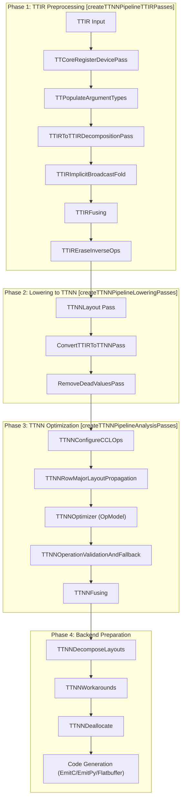
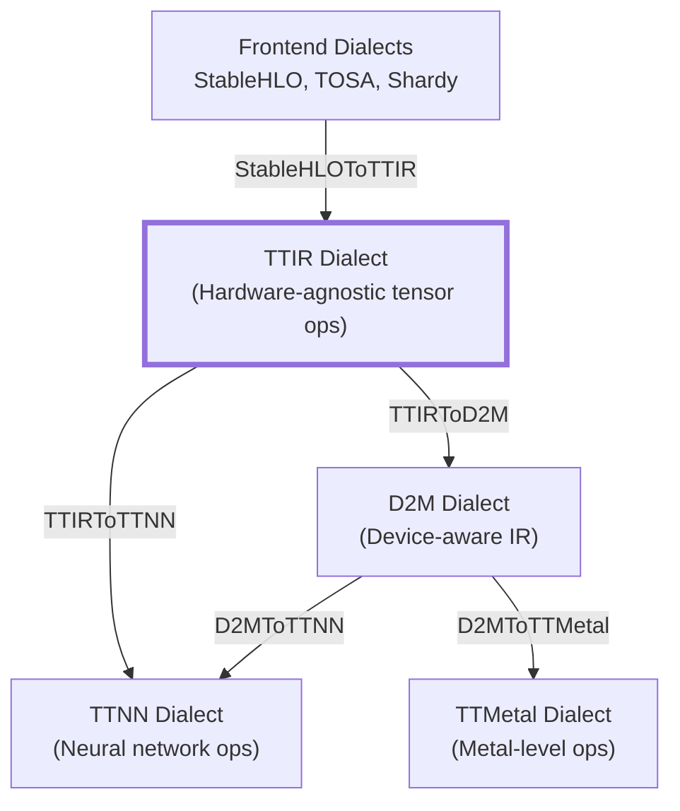
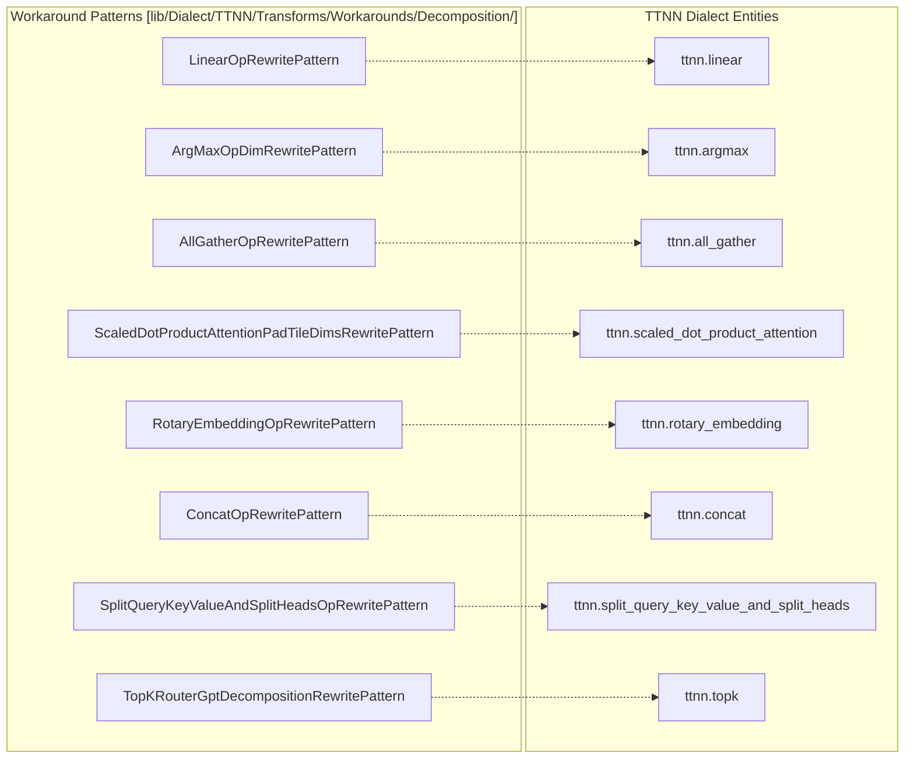

# TTIR to TTNN Backend Pipeline

Relevant source files
*   [include/ttmlir/Dialect/TTIR/IR/TTIROps.td](https://github.com/tenstorrent/tt-mlir/blob/c7d92e92/include/ttmlir/Dialect/TTIR/IR/TTIROps.td)
*   [include/ttmlir/Dialect/TTIR/IR/TTIROpsInterfaces.h](https://github.com/tenstorrent/tt-mlir/blob/c7d92e92/include/ttmlir/Dialect/TTIR/IR/TTIROpsInterfaces.h)
*   [include/ttmlir/Dialect/TTIR/IR/TTIROpsInterfaces.td](https://github.com/tenstorrent/tt-mlir/blob/c7d92e92/include/ttmlir/Dialect/TTIR/IR/TTIROpsInterfaces.td)
*   [include/ttmlir/Dialect/TTIR/IR/TTIRTraits.h](https://github.com/tenstorrent/tt-mlir/blob/c7d92e92/include/ttmlir/Dialect/TTIR/IR/TTIRTraits.h)
*   [include/ttmlir/Dialect/TTIR/Transforms/Passes.h](https://github.com/tenstorrent/tt-mlir/blob/c7d92e92/include/ttmlir/Dialect/TTIR/Transforms/Passes.h)
*   [include/ttmlir/Dialect/TTIR/Transforms/Passes.td](https://github.com/tenstorrent/tt-mlir/blob/c7d92e92/include/ttmlir/Dialect/TTIR/Transforms/Passes.td)
*   [include/ttmlir/Dialect/TTNN/IR/TTNNOps.td](https://github.com/tenstorrent/tt-mlir/blob/c7d92e92/include/ttmlir/Dialect/TTNN/IR/TTNNOps.td)
*   [include/ttmlir/Dialect/TTNN/IR/TTNNWorkaroundsPass.h](https://github.com/tenstorrent/tt-mlir/blob/c7d92e92/include/ttmlir/Dialect/TTNN/IR/TTNNWorkaroundsPass.h)
*   [include/ttmlir/Dialect/TTNN/Pipelines/TTNNPipelines.h](https://github.com/tenstorrent/tt-mlir/blob/c7d92e92/include/ttmlir/Dialect/TTNN/Pipelines/TTNNPipelines.h)
*   [include/ttmlir/Dialect/TTNN/Transforms/Passes.td](https://github.com/tenstorrent/tt-mlir/blob/c7d92e92/include/ttmlir/Dialect/TTNN/Transforms/Passes.td)
*   [include/ttmlir/Target/TTNN/program.fbs](https://github.com/tenstorrent/tt-mlir/blob/c7d92e92/include/ttmlir/Target/TTNN/program.fbs)
*   [lib/Conversion/StableHLOToTTIR/StableHLOToTTIRPatterns.cpp](https://github.com/tenstorrent/tt-mlir/blob/c7d92e92/lib/Conversion/StableHLOToTTIR/StableHLOToTTIRPatterns.cpp)
*   [lib/Conversion/TTIRToTTNN/TTIRToTTNN.cpp](https://github.com/tenstorrent/tt-mlir/blob/c7d92e92/lib/Conversion/TTIRToTTNN/TTIRToTTNN.cpp)
*   [lib/Conversion/TTNNToEmitC/TTNNToEmitC.cpp](https://github.com/tenstorrent/tt-mlir/blob/c7d92e92/lib/Conversion/TTNNToEmitC/TTNNToEmitC.cpp)
*   [lib/Dialect/TTIR/IR/TTIROps.cpp](https://github.com/tenstorrent/tt-mlir/blob/c7d92e92/lib/Dialect/TTIR/IR/TTIROps.cpp)
*   [lib/Dialect/TTIR/IR/TTIRTraits.cpp](https://github.com/tenstorrent/tt-mlir/blob/c7d92e92/lib/Dialect/TTIR/IR/TTIRTraits.cpp)
*   [lib/Dialect/TTIR/Transforms/CMakeLists.txt](https://github.com/tenstorrent/tt-mlir/blob/c7d92e92/lib/Dialect/TTIR/Transforms/CMakeLists.txt)
*   [lib/Dialect/TTIR/Transforms/TTIRFusing.cpp](https://github.com/tenstorrent/tt-mlir/blob/c7d92e92/lib/Dialect/TTIR/Transforms/TTIRFusing.cpp)
*   [lib/Dialect/TTIR/Utils/VerificationUtils.cpp](https://github.com/tenstorrent/tt-mlir/blob/c7d92e92/lib/Dialect/TTIR/Utils/VerificationUtils.cpp)
*   [lib/Dialect/TTNN/IR/TTNNOps.cpp](https://github.com/tenstorrent/tt-mlir/blob/c7d92e92/lib/Dialect/TTNN/IR/TTNNOps.cpp)
*   [lib/Dialect/TTNN/IR/TTNNWorkaroundsPass.cpp](https://github.com/tenstorrent/tt-mlir/blob/c7d92e92/lib/Dialect/TTNN/IR/TTNNWorkaroundsPass.cpp)
*   [lib/Dialect/TTNN/Pipelines/TTNNPipelines.cpp](https://github.com/tenstorrent/tt-mlir/blob/c7d92e92/lib/Dialect/TTNN/Pipelines/TTNNPipelines.cpp)
*   [lib/Dialect/TTNN/Transforms/CMakeLists.txt](https://github.com/tenstorrent/tt-mlir/blob/c7d92e92/lib/Dialect/TTNN/Transforms/CMakeLists.txt)
*   [lib/Dialect/TTNN/Transforms/Passes.cpp](https://github.com/tenstorrent/tt-mlir/blob/c7d92e92/lib/Dialect/TTNN/Transforms/Passes.cpp)
*   [lib/Dialect/TTNN/Transforms/TTNNDecomposeLayouts.cpp](https://github.com/tenstorrent/tt-mlir/blob/c7d92e92/lib/Dialect/TTNN/Transforms/TTNNDecomposeLayouts.cpp)
*   [lib/Dialect/TTNN/Transforms/TTNNFusing.cpp](https://github.com/tenstorrent/tt-mlir/blob/c7d92e92/lib/Dialect/TTNN/Transforms/TTNNFusing.cpp)
*   [lib/Dialect/TTNN/Transforms/TTNNLayout.cpp](https://github.com/tenstorrent/tt-mlir/blob/c7d92e92/lib/Dialect/TTNN/Transforms/TTNNLayout.cpp)
*   [lib/Dialect/TTNN/Transforms/Workarounds/TTNNWorkaroundsPatterns.cpp](https://github.com/tenstorrent/tt-mlir/blob/c7d92e92/lib/Dialect/TTNN/Transforms/Workarounds/TTNNWorkaroundsPatterns.cpp)
*   [lib/Target/TTNN/TTNNToFlatbuffer.cpp](https://github.com/tenstorrent/tt-mlir/blob/c7d92e92/lib/Target/TTNN/TTNNToFlatbuffer.cpp)
*   [runtime/include/tt/runtime/detail/ttnn/layout_converter.h](https://github.com/tenstorrent/tt-mlir/blob/c7d92e92/runtime/include/tt/runtime/detail/ttnn/layout_converter.h)
*   [runtime/lib/ttnn/operations/CMakeLists.txt](https://github.com/tenstorrent/tt-mlir/blob/c7d92e92/runtime/lib/ttnn/operations/CMakeLists.txt)
*   [test/ttmlir/Conversion/StableHLOToTTIR/conv3d_decomposition.mlir](https://github.com/tenstorrent/tt-mlir/blob/c7d92e92/test/ttmlir/Conversion/StableHLOToTTIR/conv3d_decomposition.mlir)
*   [test/ttmlir/Conversion/StableHLOToTTIR/scatter_op.mlir](https://github.com/tenstorrent/tt-mlir/blob/c7d92e92/test/ttmlir/Conversion/StableHLOToTTIR/scatter_op.mlir)
*   [test/ttmlir/Dialect/TTIR/Transforms/fold_full_to_scalar.mlir](https://github.com/tenstorrent/tt-mlir/blob/c7d92e92/test/ttmlir/Dialect/TTIR/Transforms/fold_full_to_scalar.mlir)
*   [test/ttmlir/Dialect/TTIR/canonicalize/eltwise_binary_op_fold_tests.mlir](https://github.com/tenstorrent/tt-mlir/blob/c7d92e92/test/ttmlir/Dialect/TTIR/canonicalize/eltwise_binary_op_fold_tests.mlir)
*   [test/ttmlir/Dialect/TTIR/fusing/conv2d_batchnorm.mlir](https://github.com/tenstorrent/tt-mlir/blob/c7d92e92/test/ttmlir/Dialect/TTIR/fusing/conv2d_batchnorm.mlir)
*   [test/ttmlir/Dialect/TTIR/fusing/conv2d_bias_fusing.mlir](https://github.com/tenstorrent/tt-mlir/blob/c7d92e92/test/ttmlir/Dialect/TTIR/fusing/conv2d_bias_fusing.mlir)
*   [test/ttmlir/Dialect/TTIR/fusing/conv2d_multiply_commute.mlir](https://github.com/tenstorrent/tt-mlir/blob/c7d92e92/test/ttmlir/Dialect/TTIR/fusing/conv2d_multiply_commute.mlir)
*   [test/ttmlir/Dialect/TTIR/fusing/convolution_bias_fusing.mlir](https://github.com/tenstorrent/tt-mlir/blob/c7d92e92/test/ttmlir/Dialect/TTIR/fusing/convolution_bias_fusing.mlir)
*   [test/ttmlir/Dialect/TTNN/Transforms/DecomposeLayouts/decomposing_layouts_from_host.mlir](https://github.com/tenstorrent/tt-mlir/blob/c7d92e92/test/ttmlir/Dialect/TTNN/Transforms/DecomposeLayouts/decomposing_layouts_from_host.mlir)
*   [test/ttmlir/Dialect/TTNN/Transforms/DecomposeLayouts/decomposing_layouts_on_device.mlir](https://github.com/tenstorrent/tt-mlir/blob/c7d92e92/test/ttmlir/Dialect/TTNN/Transforms/DecomposeLayouts/decomposing_layouts_on_device.mlir)
*   [test/ttmlir/Dialect/TTNN/Transforms/Fusing/matmul_fusing.mlir](https://github.com/tenstorrent/tt-mlir/blob/c7d92e92/test/ttmlir/Dialect/TTNN/Transforms/Fusing/matmul_fusing.mlir)
*   [test/ttmlir/Dialect/TTNN/fusing/conv2d_activation_fusing.mlir](https://github.com/tenstorrent/tt-mlir/blob/c7d92e92/test/ttmlir/Dialect/TTNN/fusing/conv2d_activation_fusing.mlir)
*   [test/ttmlir/Dialect/TTNN/simple_full.mlir](https://github.com/tenstorrent/tt-mlir/blob/c7d92e92/test/ttmlir/Dialect/TTNN/simple_full.mlir)
*   [test/ttmlir/Dialect/TTNN/simple_scatter.mlir](https://github.com/tenstorrent/tt-mlir/blob/c7d92e92/test/ttmlir/Dialect/TTNN/simple_scatter.mlir)
*   [test/ttmlir/Silicon/TTNN/n150/Transforms/DecomposeLayouts/decomposing_layouts_from_host.mlir](https://github.com/tenstorrent/tt-mlir/blob/c7d92e92/test/ttmlir/Silicon/TTNN/n150/Transforms/DecomposeLayouts/decomposing_layouts_from_host.mlir)
*   [test/ttmlir/Silicon/TTNN/n150/Transforms/DecomposeLayouts/decomposing_layouts_on_device.mlir](https://github.com/tenstorrent/tt-mlir/blob/c7d92e92/test/ttmlir/Silicon/TTNN/n150/Transforms/DecomposeLayouts/decomposing_layouts_on_device.mlir)
*   [test/ttmlir/Silicon/TTNN/n150/simple_full.mlir](https://github.com/tenstorrent/tt-mlir/blob/c7d92e92/test/ttmlir/Silicon/TTNN/n150/simple_full.mlir)

This document details the TTIR to TTNN backend compilation pipeline, which transforms high-level TTIR dialect operations into device-executable TTNN operations. This pipeline includes TTIR preprocessing, dialect conversion, optimization passes, layout analysis, and hardware-specific workarounds.

## Pipeline Overview

The TTIR to TTNN backend pipeline consists of major phases that progressively lower and optimize the IR. The pipeline is constructed in `lib/Dialect/TTNN/Pipelines/TTNNPipelines.cpp` using helper functions that group passes into logical groupings.

### Compilation Flow Diagram

Sources: [lib/Dialect/TTNN/Pipelines/TTNNPipelines.cpp 32-97](https://github.com/tenstorrent/tt-mlir/blob/c7d92e92/lib/Dialect/TTNN/Pipelines/TTNNPipelines.cpp#L32-L97)[lib/Dialect/TTNN/Pipelines/TTNNPipelines.cpp 99-185](https://github.com/tenstorrent/tt-mlir/blob/c7d92e92/lib/Dialect/TTNN/Pipelines/TTNNPipelines.cpp#L99-L185)[lib/Dialect/TTNN/Pipelines/TTNNPipelines.cpp 187-215](https://github.com/tenstorrent/tt-mlir/blob/c7d92e92/lib/Dialect/TTNN/Pipelines/TTNNPipelines.cpp#L187-L215)




Sources: [lib/Dialect/TTNN/Pipelines/TTNNPipelines.cpp:32-97](), [lib/Dialect/TTNN/Pipelines/TTNNPipelines.cpp:99-185](), [lib/Dialect/TTNN/Pipelines/TTNNPipelines.cpp:187-215]()
```



Sources: [lib/Conversion/StableHLOToTTIR/StableHLOToTTIRPatterns.cpp:5-18](), [lib/Conversion/TTIRToTTNN/TTIRToTTNN.cpp:5-18](), [include/ttmlir/Dialect/TTIR/IR/TTIROps.td:1-12]()

The TTIR dialect provides:
- Hardware-agnostic operation semantics.
- Implicit broadcast resolution via the `TTIRImplicitBroadcastFold` pass [lib/Dialect/TTNN/Pipelines/TTNNPipelines.cpp:59-61]().
- Type inference and shape propagation via `InferTypeOpInterface` [include/ttmlir/Dialect/TTIR/IR/TTIROps.td:15-15]().
- Operation decomposition primitives, such as decomposing `ttir.index` into `ttir.slice_static` [lib/Conversion/TTIRToTTIRDecomposition/TTIRToTTIRDecomposition.cpp:35-92]().
- Layout transition operations via `ttir.to_layout` [include/ttmlir/Dialect/TTIR/IR/TTIROps.td:36-50]().
```
## TTIR Preprocessing Phase

The preprocessing phase prepares TTIR operations for conversion to TTNN by performing transformations at the TTIR level.

### Device Registration and Configuration

The pipeline begins by registering device information and populating argument types:

*   **TTCoreRegisterDevicePass**: Initializes device context using `TTCoreRegisterDevicePassOptions` including system descriptor, mesh shape, and mesh topology [lib/Dialect/TTNN/Pipelines/TTNNPipelines.cpp 35-43](https://github.com/tenstorrent/tt-mlir/blob/c7d92e92/lib/Dialect/TTNN/Pipelines/TTNNPipelines.cpp#L35-L43)
*   **TTPopulateArgumentTypes**: Assigns types to function arguments based on the `argumentTypeMap`[lib/Dialect/TTNN/Pipelines/TTNNPipelines.cpp 45-46](https://github.com/tenstorrent/tt-mlir/blob/c7d92e92/lib/Dialect/TTNN/Pipelines/TTNNPipelines.cpp#L45-L46)

### TTIR Decomposition and Fusing

*   **TTIRToTTIRDecompositionPass**: Decomposes complex TTIR operations into simpler primitives. For example, `ReverseOp` is decomposed into a sequence of `PermuteOp`, `ReshapeOp`, and `EmbeddingOp`[lib/Conversion/TTIRToTTIRDecomposition/TTIRToTTIRDecomposition.cpp 104-188](https://github.com/tenstorrent/tt-mlir/blob/c7d92e92/lib/Conversion/TTIRToTTIRDecomposition/TTIRToTTIRDecomposition.cpp#L104-L188)
*   **TTIRFusing**: Performs high-level fusions. Key patterns include: 
    *   **ConvAddBias**: Fuses `Conv2d` followed by `Add` into a single `Conv2d` with bias [test/ttmlir/Dialect/TTIR/fusing/convolution_bias_fusing.mlir](https://github.com/tenstorrent/tt-mlir/blob/c7d92e92/test/ttmlir/Dialect/TTIR/fusing/convolution_bias_fusing.mlir)
    *   **ReductionWithReshapePattern**: Fuses `ReductionOp` followed by `Reshape` by setting `keep_dim=true`[lib/Dialect/TTIR/Transforms/TTIRFusing.cpp 133-158](https://github.com/tenstorrent/tt-mlir/blob/c7d92e92/lib/Dialect/TTIR/Transforms/TTIRFusing.cpp#L133-L158)
    *   **RoPE/TopK**: Advanced patterns like `RoPEFusingPattern` and `TopKFusingPattern` are integrated at the TTIR level [lib/Dialect/TTIR/Transforms/TTIRFusing.cpp 7-10](https://github.com/tenstorrent/tt-mlir/blob/c7d92e92/lib/Dialect/TTIR/Transforms/TTIRFusing.cpp#L7-L10)

*   **Sliding Window**: `TTIRFlattenSlidingWindow` flattens sliding window operations (e.g., `conv2d`, `max_pool2d`) for compatibility with TTNN [lib/Dialect/TTNN/Pipelines/TTNNPipelines.cpp 77-78](https://github.com/tenstorrent/tt-mlir/blob/c7d92e92/lib/Dialect/TTNN/Pipelines/TTNNPipelines.cpp#L77-L78)[include/ttmlir/Dialect/TTIR/Transforms/Passes.td 130-154](https://github.com/tenstorrent/tt-mlir/blob/c7d92e92/include/ttmlir/Dialect/TTIR/Transforms/Passes.td#L130-L154)

Sources: [lib/Conversion/TTIRToTTIRDecomposition/TTIRToTTIRDecomposition.cpp 35-188](https://github.com/tenstorrent/tt-mlir/blob/c7d92e92/lib/Conversion/TTIRToTTIRDecomposition/TTIRToTTIRDecomposition.cpp#L35-L188)[lib/Dialect/TTNN/Pipelines/TTNNPipelines.cpp 57-78](https://github.com/tenstorrent/tt-mlir/blob/c7d92e92/lib/Dialect/TTNN/Pipelines/TTNNPipelines.cpp#L57-L78)[lib/Dialect/TTIR/Transforms/TTIRFusing.cpp 36-158](https://github.com/tenstorrent/tt-mlir/blob/c7d92e92/lib/Dialect/TTIR/Transforms/TTIRFusing.cpp#L36-L158)

## Dialect Conversion: TTIR to TTNN

The core conversion logic resides in `lib/Conversion/TTIRToTTNN/TTIRToTTNN.cpp`. It uses the MLIR `ConversionPatternRewriter` to map TTIR operations to TTNN equivalents.

### Conversion Patterns

*   **Tensor Creation**: `ttir.empty` is converted to either `ttnn.zeros` (if in system memory) or `ttnn.empty` (if on device) [lib/Conversion/TTIRToTTNN/TTIRToTTNN.cpp 41-102](https://github.com/tenstorrent/tt-mlir/blob/c7d92e92/lib/Conversion/TTIRToTTNN/TTIRToTTNN.cpp#L41-L102)
*   **Layout Transitions**: `ttir.to_layout` is converted to `ttnn.to_layout`, `ttnn.to_device`, or `ttnn.to_memory_config` depending on the target memory space and layout attributes [lib/Conversion/TTIRToTTNN/TTIRToTTNN.cpp 188-210](https://github.com/tenstorrent/tt-mlir/blob/c7d92e92/lib/Conversion/TTIRToTTNN/TTIRToTTNN.cpp#L188-L210)
*   **Implicit Broadcasting**: `TTIRImplicitBroadcastFold` folds broadcast operations into consumers that support implicit broadcasting (e.g., `MultiplyOp`) [include/ttmlir/Dialect/TTIR/Transforms/Passes.td 10-25](https://github.com/tenstorrent/tt-mlir/blob/c7d92e92/include/ttmlir/Dialect/TTIR/Transforms/Passes.td#L10-L25)

Sources: [lib/Conversion/TTIRToTTNN/TTIRToTTNN.cpp 41-210](https://github.com/tenstorrent/tt-mlir/blob/c7d92e92/lib/Conversion/TTIRToTTNN/TTIRToTTNN.cpp#L41-L210)[include/ttmlir/Dialect/TTIR/Transforms/Passes.td 10-154](https://github.com/tenstorrent/tt-mlir/blob/c7d92e92/include/ttmlir/Dialect/TTIR/Transforms/Passes.td#L10-L154)

## TTNN Optimization and Fusing

### TTNN-Level Fusing

The `TTNNFusing` pass performs target-specific fusion. If `TTMLIR_ENABLE_OPMODEL` is enabled, advanced fusion patterns are available:

| Fusion Pattern | Logic | File |
| --- | --- | --- |
| `SDPAFusingPattern` | Fuses attention components into a single `ScaledDotProductAttention` op. | [lib/Dialect/TTNN/Transforms/CMakeLists.txt 5](https://github.com/tenstorrent/tt-mlir/blob/c7d92e92/lib/Dialect/TTNN/Transforms/CMakeLists.txt#L5-L5) |
| `RoPEFusingPattern` | Fuses Rotary Positional Embedding components. | [lib/Dialect/TTNN/Transforms/CMakeLists.txt 4](https://github.com/tenstorrent/tt-mlir/blob/c7d92e92/lib/Dialect/TTNN/Transforms/CMakeLists.txt#L4-L4) |
| `TopKFusingPattern` | Fuses patterns related to TopK selection. | [lib/Dialect/TTNN/Transforms/CMakeLists.txt 30](https://github.com/tenstorrent/tt-mlir/blob/c7d92e92/lib/Dialect/TTNN/Transforms/CMakeLists.txt#L30-L30) |
| `SplitQKVFusingPatterns` | Fuses QKV splitting logic for transformers. | [lib/Dialect/TTNN/Transforms/CMakeLists.txt 6](https://github.com/tenstorrent/tt-mlir/blob/c7d92e92/lib/Dialect/TTNN/Transforms/CMakeLists.txt#L6-L6) |

Sources: [lib/Dialect/TTNN/Transforms/CMakeLists.txt 1-31](https://github.com/tenstorrent/tt-mlir/blob/c7d92e92/lib/Dialect/TTNN/Transforms/CMakeLists.txt#L1-L31)[lib/Dialect/TTNN/Pipelines/TTNNPipelines.cpp 157-175](https://github.com/tenstorrent/tt-mlir/blob/c7d92e92/lib/Dialect/TTNN/Pipelines/TTNNPipelines.cpp#L157-L175)

### Layout and Memory Optimization

*   **TTNNLayout**: Analyzes the graph to determine optimal tensor layouts and memory configurations. It converts tensor types to have a `ttnn.layout` attribute [lib/Dialect/TTNN/Transforms/TTNNLayout.cpp 124-140](https://github.com/tenstorrent/tt-mlir/blob/c7d92e92/lib/Dialect/TTNN/Transforms/TTNNLayout.cpp#L124-L140)
*   **TTNNOptimizer**: Uses the `OpModel` system to perform layout propagation and optimization [lib/Dialect/TTNN/Transforms/CMakeLists.txt 12](https://github.com/tenstorrent/tt-mlir/blob/c7d92e92/lib/Dialect/TTNN/Transforms/CMakeLists.txt#L12-L12)
*   **Greedy Memory Propagation**: An advanced optimization path that uses beam search to find optimal sharding and layout configurations, replacing the default optimizer when enabled [lib/Dialect/TTNN/Pipelines/TTNNPipelines.cpp 136-160](https://github.com/tenstorrent/tt-mlir/blob/c7d92e92/lib/Dialect/TTNN/Pipelines/TTNNPipelines.cpp#L136-L160)
*   **L1 Spill Management**: `TTNNGreedyL1SpillManagement` handles memory pressure by managing spills to DRAM [lib/Dialect/TTNN/Pipelines/TTNNPipelines.cpp 150-153](https://github.com/tenstorrent/tt-mlir/blob/c7d92e92/lib/Dialect/TTNN/Pipelines/TTNNPipelines.cpp#L150-L153)

Sources: [lib/Dialect/TTNN/Transforms/CMakeLists.txt 12-42](https://github.com/tenstorrent/tt-mlir/blob/c7d92e92/lib/Dialect/TTNN/Transforms/CMakeLists.txt#L12-L42)[lib/Dialect/TTNN/Pipelines/TTNNPipelines.cpp 106-165](https://github.com/tenstorrent/tt-mlir/blob/c7d92e92/lib/Dialect/TTNN/Pipelines/TTNNPipelines.cpp#L106-L165)[lib/Dialect/TTNN/Transforms/TTNNLayout.cpp 143-185](https://github.com/tenstorrent/tt-mlir/blob/c7d92e92/lib/Dialect/TTNN/Transforms/TTNNLayout.cpp#L143-L185)

## Workarounds System

The `TTNNWorkarounds` pass applies hardware-specific fixes through the `TTNNWorkaroundsPatterns` infrastructure [lib/Dialect/TTNN/Transforms/Workarounds/TTNNWorkaroundsPatterns.cpp 61-64](https://github.com/tenstorrent/tt-mlir/blob/c7d92e92/lib/Dialect/TTNN/Transforms/Workarounds/TTNNWorkaroundsPatterns.cpp#L61-L64)

### TTNN Workaround Pattern Association

Key Workaround Behaviors:

*   **Operand Workarounds**: `TTNNOperandsWorkaroundsFactory` creates specific rules for ops like `Pool2D` (forcing Row-Major BF16) or `Embedding` (forcing Row-Major UInt32 for indices) [lib/Dialect/TTNN/IR/TTNNWorkaroundsPass.cpp 97-160](https://github.com/tenstorrent/tt-mlir/blob/c7d92e92/lib/Dialect/TTNN/IR/TTNNWorkaroundsPass.cpp#L97-L160)
*   **Layout Compatibility**: Specific patterns handle hardware limitations for ops like `LinearOp`, `ArgMaxOp`, and `AllGatherOp`[lib/Dialect/TTNN/Transforms/CMakeLists.txt 49-61](https://github.com/tenstorrent/tt-mlir/blob/c7d92e92/lib/Dialect/TTNN/Transforms/CMakeLists.txt#L49-L61)
*   **Output Reversion**: If a workaround changes the layout of a result, `revertOutputLayout` inserts a `ToLayoutOp` to maintain compatibility with consumers [lib/Dialect/TTNN/Transforms/Workarounds/TTNNWorkaroundsPatterns.cpp 70-95](https://github.com/tenstorrent/tt-mlir/blob/c7d92e92/lib/Dialect/TTNN/Transforms/Workarounds/TTNNWorkaroundsPatterns.cpp#L70-L95)
*   **Input Workarounds**: `workaroundInputOperand` inserts `ToLayoutOp` to convert input operands to desired hardware-compatible layouts [lib/Dialect/TTNN/Transforms/Workarounds/TTNNWorkaroundsPatterns.cpp 100-135](https://github.com/tenstorrent/tt-mlir/blob/c7d92e92/lib/Dialect/TTNN/Transforms/Workarounds/TTNNWorkaroundsPatterns.cpp#L100-L135)

Sources: [lib/Dialect/TTNN/Transforms/Workarounds/TTNNWorkaroundsPatterns.cpp 61-135](https://github.com/tenstorrent/tt-mlir/blob/c7d92e92/lib/Dialect/TTNN/Transforms/Workarounds/TTNNWorkaroundsPatterns.cpp#L61-L135)[lib/Dialect/TTNN/Transforms/CMakeLists.txt 43-74](https://github.com/tenstorrent/tt-mlir/blob/c7d92e92/lib/Dialect/TTNN/Transforms/CMakeLists.txt#L43-L74)[lib/Dialect/TTNN/IR/TTNNWorkaroundsPass.cpp 97-160](https://github.com/tenstorrent/tt-mlir/blob/c7d92e92/lib/Dialect/TTNN/IR/TTNNWorkaroundsPass.cpp#L97-L160)




Key Workaround Behaviors:
- **Operand Workarounds**: `TTNNOperandsWorkaroundsFactory` creates specific rules for ops like `Pool2D` (forcing Row-Major BF16) or `Embedding` (forcing Row-Major UInt32 for indices) [lib/Dialect/TTNN/IR/TTNNWorkaroundsPass.cpp:97-160]().
- **Layout Compatibility**: Specific patterns handle hardware limitations for ops like `LinearOp`, `ArgMaxOp`, and `AllGatherOp` [lib/Dialect/TTNN/Transforms/CMakeLists.txt:49-61]().
- **Output Reversion**: If a workaround changes the layout of a result, `revertOutputLayout` inserts a `ToLayoutOp` to maintain compatibility with consumers [lib/Dialect/TTNN/Transforms/Workarounds/TTNNWorkaroundsPatterns.cpp:70-95]().
- **Input Workarounds**: `workaroundInputOperand` inserts `ToLayoutOp` to convert input operands to desired hardware-compatible layouts [lib/Dialect/TTNN/Transforms/Workarounds/TTNNWorkaroundsPatterns.cpp:100-135]().

Sources: [lib/Dialect/TTNN/Transforms/Workarounds/TTNNWorkaroundsPatterns.cpp:61-135](), [lib/Dialect/TTNN/Transforms/CMakeLists.txt:43-74](), [lib/Dialect/TTNN/IR/TTNNWorkaroundsPass.cpp:97-160]()
```
## Memory Management and Deallocation

The `TTNNDeallocate` pass is critical for managing on-device memory by inserting deallocation operations after a tensor's last use [lib/Dialect/TTNN/Transforms/Passes.cpp 44-47](https://github.com/tenstorrent/tt-mlir/blob/c7d92e92/lib/Dialect/TTNN/Transforms/Passes.cpp#L44-L47)

*   **Last Usage Tracking**: `getLastValueUsageOp` follows aliasing chains (DPS init operands, identity mesh shards) to find the true final user of a tensor [lib/Dialect/TTNN/Transforms/Passes.cpp 49-100](https://github.com/tenstorrent/tt-mlir/blob/c7d92e92/lib/Dialect/TTNN/Transforms/Passes.cpp#L49-L100)
*   **Use-After-Free Protection**: `checkConv2dUseAfterFree` ensures that operations like `Conv2d` with `deallocate_activation=true` do not deallocate buffers that are still needed by other consumers [lib/Dialect/TTNN/Transforms/Passes.cpp 105-134](https://github.com/tenstorrent/tt-mlir/blob/c7d92e92/lib/Dialect/TTNN/Transforms/Passes.cpp#L105-L134)
*   **L1 vs DRAM**: The pass selectively inserts deallocations based on the `BufferType`. For L1 buffers, it may skip deallocation if the last user is a `Conv2d` op already configured to deallocate its activation [lib/Dialect/TTNN/Transforms/Passes.cpp 158-180](https://github.com/tenstorrent/tt-mlir/blob/c7d92e92/lib/Dialect/TTNN/Transforms/Passes.cpp#L158-L180)

Sources: [lib/Dialect/TTNN/Transforms/Passes.cpp 44-180](https://github.com/tenstorrent/tt-mlir/blob/c7d92e92/lib/Dialect/TTNN/Transforms/Passes.cpp#L44-L180)[include/ttmlir/Dialect/TTNN/Transforms/Passes.td 10-15](https://github.com/tenstorrent/tt-mlir/blob/c7d92e92/include/ttmlir/Dialect/TTNN/Transforms/Passes.td#L10-L15)

## Serialization and Code Generation

The final stage of the pipeline converts the TTNN dialect into a format that can be executed by the runtime or exported for host-side execution.

### Target-Specific Preparation

*   **TTNNCreateInputGenerators**: Creates synthetic input generators and a `main` function for standalone execution (e.g., EmitC path) [include/ttmlir/Dialect/TTNN/Transforms/Passes.td 80-118](https://github.com/tenstorrent/tt-mlir/blob/c7d92e92/include/ttmlir/Dialect/TTNN/Transforms/Passes.td#L80-L118)
*   **TTNNLoadInputTensors**: Similar to input generators, but loads real tensor data from disk [include/ttmlir/Dialect/TTNN/Transforms/Passes.td 120-163](https://github.com/tenstorrent/tt-mlir/blob/c7d92e92/include/ttmlir/Dialect/TTNN/Transforms/Passes.td#L120-L163)
*   **TTNNToCpp / TTNNToPython**: Converts TTNN operations to target language function calls for host-side execution or golden verification [lib/Dialect/TTNN/Transforms/CMakeLists.txt 43-44](https://github.com/tenstorrent/tt-mlir/blob/c7d92e92/lib/Dialect/TTNN/Transforms/CMakeLists.txt#L43-L44)
*   **TTNNToFlatbuffer**: Serializes the TTNN operations and their attributes into a Flatbuffer binary format for efficient loading and execution by the Tenstorrent runtime [lib/Target/TTNN/TTNNToFlatbuffer.cpp 43-168](https://github.com/tenstorrent/tt-mlir/blob/c7d92e92/lib/Target/TTNN/TTNNToFlatbuffer.cpp#L43-L168) This includes converting `ttnn.TensorDesc` and `ttnn.TensorRef` into their Flatbuffer equivalents [lib/Target/TTNN/TTNNToFlatbuffer.cpp 57-168](https://github.com/tenstorrent/tt-mlir/blob/c7d92e92/lib/Target/TTNN/TTNNToFlatbuffer.cpp#L57-L168)

Sources: [include/ttmlir/Dialect/TTNN/Transforms/Passes.td 80-163](https://github.com/tenstorrent/tt-mlir/blob/c7d92e92/include/ttmlir/Dialect/TTNN/Transforms/Passes.td#L80-L163)[lib/Dialect/TTNN/Transforms/CMakeLists.txt 43-44](https://github.com/tenstorrent/tt-mlir/blob/c7d92e92/lib/Dialect/TTNN/Transforms/CMakeLists.txt#L43-L44)[lib/Target/TTNN/TTNNToFlatbuffer.cpp 43-168](https://github.com/tenstorrent/tt-mlir/blob/c7d92e92/lib/Target/TTNN/TTNNToFlatbuffer.cpp#L43-L168)

This wiki is featured in the [repository](https://github.com/tenstorrent/tt-mlir/blob/main/README.md)

Dismiss
Refresh this wiki

Enter email to refresh
