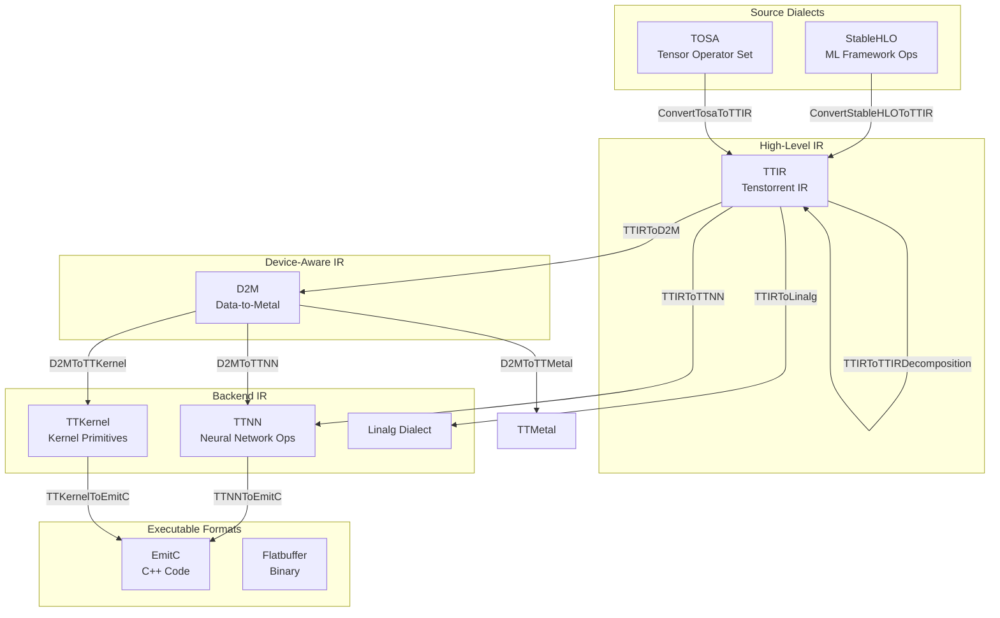
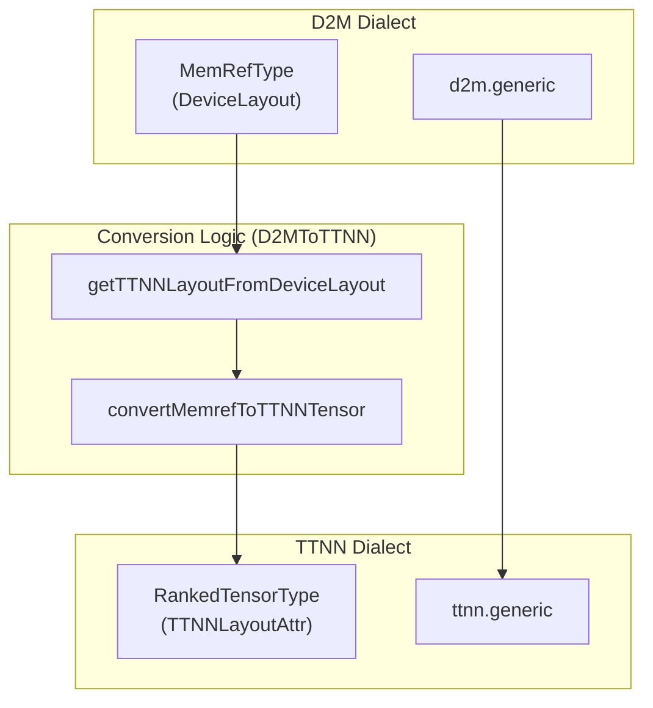
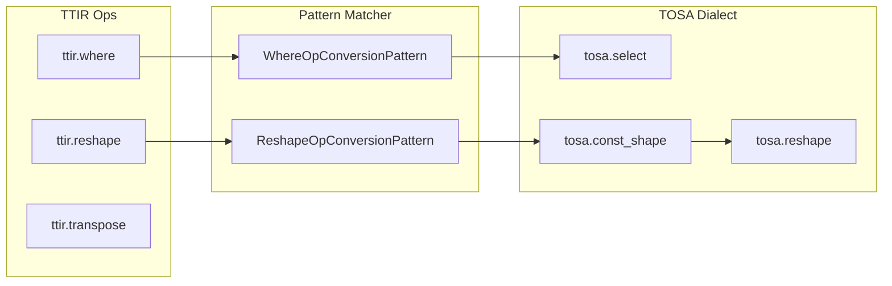

# Dialect Conversion and Lowering Passes

Relevant source files
*   [include/ttmlir/Conversion/D2MToTTNN/D2MToTTNN.h](https://github.com/tenstorrent/tt-mlir/blob/c7d92e92/include/ttmlir/Conversion/D2MToTTNN/D2MToTTNN.h)
*   [include/ttmlir/Conversion/TTIRToLinalg/EltwiseUnary.h](https://github.com/tenstorrent/tt-mlir/blob/c7d92e92/include/ttmlir/Conversion/TTIRToLinalg/EltwiseUnary.h)
*   [include/ttmlir/Conversion/TTIRToLinalg/Reduction.h](https://github.com/tenstorrent/tt-mlir/blob/c7d92e92/include/ttmlir/Conversion/TTIRToLinalg/Reduction.h)
*   [include/ttmlir/Conversion/TTIRToLinalg/TTIRToLinalg.h](https://github.com/tenstorrent/tt-mlir/blob/c7d92e92/include/ttmlir/Conversion/TTIRToLinalg/TTIRToLinalg.h)
*   [include/ttmlir/Conversion/TTIRToLinalg/Utils.h](https://github.com/tenstorrent/tt-mlir/blob/c7d92e92/include/ttmlir/Conversion/TTIRToLinalg/Utils.h)
*   [include/ttmlir/Conversion/TTIRToTTIRDecomposition/TTIRToTTIRDecomposition.h](https://github.com/tenstorrent/tt-mlir/blob/c7d92e92/include/ttmlir/Conversion/TTIRToTTIRDecomposition/TTIRToTTIRDecomposition.h)
*   [include/ttmlir/Conversion/TosaToTTIR/TosaToTTIR.h](https://github.com/tenstorrent/tt-mlir/blob/c7d92e92/include/ttmlir/Conversion/TosaToTTIR/TosaToTTIR.h)
*   [lib/Conversion/D2MToTTKernel/D2MToTTKernelPass.cpp](https://github.com/tenstorrent/tt-mlir/blob/c7d92e92/lib/Conversion/D2MToTTKernel/D2MToTTKernelPass.cpp)
*   [lib/Conversion/D2MToTTMetal/D2MToTTMetal.cpp](https://github.com/tenstorrent/tt-mlir/blob/c7d92e92/lib/Conversion/D2MToTTMetal/D2MToTTMetal.cpp)
*   [lib/Conversion/D2MToTTNN/D2MToTTNN.cpp](https://github.com/tenstorrent/tt-mlir/blob/c7d92e92/lib/Conversion/D2MToTTNN/D2MToTTNN.cpp)
*   [lib/Conversion/D2MToTTNN/D2MToTTNNPass.cpp](https://github.com/tenstorrent/tt-mlir/blob/c7d92e92/lib/Conversion/D2MToTTNN/D2MToTTNNPass.cpp)
*   [lib/Conversion/TTIRToLinalg/CMakeLists.txt](https://github.com/tenstorrent/tt-mlir/blob/c7d92e92/lib/Conversion/TTIRToLinalg/CMakeLists.txt)
*   [lib/Conversion/TTIRToLinalg/EltwiseUnary.cpp](https://github.com/tenstorrent/tt-mlir/blob/c7d92e92/lib/Conversion/TTIRToLinalg/EltwiseUnary.cpp)
*   [lib/Conversion/TTIRToLinalg/Reduction.cpp](https://github.com/tenstorrent/tt-mlir/blob/c7d92e92/lib/Conversion/TTIRToLinalg/Reduction.cpp)
*   [lib/Conversion/TTIRToLinalg/TTIRToLinalg.cpp](https://github.com/tenstorrent/tt-mlir/blob/c7d92e92/lib/Conversion/TTIRToLinalg/TTIRToLinalg.cpp)
*   [lib/Conversion/TTIRToLinalg/TTIRToLinalgPass.cpp](https://github.com/tenstorrent/tt-mlir/blob/c7d92e92/lib/Conversion/TTIRToLinalg/TTIRToLinalgPass.cpp)
*   [lib/Conversion/TTIRToLinalg/Utils.cpp](https://github.com/tenstorrent/tt-mlir/blob/c7d92e92/lib/Conversion/TTIRToLinalg/Utils.cpp)
*   [lib/Conversion/TTIRToTTIRDecomposition/TTIRToTTIRDecomposition.cpp](https://github.com/tenstorrent/tt-mlir/blob/c7d92e92/lib/Conversion/TTIRToTTIRDecomposition/TTIRToTTIRDecomposition.cpp)
*   [lib/Conversion/TTIRToTTIRDecomposition/TTIRToTTIRDecompositionPass.cpp](https://github.com/tenstorrent/tt-mlir/blob/c7d92e92/lib/Conversion/TTIRToTTIRDecomposition/TTIRToTTIRDecompositionPass.cpp)
*   [lib/Conversion/TTIRToTTNN/CMakeLists.txt](https://github.com/tenstorrent/tt-mlir/blob/c7d92e92/lib/Conversion/TTIRToTTNN/CMakeLists.txt)
*   [lib/Conversion/TosaToTTIR/CMakeLists.txt](https://github.com/tenstorrent/tt-mlir/blob/c7d92e92/lib/Conversion/TosaToTTIR/CMakeLists.txt)
*   [lib/Conversion/TosaToTTIR/TosaToTTIRPass.cpp](https://github.com/tenstorrent/tt-mlir/blob/c7d92e92/lib/Conversion/TosaToTTIR/TosaToTTIRPass.cpp)
*   [lib/Conversion/TosaToTTIR/TosaToTTIRPatterns.cpp](https://github.com/tenstorrent/tt-mlir/blob/c7d92e92/lib/Conversion/TosaToTTIR/TosaToTTIRPatterns.cpp)
*   [lib/Dialect/TTIR/Transforms/RankNormalization.cpp](https://github.com/tenstorrent/tt-mlir/blob/c7d92e92/lib/Dialect/TTIR/Transforms/RankNormalization.cpp)
*   [test/ttmlir/Conversion/D2MToTTMetal/generic_lowering.mlir](https://github.com/tenstorrent/tt-mlir/blob/c7d92e92/test/ttmlir/Conversion/D2MToTTMetal/generic_lowering.mlir)
*   [test/ttmlir/Conversion/D2MToTTMetal/spatial_lowering.mlir](https://github.com/tenstorrent/tt-mlir/blob/c7d92e92/test/ttmlir/Conversion/D2MToTTMetal/spatial_lowering.mlir)
*   [test/ttmlir/Conversion/D2MToTTNN/abs_dram_interleaved.mlir](https://github.com/tenstorrent/tt-mlir/blob/c7d92e92/test/ttmlir/Conversion/D2MToTTNN/abs_dram_interleaved.mlir)
*   [test/ttmlir/Conversion/D2MToTTNN/mul_add_dram_2d.mlir](https://github.com/tenstorrent/tt-mlir/blob/c7d92e92/test/ttmlir/Conversion/D2MToTTNN/mul_add_dram_2d.mlir)
*   [test/ttmlir/Conversion/D2MToTTNN/mul_add_dram_3d.mlir](https://github.com/tenstorrent/tt-mlir/blob/c7d92e92/test/ttmlir/Conversion/D2MToTTNN/mul_add_dram_3d.mlir)
*   [test/ttmlir/Conversion/D2MToTTNN/mul_add_l1_block.mlir](https://github.com/tenstorrent/tt-mlir/blob/c7d92e92/test/ttmlir/Conversion/D2MToTTNN/mul_add_l1_block.mlir)
*   [test/ttmlir/Conversion/D2MToTTNN/mul_add_l1_width.mlir](https://github.com/tenstorrent/tt-mlir/blob/c7d92e92/test/ttmlir/Conversion/D2MToTTNN/mul_add_l1_width.mlir)
*   [test/ttmlir/Conversion/D2MToTTNN/sanity.mlir](https://github.com/tenstorrent/tt-mlir/blob/c7d92e92/test/ttmlir/Conversion/D2MToTTNN/sanity.mlir)
*   [test/ttmlir/Conversion/D2MToTTNN/spatial.mlir](https://github.com/tenstorrent/tt-mlir/blob/c7d92e92/test/ttmlir/Conversion/D2MToTTNN/spatial.mlir)
*   [test/ttmlir/Conversion/TTIRToLinalg/unary_eltwise.mlir](https://github.com/tenstorrent/tt-mlir/blob/c7d92e92/test/ttmlir/Conversion/TTIRToLinalg/unary_eltwise.mlir)
*   [test/ttmlir/Conversion/TosaToTTIR/clamp.mlir](https://github.com/tenstorrent/tt-mlir/blob/c7d92e92/test/ttmlir/Conversion/TosaToTTIR/clamp.mlir)
*   [test/ttmlir/Conversion/TosaToTTIR/elementwise_binary/mul.mlir](https://github.com/tenstorrent/tt-mlir/blob/c7d92e92/test/ttmlir/Conversion/TosaToTTIR/elementwise_binary/mul.mlir)
*   [test/ttmlir/Conversion/TosaToTTIR/elementwise_binary/mul_test_negative.mlir](https://github.com/tenstorrent/tt-mlir/blob/c7d92e92/test/ttmlir/Conversion/TosaToTTIR/elementwise_binary/mul_test_negative.mlir)
*   [test/ttmlir/Conversion/TosaToTTIR/elementwise_unary/negate.mlir](https://github.com/tenstorrent/tt-mlir/blob/c7d92e92/test/ttmlir/Conversion/TosaToTTIR/elementwise_unary/negate.mlir)
*   [test/ttmlir/Conversion/TosaToTTIR/matmul_op.mlir](https://github.com/tenstorrent/tt-mlir/blob/c7d92e92/test/ttmlir/Conversion/TosaToTTIR/matmul_op.mlir)
*   [test/ttmlir/Conversion/TosaToTTIR/reshape_op.mlir](https://github.com/tenstorrent/tt-mlir/blob/c7d92e92/test/ttmlir/Conversion/TosaToTTIR/reshape_op.mlir)
*   [test/ttmlir/Dialect/TTIR/Decomposition/arange_decomposition.mlir](https://github.com/tenstorrent/tt-mlir/blob/c7d92e92/test/ttmlir/Dialect/TTIR/Decomposition/arange_decomposition.mlir)
*   [test/ttmlir/Dialect/TTIR/Decomposition/dot_general/dot_general_test1.mlir](https://github.com/tenstorrent/tt-mlir/blob/c7d92e92/test/ttmlir/Dialect/TTIR/Decomposition/dot_general/dot_general_test1.mlir)
*   [test/ttmlir/Dialect/TTIR/Decomposition/dot_general/dot_general_test2.mlir](https://github.com/tenstorrent/tt-mlir/blob/c7d92e92/test/ttmlir/Dialect/TTIR/Decomposition/dot_general/dot_general_test2.mlir)
*   [test/ttmlir/Dialect/TTIR/Decomposition/dot_general/dot_general_test3.mlir](https://github.com/tenstorrent/tt-mlir/blob/c7d92e92/test/ttmlir/Dialect/TTIR/Decomposition/dot_general/dot_general_test3.mlir)
*   [test/ttmlir/Dialect/TTIR/Decomposition/dot_general/dot_general_test4.mlir](https://github.com/tenstorrent/tt-mlir/blob/c7d92e92/test/ttmlir/Dialect/TTIR/Decomposition/dot_general/dot_general_test4.mlir)
*   [test/ttmlir/Dialect/TTIR/Decomposition/reduce_and.mlir](https://github.com/tenstorrent/tt-mlir/blob/c7d92e92/test/ttmlir/Dialect/TTIR/Decomposition/reduce_and.mlir)
*   [test/ttmlir/Dialect/TTIR/Decomposition/reduce_or.mlir](https://github.com/tenstorrent/tt-mlir/blob/c7d92e92/test/ttmlir/Dialect/TTIR/Decomposition/reduce_or.mlir)
*   [test/ttmlir/Dialect/TTIR/Decomposition/ttnn_reduce_or.mlir](https://github.com/tenstorrent/tt-mlir/blob/c7d92e92/test/ttmlir/Dialect/TTIR/Decomposition/ttnn_reduce_or.mlir)
*   [test/ttmlir/Dialect/TTIR/Transforms/rank_normalization.mlir](https://github.com/tenstorrent/tt-mlir/blob/c7d92e92/test/ttmlir/Dialect/TTIR/Transforms/rank_normalization.mlir)
*   [test/ttmlir/Dialect/TTIR/Transforms/rank_normalization_scoping.mlir](https://github.com/tenstorrent/tt-mlir/blob/c7d92e92/test/ttmlir/Dialect/TTIR/Transforms/rank_normalization_scoping.mlir)
*   [test/ttmlir/Silicon/TTNN/n150/generic_op/ttnn_d2m_e2e.mlir](https://github.com/tenstorrent/tt-mlir/blob/c7d92e92/test/ttmlir/Silicon/TTNN/n150/generic_op/ttnn_d2m_e2e.mlir)

This document describes the dialect conversion and lowering pass infrastructure in `tt-mlir`, which transforms operations between different abstraction levels using pattern-based rewriting. For information about the overall compilation pipeline organization and pass sequencing, see [3. Compilation Pipelines](https://github.com/tenstorrent/tt-mlir/blob/c7d92e92/3.%20Compilation%20Pipelines) For details about specific optimization passes within individual dialects, see [5.2. TTNN Layout and Memory Optimization](https://github.com/tenstorrent/tt-mlir/blob/c7d92e92/5.2.%20TTNN%20Layout%20and%20Memory%20Optimization) and [5.3. D2M Memory Allocation and Grid Selection](https://github.com/tenstorrent/tt-mlir/blob/c7d92e92/5.3.%20D2M%20Memory%20Allocation%20and%20Grid%20Selection)

## Purpose and Scope

Dialect conversion passes implement the core transformation logic that progressively lowers high-level operations to hardware-executable forms. This page covers:

*   The MLIR `ConversionPattern` infrastructure used throughout `tt-mlir`.
*   Type conversion systems that translate between dialect type systems (e.g., `TTIRToTTNN` or `TTIRToLinalg`).
*   Specific conversion passes between dialect pairs (`TTIRToTTNN`, `TTIRToD2M`, `TosaToTTIR`, `TTIRToLinalg`, `D2MToTTNN`, `D2MToTTKernel`, etc.).
*   Decomposition strategies within the same dialect level (e.g., `TTIRToTTIRDecomposition`).
*   Reference lowering to the `Linalg` dialect.
*   Backend-specific lowering to `EmitC` for kernel generation.


```mermaid
graph TB
    subgraph "TTNN Compilation Pipeline"
        [TTIR_Ops] --> [TTIRToTTNN_Pass]
        [TTIRToTTNN_Pass] --> [TTNN_Ops_Initial]
        [TTNN_Ops_Initial] --> [TTNN_Fusing_Pass]
        [TTNN_Fusing_Pass] --> [TTNNWorkarounds_Pass]
        [TTNNWorkarounds_Pass] --> [TTNN_Ops_Hardware_Compatible]
        [TTNN_Ops_Hardware_Compatible] --> [TTNNOptimizer]
    end
    
    subgraph "Workaround System Entities"
        [wa::TTNNWorkaroundInterface]
        [wa::TTNNOperandsWorkaroundsFactory]
        [TTNNWorkaroundsPatterns.cpp]
        [Decomposition_Patterns]
    end
    
    subgraph "Workaround Types"
        [Layout_Workarounds]
        [Buffer_Type_Workarounds]
        [Memory_Layout_Workarounds]
        [Data_Type_Workarounds]
    end
    
    [TTNNWorkarounds_Pass] -- "uses" --> [wa::TTNNWorkaroundInterface]
    [wa::TTNNWorkaroundInterface] -- "calls" --> [wa::TTNNOperandsWorkaroundsFactory]
    [wa::TTNNOperandsWorkaroundsFactory] -- "defines" --> [Layout_Workarounds]
    [wa::TTNNOperandsWorkaroundsFactory] -- "defines" --> [Buffer_Type_Workarounds]
    [wa::TTNNOperandsWorkaroundsFactory] -- "defines" --> [Memory_Layout_Workarounds]
    [wa::TTNNOperandsWorkaroundsFactory] -- "defines" --> [Data_Type_Workarounds]
    
    [TTNNWorkaroundsPatterns.cpp] -- "implements" --> [wa::TTNNWorkaroundInterface]
    [Decomposition_Patterns] -- "part of" --> [TTNNWorkarounds_Pass]
```

Sources: [lib/Dialect/TTNN/Pipelines/TTNNPipelines.cpp:113-132](), [lib/Dialect/TTNN/Transforms/Workarounds/TTNNWorkaroundsPatterns.cpp:1-61](), [include/ttmlir/Dialect/TTNN/Transforms/Passes.td:31-52]()
```
## Conversion Architecture Overview

The `tt-mlir` project utilizes a hierarchical lowering strategy where high-level framework operations (StableHLO, TOSA) are first normalized into `TTIR`, then either lowered to `TTNN` for high-level runtime execution or through `D2M` for low-level kernel generation and `TTMetal` control.

**Dialect Lowering Hierarchy**

Title: Dialect Lowering Hierarchy

Sources: [lib/Conversion/TosaToTTIR/TosaToTTIRPatterns.cpp 5-200](https://github.com/tenstorrent/tt-mlir/blob/c7d92e92/lib/Conversion/TosaToTTIR/TosaToTTIRPatterns.cpp#L5-L200)[lib/Conversion/TTIRToTTIRDecomposition/TTIRToTTIRDecompositionPass.cpp 40-88](https://github.com/tenstorrent/tt-mlir/blob/c7d92e92/lib/Conversion/TTIRToTTIRDecomposition/TTIRToTTIRDecompositionPass.cpp#L40-L88)




Sources: [lib/Conversion/TosaToTTIR/TosaToTTIRPatterns.cpp:5-200](), [lib/Conversion/TTIRToTTIRDecomposition/TTIRToTTIRDecompositionPass.cpp:40-88]()
```
## Pattern-Based Rewriting Infrastructure

The conversion system builds on MLIR's `DialectConversion` framework, using specialized type converters and conversion patterns to bridge abstractions.

### TTIR to TTIR Decomposition

The `TTIRToTTIRDecomposition` pass breaks down complex ops into simpler `TTIR` primitives. This is target-dependent; for example, `DecompMode::CPUFallback` decomposes `DotGeneralOp` and `ReduceAndOp`, while `DecompMode::TTNN` decomposes `IndexOp`, `ReverseOp`, and `QuantizeOp`[lib/Conversion/TTIRToTTIRDecomposition/TTIRToTTIRDecompositionPass.cpp 47-88](https://github.com/tenstorrent/tt-mlir/blob/c7d92e92/lib/Conversion/TTIRToTTIRDecomposition/TTIRToTTIRDecompositionPass.cpp#L47-L88)

*   **Index Decomposition**: `IndexToSliceConversionPattern` converts `ttir.IndexOp` into `ttir.SliceStaticOp` by normalizing Python-style negative offsets into canonical coordinates [lib/Conversion/TTIRToTTIRDecomposition/TTIRToTTIRDecomposition.cpp 42-92](https://github.com/tenstorrent/tt-mlir/blob/c7d92e92/lib/Conversion/TTIRToTTIRDecomposition/TTIRToTTIRDecomposition.cpp#L42-L92)
*   **Reverse Decomposition**: `ReverseOpConversionPattern` decomposes `ttir.ReverseOp` into a sequence of `PermuteOp`, `ReshapeOp`, and `EmbeddingOp` to reorder rows via reversed linear indices [lib/Conversion/TTIRToTTIRDecomposition/TTIRToTTIRDecomposition.cpp 104-188](https://github.com/tenstorrent/tt-mlir/blob/c7d92e92/lib/Conversion/TTIRToTTIRDecomposition/TTIRToTTIRDecomposition.cpp#L104-L188)

### D2M to TTNN/TTMetal Patterns

The `D2M` dialect acts as a device-aware bridge.

*   **Memref to TTNN Tensor**: `convertMemrefToTTNNTensor` translates `MemRefType` with device layout attributes into `RankedTensorType` with `TTNNLayoutAttr`, recovering the logical element shape from grid and shard shapes [lib/Conversion/D2MToTTNN/D2MToTTNN.cpp 129-141](https://github.com/tenstorrent/tt-mlir/blob/c7d92e92/lib/Conversion/D2MToTTNN/D2MToTTNN.cpp#L129-L141)
*   **Kernel Argument Specification**: The `D2MToTTMetal` pass uses `evalKernelArgsFromSpec` to extract runtime and compile-time arguments from `ttkernel.ArgSpecAttr` attached to kernel functions [lib/Conversion/D2MToTTMetal/D2MToTTMetal.cpp 52-89](https://github.com/tenstorrent/tt-mlir/blob/c7d92e92/lib/Conversion/D2MToTTMetal/D2MToTTMetal.cpp#L52-L89)
*   **Compute Configuration**: `convertThreadsToKernelConfigs` generates backend-specific configurations like `ttmetal.ComputeConfigAttr`, setting flags for `fp32DestAccum` and `UnpackToDestMode` based on operand types [lib/Conversion/D2MToTTMetal/D2MToTTMetal.cpp 91-152](https://github.com/tenstorrent/tt-mlir/blob/c7d92e92/lib/Conversion/D2MToTTMetal/D2MToTTMetal.cpp#L91-L152)

Title: D2M to TTNN Transformation Logic

Sources: [lib/Conversion/D2MToTTNN/D2MToTTNN.cpp 62-141](https://github.com/tenstorrent/tt-mlir/blob/c7d92e92/lib/Conversion/D2MToTTNN/D2MToTTNN.cpp#L62-L141)



Sources: [lib/Conversion/D2MToTTNN/D2MToTTNN.cpp:62-141]()
```
## Backend Lowering: TTKernel and EmitC

Low-level kernels are generated by lowering `D2M` region operations to `TTKernel` and finally to `EmitC`.

### D2M to TTKernel

This pass materializes hardware-specific primitives for data movement and compute:

*   **Type Conversion**: Converts `ttcore::TileType` and `d2m::MemTxType` to `IndexType`, and `MemRefType` to `ttkernel.CBType` or `ttkernel.L1AddrType` depending on whether it abstracts a circular buffer or an address [lib/Conversion/D2MToTTKernel/D2MToTTKernelPass.cpp 121-156](https://github.com/tenstorrent/tt-mlir/blob/c7d92e92/lib/Conversion/D2MToTTKernel/D2MToTTKernelPass.cpp#L121-L156)
*   **Fabric Management**: If fabric-related writes are present (e.g., `d2m.DMAWriteOp` with device IDs), the pass inserts `ttkernel.CreateFabricConnectionManagerOp` at function entry [lib/Conversion/D2MToTTKernel/D2MToTTKernelPass.cpp 172-183](https://github.com/tenstorrent/tt-mlir/blob/c7d92e92/lib/Conversion/D2MToTTKernel/D2MToTTKernelPass.cpp#L172-L183)

### TTIR Rank Normalization

To ensure hardware compatibility, `ttir.rank-normalization` promotes tensors with rank < 2 to at least rank 2 by prepending dimensions of size 1 [lib/Dialect/TTIR/Transforms/RankNormalization.cpp 25-52](https://github.com/tenstorrent/tt-mlir/blob/c7d92e92/lib/Dialect/TTIR/Transforms/RankNormalization.cpp#L25-L52)

*   **Scoping**: The pass is scoped to functions containing `TTIR` ops or external declarations; `TTNN`-only functions (like `const_eval` helpers) are left untouched to avoid signature mismatches [lib/Dialect/TTIR/Transforms/RankNormalization.cpp 64-88](https://github.com/tenstorrent/tt-mlir/blob/c7d92e92/lib/Dialect/TTIR/Transforms/RankNormalization.cpp#L64-L88)
*   **Attribute Updates**: When an op's rank is expanded, its internal attributes (like `ttir.reshape`'s `shape` or `ttir.constant`'s `value`) are automatically updated to match the new rank [lib/Dialect/TTIR/Transforms/RankNormalization.cpp 149-189](https://github.com/tenstorrent/tt-mlir/blob/c7d92e92/lib/Dialect/TTIR/Transforms/RankNormalization.cpp#L149-L189)

## Reference Lowering: TTIR to Linalg



Sources: [lib/Conversion/TTIRToLinalg/TTIRToLinalg.cpp:113-200]()

Sources: [lib/Conversion/TTIRToTTIRDecomposition/TTIRToTTIRDecomposition.cpp:5-188](), [lib/Conversion/D2MToTTNN/D2MToTTNN.cpp:5-141](), [lib/Conversion/D2MToTTMetal/D2MToTTMetal.cpp:5-172](), [lib/Conversion/TTIRToLinalg/TTIRToLinalg.cpp:5-200](), [lib/Dialect/TTIR/Transforms/RankNormalization.cpp:19-189]()
25:T226d,
```

For CPU execution or standard MLIR validation, `TTIRToLinalg` lowers TTIR operations to the `Linalg` dialect.

*   **Comparison Semantics**: `convertToBooleanTensorComparison` converts floating-point tensors to boolean (i1) tensors by comparing against 0.0f, which is required for `tosa.SelectOp` lowering [lib/Conversion/TTIRToLinalg/TTIRToLinalg.cpp 44-77](https://github.com/tenstorrent/tt-mlir/blob/c7d92e92/lib/Conversion/TTIRToLinalg/TTIRToLinalg.cpp#L44-L77)
*   **Broadcasting**: `reshapeByPrependingOnes` is used to match ranks for broadcasting parameters like weights and biases in operations like LayerNorm [lib/Conversion/TTIRToLinalg/TTIRToLinalg.cpp 83-104](https://github.com/tenstorrent/tt-mlir/blob/c7d92e92/lib/Conversion/TTIRToLinalg/TTIRToLinalg.cpp#L83-L104)
*   **Op Mapping**: `WhereOp` is lowered to `tosa.SelectOp`, and `ReshapeOp` is lowered to `tosa.ReshapeOp` using a `tosa.ConstShapeOp` for the target dimensions [lib/Conversion/TTIRToLinalg/TTIRToLinalg.cpp 113-178](https://github.com/tenstorrent/tt-mlir/blob/c7d92e92/lib/Conversion/TTIRToLinalg/TTIRToLinalg.cpp#L113-L178)

Title: TTIR to TOSA Lowering Patterns

Sources: [lib/Conversion/TTIRToLinalg/TTIRToLinalg.cpp 113-200](https://github.com/tenstorrent/tt-mlir/blob/c7d92e92/lib/Conversion/TTIRToLinalg/TTIRToLinalg.cpp#L113-L200)

Sources: [lib/Conversion/TTIRToTTIRDecomposition/TTIRToTTIRDecomposition.cpp 5-188](https://github.com/tenstorrent/tt-mlir/blob/c7d92e92/lib/Conversion/TTIRToTTIRDecomposition/TTIRToTTIRDecomposition.cpp#L5-L188)[lib/Conversion/D2MToTTNN/D2MToTTNN.cpp 5-141](https://github.com/tenstorrent/tt-mlir/blob/c7d92e92/lib/Conversion/D2MToTTNN/D2MToTTNN.cpp#L5-L141)[lib/Conversion/D2MToTTMetal/D2MToTTMetal.cpp 5-172](https://github.com/tenstorrent/tt-mlir/blob/c7d92e92/lib/Conversion/D2MToTTMetal/D2MToTTMetal.cpp#L5-L172)[lib/Conversion/TTIRToLinalg/TTIRToLinalg.cpp 5-200](https://github.com/tenstorrent/tt-mlir/blob/c7d92e92/lib/Conversion/TTIRToLinalg/TTIRToLinalg.cpp#L5-L200)[lib/Dialect/TTIR/Transforms/RankNormalization.cpp 19-189](https://github.com/tenstorrent/tt-mlir/blob/c7d92e92/lib/Dialect/TTIR/Transforms/RankNormalization.cpp#L19-L189)

Dismiss
Refresh this wiki

Enter email to refresh
