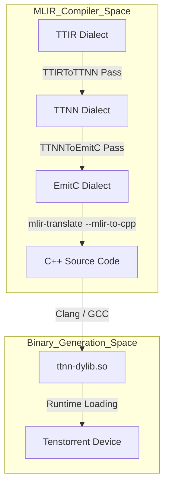
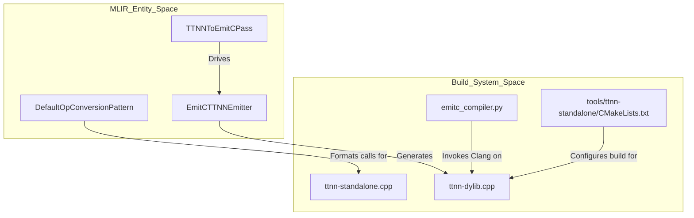

# Code Generation: EmitC

Relevant source files
*   [.github/Dockerfile.base](https://github.com/tenstorrent/tt-mlir/blob/c7d92e92/.github/Dockerfile.base)
*   [docs/src/SUMMARY.md](https://github.com/tenstorrent/tt-mlir/blob/c7d92e92/docs/src/SUMMARY.md?plain=1)
*   [docs/src/emitc-testing.md](https://github.com/tenstorrent/tt-mlir/blob/c7d92e92/docs/src/emitc-testing.md?plain=1)
*   [docs/src/lit-testing.md](https://github.com/tenstorrent/tt-mlir/blob/c7d92e92/docs/src/lit-testing.md?plain=1)
*   [docs/src/overview.md](https://github.com/tenstorrent/tt-mlir/blob/c7d92e92/docs/src/overview.md?plain=1)
*   [docs/src/specs/runtime-stitching.md](https://github.com/tenstorrent/tt-mlir/blob/c7d92e92/docs/src/specs/runtime-stitching.md?plain=1)
*   [docs/src/specs/specs.md](https://github.com/tenstorrent/tt-mlir/blob/c7d92e92/docs/src/specs/specs.md?plain=1)
*   [docs/src/testing.md](https://github.com/tenstorrent/tt-mlir/blob/c7d92e92/docs/src/testing.md?plain=1)
*   [docs/src/tools.md](https://github.com/tenstorrent/tt-mlir/blob/c7d92e92/docs/src/tools.md?plain=1)
*   [docs/src/ttmlir-translate.md](https://github.com/tenstorrent/tt-mlir/blob/c7d92e92/docs/src/ttmlir-translate.md?plain=1)
*   [docs/src/ttnn-standalone.md](https://github.com/tenstorrent/tt-mlir/blob/c7d92e92/docs/src/ttnn-standalone.md?plain=1)
*   [docs/theme/highlight.js](https://github.com/tenstorrent/tt-mlir/blob/c7d92e92/docs/theme/highlight.js)
*   [include/ttmlir/Dialect/TTIR/IR/TTIROps.td](https://github.com/tenstorrent/tt-mlir/blob/c7d92e92/include/ttmlir/Dialect/TTIR/IR/TTIROps.td)
*   [include/ttmlir/Dialect/TTNN/IR/TTNNOps.td](https://github.com/tenstorrent/tt-mlir/blob/c7d92e92/include/ttmlir/Dialect/TTNN/IR/TTNNOps.td)
*   [include/ttmlir/Target/TTNN/program.fbs](https://github.com/tenstorrent/tt-mlir/blob/c7d92e92/include/ttmlir/Target/TTNN/program.fbs)
*   [lib/Conversion/StableHLOToTTIR/StableHLOToTTIRPatterns.cpp](https://github.com/tenstorrent/tt-mlir/blob/c7d92e92/lib/Conversion/StableHLOToTTIR/StableHLOToTTIRPatterns.cpp)
*   [lib/Conversion/TTIRToTTNN/TTIRToTTNN.cpp](https://github.com/tenstorrent/tt-mlir/blob/c7d92e92/lib/Conversion/TTIRToTTNN/TTIRToTTNN.cpp)
*   [lib/Conversion/TTNNToEmitC/TTNNToEmitC.cpp](https://github.com/tenstorrent/tt-mlir/blob/c7d92e92/lib/Conversion/TTNNToEmitC/TTNNToEmitC.cpp)
*   [lib/Conversion/TTNNToEmitC/TTNNToEmitCPass.cpp](https://github.com/tenstorrent/tt-mlir/blob/c7d92e92/lib/Conversion/TTNNToEmitC/TTNNToEmitCPass.cpp)
*   [lib/Dialect/TTIR/IR/TTIROps.cpp](https://github.com/tenstorrent/tt-mlir/blob/c7d92e92/lib/Dialect/TTIR/IR/TTIROps.cpp)
*   [lib/Dialect/TTNN/IR/TTNNOps.cpp](https://github.com/tenstorrent/tt-mlir/blob/c7d92e92/lib/Dialect/TTNN/IR/TTNNOps.cpp)
*   [lib/Target/TTNN/TTNNToFlatbuffer.cpp](https://github.com/tenstorrent/tt-mlir/blob/c7d92e92/lib/Target/TTNN/TTNNToFlatbuffer.cpp)
*   [runtime/lib/ttnn/operations/CMakeLists.txt](https://github.com/tenstorrent/tt-mlir/blob/c7d92e92/runtime/lib/ttnn/operations/CMakeLists.txt)
*   [test/ttmlir/Conversion/StableHLOToTTIR/scatter_op.mlir](https://github.com/tenstorrent/tt-mlir/blob/c7d92e92/test/ttmlir/Conversion/StableHLOToTTIR/scatter_op.mlir)
*   [test/ttmlir/Dialect/TTNN/eltwise/operand_broadcasts.mlir](https://github.com/tenstorrent/tt-mlir/blob/c7d92e92/test/ttmlir/Dialect/TTNN/eltwise/operand_broadcasts.mlir)
*   [test/ttmlir/Dialect/TTNN/simple_scatter.mlir](https://github.com/tenstorrent/tt-mlir/blob/c7d92e92/test/ttmlir/Dialect/TTNN/simple_scatter.mlir)
*   [test/ttmlir/EmitC/TTNN/matmul/matmul.mlir](https://github.com/tenstorrent/tt-mlir/blob/c7d92e92/test/ttmlir/EmitC/TTNN/matmul/matmul.mlir)
*   [third_party/CMakeLists.txt](https://github.com/tenstorrent/tt-mlir/blob/c7d92e92/third_party/CMakeLists.txt)
*   [tools/tt-alchemist/templates/cpp/local/CMakeLists.txt](https://github.com/tenstorrent/tt-mlir/blob/c7d92e92/tools/tt-alchemist/templates/cpp/local/CMakeLists.txt)
*   [tools/ttnn-standalone/CMakeLists.txt](https://github.com/tenstorrent/tt-mlir/blob/c7d92e92/tools/ttnn-standalone/CMakeLists.txt)
*   [tools/ttnn-standalone/README.md](https://github.com/tenstorrent/tt-mlir/blob/c7d92e92/tools/ttnn-standalone/README.md?plain=1)
*   [tools/ttnn-standalone/ci_compile_dylib.py](https://github.com/tenstorrent/tt-mlir/blob/c7d92e92/tools/ttnn-standalone/ci_compile_dylib.py)
*   [tools/ttnn-standalone/emitc_compiler.py](https://github.com/tenstorrent/tt-mlir/blob/c7d92e92/tools/ttnn-standalone/emitc_compiler.py)
*   [tools/ttnn-standalone/run](https://github.com/tenstorrent/tt-mlir/blob/c7d92e92/tools/ttnn-standalone/run)
*   [tools/ttnn-standalone/ttnn-standalone.cpp](https://github.com/tenstorrent/tt-mlir/blob/c7d92e92/tools/ttnn-standalone/ttnn-standalone.cpp)

## Purpose and Scope

This page documents the `TTNNToEmitC` code generation path. This transformation translates the Tenstorrent-specific `TTNN` dialect into the MLIR `EmitC` dialect, which represents C++ code. This IR is subsequently printed as C++ source code that calls the Tenstorrent C++ APIs.

The generated C++ code links against the `ttnn` libraries (specifically `_ttnncpp.so`) and is often compiled into a dynamic library (`.so`) for the runtime to execute. The build system infrastructure for this workflow is defined in the `ttnn-standalone` tool.

This conversion path enables:

*   Standalone C++ applications that execute TTNN operations without a Python interpreter.
*   A "compiled" execution path where high-level graphs are lowered to optimized C++ instead of being interpreted op-by-op.
*   Integration with the `ttnn-standalone` dylib compilation workflow for performance and portability.

Sources: [lib/Conversion/TTNNToEmitC/TTNNToEmitC.cpp 5-15](https://github.com/tenstorrent/tt-mlir/blob/c7d92e92/lib/Conversion/TTNNToEmitC/TTNNToEmitC.cpp#L5-L15)[tools/ttnn-standalone/CMakeLists.txt 158-175](https://github.com/tenstorrent/tt-mlir/blob/c7d92e92/tools/ttnn-standalone/CMakeLists.txt#L158-L175)

* * *


```mermaid
graph TB
    subgraph "TTNN Compilation Pipeline"
        [TTIR_Ops] --> [TTIRToTTNN_Pass]
        [TTIRToTTNN_Pass] --> [TTNN_Ops_Initial]
        [TTNN_Ops_Initial] --> [TTNN_Fusing_Pass]
        [TTNN_Fusing_Pass] --> [TTNNWorkarounds_Pass]
        [TTNNWorkarounds_Pass] --> [TTNN_Ops_Hardware_Compatible]
        [TTNN_Ops_Hardware_Compatible] --> [TTNNOptimizer]
    end
    
    subgraph "Workaround System Entities"
        [wa::TTNNWorkaroundInterface]
        [wa::TTNNOperandsWorkaroundsFactory]
        [TTNNWorkaroundsPatterns.cpp]
        [Decomposition_Patterns]
    end
    
    subgraph "Workaround Types"
        [Layout_Workarounds]
        [Buffer_Type_Workarounds]
        [Memory_Layout_Workarounds]
        [Data_Type_Workarounds]
    end
    
    [TTNNWorkarounds_Pass] -- "uses" --> [wa::TTNNWorkaroundInterface]
    [wa::TTNNWorkaroundInterface] -- "calls" --> [wa::TTNNOperandsWorkaroundsFactory]
    [wa::TTNNOperandsWorkaroundsFactory] -- "defines" --> [Layout_Workarounds]
    [wa::TTNNOperandsWorkaroundsFactory] -- "defines" --> [Buffer_Type_Workarounds]
    [wa::TTNNOperandsWorkaroundsFactory] -- "defines" --> [Memory_Layout_Workarounds]
    [wa::TTNNOperandsWorkaroundsFactory] -- "defines" --> [Data_Type_Workarounds]
    
    [TTNNWorkaroundsPatterns.cpp] -- "implements" --> [wa::TTNNWorkaroundInterface]
    [Decomposition_Patterns] -- "part of" --> [TTNNWorkarounds_Pass]
```

Sources: [lib/Dialect/TTNN/Pipelines/TTNNPipelines.cpp:113-132](), [lib/Dialect/TTNN/Transforms/Workarounds/TTNNWorkaroundsPatterns.cpp:1-61](), [include/ttmlir/Dialect/TTNN/Transforms/Passes.td:31-52]()
```
## Position in the Compiler Pipeline

The EmitC generation is the final stage of the TTNN backend path. It consumes a fully legalized and optimized TTNN IR and produces C++ source code.

**Pipeline: Code Generation Flow**

Sources: [lib/Conversion/TTIRToTTNN/TTIRToTTNN.cpp 5-17](https://github.com/tenstorrent/tt-mlir/blob/c7d92e92/lib/Conversion/TTIRToTTNN/TTIRToTTNN.cpp#L5-L17)[lib/Conversion/TTNNToEmitC/TTNNToEmitC.cpp 51-75](https://github.com/tenstorrent/tt-mlir/blob/c7d92e92/lib/Conversion/TTNNToEmitC/TTNNToEmitC.cpp#L51-L75)[tools/ttnn-standalone/CMakeLists.txt 161-175](https://github.com/tenstorrent/tt-mlir/blob/c7d92e92/tools/ttnn-standalone/CMakeLists.txt#L161-L175)

* * *




Sources: [lib/Conversion/TTIRToTTNN/TTIRToTTNN.cpp:5-17](), [lib/Conversion/TTNNToEmitC/TTNNToEmitC.cpp:51-75](), [tools/ttnn-standalone/CMakeLists.txt:161-175]()

---
```
## TTNN to EmitC Conversion

The conversion transforms high-level neural network operations into C++ calls to the `ttnn::` namespace.

### Type Conversion: `TTNNToEmitCTypeConverter`

The mapping of MLIR types to C++ types utilized by the TTNN API is handled by the `TTNNToEmitCTypeConverter`. It ensures that MLIR tensors and attributes are represented as their corresponding C++ classes in the generated code.

| Source MLIR Type | Target EmitC Type | C++ Representation |
| --- | --- | --- |
| `mlir::RankedTensorType` | `emitc::OpaqueType` | `::ttnn::Tensor` |
| `mlir::tt::ttnn::DeviceType` | `emitc::PointerType` | `::ttnn::distributed::MeshDevice *` |
| `mlir::tt::ttnn::ShapeAttr` | `emitc::OpaqueType` | `::ttnn::Shape` |

Sources: [lib/Conversion/TTNNToEmitC/TTNNToEmitC.cpp 43-46](https://github.com/tenstorrent/tt-mlir/blob/c7d92e92/lib/Conversion/TTNNToEmitC/TTNNToEmitC.cpp#L43-L46)[lib/Conversion/TTNNToEmitC/TTNNToEmitC.cpp 99-104](https://github.com/tenstorrent/tt-mlir/blob/c7d92e92/lib/Conversion/TTNNToEmitC/TTNNToEmitC.cpp#L99-L104)

### Operation Mapping Patterns

The conversion uses a pattern-based rewrite system. Most operations follow a `DefaultOpConversionPattern` which maps a `ttnn.<op_name>` to a `ttnn::<op_name>` C++ call.

*   **`TTNNToEmitCBaseOpConversionPattern`**: Provides the base logic for converting operation names by swapping the `ttnn.` prefix with `ttnn::`[lib/Conversion/TTNNToEmitC/TTNNToEmitC.cpp 52-75](https://github.com/tenstorrent/tt-mlir/blob/c7d92e92/lib/Conversion/TTNNToEmitC/TTNNToEmitC.cpp#L52-L75)
*   **`DefaultOpConversionPattern`**: Handles operations with zero or one return value, generating an `emitc::CallOpaqueOp`[lib/Conversion/TTNNToEmitC/TTNNToEmitC.cpp 80-116](https://github.com/tenstorrent/tt-mlir/blob/c7d92e92/lib/Conversion/TTNNToEmitC/TTNNToEmitC.cpp#L80-L116)
*   **`EltwiseUnaryOpConversionPattern`**: Specializes unary operations to include memory configurations and optional parameters like "fast and approximate" modes [lib/Conversion/TTNNToEmitC/TTNNToEmitC.cpp 120-146](https://github.com/tenstorrent/tt-mlir/blob/c7d92e92/lib/Conversion/TTNNToEmitC/TTNNToEmitC.cpp#L120-L146)

Sources: [lib/Conversion/TTNNToEmitC/TTNNToEmitC.cpp 51-146](https://github.com/tenstorrent/tt-mlir/blob/c7d92e92/lib/Conversion/TTNNToEmitC/TTNNToEmitC.cpp#L51-L146)

* * *

## System Integration and Runtime

### `ttnn-standalone` Infrastructure

The `ttnn-standalone` tool provides the necessary headers and link logic to compile the generated EmitC code. It defines the include paths for `tt-metal`, `ttnn`, and third-party dependencies like `fmt` and `nlohmann_json`.

*   **`ttnn-dylib`**: A shared library target configured to link against `_ttnncpp.so` and `tt_metal`. It uses `ttnn-precompiled.hpp` to speed up compilation [tools/ttnn-standalone/CMakeLists.txt 161-175](https://github.com/tenstorrent/tt-mlir/blob/c7d92e92/tools/ttnn-standalone/CMakeLists.txt#L161-L175)
*   **Include Directories**: The build system pulls from `${METAL_SRC_DIR}/ttnn`, `${METAL_SRC_DIR}/tt_metal`, and the `.cpmcache` for headers [tools/ttnn-standalone/CMakeLists.txt 80-110](https://github.com/tenstorrent/tt-mlir/blob/c7d92e92/tools/ttnn-standalone/CMakeLists.txt#L80-L110)

Sources: [tools/ttnn-standalone/CMakeLists.txt 80-125](https://github.com/tenstorrent/tt-mlir/blob/c7d92e92/tools/ttnn-standalone/CMakeLists.txt#L80-L125)[tools/ttnn-standalone/CMakeLists.txt 161-176](https://github.com/tenstorrent/tt-mlir/blob/c7d92e92/tools/ttnn-standalone/CMakeLists.txt#L161-L176)

### Workflow Entity Association

The following diagram bridges the compiler passes to the physical build artifacts in the `ttnn-standalone` tool.

Sources: [lib/Conversion/TTNNToEmitC/TTNNToEmitC.cpp 80-92](https://github.com/tenstorrent/tt-mlir/blob/c7d92e92/lib/Conversion/TTNNToEmitC/TTNNToEmitC.cpp#L80-L92)[tools/ttnn-standalone/CMakeLists.txt 158-175](https://github.com/tenstorrent/tt-mlir/blob/c7d92e92/tools/ttnn-standalone/CMakeLists.txt#L158-L175)[tools/ttnn-standalone/emitc_compiler.py 1-35](https://github.com/tenstorrent/tt-mlir/blob/c7d92e92/tools/ttnn-standalone/emitc_compiler.py#L1-L35)

* * *




Sources: [lib/Conversion/TTNNToEmitC/TTNNToEmitC.cpp:80-92](), [tools/ttnn-standalone/CMakeLists.txt:158-175](), [tools/ttnn-standalone/emitc_compiler.py:1-35]()

---
```
## Data Flow and Serialization

While EmitC generates source code, the final deployment often involves a Flatbuffer binary that references these generated libraries.

1.   **TTNN to Flatbuffer**: The `TTNNToFlatbuffer` pass serializes the graph structure. If a function is marked for CPU hoisting or specific C++ execution, it is recorded in the `Program` table [lib/Target/TTNN/TTNNToFlatbuffer.cpp 46-49](https://github.com/tenstorrent/tt-mlir/blob/c7d92e92/lib/Target/TTNN/TTNNToFlatbuffer.cpp#L46-L49)
2.   **Dynamic Library Loading**: The `Program` flatbuffer contains a `dylibs` field [include/ttmlir/Target/TTNN/program.fbs 166](https://github.com/tenstorrent/tt-mlir/blob/c7d92e92/include/ttmlir/Target/TTNN/program.fbs#L166-L166) At runtime, the Tenstorrent loader opens these `.so` files generated from the EmitC path and dispatches execution to the compiled functions.

Sources: [lib/Target/TTNN/TTNNToFlatbuffer.cpp 46-49](https://github.com/tenstorrent/tt-mlir/blob/c7d92e92/lib/Target/TTNN/TTNNToFlatbuffer.cpp#L46-L49)[include/ttmlir/Target/TTNN/program.fbs 161-172](https://github.com/tenstorrent/tt-mlir/blob/c7d92e92/include/ttmlir/Target/TTNN/program.fbs#L161-L172)

Dismiss
Refresh this wiki

Enter email to refresh
