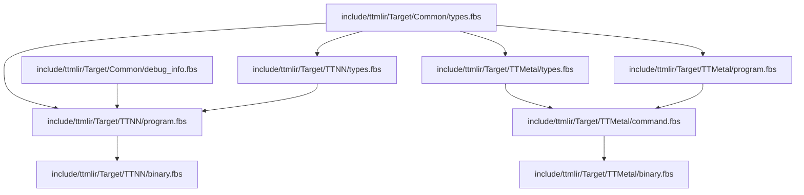
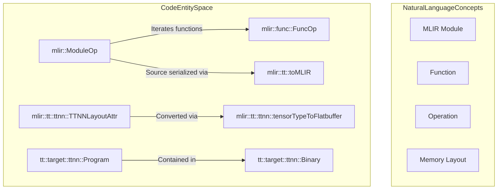
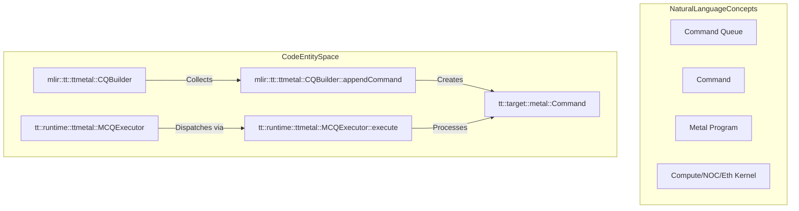
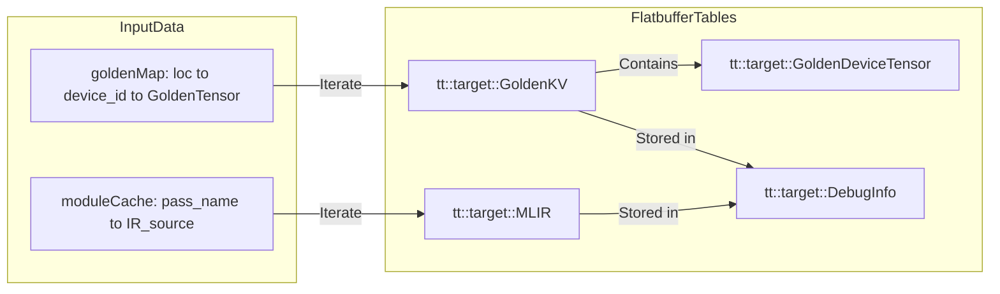

# Flatbuffer Serialization

Relevant source files
*   [.claude/skills/add-op/references/ttnn_type_mapping.md](https://github.com/tenstorrent/tt-mlir/blob/c7d92e92/.claude/skills/add-op/references/ttnn_type_mapping.md?plain=1)
*   [cmake/modules/BuildFlatbuffers.cmake](https://github.com/tenstorrent/tt-mlir/blob/c7d92e92/cmake/modules/BuildFlatbuffers.cmake)
*   [include/ttmlir-c/TTAttrs.h](https://github.com/tenstorrent/tt-mlir/blob/c7d92e92/include/ttmlir-c/TTAttrs.h)
*   [include/ttmlir/Dialect/SFPI/IR/SFPIOpsTypes.td](https://github.com/tenstorrent/tt-mlir/blob/c7d92e92/include/ttmlir/Dialect/SFPI/IR/SFPIOpsTypes.td)
*   [include/ttmlir/Dialect/TTCore/IR/TTCoreOpsEnums.td](https://github.com/tenstorrent/tt-mlir/blob/c7d92e92/include/ttmlir/Dialect/TTCore/IR/TTCoreOpsEnums.td)
*   [include/ttmlir/Dialect/TTCore/IR/TTCoreOpsTypes.td](https://github.com/tenstorrent/tt-mlir/blob/c7d92e92/include/ttmlir/Dialect/TTCore/IR/TTCoreOpsTypes.td)
*   [include/ttmlir/Dialect/TTCore/Transforms/Passes.td](https://github.com/tenstorrent/tt-mlir/blob/c7d92e92/include/ttmlir/Dialect/TTCore/Transforms/Passes.td)
*   [include/ttmlir/Dialect/TTIR/IR/TTIROps.td](https://github.com/tenstorrent/tt-mlir/blob/c7d92e92/include/ttmlir/Dialect/TTIR/IR/TTIROps.td)
*   [include/ttmlir/Dialect/TTMetal/IR/TTMetalOps.td](https://github.com/tenstorrent/tt-mlir/blob/c7d92e92/include/ttmlir/Dialect/TTMetal/IR/TTMetalOps.td)
*   [include/ttmlir/Dialect/TTNN/IR/TTNNOps.td](https://github.com/tenstorrent/tt-mlir/blob/c7d92e92/include/ttmlir/Dialect/TTNN/IR/TTNNOps.td)
*   [include/ttmlir/Target/Common/CMakeLists.txt](https://github.com/tenstorrent/tt-mlir/blob/c7d92e92/include/ttmlir/Target/Common/CMakeLists.txt)
*   [include/ttmlir/Target/Common/debug_info.fbs](https://github.com/tenstorrent/tt-mlir/blob/c7d92e92/include/ttmlir/Target/Common/debug_info.fbs)
*   [include/ttmlir/Target/Common/system_desc.fbs](https://github.com/tenstorrent/tt-mlir/blob/c7d92e92/include/ttmlir/Target/Common/system_desc.fbs)
*   [include/ttmlir/Target/Common/types.fbs](https://github.com/tenstorrent/tt-mlir/blob/c7d92e92/include/ttmlir/Target/Common/types.fbs)
*   [include/ttmlir/Target/TTMetal/CMakeLists.txt](https://github.com/tenstorrent/tt-mlir/blob/c7d92e92/include/ttmlir/Target/TTMetal/CMakeLists.txt)
*   [include/ttmlir/Target/TTMetal/Target.h](https://github.com/tenstorrent/tt-mlir/blob/c7d92e92/include/ttmlir/Target/TTMetal/Target.h)
*   [include/ttmlir/Target/TTMetal/binary.fbs](https://github.com/tenstorrent/tt-mlir/blob/c7d92e92/include/ttmlir/Target/TTMetal/binary.fbs)
*   [include/ttmlir/Target/TTMetal/command.fbs](https://github.com/tenstorrent/tt-mlir/blob/c7d92e92/include/ttmlir/Target/TTMetal/command.fbs)
*   [include/ttmlir/Target/TTMetal/program.fbs](https://github.com/tenstorrent/tt-mlir/blob/c7d92e92/include/ttmlir/Target/TTMetal/program.fbs)
*   [include/ttmlir/Target/TTMetal/types.fbs](https://github.com/tenstorrent/tt-mlir/blob/c7d92e92/include/ttmlir/Target/TTMetal/types.fbs)
*   [include/ttmlir/Target/TTNN/CMakeLists.txt](https://github.com/tenstorrent/tt-mlir/blob/c7d92e92/include/ttmlir/Target/TTNN/CMakeLists.txt)
*   [include/ttmlir/Target/TTNN/TTNNToFlatbuffer.h](https://github.com/tenstorrent/tt-mlir/blob/c7d92e92/include/ttmlir/Target/TTNN/TTNNToFlatbuffer.h)
*   [include/ttmlir/Target/TTNN/Target.h](https://github.com/tenstorrent/tt-mlir/blob/c7d92e92/include/ttmlir/Target/TTNN/Target.h)
*   [include/ttmlir/Target/TTNN/binary.fbs](https://github.com/tenstorrent/tt-mlir/blob/c7d92e92/include/ttmlir/Target/TTNN/binary.fbs)
*   [include/ttmlir/Target/TTNN/program.fbs](https://github.com/tenstorrent/tt-mlir/blob/c7d92e92/include/ttmlir/Target/TTNN/program.fbs)
*   [include/ttmlir/Target/Utils/MLIRToFlatbuffer.h](https://github.com/tenstorrent/tt-mlir/blob/c7d92e92/include/ttmlir/Target/Utils/MLIRToFlatbuffer.h)
*   [lib/CAPI/TTCoreAttrs.cpp](https://github.com/tenstorrent/tt-mlir/blob/c7d92e92/lib/CAPI/TTCoreAttrs.cpp)
*   [lib/Conversion/StableHLOToTTIR/StableHLOToTTIRPatterns.cpp](https://github.com/tenstorrent/tt-mlir/blob/c7d92e92/lib/Conversion/StableHLOToTTIR/StableHLOToTTIRPatterns.cpp)
*   [lib/Conversion/TTIRToTTNN/TTIRToTTNN.cpp](https://github.com/tenstorrent/tt-mlir/blob/c7d92e92/lib/Conversion/TTIRToTTNN/TTIRToTTNN.cpp)
*   [lib/Conversion/TTNNToEmitC/TTNNToEmitC.cpp](https://github.com/tenstorrent/tt-mlir/blob/c7d92e92/lib/Conversion/TTNNToEmitC/TTNNToEmitC.cpp)
*   [lib/Dialect/TTCore/IR/TTCoreOpsTypes.cpp](https://github.com/tenstorrent/tt-mlir/blob/c7d92e92/lib/Dialect/TTCore/IR/TTCoreOpsTypes.cpp)
*   [lib/Dialect/TTIR/IR/TTIROps.cpp](https://github.com/tenstorrent/tt-mlir/blob/c7d92e92/lib/Dialect/TTIR/IR/TTIROps.cpp)
*   [lib/Dialect/TTMetal/IR/TTMetalOps.cpp](https://github.com/tenstorrent/tt-mlir/blob/c7d92e92/lib/Dialect/TTMetal/IR/TTMetalOps.cpp)
*   [lib/Dialect/TTNN/IR/TTNNOps.cpp](https://github.com/tenstorrent/tt-mlir/blob/c7d92e92/lib/Dialect/TTNN/IR/TTNNOps.cpp)
*   [lib/Target/TTMetal/TTMetalToFlatbuffer.cpp](https://github.com/tenstorrent/tt-mlir/blob/c7d92e92/lib/Target/TTMetal/TTMetalToFlatbuffer.cpp)
*   [lib/Target/TTNN/TTNNToFlatbuffer.cpp](https://github.com/tenstorrent/tt-mlir/blob/c7d92e92/lib/Target/TTNN/TTNNToFlatbuffer.cpp)
*   [lib/Target/TTNN/TTNNToFlatbufferRegistration.cpp](https://github.com/tenstorrent/tt-mlir/blob/c7d92e92/lib/Target/TTNN/TTNNToFlatbufferRegistration.cpp)
*   [python/TTModule.cpp](https://github.com/tenstorrent/tt-mlir/blob/c7d92e92/python/TTModule.cpp)
*   [runtime/lib/common/system_desc.cpp](https://github.com/tenstorrent/tt-mlir/blob/c7d92e92/runtime/lib/common/system_desc.cpp)
*   [runtime/lib/ttmetal/executor.cpp](https://github.com/tenstorrent/tt-mlir/blob/c7d92e92/runtime/lib/ttmetal/executor.cpp)
*   [runtime/lib/ttmetal/executor_utils.h](https://github.com/tenstorrent/tt-mlir/blob/c7d92e92/runtime/lib/ttmetal/executor_utils.h)
*   [runtime/lib/ttmetal/meshshard_utils.cpp](https://github.com/tenstorrent/tt-mlir/blob/c7d92e92/runtime/lib/ttmetal/meshshard_utils.cpp)
*   [runtime/lib/ttnn/operations/CMakeLists.txt](https://github.com/tenstorrent/tt-mlir/blob/c7d92e92/runtime/lib/ttnn/operations/CMakeLists.txt)
*   [test/ttmlir/Conversion/D2MToTTMetal/virtual_grid_host_transfers.mlir](https://github.com/tenstorrent/tt-mlir/blob/c7d92e92/test/ttmlir/Conversion/D2MToTTMetal/virtual_grid_host_transfers.mlir)
*   [test/ttmlir/Conversion/D2MToTTMetal/virtual_grid_scalar_host_bounce.mlir](https://github.com/tenstorrent/tt-mlir/blob/c7d92e92/test/ttmlir/Conversion/D2MToTTMetal/virtual_grid_scalar_host_bounce.mlir)
*   [test/ttmlir/Conversion/StableHLOToTTIR/scatter_op.mlir](https://github.com/tenstorrent/tt-mlir/blob/c7d92e92/test/ttmlir/Conversion/StableHLOToTTIR/scatter_op.mlir)
*   [test/ttmlir/Dialect/TTNN/simple_scatter.mlir](https://github.com/tenstorrent/tt-mlir/blob/c7d92e92/test/ttmlir/Dialect/TTNN/simple_scatter.mlir)
*   [test/ttmlir/Silicon/TTMetal/n150/simple_3d.mlir](https://github.com/tenstorrent/tt-mlir/blob/c7d92e92/test/ttmlir/Silicon/TTMetal/n150/simple_3d.mlir)
*   [test/ttmlir/Silicon/TTMetal/n150/simple_add.mlir](https://github.com/tenstorrent/tt-mlir/blob/c7d92e92/test/ttmlir/Silicon/TTMetal/n150/simple_add.mlir)

This page documents the flatbuffer serialization layer in `tt-mlir` — the mechanism by which compiled MLIR programs are converted into portable binary artifacts consumed by the runtime. It covers the `.fbs` schema files, the shared `FlatbufferObjectCache` utility, the serialization entry points for TTNN and TTMetal backends, and how debug information (including golden tensors) is embedded.

This page focuses on the _compiler-side_ serialization step that produces `.ttnn` or `.ttm` flatbuffer files. For information on how those files are loaded and executed at runtime, see [4.1 Runtime Architecture and Multi-Backend Support](https://github.com/tenstorrent/tt-mlir/blob/c7d92e92/4.1%20Runtime%20Architecture%20and%20Multi-Backend%20Support) and [4.4 Program Execution and Binary Loading](https://github.com/tenstorrent/tt-mlir/blob/c7d92e92/4.4%20Program%20Execution%20and%20Binary%20Loading)

* * *

## Schema Organization

The flatbuffer schemas are located under `include/ttmlir/Target/`. They are divided into three groups: common types shared by both backends, TTNN-specific schemas, and TTMetal-specific schemas.

**Schema file hierarchy:**

**Sources:**[include/ttmlir/Target/TTNN/binary.fbs 1-10](https://github.com/tenstorrent/tt-mlir/blob/c7d92e92/include/ttmlir/Target/TTNN/binary.fbs#L1-L10)[include/ttmlir/Target/TTMetal/binary.fbs 1-10](https://github.com/tenstorrent/tt-mlir/blob/c7d92e92/include/ttmlir/Target/TTMetal/binary.fbs#L1-L10)

### Common Types (`types.fbs`)

The file `include/ttmlir/Target/Common/types.fbs` defines shared primitives used across both TTNN and TTMetal schemas.

| Type | Kind | Description |
| --- | --- | --- |
| `Dim2d` | struct | 2D coordinate (y, x). [include/ttmlir/Target/Common/types.fbs 3-6](https://github.com/tenstorrent/tt-mlir/blob/c7d92e92/include/ttmlir/Target/Common/types.fbs#L3-L6) |
| `Dim2dRange` | struct | Core range: origin + size. [include/ttmlir/Target/Common/types.fbs 8-11](https://github.com/tenstorrent/tt-mlir/blob/c7d92e92/include/ttmlir/Target/Common/types.fbs#L8-L11) |
| `Arch` | enum | Hardware architecture (Wormhole_b0, Blackhole, Quasar). [include/ttmlir/Target/Common/types.fbs 13-17](https://github.com/tenstorrent/tt-mlir/blob/c7d92e92/include/ttmlir/Target/Common/types.fbs#L13-L17) |
| `DataType` | enum | Float32, BFloat16, UInt8, Int32, etc. [include/ttmlir/Target/Common/types.fbs 19-42](https://github.com/tenstorrent/tt-mlir/blob/c7d92e92/include/ttmlir/Target/Common/types.fbs#L19-L42) |
| `OOBVal` | enum | Out-of-bounds value semantics (Undef, Zero, One, Inf, NegInf). [include/ttmlir/Target/Common/types.fbs 44-50](https://github.com/tenstorrent/tt-mlir/blob/c7d92e92/include/ttmlir/Target/Common/types.fbs#L44-L50) |
| `MemorySpace` | enum | System, SystemMMIO, DeviceDRAM, DeviceL1. [include/ttmlir/Target/Common/types.fbs 52-57](https://github.com/tenstorrent/tt-mlir/blob/c7d92e92/include/ttmlir/Target/Common/types.fbs#L52-L57) |
| `BufferType` | enum | DRAM, L1, SystemMemory, L1Small, Trace. [include/ttmlir/Target/Common/types.fbs 69-75](https://github.com/tenstorrent/tt-mlir/blob/c7d92e92/include/ttmlir/Target/Common/types.fbs#L69-L75) |
| `TensorLayout` | enum | RowMajor, Tile, Invalid. [include/ttmlir/Target/Common/types.fbs 63-67](https://github.com/tenstorrent/tt-mlir/blob/c7d92e92/include/ttmlir/Target/Common/types.fbs#L63-L67) |

**Sources:**[include/ttmlir/Target/Common/types.fbs 1-75](https://github.com/tenstorrent/tt-mlir/blob/c7d92e92/include/ttmlir/Target/Common/types.fbs#L1-L75)[include/ttmlir/Target/Utils/MLIRToFlatbuffer.h 127-198](https://github.com/tenstorrent/tt-mlir/blob/c7d92e92/include/ttmlir/Target/Utils/MLIRToFlatbuffer.h#L127-L198)

* * *

## `FlatbufferObjectCache`

`FlatbufferObjectCache` is a key-value cache that maps MLIR `Value` and `Attribute` objects to their corresponding flatbuffer offsets. This prevents duplicate serialization of entities (like layouts or tensor descriptors) that appear multiple times in the IR.

Key behaviors:

*   **Deduplication**: Uses internal maps to store already serialized offsets.
*   **Monotonic IDs**: Assigns unique `global_id` values to `TensorRef` or `BufferRef` objects during serialization.
*   **Context Access**: Holds a reference to the `flatbuffers::FlatBufferBuilder`.

**Sources:**[include/ttmlir/Target/Utils/FlatbufferObjectCache.h 1-40](https://github.com/tenstorrent/tt-mlir/blob/c7d92e92/include/ttmlir/Target/Utils/FlatbufferObjectCache.h#L1-L40)[lib/Target/TTMetal/TTMetalToFlatbuffer.cpp 25](https://github.com/tenstorrent/tt-mlir/blob/c7d92e92/lib/Target/TTMetal/TTMetalToFlatbuffer.cpp#L25-L25)

* * *

## TTNN Serialization Path

The entry point for TTNN flatbuffer serialization walks the MLIR module, serializes each `func::FuncOp` into a `Program`, and wraps them into a top-level `Binary` table. The process includes converting TTNN-specific layouts (`TTNNLayoutAttr` or `TTNNNDLayoutAttr`) into their binary representation.

### Natural Language to Code Entity Space: TTNN Serialization

**Sources:**[include/ttmlir/Target/Utils/MLIRToFlatbuffer.h 68-79](https://github.com/tenstorrent/tt-mlir/blob/c7d92e92/include/ttmlir/Target/Utils/MLIRToFlatbuffer.h#L68-L79)[lib/Target/TTNN/TTNNToFlatbuffer.cpp 78-139](https://github.com/tenstorrent/tt-mlir/blob/c7d92e92/lib/Target/TTNN/TTNNToFlatbuffer.cpp#L78-L139)[include/ttmlir/Target/TTNN/program.fbs 161-172](https://github.com/tenstorrent/tt-mlir/blob/c7d92e92/include/ttmlir/Target/TTNN/program.fbs#L161-L172)

* * *

## TTMetal Serialization Path

TTMetal serialization focuses on converting `TTMetal` dialect operations into a `CommandQueue` format consumed by the `MCQExecutor` at runtime.

### Natural Language to Code Entity Space: TTMetal Serialization

**Sources:**[lib/Target/TTMetal/TTMetalToFlatbuffer.cpp 56-96](https://github.com/tenstorrent/tt-mlir/blob/c7d92e92/lib/Target/TTMetal/TTMetalToFlatbuffer.cpp#L56-L96)[runtime/lib/ttmetal/executor.cpp 41-102](https://github.com/tenstorrent/tt-mlir/blob/c7d92e92/runtime/lib/ttmetal/executor.cpp#L41-L102)[runtime/lib/ttmetal/executor.cpp 156-171](https://github.com/tenstorrent/tt-mlir/blob/c7d92e92/runtime/lib/ttmetal/executor.cpp#L156-L171)

### Command Serialization

The `CQBuilder` utility in `TTMetalToFlatbuffer.cpp` manages the assembly of commands. It tracks `inputs`, `outputs`, and the list of `commands` while maintaining an `AsmState` for embedding debug strings. [lib/Target/TTMetal/TTMetalToFlatbuffer.cpp 56-70](https://github.com/tenstorrent/tt-mlir/blob/c7d92e92/lib/Target/TTMetal/TTMetalToFlatbuffer.cpp#L56-L70)

| MLIR Op | Flatbuffer Command | Description |
| --- | --- | --- |
| `EnqueueProgramOp` | `EnqueueProgramCommand` | Packages kernel arguments and program references. [runtime/lib/ttmetal/executor.cpp 183-184](https://github.com/tenstorrent/tt-mlir/blob/c7d92e92/runtime/lib/ttmetal/executor.cpp#L183-L184) |
| `CreateBufferOp` | `CreateBufferCommand` | Registers a new buffer on device. [runtime/lib/ttmetal/executor.cpp 191-192](https://github.com/tenstorrent/tt-mlir/blob/c7d92e92/runtime/lib/ttmetal/executor.cpp#L191-L192) |
| `EnqueueWriteBufferOp` | `EnqueueWriteBufferCommand` | Host-to-device transfer. [runtime/lib/ttmetal/executor.cpp 187-188](https://github.com/tenstorrent/tt-mlir/blob/c7d92e92/runtime/lib/ttmetal/executor.cpp#L187-L188) |
| `EnqueueReadBufferOp` | `EnqueueReadBufferCommand` | Device-to-host transfer. [runtime/lib/ttmetal/executor.cpp 189-190](https://github.com/tenstorrent/tt-mlir/blob/c7d92e92/runtime/lib/ttmetal/executor.cpp#L189-L190) |
| `FinishOp` | `FinishCommand` | Global barrier for the queue. [runtime/lib/ttmetal/executor.cpp 199-200](https://github.com/tenstorrent/tt-mlir/blob/c7d92e92/runtime/lib/ttmetal/executor.cpp#L199-L200) |

**Sources:**[lib/Target/TTMetal/TTMetalToFlatbuffer.cpp 56-96](https://github.com/tenstorrent/tt-mlir/blob/c7d92e92/lib/Target/TTMetal/TTMetalToFlatbuffer.cpp#L56-L96)[runtime/lib/ttmetal/executor.cpp 173-200](https://github.com/tenstorrent/tt-mlir/blob/c7d92e92/runtime/lib/ttmetal/executor.cpp#L173-L200)[lib/Target/TTMetal/TTMetalToFlatbuffer.cpp 87-95](https://github.com/tenstorrent/tt-mlir/blob/c7d92e92/lib/Target/TTMetal/TTMetalToFlatbuffer.cpp#L87-L95)

* * *

## Debug Information Embedding

The compiler can embed debug information, including the original MLIR source and "Golden Tensors" (reference values), into the binary.

### Golden Tensors

`GoldenTensor` structures store reference data for validation. They are defined in `include/ttmlir/Target/Utils/MLIRToFlatbuffer.h` and contain:

*   `name`: Tensor identifier.
*   `shape`/`strides`: Tensor dimensions.
*   `dtype`: Data type in flatbuffer enum format.
*   `data`: Raw byte vector of the tensor contents.

**Sources:**[include/ttmlir/Target/Utils/MLIRToFlatbuffer.h 28-43](https://github.com/tenstorrent/tt-mlir/blob/c7d92e92/include/ttmlir/Target/Utils/MLIRToFlatbuffer.h#L28-L43)

### Debug Info Serialization Flow

The `debugInfoToFlatbuffer` function populates the `DebugInfo` table, incorporating the `GoldenInfo` and an `MLIR` module cache representing the IR at various pass stages. [include/ttmlir/Target/Utils/MLIRToFlatbuffer.h 81-125](https://github.com/tenstorrent/tt-mlir/blob/c7d92e92/include/ttmlir/Target/Utils/MLIRToFlatbuffer.h#L81-L125)

**Sources:**[include/ttmlir/Target/Utils/MLIRToFlatbuffer.h 81-125](https://github.com/tenstorrent/tt-mlir/blob/c7d92e92/include/ttmlir/Target/Utils/MLIRToFlatbuffer.h#L81-L125)

* * *

## System Description Serialization

The hardware configuration is serialized into a `SystemDesc` table. This is used by the runtime to verify that the binary is compatible with the physical hardware and to assist in memory allocation.

Key fields in `SystemDesc`:

*   **Arch**: Hardware architecture (e.g., Wormhole_b0, Blackhole, Quasar). [runtime/lib/common/system_desc.cpp 35-46](https://github.com/tenstorrent/tt-mlir/blob/c7d92e92/runtime/lib/common/system_desc.cpp#L35-L46)
*   **Chip Descs**: Per-chip specifications including grid sizes, memory alignments, and unreserved memory bases (e.g., `l1_unreserved_base`, `dram_unreserved_base`). [runtime/lib/common/system_desc.cpp 161-175](https://github.com/tenstorrent/tt-mlir/blob/c7d92e92/runtime/lib/common/system_desc.cpp#L161-L175)
*   **Chip Channels**: Connectivity map between chips via ethernet cores. [runtime/lib/common/system_desc.cpp 50-98](https://github.com/tenstorrent/tt-mlir/blob/c7d92e92/runtime/lib/common/system_desc.cpp#L50-L98)

**Sources:**[runtime/lib/common/system_desc.cpp 141-175](https://github.com/tenstorrent/tt-mlir/blob/c7d92e92/runtime/lib/common/system_desc.cpp#L141-L175)[include/ttmlir/Target/Common/types.fbs 126-133](https://github.com/tenstorrent/tt-mlir/blob/c7d92e92/include/ttmlir/Target/Common/types.fbs#L126-L133)

* * *

## Versioning and Binary Wrapper

Binaries include a version field to ensure compatibility between the compiler and runtime. The top-level `Binary` table acts as the container for serialized programs, the hardware description, and debug information.

| Field | Source / Utility |
| --- | --- |
| `version` | `ttmlir/Version.h`. [lib/Target/TTMetal/TTMetalToFlatbuffer.cpp 29](https://github.com/tenstorrent/tt-mlir/blob/c7d92e92/lib/Target/TTMetal/TTMetalToFlatbuffer.cpp#L29-L29) |
| `system_desc` | `getCurrentSystemDescImpl` in `system_desc.cpp`. [runtime/lib/common/system_desc.cpp 141-142](https://github.com/tenstorrent/tt-mlir/blob/c7d92e92/runtime/lib/common/system_desc.cpp#L141-L142) |
| `mlir` | Embedded MLIR source via `toMLIR()`. [include/ttmlir/Target/Utils/MLIRToFlatbuffer.h 68-79](https://github.com/tenstorrent/tt-mlir/blob/c7d92e92/include/ttmlir/Target/Utils/MLIRToFlatbuffer.h#L68-L79) |

**Sources:**[include/ttmlir/Target/Utils/MLIRToFlatbuffer.h 68-79](https://github.com/tenstorrent/tt-mlir/blob/c7d92e92/include/ttmlir/Target/Utils/MLIRToFlatbuffer.h#L68-L79)[runtime/lib/common/system_desc.cpp 141-175](https://github.com/tenstorrent/tt-mlir/blob/c7d92e92/runtime/lib/common/system_desc.cpp#L141-L175)[lib/Target/TTMetal/TTMetalToFlatbuffer.cpp 25-30](https://github.com/tenstorrent/tt-mlir/blob/c7d92e92/lib/Target/TTMetal/TTMetalToFlatbuffer.cpp#L25-L30)

This wiki is featured in the [repository](https://github.com/tenstorrent/tt-mlir/blob/main/README.md)

Dismiss
Refresh this wiki

Enter email to refresh
