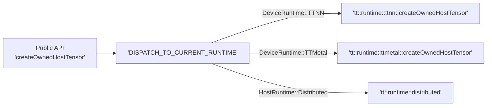
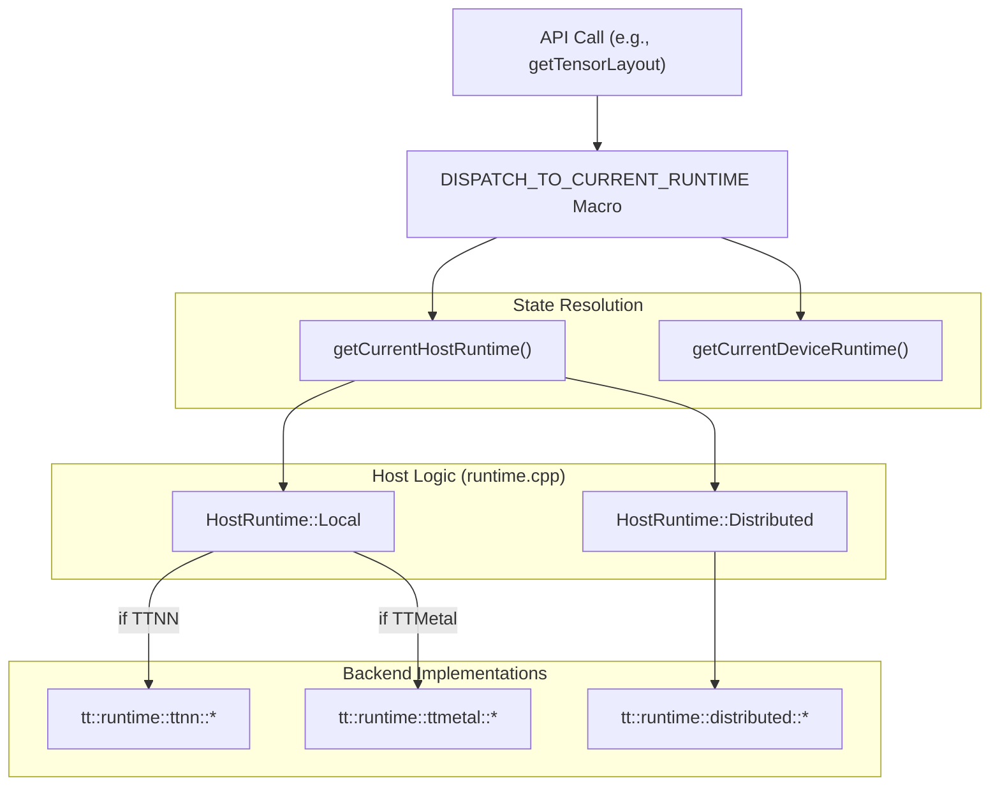
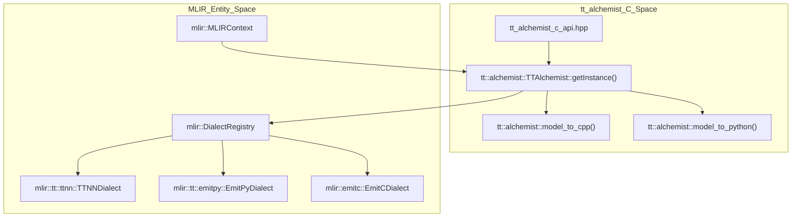

# Runtime System

Relevant source files
*   [runtime/CMakeLists.txt](https://github.com/tenstorrent/tt-mlir/blob/c7d92e92/runtime/CMakeLists.txt)
*   [runtime/include/tt/runtime/detail/ttmetal/ttmetal.h](https://github.com/tenstorrent/tt-mlir/blob/c7d92e92/runtime/include/tt/runtime/detail/ttmetal/ttmetal.h)
*   [runtime/include/tt/runtime/detail/ttnn/ttnn.h](https://github.com/tenstorrent/tt-mlir/blob/c7d92e92/runtime/include/tt/runtime/detail/ttnn/ttnn.h)
*   [runtime/include/tt/runtime/runtime.h](https://github.com/tenstorrent/tt-mlir/blob/c7d92e92/runtime/include/tt/runtime/runtime.h)
*   [runtime/include/tt/runtime/types.h](https://github.com/tenstorrent/tt-mlir/blob/c7d92e92/runtime/include/tt/runtime/types.h)
*   [runtime/include/tt/runtime/workarounds.h](https://github.com/tenstorrent/tt-mlir/blob/c7d92e92/runtime/include/tt/runtime/workarounds.h)
*   [runtime/lib/CMakeLists.txt](https://github.com/tenstorrent/tt-mlir/blob/c7d92e92/runtime/lib/CMakeLists.txt)
*   [runtime/lib/binary.cpp](https://github.com/tenstorrent/tt-mlir/blob/c7d92e92/runtime/lib/binary.cpp)
*   [runtime/lib/common/CMakeLists.txt](https://github.com/tenstorrent/tt-mlir/blob/c7d92e92/runtime/lib/common/CMakeLists.txt)
*   [runtime/lib/common/workarounds.cpp](https://github.com/tenstorrent/tt-mlir/blob/c7d92e92/runtime/lib/common/workarounds.cpp)
*   [runtime/lib/runtime.cpp](https://github.com/tenstorrent/tt-mlir/blob/c7d92e92/runtime/lib/runtime.cpp)
*   [runtime/lib/ttmetal/CMakeLists.txt](https://github.com/tenstorrent/tt-mlir/blob/c7d92e92/runtime/lib/ttmetal/CMakeLists.txt)
*   [runtime/lib/ttmetal/runtime.cpp](https://github.com/tenstorrent/tt-mlir/blob/c7d92e92/runtime/lib/ttmetal/runtime.cpp)
*   [runtime/lib/ttnn/CMakeLists.txt](https://github.com/tenstorrent/tt-mlir/blob/c7d92e92/runtime/lib/ttnn/CMakeLists.txt)
*   [runtime/lib/ttnn/debug/CMakeLists.txt](https://github.com/tenstorrent/tt-mlir/blob/c7d92e92/runtime/lib/ttnn/debug/CMakeLists.txt)
*   [runtime/lib/ttnn/program_executor.cpp](https://github.com/tenstorrent/tt-mlir/blob/c7d92e92/runtime/lib/ttnn/program_executor.cpp)
*   [runtime/lib/ttnn/runtime.cpp](https://github.com/tenstorrent/tt-mlir/blob/c7d92e92/runtime/lib/ttnn/runtime.cpp)
*   [runtime/lib/ttnn/types/CMakeLists.txt](https://github.com/tenstorrent/tt-mlir/blob/c7d92e92/runtime/lib/ttnn/types/CMakeLists.txt)
*   [runtime/lib/ttnn/utils/CMakeLists.txt](https://github.com/tenstorrent/tt-mlir/blob/c7d92e92/runtime/lib/ttnn/utils/CMakeLists.txt)
*   [runtime/python/binary/binary.cpp](https://github.com/tenstorrent/tt-mlir/blob/c7d92e92/runtime/python/binary/binary.cpp)
*   [runtime/python/runtime/runtime.cpp](https://github.com/tenstorrent/tt-mlir/blob/c7d92e92/runtime/python/runtime/runtime.cpp)
*   [runtime/test/CMakeLists.txt](https://github.com/tenstorrent/tt-mlir/blob/c7d92e92/runtime/test/CMakeLists.txt)
*   [runtime/test/ttmetal/CMakeLists.txt](https://github.com/tenstorrent/tt-mlir/blob/c7d92e92/runtime/test/ttmetal/CMakeLists.txt)
*   [runtime/test/ttnn/CMakeLists.txt](https://github.com/tenstorrent/tt-mlir/blob/c7d92e92/runtime/test/ttnn/CMakeLists.txt)
*   [runtime/test/ttnn/dylib.cpp](https://github.com/tenstorrent/tt-mlir/blob/c7d92e92/runtime/test/ttnn/dylib.cpp)

The Runtime System provides the execution engine for compiled tt-mlir programs on Tenstorrent hardware. It manages device initialization, tensor memory allocation, program loading from Flatbuffer binaries, and operation dispatch through two primary backend implementations:

*   **TTNN Runtime**: High-level API using the `ttnn::operations` library, with operation-level dispatch through the `ProgramExecutor`[runtime/lib/ttnn/runtime.cpp 14-15](https://github.com/tenstorrent/tt-mlir/blob/c7d92e92/runtime/lib/ttnn/runtime.cpp#L14-L15)[runtime/lib/ttnn/program_executor.cpp 131-162](https://github.com/tenstorrent/tt-mlir/blob/c7d92e92/runtime/lib/ttnn/program_executor.cpp#L131-L162)
*   **TTMetal Runtime**: Low-level execution through direct kernel control and `tt_metal` host APIs [runtime/lib/ttmetal/runtime.cpp 24-61](https://github.com/tenstorrent/tt-mlir/blob/c7d92e92/runtime/lib/ttmetal/runtime.cpp#L24-L61)

The runtime supports both local execution and distributed multi-process coordination via MPI or local subprocesses, configured through `DistributedMode`[runtime/include/tt/runtime/types.h 48-56](https://github.com/tenstorrent/tt-mlir/blob/c7d92e92/runtime/include/tt/runtime/types.h#L48-L56)

**Related Documentation:**

*   Compilation pipelines that produce runtime binaries: [Compilation Pipelines](https://deepwiki.com/tenstorrent/tt-mlir/3-compilation-pipelines)
*   Binary format specification: [Flatbuffer Serialization](https://deepwiki.com/tenstorrent/tt-mlir/3.7-flatbuffer-serialization)

**Subsections:**

: `DISPATCH_TO_CURRENT_RUNTIME` macro, `RuntimeContext` singleton, and backend selection logic.
: `MeshDevice` lifecycle, logical submesh creation, and hardware capability queries.
: Host/Device tensor lifecycle, layout conversions, and memory bank introspection.
: Flatbuffer binary parsing, `ProgramExecutor` dispatch loop, and asynchronous execution.

## Library Organization

```mermaid
graph TB
    subgraph ["TTMLIRRuntime.so"]
        RT_CPP_FILE["runtime/lib/runtime.cpp"] -- "DISPATCH_TO_CURRENT_RUNTIME" --> RT_CPP["TTMLIRRuntime"]
    end
    subgraph ["TTRuntimeTTNN.a"]
        TTNN_RT_FILE["runtime/lib/ttnn/runtime.cpp"] --> TTNN_RT["tt::runtime::ttnn"]
        TTNN_EXEC_FILE["runtime/lib/ttnn/program_executor.cpp"] --> TTNN_EXEC["ProgramExecutor::ProgramExecutor"]
    end
    subgraph ["TTRuntimeTTMetal.a"]
        METAL_RT_FILE["runtime/lib/ttmetal/runtime.cpp"] --> METAL_RT["tt::runtime::ttmetal"]
    end
    subgraph ["Common Utilities"]
        BINARY_FILE["runtime/lib/binary.cpp"] --> BINARY["TTBinary"]
        CTX_FILE["runtime/include/tt/runtime/detail/common/runtime_context.h"] --> CTX["RuntimeContext"]
    end
    RT_CPP --> TTNN_RT
    RT_CPP --> METAL_RT
    TTNN_RT --> TTNN_EXEC
    RT_CPP --> BINARY
    RT_CPP --> CTX
```


The runtime is built as a shared library (`TTMLIRRuntime`) that links in backend-specific static libraries. Presence of each backend is gated by CMake flags such as `TT_RUNTIME_ENABLE_TTNN` and `TT_RUNTIME_ENABLE_TTMETAL`[runtime/lib/runtime.cpp 17-47](https://github.com/tenstorrent/tt-mlir/blob/c7d92e92/runtime/lib/runtime.cpp#L17-L47)[runtime/lib/CMakeLists.txt 1-54](https://github.com/tenstorrent/tt-mlir/blob/c7d92e92/runtime/lib/CMakeLists.txt#L1-L54)

| CMake Target | Source Location | Description |
| --- | --- | --- |
| `TTMLIRRuntime` | `runtime/lib/runtime.cpp` | Main shared library; serves as the dispatch hub using `DISPATCH_TO_CURRENT_RUNTIME`[runtime/lib/runtime.cpp 63-90](https://github.com/tenstorrent/tt-mlir/blob/c7d92e92/runtime/lib/runtime.cpp#L63-L90) |
| `TTRuntimeTTNN` | `runtime/lib/ttnn/` | TTNN backend implementation, including `ProgramExecutor` and `TTNNTensorWrapper`[runtime/lib/ttnn/runtime.cpp 38-103](https://github.com/tenstorrent/tt-mlir/blob/c7d92e92/runtime/lib/ttnn/runtime.cpp#L38-L103) |
| `TTRuntimeTTMetal` | `runtime/lib/ttmetal/` | TTMetal backend implementation and metal-specific tensor handling [runtime/lib/ttmetal/runtime.cpp 24-85](https://github.com/tenstorrent/tt-mlir/blob/c7d92e92/runtime/lib/ttmetal/runtime.cpp#L24-L85) |
| `TTBinary` | `runtime/lib/binary.cpp` | Flatbuffer binary loading, versioning, and metadata parsing [runtime/lib/binary.cpp 30-61](https://github.com/tenstorrent/tt-mlir/blob/c7d92e92/runtime/lib/binary.cpp#L30-L61) |
| `TTRuntimeContext` | `runtime/lib/common/` | `RuntimeContext` singleton for managing global state like `mlirHome` and `metalHome`[runtime/lib/runtime.cpp 128-140](https://github.com/tenstorrent/tt-mlir/blob/c7d92e92/runtime/lib/runtime.cpp#L128-L140) |

**Library target and source file mapping:**

**Sources:**[runtime/lib/runtime.cpp 1-113](https://github.com/tenstorrent/tt-mlir/blob/c7d92e92/runtime/lib/runtime.cpp#L1-L113)[runtime/lib/ttnn/runtime.cpp 1-100](https://github.com/tenstorrent/tt-mlir/blob/c7d92e92/runtime/lib/ttnn/runtime.cpp#L1-L100)[runtime/lib/binary.cpp 26-59](https://github.com/tenstorrent/tt-mlir/blob/c7d92e92/runtime/lib/binary.cpp#L26-L59)[runtime/lib/CMakeLists.txt 1-54](https://github.com/tenstorrent/tt-mlir/blob/c7d92e92/runtime/lib/CMakeLists.txt#L1-L54)

## Runtime Architecture and Backend Selection

The runtime decouples the public API from backend implementations using a dispatch layer. The system tracks both `HostRuntime` (Local vs Distributed) and `DeviceRuntime` (TTNN vs TTMetal) [runtime/lib/runtime.cpp 71-90](https://github.com/tenstorrent/tt-mlir/blob/c7d92e92/runtime/lib/runtime.cpp#L71-L90)

### Backend Runtime Selection




Selection occurs through three primary mechanisms:

1.   **Explicit API**: `setCurrentDeviceRuntime(DeviceRuntime::TTNN)`[runtime/lib/runtime.cpp 170-180](https://github.com/tenstorrent/tt-mlir/blob/c7d92e92/runtime/lib/runtime.cpp#L170-L180)
2.   **Binary Compatibility**: `setCompatibleDeviceRuntime(binary)` inspects the Flatbuffer header (using `SizePrefixedTTNNBinaryBufferHasIdentifier` or `SizePrefixedTTMetalBinaryBufferHasIdentifier`) to determine the appropriate backend [runtime/lib/binary.cpp 126-130](https://github.com/tenstorrent/tt-mlir/blob/c7d92e92/runtime/lib/binary.cpp#L126-L130)[runtime/lib/ttmetal/runtime.cpp 29-36](https://github.com/tenstorrent/tt-mlir/blob/c7d92e92/runtime/lib/ttmetal/runtime.cpp#L29-L36)
3.   **Macro Dispatch**: The `DISPATCH_TO_CURRENT_RUNTIME` macro routes calls to `tt::runtime::ttnn` or `tt::runtime::ttmetal` based on the active context [runtime/lib/runtime.cpp 63-90](https://github.com/tenstorrent/tt-mlir/blob/c7d92e92/runtime/lib/runtime.cpp#L63-L90)

**Sources:**[runtime/lib/runtime.cpp 63-90](https://github.com/tenstorrent/tt-mlir/blob/c7d92e92/runtime/lib/runtime.cpp#L63-L90)[runtime/include/tt/runtime/runtime.h 35-43](https://github.com/tenstorrent/tt-mlir/blob/c7d92e92/runtime/include/tt/runtime/runtime.h#L35-L43)[runtime/lib/binary.cpp 126-131](https://github.com/tenstorrent/tt-mlir/blob/c7d92e92/runtime/lib/binary.cpp#L126-L131)

## Device and Mesh Management

The runtime manages hardware through the `MeshDevice` abstraction, supporting multi-chip configurations.

*   **Initialization**: `openMeshDevice` uses `MeshDeviceOptions` to configure grid size, physical device IDs, and memory settings like `l1SmallSize` and `traceRegionSize`[runtime/include/tt/runtime/runtime.h 154-155](https://github.com/tenstorrent/tt-mlir/blob/c7d92e92/runtime/include/tt/runtime/runtime.h#L154-L155)[runtime/include/tt/runtime/types.h 208-218](https://github.com/tenstorrent/tt-mlir/blob/c7d92e92/runtime/include/tt/runtime/types.h#L208-L218)
*   **Logical Partitioning**: `createSubMeshDevice` allows slicing a parent mesh into smaller logical units with specific `meshOffset`[runtime/include/tt/runtime/runtime.h 158-161](https://github.com/tenstorrent/tt-mlir/blob/c7d92e92/runtime/include/tt/runtime/runtime.h#L158-L161)
*   **Hardware Queries**: APIs like `getL1SizePerCore`, `getNumDramChannels`, and `getMeshShape` provide hardware-specific constants [runtime/include/tt/runtime/runtime.h 168-180](https://github.com/tenstorrent/tt-mlir/blob/c7d92e92/runtime/include/tt/runtime/runtime.h#L168-L180)

**Sources:**[runtime/include/tt/runtime/runtime.h 154-180](https://github.com/tenstorrent/tt-mlir/blob/c7d92e92/runtime/include/tt/runtime/runtime.h#L154-L180)[runtime/include/tt/runtime/types.h 208-218](https://github.com/tenstorrent/tt-mlir/blob/c7d92e92/runtime/include/tt/runtime/types.h#L208-L218)

## Tensor Management and Memory

Tensors are managed as type-erased handles (`tt::runtime::Tensor`) that wrap backend-specific storage using `RuntimeCheckedObjectImpl`[runtime/include/tt/runtime/types.h 101-139](https://github.com/tenstorrent/tt-mlir/blob/c7d92e92/runtime/include/tt/runtime/types.h#L101-L139)

*   **Ownership Models**: 
    *   **Owned**: `createOwnedHostTensor` copies data into runtime-managed memory, performing data type casting via `handleBufferCast` if the backend does not support the provided format [runtime/lib/ttnn/runtime.cpp 43-97](https://github.com/tenstorrent/tt-mlir/blob/c7d92e92/runtime/lib/ttnn/runtime.cpp#L43-L97)
    *   **Borrowed**: `createBorrowedHostTensor` creates a view over user-provided memory [runtime/lib/ttnn/runtime.cpp 172-180](https://github.com/tenstorrent/tt-mlir/blob/c7d92e92/runtime/lib/ttnn/runtime.cpp#L172-L180)

*   **Layout Conversion**: `toLayout` handles host-to-device transfers and layout transformations (e.g., ROW_MAJOR to TILED) [runtime/lib/ttmetal/runtime.cpp 44-62](https://github.com/tenstorrent/tt-mlir/blob/c7d92e92/runtime/lib/ttmetal/runtime.cpp#L44-L62)
*   **Memory Introspection**: `getMemoryView` returns a `MemoryView` struct containing `MemoryBlockTable` data for bank-level allocation analysis [runtime/include/tt/runtime/types.h 197-206](https://github.com/tenstorrent/tt-mlir/blob/c7d92e92/runtime/include/tt/runtime/types.h#L197-L206)

**Sources:**[runtime/lib/ttnn/runtime.cpp 43-170](https://github.com/tenstorrent/tt-mlir/blob/c7d92e92/runtime/lib/ttnn/runtime.cpp#L43-L170)[runtime/lib/ttmetal/runtime.cpp 130-147](https://github.com/tenstorrent/tt-mlir/blob/c7d92e92/runtime/lib/ttmetal/runtime.cpp#L130-L147)[runtime/include/tt/runtime/runtime.h 55-102](https://github.com/tenstorrent/tt-mlir/blob/c7d92e92/runtime/include/tt/runtime/runtime.h#L55-L102)

## Program Execution and Binary Loading

```mermaid
graph TB
    subgraph ["Execution Pipeline"]
        LOAD["'Binary' constructor"] --> SUBMIT["'tt::runtime::submit'"]
        SUBMIT --> EXEC["'tt::runtime::ttnn::submit'"]
        EXEC --> PROG_EXEC["'ProgramExecutor'"]
        PROG_EXEC --> OP_DISPATCH["'ttnn::operations' handlers"]
    end
    subgraph ["Data Context"]
        INPUTS["'getProgramInputs'"] --> EXEC
        BIN_ID["'Binary::id'"] --> EXEC
    end
```


Programs are executed by loading a `Binary` Flatbuffer and submitting it to the active device.

*   **Binary Loading**: The `Binary` class manages the lifecycle of the Flatbuffer handle and provides a `binaryId` for tracking and a `ProgramDescCache` for efficient access [runtime/lib/binary.cpp 30-61](https://github.com/tenstorrent/tt-mlir/blob/c7d92e92/runtime/lib/binary.cpp#L30-L61)
*   **TTNN Execution**: The `submit` call dispatches to the TTNN runtime which utilizes a `ProgramExecutor` to handle operation dispatch and memory context [runtime/lib/ttnn/program_executor.cpp 131-162](https://github.com/tenstorrent/tt-mlir/blob/c7d92e92/runtime/lib/ttnn/program_executor.cpp#L131-L162)
*   **Synchronization**: Asynchronous execution is supported via `MeshEvent` recording (e.g., `record_mesh_event`), allowing host code to continue while device operations are queued [runtime/lib/ttnn/runtime.cpp 133-137](https://github.com/tenstorrent/tt-mlir/blob/c7d92e92/runtime/lib/ttnn/runtime.cpp#L133-L137)

**Sources:**[runtime/lib/binary.cpp 30-61](https://github.com/tenstorrent/tt-mlir/blob/c7d92e92/runtime/lib/binary.cpp#L30-L61)[runtime/lib/ttnn/runtime.cpp 99-170](https://github.com/tenstorrent/tt-mlir/blob/c7d92e92/runtime/lib/ttnn/runtime.cpp#L99-L170)[runtime/lib/ttnn/program_executor.cpp 131-162](https://github.com/tenstorrent/tt-mlir/blob/c7d92e92/runtime/lib/ttnn/program_executor.cpp#L131-L162)[runtime/include/tt/runtime/detail/ttnn/ttnn.h 152-154](https://github.com/tenstorrent/tt-mlir/blob/c7d92e92/runtime/include/tt/runtime/detail/ttnn/ttnn.h#L152-L154)

## Python Runtime Interface

The runtime is exposed to Python via nanobind, enabling device management and binary execution from Python.

*   **Bindings**: `registerRuntimeBindings` maps C++ classes like `Device`, `TensorDesc`, and `MeshDeviceOptions` to Python [runtime/python/runtime/runtime.cpp 19-60](https://github.com/tenstorrent/tt-mlir/blob/c7d92e92/runtime/python/runtime/runtime.cpp#L19-L60)
*   **Multi-Process**: `MultiProcessArgs` allows configuring distributed execution parameters (hosts, ranks, MPI arguments) from Python [runtime/python/runtime/runtime.cpp 122-157](https://github.com/tenstorrent/tt-mlir/blob/c7d92e92/runtime/python/runtime/runtime.cpp#L122-L157)

**Sources:**[runtime/python/runtime/runtime.cpp 19-157](https://github.com/tenstorrent/tt-mlir/blob/c7d92e92/runtime/python/runtime/runtime.cpp#L19-L157)[runtime/include/tt/runtime/types.h 220-241](https://github.com/tenstorrent/tt-mlir/blob/c7d92e92/runtime/include/tt/runtime/types.h#L220-L241)

Dismiss
Refresh this wiki

Enter email to refresh

## Additional Diagrams


#### Dispatch Mechanism




Sources: [runtime/lib/runtime.cpp:63-90](), [runtime/lib/runtime.cpp:114-126]()

**Macro Logic:**
- **Validation:** Uses `VALIDATE_IMPL` to ensure backend functions match the expected return type via `static_assert` [runtime/lib/runtime.cpp:49-54]().
- **Routing:** Checks `HostRuntime` first. If `Local`, it branches into `DeviceRuntime` (TTNN vs TTMetal) [runtime/lib/runtime.cpp:74-84](). If `Distributed`, it routes to the distributed implementation [runtime/lib/runtime.cpp:85-89]().

---
```


#### Implementation Detail: TTAlchemist Singleton




**Diagram: tt-alchemist Architecture and Code Entities**

Sources: [tools/tt-alchemist/csrc/lib/tt_alchemist.cpp:36-75](), [tools/tt-alchemist/include/tt-alchemist/tt_alchemist_c_api.hpp:7-9]()
```

