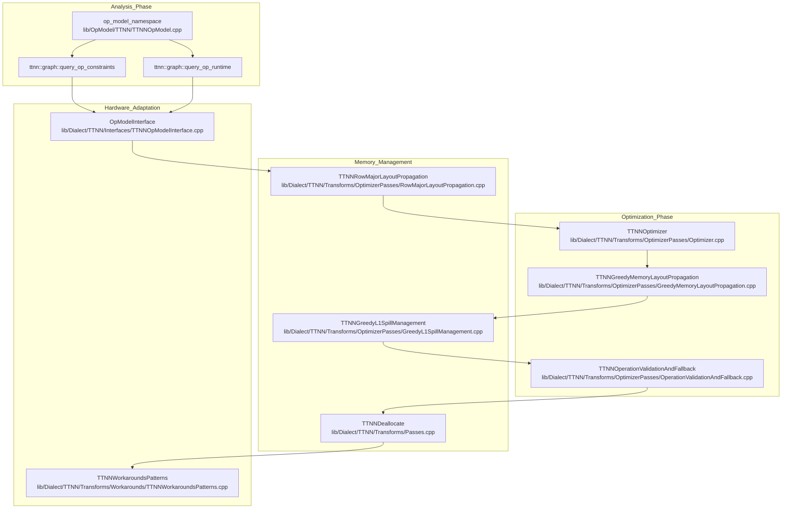
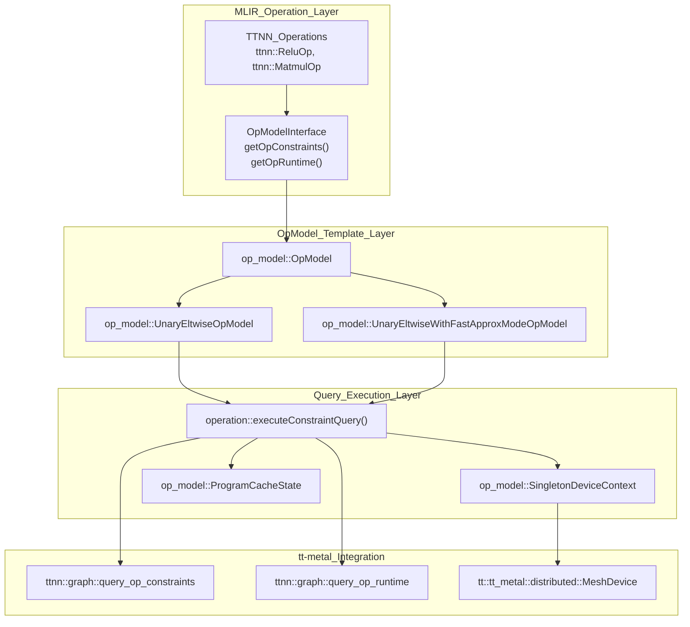
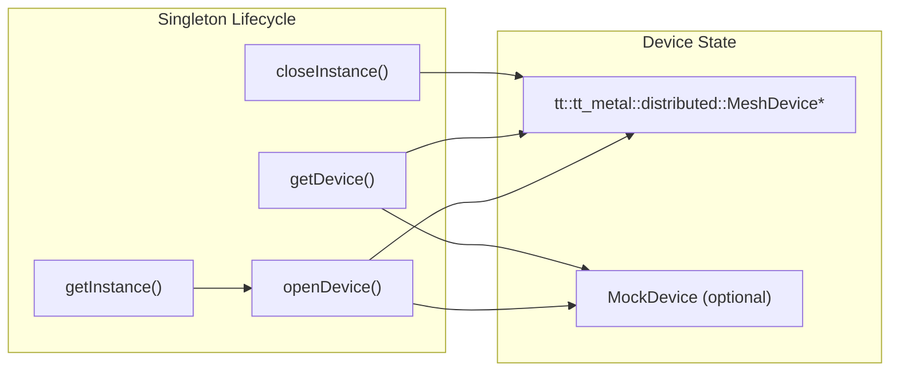

# Performance and Optimization

Relevant source files
*   [include/ttmlir/Dialect/TTIR/IR/TTIROpsInterfaces.h](https://github.com/tenstorrent/tt-mlir/blob/c7d92e92/include/ttmlir/Dialect/TTIR/IR/TTIROpsInterfaces.h)
*   [include/ttmlir/Dialect/TTIR/IR/TTIROpsInterfaces.td](https://github.com/tenstorrent/tt-mlir/blob/c7d92e92/include/ttmlir/Dialect/TTIR/IR/TTIROpsInterfaces.td)
*   [include/ttmlir/Dialect/TTIR/IR/TTIRTraits.h](https://github.com/tenstorrent/tt-mlir/blob/c7d92e92/include/ttmlir/Dialect/TTIR/IR/TTIRTraits.h)
*   [include/ttmlir/Dialect/TTIR/Transforms/Passes.h](https://github.com/tenstorrent/tt-mlir/blob/c7d92e92/include/ttmlir/Dialect/TTIR/Transforms/Passes.h)
*   [include/ttmlir/Dialect/TTIR/Transforms/Passes.td](https://github.com/tenstorrent/tt-mlir/blob/c7d92e92/include/ttmlir/Dialect/TTIR/Transforms/Passes.td)
*   [include/ttmlir/Dialect/TTNN/IR/TTNNWorkaroundsPass.h](https://github.com/tenstorrent/tt-mlir/blob/c7d92e92/include/ttmlir/Dialect/TTNN/IR/TTNNWorkaroundsPass.h)
*   [include/ttmlir/Dialect/TTNN/Pipelines/TTNNPipelines.h](https://github.com/tenstorrent/tt-mlir/blob/c7d92e92/include/ttmlir/Dialect/TTNN/Pipelines/TTNNPipelines.h)
*   [include/ttmlir/Dialect/TTNN/Transforms/Passes.td](https://github.com/tenstorrent/tt-mlir/blob/c7d92e92/include/ttmlir/Dialect/TTNN/Transforms/Passes.td)
*   [include/ttmlir/OpModel/TTNN/MetalHeaders.h](https://github.com/tenstorrent/tt-mlir/blob/c7d92e92/include/ttmlir/OpModel/TTNN/MetalHeaders.h)
*   [include/ttmlir/OpModel/TTNN/TTNNOpModel.h](https://github.com/tenstorrent/tt-mlir/blob/c7d92e92/include/ttmlir/OpModel/TTNN/TTNNOpModel.h)
*   [lib/Dialect/TTIR/IR/TTIRTraits.cpp](https://github.com/tenstorrent/tt-mlir/blob/c7d92e92/lib/Dialect/TTIR/IR/TTIRTraits.cpp)
*   [lib/Dialect/TTIR/Transforms/CMakeLists.txt](https://github.com/tenstorrent/tt-mlir/blob/c7d92e92/lib/Dialect/TTIR/Transforms/CMakeLists.txt)
*   [lib/Dialect/TTNN/IR/TTNNWorkaroundsPass.cpp](https://github.com/tenstorrent/tt-mlir/blob/c7d92e92/lib/Dialect/TTNN/IR/TTNNWorkaroundsPass.cpp)
*   [lib/Dialect/TTNN/Interfaces/TTNNOpModelInterface.cpp](https://github.com/tenstorrent/tt-mlir/blob/c7d92e92/lib/Dialect/TTNN/Interfaces/TTNNOpModelInterface.cpp)
*   [lib/Dialect/TTNN/Pipelines/TTNNPipelines.cpp](https://github.com/tenstorrent/tt-mlir/blob/c7d92e92/lib/Dialect/TTNN/Pipelines/TTNNPipelines.cpp)
*   [lib/Dialect/TTNN/Transforms/CMakeLists.txt](https://github.com/tenstorrent/tt-mlir/blob/c7d92e92/lib/Dialect/TTNN/Transforms/CMakeLists.txt)
*   [lib/Dialect/TTNN/Transforms/Passes.cpp](https://github.com/tenstorrent/tt-mlir/blob/c7d92e92/lib/Dialect/TTNN/Transforms/Passes.cpp)
*   [lib/Dialect/TTNN/Transforms/Workarounds/TTNNWorkaroundsPatterns.cpp](https://github.com/tenstorrent/tt-mlir/blob/c7d92e92/lib/Dialect/TTNN/Transforms/Workarounds/TTNNWorkaroundsPatterns.cpp)
*   [lib/OpModel/TTNN/TTNNOpModel.cpp](https://github.com/tenstorrent/tt-mlir/blob/c7d92e92/lib/OpModel/TTNN/TTNNOpModel.cpp)
*   [test/unittests/OpModel/TTNN/Lib/TestOpModelLib.cpp](https://github.com/tenstorrent/tt-mlir/blob/c7d92e92/test/unittests/OpModel/TTNN/Lib/TestOpModelLib.cpp)
*   [test/unittests/OpModel/TTNN/Op/TestOpModelInterface.cpp](https://github.com/tenstorrent/tt-mlir/blob/c7d92e92/test/unittests/OpModel/TTNN/Op/TestOpModelInterface.cpp)

This page introduces the optimization systems and performance analysis infrastructure in tt-mlir. These systems analyze operation constraints, optimize memory layouts, and apply transformations to maximize performance on Tenstorrent hardware.

This page covers:

*   **OpModel Analysis System** (5.1): Querying operation constraints and runtime estimates without hardware execution.
*   **TTNN Layout and Memory Optimization** (5.2): Memory configuration analysis and layout propagation strategies.
*   **D2M Memory Allocation and Grid Selection** (5.3): Low-level circular buffer allocation and grid assignment.
*   **Workarounds and Hardware Compatibility** (5.4): Addressing hardware limitations through IR transformations.
*   **Operation Fusion Passes** (5.5): Combining operations to reduce memory traffic and improve performance.

For details on how these systems integrate into compilation pipelines, see [Compilation Pipelines](https://deepwiki.com/tenstorrent/tt-mlir/3-compilation-pipelines). For runtime performance measurement, see [Runtime System](https://deepwiki.com/tenstorrent/tt-mlir/4-runtime-system).

* * *

## Overview of Optimization Systems




The tt-mlir compiler employs multiple optimization systems that work together during compilation. The pipeline transitions from high-level TTNN operation analysis to low-level hardware adaptation.

**Diagram: Optimization System Components**

**Sources:**

*   [lib/OpModel/TTNN/TTNNOpModel.cpp 36-163](https://github.com/tenstorrent/tt-mlir/blob/c7d92e92/lib/OpModel/TTNN/TTNNOpModel.cpp#L36-L163)
*   [lib/Dialect/TTNN/Pipelines/TTNNPipelines.cpp 108-164](https://github.com/tenstorrent/tt-mlir/blob/c7d92e92/lib/Dialect/TTNN/Pipelines/TTNNPipelines.cpp#L108-L164)
*   [lib/Dialect/TTNN/Transforms/Passes.cpp 44-176](https://github.com/tenstorrent/tt-mlir/blob/c7d92e92/lib/Dialect/TTNN/Transforms/Passes.cpp#L44-L176)
*   [lib/Dialect/TTNN/Transforms/Workarounds/TTNNWorkaroundsPatterns.cpp 65-136](https://github.com/tenstorrent/tt-mlir/blob/c7d92e92/lib/Dialect/TTNN/Transforms/Workarounds/TTNNWorkaroundsPatterns.cpp#L65-L136)

* * *

## OpModel Analysis System

The OpModel system provides compile-time analysis of operations without executing them on hardware. It queries operation constraints (memory requirements, resource usage) and runtime predictions through the `tt-metal` library.

### OpModel Architecture




**Diagram: OpModel System Architecture**

**Sources:**

*   [lib/OpModel/TTNN/TTNNOpModel.cpp 86-120](https://github.com/tenstorrent/tt-mlir/blob/c7d92e92/lib/OpModel/TTNN/TTNNOpModel.cpp#L86-L120)
*   [include/ttmlir/OpModel/TTNN/TTNNOpModel.h 56-85](https://github.com/tenstorrent/tt-mlir/blob/c7d92e92/include/ttmlir/OpModel/TTNN/TTNNOpModel.h#L56-L85)
*   [test/unittests/OpModel/TTNN/Op/TestOpModelInterface.cpp 28-40](https://github.com/tenstorrent/tt-mlir/blob/c7d92e92/test/unittests/OpModel/TTNN/Op/TestOpModelInterface.cpp#L28-L40)
*   [lib/OpModel/TTNN/TTNNOpModel.cpp 59-74](https://github.com/tenstorrent/tt-mlir/blob/c7d92e92/lib/OpModel/TTNN/TTNNOpModel.cpp#L59-L74)

### Constraint Query Process

The `executeConstraintQuery` function template manages the query lifecycle, ensuring the `MeshDevice` is in a clean state for analysis.

1.   **Device Context**: Obtains the singleton `MeshDevice` instance via `SingletonDeviceContext::getInstance().getDevice()`[lib/OpModel/TTNN/TTNNOpModel.cpp 91](https://github.com/tenstorrent/tt-mlir/blob/c7d92e92/lib/OpModel/TTNN/TTNNOpModel.cpp#L91-L91)
2.   **Program Cache**: Disables and clears cache using RAII `ProgramCacheState` to ensure accurate resource measurement [lib/OpModel/TTNN/TTNNOpModel.cpp 94-95](https://github.com/tenstorrent/tt-mlir/blob/c7d92e92/lib/OpModel/TTNN/TTNNOpModel.cpp#L94-L95)
3.   **Query Execution**: Calls the provided callable which invokes `ttnn::graph::query_op_constraints` via the `QUERY_OP_CONSTRAINTS` macro [lib/OpModel/TTNN/TTNNOpModel.cpp 50-51](https://github.com/tenstorrent/tt-mlir/blob/c7d92e92/lib/OpModel/TTNN/TTNNOpModel.cpp#L50-L51)
4.   **Validation**: Checks `query.status` for `ttnn::graph::ExecutionStatus::Success` and ensures output tensor specs are present [lib/OpModel/TTNN/TTNNOpModel.cpp 106-113](https://github.com/tenstorrent/tt-mlir/blob/c7d92e92/lib/OpModel/TTNN/TTNNOpModel.cpp#L106-L113)

The query returns `OpConstraints` containing circular buffer peak sizes, L1 buffer usage, and output layout read-backs converted via `conversion::getLayoutAttrFromTensorSpec`[lib/OpModel/TTNN/TTNNOpModel.cpp 153-163](https://github.com/tenstorrent/tt-mlir/blob/c7d92e92/lib/OpModel/TTNN/TTNNOpModel.cpp#L153-L163)

**Sources:**

*   [lib/OpModel/TTNN/TTNNOpModel.cpp 86-120](https://github.com/tenstorrent/tt-mlir/blob/c7d92e92/lib/OpModel/TTNN/TTNNOpModel.cpp#L86-L120)
*   [lib/OpModel/TTNN/TTNNOpModel.cpp 140-163](https://github.com/tenstorrent/tt-mlir/blob/c7d92e92/lib/OpModel/TTNN/TTNNOpModel.cpp#L140-L163)

* * *

## TTNN Layout and Memory Optimization

Layout optimization determines the most efficient way to store tensors in memory (DRAM vs L1) and how to shard them across the compute grid.

### Optimizer Pipelines

The `createTTNNPipelineAnalysisPasses` function configures the optimization sequence based on `TTIRToTTNNCommonPipelineOptions`[include/ttmlir/Dialect/TTNN/Pipelines/TTNNPipelines.h 42-153](https://github.com/tenstorrent/tt-mlir/blob/c7d92e92/include/ttmlir/Dialect/TTNN/Pipelines/TTNNPipelines.h#L42-L153):

*   **TTNNOptimizer**: A chain-based optimizer that determines valid grids and layouts for operation execution [lib/Dialect/TTNN/Pipelines/TTNNPipelines.cpp 118-125](https://github.com/tenstorrent/tt-mlir/blob/c7d92e92/lib/Dialect/TTNN/Pipelines/TTNNPipelines.cpp#L118-L125)
*   **TTNNGreedyMemoryLayoutPropagation**: An alternative greedy approach for layout propagation and sharding decisions [lib/Dialect/TTNN/Pipelines/TTNNPipelines.cpp 137-147](https://github.com/tenstorrent/tt-mlir/blob/c7d92e92/lib/Dialect/TTNN/Pipelines/TTNNPipelines.cpp#L137-L147)
*   **TTNNGreedyL1SpillManagement**: Manages memory pressure by deciding when to spill tensors from L1 to DRAM [lib/Dialect/TTNN/Pipelines/TTNNPipelines.cpp 149-151](https://github.com/tenstorrent/tt-mlir/blob/c7d92e92/lib/Dialect/TTNN/Pipelines/TTNNPipelines.cpp#L149-L151)
*   **TTNNDeallocate**: Inserts explicit deallocation operations after a tensor's last use to free L1/DRAM resources [lib/Dialect/TTNN/Transforms/Passes.cpp 173-175](https://github.com/tenstorrent/tt-mlir/blob/c7d92e92/lib/Dialect/TTNN/Transforms/Passes.cpp#L173-L175)

**Sources:**

*   [lib/Dialect/TTNN/Pipelines/TTNNPipelines.cpp 99-164](https://github.com/tenstorrent/tt-mlir/blob/c7d92e92/lib/Dialect/TTNN/Pipelines/TTNNPipelines.cpp#L99-L164)
*   [include/ttmlir/Dialect/TTNN/Pipelines/TTNNPipelines.h 42-153](https://github.com/tenstorrent/tt-mlir/blob/c7d92e92/include/ttmlir/Dialect/TTNN/Pipelines/TTNNPipelines.h#L42-L153)
*   [lib/Dialect/TTNN/Transforms/Passes.cpp 44-176](https://github.com/tenstorrent/tt-mlir/blob/c7d92e92/lib/Dialect/TTNN/Transforms/Passes.cpp#L44-L176)

* * *

## Workarounds and Hardware Compatibility

The workaround system addresses hardware-specific constraints and operation limitations through IR rewrites and layout adjustments.

### Workaround Infrastructure

The `TTNNWorkarounds` pass applies patterns to ensure IR validity:

*   **Layout Workarounds**: Adjusts tensor layouts (e.g., forcing Row-Major for Pooling ops) to match hardware kernel requirements [lib/Dialect/TTNN/IR/TTNNWorkaroundsPass.cpp 98-106](https://github.com/tenstorrent/tt-mlir/blob/c7d92e92/lib/Dialect/TTNN/IR/TTNNWorkaroundsPass.cpp#L98-L106)
*   **Decomposition Rewrites**: Replaces complex operations with hardware-compatible sequences, such as `LinearOpRewritePattern` or `ArgMaxOpDimRewritePattern`[lib/Dialect/TTNN/Transforms/Workarounds/TTNNWorkaroundsPatterns.cpp 15-41](https://github.com/tenstorrent/tt-mlir/blob/c7d92e92/lib/Dialect/TTNN/Transforms/Workarounds/TTNNWorkaroundsPatterns.cpp#L15-L41)
*   **Output Reversion**: If a workaround changes an output layout, `revertOutputLayout` inserts a `ToLayoutOp` to maintain consistency for downstream ops [lib/Dialect/TTNN/Transforms/Workarounds/TTNNWorkaroundsPatterns.cpp 74-92](https://github.com/tenstorrent/tt-mlir/blob/c7d92e92/lib/Dialect/TTNN/Transforms/Workarounds/TTNNWorkaroundsPatterns.cpp#L74-L92)

**Sources:**

*   [lib/Dialect/TTNN/Transforms/Workarounds/TTNNWorkaroundsPatterns.cpp 12-42](https://github.com/tenstorrent/tt-mlir/blob/c7d92e92/lib/Dialect/TTNN/Transforms/Workarounds/TTNNWorkaroundsPatterns.cpp#L12-L42)
*   [lib/Dialect/TTNN/IR/TTNNWorkaroundsPass.cpp 97-160](https://github.com/tenstorrent/tt-mlir/blob/c7d92e92/lib/Dialect/TTNN/IR/TTNNWorkaroundsPass.cpp#L97-L160)
*   [include/ttmlir/Dialect/TTNN/Transforms/Passes.td 31-53](https://github.com/tenstorrent/tt-mlir/blob/c7d92e92/include/ttmlir/Dialect/TTNN/Transforms/Passes.td#L31-L53)

* * *

## Operation Fusion Passes

Fusion passes combine multiple operations into single kernels to reduce intermediate memory traffic and improve performance.

### Fusion Strategies

*   **TTIR Fusing**: Early-stage fusion at the TTIR level, such as fusing `Conv2d` with `Multiply` or `Permute` with `Matmul`[lib/Dialect/TTNN/Pipelines/TTNNPipelines.cpp 48-53](https://github.com/tenstorrent/tt-mlir/blob/c7d92e92/lib/Dialect/TTNN/Pipelines/TTNNPipelines.cpp#L48-L53)
*   **Pattern-Based Fusion**: Specific patterns for complex blocks like `SDPAFusingPattern` (Scaled Dot Product Attention), `RoPEFusingPattern` (Rotary Positional Embedding), and `SplitQKVFusingPatterns`[lib/Dialect/TTNN/Transforms/CMakeLists.txt 4-6](https://github.com/tenstorrent/tt-mlir/blob/c7d92e92/lib/Dialect/TTNN/Transforms/CMakeLists.txt#L4-L6)
*   **Implicit Broadcast Folding**: Folds broadcast operations into consumer operations that support implicit broadcasting [include/ttmlir/Dialect/TTIR/Transforms/Passes.td 10-25](https://github.com/tenstorrent/tt-mlir/blob/c7d92e92/include/ttmlir/Dialect/TTIR/Transforms/Passes.td#L10-L25)

**Sources:**

*   [lib/Dialect/TTNN/Pipelines/TTNNPipelines.cpp 48-65](https://github.com/tenstorrent/tt-mlir/blob/c7d92e92/lib/Dialect/TTNN/Pipelines/TTNNPipelines.cpp#L48-L65)
*   [lib/Dialect/TTNN/Transforms/CMakeLists.txt 1-7](https://github.com/tenstorrent/tt-mlir/blob/c7d92e92/lib/Dialect/TTNN/Transforms/CMakeLists.txt#L1-L7)
*   [include/ttmlir/Dialect/TTIR/Transforms/Passes.td 10-25](https://github.com/tenstorrent/tt-mlir/blob/c7d92e92/include/ttmlir/Dialect/TTIR/Transforms/Passes.td#L10-L25)

* * *

For details on the OpModel system, see [OpModel Analysis System](https://deepwiki.com/tenstorrent/tt-mlir/5.1-opmodel-analysis-system). For layout optimization details, see [TTNN Layout and Memory Optimization](https://deepwiki.com/tenstorrent/tt-mlir/5.2-ttnn-layout-and-memory-optimization). For D2M allocation strategies, see [D2M Memory Allocation and Grid Selection](https://deepwiki.com/tenstorrent/tt-mlir/5.3-d2m-memory-allocation-and-grid-selection). For hardware-specific fixes, see [Workarounds and Hardware Compatibility](https://deepwiki.com/tenstorrent/tt-mlir/5.4-workarounds-and-hardware-compatibility). For fusion strategies, see [Operation Fusion Passes](https://deepwiki.com/tenstorrent/tt-mlir/5.5-operation-fusion-passes).

This wiki is featured in the [repository](https://github.com/tenstorrent/tt-mlir/blob/main/README.md)

Dismiss
Refresh this wiki

Enter email to refresh

## Additional Diagrams


#### SingletonDeviceContext




**Key Methods:**
- `getInstance()`: Returns singleton instance [lib/OpModel/TTNN/SingletonDeviceContext.cpp:24-28]().
- `openDevice()`: Initializes device based on environment or mock settings [lib/OpModel/TTNN/SingletonDeviceContext.cpp:80-124]().
- `getDevice()`: Returns pointer to active device [include/ttmlir/OpModel/TTNN/SingletonDeviceContext.h:48-48]().
- `isMockDevice()`: Returns whether mock mode is active [include/ttmlir/OpModel/TTNN/SingletonDeviceContext.h:53-53]().
- `closeInstance()`: Closes device and cleans up resources [lib/OpModel/TTNN/SingletonDeviceContext.cpp:39-49]().

The context uses a `ProgramCacheState` RAII helper to preserve and restore the program cache state during queries, as queries typically require the cache to be disabled for accurate measurement [lib/OpModel/TTNN/TTNNOpModel.cpp:60-74]().

Sources: [lib/OpModel/TTNN/SingletonDeviceContext.cpp:17-148](), [lib/OpModel/TTNN/TTNNOpModel.cpp:60-74]()

---
```

