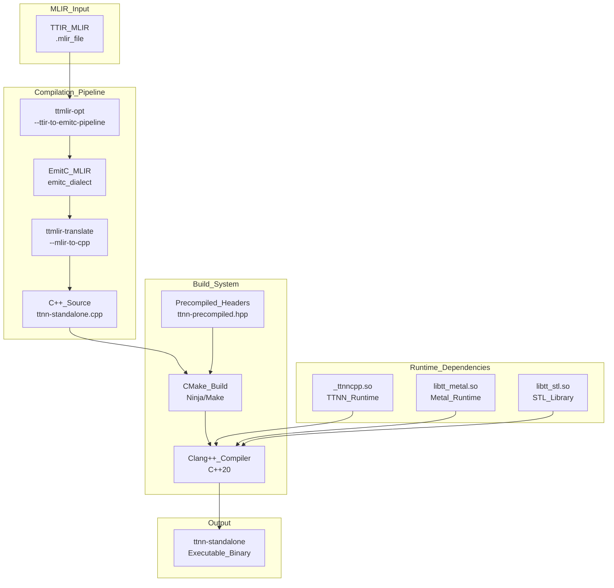
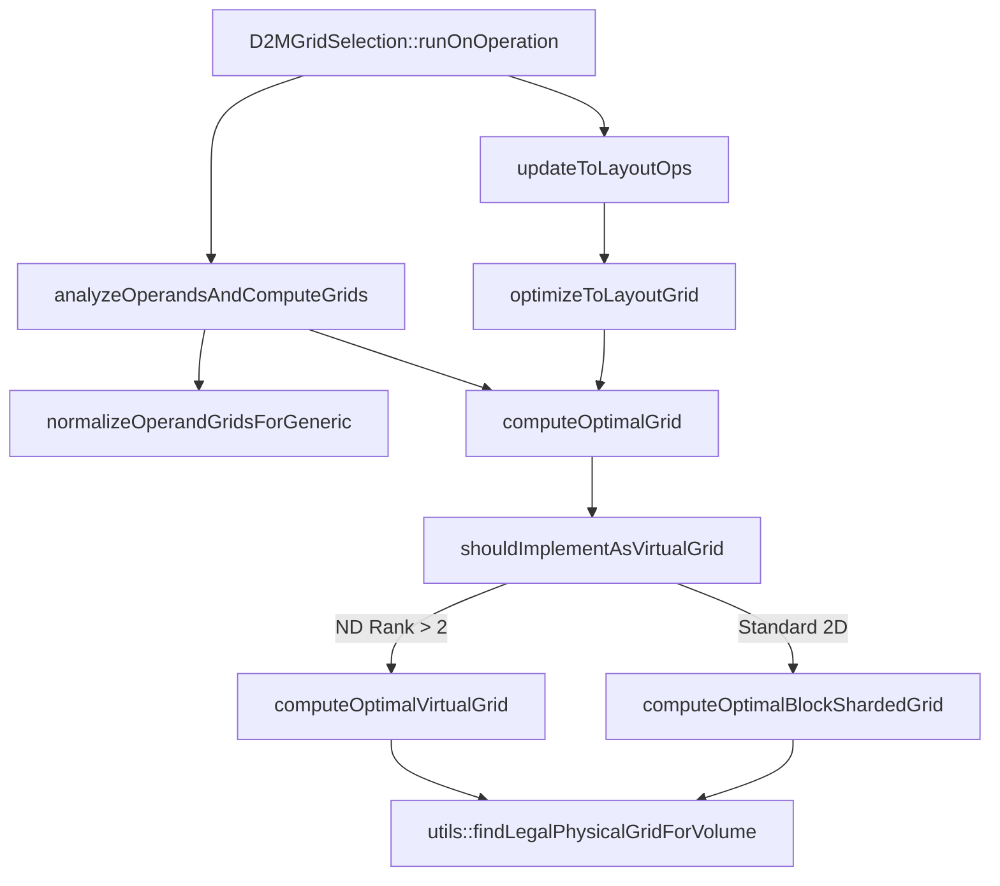

# D2M Memory Allocation and Grid Selection

Relevant source files
*   [include/ttmlir/Dialect/D2M/Analysis/Allocation/Utils.h](https://github.com/tenstorrent/tt-mlir/blob/c7d92e92/include/ttmlir/Dialect/D2M/Analysis/Allocation/Utils.h)
*   [include/ttmlir/Dialect/D2M/Analysis/BlockFactorAnalysis.h](https://github.com/tenstorrent/tt-mlir/blob/c7d92e92/include/ttmlir/Dialect/D2M/Analysis/BlockFactorAnalysis.h)
*   [include/ttmlir/Dialect/D2M/IR/D2MOps.td](https://github.com/tenstorrent/tt-mlir/blob/c7d92e92/include/ttmlir/Dialect/D2M/IR/D2MOps.td)
*   [include/ttmlir/Dialect/D2M/Pipelines/D2MPipelines.h](https://github.com/tenstorrent/tt-mlir/blob/c7d92e92/include/ttmlir/Dialect/D2M/Pipelines/D2MPipelines.h)
*   [include/ttmlir/Dialect/D2M/Transforms/Passes.td](https://github.com/tenstorrent/tt-mlir/blob/c7d92e92/include/ttmlir/Dialect/D2M/Transforms/Passes.td)
*   [include/ttmlir/Dialect/D2M/Utils/DMAUtils.h](https://github.com/tenstorrent/tt-mlir/blob/c7d92e92/include/ttmlir/Dialect/D2M/Utils/DMAUtils.h)
*   [include/ttmlir/Dialect/D2M/Utils/DstRegisterAnalysis.h](https://github.com/tenstorrent/tt-mlir/blob/c7d92e92/include/ttmlir/Dialect/D2M/Utils/DstRegisterAnalysis.h)
*   [include/ttmlir/Dialect/D2M/Utils/Utils.h](https://github.com/tenstorrent/tt-mlir/blob/c7d92e92/include/ttmlir/Dialect/D2M/Utils/Utils.h)
*   [lib/Dialect/D2M/Analysis/BlockFactorAnalysis.cpp](https://github.com/tenstorrent/tt-mlir/blob/c7d92e92/lib/Dialect/D2M/Analysis/BlockFactorAnalysis.cpp)
*   [lib/Dialect/D2M/IR/D2MOps.cpp](https://github.com/tenstorrent/tt-mlir/blob/c7d92e92/lib/Dialect/D2M/IR/D2MOps.cpp)
*   [lib/Dialect/D2M/Pipelines/D2MPipelines.cpp](https://github.com/tenstorrent/tt-mlir/blob/c7d92e92/lib/Dialect/D2M/Pipelines/D2MPipelines.cpp)
*   [lib/Dialect/D2M/Transforms/Allocate.cpp](https://github.com/tenstorrent/tt-mlir/blob/c7d92e92/lib/Dialect/D2M/Transforms/Allocate.cpp)
*   [lib/Dialect/D2M/Transforms/CMakeLists.txt](https://github.com/tenstorrent/tt-mlir/blob/c7d92e92/lib/Dialect/D2M/Transforms/CMakeLists.txt)
*   [lib/Dialect/D2M/Transforms/GenerateOuterLoops.cpp](https://github.com/tenstorrent/tt-mlir/blob/c7d92e92/lib/Dialect/D2M/Transforms/GenerateOuterLoops.cpp)
*   [lib/Dialect/D2M/Transforms/GenericTileComputeLoops.cpp](https://github.com/tenstorrent/tt-mlir/blob/c7d92e92/lib/Dialect/D2M/Transforms/GenericTileComputeLoops.cpp)
*   [lib/Dialect/D2M/Transforms/GridSelection.cpp](https://github.com/tenstorrent/tt-mlir/blob/c7d92e92/lib/Dialect/D2M/Transforms/GridSelection.cpp)
*   [lib/Dialect/D2M/Transforms/HoistCBAllocs.cpp](https://github.com/tenstorrent/tt-mlir/blob/c7d92e92/lib/Dialect/D2M/Transforms/HoistCBAllocs.cpp)
*   [lib/Dialect/D2M/Transforms/InsertScratchBuffers.cpp](https://github.com/tenstorrent/tt-mlir/blob/c7d92e92/lib/Dialect/D2M/Transforms/InsertScratchBuffers.cpp)
*   [lib/Dialect/D2M/Transforms/InsertSpillAndScratch.cpp](https://github.com/tenstorrent/tt-mlir/blob/c7d92e92/lib/Dialect/D2M/Transforms/InsertSpillAndScratch.cpp)
*   [lib/Dialect/D2M/Transforms/LowerScratchAllocate.cpp](https://github.com/tenstorrent/tt-mlir/blob/c7d92e92/lib/Dialect/D2M/Transforms/LowerScratchAllocate.cpp)
*   [lib/Dialect/D2M/Transforms/LowerToExplicitForm.cpp](https://github.com/tenstorrent/tt-mlir/blob/c7d92e92/lib/Dialect/D2M/Transforms/LowerToExplicitForm.cpp)
*   [lib/Dialect/D2M/Transforms/LowerToLayout/LowerToLayout.cpp](https://github.com/tenstorrent/tt-mlir/blob/c7d92e92/lib/Dialect/D2M/Transforms/LowerToLayout/LowerToLayout.cpp)
*   [lib/Dialect/D2M/Transforms/LowerToLayout/Plan.cpp](https://github.com/tenstorrent/tt-mlir/blob/c7d92e92/lib/Dialect/D2M/Transforms/LowerToLayout/Plan.cpp)
*   [lib/Dialect/D2M/Transforms/MarkSynchronizedBuffers.cpp](https://github.com/tenstorrent/tt-mlir/blob/c7d92e92/lib/Dialect/D2M/Transforms/MarkSynchronizedBuffers.cpp)
*   [lib/Dialect/D2M/Transforms/ScalarizeConstTensors.cpp](https://github.com/tenstorrent/tt-mlir/blob/c7d92e92/lib/Dialect/D2M/Transforms/ScalarizeConstTensors.cpp)
*   [lib/Dialect/D2M/Transforms/ScheduleDMA.cpp](https://github.com/tenstorrent/tt-mlir/blob/c7d92e92/lib/Dialect/D2M/Transforms/ScheduleDMA.cpp)
*   [lib/Dialect/D2M/Transforms/SplitUnifiedThread.cpp](https://github.com/tenstorrent/tt-mlir/blob/c7d92e92/lib/Dialect/D2M/Transforms/SplitUnifiedThread.cpp)
*   [lib/Dialect/D2M/Utils/DMAUtils.cpp](https://github.com/tenstorrent/tt-mlir/blob/c7d92e92/lib/Dialect/D2M/Utils/DMAUtils.cpp)
*   [lib/Dialect/D2M/Utils/DstRegisterAnalysis.cpp](https://github.com/tenstorrent/tt-mlir/blob/c7d92e92/lib/Dialect/D2M/Utils/DstRegisterAnalysis.cpp)
*   [lib/Dialect/D2M/Utils/Utils.cpp](https://github.com/tenstorrent/tt-mlir/blob/c7d92e92/lib/Dialect/D2M/Utils/Utils.cpp)
*   [test/python/golden/d2m/test_dma.py](https://github.com/tenstorrent/tt-mlir/blob/c7d92e92/test/python/golden/d2m/test_dma.py)
*   [test/python/golden/d2m/test_dram_ops.py](https://github.com/tenstorrent/tt-mlir/blob/c7d92e92/test/python/golden/d2m/test_dram_ops.py)
*   [test/python/golden/d2m/test_generic_matmul_reblock.py](https://github.com/tenstorrent/tt-mlir/blob/c7d92e92/test/python/golden/d2m/test_generic_matmul_reblock.py)
*   [test/ttmlir/Dialect/D2M/Transforms/eltwise_fusion_intermediate_buffer.mlir](https://github.com/tenstorrent/tt-mlir/blob/c7d92e92/test/ttmlir/Dialect/D2M/Transforms/eltwise_fusion_intermediate_buffer.mlir)
*   [test/ttmlir/Dialect/D2M/Transforms/grid_selection.mlir](https://github.com/tenstorrent/tt-mlir/blob/c7d92e92/test/ttmlir/Dialect/D2M/Transforms/grid_selection.mlir)
*   [test/ttmlir/Dialect/D2M/Transforms/hoist_cb_allocs.mlir](https://github.com/tenstorrent/tt-mlir/blob/c7d92e92/test/ttmlir/Dialect/D2M/Transforms/hoist_cb_allocs.mlir)
*   [test/ttmlir/Dialect/D2M/Transforms/insert_dst_register_access_no_loop.mlir](https://github.com/tenstorrent/tt-mlir/blob/c7d92e92/test/ttmlir/Dialect/D2M/Transforms/insert_dst_register_access_no_loop.mlir)
*   [test/ttmlir/Dialect/D2M/Transforms/insert_spill_and_scratch.mlir](https://github.com/tenstorrent/tt-mlir/blob/c7d92e92/test/ttmlir/Dialect/D2M/Transforms/insert_spill_and_scratch.mlir)
*   [test/ttmlir/Dialect/D2M/Transforms/lower_load_store_ops_sharded_to_interleaved.mlir](https://github.com/tenstorrent/tt-mlir/blob/c7d92e92/test/ttmlir/Dialect/D2M/Transforms/lower_load_store_ops_sharded_to_interleaved.mlir)
*   [test/ttmlir/Dialect/D2M/Transforms/lower_to_layout_host_dram.mlir](https://github.com/tenstorrent/tt-mlir/blob/c7d92e92/test/ttmlir/Dialect/D2M/Transforms/lower_to_layout_host_dram.mlir)
*   [test/ttmlir/Dialect/D2M/Transforms/lower_to_layout_sharded_to_interleaved.mlir](https://github.com/tenstorrent/tt-mlir/blob/c7d92e92/test/ttmlir/Dialect/D2M/Transforms/lower_to_layout_sharded_to_interleaved.mlir)
*   [test/ttmlir/Dialect/D2M/Transforms/schedule_dma.mlir](https://github.com/tenstorrent/tt-mlir/blob/c7d92e92/test/ttmlir/Dialect/D2M/Transforms/schedule_dma.mlir)
*   [test/ttmlir/Dialect/D2M/Transforms/split_unified_thread.mlir](https://github.com/tenstorrent/tt-mlir/blob/c7d92e92/test/ttmlir/Dialect/D2M/Transforms/split_unified_thread.mlir)
*   [test/ttmlir/Dialect/D2M/Transforms/split_unified_thread_semaphore_wait.mlir](https://github.com/tenstorrent/tt-mlir/blob/c7d92e92/test/ttmlir/Dialect/D2M/Transforms/split_unified_thread_semaphore_wait.mlir)
*   [test/ttmlir/Dialect/D2M/allocate/allocate_composite_view.mlir](https://github.com/tenstorrent/tt-mlir/blob/c7d92e92/test/ttmlir/Dialect/D2M/allocate/allocate_composite_view.mlir)
*   [test/ttmlir/Dialect/D2M/allocate/allocate_multiple_uses.mlir](https://github.com/tenstorrent/tt-mlir/blob/c7d92e92/test/ttmlir/Dialect/D2M/allocate/allocate_multiple_uses.mlir)
*   [test/ttmlir/Dialect/D2M/allocate/allocate_multiple_uses_min.mlir](https://github.com/tenstorrent/tt-mlir/blob/c7d92e92/test/ttmlir/Dialect/D2M/allocate/allocate_multiple_uses_min.mlir)
*   [test/ttmlir/Dialect/D2M/allocate/allocate_oom.mlir](https://github.com/tenstorrent/tt-mlir/blob/c7d92e92/test/ttmlir/Dialect/D2M/allocate/allocate_oom.mlir)
*   [test/ttmlir/Dialect/D2M/allocate/allocate_outer_inner_no_alias.mlir](https://github.com/tenstorrent/tt-mlir/blob/c7d92e92/test/ttmlir/Dialect/D2M/allocate/allocate_outer_inner_no_alias.mlir)
*   [test/ttmlir/Dialect/D2M/allocate/allocate_reblock.mlir](https://github.com/tenstorrent/tt-mlir/blob/c7d92e92/test/ttmlir/Dialect/D2M/allocate/allocate_reblock.mlir)
*   [test/ttmlir/Dialect/D2M/allocate/allocate_reblock_auto.mlir](https://github.com/tenstorrent/tt-mlir/blob/c7d92e92/test/ttmlir/Dialect/D2M/allocate/allocate_reblock_auto.mlir)
*   [test/ttmlir/Dialect/D2M/allocate/allocate_reblock_dealloc_order.mlir](https://github.com/tenstorrent/tt-mlir/blob/c7d92e92/test/ttmlir/Dialect/D2M/allocate/allocate_reblock_dealloc_order.mlir)
*   [test/ttmlir/Dialect/D2M/allocate/allocate_spill.mlir](https://github.com/tenstorrent/tt-mlir/blob/c7d92e92/test/ttmlir/Dialect/D2M/allocate/allocate_spill.mlir)
*   [test/ttmlir/Dialect/D2M/allocate/allocate_standalone.mlir](https://github.com/tenstorrent/tt-mlir/blob/c7d92e92/test/ttmlir/Dialect/D2M/allocate/allocate_standalone.mlir)
*   [test/ttmlir/Dialect/D2M/allocate/allocate_stream_insert_explicit_datamovement.mlir](https://github.com/tenstorrent/tt-mlir/blob/c7d92e92/test/ttmlir/Dialect/D2M/allocate/allocate_stream_insert_explicit_datamovement.mlir)
*   [test/ttmlir/Dialect/D2M/allocate/allocate_stream_insert_rules_always.mlir](https://github.com/tenstorrent/tt-mlir/blob/c7d92e92/test/ttmlir/Dialect/D2M/allocate/allocate_stream_insert_rules_always.mlir)
*   [test/ttmlir/Dialect/D2M/allocate/allocate_stream_insert_rules_always_min.mlir](https://github.com/tenstorrent/tt-mlir/blob/c7d92e92/test/ttmlir/Dialect/D2M/allocate/allocate_stream_insert_rules_always_min.mlir)
*   [test/ttmlir/Dialect/D2M/allocate/allocate_stream_insert_rules_infer.mlir](https://github.com/tenstorrent/tt-mlir/blob/c7d92e92/test/ttmlir/Dialect/D2M/allocate/allocate_stream_insert_rules_infer.mlir)
*   [test/ttmlir/Dialect/D2M/allocate/allocate_stream_insert_rules_infer_min.mlir](https://github.com/tenstorrent/tt-mlir/blob/c7d92e92/test/ttmlir/Dialect/D2M/allocate/allocate_stream_insert_rules_infer_min.mlir)
*   [test/ttmlir/Dialect/D2M/allocate/lower_scratch_allocate.mlir](https://github.com/tenstorrent/tt-mlir/blob/c7d92e92/test/ttmlir/Dialect/D2M/allocate/lower_scratch_allocate.mlir)
*   [test/ttmlir/Dialect/D2M/allocate/lower_scratch_allocate_oom.mlir](https://github.com/tenstorrent/tt-mlir/blob/c7d92e92/test/ttmlir/Dialect/D2M/allocate/lower_scratch_allocate_oom.mlir)
*   [test/ttmlir/Dialect/D2M/generic/insert_scratch_buffers.mlir](https://github.com/tenstorrent/tt-mlir/blob/c7d92e92/test/ttmlir/Dialect/D2M/generic/insert_scratch_buffers.mlir)
*   [test/ttmlir/Dialect/D2M/generic/mark_synchronized_buffers.mlir](https://github.com/tenstorrent/tt-mlir/blob/c7d92e92/test/ttmlir/Dialect/D2M/generic/mark_synchronized_buffers.mlir)
*   [test/ttmlir/Dialect/D2M/lower_to_layout.mlir](https://github.com/tenstorrent/tt-mlir/blob/c7d92e92/test/ttmlir/Dialect/D2M/lower_to_layout.mlir)
*   [test/ttmlir/Dialect/D2M/scalarize_const_tensors.mlir](https://github.com/tenstorrent/tt-mlir/blob/c7d92e92/test/ttmlir/Dialect/D2M/scalarize_const_tensors.mlir)
*   [test/ttnn-jit/demo/test_digamma.py](https://github.com/tenstorrent/tt-mlir/blob/c7d92e92/test/ttnn-jit/demo/test_digamma.py)
*   [test/unittests/LowerToLayout/TestPlan.cpp](https://github.com/tenstorrent/tt-mlir/blob/c7d92e92/test/unittests/LowerToLayout/TestPlan.cpp)

## Purpose and Scope

This page documents the D2M (Data-to-Metal) transformation passes that prepare operations for hardware execution by managing physical resource constraints. These passes run in sequence after D2M operations are created from TTIR and before they are lowered to low-level TTKernel or TTMetal representations.

| Pass / Component | File | Role |
| --- | --- | --- |
| `D2MGridSelection` | [lib/Dialect/D2M/Transforms/GridSelection.cpp 31-32](https://github.com/tenstorrent/tt-mlir/blob/c7d92e92/lib/Dialect/D2M/Transforms/GridSelection.cpp#L31-L32) | Computes optimal compute grids per operand, including virtual grid assignment |
| `D2MAllocate` | [lib/Dialect/D2M/Transforms/Allocate.cpp 31-33](https://github.com/tenstorrent/tt-mlir/blob/c7d92e92/lib/Dialect/D2M/Transforms/Allocate.cpp#L31-L33) | L1/DRAM address assignment, stream insertion, and liveness analysis |
| `D2MLowerToLayout` | [lib/Dialect/D2M/Transforms/LowerToLayout/LowerToLayout.cpp 1-2](https://github.com/tenstorrent/tt-mlir/blob/c7d92e92/lib/Dialect/D2M/Transforms/LowerToLayout/LowerToLayout.cpp#L1-L2) | Expands `d2m.to_layout` into `d2m.generic` ops for tilize/untilize/reblock |
| `D2MInsertDstRegisterAccess` | [lib/Dialect/D2M/Transforms/InsertDstRegisterAccess/Shared.cpp 1-2](https://github.com/tenstorrent/tt-mlir/blob/c7d92e92/lib/Dialect/D2M/Transforms/InsertDstRegisterAccess/Shared.cpp#L1-L2) | Manages DST register acquire/release and synchronization for compute loops |
| `D2MOpScheduler` | [include/ttmlir/Dialect/D2M/Transforms/Passes.td 80-81](https://github.com/tenstorrent/tt-mlir/blob/c7d92e92/include/ttmlir/Dialect/D2M/Transforms/Passes.td#L80-L81) | Sethi-Ullman based reordering to minimize DST register slice requirements |
| `D2MGenericFusion` | [include/ttmlir/Dialect/D2M/Transforms/Passes.td 57-58](https://github.com/tenstorrent/tt-mlir/blob/c7d92e92/include/ttmlir/Dialect/D2M/Transforms/Passes.td#L57-L58) | Fuses chains of `d2m.generic` elementwise ops on tensors pre-bufferization |
| `D2MInsertScratchBuffers` | [include/ttmlir/Dialect/D2M/Transforms/Passes.td 11-12](https://github.com/tenstorrent/tt-mlir/blob/c7d92e92/include/ttmlir/Dialect/D2M/Transforms/Passes.td#L11-L12) | Inserts scratch buffer anchors inside fused compute regions for intermediate spilling |

Sources: [lib/Dialect/D2M/Transforms/GridSelection.cpp 31-32](https://github.com/tenstorrent/tt-mlir/blob/c7d92e92/lib/Dialect/D2M/Transforms/GridSelection.cpp#L31-L32)[lib/Dialect/D2M/Transforms/Allocate.cpp 31-33](https://github.com/tenstorrent/tt-mlir/blob/c7d92e92/lib/Dialect/D2M/Transforms/Allocate.cpp#L31-L33)[include/ttmlir/Dialect/D2M/Transforms/Passes.td 80-81](https://github.com/tenstorrent/tt-mlir/blob/c7d92e92/include/ttmlir/Dialect/D2M/Transforms/Passes.td#L80-L81)[include/ttmlir/Dialect/D2M/Transforms/Passes.td 57-58](https://github.com/tenstorrent/tt-mlir/blob/c7d92e92/include/ttmlir/Dialect/D2M/Transforms/Passes.td#L57-L58)[include/ttmlir/Dialect/D2M/Transforms/Passes.td 11-12](https://github.com/tenstorrent/tt-mlir/blob/c7d92e92/include/ttmlir/Dialect/D2M/Transforms/Passes.td#L11-L12)

* * *


```mermaid
graph TB
    subgraph "TTNN Compilation Pipeline"
        [TTIR_Ops] --> [TTIRToTTNN_Pass]
        [TTIRToTTNN_Pass] --> [TTNN_Ops_Initial]
        [TTNN_Ops_Initial] --> [TTNN_Fusing_Pass]
        [TTNN_Fusing_Pass] --> [TTNNWorkarounds_Pass]
        [TTNNWorkarounds_Pass] --> [TTNN_Ops_Hardware_Compatible]
        [TTNN_Ops_Hardware_Compatible] --> [TTNNOptimizer]
    end
    
    subgraph "Workaround System Entities"
        [wa::TTNNWorkaroundInterface]
        [wa::TTNNOperandsWorkaroundsFactory]
        [TTNNWorkaroundsPatterns.cpp]
        [Decomposition_Patterns]
    end
    
    subgraph "Workaround Types"
        [Layout_Workarounds]
        [Buffer_Type_Workarounds]
        [Memory_Layout_Workarounds]
        [Data_Type_Workarounds]
    end
    
    [TTNNWorkarounds_Pass] -- "uses" --> [wa::TTNNWorkaroundInterface]
    [wa::TTNNWorkaroundInterface] -- "calls" --> [wa::TTNNOperandsWorkaroundsFactory]
    [wa::TTNNOperandsWorkaroundsFactory] -- "defines" --> [Layout_Workarounds]
    [wa::TTNNOperandsWorkaroundsFactory] -- "defines" --> [Buffer_Type_Workarounds]
    [wa::TTNNOperandsWorkaroundsFactory] -- "defines" --> [Memory_Layout_Workarounds]
    [wa::TTNNOperandsWorkaroundsFactory] -- "defines" --> [Data_Type_Workarounds]
    
    [TTNNWorkaroundsPatterns.cpp] -- "implements" --> [wa::TTNNWorkaroundInterface]
    [Decomposition_Patterns] -- "part of" --> [TTNNWorkarounds_Pass]
```

Sources: [lib/Dialect/TTNN/Pipelines/TTNNPipelines.cpp:113-132](), [lib/Dialect/TTNN/Transforms/Workarounds/TTNNWorkaroundsPatterns.cpp:1-61](), [include/ttmlir/Dialect/TTNN/Transforms/Passes.td:31-52]()
```
## Grid Selection Pass (`D2MGridSelection`)

### Overview

The `D2MGridSelection` pass determines the execution grid for `d2m.generic` operations. It computes the optimal grid for each operand, choosing between standard **block sharding** (where grid dimensions directly divide the physical tensor shape) and **virtual grids** (where logical ND grids are mapped to physical 2D rectangles).

Sources: [lib/Dialect/D2M/Transforms/GridSelection.cpp 31-35](https://github.com/tenstorrent/tt-mlir/blob/c7d92e92/lib/Dialect/D2M/Transforms/GridSelection.cpp#L31-L35)




**Diagram: ttnn-standalone Compilation and Build Flow**

Sources: [tools/ttnn-standalone/ttnn-standalone.cpp:1-30](), [docs/src/ttmlir-translate.md:1-27](), [tools/ttnn-standalone/CMakeLists.txt:120-125]()
```
### Core Functions and Decision Logic

The following diagram maps the key functions in `GridSelection.cpp` and `GridSelectionUtils.cpp` to the decision logic for hardware mapping:

**Diagram: D2MGridSelection Core Function Call Graph**

Sources: [lib/Dialect/D2M/Transforms/GridSelection.cpp 37-140](https://github.com/tenstorrent/tt-mlir/blob/c7d92e92/lib/Dialect/D2M/Transforms/GridSelection.cpp#L37-L140)[lib/Dialect/D2M/Utils/GridSelectionUtils.cpp 1-20](https://github.com/tenstorrent/tt-mlir/blob/c7d92e92/lib/Dialect/D2M/Utils/GridSelectionUtils.cpp#L1-L20)




Sources: [lib/Dialect/D2M/Transforms/GridSelection.cpp:37-140](), [lib/Dialect/D2M/Utils/GridSelectionUtils.cpp:1-20]()
```
### Grid Strategy Selection

The decision to use a virtual grid is handled by `shouldImplementAsVirtualGrid`. It returns `true` if:

1.   The tensor has non-trivially collapsed dimensions (physical rank > 2).
2.   Block-sharding utilization would be low (≤ 25%) of the target grid volume for non-interleaved layouts.

**Virtual Grid Mapping:** When a logical grid is ND or exceeds physical bounds, the pass generates affine maps to bridge the virtual and physical spaces. `EmptyOp` builders use `ttmlir::d2m::utils::grids::createCoreVirtMaps` to create `invAttr` and `fwdAttr` attributes [lib/Dialect/D2M/IR/D2MOps.cpp 155-158](https://github.com/tenstorrent/tt-mlir/blob/c7d92e92/lib/Dialect/D2M/IR/D2MOps.cpp#L155-L158)

Sources: [lib/Dialect/D2M/IR/D2MOps.cpp 134-163](https://github.com/tenstorrent/tt-mlir/blob/c7d92e92/lib/Dialect/D2M/IR/D2MOps.cpp#L134-L163)[lib/Dialect/D2M/Transforms/GridSelection.cpp 37-87](https://github.com/tenstorrent/tt-mlir/blob/c7d92e92/lib/Dialect/D2M/Transforms/GridSelection.cpp#L37-L87)

* * *

## Memory Allocation Pass (`D2MAllocate`)

### Overview

`D2MAllocate` manages the physical memory map for a function body. It operates on bufferized IR and produces IR with concrete memory addresses. It utilizes a `Planner` to solve the allocation problem [lib/Dialect/D2M/Transforms/Allocate.cpp 49-60](https://github.com/tenstorrent/tt-mlir/blob/c7d92e92/lib/Dialect/D2M/Transforms/Allocate.cpp#L49-L60)

### Memory Space Management

The pass maintains metadata for `DeviceL1` and `DeviceDRAM` via `MemorySpaceInfo`. This includes base addresses, max addresses, and alignment requirements [lib/Dialect/D2M/Transforms/Allocate.cpp 61-82](https://github.com/tenstorrent/tt-mlir/blob/c7d92e92/lib/Dialect/D2M/Transforms/Allocate.cpp#L61-L82)

| Feature | L1 Mapping | DRAM Mapping |
| --- | --- | --- |
| **Planner Space** | `PlannerSpace::Scratch` | `PlannerSpace::Spill` |
| **Enum Mapping** | `MemorySpace::DeviceL1` | `MemorySpace::DeviceDRAM` |

Sources: [lib/Dialect/D2M/Transforms/Allocate.cpp 92-118](https://github.com/tenstorrent/tt-mlir/blob/c7d92e92/lib/Dialect/D2M/Transforms/Allocate.cpp#L92-L118)

### Liveness and Operand Context

The pass extends standard SSA liveness to account for view operations (`d2m.view_layout`) and streams. The `LivenessClosure` ensures that a root allocation remains live as long as its last user is active [lib/Dialect/D2M/Transforms/Allocate.cpp 120-123](https://github.com/tenstorrent/tt-mlir/blob/c7d92e92/lib/Dialect/D2M/Transforms/Allocate.cpp#L120-L123)

**Diagram: D2MAllocate Data Structures and Flow**

Sources: [lib/Dialect/D2M/Transforms/Allocate.cpp 130-209](https://github.com/tenstorrent/tt-mlir/blob/c7d92e92/lib/Dialect/D2M/Transforms/Allocate.cpp#L130-L209)

### Automatic Block Factor Analysis

`D2MAllocate` uses `BlockFactorAnalysis` to automatically derive `block_factors` for `d2m.generic` ops when they are not explicitly provided. The analysis classifies operations into `SingleReduction` or `AllParallelEltwise` classes [lib/Dialect/D2M/Analysis/BlockFactorAnalysis.cpp 29-32](https://github.com/tenstorrent/tt-mlir/blob/c7d92e92/lib/Dialect/D2M/Analysis/BlockFactorAnalysis.cpp#L29-L32)

It employs a beam-search strategy (`kEltwiseBeamWidth = 64`) to find factors that balance performance (maximizing blocking volume) with L1 memory constraints (minimizing circular buffer bytes) [lib/Dialect/D2M/Analysis/BlockFactorAnalysis.cpp 36-50](https://github.com/tenstorrent/tt-mlir/blob/c7d92e92/lib/Dialect/D2M/Analysis/BlockFactorAnalysis.cpp#L36-L50)

Sources: [lib/Dialect/D2M/Analysis/BlockFactorAnalysis.cpp 17-168](https://github.com/tenstorrent/tt-mlir/blob/c7d92e92/lib/Dialect/D2M/Analysis/BlockFactorAnalysis.cpp#L17-L168)

* * *

## Elementwise Fusion and Scratch Management

### `D2MGenericFusion`

Fusion is performed pre-bufferization to reduce intermediary tensors and improve locality [include/ttmlir/Dialect/D2M/Transforms/Passes.td 65-66](https://github.com/tenstorrent/tt-mlir/blob/c7d92e92/include/ttmlir/Dialect/D2M/Transforms/Passes.td#L65-L66) It merges producer `d2m.generic` ops into consumers if they have matching device attributes (grid, threads, block_factors) [include/ttmlir/Dialect/D2M/Transforms/Passes.td 61-63](https://github.com/tenstorrent/tt-mlir/blob/c7d92e92/include/ttmlir/Dialect/D2M/Transforms/Passes.td#L61-L63)

### `D2MInsertScratchBuffers`

Post-bufferization, this pass inserts a scratch buffer inside fused `d2m.generic` operations that need to spill intermediate results [include/ttmlir/Dialect/D2M/Transforms/Passes.td 11-17](https://github.com/tenstorrent/tt-mlir/blob/c7d92e92/include/ttmlir/Dialect/D2M/Transforms/Passes.td#L11-L17) The scratch buffer is typically a 128KB L1 buffer whose shard shape is `[1, numTiles]`[include/ttmlir/Dialect/D2M/Transforms/Passes.td 19-21](https://github.com/tenstorrent/tt-mlir/blob/c7d92e92/include/ttmlir/Dialect/D2M/Transforms/Passes.td#L19-L21)

### `D2MInsertSpillAndScratch`

This pass transforms compute regions with multiple `d2m.scratch_space_loop` nests to use scratch buffers for intermediate results, enabling efficient pipelining [include/ttmlir/Dialect/D2M/Transforms/Passes.td 137-143](https://github.com/tenstorrent/tt-mlir/blob/c7d92e92/include/ttmlir/Dialect/D2M/Transforms/Passes.td#L137-L143) It identifies `memref.alloc` ops written by one loop nest and read by another, creating `d2m.scratch_allocate` ops [include/ttmlir/Dialect/D2M/Transforms/Passes.td 150-156](https://github.com/tenstorrent/tt-mlir/blob/c7d92e92/include/ttmlir/Dialect/D2M/Transforms/Passes.td#L150-L156)

Sources: [include/ttmlir/Dialect/D2M/Transforms/Passes.td 11-78](https://github.com/tenstorrent/tt-mlir/blob/c7d92e92/include/ttmlir/Dialect/D2M/Transforms/Passes.td#L11-L78)[include/ttmlir/Dialect/D2M/Transforms/Passes.td 137-164](https://github.com/tenstorrent/tt-mlir/blob/c7d92e92/include/ttmlir/Dialect/D2M/Transforms/Passes.td#L137-L164)

* * *

## LowerToLayout Pass (`D2MLowerToLayout`)

`D2MLowerToLayout` expands high-level `d2m.to_layout` transitions into explicit data movement and compute operations using `d2m.generic`.

### Transformation Strategies

*   **Tilize/Untilize**: Converts between row-major system memory and tiled device memory. It handles transitions between different memory spaces (DRAM to L1) and data types [include/ttmlir/Dialect/D2M/IR/D2MOps.td 98-103](https://github.com/tenstorrent/tt-mlir/blob/c7d92e92/include/ttmlir/Dialect/D2M/IR/D2MOps.td#L98-L103)
*   **Reblock**: Handles transitions between different device grids or sharding schemes [include/ttmlir/Dialect/D2M/IR/D2MOps.td 102](https://github.com/tenstorrent/tt-mlir/blob/c7d92e92/include/ttmlir/Dialect/D2M/IR/D2MOps.td#L102-L102)
*   **DRAM Bounce Logic**: Metadata-only DRAM layout changes are legal in-place, but DRAM copy/reblock generics must "bounce" through L1 as they cannot read and write DRAM directly [lib/Dialect/D2M/Transforms/LowerToLayout/Plan.cpp 109-114](https://github.com/tenstorrent/tt-mlir/blob/c7d92e92/lib/Dialect/D2M/Transforms/LowerToLayout/Plan.cpp#L109-L114)

### Virtual Grid Bouncing

When staging data through interleaved DRAM on a unit grid for a virtual-grid tensor, the pass uses `computeVirtualGridBounceShape` to collapse ND virtual grids into 2D shapes that fit the physical device grid [lib/Dialect/D2M/Transforms/LowerToLayout/Plan.cpp 150-152](https://github.com/tenstorrent/tt-mlir/blob/c7d92e92/lib/Dialect/D2M/Transforms/LowerToLayout/Plan.cpp#L150-L152)

Sources: [include/ttmlir/Dialect/D2M/IR/D2MOps.td 88-131](https://github.com/tenstorrent/tt-mlir/blob/c7d92e92/include/ttmlir/Dialect/D2M/IR/D2MOps.td#L88-L131)[lib/Dialect/D2M/Transforms/LowerToLayout/Plan.cpp 104-169](https://github.com/tenstorrent/tt-mlir/blob/c7d92e92/lib/Dialect/D2M/Transforms/LowerToLayout/Plan.cpp#L104-L169)

* * *

## DST Register Management and Scheduling

### `D2MInsertDstRegisterAccess`

These passes identify compute operations and manage DST register slices. `InsertDstRegisterAccess/Scheduled.cpp` and `Unscheduled.cpp` implement different strategies for inserting DST acquire/release primitives depending on whether the op order has been optimized [lib/Dialect/D2M/Transforms/CMakeLists.txt 14-16](https://github.com/tenstorrent/tt-mlir/blob/c7d92e92/lib/Dialect/D2M/Transforms/CMakeLists.txt#L14-L16)

### `D2MOpScheduler`

For non-trivially fused generics (3+ input operands), the scheduler reorders operations using a Sethi-Ullman algorithm within affine loop nests to minimize the total required DST register slices [include/ttmlir/Dialect/D2M/Transforms/Passes.td 80-88](https://github.com/tenstorrent/tt-mlir/blob/c7d92e92/include/ttmlir/Dialect/D2M/Transforms/Passes.td#L80-L88) It adds the `d2m.scheduled` tag to loops for downstream passes [include/ttmlir/Dialect/D2M/Transforms/Passes.td 88-89](https://github.com/tenstorrent/tt-mlir/blob/c7d92e92/include/ttmlir/Dialect/D2M/Transforms/Passes.td#L88-L89)

### `D2MGenericTileComputeLoops`

This pass tiles `linalg.generic` compute loops to fit within the physical capacity of the DST registers, respecting fusion constraints [include/ttmlir/Dialect/D2M/Transforms/Passes.td 119-123](https://github.com/tenstorrent/tt-mlir/blob/c7d92e92/include/ttmlir/Dialect/D2M/Transforms/Passes.td#L119-L123) It uses `getRegionLargestDstElemType` to determine the maximum tile size needed for DST allocation [lib/Dialect/D2M/Utils/Utils.cpp 80-88](https://github.com/tenstorrent/tt-mlir/blob/c7d92e92/lib/Dialect/D2M/Utils/Utils.cpp#L80-L88)

Sources: [include/ttmlir/Dialect/D2M/Transforms/Passes.td 80-102](https://github.com/tenstorrent/tt-mlir/blob/c7d92e92/include/ttmlir/Dialect/D2M/Transforms/Passes.td#L80-L102)[include/ttmlir/Dialect/D2M/Transforms/Passes.td 119-135](https://github.com/tenstorrent/tt-mlir/blob/c7d92e92/include/ttmlir/Dialect/D2M/Transforms/Passes.td#L119-L135)[lib/Dialect/D2M/Utils/Utils.cpp 37-88](https://github.com/tenstorrent/tt-mlir/blob/c7d92e92/lib/Dialect/D2M/Utils/Utils.cpp#L37-L88)

This wiki is featured in the [repository](https://github.com/tenstorrent/tt-mlir/blob/main/README.md)

Dismiss
Refresh this wiki

Enter email to refresh
