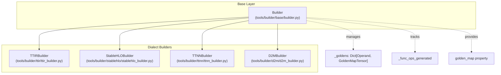
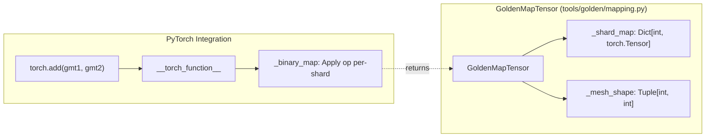
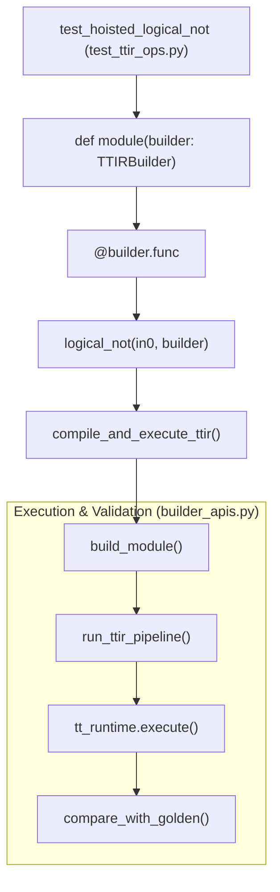

# Builder Framework and Golden Testing

Relevant source files
*   [docs/src/builder/testing.md](https://github.com/tenstorrent/tt-mlir/blob/c7d92e92/docs/src/builder/testing.md?plain=1)
*   [test/python/chisel/test_golden_execution.py](https://github.com/tenstorrent/tt-mlir/blob/c7d92e92/test/python/chisel/test_golden_execution.py)
*   [test/python/chisel/test_ir_module.py](https://github.com/tenstorrent/tt-mlir/blob/c7d92e92/test/python/chisel/test_ir_module.py)
*   [test/python/chisel/test_walk_program.py](https://github.com/tenstorrent/tt-mlir/blob/c7d92e92/test/python/chisel/test_walk_program.py)
*   [test/python/chisel/utils.py](https://github.com/tenstorrent/tt-mlir/blob/c7d92e92/test/python/chisel/utils.py)
*   [test/python/golden/conftest.py](https://github.com/tenstorrent/tt-mlir/blob/c7d92e92/test/python/golden/conftest.py)
*   [test/python/golden/mlir_snippets/stablehlo/stablehlo_scatter.mlir](https://github.com/tenstorrent/tt-mlir/blob/c7d92e92/test/python/golden/mlir_snippets/stablehlo/stablehlo_scatter.mlir)
*   [test/python/golden/pytest.ini](https://github.com/tenstorrent/tt-mlir/blob/c7d92e92/test/python/golden/pytest.ini)
*   [test/python/golden/test_shardy_ops.py](https://github.com/tenstorrent/tt-mlir/blob/c7d92e92/test/python/golden/test_shardy_ops.py)
*   [test/python/golden/test_stablehlo_ops.py](https://github.com/tenstorrent/tt-mlir/blob/c7d92e92/test/python/golden/test_stablehlo_ops.py)
*   [test/python/golden/test_ttir_models.py](https://github.com/tenstorrent/tt-mlir/blob/c7d92e92/test/python/golden/test_ttir_models.py)
*   [test/python/golden/test_ttir_ops.py](https://github.com/tenstorrent/tt-mlir/blob/c7d92e92/test/python/golden/test_ttir_ops.py)
*   [test/python/golden/ttir_ops/data_movement/test_data_movement.py](https://github.com/tenstorrent/tt-mlir/blob/c7d92e92/test/python/golden/ttir_ops/data_movement/test_data_movement.py)
*   [test/python/golden/ttir_ops/eltwise/test_ttir_binary.py](https://github.com/tenstorrent/tt-mlir/blob/c7d92e92/test/python/golden/ttir_ops/eltwise/test_ttir_binary.py)
*   [test/python/golden/ttir_ops/eltwise/test_ttir_ternary.py](https://github.com/tenstorrent/tt-mlir/blob/c7d92e92/test/python/golden/ttir_ops/eltwise/test_ttir_ternary.py)
*   [test/python/golden/ttir_ops/eltwise/test_ttir_unary.py](https://github.com/tenstorrent/tt-mlir/blob/c7d92e92/test/python/golden/ttir_ops/eltwise/test_ttir_unary.py)
*   [test/python/golden/ttir_ops/reduction/test_reduction.py](https://github.com/tenstorrent/tt-mlir/blob/c7d92e92/test/python/golden/ttir_ops/reduction/test_reduction.py)
*   [test/python/golden/ttnn_ops/eltwise/test_ttnn_binary.py](https://github.com/tenstorrent/tt-mlir/blob/c7d92e92/test/python/golden/ttnn_ops/eltwise/test_ttnn_binary.py)
*   [test/python/golden/ttnn_ops/eltwise/test_ttnn_unary.py](https://github.com/tenstorrent/tt-mlir/blob/c7d92e92/test/python/golden/ttnn_ops/eltwise/test_ttnn_unary.py)
*   [test/ttmlir/Dialect/TTNN/Transforms/Workarounds/reduction_ops_workaround.mlir](https://github.com/tenstorrent/tt-mlir/blob/c7d92e92/test/ttmlir/Dialect/TTNN/Transforms/Workarounds/reduction_ops_workaround.mlir)
*   [test/ttmlir/Dialect/TTNN/reduction/simple_max.mlir](https://github.com/tenstorrent/tt-mlir/blob/c7d92e92/test/ttmlir/Dialect/TTNN/reduction/simple_max.mlir)
*   [test/ttmlir/Dialect/TTNN/reduction/simple_mean.mlir](https://github.com/tenstorrent/tt-mlir/blob/c7d92e92/test/ttmlir/Dialect/TTNN/reduction/simple_mean.mlir)
*   [test/ttmlir/Dialect/TTNN/reduction/simple_reduce_min.mlir](https://github.com/tenstorrent/tt-mlir/blob/c7d92e92/test/ttmlir/Dialect/TTNN/reduction/simple_reduce_min.mlir)
*   [test/ttmlir/Dialect/TTNN/reduction/simple_sum.mlir](https://github.com/tenstorrent/tt-mlir/blob/c7d92e92/test/ttmlir/Dialect/TTNN/reduction/simple_sum.mlir)
*   [test/ttmlir/EmitC/TTNN/reduction/mean.mlir](https://github.com/tenstorrent/tt-mlir/blob/c7d92e92/test/ttmlir/EmitC/TTNN/reduction/mean.mlir)
*   [test/ttmlir/Silicon/StableHLO/n150/reduction/reduce_add_op.mlir](https://github.com/tenstorrent/tt-mlir/blob/c7d92e92/test/ttmlir/Silicon/StableHLO/n150/reduction/reduce_add_op.mlir)
*   [test/ttmlir/Silicon/StableHLO/n150/reduction/reduce_maximum_op.mlir](https://github.com/tenstorrent/tt-mlir/blob/c7d92e92/test/ttmlir/Silicon/StableHLO/n150/reduction/reduce_maximum_op.mlir)
*   [test/ttmlir/Silicon/StableHLO/n150/reduction/reduce_min_op.mlir](https://github.com/tenstorrent/tt-mlir/blob/c7d92e92/test/ttmlir/Silicon/StableHLO/n150/reduction/reduce_min_op.mlir)
*   [test/ttmlir/Silicon/TTNN/n150/perf/test_perf_reduce_min.mlir](https://github.com/tenstorrent/tt-mlir/blob/c7d92e92/test/ttmlir/Silicon/TTNN/n150/perf/test_perf_reduce_min.mlir)
*   [test/ttmlir/Silicon/TTNN/n150/simple_max.mlir](https://github.com/tenstorrent/tt-mlir/blob/c7d92e92/test/ttmlir/Silicon/TTNN/n150/simple_max.mlir)
*   [test/ttmlir/Silicon/TTNN/n150/simple_mean.mlir](https://github.com/tenstorrent/tt-mlir/blob/c7d92e92/test/ttmlir/Silicon/TTNN/n150/simple_mean.mlir)
*   [test/ttmlir/Silicon/TTNN/n150/simple_reduce_min.mlir](https://github.com/tenstorrent/tt-mlir/blob/c7d92e92/test/ttmlir/Silicon/TTNN/n150/simple_reduce_min.mlir)
*   [test/ttmlir/Silicon/TTNN/n150/simple_sum.mlir](https://github.com/tenstorrent/tt-mlir/blob/c7d92e92/test/ttmlir/Silicon/TTNN/n150/simple_sum.mlir)
*   [tools/builder/README.md](https://github.com/tenstorrent/tt-mlir/blob/c7d92e92/tools/builder/README.md?plain=1)
*   [tools/builder/base/builder.py](https://github.com/tenstorrent/tt-mlir/blob/c7d92e92/tools/builder/base/builder.py)
*   [tools/builder/base/builder_apis.py](https://github.com/tenstorrent/tt-mlir/blob/c7d92e92/tools/builder/base/builder_apis.py)
*   [tools/builder/base/builder_runtime.py](https://github.com/tenstorrent/tt-mlir/blob/c7d92e92/tools/builder/base/builder_runtime.py)
*   [tools/builder/base/builder_utils.py](https://github.com/tenstorrent/tt-mlir/blob/c7d92e92/tools/builder/base/builder_utils.py)
*   [tools/builder/d2m/d2m_builder.py](https://github.com/tenstorrent/tt-mlir/blob/c7d92e92/tools/builder/d2m/d2m_builder.py)
*   [tools/builder/stablehlo/stablehlo_builder.py](https://github.com/tenstorrent/tt-mlir/blob/c7d92e92/tools/builder/stablehlo/stablehlo_builder.py)
*   [tools/builder/ttir/ttir_builder.py](https://github.com/tenstorrent/tt-mlir/blob/c7d92e92/tools/builder/ttir/ttir_builder.py)
*   [tools/builder/ttnn/ttnn_builder.py](https://github.com/tenstorrent/tt-mlir/blob/c7d92e92/tools/builder/ttnn/ttnn_builder.py)
*   [tools/chisel/chisel/exceptions.py](https://github.com/tenstorrent/tt-mlir/blob/c7d92e92/tools/chisel/chisel/exceptions.py)
*   [tools/golden/CMakeLists.txt](https://github.com/tenstorrent/tt-mlir/blob/c7d92e92/tools/golden/CMakeLists.txt)
*   [tools/golden/__init__.py](https://github.com/tenstorrent/tt-mlir/blob/c7d92e92/tools/golden/__init__.py)
*   [tools/golden/mapping.py](https://github.com/tenstorrent/tt-mlir/blob/c7d92e92/tools/golden/mapping.py)
*   [tools/golden/metrics.py](https://github.com/tenstorrent/tt-mlir/blob/c7d92e92/tools/golden/metrics.py)

## Purpose and Scope

The Builder Framework provides Python APIs for programmatically constructing MLIR modules across multiple dialects (`TTIR`, `StableHLO`, `TTNN`, `D2M`), while the Golden Testing system validates operation correctness by comparing compiled output against reference PyTorch implementations. Together, these systems form the foundation for testing the `tt-mlir` compiler pipeline from operation construction through hardware execution.

For information about the runtime execution infrastructure, see [4. Runtime System](https://github.com/tenstorrent/tt-mlir/blob/c7d92e92/4.%20Runtime%20System) For details on compilation pipelines that transform builder-generated modules, see [3. Compilation Pipelines](https://github.com/tenstorrent/tt-mlir/blob/c7d92e92/3.%20Compilation%20Pipelines)

* * *


```mermaid
graph TB
    subgraph "TTNN Compilation Pipeline"
        [TTIR_Ops] --> [TTIRToTTNN_Pass]
        [TTIRToTTNN_Pass] --> [TTNN_Ops_Initial]
        [TTNN_Ops_Initial] --> [TTNN_Fusing_Pass]
        [TTNN_Fusing_Pass] --> [TTNNWorkarounds_Pass]
        [TTNNWorkarounds_Pass] --> [TTNN_Ops_Hardware_Compatible]
        [TTNN_Ops_Hardware_Compatible] --> [TTNNOptimizer]
    end
    
    subgraph "Workaround System Entities"
        [wa::TTNNWorkaroundInterface]
        [wa::TTNNOperandsWorkaroundsFactory]
        [TTNNWorkaroundsPatterns.cpp]
        [Decomposition_Patterns]
    end
    
    subgraph "Workaround Types"
        [Layout_Workarounds]
        [Buffer_Type_Workarounds]
        [Memory_Layout_Workarounds]
        [Data_Type_Workarounds]
    end
    
    [TTNNWorkarounds_Pass] -- "uses" --> [wa::TTNNWorkaroundInterface]
    [wa::TTNNWorkaroundInterface] -- "calls" --> [wa::TTNNOperandsWorkaroundsFactory]
    [wa::TTNNOperandsWorkaroundsFactory] -- "defines" --> [Layout_Workarounds]
    [wa::TTNNOperandsWorkaroundsFactory] -- "defines" --> [Buffer_Type_Workarounds]
    [wa::TTNNOperandsWorkaroundsFactory] -- "defines" --> [Memory_Layout_Workarounds]
    [wa::TTNNOperandsWorkaroundsFactory] -- "defines" --> [Data_Type_Workarounds]
    
    [TTNNWorkaroundsPatterns.cpp] -- "implements" --> [wa::TTNNWorkaroundInterface]
    [Decomposition_Patterns] -- "part of" --> [TTNNWorkarounds_Pass]
```

Sources: [lib/Dialect/TTNN/Pipelines/TTNNPipelines.cpp:113-132](), [lib/Dialect/TTNN/Transforms/Workarounds/TTNNWorkaroundsPatterns.cpp:1-61](), [include/ttmlir/Dialect/TTNN/Transforms/Passes.td:31-52]()
```
## Builder Framework Architecture

The Builder Framework implements a class hierarchy that provides dialect-specific APIs for constructing MLIR operations. Each builder subclass specializes in a particular dialect while sharing common golden tensor management infrastructure.

### Builder Class Hierarchy

**Builder Base Class Responsibilities**[tools/builder/base/builder.py 39-57](https://github.com/tenstorrent/tt-mlir/blob/c7d92e92/tools/builder/base/builder.py#L39-L57):

*   **Golden tensor management**: Maps MLIR operands to reference tensor values via `_goldens` dictionary [tools/builder/base/builder.py 80](https://github.com/tenstorrent/tt-mlir/blob/c7d92e92/tools/builder/base/builder.py#L80-L80)
*   **Function tracking**: Maintains ordered lists of inputs/outputs per function in `_func_ops_generated`[tools/builder/base/builder.py 74](https://github.com/tenstorrent/tt-mlir/blob/c7d92e92/tools/builder/base/builder.py#L74-L74)
*   **Mesh configuration**: Stores multi-device mesh topology for distributed execution [tools/builder/base/builder.py 106-122](https://github.com/tenstorrent/tt-mlir/blob/c7d92e92/tools/builder/base/builder.py#L106-L122)
*   **Metadata storage**: Tracks operand locations, bypass operations, and deallocation points [tools/builder/base/builder.py 89-101](https://github.com/tenstorrent/tt-mlir/blob/c7d92e92/tools/builder/base/builder.py#L89-L101)

**Key Builder Methods**[tools/builder/base/builder.py 186-253](https://github.com/tenstorrent/tt-mlir/blob/c7d92e92/tools/builder/base/builder.py#L186-L253):

| Method | Purpose |
| --- | --- |
| `set_goldens(inputs, outputs)` | Associate PyTorch tensors with MLIR operands [tools/builder/base/builder.py 255-277](https://github.com/tenstorrent/tt-mlir/blob/c7d92e92/tools/builder/base/builder.py#L255-L277) |
| `set_goldens_to_check(operands)` | Mark specific operands for validation [tools/builder/base/builder.py 283-284](https://github.com/tenstorrent/tt-mlir/blob/c7d92e92/tools/builder/base/builder.py#L283-L284) |
| `golden_map` | Extract golden tensors organized by program and location [tools/builder/base/builder.py 186-228](https://github.com/tenstorrent/tt-mlir/blob/c7d92e92/tools/builder/base/builder.py#L186-L228) |
| `preshard_arg(operand, shard_dims)` | Pre-shard input tensors for multi-device execution [tools/builder/base/builder.py 240-253](https://github.com/tenstorrent/tt-mlir/blob/c7d92e92/tools/builder/base/builder.py#L240-L253) |
| `bypass(operand)` | Skip golden comparison for specific operations [tools/builder/base/builder.py 279-281](https://github.com/tenstorrent/tt-mlir/blob/c7d92e92/tools/builder/base/builder.py#L279-L281) |

Sources: [tools/builder/base/builder.py 39-284](https://github.com/tenstorrent/tt-mlir/blob/c7d92e92/tools/builder/base/builder.py#L39-L284)

* * *




**Builder Base Class Responsibilities** [tools/builder/base/builder.py:39-57]():
- **Golden tensor management**: Maps MLIR operands to reference tensor values via `_goldens` dictionary [tools/builder/base/builder.py:80-80]().
- **Function tracking**: Maintains ordered lists of inputs/outputs per function in `_func_ops_generated` [tools/builder/base/builder.py:74-74]().
- **Mesh configuration**: Stores multi-device mesh topology for distributed execution [tools/builder/base/builder.py:106-122]().
- **Metadata storage**: Tracks operand locations, bypass operations, and deallocation points [tools/builder/base/builder.py:89-101]().

**Key Builder Methods** [tools/builder/base/builder.py:186-253]():

| Method | Purpose |
|--------|---------|
| `set_goldens(inputs, outputs)` | Associate PyTorch tensors with MLIR operands [tools/builder/base/builder.py:255-277]() |
| `set_goldens_to_check(operands)` | Mark specific operands for validation [tools/builder/base/builder.py:283-284]() |
| `golden_map` | Extract golden tensors organized by program and location [tools/builder/base/builder.py:186-228]() |
| `preshard_arg(operand, shard_dims)` | Pre-shard input tensors for multi-device execution [tools/builder/base/builder.py:240-253]() |
| `bypass(operand)` | Skip golden comparison for specific operations [tools/builder/base/builder.py:279-281]() |

Sources: [tools/builder/base/builder.py:39-284]()

---
```
### Dialect-Specific Builders

Each builder subclass implements the `_op_proxy` method to create dialect operations with automatic golden tensor tracking.

**TTIRBuilder**[tools/builder/ttir/ttir_builder.py 25-48](https://github.com/tenstorrent/tt-mlir/blob/c7d92e92/tools/builder/ttir/ttir_builder.py#L25-L48): The `_op_proxy` workflow in `TTIRBuilder`[tools/builder/ttir/ttir_builder.py 61-157](https://github.com/tenstorrent/tt-mlir/blob/c7d92e92/tools/builder/ttir/ttir_builder.py#L61-L157):

1.   **Shape/Type Inference**: Calls golden function to determine output shape and dtype if not provided [tools/builder/ttir/ttir_builder.py 88-102](https://github.com/tenstorrent/tt-mlir/blob/c7d92e92/tools/builder/ttir/ttir_builder.py#L88-L102)
2.   **Operation Creation**: Constructs MLIR operation with organized arguments and specific locations [tools/builder/ttir/ttir_builder.py 127-137](https://github.com/tenstorrent/tt-mlir/blob/c7d92e92/tools/builder/ttir/ttir_builder.py#L127-L137)
3.   **Golden Computation**: Executes reference implementation via `get_golden_function` and stores result [tools/builder/ttir/ttir_builder.py 145-155](https://github.com/tenstorrent/tt-mlir/blob/c7d92e92/tools/builder/ttir/ttir_builder.py#L145-L155)

**StableHLOBuilder**[tools/builder/stablehlo/stablehlo_builder.py 26-50](https://github.com/tenstorrent/tt-mlir/blob/c7d92e92/tools/builder/stablehlo/stablehlo_builder.py#L26-L50):

*   Leverages MLIR type inference traits; most StableHLO ops don't need explicit output types [tools/builder/stablehlo/stablehlo_builder.py 142-145](https://github.com/tenstorrent/tt-mlir/blob/c7d92e92/tools/builder/stablehlo/stablehlo_builder.py#L142-L145)
*   Supports `Shardy` sharding annotations via `sharding_attr` parameter [tools/builder/stablehlo/stablehlo_builder.py 117](https://github.com/tenstorrent/tt-mlir/blob/c7d92e92/tools/builder/stablehlo/stablehlo_builder.py#L117-L117)
*   Implements mesh management for multi-device configurations using `sdy.MeshAttr`[tools/builder/stablehlo/stablehlo_builder.py 65-89](https://github.com/tenstorrent/tt-mlir/blob/c7d92e92/tools/builder/stablehlo/stablehlo_builder.py#L65-L89)

**TTNNBuilder**[tools/builder/ttnn/ttnn_builder.py 22-38](https://github.com/tenstorrent/tt-mlir/blob/c7d92e92/tools/builder/ttnn/ttnn_builder.py#L22-L38):

*   Specializes in `ttnn` dialect operations.
*   Automatically handles `TTNNLayoutAttr` for tensors, defaulting to DRAM/Interleaved tiled encoding [tools/builder/ttnn/ttnn_builder.py 161-189](https://github.com/tenstorrent/tt-mlir/blob/c7d92e92/tools/builder/ttnn/ttnn_builder.py#L161-L189)
*   Supports `create_ttnn_tensor` for explicit tensor configuration [tools/builder/ttnn/ttnn_builder.py 191-210](https://github.com/tenstorrent/tt-mlir/blob/c7d92e92/tools/builder/ttnn/ttnn_builder.py#L191-L210)

Sources: [tools/builder/ttir/ttir_builder.py 25-157](https://github.com/tenstorrent/tt-mlir/blob/c7d92e92/tools/builder/ttir/ttir_builder.py#L25-L157)[tools/builder/stablehlo/stablehlo_builder.py 26-192](https://github.com/tenstorrent/tt-mlir/blob/c7d92e92/tools/builder/stablehlo/stablehlo_builder.py#L26-L192)[tools/builder/ttnn/ttnn_builder.py 22-210](https://github.com/tenstorrent/tt-mlir/blob/c7d92e92/tools/builder/ttnn/ttnn_builder.py#L22-L210)

* * *

### Operation Construction Pattern

All builders follow a consistent pattern for creating operations with golden support:

Sources: [tools/builder/ttir/ttir_builder.py 61-157](https://github.com/tenstorrent/tt-mlir/blob/c7d92e92/tools/builder/ttir/ttir_builder.py#L61-L157)[tools/builder/base/builder.py 342-362](https://github.com/tenstorrent/tt-mlir/blob/c7d92e92/tools/builder/base/builder.py#L342-L362)[test/python/golden/ttir_ops/eltwise/test_ttir_binary.py 28-34](https://github.com/tenstorrent/tt-mlir/blob/c7d92e92/test/python/golden/ttir_ops/eltwise/test_ttir_binary.py#L28-L34)

* * *

## Golden Tensor System

The Golden Tensor System provides reference implementations for validating compiler transformations and hardware execution results.

### GoldenMapTensor Class

`GoldenMapTensor` wraps a dictionary of PyTorch tensors (one per device) and provides seamless integration with PyTorch operations via the `__torch_function__` protocol [tools/golden/mapping.py 36-47](https://github.com/tenstorrent/tt-mlir/blob/c7d92e92/tools/golden/mapping.py#L36-L47):

**Key Features**[tools/golden/mapping.py 50-143](https://github.com/tenstorrent/tt-mlir/blob/c7d92e92/tools/golden/mapping.py#L50-L143):

| Feature | Description |
| --- | --- |
| **Attribute forwarding** | Read-only tensor attributes (shape, dtype, etc.) forwarded to first shard [tools/golden/mapping.py 50-69](https://github.com/tenstorrent/tt-mlir/blob/c7d92e92/tools/golden/mapping.py#L50-L69) |
| **Mutating methods** | Operations like `to()`, `reshape()`, `permute()` return new `GoldenMapTensor` instances [tools/golden/mapping.py 72-96](https://github.com/tenstorrent/tt-mlir/blob/c7d92e92/tools/golden/mapping.py#L72-L96) |
| **BF16 Upcasting** | Automatically upcasts BF16 for CPU matmuls to avoid slowness on hardware without BF16 support [tools/golden/mapping.py 98-99](https://github.com/tenstorrent/tt-mlir/blob/c7d92e92/tools/golden/mapping.py#L98-L99) |
| **Runtime conversion** | `golden_map_tensor_as_torch_tensors()` ensures shards are contiguous and compatible with runtime [tools/golden/mapping.py 138-153](https://github.com/tenstorrent/tt-mlir/blob/c7d92e92/tools/golden/mapping.py#L138-L153) |

Sources: [tools/golden/mapping.py 36-153](https://github.com/tenstorrent/tt-mlir/blob/c7d92e92/tools/golden/mapping.py#L36-L153)

* * *




**Key Features** [tools/golden/mapping.py:50-143]():

| Feature | Description |
|---------|-------------|
| **Attribute forwarding** | Read-only tensor attributes (shape, dtype, etc.) forwarded to first shard [tools/golden/mapping.py:50-69]() |
| **Mutating methods** | Operations like `to()`, `reshape()`, `permute()` return new `GoldenMapTensor` instances [tools/golden/mapping.py:72-96]() |
| **BF16 Upcasting** | Automatically upcasts BF16 for CPU matmuls to avoid slowness on hardware without BF16 support [tools/golden/mapping.py:98-99]() |
| **Runtime conversion** | `golden_map_tensor_as_torch_tensors()` ensures shards are contiguous and compatible with runtime [tools/golden/mapping.py:138-153]() |

Sources: [tools/golden/mapping.py:36-153]()

---
```
### Golden Function Mappings

Golden functions provide PyTorch reference implementations for MLIR operations. These are registered in `tools/golden/mapping.py`.

**Custom Golden Functions**: Some operations require special handling to match hardware behavior, such as `log` or `rsqrt` which require constrained input ranges to maintain numerical stability during validation [test/python/golden/ttir_ops/eltwise/test_ttir_unary.py 105-118](https://github.com/tenstorrent/tt-mlir/blob/c7d92e92/test/python/golden/ttir_ops/eltwise/test_ttir_unary.py#L105-L118)

**Example: Constrained Log Validation**[test/python/golden/ttir_ops/eltwise/test_ttir_unary.py 105-118](https://github.com/tenstorrent/tt-mlir/blob/c7d92e92/test/python/golden/ttir_ops/eltwise/test_ttir_unary.py#L105-L118):

Sources: [tools/golden/mapping.py 5-21](https://github.com/tenstorrent/tt-mlir/blob/c7d92e92/tools/golden/mapping.py#L5-L21)[test/python/golden/ttir_ops/eltwise/test_ttir_unary.py 105-118](https://github.com/tenstorrent/tt-mlir/blob/c7d92e92/test/python/golden/ttir_ops/eltwise/test_ttir_unary.py#L105-L118)

* * *

## Testing Workflow

### Test Function Structure

A typical test integrates builder construction and validation [test/python/golden/test_ttir_ops.py 47-71](https://github.com/tenstorrent/tt-mlir/blob/c7d92e92/test/python/golden/test_ttir_ops.py#L47-L71):

**Key API Functions**[tools/builder/base/builder_apis.py 46-127](https://github.com/tenstorrent/tt-mlir/blob/c7d92e92/tools/builder/base/builder_apis.py#L46-L127):

| Function | Purpose |
| --- | --- |
| `compile_and_execute_ttir()` | Orchestrates full pipeline for `TTIR` dialect [tools/builder/base/builder_apis.py 46-74](https://github.com/tenstorrent/tt-mlir/blob/c7d92e92/tools/builder/base/builder_apis.py#L46-L74) |
| `compile_and_execute_shlo()` | Orchestrates full pipeline for `StableHLO` dialect [tools/builder/base/builder_apis.py 76-104](https://github.com/tenstorrent/tt-mlir/blob/c7d92e92/tools/builder/base/builder_apis.py#L76-L104) |
| `build_module()` | Context manager that handles builder instantiation and module construction [tools/builder/base/builder_apis.py 150-184](https://github.com/tenstorrent/tt-mlir/blob/c7d92e92/tools/builder/base/builder_apis.py#L150-L184) |

Sources: [test/python/golden/test_ttir_ops.py 47-71](https://github.com/tenstorrent/tt-mlir/blob/c7d92e92/test/python/golden/test_ttir_ops.py#L47-L71)[tools/builder/base/builder_apis.py 46-184](https://github.com/tenstorrent/tt-mlir/blob/c7d92e92/tools/builder/base/builder_apis.py#L46-L184)

* * *




**Key API Functions** [tools/builder/base/builder_apis.py:46-127]():

| Function | Purpose |
|----------|---------|
| `compile_and_execute_ttir()` | Orchestrates full pipeline for `TTIR` dialect [tools/builder/base/builder_apis.py:46-74]() |
| `compile_and_execute_shlo()` | Orchestrates full pipeline for `StableHLO` dialect [tools/builder/base/builder_apis.py:76-104]() |
| `build_module()` | Context manager that handles builder instantiation and module construction [tools/builder/base/builder_apis.py:150-184]() |

Sources: [test/python/golden/test_ttir_ops.py:47-71](), [tools/builder/base/builder_apis.py:46-184]()

---
```
## Validation Metrics

Golden validation compares execution results against PyTorch references using PCC, ATOL, and RTOL via the `check_outputs` utility [tools/builder/base/builder_runtime.py 188-228](https://github.com/tenstorrent/tt-mlir/blob/c7d92e92/tools/builder/base/builder_runtime.py#L188-L228)

**Metric Definitions**:

*   **PCC (Pearson Correlation Coefficient)**: Measures linear correlation. Default threshold is typically 0.99 [tools/builder/base/builder_runtime.py 209-212](https://github.com/tenstorrent/tt-mlir/blob/c7d92e92/tools/builder/base/builder_runtime.py#L209-L212)
*   **ATOL (Absolute Tolerance)**: Maximum absolute difference [tools/builder/base/builder_runtime.py 216-219](https://github.com/tenstorrent/tt-mlir/blob/c7d92e92/tools/builder/base/builder_runtime.py#L216-L219)
*   **RTOL (Relative Tolerance)**: Maximum relative difference [tools/builder/base/builder_runtime.py 227-228](https://github.com/tenstorrent/tt-mlir/blob/c7d92e92/tools/builder/base/builder_runtime.py#L227-L228)

### Multi-Device Validation

For multi-device execution, validation is performed per-shard via the `GoldenMapTensor` infrastructure. Shards are collected and ensured to be compatible with the runtime (contiguous, correct dtype) before comparison [tools/golden/mapping.py 138-153](https://github.com/tenstorrent/tt-mlir/blob/c7d92e92/tools/golden/mapping.py#L138-L153)

Sources: [tools/golden/mapping.py 138-153](https://github.com/tenstorrent/tt-mlir/blob/c7d92e92/tools/golden/mapping.py#L138-L153)[tools/builder/base/builder_runtime.py 188-228](https://github.com/tenstorrent/tt-mlir/blob/c7d92e92/tools/builder/base/builder_runtime.py#L188-L228)

* * *

## Advanced Features

### Hoisted CPU Operations

Operations can be marked for CPU hoisting using `unit_attrs=["ttir.should_hoist"]`[test/python/golden/test_ttir_ops.py 63](https://github.com/tenstorrent/tt-mlir/blob/c7d92e92/test/python/golden/test_ttir_ops.py#L63-L63) This allows the compiler to evaluate operations on the host during constant evaluation passes.

### Custom Input Generation

For operations sensitive to numerical range (like `div`), tests often use constrained input generation to ensure stability [test/python/golden/test_ttir_ops.py 141-165](https://github.com/tenstorrent/tt-mlir/blob/c7d92e92/test/python/golden/test_ttir_ops.py#L141-L165):

Sources: [test/python/golden/test_ttir_ops.py 54-71](https://github.com/tenstorrent/tt-mlir/blob/c7d92e92/test/python/golden/test_ttir_ops.py#L54-L71)[test/python/golden/test_ttir_ops.py 141-165](https://github.com/tenstorrent/tt-mlir/blob/c7d92e92/test/python/golden/test_ttir_ops.py#L141-L165)

Dismiss
Refresh this wiki

Enter email to refresh
