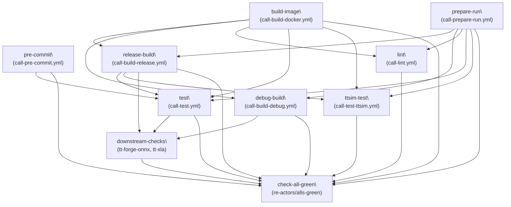
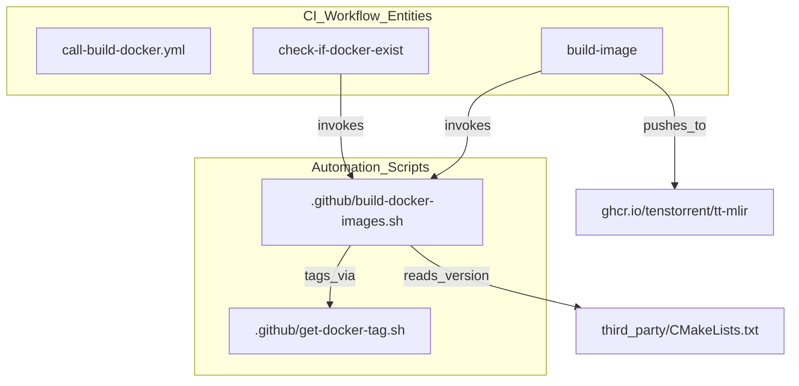
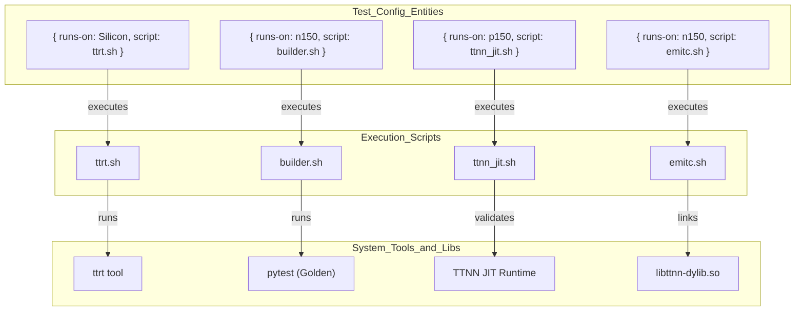

# CI/CD Pipeline and Automation

Relevant source files
*   [.github/CODEOWNERS](https://github.com/tenstorrent/tt-mlir/blob/c7d92e92/.github/CODEOWNERS)
*   [.github/scripts/bash/get_test_summary.sh](https://github.com/tenstorrent/tt-mlir/blob/c7d92e92/.github/scripts/bash/get_test_summary.sh)
*   [.github/scripts/python/dynamic_civ2_offload.md](https://github.com/tenstorrent/tt-mlir/blob/c7d92e92/.github/scripts/python/dynamic_civ2_offload.md?plain=1)
*   [.github/scripts/python/generate_test_matrix.py](https://github.com/tenstorrent/tt-mlir/blob/c7d92e92/.github/scripts/python/generate_test_matrix.py)
*   [.github/scripts/python/get_test_duration_from_junit_xmls.py](https://github.com/tenstorrent/tt-mlir/blob/c7d92e92/.github/scripts/python/get_test_duration_from_junit_xmls.py)
*   [.github/scripts/python/run_tests_from_json.py](https://github.com/tenstorrent/tt-mlir/blob/c7d92e92/.github/scripts/python/run_tests_from_json.py)
*   [.github/settings/tests.json](https://github.com/tenstorrent/tt-mlir/blob/c7d92e92/.github/settings/tests.json)
*   [.github/test_scripts/builder.sh](https://github.com/tenstorrent/tt-mlir/blob/c7d92e92/.github/test_scripts/builder.sh)
*   [.github/test_scripts/chisel.sh](https://github.com/tenstorrent/tt-mlir/blob/c7d92e92/.github/test_scripts/chisel.sh)
*   [.github/test_scripts/emitc.sh](https://github.com/tenstorrent/tt-mlir/blob/c7d92e92/.github/test_scripts/emitc.sh)
*   [.github/test_scripts/pykernel.sh](https://github.com/tenstorrent/tt-mlir/blob/c7d92e92/.github/test_scripts/pykernel.sh)
*   [.github/workflows/call-build-debug.yml](https://github.com/tenstorrent/tt-mlir/blob/c7d92e92/.github/workflows/call-build-debug.yml)
*   [.github/workflows/call-build-docker.yml](https://github.com/tenstorrent/tt-mlir/blob/c7d92e92/.github/workflows/call-build-docker.yml)
*   [.github/workflows/call-build-docs.yml](https://github.com/tenstorrent/tt-mlir/blob/c7d92e92/.github/workflows/call-build-docs.yml)
*   [.github/workflows/call-build-macos.yml](https://github.com/tenstorrent/tt-mlir/blob/c7d92e92/.github/workflows/call-build-macos.yml)
*   [.github/workflows/call-build-release.yml](https://github.com/tenstorrent/tt-mlir/blob/c7d92e92/.github/workflows/call-build-release.yml)
*   [.github/workflows/call-build-wheels.yml](https://github.com/tenstorrent/tt-mlir/blob/c7d92e92/.github/workflows/call-build-wheels.yml)
*   [.github/workflows/call-lint.yml](https://github.com/tenstorrent/tt-mlir/blob/c7d92e92/.github/workflows/call-lint.yml)
*   [.github/workflows/call-pre-commit.yml](https://github.com/tenstorrent/tt-mlir/blob/c7d92e92/.github/workflows/call-pre-commit.yml)
*   [.github/workflows/call-prepare-run.yml](https://github.com/tenstorrent/tt-mlir/blob/c7d92e92/.github/workflows/call-prepare-run.yml)
*   [.github/workflows/call-test.yml](https://github.com/tenstorrent/tt-mlir/blob/c7d92e92/.github/workflows/call-test.yml)
*   [.github/workflows/issue-work-started.yml](https://github.com/tenstorrent/tt-mlir/blob/c7d92e92/.github/workflows/issue-work-started.yml)
*   [.github/workflows/on-pr.yml](https://github.com/tenstorrent/tt-mlir/blob/c7d92e92/.github/workflows/on-pr.yml)
*   [.github/workflows/on-push.yml](https://github.com/tenstorrent/tt-mlir/blob/c7d92e92/.github/workflows/on-push.yml)
*   [.github/workflows/schedule-nightly-model-explorer-uplift.yml](https://github.com/tenstorrent/tt-mlir/blob/c7d92e92/.github/workflows/schedule-nightly-model-explorer-uplift.yml)
*   [.github/workflows/schedule-nightly-uplift.yml](https://github.com/tenstorrent/tt-mlir/blob/c7d92e92/.github/workflows/schedule-nightly-uplift.yml)
*   [.github/workflows/schedule-nightly.yml](https://github.com/tenstorrent/tt-mlir/blob/c7d92e92/.github/workflows/schedule-nightly.yml)
*   [.github/workflows/schedule-update-durations.yml](https://github.com/tenstorrent/tt-mlir/blob/c7d92e92/.github/workflows/schedule-update-durations.yml)
*   [.test_durations/n150.json](https://github.com/tenstorrent/tt-mlir/blob/c7d92e92/.test_durations/n150.json)
*   [.test_durations/n300-llmbox.json](https://github.com/tenstorrent/tt-mlir/blob/c7d92e92/.test_durations/n300-llmbox.json)
*   [.test_durations/n300.json](https://github.com/tenstorrent/tt-mlir/blob/c7d92e92/.test_durations/n300.json)
*   [.test_durations/p150.json](https://github.com/tenstorrent/tt-mlir/blob/c7d92e92/.test_durations/p150.json)
*   [docs/src/ci.md](https://github.com/tenstorrent/tt-mlir/blob/c7d92e92/docs/src/ci.md?plain=1)
*   [docs/src/optimizer.md](https://github.com/tenstorrent/tt-mlir/blob/c7d92e92/docs/src/optimizer.md?plain=1)
*   [docs/src/specs/ttnn-optimizer.md](https://github.com/tenstorrent/tt-mlir/blob/c7d92e92/docs/src/specs/ttnn-optimizer.md?plain=1)
*   [env/install-tt-triage.sh](https://github.com/tenstorrent/tt-mlir/blob/c7d92e92/env/install-tt-triage.sh)
*   [runtime/test/ttnn/python/n150/test_intermediate_tensor_manipulation.py](https://github.com/tenstorrent/tt-mlir/blob/c7d92e92/runtime/test/ttnn/python/n150/test_intermediate_tensor_manipulation.py)
*   [runtime/test/ttnn/python/n300/test_intermediate_tensor_manipulation.py](https://github.com/tenstorrent/tt-mlir/blob/c7d92e92/runtime/test/ttnn/python/n300/test_intermediate_tensor_manipulation.py)
*   [test/python/chisel/conftest.py](https://github.com/tenstorrent/tt-mlir/blob/c7d92e92/test/python/chisel/conftest.py)
*   [test/python/chisel/test_builder_chisel_integration.py](https://github.com/tenstorrent/tt-mlir/blob/c7d92e92/test/python/chisel/test_builder_chisel_integration.py)
*   [test/python/golden/ttir_ops/normalization/test_normalization.py](https://github.com/tenstorrent/tt-mlir/blob/c7d92e92/test/python/golden/ttir_ops/normalization/test_normalization.py)
*   [test/ttmlir/Silicon/TTNN/n300/runtime/linear_replicated.mlir](https://github.com/tenstorrent/tt-mlir/blob/c7d92e92/test/ttmlir/Silicon/TTNN/n300/runtime/linear_replicated.mlir)
*   [tools/CMakeLists.txt](https://github.com/tenstorrent/tt-mlir/blob/c7d92e92/tools/CMakeLists.txt)
*   [tools/chisel/chisel/callbacks.py](https://github.com/tenstorrent/tt-mlir/blob/c7d92e92/tools/chisel/chisel/callbacks.py)
*   [tools/chisel/chisel/context.py](https://github.com/tenstorrent/tt-mlir/blob/c7d92e92/tools/chisel/chisel/context.py)
*   [tools/chisel/chisel/ops.py](https://github.com/tenstorrent/tt-mlir/blob/c7d92e92/tools/chisel/chisel/ops.py)
*   [tools/chisel/chisel/utils.py](https://github.com/tenstorrent/tt-mlir/blob/c7d92e92/tools/chisel/chisel/utils.py)
*   [tools/profiler/CMakeLists.txt](https://github.com/tenstorrent/tt-mlir/blob/c7d92e92/tools/profiler/CMakeLists.txt)
*   [tools/profiler/__init__.py](https://github.com/tenstorrent/tt-mlir/blob/c7d92e92/tools/profiler/__init__.py)
*   [tools/profiler/profiler.py](https://github.com/tenstorrent/tt-mlir/blob/c7d92e92/tools/profiler/profiler.py)

This page documents the GitHub Actions workflows, test matrix configuration, Docker image management, and automation scripts that comprise the `tt-mlir` CI/CD system. This infrastructure handles code quality gates, multi-flavor builds (Release/Debug), nightly uplifts for dependencies, downstream cross-repository testing, and hardware-in-the-loop validation on Tenstorrent silicon.

For information about the test frameworks being exercised by CI (golden tests, OpModel tests, lit tests), see pages [6.1](https://github.com/tenstorrent/tt-mlir/blob/c7d92e92/6.1)[6.2](https://github.com/tenstorrent/tt-mlir/blob/c7d92e92/6.2) and [6.4](https://github.com/tenstorrent/tt-mlir/blob/c7d92e92/6.4) For the `ttrt` tool invoked by CI scripts, see page [8.2](https://github.com/tenstorrent/tt-mlir/blob/c7d92e92/8.2)

* * *

## Workflow Triggers

The CI system is driven by several primary triggers defined in the `.github/workflows` directory:

| Trigger | Workflow File | Description |
| --- | --- | --- |
| Pull request to `main` | `on-pr.yml` | Validation gate for merges. Includes `ttsim-test` and `downstream-checks`. |
| Push to `main` | `on-push.yml` | Post-merge build, test, and automated documentation publishing. |
| Nightly Schedule | `schedule-nightly-uplift.yml` | Automates the uplift of `tt-metal` submodule and Docker images. |
| Manual Dispatch | `on-pr.yml` / `on-push.yml` | Allows manual runs with `metal_override` for testing specific `tt-metal` commits. |
| Issue Activity | `issue-work-started.yml` | Automation for project management (Status field updates). |

Sources: [.github/workflows/on-pr.yml 1-17](https://github.com/tenstorrent/tt-mlir/blob/c7d92e92/.github/workflows/on-pr.yml#L1-L17)[.github/workflows/on-push.yml 1-7](https://github.com/tenstorrent/tt-mlir/blob/c7d92e92/.github/workflows/on-push.yml#L1-L7)[.github/workflows/schedule-nightly-uplift.yml 1-25](https://github.com/tenstorrent/tt-mlir/blob/c7d92e92/.github/workflows/schedule-nightly-uplift.yml#L1-L25)[.github/workflows/issue-work-started.yml 4-27](https://github.com/tenstorrent/tt-mlir/blob/c7d92e92/.github/workflows/issue-work-started.yml#L4-L27)

* * *

## PR Workflow Job Graph

The `on-pr.yml` workflow coordinates a complex dependency graph to ensure environment consistency and hardware availability.

**Job dependency graph for `on-pr.yml`**

Sources: [.github/workflows/on-pr.yml 28-145](https://github.com/tenstorrent/tt-mlir/blob/c7d92e92/.github/workflows/on-pr.yml#L28-L145)

The `downstream-checks` job is specifically triggered when the PR branch is named `uplift`. It uses the GitHub CLI (`gh`) to trigger workflows in `tenstorrent/tt-forge-onnx` and `tenstorrent/tt-xla`, passing the current `tt-mlir` SHA as `mlir_override` to validate cross-repo compatibility.

Sources: [.github/workflows/on-pr.yml 85-125](https://github.com/tenstorrent/tt-mlir/blob/c7d92e92/.github/workflows/on-pr.yml#L85-L125)

* * *




Sources: [.github/workflows/on-pr.yml:28-145]()

The `downstream-checks` job is specifically triggered when the PR branch is named `uplift`. It uses the GitHub CLI (`gh`) to trigger workflows in `tenstorrent/tt-forge-onnx` and `tenstorrent/tt-xla`, passing the current `tt-mlir` SHA as `mlir_override` to validate cross-repo compatibility.

Sources: [.github/workflows/on-pr.yml:85-125]()

---
```
## Docker and Environment Management

The CI environment is containerized using Ubuntu images. The system uses a multi-stage Docker build strategy to separate base dependencies from the CI toolchain.

**Docker Image Hierarchy**

1.   **Base Image**: `Dockerfile.base` contains system libraries and `tt-metal` dependencies.
2.   **CI Image**: `Dockerfile.ci` builds the `tt-mlir` toolchain (LLVM/MLIR) and installs it to `/opt/ttmlir-toolchain`.
3.   **IRD Image**: `Dockerfile.ird` adds development tools (gdb, tmux, vim) for interactive remote development.
4.   **CIBW Image**: `Dockerfile.cibuildwheel` targets `manylinux` for Python wheel distribution.

**Docker Build and Registry Flow**

Sources: [.github/workflows/call-build-docker.yml 28-86](https://github.com/tenstorrent/tt-mlir/blob/c7d92e92/.github/workflows/call-build-docker.yml#L28-L86)[.github/workflows/schedule-nightly-uplift.yml 135-136](https://github.com/tenstorrent/tt-mlir/blob/c7d92e92/.github/workflows/schedule-nightly-uplift.yml#L135-L136)[.github/build-docker-images.sh 15-26](https://github.com/tenstorrent/tt-mlir/blob/c7d92e92/.github/build-docker-images.sh#L15-L26)[.github/Dockerfile.ird 5-58](https://github.com/tenstorrent/tt-mlir/blob/c7d92e92/.github/Dockerfile.ird#L5-L58)

* * *




Sources: [.github/workflows/call-build-docker.yml:28-86](), [.github/workflows/schedule-nightly-uplift.yml:135-136](), [.github/build-docker-images.sh:15-26](), [.github/Dockerfile.ird:5-58]()

---
```
## Build Configuration

### Build Flavors

The `release-build` job creates distinct flavors of the compiler and runtime. These are defined by different Docker images and build flags.

| Flavor | Key Features Enabled |
| --- | --- |
| **speedy** | Optimized for standard CI throughput. Used for `Silicon` run tests, `OpModel` tests, and `EmitC` validation. |
| **tracy** | Includes performance instrumentation (`tracy`), `Explorer` adapter, `PyKernel`, and `TTNN JIT`. |

Sources: [.github/settings/tests.json 3-8](https://github.com/tenstorrent/tt-mlir/blob/c7d92e92/.github/settings/tests.json#L3-L8)[.github/settings/tests.json 20](https://github.com/tenstorrent/tt-mlir/blob/c7d92e92/.github/settings/tests.json#L20-L20)[.github/settings/tests.json 38-42](https://github.com/tenstorrent/tt-mlir/blob/c7d92e92/.github/settings/tests.json#L38-L42)

### Dependency Management (Nightly Uplift)

The `schedule-nightly-uplift.yml` workflow runs daily to keep the `tt-metal` submodule up to date. It performs safety checks to ensure no version downgrades occur and validates that the new commit exists on the `tt-metal` main branch.

If `install_dependencies.sh`, `sfpi-info.sh`, or `ttexalens_ref.txt` change in `tt-metal`, the workflow automatically updates the `TT_METAL_DEPENDENCIES_COMMIT` in `Dockerfile.base` to trigger a fresh image build.

Sources: [.github/workflows/schedule-nightly-uplift.yml 63-110](https://github.com/tenstorrent/tt-mlir/blob/c7d92e92/.github/workflows/schedule-nightly-uplift.yml#L63-L110)[.github/workflows/schedule-nightly-uplift.yml 111-136](https://github.com/tenstorrent/tt-mlir/blob/c7d92e92/.github/workflows/schedule-nightly-uplift.yml#L111-L136)

* * *

## Test Matrix and Job Distribution

### Test Definitions

The test matrix is defined in `.github/settings/tests.json`. This file maps hardware runners (N150, N300, LLMBox, P150) to specific test scripts and arguments. The `generate_test_matrix.py` script unrolls these definitions into a GitHub Actions strategy matrix, optionally applying "CIv2 offload" to move jobs between specific runner types based on availability and time of day.

Sources: [.github/settings/tests.json 1-43](https://github.com/tenstorrent/tt-mlir/blob/c7d92e92/.github/settings/tests.json#L1-L43)[.github/scripts/python/generate_test_matrix.py 22-44](https://github.com/tenstorrent/tt-mlir/blob/c7d92e92/.github/scripts/python/generate_test_matrix.py#L22-L44)[.github/scripts/python/generate_test_matrix.py 47-172](https://github.com/tenstorrent/tt-mlir/blob/c7d92e92/.github/scripts/python/generate_test_matrix.py#L47-L172)

**Mapping Code Entities to CI Test Scripts**

Sources: [.github/settings/tests.json 1-43](https://github.com/tenstorrent/tt-mlir/blob/c7d92e92/.github/settings/tests.json#L1-L43)[.github/test_scripts/builder.sh 12-35](https://github.com/tenstorrent/tt-mlir/blob/c7d92e92/.github/test_scripts/builder.sh#L12-L35)




Sources: [.github/settings/tests.json:1-43](), [.github/test_scripts/builder.sh:12-35]()
```
### Hardware-in-the-Loop Execution

The `call-test.yml` workflow executes the generated matrix on physical Tenstorrent hardware.

1.   **System Descriptor**: Runs `ttrt query --save-artifacts` to generate `system_desc.ttsys`. This is required for device-aware passes to understand the local grid size and core availability.
2.   **Triage**: It downloads `tt-triage.py` from the matching `tt-metal` version to provide automated post-mortem analysis if a test times out.
3.   **Environment Setup**: Configures `LD_LIBRARY_PATH` to include the toolchain and the local `install/lib` directory. It also sets `TT_METAL_RUNTIME_ROOT` and `TT_METAL_HOME`.

Sources: [.github/workflows/call-test.yml 108-116](https://github.com/tenstorrent/tt-mlir/blob/c7d92e92/.github/workflows/call-test.yml#L108-L116)[.github/workflows/call-test.yml 118-139](https://github.com/tenstorrent/tt-mlir/blob/c7d92e92/.github/workflows/call-test.yml#L118-L139)[.github/workflows/call-test.yml 178-181](https://github.com/tenstorrent/tt-mlir/blob/c7d92e92/.github/workflows/call-test.yml#L178-L181)

* * *

## Performance Monitoring and Python Wheels

### Performance Monitoring

Performance tests are handled via the `tracy` build flavor. The `ttrt.sh` script is used with the `perf` argument to execute Silicon tests while collecting telemetry.

*   **TTRT Perf API**: The `Perf` class in `tools/ttrt/common/perf.py` initializes arguments for performance collection, such as `--loops`, `--host-only`, and `--trace-region-size`.
*   **Matrix Config**: Nightly performance runs target specific hardware configurations like `Silicon/TTNN/$RUNS_ON/perf`.

Sources: [.github/settings/tests.json 6-8](https://github.com/tenstorrent/tt-mlir/blob/c7d92e92/.github/settings/tests.json#L6-L8)[.github/workflows/call-test.yml 160-182](https://github.com/tenstorrent/tt-mlir/blob/c7d92e92/.github/workflows/call-test.yml#L160-L182)[tools/ttrt/common/perf.py 22-185](https://github.com/tenstorrent/tt-mlir/blob/c7d92e92/tools/ttrt/common/perf.py#L22-L185)

### Python Wheel Builds

The `tt-mlir` CI builds several Python wheels for distribution:

*   **ttrt**: The runtime execution tool. In CI, the `ttrt` wheel is downloaded and installed via `pip install ttrt*.whl --upgrade` before running tests.
*   **tt_adapter**: Used for `Model Explorer` visualization, installed via `pytest.sh` during explorer tests.
*   **ai_edge_model_explorer**: The core visualization tool.

Sources: [.github/workflows/call-test.yml 93-98](https://github.com/tenstorrent/tt-mlir/blob/c7d92e92/.github/workflows/call-test.yml#L93-L98)[.github/settings/tests.json 20-21](https://github.com/tenstorrent/tt-mlir/blob/c7d92e92/.github/settings/tests.json#L20-L21)

Dismiss
Refresh this wiki

Enter email to refresh
