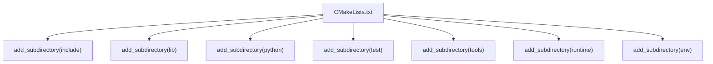
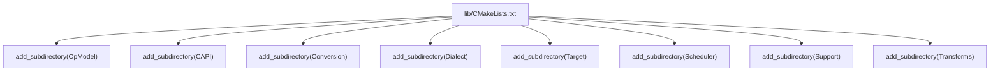
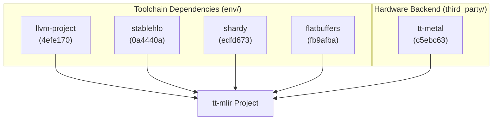
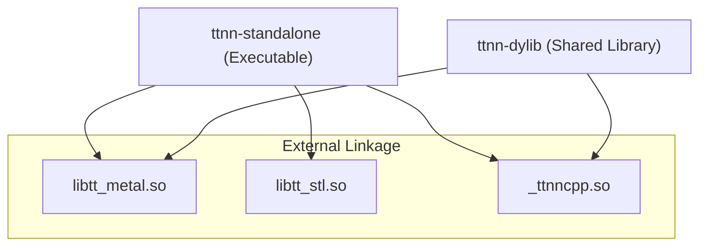

# Build System and Development

Relevant source files
*   [.github/Dockerfile.base](https://github.com/tenstorrent/tt-mlir/blob/c7d92e92/.github/Dockerfile.base)
*   [.gitignore](https://github.com/tenstorrent/tt-mlir/blob/c7d92e92/.gitignore)
*   [CMakeLists.txt](https://github.com/tenstorrent/tt-mlir/blob/c7d92e92/CMakeLists.txt)
*   [docs/src/adding-an-op.md](https://github.com/tenstorrent/tt-mlir/blob/c7d92e92/docs/src/adding-an-op.md?plain=1)
*   [docs/src/ttmlir-translate.md](https://github.com/tenstorrent/tt-mlir/blob/c7d92e92/docs/src/ttmlir-translate.md?plain=1)
*   [env/CMakeLists.txt](https://github.com/tenstorrent/tt-mlir/blob/c7d92e92/env/CMakeLists.txt)
*   [env/activate](https://github.com/tenstorrent/tt-mlir/blob/c7d92e92/env/activate)
*   [env/activate.fish](https://github.com/tenstorrent/tt-mlir/blob/c7d92e92/env/activate.fish)
*   [env/patches/shardy.patch](https://github.com/tenstorrent/tt-mlir/blob/c7d92e92/env/patches/shardy.patch)
*   [include/ttmlir/CMakeLists.txt](https://github.com/tenstorrent/tt-mlir/blob/c7d92e92/include/ttmlir/CMakeLists.txt)
*   [include/ttmlir/Conversion/CMakeLists.txt](https://github.com/tenstorrent/tt-mlir/blob/c7d92e92/include/ttmlir/Conversion/CMakeLists.txt)
*   [include/ttmlir/Conversion/Passes.h](https://github.com/tenstorrent/tt-mlir/blob/c7d92e92/include/ttmlir/Conversion/Passes.h)
*   [include/ttmlir/Conversion/Passes.td](https://github.com/tenstorrent/tt-mlir/blob/c7d92e92/include/ttmlir/Conversion/Passes.td)
*   [include/ttmlir/Conversion/TTNNToEmitC/TTNNToEmitC.h](https://github.com/tenstorrent/tt-mlir/blob/c7d92e92/include/ttmlir/Conversion/TTNNToEmitC/TTNNToEmitC.h)
*   [lib/CMakeLists.txt](https://github.com/tenstorrent/tt-mlir/blob/c7d92e92/lib/CMakeLists.txt)
*   [lib/Conversion/CMakeLists.txt](https://github.com/tenstorrent/tt-mlir/blob/c7d92e92/lib/Conversion/CMakeLists.txt)
*   [lib/Conversion/TTNNToEmitC/CMakeLists.txt](https://github.com/tenstorrent/tt-mlir/blob/c7d92e92/lib/Conversion/TTNNToEmitC/CMakeLists.txt)
*   [lib/Conversion/TTNNToEmitC/TTNNToEmitCPass.cpp](https://github.com/tenstorrent/tt-mlir/blob/c7d92e92/lib/Conversion/TTNNToEmitC/TTNNToEmitCPass.cpp)
*   [lib/Dialect/TTNN/Transforms/TTNNToCpp.cpp](https://github.com/tenstorrent/tt-mlir/blob/c7d92e92/lib/Dialect/TTNN/Transforms/TTNNToCpp.cpp)
*   [lib/RegisterAll.cpp](https://github.com/tenstorrent/tt-mlir/blob/c7d92e92/lib/RegisterAll.cpp)
*   [test/ttmlir/Dialect/StableHLO/shardy/op_propagation_registry/gather_2d_mesh.mlir](https://github.com/tenstorrent/tt-mlir/blob/c7d92e92/test/ttmlir/Dialect/StableHLO/shardy/op_propagation_registry/gather_2d_mesh.mlir)
*   [test/ttmlir/Dialect/TTNN/eltwise/operand_broadcasts.mlir](https://github.com/tenstorrent/tt-mlir/blob/c7d92e92/test/ttmlir/Dialect/TTNN/eltwise/operand_broadcasts.mlir)
*   [third_party/CMakeLists.txt](https://github.com/tenstorrent/tt-mlir/blob/c7d92e92/third_party/CMakeLists.txt)
*   [tools/tt-alchemist/templates/cpp/local/CMakeLists.txt](https://github.com/tenstorrent/tt-mlir/blob/c7d92e92/tools/tt-alchemist/templates/cpp/local/CMakeLists.txt)
*   [tools/ttmlir-opt/CMakeLists.txt](https://github.com/tenstorrent/tt-mlir/blob/c7d92e92/tools/ttmlir-opt/CMakeLists.txt)
*   [tools/ttnn-standalone/CMakeLists.txt](https://github.com/tenstorrent/tt-mlir/blob/c7d92e92/tools/ttnn-standalone/CMakeLists.txt)
*   [tools/ttnn-standalone/README.md](https://github.com/tenstorrent/tt-mlir/blob/c7d92e92/tools/ttnn-standalone/README.md?plain=1)
*   [tools/ttnn-standalone/run](https://github.com/tenstorrent/tt-mlir/blob/c7d92e92/tools/ttnn-standalone/run)
*   [tools/ttnn-standalone/ttnn-standalone.cpp](https://github.com/tenstorrent/tt-mlir/blob/c7d92e92/tools/ttnn-standalone/ttnn-standalone.cpp)

This page covers the CMake-based build system structure, external dependency management, key build-time configuration options, and the general development workflow for contributing to `tt-mlir`. It focuses on how the project is assembled and how to configure it for different use cases.

For details on the environment activation scripts, Docker images, and toolchain setup, see [Development Environment and Docker](https://deepwiki.com/tenstorrent/tt-mlir/7.3-development-environment-and-docker). For Python bindings and the `ttmlir` package structure, see [Python Bindings and APIs](https://deepwiki.com/tenstorrent/tt-mlir/7.2-python-bindings-and-apis). For how `tt-metal` is integrated as an `ExternalProject` dependency, see [Build Configuration and tt-metal Integration](https://deepwiki.com/tenstorrent/tt-mlir/7.1-build-configuration-and-tt-metal-integration). For the CI/CD workflows, see [6.3](https://github.com/tenstorrent/tt-mlir/blob/c7d92e92/6.3)

* * *

## CMake Project Structure

The root `CMakeLists.txt` declares the `tt-mlir` project and sets the default compiler to `clang`/`clang++`[CMakeLists.txt 3-10](https://github.com/tenstorrent/tt-mlir/blob/c7d92e92/CMakeLists.txt#L3-L10) The project utilizes a hierarchical structure where subdirectories are added to organize dialects, conversions, tools, and the runtime.

**Top-Level CMake Directory Structure**

**lib/ Subdirectory Structure**

Sources: [CMakeLists.txt 3-10](https://github.com/tenstorrent/tt-mlir/blob/c7d92e92/CMakeLists.txt#L3-L10)[lib/CMakeLists.txt 9-16](https://github.com/tenstorrent/tt-mlir/blob/c7d92e92/lib/CMakeLists.txt#L9-L16)[env/CMakeLists.txt 1-2](https://github.com/tenstorrent/tt-mlir/blob/c7d92e92/env/CMakeLists.txt#L1-L2)[tools/ttnn-standalone/CMakeLists.txt 1-2](https://github.com/tenstorrent/tt-mlir/blob/c7d92e92/tools/ttnn-standalone/CMakeLists.txt#L1-L2)

* * *




**lib/ Subdirectory Structure**



Sources: [CMakeLists.txt:3-10](), [lib/CMakeLists.txt:9-16](), [env/CMakeLists.txt:1-2](), [tools/ttnn-standalone/CMakeLists.txt:1-2]()

---
```
## Build Configuration Options

Build options are declared to manage optional components and hardware dependencies.

| Option | Purpose |
| --- | --- |
| `TTMLIR_ENABLE_RUNTIME` | Enables the runtime system and hardware integration [CMakeLists.txt 33](https://github.com/tenstorrent/tt-mlir/blob/c7d92e92/CMakeLists.txt#L33-L33)[third_party/CMakeLists.txt 126](https://github.com/tenstorrent/tt-mlir/blob/c7d92e92/third_party/CMakeLists.txt#L126-L126) |
| `TTMLIR_ENABLE_OPMODEL` | Enables OpModel constraint analysis [CMakeLists.txt 40](https://github.com/tenstorrent/tt-mlir/blob/c7d92e92/CMakeLists.txt#L40-L40)[third_party/CMakeLists.txt 126](https://github.com/tenstorrent/tt-mlir/blob/c7d92e92/third_party/CMakeLists.txt#L126-L126) |
| `TTMLIR_BUILD_LLVM` | Controls whether the LLVM/MLIR toolchain is built from source [env/CMakeLists.txt 48](https://github.com/tenstorrent/tt-mlir/blob/c7d92e92/env/CMakeLists.txt#L48-L48) |
| `TTMLIR_ENABLE_STABLEHLO` | Enables StableHLO and Shardy integration [CMakeLists.txt 38](https://github.com/tenstorrent/tt-mlir/blob/c7d92e92/CMakeLists.txt#L38-L38) |
| `CMAKE_BUILD_TYPE` | Sets optimization level (Debug, Release, Asan, MinSizeRel) [third_party/CMakeLists.txt 128-132](https://github.com/tenstorrent/tt-mlir/blob/c7d92e92/third_party/CMakeLists.txt#L128-L132)[env/CMakeLists.txt 8](https://github.com/tenstorrent/tt-mlir/blob/c7d92e92/env/CMakeLists.txt#L8-L8) |

Sources: [CMakeLists.txt 32-50](https://github.com/tenstorrent/tt-mlir/blob/c7d92e92/CMakeLists.txt#L32-L50)[third_party/CMakeLists.txt 126-132](https://github.com/tenstorrent/tt-mlir/blob/c7d92e92/third_party/CMakeLists.txt#L126-L132)[env/CMakeLists.txt 8-48](https://github.com/tenstorrent/tt-mlir/blob/c7d92e92/env/CMakeLists.txt#L8-L48)

* * *

## Required Environment Variables

The build system and development environment rely on several key environment variables established by the activation scripts:

| Variable | Purpose |
| --- | --- |
| `TTMLIR_TOOLCHAIN_DIR` | Points to the pre-built LLVM/MLIR toolchain root [env/activate 3](https://github.com/tenstorrent/tt-mlir/blob/c7d92e92/env/activate#L3-L3) |
| `TTMLIR_VENV_DIR` | Locates the Python virtual environment [env/activate 13](https://github.com/tenstorrent/tt-mlir/blob/c7d92e92/env/activate#L13-L13) |
| `TT_METAL_RUNTIME_ROOT` | Locates the `tt-metal` source tree [env/activate 26](https://github.com/tenstorrent/tt-mlir/blob/c7d92e92/env/activate#L26-L26) |
| `TT_MLIR_HOME` | Root directory of the `tt-mlir` repository [env/activate 29](https://github.com/tenstorrent/tt-mlir/blob/c7d92e92/env/activate#L29-L29) |
| `PYTHONPATH` | Configures Python to find built packages and metal dependencies [env/activate 30-31](https://github.com/tenstorrent/tt-mlir/blob/c7d92e92/env/activate#L30-L31) |

Sources: [env/activate 1-32](https://github.com/tenstorrent/tt-mlir/blob/c7d92e92/env/activate#L1-L32)[CMakeLists.txt 12-14](https://github.com/tenstorrent/tt-mlir/blob/c7d92e92/CMakeLists.txt#L12-L14)

* * *

## External Dependencies

The project manages several large external dependencies via `ExternalProject_Add`. These are pinned to specific commits to ensure stability across the toolchain.

**External Dependency Mapping**

| Dependency | Version (Commit) | Role |
| --- | --- | --- |
| `tt-metal` | `c5ebc63...` | Hardware abstraction and kernel runtime [third_party/CMakeLists.txt 3](https://github.com/tenstorrent/tt-mlir/blob/c7d92e92/third_party/CMakeLists.txt#L3-L3) |
| `llvm-project` | `4efe170...` | Base MLIR/LLVM infrastructure [env/CMakeLists.txt 5](https://github.com/tenstorrent/tt-mlir/blob/c7d92e92/env/CMakeLists.txt#L5-L5) |
| `stablehlo` | `0a4440a...` | Input dialect for ML models [env/CMakeLists.txt 6](https://github.com/tenstorrent/tt-mlir/blob/c7d92e92/env/CMakeLists.txt#L6-L6) |
| `shardy` | `edfd673...` | Sharding and distributed IR [env/CMakeLists.txt 7](https://github.com/tenstorrent/tt-mlir/blob/c7d92e92/env/CMakeLists.txt#L7-L7) |
| `flatbuffers` | `fb9afba...` | Binary serialization format [env/CMakeLists.txt 4](https://github.com/tenstorrent/tt-mlir/blob/c7d92e92/env/CMakeLists.txt#L4-L4) |

Sources: [third_party/CMakeLists.txt 1-3](https://github.com/tenstorrent/tt-mlir/blob/c7d92e92/third_party/CMakeLists.txt#L1-L3)[env/CMakeLists.txt 4-7](https://github.com/tenstorrent/tt-mlir/blob/c7d92e92/env/CMakeLists.txt#L4-L7)

* * *




| Dependency | Version (Commit) | Role |
|---|---|---|
| `tt-metal` | `c5ebc63...` | Hardware abstraction and kernel runtime [third_party/CMakeLists.txt:3]() |
| `llvm-project` | `4efe170...` | Base MLIR/LLVM infrastructure [env/CMakeLists.txt:5]() |
| `stablehlo` | `0a4440a...` | Input dialect for ML models [env/CMakeLists.txt:6]() |
| `shardy` | `edfd673...` | Sharding and distributed IR [env/CMakeLists.txt:7]() |
| `flatbuffers` | `fb9afba...` | Binary serialization format [env/CMakeLists.txt:4]() |

Sources: [third_party/CMakeLists.txt:1-3](), [env/CMakeLists.txt:4-7]()

---
```
## Integrated Tools Build

The project builds several standalone tools and libraries. A key architectural decision is the split between `TTMLIRCompilerStatic` for tools like `ttmlir-opt` and `TTMLIRCompiler` (shared) for JIT and Python frontends [lib/CMakeLists.txt 71-108](https://github.com/tenstorrent/tt-mlir/blob/c7d92e92/lib/CMakeLists.txt#L71-L108)

**Standalone Tool Dependencies**

Sources: [tools/ttnn-standalone/CMakeLists.txt 120-125](https://github.com/tenstorrent/tt-mlir/blob/c7d92e92/tools/ttnn-standalone/CMakeLists.txt#L120-L125)[tools/ttnn-standalone/CMakeLists.txt 161-175](https://github.com/tenstorrent/tt-mlir/blob/c7d92e92/tools/ttnn-standalone/CMakeLists.txt#L161-L175)[lib/CMakeLists.txt 71-113](https://github.com/tenstorrent/tt-mlir/blob/c7d92e92/lib/CMakeLists.txt#L71-L113)

* * *




Sources: [tools/ttnn-standalone/CMakeLists.txt:120-125](), [tools/ttnn-standalone/CMakeLists.txt:161-175](), [lib/CMakeLists.txt:71-113]()

---
```
## Development Workflow: Environment Activation

Development typically starts by sourcing an activation script which sets up the environment and validates the toolchain.

1.   **Activate Environment**: `source env/activate`[env/activate 17](https://github.com/tenstorrent/tt-mlir/blob/c7d92e92/env/activate#L17-L17)
2.   **Initialize Venv**: The activation script checks for a virtual environment and provides warnings if it is missing [env/activate 16-22](https://github.com/tenstorrent/tt-mlir/blob/c7d92e92/env/activate#L16-L22)
3.   **Docker Support**: Base development environments are provided via Dockerfiles to ensure dependency consistency, including `clang-20` and specific `tt-metal` dependencies [.github/Dockerfile.base 44-64](https://github.com/tenstorrent/tt-mlir/blob/c7d92e92/.github/Dockerfile.base#L44-L64)
4.   **Build**: Uses Ninja or CMake to build targets like `ttmlir-opt` or `ttmlir-translate`.

Sources: [env/activate 1-32](https://github.com/tenstorrent/tt-mlir/blob/c7d92e92/env/activate#L1-L32)[.github/Dockerfile.base 1-64](https://github.com/tenstorrent/tt-mlir/blob/c7d92e92/.github/Dockerfile.base#L1-L64)

This wiki is featured in the [repository](https://github.com/tenstorrent/tt-mlir/blob/main/README.md)

Dismiss
Refresh this wiki

Enter email to refresh
