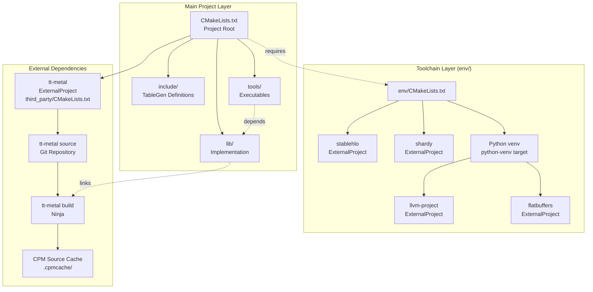
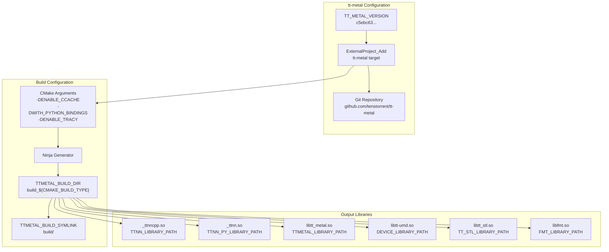

# Build Configuration and tt-metal Integration

Relevant source files
*   [.github/Dockerfile.base](https://github.com/tenstorrent/tt-mlir/blob/c7d92e92/.github/Dockerfile.base)
*   [.gitignore](https://github.com/tenstorrent/tt-mlir/blob/c7d92e92/.gitignore)
*   [CMakeLists.txt](https://github.com/tenstorrent/tt-mlir/blob/c7d92e92/CMakeLists.txt)
*   [docs/src/adding-an-op.md](https://github.com/tenstorrent/tt-mlir/blob/c7d92e92/docs/src/adding-an-op.md?plain=1)
*   [docs/src/ttmlir-translate.md](https://github.com/tenstorrent/tt-mlir/blob/c7d92e92/docs/src/ttmlir-translate.md?plain=1)
*   [env/CMakeLists.txt](https://github.com/tenstorrent/tt-mlir/blob/c7d92e92/env/CMakeLists.txt)
*   [env/activate](https://github.com/tenstorrent/tt-mlir/blob/c7d92e92/env/activate)
*   [env/activate.fish](https://github.com/tenstorrent/tt-mlir/blob/c7d92e92/env/activate.fish)
*   [env/patches/shardy.patch](https://github.com/tenstorrent/tt-mlir/blob/c7d92e92/env/patches/shardy.patch)
*   [include/ttmlir/CMakeLists.txt](https://github.com/tenstorrent/tt-mlir/blob/c7d92e92/include/ttmlir/CMakeLists.txt)
*   [include/ttmlir/Conversion/CMakeLists.txt](https://github.com/tenstorrent/tt-mlir/blob/c7d92e92/include/ttmlir/Conversion/CMakeLists.txt)
*   [include/ttmlir/Conversion/Passes.h](https://github.com/tenstorrent/tt-mlir/blob/c7d92e92/include/ttmlir/Conversion/Passes.h)
*   [include/ttmlir/Conversion/Passes.td](https://github.com/tenstorrent/tt-mlir/blob/c7d92e92/include/ttmlir/Conversion/Passes.td)
*   [include/ttmlir/Conversion/TTKernelToEmitC/TTKernelToEmitC.h](https://github.com/tenstorrent/tt-mlir/blob/c7d92e92/include/ttmlir/Conversion/TTKernelToEmitC/TTKernelToEmitC.h)
*   [include/ttmlir/Conversion/TTNNToEmitC/TTNNToEmitC.h](https://github.com/tenstorrent/tt-mlir/blob/c7d92e92/include/ttmlir/Conversion/TTNNToEmitC/TTNNToEmitC.h)
*   [include/ttmlir/Target/TTKernel/TTKernelToCpp.h](https://github.com/tenstorrent/tt-mlir/blob/c7d92e92/include/ttmlir/Target/TTKernel/TTKernelToCpp.h)
*   [lib/CMakeLists.txt](https://github.com/tenstorrent/tt-mlir/blob/c7d92e92/lib/CMakeLists.txt)
*   [lib/Conversion/CMakeLists.txt](https://github.com/tenstorrent/tt-mlir/blob/c7d92e92/lib/Conversion/CMakeLists.txt)
*   [lib/Conversion/TTKernelToEmitC/CMakeLists.txt](https://github.com/tenstorrent/tt-mlir/blob/c7d92e92/lib/Conversion/TTKernelToEmitC/CMakeLists.txt)
*   [lib/Conversion/TTNNToEmitC/CMakeLists.txt](https://github.com/tenstorrent/tt-mlir/blob/c7d92e92/lib/Conversion/TTNNToEmitC/CMakeLists.txt)
*   [lib/Conversion/TTNNToEmitC/TTNNToEmitCPass.cpp](https://github.com/tenstorrent/tt-mlir/blob/c7d92e92/lib/Conversion/TTNNToEmitC/TTNNToEmitCPass.cpp)
*   [lib/Dialect/TTNN/Pipelines/CMakeLists.txt](https://github.com/tenstorrent/tt-mlir/blob/c7d92e92/lib/Dialect/TTNN/Pipelines/CMakeLists.txt)
*   [lib/Dialect/TTNN/Transforms/TTNNToCpp.cpp](https://github.com/tenstorrent/tt-mlir/blob/c7d92e92/lib/Dialect/TTNN/Transforms/TTNNToCpp.cpp)
*   [lib/RegisterAll.cpp](https://github.com/tenstorrent/tt-mlir/blob/c7d92e92/lib/RegisterAll.cpp)
*   [lib/Scheduler/CMakeLists.txt](https://github.com/tenstorrent/tt-mlir/blob/c7d92e92/lib/Scheduler/CMakeLists.txt)
*   [lib/Target/CMakeLists.txt](https://github.com/tenstorrent/tt-mlir/blob/c7d92e92/lib/Target/CMakeLists.txt)
*   [lib/Target/TTKernel/CMakeLists.txt](https://github.com/tenstorrent/tt-mlir/blob/c7d92e92/lib/Target/TTKernel/CMakeLists.txt)
*   [lib/Target/TTKernel/TTKernelToCppRegistration.cpp](https://github.com/tenstorrent/tt-mlir/blob/c7d92e92/lib/Target/TTKernel/TTKernelToCppRegistration.cpp)
*   [lib/Target/TTMetal/CMakeLists.txt](https://github.com/tenstorrent/tt-mlir/blob/c7d92e92/lib/Target/TTMetal/CMakeLists.txt)
*   [lib/Target/TTNN/CMakeLists.txt](https://github.com/tenstorrent/tt-mlir/blob/c7d92e92/lib/Target/TTNN/CMakeLists.txt)
*   [test/CMakeLists.txt](https://github.com/tenstorrent/tt-mlir/blob/c7d92e92/test/CMakeLists.txt)
*   [test/ttmlir/Dialect/StableHLO/shardy/op_propagation_registry/gather_2d_mesh.mlir](https://github.com/tenstorrent/tt-mlir/blob/c7d92e92/test/ttmlir/Dialect/StableHLO/shardy/op_propagation_registry/gather_2d_mesh.mlir)
*   [test/ttmlir/Dialect/TTNN/eltwise/operand_broadcasts.mlir](https://github.com/tenstorrent/tt-mlir/blob/c7d92e92/test/ttmlir/Dialect/TTNN/eltwise/operand_broadcasts.mlir)
*   [third_party/CMakeLists.txt](https://github.com/tenstorrent/tt-mlir/blob/c7d92e92/third_party/CMakeLists.txt)
*   [tools/tt-alchemist/templates/cpp/local/CMakeLists.txt](https://github.com/tenstorrent/tt-mlir/blob/c7d92e92/tools/tt-alchemist/templates/cpp/local/CMakeLists.txt)
*   [tools/ttmlir-lsp-server/CMakeLists.txt](https://github.com/tenstorrent/tt-mlir/blob/c7d92e92/tools/ttmlir-lsp-server/CMakeLists.txt)
*   [tools/ttmlir-lsp-server/ttmlir-lsp-server.cpp](https://github.com/tenstorrent/tt-mlir/blob/c7d92e92/tools/ttmlir-lsp-server/ttmlir-lsp-server.cpp)
*   [tools/ttmlir-opt/CMakeLists.txt](https://github.com/tenstorrent/tt-mlir/blob/c7d92e92/tools/ttmlir-opt/CMakeLists.txt)
*   [tools/ttmlir-translate/CMakeLists.txt](https://github.com/tenstorrent/tt-mlir/blob/c7d92e92/tools/ttmlir-translate/CMakeLists.txt)
*   [tools/ttmlir-translate/ttmlir-translate.cpp](https://github.com/tenstorrent/tt-mlir/blob/c7d92e92/tools/ttmlir-translate/ttmlir-translate.cpp)
*   [tools/ttnn-standalone/CMakeLists.txt](https://github.com/tenstorrent/tt-mlir/blob/c7d92e92/tools/ttnn-standalone/CMakeLists.txt)
*   [tools/ttnn-standalone/README.md](https://github.com/tenstorrent/tt-mlir/blob/c7d92e92/tools/ttnn-standalone/README.md?plain=1)
*   [tools/ttnn-standalone/run](https://github.com/tenstorrent/tt-mlir/blob/c7d92e92/tools/ttnn-standalone/run)
*   [tools/ttnn-standalone/ttnn-standalone.cpp](https://github.com/tenstorrent/tt-mlir/blob/c7d92e92/tools/ttnn-standalone/ttnn-standalone.cpp)

This page documents the CMake-based build system for `tt-mlir` and the integration of the `tt-metal` library as an external dependency. It covers build configuration options, toolchain setup, and the relationship between different build targets.

## Build System Architecture

The `tt-mlir` build system is organized into several layers: a toolchain layer that provides LLVM/MLIR and other foundational dependencies, the main project layer that builds `tt-mlir` dialects and passes, and integration with `tt-metal` as an external project for runtime support.

**Build System Component Structure**

Sources: [CMakeLists.txt 1-177](https://github.com/tenstorrent/tt-mlir/blob/c7d92e92/CMakeLists.txt#L1-L177)[third_party/CMakeLists.txt 1-157](https://github.com/tenstorrent/tt-mlir/blob/c7d92e92/third_party/CMakeLists.txt#L1-L157)[env/CMakeLists.txt 1-107](https://github.com/tenstorrent/tt-mlir/blob/c7d92e92/env/CMakeLists.txt#L1-L107)




Sources: [CMakeLists.txt:1-177](), [third_party/CMakeLists.txt:1-157](), [env/CMakeLists.txt:1-107]()
```
## Main CMake Configuration

The root `CMakeLists.txt` establishes the project configuration, compiler requirements, and build options. The build system requires environment activation before configuration via the `env/activate` script [[CMakeLists.txt:12-14]](https://deepwiki.com/tenstorrent/tt-mlir/7.1-build-configuration-and-tt-metal-integration).

**Key Configuration Requirements:**

| Requirement | Check Location | Purpose |
| --- | --- | --- |
| Environment Activation | `TTMLIR_ENV_ACTIVATED` | Ensures toolchain is available [[CMakeLists.txt:12-14]](https://deepwiki.com/tenstorrent/tt-mlir/7.1-build-configuration-and-tt-metal-integration) |
| Toolchain Directory | `TTMLIR_TOOLCHAIN_DIR` | Path to LLVM/MLIR installation [[CMakeLists.txt:99-101]](https://deepwiki.com/tenstorrent/tt-mlir/7.1-build-configuration-and-tt-metal-integration) |
| Clang Compiler | `CMAKE_C_COMPILER`, `CMAKE_CXX_COMPILER` | Default to clang/clang++ [[CMakeLists.txt:3-8]](https://deepwiki.com/tenstorrent/tt-mlir/7.1-build-configuration-and-tt-metal-integration) |
| C++ Standard | `CMAKE_CXX_STANDARD` | Set to C++17 [[CMakeLists.txt:83]](https://deepwiki.com/tenstorrent/tt-mlir/7.1-build-configuration-and-tt-metal-integration) |
| Python Executable | `Python3_EXECUTABLE` | Uses venv python [[CMakeLists.txt:136]](https://deepwiki.com/tenstorrent/tt-mlir/7.1-build-configuration-and-tt-metal-integration) |

Sources: [CMakeLists.txt 1-167](https://github.com/tenstorrent/tt-mlir/blob/c7d92e92/CMakeLists.txt#L1-L167)[env/activate 1-32](https://github.com/tenstorrent/tt-mlir/blob/c7d92e92/env/activate#L1-L32)

## Build Options and Feature Flags

The build system provides numerous options to control which components are built and which features are enabled.

**Primary Build Options:**

| Option | Default | Description |
| --- | --- | --- |
| `TTMLIR_ENABLE_RUNTIME` | OFF | Enable runtime system for executing compiled programs [[CMakeLists.txt:33]](https://deepwiki.com/tenstorrent/tt-mlir/7.1-build-configuration-and-tt-metal-integration) |
| `TTMLIR_ENABLE_OPMODEL` | OFF | Enable OpModel constraint and runtime query system [[CMakeLists.txt:40]](https://deepwiki.com/tenstorrent/tt-mlir/7.1-build-configuration-and-tt-metal-integration) |
| `TTMLIR_ENABLE_STABLEHLO` | OFF | Enable StableHLO dialect support [[CMakeLists.txt:38]](https://deepwiki.com/tenstorrent/tt-mlir/7.1-build-configuration-and-tt-metal-integration) |
| `TTMLIR_ENABLE_TTRT` | ON | Enable ttrt runtime execution tool [[CMakeLists.txt:37]](https://deepwiki.com/tenstorrent/tt-mlir/7.1-build-configuration-and-tt-metal-integration) |
| `TTMLIR_ENABLE_TOOLS` | ON | Build ttmlir-opt, ttmlir-translate, ttnn-standalone [[CMakeLists.txt:46]](https://deepwiki.com/tenstorrent/tt-mlir/7.1-build-configuration-and-tt-metal-integration) |
| `TTMLIR_ENABLE_TESTS` | ON | Enable build of all tests [[CMakeLists.txt:45]](https://deepwiki.com/tenstorrent/tt-mlir/7.1-build-configuration-and-tt-metal-integration) |
| `TTMLIR_ENABLE_SHARED_LIB` | ON | Build shared library targets [[CMakeLists.txt:43]](https://deepwiki.com/tenstorrent/tt-mlir/7.1-build-configuration-and-tt-metal-integration) |
| `TTMLIR_ENABLE_EXPLORER` | ON | Enable model explorer visualization tool [[CMakeLists.txt:44]](https://deepwiki.com/tenstorrent/tt-mlir/7.1-build-configuration-and-tt-metal-integration) |

**Runtime Feature Options:**

| Option | Default | Dependency | Description |
| --- | --- | --- | --- |
| `TT_RUNTIME_ENABLE_TTNN` | ON | `TTMLIR_ENABLE_RUNTIME` | Enable TTNN runtime backend [[CMakeLists.txt:53]](https://deepwiki.com/tenstorrent/tt-mlir/7.1-build-configuration-and-tt-metal-integration) |
| `TT_RUNTIME_ENABLE_TTMETAL` | ON | `TTMLIR_ENABLE_RUNTIME` | Enable TTMetal runtime backend [[CMakeLists.txt:54]](https://deepwiki.com/tenstorrent/tt-mlir/7.1-build-configuration-and-tt-metal-integration) |
| `TT_RUNTIME_ENABLE_DISTRIBUTED` | ON | `TTMLIR_ENABLE_RUNTIME` | Enable distributed runtime support [[CMakeLists.txt:55]](https://deepwiki.com/tenstorrent/tt-mlir/7.1-build-configuration-and-tt-metal-integration) |
| `TT_RUNTIME_ENABLE_PERF_TRACE` | OFF | - | Enable Tracy performance tracing [[CMakeLists.txt:32]](https://deepwiki.com/tenstorrent/tt-mlir/7.1-build-configuration-and-tt-metal-integration) |
| `TT_RUNTIME_DEBUG` | OFF | - | Enable runtime debug tools [[CMakeLists.txt:62]](https://deepwiki.com/tenstorrent/tt-mlir/7.1-build-configuration-and-tt-metal-integration) |

Sources: [CMakeLists.txt 32-65](https://github.com/tenstorrent/tt-mlir/blob/c7d92e92/CMakeLists.txt#L32-L65)

## tt-metal External Project Integration

The `tt-metal` library is integrated as a CMake `ExternalProject`, providing the hardware abstraction layer and device runtime libraries. This integration is managed in `third_party/CMakeLists.txt`.

**tt-metal Integration Architecture**

Sources: [third_party/CMakeLists.txt 1-157](https://github.com/tenstorrent/tt-mlir/blob/c7d92e92/third_party/CMakeLists.txt#L1-L157)

**Version Pinning:** The `tt-metal` version is pinned to a specific git commit to ensure reproducible builds:

Sources: [third_party/CMakeLists.txt 3](https://github.com/tenstorrent/tt-mlir/blob/c7d92e92/third_party/CMakeLists.txt#L3-L3)

**User-Managed Source Override:** Developers can provide a path to a local `tt-metal` checkout via `TTMLIR_TTMETAL_SOURCE_DIR`. If set, the build system creates a symbolic link at `third_party/tt-metal/src/tt-metal` pointing to the override directory [[third_party/CMakeLists.txt:5-35]](https://deepwiki.com/tenstorrent/tt-mlir/7.1-build-configuration-and-tt-metal-integration).

**Build Directory Structure:** The build creates separate directories per build type and maintains a symbolic link for convenience:

*   Build directory: `third_party/tt-metal/src/tt-metal/build_${CMAKE_BUILD_TYPE}`[[third_party/CMakeLists.txt:51]](https://deepwiki.com/tenstorrent/tt-mlir/7.1-build-configuration-and-tt-metal-integration)
*   Symbolic link: `third_party/tt-metal/src/tt-metal/build`[[third_party/CMakeLists.txt:52]](https://deepwiki.com/tenstorrent/tt-mlir/7.1-build-configuration-and-tt-metal-integration)
*   Library directory: `${TTMETAL_BUILD_DIR}/${CMAKE_INSTALL_LIBDIR}`[[third_party/CMakeLists.txt:56]](https://deepwiki.com/tenstorrent/tt-mlir/7.1-build-configuration-and-tt-metal-integration)

**CMake Arguments Passed to tt-metal:** The `ExternalProject_Add` call for `tt-metal` forwards critical configuration flags including build type, compilers, and feature toggles like distributed support and performance tracing [[third_party/CMakeLists.txt:157-174]](https://deepwiki.com/tenstorrent/tt-mlir/7.1-build-configuration-and-tt-metal-integration).




Sources: [third_party/CMakeLists.txt:1-157]()

**Version Pinning:**
The `tt-metal` version is pinned to a specific git commit to ensure reproducible builds:
```cmake
set(TT_METAL_VERSION "c5ebc6351098dfb68ce913eedcc20ee5abd1509f")
```
Sources: [third_party/CMakeLists.txt:3]()

**User-Managed Source Override:**
Developers can provide a path to a local `tt-metal` checkout via `TTMLIR_TTMETAL_SOURCE_DIR`. If set, the build system creates a symbolic link at `third_party/tt-metal/src/tt-metal` pointing to the override directory [[third_party/CMakeLists.txt:5-35]]().

**Build Directory Structure:**
The build creates separate directories per build type and maintains a symbolic link for convenience:
- Build directory: `third_party/tt-metal/src/tt-metal/build_${CMAKE_BUILD_TYPE}` [[third_party/CMakeLists.txt:51]]()
- Symbolic link: `third_party/tt-metal/src/tt-metal/build` [[third_party/CMakeLists.txt:52]]()
- Library directory: `${TTMETAL_BUILD_DIR}/${CMAKE_INSTALL_LIBDIR}` [[third_party/CMakeLists.txt:56]]()

**CMake Arguments Passed to tt-metal:**
The `ExternalProject_Add` call for `tt-metal` forwards critical configuration flags including build type, compilers, and feature toggles like distributed support and performance tracing [[third_party/CMakeLists.txt:157-174]]().
```
## CPM Source Cache Configuration

Both `tt-metal` and its dependencies use CPM (CMake Package Manager) for dependency management. The cache location can be configured via environment variable `CPM_SOURCE_CACHE`. If not defined, it defaults to a local path within the `tt-metal` source tree [[third_party/CMakeLists.txt:44-48]](https://deepwiki.com/tenstorrent/tt-mlir/7.1-build-configuration-and-tt-metal-integration).

The cache contains critical dependencies such as:

*   `reflect/`, `nanomsg/`, `fmt/`[[third_party/CMakeLists.txt:80-82]](https://deepwiki.com/tenstorrent/tt-mlir/7.1-build-configuration-and-tt-metal-integration)
*   `spdlog/`, `nlohmann_json/`, `boost/`[[third_party/CMakeLists.txt:84-86]](https://deepwiki.com/tenstorrent/tt-mlir/7.1-build-configuration-and-tt-metal-integration)
*   `xtl/`, `xtensor/`, `xtensor-blas/`[[third_party/CMakeLists.txt:88-90]](https://deepwiki.com/tenstorrent/tt-mlir/7.1-build-configuration-and-tt-metal-integration)

## Include Path Configuration

The build system configures extensive include paths to make `tt-metal` headers available to `tt-mlir` components. This includes paths for `ttnn`, `tt_metal`, `tt_stl`, and various third-party dependencies managed by CPM [[third_party/CMakeLists.txt:62-92]](https://deepwiki.com/tenstorrent/tt-mlir/7.1-build-configuration-and-tt-metal-integration).

## Shared Library Targets

The project produces two primary compiler library targets:

1.   **`TTMLIRCompilerStatic`**: A static library used for building command-line tools like `ttmlir-opt` and `ttmlir-translate`. It links all dialect and conversion libraries [[lib/CMakeLists.txt:71-82]](https://deepwiki.com/tenstorrent/tt-mlir/7.1-build-configuration-and-tt-metal-integration).
2.   **`TTMLIRCompiler`**: A shared library (`.so`) designed for compiler frontends and JIT environments. It uses `--whole-archive` (or `-all_load` on Apple) to ensure all symbols are exported for runtime lookup [[lib/CMakeLists.txt:94-113]](https://deepwiki.com/tenstorrent/tt-mlir/7.1-build-configuration-and-tt-metal-integration).

**Library RPATH Configuration:** The `TTMLIRCompiler` shared library is configured with a build-time `RPATH` to correctly locate `tt-metal` libraries within the project structure:

Sources: [lib/CMakeLists.txt 96-100](https://github.com/tenstorrent/tt-mlir/blob/c7d92e92/lib/CMakeLists.txt#L96-L100)

## Standalone Tool Configuration

The `ttnn-standalone` tool demonstrates how external projects can link against `tt-metal` libraries independently.

**Environment Requirements:**

*   `TT_METAL_RUNTIME_ROOT`: Path to the `tt-metal` root source directory [[tools/ttnn-standalone/CMakeLists.txt:58-64]](https://deepwiki.com/tenstorrent/tt-mlir/7.1-build-configuration-and-tt-metal-integration).
*   `TT_METAL_LIB`: Optional path to pre-built `tt-metal` libraries [[tools/ttnn-standalone/CMakeLists.txt:65-69]](https://deepwiki.com/tenstorrent/tt-mlir/7.1-build-configuration-and-tt-metal-integration).

**RPATH Configuration:** The standalone tool sets `RPATH` to find libraries at runtime:

Sources: [tools/ttnn-standalone/CMakeLists.txt 141-142](https://github.com/tenstorrent/tt-mlir/blob/c7d92e92/tools/ttnn-standalone/CMakeLists.txt#L141-L142)

## Linker Configuration

The build system attempts to use `lld` (LLVM linker) when available for faster linking, specifically looking for `ld.lld` matching the major version of the Clang compiler [[CMakeLists.txt:111-127]](https://deepwiki.com/tenstorrent/tt-mlir/7.1-build-configuration-and-tt-metal-integration).

## Docker Infrastructure

The build environment is containerized to ensure consistency across CI and developer environments.

**Dockerfile.base:** This base image sets up the fundamental system requirements:

*   Ubuntu 24.04 as the base OS [[.github/Dockerfile.base:1]](https://deepwiki.com/tenstorrent/tt-mlir/7.1-build-configuration-and-tt-metal-integration).
*   System packages: `build-essential`, `ninja-build`, `cmake`, `ccache`, `libhwloc-dev`, `libtbb-dev`[[.github/Dockerfile.base:14-38]](https://deepwiki.com/tenstorrent/tt-mlir/7.1-build-configuration-and-tt-metal-integration).
*   Python 3.12 and development headers [[.github/Dockerfile.base:41]](https://deepwiki.com/tenstorrent/tt-mlir/7.1-build-configuration-and-tt-metal-integration).
*   Clang 20 installation and symlinking [[.github/Dockerfile.base:54-64]](https://deepwiki.com/tenstorrent/tt-mlir/7.1-build-configuration-and-tt-metal-integration).
*   Integration of `tt-metal` dependencies via its `install_dependencies.sh`[[.github/Dockerfile.base:44-46]](https://deepwiki.com/tenstorrent/tt-mlir/7.1-build-configuration-and-tt-metal-integration).

Sources: [.github/Dockerfile.base 1-79](https://github.com/tenstorrent/tt-mlir/blob/c7d92e92/.github/Dockerfile.base#L1-L79)

## Core MLIR Tools Build

The compiler infrastructure relies on `ttmlir-opt` and `ttmlir-translate` to drive transformations and code generation.

**Tools Build Registry** The `ttmlir-opt` tool registers all custom dialects and passes alongside standard MLIR components. Dialects such as `TTIRDialect`, `TTNNDialect`, `D2MDialect`, and `SFPIDialect` are added to the registry [[lib/RegisterAll.cpp:87-102]](https://deepwiki.com/tenstorrent/tt-mlir/7.1-build-configuration-and-tt-metal-integration).

**Translation Tools** The `ttmlir-translate` tool handles conversion between MLIR and other formats (like Flatbuffers or C++ code). It links against `TTMLIRCompilerStatic` to access all registered translations [[tools/ttmlir-translate/CMakeLists.txt:1-12]](https://deepwiki.com/tenstorrent/tt-mlir/7.1-build-configuration-and-tt-metal-integration).

Sources: [lib/RegisterAll.cpp 87-145](https://github.com/tenstorrent/tt-mlir/blob/c7d92e92/lib/RegisterAll.cpp#L87-L145)[tools/ttmlir-opt/CMakeLists.txt 1-10](https://github.com/tenstorrent/tt-mlir/blob/c7d92e92/tools/ttmlir-opt/CMakeLists.txt#L1-L10)[tools/ttmlir-translate/CMakeLists.txt 1-12](https://github.com/tenstorrent/tt-mlir/blob/c7d92e92/tools/ttmlir-translate/CMakeLists.txt#L1-L12)

Dismiss
Refresh this wiki

Enter email to refresh
