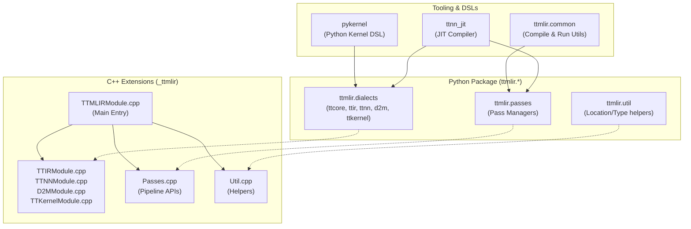
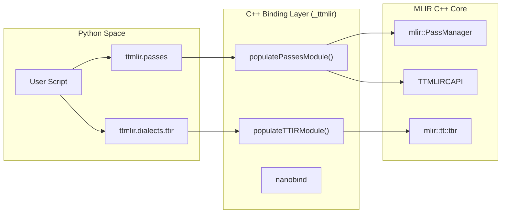

# Python Bindings and APIs

Relevant source files
*   [.claude/skills/add-op/references/ttnn_type_mapping.md](https://github.com/tenstorrent/tt-mlir/blob/c7d92e92/.claude/skills/add-op/references/ttnn_type_mapping.md?plain=1)
*   [CONTRIBUTING.md](https://github.com/tenstorrent/tt-mlir/blob/c7d92e92/CONTRIBUTING.md?plain=1)
*   [docs/src/coding-guidelines.md](https://github.com/tenstorrent/tt-mlir/blob/c7d92e92/docs/src/coding-guidelines.md?plain=1)
*   [docs/src/op-by-op-workflows.md](https://github.com/tenstorrent/tt-mlir/blob/c7d92e92/docs/src/op-by-op-workflows.md?plain=1)
*   [docs/src/pykernel.md](https://github.com/tenstorrent/tt-mlir/blob/c7d92e92/docs/src/pykernel.md?plain=1)
*   [include/ttmlir-c/Dialects.h](https://github.com/tenstorrent/tt-mlir/blob/c7d92e92/include/ttmlir-c/Dialects.h)
*   [include/ttmlir-c/TTAttrs.h](https://github.com/tenstorrent/tt-mlir/blob/c7d92e92/include/ttmlir-c/TTAttrs.h)
*   [include/ttmlir/Bindings/Python/TTMLIRModule.h](https://github.com/tenstorrent/tt-mlir/blob/c7d92e92/include/ttmlir/Bindings/Python/TTMLIRModule.h)
*   [include/ttmlir/Dialect/SFPI/IR/SFPIOpsTypes.td](https://github.com/tenstorrent/tt-mlir/blob/c7d92e92/include/ttmlir/Dialect/SFPI/IR/SFPIOpsTypes.td)
*   [include/ttmlir/Dialect/TTCore/IR/TTCoreOpsEnums.td](https://github.com/tenstorrent/tt-mlir/blob/c7d92e92/include/ttmlir/Dialect/TTCore/IR/TTCoreOpsEnums.td)
*   [include/ttmlir/Dialect/TTCore/IR/TTCoreOpsTypes.td](https://github.com/tenstorrent/tt-mlir/blob/c7d92e92/include/ttmlir/Dialect/TTCore/IR/TTCoreOpsTypes.td)
*   [include/ttmlir/Dialect/TTCore/Transforms/Passes.td](https://github.com/tenstorrent/tt-mlir/blob/c7d92e92/include/ttmlir/Dialect/TTCore/Transforms/Passes.td)
*   [include/ttmlir/Target/Common/types.fbs](https://github.com/tenstorrent/tt-mlir/blob/c7d92e92/include/ttmlir/Target/Common/types.fbs)
*   [include/ttmlir/Target/TTMetal/TTMetalToFlatbuffer.h](https://github.com/tenstorrent/tt-mlir/blob/c7d92e92/include/ttmlir/Target/TTMetal/TTMetalToFlatbuffer.h)
*   [include/ttmlir/Target/Utils/MLIRToFlatbuffer.h](https://github.com/tenstorrent/tt-mlir/blob/c7d92e92/include/ttmlir/Target/Utils/MLIRToFlatbuffer.h)
*   [lib/CAPI/CMakeLists.txt](https://github.com/tenstorrent/tt-mlir/blob/c7d92e92/lib/CAPI/CMakeLists.txt)
*   [lib/CAPI/Dialects.cpp](https://github.com/tenstorrent/tt-mlir/blob/c7d92e92/lib/CAPI/Dialects.cpp)
*   [lib/CAPI/TTCoreAttrs.cpp](https://github.com/tenstorrent/tt-mlir/blob/c7d92e92/lib/CAPI/TTCoreAttrs.cpp)
*   [lib/Dialect/TTCore/IR/TTCoreOpsTypes.cpp](https://github.com/tenstorrent/tt-mlir/blob/c7d92e92/lib/Dialect/TTCore/IR/TTCoreOpsTypes.cpp)
*   [lib/Target/TTMetal/TTMetalToFlatbufferRegistration.cpp](https://github.com/tenstorrent/tt-mlir/blob/c7d92e92/lib/Target/TTMetal/TTMetalToFlatbufferRegistration.cpp)
*   [python/CMakeLists.txt](https://github.com/tenstorrent/tt-mlir/blob/c7d92e92/python/CMakeLists.txt)
*   [python/Passes.cpp](https://github.com/tenstorrent/tt-mlir/blob/c7d92e92/python/Passes.cpp)
*   [python/TTIRModule.cpp](https://github.com/tenstorrent/tt-mlir/blob/c7d92e92/python/TTIRModule.cpp)
*   [python/TTMLIRModule.cpp](https://github.com/tenstorrent/tt-mlir/blob/c7d92e92/python/TTMLIRModule.cpp)
*   [python/TTModule.cpp](https://github.com/tenstorrent/tt-mlir/blob/c7d92e92/python/TTModule.cpp)
*   [python/Util.cpp](https://github.com/tenstorrent/tt-mlir/blob/c7d92e92/python/Util.cpp)
*   [python/pyproject.toml](https://github.com/tenstorrent/tt-mlir/blob/c7d92e92/python/pyproject.toml)
*   [python/setup.py](https://github.com/tenstorrent/tt-mlir/blob/c7d92e92/python/setup.py)
*   [python/ttmlir/dialects/ttir.py](https://github.com/tenstorrent/tt-mlir/blob/c7d92e92/python/ttmlir/dialects/ttir.py)
*   [python/ttmlir/dialects/ttkernel.py](https://github.com/tenstorrent/tt-mlir/blob/c7d92e92/python/ttmlir/dialects/ttkernel.py)
*   [runtime/lib/common/system_desc.cpp](https://github.com/tenstorrent/tt-mlir/blob/c7d92e92/runtime/lib/common/system_desc.cpp)
*   [runtime/lib/ttnn/operations/deletion/deallocate.cpp](https://github.com/tenstorrent/tt-mlir/blob/c7d92e92/runtime/lib/ttnn/operations/deletion/deallocate.cpp)
*   [runtime/python/CMakeLists.txt](https://github.com/tenstorrent/tt-mlir/blob/c7d92e92/runtime/python/CMakeLists.txt)
*   [test/pykernel/demo/dprint_demo.py](https://github.com/tenstorrent/tt-mlir/blob/c7d92e92/test/pykernel/demo/dprint_demo.py)
*   [test/pykernel/demo/test.py](https://github.com/tenstorrent/tt-mlir/blob/c7d92e92/test/pykernel/demo/test.py)
*   [test/ttmlir/Translate/TTKernel/ttkernel_dprint.mlir](https://github.com/tenstorrent/tt-mlir/blob/c7d92e92/test/ttmlir/Translate/TTKernel/ttkernel_dprint.mlir)
*   [test/unittests/lib/CMakeLists.txt](https://github.com/tenstorrent/tt-mlir/blob/c7d92e92/test/unittests/lib/CMakeLists.txt)
*   [tools/op-by-op-infra/README.md](https://github.com/tenstorrent/tt-mlir/blob/c7d92e92/tools/op-by-op-infra/README.md?plain=1)
*   [tools/pykernel/CMakeLists.txt](https://github.com/tenstorrent/tt-mlir/blob/c7d92e92/tools/pykernel/CMakeLists.txt)
*   [tools/pykernel/__init__.py](https://github.com/tenstorrent/tt-mlir/blob/c7d92e92/tools/pykernel/__init__.py)
*   [tools/pykernel/_src/__init__.py](https://github.com/tenstorrent/tt-mlir/blob/c7d92e92/tools/pykernel/_src/__init__.py)
*   [tools/pykernel/pyproject.toml](https://github.com/tenstorrent/tt-mlir/blob/c7d92e92/tools/pykernel/pyproject.toml)
*   [tools/pykernel/setup.py](https://github.com/tenstorrent/tt-mlir/blob/c7d92e92/tools/pykernel/setup.py)
*   [tools/scripts/d2m-discover.py](https://github.com/tenstorrent/tt-mlir/blob/c7d92e92/tools/scripts/d2m-discover.py)
*   [tools/scripts/parted.py](https://github.com/tenstorrent/tt-mlir/blob/c7d92e92/tools/scripts/parted.py)
*   [tools/ttnn-jit/csrc/CMakeLists.txt](https://github.com/tenstorrent/tt-mlir/blob/c7d92e92/tools/ttnn-jit/csrc/CMakeLists.txt)
*   [tools/ttnn-jit/csrc/__init__.cpp](https://github.com/tenstorrent/tt-mlir/blob/c7d92e92/tools/ttnn-jit/csrc/__init__.cpp)
*   [tools/ttnn-jit/csrc/include/jit_cache.h](https://github.com/tenstorrent/tt-mlir/blob/c7d92e92/tools/ttnn-jit/csrc/include/jit_cache.h)
*   [tools/ttnn-jit/csrc/lib/jit_cache.cpp](https://github.com/tenstorrent/tt-mlir/blob/c7d92e92/tools/ttnn-jit/csrc/lib/jit_cache.cpp)

This document describes the Python bindings and APIs provided by `tt-mlir` for programmatic construction of MLIR modules, execution of compilation pipelines, and validation of results. The Python layer consists of low-level `nanobind` bindings exposing MLIR C++ types and operations, C API wrappers, and specialized Python emitters.

## Module Structure

The Python API is organized into several key modules that provide different levels of abstraction. The core bindings are housed in the `ttmlir` namespace, which vendors its own MLIR instance [python/CMakeLists.txt 12-13](https://github.com/tenstorrent/tt-mlir/blob/c7d92e92/python/CMakeLists.txt#L12-L13)

### Component Architecture

The following diagram bridges the Python package structure to the underlying C++ implementation files.

**Key Python Components:**

| Component | Purpose |
| --- | --- |
| `_ttmlir` | The primary C++ extension module compiled with `nanobind`[python/CMakeLists.txt 140-142](https://github.com/tenstorrent/tt-mlir/blob/c7d92e92/python/CMakeLists.txt#L140-L142) |
| `ttmlir.dialects` | Python bindings for Tenstorrent-specific dialects (TTCore, TTIR, TTNN, D2M, TTKernel) [python/CMakeLists.txt 26-79](https://github.com/tenstorrent/tt-mlir/blob/c7d92e92/python/CMakeLists.txt#L26-L79) |
| `ttmlir.passes` | Interface to register and run compiler pipelines like `ttir-to-ttnn-runtime-pipeline`[python/Passes.cpp 102-129](https://github.com/tenstorrent/tt-mlir/blob/c7d92e92/python/Passes.cpp#L102-L129) |
| `ttmlir.common` | Utility scripts for internal compilation and execution flows like `compile_and_run.py`[python/CMakeLists.txt 191-199](https://github.com/tenstorrent/tt-mlir/blob/c7d92e92/python/CMakeLists.txt#L191-L199) |

Sources: [python/CMakeLists.txt 1-204](https://github.com/tenstorrent/tt-mlir/blob/c7d92e92/python/CMakeLists.txt#L1-L204)[python/TTMLIRModule.cpp 84-104](https://github.com/tenstorrent/tt-mlir/blob/c7d92e92/python/TTMLIRModule.cpp#L84-L104)




**Key Python Components:**

| Component | Purpose |
|------------|---------|
| `_ttmlir` | The primary C++ extension module compiled with `nanobind` [python/CMakeLists.txt:140-142](). |
| `ttmlir.dialects` | Python bindings for Tenstorrent-specific dialects (TTCore, TTIR, TTNN, D2M, TTKernel) [python/CMakeLists.txt:26-79](). |
| `ttmlir.passes` | Interface to register and run compiler pipelines like `ttir-to-ttnn-runtime-pipeline` [python/Passes.cpp:102-129](). |
| `ttmlir.common` | Utility scripts for internal compilation and execution flows like `compile_and_run.py` [python/CMakeLists.txt:191-199](). |

Sources: [python/CMakeLists.txt:1-204](), [python/TTMLIRModule.cpp:84-104]()
```
## C++ Python Bindings (nanobind)

The bindings use `nanobind` to expose MLIR C++ classes to Python. This includes custom Tenstorrent attributes, types, and the ability to run pass managers.

### Binding Data Flow

The `TTMLIRModule.cpp` file serves as the initialization point for the `_ttmlir` module, sub-dividing it into several submodules for dialects and passes [python/TTMLIRModule.cpp 21-104](https://github.com/tenstorrent/tt-mlir/blob/c7d92e92/python/TTMLIRModule.cpp#L21-L104)



### Dialect Registration

The bindings provide `register_dialects` and `register_dialect` functions to initialize the MLIR context with Tenstorrent dialects and extensions [python/TTMLIRModule.cpp 50-82](https://github.com/tenstorrent/tt-mlir/blob/c7d92e92/python/TTMLIRModule.cpp#L50-L82) This ensures that when a `MlirContext` is created in Python, it recognizes `ttir`, `ttnn`, and other custom dialects.

### Pass and Pipeline Bindings

The `Passes.cpp` file exposes high-level compilation pipelines to Python. These functions wrap the C++ `PassManager` and apply pre-defined pipeline configurations:

*   `tt_populate_argument_types`: Adds the `tt-populate-argument-types` pass [python/Passes.cpp 45-69](https://github.com/tenstorrent/tt-mlir/blob/c7d92e92/python/Passes.cpp#L45-L69)
*   `stablehlo_pipeline`: Runs the `stablehlo-pipeline` for frontend lowering [python/Passes.cpp 71-99](https://github.com/tenstorrent/tt-mlir/blob/c7d92e92/python/Passes.cpp#L71-L99)
*   `ttir_to_ttnn_runtime_pipeline`: Executes the main TTNN backend flow [python/Passes.cpp 101-129](https://github.com/tenstorrent/tt-mlir/blob/c7d92e92/python/Passes.cpp#L101-L129)
*   `ttir_to_ttmetal_backend_pipeline`: Executes the TTMetal backend flow via D2M [python/Passes.cpp 131-156](https://github.com/tenstorrent/tt-mlir/blob/c7d92e92/python/Passes.cpp#L131-L156)
*   `ttnn_to_ttmetal_pipeline`: A hybrid pipeline that converts TTNN to TTIR before lowering to TTMetal [python/Passes.cpp 158-185](https://github.com/tenstorrent/tt-mlir/blob/c7d92e92/python/Passes.cpp#L158-L185)

Sources: [python/TTMLIRModule.cpp 21-104](https://github.com/tenstorrent/tt-mlir/blob/c7d92e92/python/TTMLIRModule.cpp#L21-L104)[python/Passes.cpp 39-185](https://github.com/tenstorrent/tt-mlir/blob/c7d92e92/python/Passes.cpp#L39-L185)

## MLIR Attributes and Types Bindings

Custom Tenstorrent attributes defined in `TTCore` and other dialects are exposed to Python to allow fine-grained control over hardware configurations.

### TTNN Dialect Bindings

The `TTNNModule.cpp` file provides bindings for TTNN-specific attributes such as `LayoutAttr`, `MemoryConfigAttr`, and `ShardSpecAttr`[python/TTNNModule.cpp 16-111](https://github.com/tenstorrent/tt-mlir/blob/c7d92e92/python/TTNNModule.cpp#L16-L111) These bindings allow Python users to:

*   **Define Memory Layouts**: Specify `TensorMemoryLayout` (Interleaved, HeightSharded, etc.) [python/TTNNModule.cpp 26-36](https://github.com/tenstorrent/tt-mlir/blob/c7d92e92/python/TTNNModule.cpp#L26-L36)
*   **Configure Buffers**: Set `BufferType` to DRAM or L1 [python/TTNNModule.cpp 61-70](https://github.com/tenstorrent/tt-mlir/blob/c7d92e92/python/TTNNModule.cpp#L61-L70)
*   **Specify Sharding**: Construct `ShardSpecAttr` using `CoreRangeSet` and `ShapeAttr`[python/TTNNModule.cpp 72-91](https://github.com/tenstorrent/tt-mlir/blob/c7d92e92/python/TTNNModule.cpp#L72-L91)

The `TTNNLayoutAttr` binding is particularly complex, supporting linear maps, grid shapes, and memory configurations [python/TTNNModule.cpp 141-165](https://github.com/tenstorrent/tt-mlir/blob/c7d92e92/python/TTNNModule.cpp#L141-L165)

### TTCore Attributes

Attributes such as `MetalLayoutAttr`, `GridAttr`, and `SystemDescAttr` are bound in `TTModule.cpp`[python/TTModule.cpp 17-153](https://github.com/tenstorrent/tt-mlir/blob/c7d92e92/python/TTModule.cpp#L17-L153) These bindings allow Python scripts to specify:

*   **Grid Layouts**: Using `GridAttr::get` to define the compute grid shape [python/TTModule.cpp 140-144](https://github.com/tenstorrent/tt-mlir/blob/c7d92e92/python/TTModule.cpp#L140-L144)
*   **Memory Configurations**: Using `MetalLayoutAttr` to define tensor memory space (DRAM/L1) and tiling [python/TTModule.cpp 18-138](https://github.com/tenstorrent/tt-mlir/blob/c7d92e92/python/TTModule.cpp#L18-L138)
*   **System Descriptions**: Default system descriptors for hardware like Blackhole or Quasar can be generated [lib/Dialect/TTCore/IR/TTCoreOpsTypes.cpp 43-172](https://github.com/tenstorrent/tt-mlir/blob/c7d92e92/lib/Dialect/TTCore/IR/TTCoreOpsTypes.cpp#L43-L172)

### C API Wrappers

To facilitate the `nanobind` bindings, a C API layer is provided. These functions serve as the stable bridge between the MLIR C++ internal representation and external language bindings.

| C API Component | Purpose |
| --- | --- |
| `ttmlirRegisterAllDialects` | Registers all Tenstorrent dialects with a registry [python/TTMLIRModule.cpp 42](https://github.com/tenstorrent/tt-mlir/blob/c7d92e92/python/TTMLIRModule.cpp#L42-L42) |
| `ttmlirRegisterAllPasses` | Registers all Tenstorrent-specific passes [python/Passes.cpp 42](https://github.com/tenstorrent/tt-mlir/blob/c7d92e92/python/Passes.cpp#L42-L42) |
| `ttmlirTTNNMemoryConfigAttrGet` | C wrapper for creating TTNN MemoryConfig attributes [python/TTNNModule.cpp 103-104](https://github.com/tenstorrent/tt-mlir/blob/c7d92e92/python/TTNNModule.cpp#L103-L104) |

Sources: [python/TTNNModule.cpp 14-111](https://github.com/tenstorrent/tt-mlir/blob/c7d92e92/python/TTNNModule.cpp#L14-L111)[python/TTModule.cpp 17-153](https://github.com/tenstorrent/tt-mlir/blob/c7d92e92/python/TTModule.cpp#L17-L153)[python/Passes.cpp 39-185](https://github.com/tenstorrent/tt-mlir/blob/c7d92e92/python/Passes.cpp#L39-L185)[lib/Dialect/TTCore/IR/TTCoreOpsTypes.cpp 40-172](https://github.com/tenstorrent/tt-mlir/blob/c7d92e92/lib/Dialect/TTCore/IR/TTCoreOpsTypes.cpp#L40-L172)

## Python Emitters (EmitPy and EmitC)

The compiler includes specialized emitters for generating Python and C++ code from MLIR.

### TTNN to EmitPy

The `TTNNToEmitPy` pass converts TTNN dialect operations into `EmitPy` operations, which are then used to generate Python code for execution in "Golden Mode" or for standalone scripts.

*   **Op Mapping**: Ops like `ClampScalarOp` or `GeluBackwardOp` are renamed and transformed to match the `ttnn` Python API (e.g., `ttnn.experimental.gelu_bw`).

### TTNN to EmitC

The `TTNNToEmitC` conversion provides a path for generating standalone C++ code. It uses mock definitions of TTNN types (like `ttnn::Tensor` or `ttnn::MemoryConfig`) to generate valid C++ code that links against the `ttnn` library.

Sources: [python/Passes.cpp 11-21](https://github.com/tenstorrent/tt-mlir/blob/c7d92e92/python/Passes.cpp#L11-L21)[python/TTMLIRModule.cpp 92-98](https://github.com/tenstorrent/tt-mlir/blob/c7d92e92/python/TTMLIRModule.cpp#L92-L98)

## Runtime and Flatbuffer Bindings

The Python interface supports runtime interactions and Flatbuffer serialization for hardware execution.

*   **Runtime Module**: A separate `_ttmlir_runtime` module is defined for runtime interactions, linking against `TTMLIRRuntime`[runtime/python/CMakeLists.txt 39-42](https://github.com/tenstorrent/tt-mlir/blob/c7d92e92/runtime/python/CMakeLists.txt#L39-L42) This includes: 
    *   **Binary Management**: Loading and managing compiled flatbuffer binaries [runtime/python/CMakeLists.txt 27](https://github.com/tenstorrent/tt-mlir/blob/c7d92e92/runtime/python/CMakeLists.txt#L27-L27)
    *   **Device Interaction**: Interfaces for device allocation and execution [runtime/python/CMakeLists.txt 26](https://github.com/tenstorrent/tt-mlir/blob/c7d92e92/runtime/python/CMakeLists.txt#L26-L26)

*   **System Description**: The runtime uses `SystemDesc` flatbuffers to communicate hardware capabilities like grid sizes, L1 sizes, and memory alignments [include/ttmlir/Target/Common/types.fbs 77-133](https://github.com/tenstorrent/tt-mlir/blob/c7d92e92/include/ttmlir/Target/Common/types.fbs#L77-L133) These are populated by querying the physical hardware [runtime/lib/common/system_desc.cpp 141-174](https://github.com/tenstorrent/tt-mlir/blob/c7d92e92/runtime/lib/common/system_desc.cpp#L141-L174)
*   **Golden Tensors**: The `GoldenTensor` struct is exposed to Python via opaque nanobind mappings to facilitate PCC (Pearson Correlation Coefficient) verification [python/Passes.cpp 30-31](https://github.com/tenstorrent/tt-mlir/blob/c7d92e92/python/Passes.cpp#L30-L31) These tensors are serialized into flatbuffers for debug info [include/ttmlir/Target/Utils/MLIRToFlatbuffer.h 28-43](https://github.com/tenstorrent/tt-mlir/blob/c7d92e92/include/ttmlir/Target/Utils/MLIRToFlatbuffer.h#L28-L43)

Sources: [runtime/python/CMakeLists.txt 24-110](https://github.com/tenstorrent/tt-mlir/blob/c7d92e92/runtime/python/CMakeLists.txt#L24-L110)[python/Passes.cpp 19-44](https://github.com/tenstorrent/tt-mlir/blob/c7d92e92/python/Passes.cpp#L19-L44)[include/ttmlir/Target/Common/types.fbs 1-202](https://github.com/tenstorrent/tt-mlir/blob/c7d92e92/include/ttmlir/Target/Common/types.fbs#L1-L202)[runtime/lib/common/system_desc.cpp 1-174](https://github.com/tenstorrent/tt-mlir/blob/c7d92e92/runtime/lib/common/system_desc.cpp#L1-L174)[include/ttmlir/Target/Utils/MLIRToFlatbuffer.h 28-125](https://github.com/tenstorrent/tt-mlir/blob/c7d92e92/include/ttmlir/Target/Utils/MLIRToFlatbuffer.h#L28-L125)

## Build and Installation System

The Python bindings are packaged as a wheel using `cmake` and standard Python packaging tools.

### CMake Configuration

The `python/CMakeLists.txt` file manages the compilation of the Python extensions. It vendors the MLIR Python package prefix as `ttmlir.`[python/CMakeLists.txt 13](https://github.com/tenstorrent/tt-mlir/blob/c7d92e92/python/CMakeLists.txt#L13-L13)

*   **Shared Libraries**: Generation of versioned SONAMEs is disabled to prevent duplication in Python wheels [python/CMakeLists.txt 5](https://github.com/tenstorrent/tt-mlir/blob/c7d92e92/python/CMakeLists.txt#L5-L5)
*   **Extension Libraries**: The `_ttmlir` extension links against `TTMLIRCAPI` and `TTMLIRCompilerStatic`[python/CMakeLists.txt 154-158](https://github.com/tenstorrent/tt-mlir/blob/c7d92e92/python/CMakeLists.txt#L154-L158)
*   **Pass Tracker**: A specialized `TTMLIRPassTracker` library is compiled with `-fno-rtti` to match MLIR's core requirements [python/CMakeLists.txt 178-181](https://github.com/tenstorrent/tt-mlir/blob/c7d92e92/python/CMakeLists.txt#L178-L181)

### Package Structure and Setup

The `ttmlir` Python package is built via `setup.py`, which triggers a CMake build of the `TTMLIRPythonModules` target [python/setup.py 98](https://github.com/tenstorrent/tt-mlir/blob/c7d92e92/python/setup.py#L98-L98)

1.   **Dialect Bindings**: Generated from TableGen files (e.g., `TTNNBinding.td`) [python/CMakeLists.txt 72-79](https://github.com/tenstorrent/tt-mlir/blob/c7d92e92/python/CMakeLists.txt#L72-L79)
2.   **Op Schema Sidecar**: A `_ttnn_op_schema.py` is generated from a JSON dump of `TTNNOps.td` to provide metadata for Python tooling [python/CMakeLists.txt 84-99](https://github.com/tenstorrent/tt-mlir/blob/c7d92e92/python/CMakeLists.txt#L84-L99)
3.   **Common Utilities**: Pure Python scripts for compilation and execution workflows like `compile_and_run.py`[python/CMakeLists.txt 191-199](https://github.com/tenstorrent/tt-mlir/blob/c7d92e92/python/CMakeLists.txt#L191-L199)

Sources: [python/CMakeLists.txt 1-210](https://github.com/tenstorrent/tt-mlir/blob/c7d92e92/python/CMakeLists.txt#L1-L210)[python/setup.py 26-133](https://github.com/tenstorrent/tt-mlir/blob/c7d92e92/python/setup.py#L26-L133)[runtime/python/CMakeLists.txt 39-71](https://github.com/tenstorrent/tt-mlir/blob/c7d92e92/runtime/python/CMakeLists.txt#L39-L71)

Dismiss
Refresh this wiki

Enter email to refresh
