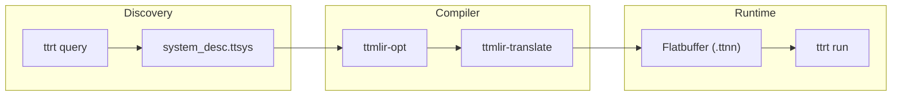
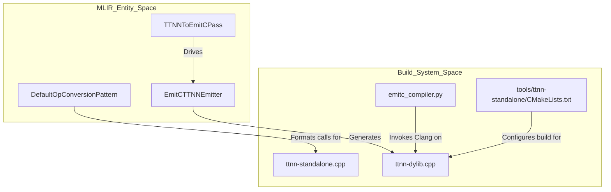
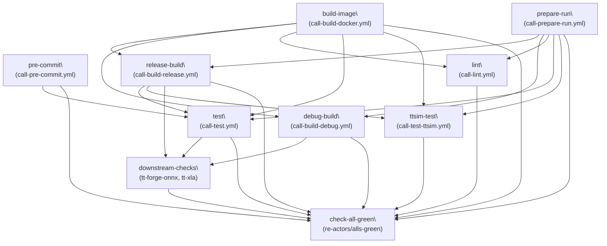
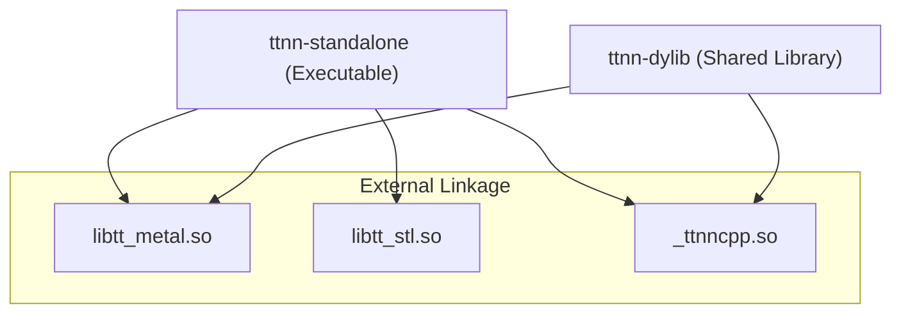

# Tools and Utilities

Relevant source files
*   [.github/CODEOWNERS](https://github.com/tenstorrent/tt-mlir/blob/c7d92e92/.github/CODEOWNERS)
*   [docs/src/SUMMARY.md](https://github.com/tenstorrent/tt-mlir/blob/c7d92e92/docs/src/SUMMARY.md?plain=1)
*   [docs/src/emitc-testing.md](https://github.com/tenstorrent/tt-mlir/blob/c7d92e92/docs/src/emitc-testing.md?plain=1)
*   [docs/src/lit-testing.md](https://github.com/tenstorrent/tt-mlir/blob/c7d92e92/docs/src/lit-testing.md?plain=1)
*   [docs/src/optimizer.md](https://github.com/tenstorrent/tt-mlir/blob/c7d92e92/docs/src/optimizer.md?plain=1)
*   [docs/src/overview.md](https://github.com/tenstorrent/tt-mlir/blob/c7d92e92/docs/src/overview.md?plain=1)
*   [docs/src/specs/runtime-stitching.md](https://github.com/tenstorrent/tt-mlir/blob/c7d92e92/docs/src/specs/runtime-stitching.md?plain=1)
*   [docs/src/specs/specs.md](https://github.com/tenstorrent/tt-mlir/blob/c7d92e92/docs/src/specs/specs.md?plain=1)
*   [docs/src/specs/ttnn-optimizer.md](https://github.com/tenstorrent/tt-mlir/blob/c7d92e92/docs/src/specs/ttnn-optimizer.md?plain=1)
*   [docs/src/testing.md](https://github.com/tenstorrent/tt-mlir/blob/c7d92e92/docs/src/testing.md?plain=1)
*   [docs/src/tools.md](https://github.com/tenstorrent/tt-mlir/blob/c7d92e92/docs/src/tools.md?plain=1)
*   [docs/src/ttnn-standalone.md](https://github.com/tenstorrent/tt-mlir/blob/c7d92e92/docs/src/ttnn-standalone.md?plain=1)
*   [docs/theme/highlight.js](https://github.com/tenstorrent/tt-mlir/blob/c7d92e92/docs/theme/highlight.js)
*   [test/ttmlir/EmitC/TTNN/matmul/matmul.mlir](https://github.com/tenstorrent/tt-mlir/blob/c7d92e92/test/ttmlir/EmitC/TTNN/matmul/matmul.mlir)
*   [tools/CMakeLists.txt](https://github.com/tenstorrent/tt-mlir/blob/c7d92e92/tools/CMakeLists.txt)
*   [tools/profiler/CMakeLists.txt](https://github.com/tenstorrent/tt-mlir/blob/c7d92e92/tools/profiler/CMakeLists.txt)
*   [tools/profiler/__init__.py](https://github.com/tenstorrent/tt-mlir/blob/c7d92e92/tools/profiler/__init__.py)
*   [tools/profiler/profiler.py](https://github.com/tenstorrent/tt-mlir/blob/c7d92e92/tools/profiler/profiler.py)
*   [tools/ttnn-standalone/ci_compile_dylib.py](https://github.com/tenstorrent/tt-mlir/blob/c7d92e92/tools/ttnn-standalone/ci_compile_dylib.py)
*   [tools/ttnn-standalone/emitc_compiler.py](https://github.com/tenstorrent/tt-mlir/blob/c7d92e92/tools/ttnn-standalone/emitc_compiler.py)

## Purpose and Scope
```mermaid
graph TB
    subgraph "TTNN Compilation Pipeline"
        [TTIR_Ops] --> [TTIRToTTNN_Pass]
        [TTIRToTTNN_Pass] --> [TTNN_Ops_Initial]
        [TTNN_Ops_Initial] --> [TTNN_Fusing_Pass]
        [TTNN_Fusing_Pass] --> [TTNNWorkarounds_Pass]
        [TTNNWorkarounds_Pass] --> [TTNN_Ops_Hardware_Compatible]
        [TTNN_Ops_Hardware_Compatible] --> [TTNNOptimizer]
    end
    
    subgraph "Workaround System Entities"
        [wa::TTNNWorkaroundInterface]
        [wa::TTNNOperandsWorkaroundsFactory]
        [TTNNWorkaroundsPatterns.cpp]
        [Decomposition_Patterns]
    end
    
    subgraph "Workaround Types"
        [Layout_Workarounds]
        [Buffer_Type_Workarounds]
        [Memory_Layout_Workarounds]
        [Data_Type_Workarounds]
    end
    
    [TTNNWorkarounds_Pass] -- "uses" --> [wa::TTNNWorkaroundInterface]
    [wa::TTNNWorkaroundInterface] -- "calls" --> [wa::TTNNOperandsWorkaroundsFactory]
    [wa::TTNNOperandsWorkaroundsFactory] -- "defines" --> [Layout_Workarounds]
    [wa::TTNNOperandsWorkaroundsFactory] -- "defines" --> [Buffer_Type_Workarounds]
    [wa::TTNNOperandsWorkaroundsFactory] -- "defines" --> [Memory_Layout_Workarounds]
    [wa::TTNNOperandsWorkaroundsFactory] -- "defines" --> [Data_Type_Workarounds]
    
    [TTNNWorkaroundsPatterns.cpp] -- "implements" --> [wa::TTNNWorkaroundInterface]
    [Decomposition_Patterns] -- "part of" --> [TTNNWorkarounds_Pass]
```

Sources: [lib/Dialect/TTNN/Pipelines/TTNNPipelines.cpp:113-132](), [lib/Dialect/TTNN/Transforms/Workarounds/TTNNWorkaroundsPatterns.cpp:1-61](), [include/ttmlir/Dialect/TTNN/Transforms/Passes.td:31-52]()
```


This section provides an overview of the command-line tools and utilities available in `tt-mlir` for compilation, code generation, runtime execution, and development workflows. These tools form the practical interface to the compilation pipeline and enable developers to transform, execute, and debug MLIR programs targeting Tenstorrent hardware.

For detailed information about specific tools, see:

 — Core compiler driver tools for running passes and translating between representations.
 — The "swiss army knife" for executing compiled flatbuffer binaries and performance analysis.
 — Standalone tools for independent TTNN operation execution, code generation via `tt-alchemist`, and profiling.
 — Utilities for hardware discovery and device capability queries.
 — The `tt-explorer` tool for visualizing MLIR graphs and interactive debugging.

Sources: [docs/src/tools.md 1-11](https://github.com/tenstorrent/tt-mlir/blob/c7d92e92/docs/src/tools.md?plain=1#L1-L11)[docs/src/ttrt.md 1-3](https://github.com/tenstorrent/tt-mlir/blob/c7d92e92/docs/src/ttrt.md?plain=1#L1-L3)

* * *

## Tool Ecosystem Overview

The `tt-mlir` toolchain consists of several command-line utilities that operate at different stages of the compilation and execution pipeline, from high-level MLIR source to hardware-ready binaries.

### Natural Language to Code Entity Mapping: Toolchain Flow

```mermaid
graph TB
    subgraph "InputSpace"
        ["MLIR Source (.mlir files)"]
        ["System Descriptor (.ttsys files)"]
    end
    
    subgraph "CompilerEntities"
        Opt["ttmlir-opt"]
        Translate["ttmlir-translate"]
        Alchemist["tt-alchemist"]
    end
    
    subgraph "OutputArtifacts"
        Flatbuffer["Flatbuffer Binary (.ttnn / .ttm)"]
        CppCode["C++ Source (EmitC)"]
        PyCode["Python Source (EmitPy)"]
    end
    
    subgraph "RuntimeAndDebug"
        TTRT["ttrt (Python package)"]
        Explorer["tt-explorer"]
        Standalone["ttnn-standalone"]
        Profiler["profiler.py"]
    end
    
    ["MLIR Source (.mlir files)"] --> Opt
    ["System Descriptor (.ttsys files)"] --> Opt
    
    Opt --> Translate
    Translate --> Flatbuffer
    Translate --> CppCode
    Translate --> PyCode
    
    Flatbuffer --> TTRT
    CppCode --> Standalone
    ["MLIR Source (.mlir files)"] --> Explorer
    Standalone --> Profiler
```
Sources: [docs/src/tools.md:3-10](), [tools/CMakeLists.txt:1-43](), [docs/src/emitc-testing.md:28-53]()

---
```


The following diagram maps high-level system concepts to the specific code entities and tools that implement them.

Sources: [docs/src/tools.md 3-10](https://github.com/tenstorrent/tt-mlir/blob/c7d92e92/docs/src/tools.md?plain=1#L3-L10)[tools/CMakeLists.txt 1-43](https://github.com/tenstorrent/tt-mlir/blob/c7d92e92/tools/CMakeLists.txt#L1-L43)[docs/src/emitc-testing.md 28-53](https://github.com/tenstorrent/tt-mlir/blob/c7d92e92/docs/src/emitc-testing.md?plain=1#L28-L53)

* * *

## Core Compilation Tools

### ttmlir-opt and ttmlir-translate

`ttmlir-opt` is the primary tool for running MLIR transformation passes. It registers custom Tenstorrent dialects—including `TTIR`, `TTNN`, and `D2M`—enabling conversion and optimization pipelines [docs/src/tools.md 5](https://github.com/tenstorrent/tt-mlir/blob/c7d92e92/docs/src/tools.md?plain=1#L5-L5)[docs/src/overview.md 138-180](https://github.com/tenstorrent/tt-mlir/blob/c7d92e92/docs/src/overview.md?plain=1#L138-L180) It is essential for developing and testing the compiler.

`ttmlir-translate` is the translation tool used to convert MLIR modules into external representations. Its primary role is generating the final executable flatbuffer binaries or converting IR into specialized formats like `EmitC` and `EmitPy`[docs/src/tools.md 6](https://github.com/tenstorrent/tt-mlir/blob/c7d92e92/docs/src/tools.md?plain=1#L6-L6)[docs/src/SUMMARY.md 15-28](https://github.com/tenstorrent/tt-mlir/blob/c7d92e92/docs/src/SUMMARY.md?plain=1#L15-L28)

For details, see [ttmlir-opt and ttmlir-translate](https://deepwiki.com/tenstorrent/tt-mlir/8.1-ttmlir-opt-and-ttmlir-translate).

### Optimizer Integration

The compiler includes a sophisticated optimization system accessible via `ttmlir-opt`. The `TTNNOptimizer` maximizes L1 memory usage and selects optimal operation configurations [docs/src/specs/ttnn-optimizer.md 5-7](https://github.com/tenstorrent/tt-mlir/blob/c7d92e92/docs/src/specs/ttnn-optimizer.md?plain=1#L5-L7) It is enabled via the `enable-optimizer=true` flag in the runtime pipeline [docs/src/optimizer.md 16-19](https://github.com/tenstorrent/tt-mlir/blob/c7d92e92/docs/src/optimizer.md?plain=1#L16-L19)

Sources: [docs/src/optimizer.md 1-50](https://github.com/tenstorrent/tt-mlir/blob/c7d92e92/docs/src/optimizer.md?plain=1#L1-L50)[docs/src/specs/ttnn-optimizer.md 1-50](https://github.com/tenstorrent/tt-mlir/blob/c7d92e92/docs/src/specs/ttnn-optimizer.md?plain=1#L1-L50)

* * *

## Execution and Standalone Tools

### ttrt: Runtime Execution Tool

`ttrt` is a "swiss army knife" tool intended to inspect and run flatbuffer files generated by the compiler [docs/src/tools.md 7](https://github.com/tenstorrent/tt-mlir/blob/c7d92e92/docs/src/tools.md?plain=1#L7-L7) It enables execution without a full front-end runtime and provides utilities for performance analysis.

**Core Functionality:**

*   **Binary Inspection:** Read and verify flatbuffer contents [docs/src/tools.md 7](https://github.com/tenstorrent/tt-mlir/blob/c7d92e92/docs/src/tools.md?plain=1#L7-L7)
*   **Hardware Interaction:** Execute compiled binaries on Tenstorrent devices [docs/src/ttrt.md 136](https://github.com/tenstorrent/tt-mlir/blob/c7d92e92/docs/src/ttrt.md?plain=1#L136-L136)
*   **System Generation:** Create `.ttsys` files representing the target hardware via `ttrt query --save-artifacts`[docs/src/emitc-testing.md 18](https://github.com/tenstorrent/tt-mlir/blob/c7d92e92/docs/src/emitc-testing.md?plain=1#L18-L18)
*   **Performance Tracing:** Analyze execution performance [docs/src/ttrt.md 138](https://github.com/tenstorrent/tt-mlir/blob/c7d92e92/docs/src/ttrt.md?plain=1#L138-L138)

For details, see [ttrt: Runtime Execution Tool](https://deepwiki.com/tenstorrent/tt-mlir/8.2-ttrt:-runtime-execution-tool).

### ttnn-standalone and Development Tools

The `ttnn-standalone` tool executes C++ TTNN code outside of the compiler environment [docs/src/tools.md 10](https://github.com/tenstorrent/tt-mlir/blob/c7d92e92/docs/src/tools.md?plain=1#L10-L10) This is supported by `ci_compile_dylib.py`, which compiles EmitC-generated C++ files into shared objects or executables [tools/ttnn-standalone/ci_compile_dylib.py 8-12](https://github.com/tenstorrent/tt-mlir/blob/c7d92e92/tools/ttnn-standalone/ci_compile_dylib.py#L8-L12)

The ecosystem also includes:

*   **tt-alchemist:** A tool for automated code generation [docs/src/tools.md 26](https://github.com/tenstorrent/tt-mlir/blob/c7d92e92/docs/src/tools.md?plain=1#L26-L26)
*   **Profiler:** A Python-based utility (`profiler.py`) that leverages Tracy for host and device profiling [tools/profiler/profiler.py 15-36](https://github.com/tenstorrent/tt-mlir/blob/c7d92e92/tools/profiler/profiler.py#L15-L36)

For details, see [ttnn-standalone and Development Tools](https://deepwiki.com/tenstorrent/tt-mlir/8.3-ttnn-standalone-and-development-tools).

* * *

## Hardware and Visualization Utilities

### System Description Tools

The compiler requires a System Descriptor (`.ttsys`) to understand the target hardware's grid size and memory constraints [docs/src/specs/ttnn-optimizer.md 50-52](https://github.com/tenstorrent/tt-mlir/blob/c7d92e92/docs/src/specs/ttnn-optimizer.md?plain=1#L50-L52)`ttrt query` is used to discover hardware and generate these descriptors [docs/src/emitc-testing.md 18](https://github.com/tenstorrent/tt-mlir/blob/c7d92e92/docs/src/emitc-testing.md?plain=1#L18-L18)

For details, see [System Description and Hardware Query Tools](https://deepwiki.com/tenstorrent/tt-mlir/8.4-system-description-and-hardware-query-tools).

### Mapping: Hardware Discovery to Runtime


Sources: [docs/src/emitc-testing.md:15-19](), [docs/src/tools.md:5-7]()
```


This diagram shows how hardware discovery tools relate to the runtime libraries and execution.

Sources: [docs/src/emitc-testing.md 15-19](https://github.com/tenstorrent/tt-mlir/blob/c7d92e92/docs/src/emitc-testing.md?plain=1#L15-L19)[docs/src/tools.md 5-7](https://github.com/tenstorrent/tt-mlir/blob/c7d92e92/docs/src/tools.md?plain=1#L5-L7)

### Model Explorer Visualization Tool

The `tt-explorer` tool provides a graphical interface for visualizing MLIR graphs and performance data [docs/src/tools.md 9](https://github.com/tenstorrent/tt-mlir/blob/c7d92e92/docs/src/tools.md?plain=1#L9-L9) It visualizes everything from emitted `.mlir` files to performance results, allowing for interactive model tuning [docs/src/tools.md 9](https://github.com/tenstorrent/tt-mlir/blob/c7d92e92/docs/src/tools.md?plain=1#L9-L9)

For details, see [Model Explorer Visualization Tool](https://deepwiki.com/tenstorrent/tt-mlir/8.5-model-explorer-visualization-tool).

* * *

## Build System Integration

The tools are integrated into the CMake build system, allowing for selective enablement of specific utilities.

| Feature Flag | Tool Impact |
| --- | --- |
| `TTMLIR_ENABLE_TOOLS` | Enables `ttmlir-opt`, `ttmlir-translate`, and `ttnn-standalone`[tools/CMakeLists.txt 1-37](https://github.com/tenstorrent/tt-mlir/blob/c7d92e92/tools/CMakeLists.txt#L1-L37) |
| `TTMLIR_ENABLE_TTRT` | Enables the `ttrt` runtime tool [tools/CMakeLists.txt 28-30](https://github.com/tenstorrent/tt-mlir/blob/c7d92e92/tools/CMakeLists.txt#L28-L30) |
| `TTMLIR_ENABLE_EXPLORER` | Enables the `tt-explorer` visualization tool [tools/CMakeLists.txt 24-26](https://github.com/tenstorrent/tt-mlir/blob/c7d92e92/tools/CMakeLists.txt#L24-L26) |
| `TTMLIR_ENABLE_OPMODEL` | Enables the OpModel analysis system used by the Optimizer [docs/src/optimizer.md 9-12](https://github.com/tenstorrent/tt-mlir/blob/c7d92e92/docs/src/optimizer.md?plain=1#L9-L12) |

Sources: [tools/CMakeLists.txt 1-43](https://github.com/tenstorrent/tt-mlir/blob/c7d92e92/tools/CMakeLists.txt#L1-L43)[docs/src/optimizer.md 9-12](https://github.com/tenstorrent/tt-mlir/blob/c7d92e92/docs/src/optimizer.md?plain=1#L9-L12)

Dismiss
Refresh this wiki

Enter email to refresh

## Additional Diagrams


#### Workflow Entity Association




Sources: [lib/Conversion/TTNNToEmitC/TTNNToEmitC.cpp:80-92](), [tools/ttnn-standalone/CMakeLists.txt:158-175](), [tools/ttnn-standalone/emitc_compiler.py:1-35]()

---
```


### PR Workflow Job Graph




Sources: [.github/workflows/on-pr.yml:28-145]()

The `downstream-checks` job is specifically triggered when the PR branch is named `uplift`. It uses the GitHub CLI (`gh`) to trigger workflows in `tenstorrent/tt-forge-onnx` and `tenstorrent/tt-xla`, passing the current `tt-mlir` SHA as `mlir_override` to validate cross-repo compatibility.

Sources: [.github/workflows/on-pr.yml:85-125]()

---
```


#### Test Execution Workflow


```mermaid
graph TB
    "TestFile[.mlir]" -->|"Parse RUN"| "LitRunner[lit.cfg.py]"
    "LitRunner[lit.cfg.py]" -->|"Execute"| "ttmlir-opt"
    "ttmlir-opt" -->|"Apply Pipeline"| "PassManager"
    "PassManager" -->|"IR Output"| "FileCheck"
    "TestFile[.mlir]" -->|"Patterns"| "FileCheck"
    "FileCheck" -->|"Verify"| "Result[Pass/Fail]"
```


### Integrated Tools Build




Sources: [tools/ttnn-standalone/CMakeLists.txt:120-125](), [tools/ttnn-standalone/CMakeLists.txt:161-175](), [lib/CMakeLists.txt:71-113]()

---
```


## Save results to JSON


```mermaid
graph TB
    ["ttrt_query_CLI"] -- "calls" --> DISPATCH["tt::runtime::getCurrentSystemDesc()<br/>runtime/lib/runtime.cpp"]
    
    subgraph "Backend_Implementation"
        SD_ENTRY["tt::runtime::system_desc::getCurrentSystemDesc()<br/>runtime/lib/common/system_desc.cpp"]
    end
    
    subgraph "Hardware_Query"
        DEVICE["tt::tt_metal::distributed::MeshDevice"]
        CORES["logical_grid_size()"]
        MEM["l1_size_per_core()<br/>dram_size_per_channel()"]
        ALIGN["get_alignment()"]
        ETH["get_active_ethernet_cores()"]
    end
    
    FLATBUF["flatbuffers::FlatBufferBuilder"]
    FILE["system_desc.ttsys"]
    
    DISPATCH -- "calls" --> SD_ENTRY
    SD_ENTRY -- "queries" --> DEVICE
    DEVICE -- "obtains" --> CORES
    DEVICE -- "obtains" --> MEM
    DEVICE -- "obtains" --> ALIGN
    DEVICE -- "obtains" --> ETH
    
    CORES -- "serializes_to" --> FLATBUF
    MEM -- "serializes_to" --> FLATBUF
    ALIGN -- "serializes_to" --> FLATBUF
    ETH -- "serializes_to" --> FLATBUF
    
    FLATBUF -- "writes" --> FILE
```

