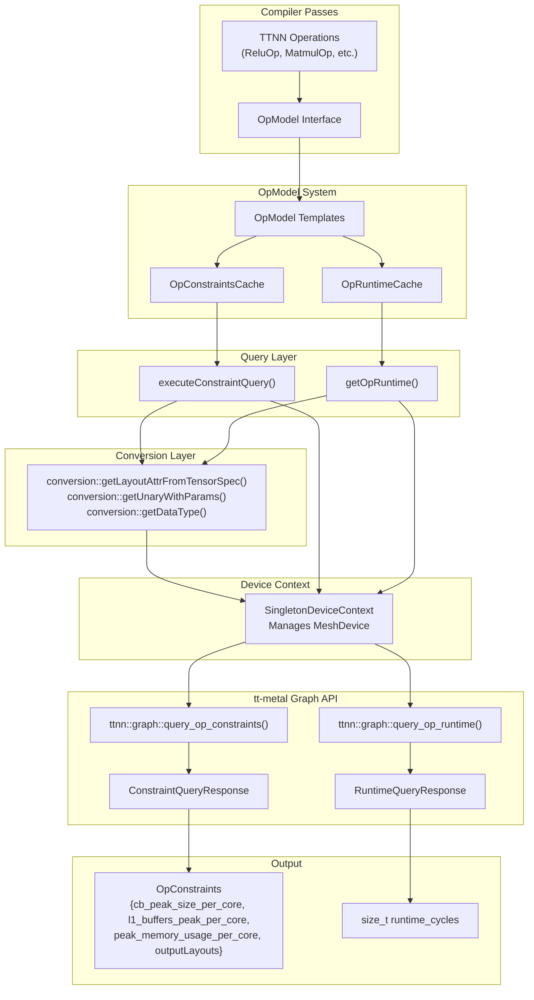
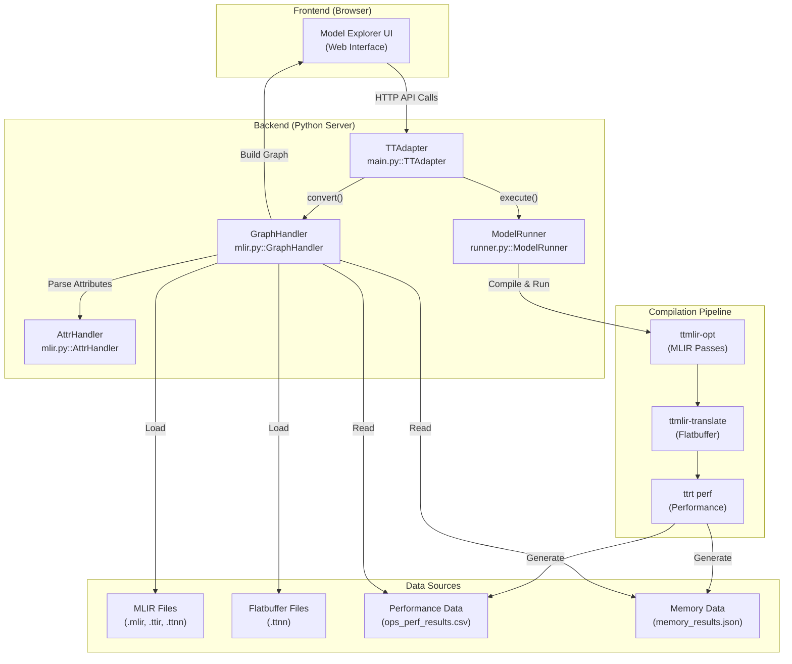
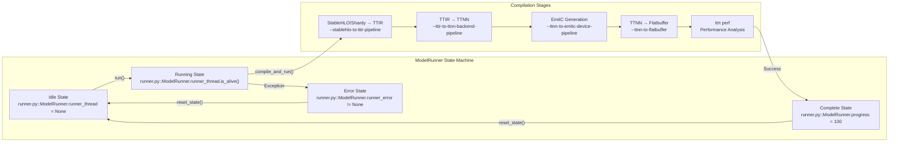
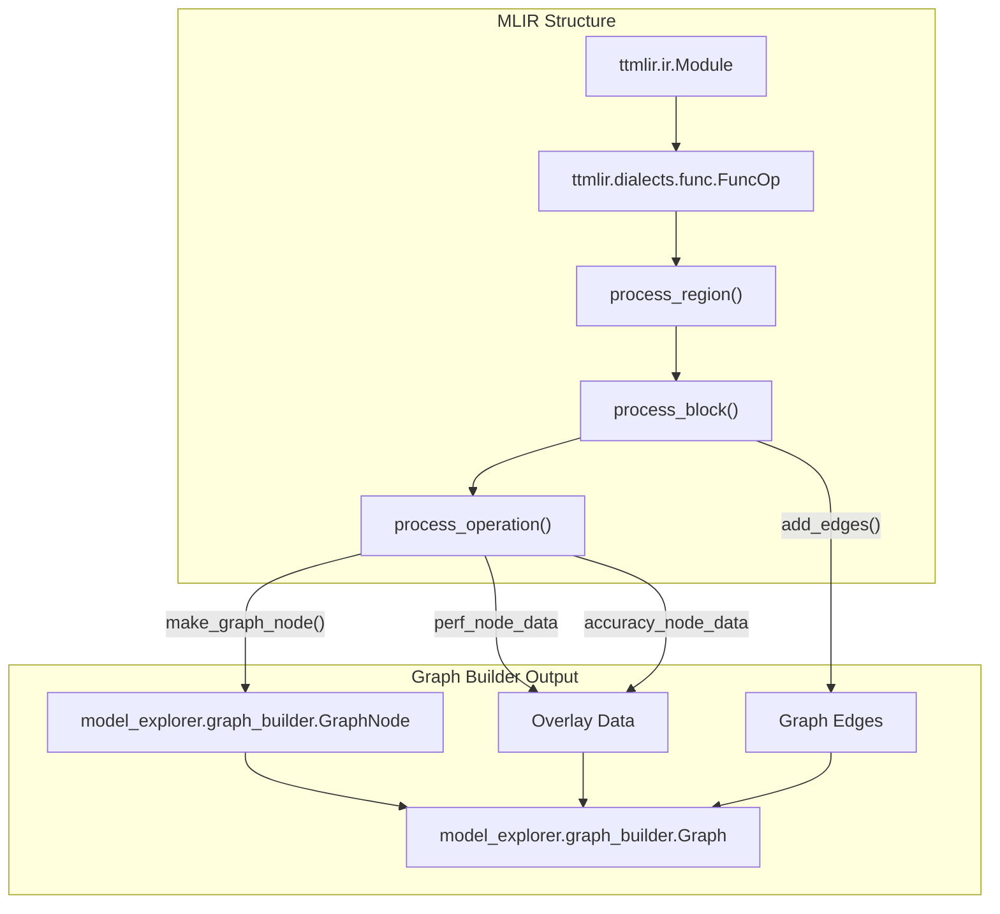
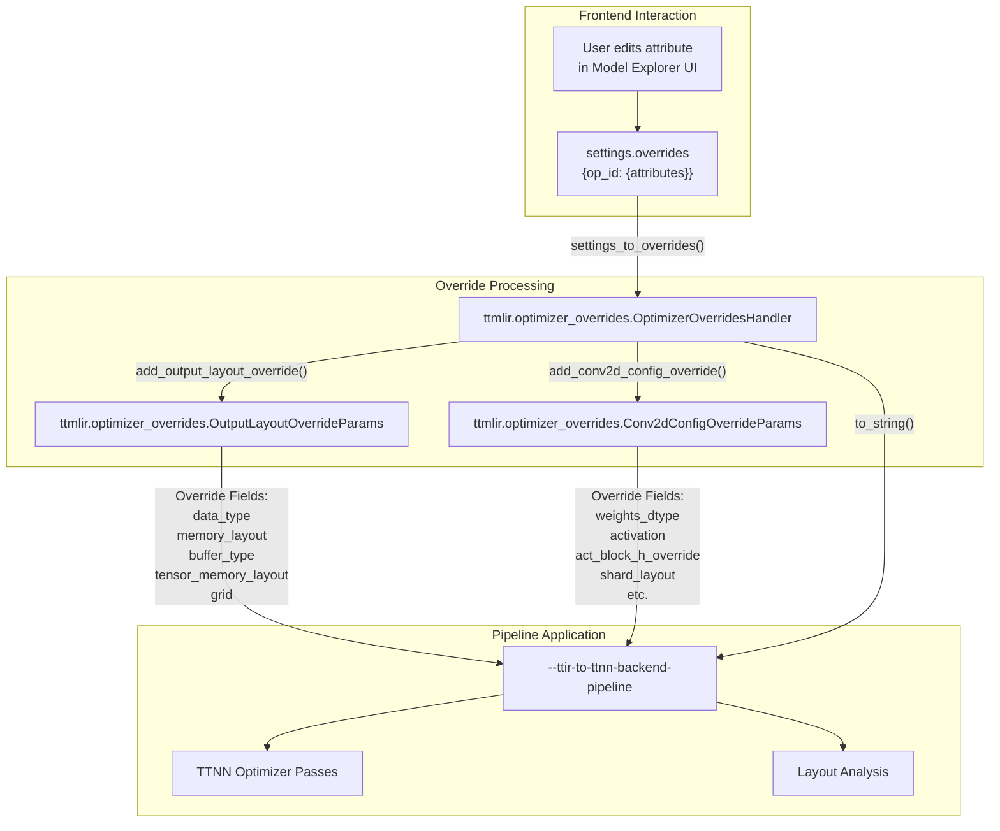
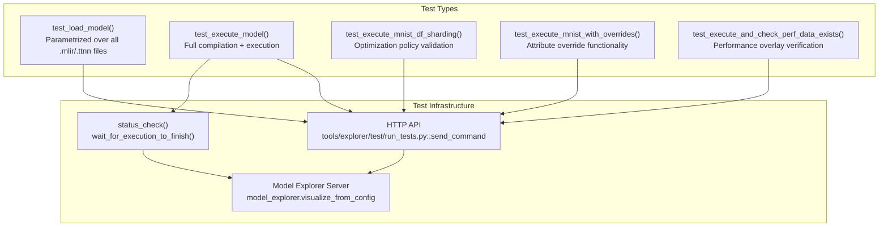

# Model Explorer Visualization Tool

Relevant source files
*   [test/ttmlir/Silicon/TTNN/n150/mixed_precision/lit.local.cfg](https://github.com/tenstorrent/tt-mlir/blob/c7d92e92/test/ttmlir/Silicon/TTNN/n150/mixed_precision/lit.local.cfg)
*   [tools/explorer/CMakeLists.txt](https://github.com/tenstorrent/tt-mlir/blob/c7d92e92/tools/explorer/CMakeLists.txt)
*   [tools/explorer/test/run_tests.py](https://github.com/tenstorrent/tt-mlir/blob/c7d92e92/tools/explorer/test/run_tests.py)
*   [tools/explorer/tt_adapter/src/tt_adapter/main.py](https://github.com/tenstorrent/tt-mlir/blob/c7d92e92/tools/explorer/tt_adapter/src/tt_adapter/main.py)
*   [tools/explorer/tt_adapter/src/tt_adapter/mlir.py](https://github.com/tenstorrent/tt-mlir/blob/c7d92e92/tools/explorer/tt_adapter/src/tt_adapter/mlir.py)
*   [tools/explorer/tt_adapter/src/tt_adapter/runner.py](https://github.com/tenstorrent/tt-mlir/blob/c7d92e92/tools/explorer/tt_adapter/src/tt_adapter/runner.py)
*   [tools/explorer/tt_adapter/src/tt_adapter/utils.py](https://github.com/tenstorrent/tt-mlir/blob/c7d92e92/tools/explorer/tt_adapter/src/tt_adapter/utils.py)

The Model Explorer Visualization Tool (`tt-explorer`) is an interactive web-based visualization and debugging tool for MLIR graphs in the `tt-mlir` compiler. It enables developers to inspect MLIR operations, analyze performance characteristics, visualize memory usage, and interactively modify compilation parameters. The tool integrates with Tenstorrent's fork of Google's Model Explorer framework and provides a custom adapter for Tenstorrent-specific dialects.

For information about the command-line tools for compilation, see [ttmlir-opt and ttmlir-translate](https://github.com/tenstorrent/tt-mlir/blob/c7d92e92/ttmlir-opt%20and%20ttmlir-translate) For runtime execution of compiled binaries, see [ttrt](https://github.com/tenstorrent/tt-mlir/blob/c7d92e92/ttrt#LNaN-LNaN)

## System Architecture

The tool is composed of a Python-based backend adapter that bridges the `tt-mlir` compiler infrastructure with the Model Explorer UI.




The system bridges MLIR operations to tt-metal hardware queries through a conversion and caching layer. Operations implement the `OpModel` interface, which dispatches to specialized templates that query the hardware using the tt-metal graph API.

Sources: [lib/OpModel/TTNN/TTNNOpModel.cpp:36-120](), [lib/Dialect/TTNN/Interfaces/TTNNOpModelInterface.cpp:113-139]()

---
```
### Architecture Overview Diagram

**Sources:**[tools/explorer/tt_adapter/src/tt_adapter/main.py 139-150](https://github.com/tenstorrent/tt-mlir/blob/c7d92e92/tools/explorer/tt_adapter/src/tt_adapter/main.py#L139-L150)[tools/explorer/tt_adapter/src/tt_adapter/runner.py 53-85](https://github.com/tenstorrent/tt-mlir/blob/c7d92e92/tools/explorer/tt_adapter/src/tt_adapter/runner.py#L53-L85)[tools/explorer/tt_adapter/src/tt_adapter/mlir.py 1-15](https://github.com/tenstorrent/tt-mlir/blob/c7d92e92/tools/explorer/tt_adapter/src/tt_adapter/mlir.py#L1-L15)



## Key Components

### TTAdapter Class

The `TTAdapter` class in `tools/explorer/tt_adapter/src/tt_adapter/main.py` serves as the bridge between Model Explorer's frontend and the `tt-mlir` compiler infrastructure. It implements the `model_explorer.Adapter` interface [tools/explorer/tt_adapter/src/tt_adapter/main.py 139-140](https://github.com/tenstorrent/tt-mlir/blob/c7d92e92/tools/explorer/tt_adapter/src/tt_adapter/main.py#L139-L140)

| Method | Purpose | Input | Output |
| --- | --- | --- | --- |
| `convert()` | Convert MLIR to graph representation | `model_path`, `settings` | `ModelExplorerGraphs` |
| `execute()` | Compile and run model with overrides | `model_path`, `settings` | Empty graphs (async) |
| `status_check()` | Poll execution progress | `model_path`, `settings` | Progress status, logs, errors |
| `preload()` | Discover IR files in explorer directory | `model_path`, `settings` | List of graph paths |

The adapter supports multiple optimization policies defined in `OPTIMIZATION_POLICIES`[tools/explorer/tt_adapter/src/tt_adapter/main.py 16-21](https://github.com/tenstorrent/tt-mlir/blob/c7d92e92/tools/explorer/tt_adapter/src/tt_adapter/main.py#L16-L21) such as "Optimizer Disabled" and "DF Sharding".

**Sources:**[tools/explorer/tt_adapter/src/tt_adapter/main.py 139-272](https://github.com/tenstorrent/tt-mlir/blob/c7d92e92/tools/explorer/tt_adapter/src/tt_adapter/main.py#L139-L272)[tools/explorer/tt_adapter/src/tt_adapter/main.py 16-21](https://github.com/tenstorrent/tt-mlir/blob/c7d92e92/tools/explorer/tt_adapter/src/tt_adapter/main.py#L16-L21)

### ModelRunner Singleton

The `ModelRunner` class is a singleton that manages the compilation and execution lifecycle [tools/explorer/tt_adapter/src/tt_adapter/runner.py 53-63](https://github.com/tenstorrent/tt-mlir/blob/c7d92e92/tools/explorer/tt_adapter/src/tt_adapter/runner.py#L53-L63) It ensures only one compilation/run task is active at a time to prevent hardware resource contention.

### ModelRunner Execution Flow

**Key Features:**

*   **Pipeline Orchestration**: Invokes `ttmlir-opt` and `ttmlir-translate` via subprocesses or internal pass managers [tools/explorer/tt_adapter/src/tt_adapter/runner.py 272-400](https://github.com/tenstorrent/tt-mlir/blob/c7d92e92/tools/explorer/tt_adapter/src/tt_adapter/runner.py#L272-L400)
*   **Progress Tracking**: Updates the `progress` field (0-100) during compilation stages [tools/explorer/tt_adapter/src/tt_adapter/runner.py 72](https://github.com/tenstorrent/tt-mlir/blob/c7d92e92/tools/explorer/tt_adapter/src/tt_adapter/runner.py#L72-L72)
*   **Artifact Management**: Stores results in `ttrt-artifacts/` (default `TT_MLIR_HOME/ttrt-artifacts`) [tools/explorer/tt_adapter/src/tt_adapter/runner.py 98-101](https://github.com/tenstorrent/tt-mlir/blob/c7d92e92/tools/explorer/tt_adapter/src/tt_adapter/runner.py#L98-L101)
*   **TTRT Integration**: Loads `ttrt` APIs dynamically via `ttrt_loader` to handle device initialization and performance tracing [tools/explorer/tt_adapter/src/tt_adapter/runner.py 86-120](https://github.com/tenstorrent/tt-mlir/blob/c7d92e92/tools/explorer/tt_adapter/src/tt_adapter/runner.py#L86-L120)

**Sources:**[tools/explorer/tt_adapter/src/tt_adapter/runner.py 53-121](https://github.com/tenstorrent/tt-mlir/blob/c7d92e92/tools/explorer/tt_adapter/src/tt_adapter/runner.py#L53-L121)[tools/explorer/tt_adapter/src/tt_adapter/runner.py 272-502](https://github.com/tenstorrent/tt-mlir/blob/c7d92e92/tools/explorer/tt_adapter/src/tt_adapter/runner.py#L272-L502)[tools/explorer/tt_adapter/src/tt_adapter/ttrt_loader.py 1-20](https://github.com/tenstorrent/tt-mlir/blob/c7d92e92/tools/explorer/tt_adapter/src/tt_adapter/ttrt_loader.py#L1-L20)




**Key Features:**
- **Pipeline Orchestration**: Invokes `ttmlir-opt` and `ttmlir-translate` via subprocesses or internal pass managers [tools/explorer/tt_adapter/src/tt_adapter/runner.py:272-400]().
- **Progress Tracking**: Updates the `progress` field (0-100) during compilation stages [tools/explorer/tt_adapter/src/tt_adapter/runner.py:72-72]().
- **Artifact Management**: Stores results in `ttrt-artifacts/` (default `TT_MLIR_HOME/ttrt-artifacts`) [tools/explorer/tt_adapter/src/tt_adapter/runner.py:98-101]().
- **TTRT Integration**: Loads `ttrt` APIs dynamically via `ttrt_loader` to handle device initialization and performance tracing [tools/explorer/tt_adapter/src/tt_adapter/runner.py:86-120]().
```
### MLIR Parsing and Graph Construction

The logic in `tools/explorer/tt_adapter/src/tt_adapter/mlir.py` converts MLIR modules into Model Explorer's graph format using the `graph_builder` API [tools/explorer/tt_adapter/src/tt_adapter/mlir.py 9-10](https://github.com/tenstorrent/tt-mlir/blob/c7d92e92/tools/explorer/tt_adapter/src/tt_adapter/mlir.py#L9-L10)

### MLIR to Graph Conversion Process

**Sources:**[tools/explorer/tt_adapter/src/tt_adapter/mlir.py 787-920](https://github.com/tenstorrent/tt-mlir/blob/c7d92e92/tools/explorer/tt_adapter/src/tt_adapter/mlir.py#L787-L920)[tools/explorer/tt_adapter/src/tt_adapter/mlir.py 922-968](https://github.com/tenstorrent/tt-mlir/blob/c7d92e92/tools/explorer/tt_adapter/src/tt_adapter/mlir.py#L922-L968)[tools/explorer/tt_adapter/src/tt_adapter/mlir.py 1063-1110](https://github.com/tenstorrent/tt-mlir/blob/c7d92e92/tools/explorer/tt_adapter/src/tt_adapter/mlir.py#L1063-L1110)



### AttrHandler - Attribute Parsing System

The `AttrHandler` class provides an extensible framework for parsing MLIR attributes into UI-friendly key-value pairs using a decorator pattern [tools/explorer/tt_adapter/src/tt_adapter/mlir.py 36-77](https://github.com/tenstorrent/tt-mlir/blob/c7d92e92/tools/explorer/tt_adapter/src/tt_adapter/mlir.py#L36-L77)

| Attribute Name | Handler Function | Description |
| --- | --- | --- |
| `ttcore.device` | `parse_tt_device()` | Chip IDs, grid shape, mesh shape, memory maps [tools/explorer/tt_adapter/src/tt_adapter/mlir.py 79-103](https://github.com/tenstorrent/tt-mlir/blob/c7d92e92/tools/explorer/tt_adapter/src/tt_adapter/mlir.py#L79-L103) |
| `ttcore.system_desc` | `parse_tt_system_desc()` | Chip architectures, capabilities, memory sizes [tools/explorer/tt_adapter/src/tt_adapter/mlir.py 106-216](https://github.com/tenstorrent/tt-mlir/blob/c7d92e92/tools/explorer/tt_adapter/src/tt_adapter/mlir.py#L106-L216) |
| `ttnn_layout` | `parse_ttnn_ttnn_layout()` | Tensor memory layout, buffer type, grid shape [tools/explorer/tt_adapter/src/tt_adapter/mlir.py 373-440](https://github.com/tenstorrent/tt-mlir/blob/c7d92e92/tools/explorer/tt_adapter/src/tt_adapter/mlir.py#L373-L440) |
| `conv2d_config` | `parse_conv2d_config()` | Conv2d specific parameters (activation, block sizes) [tools/explorer/tt_adapter/src/tt_adapter/mlir.py 465-611](https://github.com/tenstorrent/tt-mlir/blob/c7d92e92/tools/explorer/tt_adapter/src/tt_adapter/mlir.py#L465-L611) |

**Sources:**[tools/explorer/tt_adapter/src/tt_adapter/mlir.py 36-77](https://github.com/tenstorrent/tt-mlir/blob/c7d92e92/tools/explorer/tt_adapter/src/tt_adapter/mlir.py#L36-L77)[tools/explorer/tt_adapter/src/tt_adapter/mlir.py 79-627](https://github.com/tenstorrent/tt-mlir/blob/c7d92e92/tools/explorer/tt_adapter/src/tt_adapter/mlir.py#L79-L627)

## Compilation and Execution Workflow

When a user triggers an execution from the UI, the following sequence occurs:

**Sources:**[tools/explorer/tt_adapter/src/tt_adapter/runner.py 272-502](https://github.com/tenstorrent/tt-mlir/blob/c7d92e92/tools/explorer/tt_adapter/src/tt_adapter/runner.py#L272-L502)[tools/explorer/tt_adapter/src/tt_adapter/main.py 231-256](https://github.com/tenstorrent/tt-mlir/blob/c7d92e92/tools/explorer/tt_adapter/src/tt_adapter/main.py#L231-L256)[tools/explorer/tt_adapter/src/tt_adapter/utils.py 148-155](https://github.com/tenstorrent/tt-mlir/blob/c7d92e92/tools/explorer/tt_adapter/src/tt_adapter/utils.py#L148-L155)

## Optimizer Overrides System

The tool allows users to tune models by overriding compiler decisions directly in the UI. The `settings_to_overrides` function [tools/explorer/tt_adapter/src/tt_adapter/main.py 29-136](https://github.com/tenstorrent/tt-mlir/blob/c7d92e92/tools/explorer/tt_adapter/src/tt_adapter/main.py#L29-L136) converts UI selections into `OptimizerOverridesHandler` calls.

### Override Data Flow

**Sources:**[tools/explorer/tt_adapter/src/tt_adapter/main.py 29-136](https://github.com/tenstorrent/tt-mlir/blob/c7d92e92/tools/explorer/tt_adapter/src/tt_adapter/main.py#L29-L136)[tools/explorer/tt_adapter/src/tt_adapter/mlir.py 373-440](https://github.com/tenstorrent/tt-mlir/blob/c7d92e92/tools/explorer/tt_adapter/src/tt_adapter/mlir.py#L373-L440)



## Performance and Memory Visualization

### Performance Overlay

Performance data is read from `ops_perf_results.csv` generated by `ttrt perf`[tools/explorer/tt_adapter/src/tt_adapter/runner.py 193-200](https://github.com/tenstorrent/tt-mlir/blob/c7d92e92/tools/explorer/tt_adapter/src/tt_adapter/runner.py#L193-L200) The adapter maps these results back to MLIR operations using location strings parsed via `parse_loc_string`[tools/explorer/tt_adapter/src/tt_adapter/mlir.py 19-34](https://github.com/tenstorrent/tt-mlir/blob/c7d92e92/tools/explorer/tt_adapter/src/tt_adapter/mlir.py#L19-L34)

### Memory Overlay

Memory usage data is extracted from `memory_results.json`[tools/explorer/tt_adapter/src/tt_adapter/runner.py 202-215](https://github.com/tenstorrent/tt-mlir/blob/c7d92e92/tools/explorer/tt_adapter/src/tt_adapter/runner.py#L202-L215) It visualizes DRAM and L1 utilization ratios for each operation by matching the operation's location in the memory trace.

**Sources:**[tools/explorer/tt_adapter/src/tt_adapter/mlir.py 824-917](https://github.com/tenstorrent/tt-mlir/blob/c7d92e92/tools/explorer/tt_adapter/src/tt_adapter/mlir.py#L824-L917)[tools/explorer/tt_adapter/src/tt_adapter/runner.py 193-215](https://github.com/tenstorrent/tt-mlir/blob/c7d92e92/tools/explorer/tt_adapter/src/tt_adapter/runner.py#L193-L215)

## Build and Setup

The `tt-explorer` tool is built as part of the `explorer` target in CMake [tools/explorer/CMakeLists.txt 37-47](https://github.com/tenstorrent/tt-mlir/blob/c7d92e92/tools/explorer/CMakeLists.txt#L37-L47)

**Requirements:**

*   `TT_RUNTIME_DEBUG`
*   `TT_RUNTIME_ENABLE_PERF_TRACE`
*   `TTMLIR_ENABLE_RUNTIME`[tools/explorer/CMakeLists.txt 25-29](https://github.com/tenstorrent/tt-mlir/blob/c7d92e92/tools/explorer/CMakeLists.txt#L25-L29)

The build process fetches the Tenstorrent Model Explorer repository at a specific version [tools/explorer/CMakeLists.txt 6-12](https://github.com/tenstorrent/tt-mlir/blob/c7d92e92/tools/explorer/CMakeLists.txt#L6-L12) installs the `tt_adapter`[tools/explorer/CMakeLists.txt 39](https://github.com/tenstorrent/tt-mlir/blob/c7d92e92/tools/explorer/CMakeLists.txt#L39-L39) and creates a symlink `tt-explorer` in the build binary directory [tools/explorer/CMakeLists.txt 49-53](https://github.com/tenstorrent/tt-mlir/blob/c7d92e92/tools/explorer/CMakeLists.txt#L49-L53)

**Sources:**[tools/explorer/CMakeLists.txt 1-54](https://github.com/tenstorrent/tt-mlir/blob/c7d92e92/tools/explorer/CMakeLists.txt#L1-L54)

## Testing

The tool includes a comprehensive test suite in `tools/explorer/test/run_tests.py` that validates model loading, execution, and override functionality using `pytest`[tools/explorer/test/run_tests.py 9-13](https://github.com/tenstorrent/tt-mlir/blob/c7d92e92/tools/explorer/test/run_tests.py#L9-L13)

### Test Infrastructure Diagram




**Sources:**[tools/explorer/test/run_tests.py 1-280](https://github.com/tenstorrent/tt-mlir/blob/c7d92e92/tools/explorer/test/run_tests.py#L1-L280)

This wiki is featured in the [repository](https://github.com/tenstorrent/tt-mlir/blob/main/README.md)

Dismiss
Refresh this wiki

Enter email to refresh
