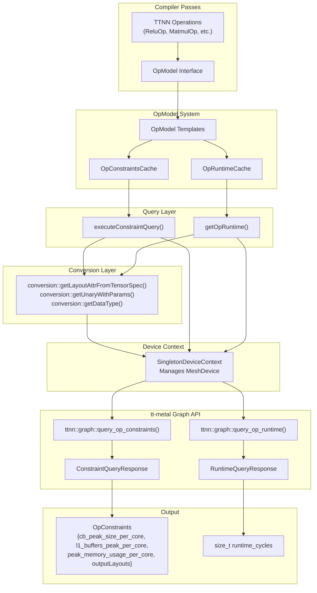

# PyKernel: Python Kernel DSL

Relevant source files
*   [CONTRIBUTING.md](https://github.com/tenstorrent/tt-mlir/blob/c7d92e92/CONTRIBUTING.md?plain=1)
*   [docs/src/coding-guidelines.md](https://github.com/tenstorrent/tt-mlir/blob/c7d92e92/docs/src/coding-guidelines.md?plain=1)
*   [docs/src/op-by-op-workflows.md](https://github.com/tenstorrent/tt-mlir/blob/c7d92e92/docs/src/op-by-op-workflows.md?plain=1)
*   [docs/src/pykernel.md](https://github.com/tenstorrent/tt-mlir/blob/c7d92e92/docs/src/pykernel.md?plain=1)
*   [include/ttmlir-c/TTKernelTypes.h](https://github.com/tenstorrent/tt-mlir/blob/c7d92e92/include/ttmlir-c/TTKernelTypes.h)
*   [include/ttmlir/Dialect/TTKernel/IR/TTKernelOpsEnums.td](https://github.com/tenstorrent/tt-mlir/blob/c7d92e92/include/ttmlir/Dialect/TTKernel/IR/TTKernelOpsEnums.td)
*   [include/ttmlir/Dialect/TTKernel/IR/TTKernelOpsTypes.td](https://github.com/tenstorrent/tt-mlir/blob/c7d92e92/include/ttmlir/Dialect/TTKernel/IR/TTKernelOpsTypes.td)
*   [lib/CAPI/TTKernelTypes.cpp](https://github.com/tenstorrent/tt-mlir/blob/c7d92e92/lib/CAPI/TTKernelTypes.cpp)
*   [python/TTKernelModule.cpp](https://github.com/tenstorrent/tt-mlir/blob/c7d92e92/python/TTKernelModule.cpp)
*   [runtime/lib/ttnn/operations/deletion/deallocate.cpp](https://github.com/tenstorrent/tt-mlir/blob/c7d92e92/runtime/lib/ttnn/operations/deletion/deallocate.cpp)
*   [runtime/python/CMakeLists.txt](https://github.com/tenstorrent/tt-mlir/blob/c7d92e92/runtime/python/CMakeLists.txt)
*   [test/pykernel/add_2_integers_in_compute/add_2_tiles.py](https://github.com/tenstorrent/tt-mlir/blob/c7d92e92/test/pykernel/add_2_integers_in_compute/add_2_tiles.py)
*   [test/pykernel/add_2_integers_in_compute/reader_binary_1_tile.py](https://github.com/tenstorrent/tt-mlir/blob/c7d92e92/test/pykernel/add_2_integers_in_compute/reader_binary_1_tile.py)
*   [test/pykernel/add_2_integers_in_compute/writer_1_tile.py](https://github.com/tenstorrent/tt-mlir/blob/c7d92e92/test/pykernel/add_2_integers_in_compute/writer_1_tile.py)
*   [test/pykernel/demo/CMakeLists.txt](https://github.com/tenstorrent/tt-mlir/blob/c7d92e92/test/pykernel/demo/CMakeLists.txt)
*   [test/pykernel/demo/eltwise_sfpu_demo.py](https://github.com/tenstorrent/tt-mlir/blob/c7d92e92/test/pykernel/demo/eltwise_sfpu_demo.py)
*   [test/pykernel/demo/matmul_multicore_demo.py](https://github.com/tenstorrent/tt-mlir/blob/c7d92e92/test/pykernel/demo/matmul_multicore_demo.py)
*   [test/pykernel/demo/matmul_singlecore_demo.py](https://github.com/tenstorrent/tt-mlir/blob/c7d92e92/test/pykernel/demo/matmul_singlecore_demo.py)
*   [test/pykernel/demo/vecadd_multicore_demo.py](https://github.com/tenstorrent/tt-mlir/blob/c7d92e92/test/pykernel/demo/vecadd_multicore_demo.py)
*   [test/pykernel/eltwise_sfpu/eltwise_sfpu.py](https://github.com/tenstorrent/tt-mlir/blob/c7d92e92/test/pykernel/eltwise_sfpu/eltwise_sfpu.py)
*   [test/pykernel/eltwise_sfpu/reader_unary.py](https://github.com/tenstorrent/tt-mlir/blob/c7d92e92/test/pykernel/eltwise_sfpu/reader_unary.py)
*   [test/pykernel/eltwise_sfpu/writer_unary.py](https://github.com/tenstorrent/tt-mlir/blob/c7d92e92/test/pykernel/eltwise_sfpu/writer_unary.py)
*   [test/pykernel/matmul_common/reader_bmm_8bank.py](https://github.com/tenstorrent/tt-mlir/blob/c7d92e92/test/pykernel/matmul_common/reader_bmm_8bank.py)
*   [test/pykernel/matmul_common/reader_bmm_8bank_output_tiles_partitioned.py](https://github.com/tenstorrent/tt-mlir/blob/c7d92e92/test/pykernel/matmul_common/reader_bmm_8bank_output_tiles_partitioned.py)
*   [test/pykernel/matmul_common/writer_bmm_8bank.py](https://github.com/tenstorrent/tt-mlir/blob/c7d92e92/test/pykernel/matmul_common/writer_bmm_8bank.py)
*   [test/pykernel/unit_tests.py](https://github.com/tenstorrent/tt-mlir/blob/c7d92e92/test/pykernel/unit_tests.py)
*   [test/python/golden/d2m/fabric_api_snippets/test_fabric_sem_inc.mlir](https://github.com/tenstorrent/tt-mlir/blob/c7d92e92/test/python/golden/d2m/fabric_api_snippets/test_fabric_sem_inc.mlir)
*   [test/ttmlir/Conversion/D2MToTTKernel/semaphores.mlir](https://github.com/tenstorrent/tt-mlir/blob/c7d92e92/test/ttmlir/Conversion/D2MToTTKernel/semaphores.mlir)
*   [test/ttmlir/Dialect/D2M/arguments/d2m_to_ttkernel_argument_lowering.mlir](https://github.com/tenstorrent/tt-mlir/blob/c7d92e92/test/ttmlir/Dialect/D2M/arguments/d2m_to_ttkernel_argument_lowering.mlir)
*   [test/ttmlir/Dialect/TTKernel/l1_addr_ptr_types.mlir](https://github.com/tenstorrent/tt-mlir/blob/c7d92e92/test/ttmlir/Dialect/TTKernel/l1_addr_ptr_types.mlir)
*   [tools/op-by-op-infra/README.md](https://github.com/tenstorrent/tt-mlir/blob/c7d92e92/tools/op-by-op-infra/README.md?plain=1)
*   [tools/ttnn-jit/csrc/CMakeLists.txt](https://github.com/tenstorrent/tt-mlir/blob/c7d92e92/tools/ttnn-jit/csrc/CMakeLists.txt)
*   [tools/ttnn-jit/csrc/__init__.cpp](https://github.com/tenstorrent/tt-mlir/blob/c7d92e92/tools/ttnn-jit/csrc/__init__.cpp)
*   [tools/ttnn-jit/csrc/include/jit_cache.h](https://github.com/tenstorrent/tt-mlir/blob/c7d92e92/tools/ttnn-jit/csrc/include/jit_cache.h)
*   [tools/ttnn-jit/csrc/lib/jit_cache.cpp](https://github.com/tenstorrent/tt-mlir/blob/c7d92e92/tools/ttnn-jit/csrc/lib/jit_cache.cpp)

PyKernel is a domain-specific language (DSL) and infrastructure within `tt-mlir` that allows developers to author Tenstorrent hardware kernels directly in Python. It provides a high-level abstraction for programming the three main thread types on Tenstorrent chips: **NOC Readers**, **NOC Writers**, and **Tensix Compute** (FPU/SFPU) [[test/pykernel/demo/matmul_multicore_demo.py:7-11]](https://deepwiki.com/tenstorrent/tt-mlir/9.2-pykernel:-python-kernel-dsl).

PyKernel functions are parsed into an Abstract Syntax Tree (AST), lowered to the **TTKernel Dialect** in MLIR, and finally compiled into C++ code compatible with the Tenstorrent `tt-metal` programming model [[test/pykernel/eltwise_sfpu/reader_unary.py:11-15]](https://deepwiki.com/tenstorrent/tt-mlir/9.2-pykernel:-python-kernel-dsl).

## System Architecture

The PyKernel system bridges the gap between high-level Python code and low-level hardware execution. It consists of a frontend compiler that handles Python syntax and a runtime component that integrates with `ttnn` for tensor management and program dispatch.




The system bridges MLIR operations to tt-metal hardware queries through a conversion and caching layer. Operations implement the `OpModel` interface, which dispatches to specialized templates that query the hardware using the tt-metal graph API.

Sources: [lib/OpModel/TTNN/TTNNOpModel.cpp:36-120](), [lib/Dialect/TTNN/Interfaces/TTNNOpModelInterface.cpp:113-139]()

---
```
### Data and Control Flow

The following diagram illustrates how a PyKernel operation moves from Python source to hardware execution.

**PyKernel Compilation and Execution Flow**

**Sources:**[[docs/src/pykernel.md:15-24]](https://deepwiki.com/tenstorrent/tt-mlir/9.2-pykernel:-python-kernel-dsl), [[test/pykernel/eltwise_sfpu/reader_unary.py:11-15]](https://deepwiki.com/tenstorrent/tt-mlir/9.2-pykernel:-python-kernel-dsl), [[runtime/python/CMakeLists.txt:35-42]](https://deepwiki.com/tenstorrent/tt-mlir/9.2-pykernel:-python-kernel-dsl)


```mermaid
graph TD
    subgraph "Python Frontend (pykernel._src)"
        ["PyKernelOp Definition"] --> ["@compute_thread / @reader_thread / @writer_thread"]
        ["@compute_thread / @reader_thread / @writer_thread"] --> ["Python AST Parsing (ast module)"]
    end

    subgraph "tt-mlir Compiler"
        ["Python AST Parsing (ast module)"] --> ["TTKernel Dialect (MLIR)"]
        ["TTKernel Dialect (MLIR)"] --> ["MLIR Transformations / Optimization"]
        ["MLIR Transformations / Optimization"] --> ["EmitC Dialect (C++ Generation)"]
    end

    subgraph "Hardware Execution"
        ["EmitC Dialect (C++ Generation)"] --> ["tt-metal Compiler (offline/JIT)"]
        ["tt-metal Compiler (offline/JIT)"] --> ["Tensix Core / NOC Hardware"]
    end

    subgraph "Runtime Management (ttnn integration)"
        ["ttnn.Device"] --> ["PyKernelOp.invoke()"]
        ["PyKernelOp.invoke()"] --> ["Circular Buffer Allocation"]
        ["Circular Buffer Allocation"] --> ["Program Dispatch (Generic Op)"]
        ["Program Dispatch (Generic Op)"] --> ["tt-metal Compiler (offline/JIT)"]
    end
```
## Core Components

### 1. PyKernelOp Class

The `PyKernelOp` class is the base class for defining custom operations. It manages the lifecycle of kernels, circular buffers (CBs), and the final `ttnn` program [[docs/src/pykernel.md:57-126]](https://deepwiki.com/tenstorrent/tt-mlir/9.2-pykernel:-python-kernel-dsl).

*   **`define_core_ranges`**: Specifies the grid of Tensix cores the kernel will run on. It returns a `ttnn.CoreRangeSet`[[docs/src/pykernel.md:59-63]](https://deepwiki.com/tenstorrent/tt-mlir/9.2-pykernel:-python-kernel-dsl).
*   **`invoke`**: Orchestrates the creation of circular buffers and kernels, and defines the runtime arguments for each core [[docs/src/pykernel.md:90-126]](https://deepwiki.com/tenstorrent/tt-mlir/9.2-pykernel:-python-kernel-dsl).
*   **`create_kernel`**: Binds a Python function (decorated with thread decorators) to a hardware thread [[docs/src/pykernel.md:101-122]](https://deepwiki.com/tenstorrent/tt-mlir/9.2-pykernel:-python-kernel-dsl).

### 2. Thread Decorators

PyKernel uses specific decorators to identify the hardware target for a function:

*   `@compute_thread()`: Targets the Tensix compute engine (FPU/SFPU). Used for math operations like SFPU-specific math [[docs/src/pykernel.md:66-71]](https://deepwiki.com/tenstorrent/tt-mlir/9.2-pykernel:-python-kernel-dsl).
*   `@reader_thread()` / `@writer_thread()`: Targets the NOC (Network-on-Chip) engines. Used for DMA transfers between L1 memory and DRAM/SRAM [[docs/src/pykernel.md:74-87]](https://deepwiki.com/tenstorrent/tt-mlir/9.2-pykernel:-python-kernel-dsl).
*   `@ttkernel_compile()` / `@ttkernel_noc_compile()`: Low-level decorators used for standalone kernel compilation and unit testing [[test/pykernel/unit_tests.py:15-16]](https://deepwiki.com/tenstorrent/tt-mlir/9.2-pykernel:-python-kernel-dsl), [[test/pykernel/eltwise_sfpu/reader_unary.py:11-12]](https://deepwiki.com/tenstorrent/tt-mlir/9.2-pykernel:-python-kernel-dsl).

### 3. Circular Buffers (CBs)

The `CircularBuffer` class represents the L1 memory regions used for data movement between threads [[include/ttmlir/Dialect/TTKernel/IR/TTKernelOpsTypes.td:20-39]](https://deepwiki.com/tenstorrent/tt-mlir/9.2-pykernel:-python-kernel-dsl). PyKernel provides primitives to manage these buffers:

*   `cb_reserve_back(cb, num_tiles)`: Reserves space in L1 for incoming data [[test/pykernel/eltwise_sfpu/reader_unary.py:36]](https://deepwiki.com/tenstorrent/tt-mlir/9.2-pykernel:-python-kernel-dsl).
*   `cb_push_back(cb, num_tiles)`: Signals that data has been written to L1 [[test/pykernel/eltwise_sfpu/reader_unary.py:47]](https://deepwiki.com/tenstorrent/tt-mlir/9.2-pykernel:-python-kernel-dsl).
*   `cb_wait_front(cb, num_tiles)`: Blocks until data is available in L1 [[test/pykernel/eltwise_sfpu/writer_unary.py:30]](https://deepwiki.com/tenstorrent/tt-mlir/9.2-pykernel:-python-kernel-dsl).
*   `cb_pop_front(cb, num_tiles)`: Frees L1 space after consumption [[test/pykernel/eltwise_sfpu/writer_unary.py:39]](https://deepwiki.com/tenstorrent/tt-mlir/9.2-pykernel:-python-kernel-dsl).

**Sources:**[[docs/src/pykernel.md:58-88]](https://deepwiki.com/tenstorrent/tt-mlir/9.2-pykernel:-python-kernel-dsl), [[test/pykernel/eltwise_sfpu/reader_unary.py:8-12]](https://deepwiki.com/tenstorrent/tt-mlir/9.2-pykernel:-python-kernel-dsl), [[include/ttmlir/Dialect/TTKernel/IR/TTKernelOpsTypes.td:20-39]](https://deepwiki.com/tenstorrent/tt-mlir/9.2-pykernel:-python-kernel-dsl)

## Language Features and Mapping

PyKernel supports a subset of Python syntax mapped directly to MLIR `arith`, `scf`, and `memref` dialects, as well as specialized `ttkernel` intrinsics [[test/pykernel/unit_tests.py:15-18]](https://deepwiki.com/tenstorrent/tt-mlir/9.2-pykernel:-python-kernel-dsl).

### Syntax Mapping Table

| Python Syntax | MLIR Dialect / Op | Description |
| --- | --- | --- |
| `a = 1` | `arith.constant` | SSA assignment [[test/pykernel/unit_tests.py:21-24]](https://deepwiki.com/tenstorrent/tt-mlir/9.2-pykernel:-python-kernel-dsl) |
| `b: int = 1` | `memref.alloca` + `memref.store` | Explicitly typed variable (stored in L1 stack) [[test/pykernel/unit_tests.py:28-30]](https://deepwiki.com/tenstorrent/tt-mlir/9.2-pykernel:-python-kernel-dsl) |
| `if a == 1:` | `scf.if` | Conditional execution [[test/pykernel/unit_tests.py:65-68]](https://deepwiki.com/tenstorrent/tt-mlir/9.2-pykernel:-python-kernel-dsl) |
| `for i in range(...)` | `scf.for` | Hardware-efficient loops [[test/pykernel/unit_tests.py:113-114]](https://deepwiki.com/tenstorrent/tt-mlir/9.2-pykernel:-python-kernel-dsl) |
| `a + b`, `a >> b` | `arith.addi`, `arith.shrsi` | Standard arithmetic and bitwise ops [[test/pykernel/unit_tests.py:147-168]](https://deepwiki.com/tenstorrent/tt-mlir/9.2-pykernel:-python-kernel-dsl) |
| `a: [int, 5]` | `memref<5xi32>` | Fixed-size array allocation [[test/pykernel/unit_tests.py:261-262]](https://deepwiki.com/tenstorrent/tt-mlir/9.2-pykernel:-python-kernel-dsl) |
| `not a`, `~a`, `-a` | `emitc.logical_not`, `emitc.bitwise_not`, `emitc.unary_minus` | Unary operations [[test/pykernel/unit_tests.py:241-251]](https://deepwiki.com/tenstorrent/tt-mlir/9.2-pykernel:-python-kernel-dsl) |

### Hardware Intrinsics

PyKernel exposes low-level hardware features through built-in functions:

*   **NOC Operations**: `noc_async_read`, `noc_async_write`, `noc_async_read_barrier`[[test/pykernel/eltwise_sfpu/reader_unary.py:43-44]](https://deepwiki.com/tenstorrent/tt-mlir/9.2-pykernel:-python-kernel-dsl).
*   **Address Generation**: `get_tile_size`, `get_write_ptr`, `get_read_ptr`[[test/pykernel/eltwise_sfpu/reader_unary.py:31-42]](https://deepwiki.com/tenstorrent/tt-mlir/9.2-pykernel:-python-kernel-dsl).
*   **Argument Access**: `get_arg_val` for retrieving runtime arguments passed to kernels [[test/pykernel/eltwise_sfpu/reader_unary.py:23-25]](https://deepwiki.com/tenstorrent/tt-mlir/9.2-pykernel:-python-kernel-dsl).
*   **Semaphores**: `semaphore_set`, `semaphore_inc`, `semaphore_wait` mapping to `ttkernel` ops [[test/ttmlir/Conversion/D2MToTTKernel/semaphores.mlir:8-94]](https://deepwiki.com/tenstorrent/tt-mlir/9.2-pykernel:-python-kernel-dsl).

**Sources:**[[test/pykernel/unit_tests.py:15-251]](https://deepwiki.com/tenstorrent/tt-mlir/9.2-pykernel:-python-kernel-dsl), [[test/pykernel/eltwise_sfpu/reader_unary.py:23-51]](https://deepwiki.com/tenstorrent/tt-mlir/9.2-pykernel:-python-kernel-dsl), [[test/ttmlir/Conversion/D2MToTTKernel/semaphores.mlir:5-97]](https://deepwiki.com/tenstorrent/tt-mlir/9.2-pykernel:-python-kernel-dsl)

## Code Entity Relationship

The following diagram maps Python DSL constructs to their internal representation in the `tt-mlir` codebase.

**DSL to Code Entity Mapping**

**Sources:**[[docs/src/pykernel.md:15-26]](https://deepwiki.com/tenstorrent/tt-mlir/9.2-pykernel:-python-kernel-dsl), [[lib/CAPI/TTKernelTypes.cpp:13-19]](https://deepwiki.com/tenstorrent/tt-mlir/9.2-pykernel:-python-kernel-dsl), [[include/ttmlir/Dialect/TTKernel/IR/TTKernelOpsTypes.td:20-49]](https://deepwiki.com/tenstorrent/tt-mlir/9.2-pykernel:-python-kernel-dsl), [[test/pykernel/eltwise_sfpu/reader_unary.py:14-17]](https://deepwiki.com/tenstorrent/tt-mlir/9.2-pykernel:-python-kernel-dsl)

## Implementation Details

### Compilation Pipeline

When a decorated function is called, the compilation triggers the following:

1.   **AST Extraction**: The Python source of the function is captured using the Python `ast` module [[docs/src/pykernel.md:17-18]](https://deepwiki.com/tenstorrent/tt-mlir/9.2-pykernel:-python-kernel-dsl).
2.   **Type Inference**: Variable types are inferred or taken from type hints (e.g., `a: int`) [[test/pykernel/unit_tests.py:30]](https://deepwiki.com/tenstorrent/tt-mlir/9.2-pykernel:-python-kernel-dsl).
3.   **MLIR Generation**: The visitor traverses the AST and creates `ttkernel` dialect operations [[test/pykernel/eltwise_sfpu/reader_unary.py:14-17]](https://deepwiki.com/tenstorrent/tt-mlir/9.2-pykernel:-python-kernel-dsl).
4.   **Optimization**: If `optimize=True` is passed to the decorator, MLIR passes (like loop unrolling) are run on the generated IR [[test/pykernel/unit_tests.py:54]](https://deepwiki.com/tenstorrent/tt-mlir/9.2-pykernel:-python-kernel-dsl).

### Integration with tt-metal

The resulting MLIR is translated to C++ using the `EmitC` path. This C++ code uses the `tt-metal` kernel APIs. The `PyKernelOp` leverages the `TTNN Generic Op` to inject these dynamically compiled C++ kernels into the runtime, allowing them to interface with TTNN tensors as if they were native custom ops [[docs/src/pykernel.md:20-24]](https://deepwiki.com/tenstorrent/tt-mlir/9.2-pykernel:-python-kernel-dsl).

### Build and Setup

PyKernel is enabled during the build process using the `TTMLIR_ENABLE_PYKERNEL` CMake flag [[test/pykernel/demo/CMakeLists.txt:6-8]](https://deepwiki.com/tenstorrent/tt-mlir/9.2-pykernel:-python-kernel-dsl). It requires `nanobind` for Python bindings [[runtime/python/CMakeLists.txt:22]](https://deepwiki.com/tenstorrent/tt-mlir/9.2-pykernel:-python-kernel-dsl). The build system generates the `_ttmlir_runtime` module which includes kernel support [[runtime/python/CMakeLists.txt:39-42]](https://deepwiki.com/tenstorrent/tt-mlir/9.2-pykernel:-python-kernel-dsl).

**Sources:**[[docs/src/pykernel.md:15-24]](https://deepwiki.com/tenstorrent/tt-mlir/9.2-pykernel:-python-kernel-dsl), [[test/pykernel/eltwise_sfpu/reader_unary.py:60-62]](https://deepwiki.com/tenstorrent/tt-mlir/9.2-pykernel:-python-kernel-dsl), [[test/pykernel/unit_tests.py:54]](https://deepwiki.com/tenstorrent/tt-mlir/9.2-pykernel:-python-kernel-dsl), [[runtime/python/CMakeLists.txt:22-42]](https://deepwiki.com/tenstorrent/tt-mlir/9.2-pykernel:-python-kernel-dsl), [[test/pykernel/demo/CMakeLists.txt:1-14]](https://deepwiki.com/tenstorrent/tt-mlir/9.2-pykernel:-python-kernel-dsl)

Dismiss
Refresh this wiki

Enter email to refresh
