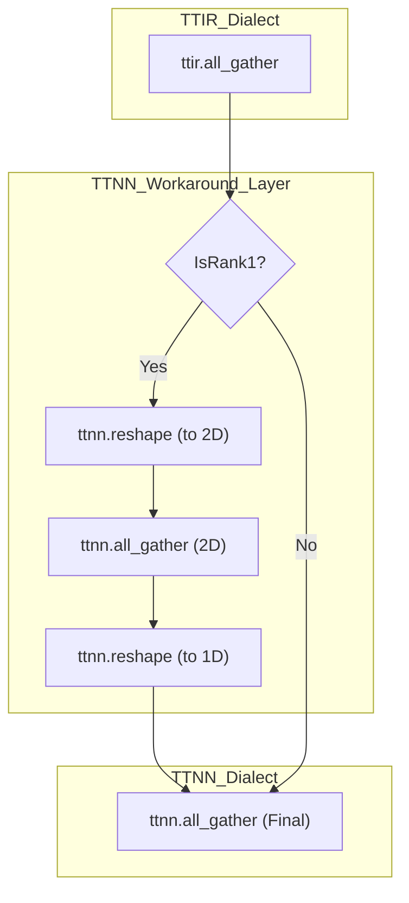
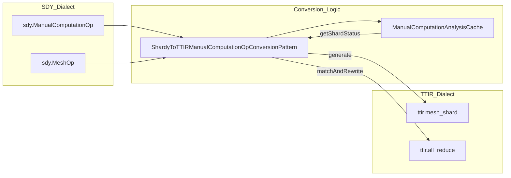

# Distributed Execution and Collective Operations

Relevant source files
*   [include/ttmlir/Dialect/StableHLO/Utils/GSPMDUtils.h](https://github.com/tenstorrent/tt-mlir/blob/c7d92e92/include/ttmlir/Dialect/StableHLO/Utils/GSPMDUtils.h)
*   [include/ttmlir/Dialect/StableHLO/Utils/ShardingUtils.h](https://github.com/tenstorrent/tt-mlir/blob/c7d92e92/include/ttmlir/Dialect/StableHLO/Utils/ShardingUtils.h)
*   [include/ttmlir/Dialect/StableHLO/Utils/ShardyUtils.h](https://github.com/tenstorrent/tt-mlir/blob/c7d92e92/include/ttmlir/Dialect/StableHLO/Utils/ShardyUtils.h)
*   [include/ttmlir/Dialect/TTNN/Transforms/Workarounds/Decomposition/AllGatherOpRewritePattern.h](https://github.com/tenstorrent/tt-mlir/blob/c7d92e92/include/ttmlir/Dialect/TTNN/Transforms/Workarounds/Decomposition/AllGatherOpRewritePattern.h)
*   [lib/Conversion/StableHLOToTTIR/ShardyToTTIRPatterns.cpp](https://github.com/tenstorrent/tt-mlir/blob/c7d92e92/lib/Conversion/StableHLOToTTIR/ShardyToTTIRPatterns.cpp)
*   [lib/Dialect/StableHLO/Transforms/AnalyzeMesh.cpp](https://github.com/tenstorrent/tt-mlir/blob/c7d92e92/lib/Dialect/StableHLO/Transforms/AnalyzeMesh.cpp)
*   [lib/Dialect/StableHLO/Transforms/ConvertXlaSdyToSdy.cpp](https://github.com/tenstorrent/tt-mlir/blob/c7d92e92/lib/Dialect/StableHLO/Transforms/ConvertXlaSdyToSdy.cpp)
*   [lib/Dialect/StableHLO/Transforms/UpdateGlobalToLocalShapes.cpp](https://github.com/tenstorrent/tt-mlir/blob/c7d92e92/lib/Dialect/StableHLO/Transforms/UpdateGlobalToLocalShapes.cpp)
*   [lib/Dialect/StableHLO/Utils/GSPMDUtils.cpp](https://github.com/tenstorrent/tt-mlir/blob/c7d92e92/lib/Dialect/StableHLO/Utils/GSPMDUtils.cpp)
*   [lib/Dialect/StableHLO/Utils/ShardyUtils.cpp](https://github.com/tenstorrent/tt-mlir/blob/c7d92e92/lib/Dialect/StableHLO/Utils/ShardyUtils.cpp)
*   [lib/Dialect/TTNN/Transforms/Workarounds/Decomposition/AllGatherOpRewritePattern.cpp](https://github.com/tenstorrent/tt-mlir/blob/c7d92e92/lib/Dialect/TTNN/Transforms/Workarounds/Decomposition/AllGatherOpRewritePattern.cpp)
*   [runtime/lib/ttnn/operations/ccl/all_gather.cpp](https://github.com/tenstorrent/tt-mlir/blob/c7d92e92/runtime/lib/ttnn/operations/ccl/all_gather.cpp)
*   [runtime/lib/ttnn/operations/ccl/reduce_scatter.cpp](https://github.com/tenstorrent/tt-mlir/blob/c7d92e92/runtime/lib/ttnn/operations/ccl/reduce_scatter.cpp)
*   [test/python/golden/test_shardy_ops_n300.py](https://github.com/tenstorrent/tt-mlir/blob/c7d92e92/test/python/golden/test_shardy_ops_n300.py)
*   [test/python/golden/ttir_ops/ccl/test_all_gather.py](https://github.com/tenstorrent/tt-mlir/blob/c7d92e92/test/python/golden/ttir_ops/ccl/test_all_gather.py)
*   [test/python/op_by_op/example_shlo_ir.mlir](https://github.com/tenstorrent/tt-mlir/blob/c7d92e92/test/python/op_by_op/example_shlo_ir.mlir)
*   [test/ttmlir/Conversion/StableHLOToTTIR/ccl/ccl_ops_gspmd.mlir](https://github.com/tenstorrent/tt-mlir/blob/c7d92e92/test/ttmlir/Conversion/StableHLOToTTIR/ccl/ccl_ops_gspmd.mlir)
*   [test/ttmlir/Conversion/StableHLOToTTIR/ccl/ccl_ops_shardy.mlir](https://github.com/tenstorrent/tt-mlir/blob/c7d92e92/test/ttmlir/Conversion/StableHLOToTTIR/ccl/ccl_ops_shardy.mlir)
*   [test/ttmlir/Conversion/StableHLOToTTIR/ccl/e2e_dp_gspmd.mlir](https://github.com/tenstorrent/tt-mlir/blob/c7d92e92/test/ttmlir/Conversion/StableHLOToTTIR/ccl/e2e_dp_gspmd.mlir)
*   [test/ttmlir/Conversion/StableHLOToTTIR/ccl/e2e_dp_shardy.mlir](https://github.com/tenstorrent/tt-mlir/blob/c7d92e92/test/ttmlir/Conversion/StableHLOToTTIR/ccl/e2e_dp_shardy.mlir)
*   [test/ttmlir/Conversion/StableHLOToTTIR/ccl/e2e_fsdp_gspmd.mlir](https://github.com/tenstorrent/tt-mlir/blob/c7d92e92/test/ttmlir/Conversion/StableHLOToTTIR/ccl/e2e_fsdp_gspmd.mlir)
*   [test/ttmlir/Conversion/StableHLOToTTIR/ccl/e2e_fsdp_shardy.mlir](https://github.com/tenstorrent/tt-mlir/blob/c7d92e92/test/ttmlir/Conversion/StableHLOToTTIR/ccl/e2e_fsdp_shardy.mlir)
*   [test/ttmlir/Conversion/StableHLOToTTIR/ccl/e2e_fsdp_tp_shardy.mlir](https://github.com/tenstorrent/tt-mlir/blob/c7d92e92/test/ttmlir/Conversion/StableHLOToTTIR/ccl/e2e_fsdp_tp_shardy.mlir)
*   [test/ttmlir/Conversion/StableHLOToTTIR/ccl/e2e_tp_shardy.mlir](https://github.com/tenstorrent/tt-mlir/blob/c7d92e92/test/ttmlir/Conversion/StableHLOToTTIR/ccl/e2e_tp_shardy.mlir)
*   [test/ttmlir/Conversion/StableHLOToTTIR/ccl/mixed_single_multi_tensors.mlir](https://github.com/tenstorrent/tt-mlir/blob/c7d92e92/test/ttmlir/Conversion/StableHLOToTTIR/ccl/mixed_single_multi_tensors.mlir)
*   [test/ttmlir/Conversion/StableHLOToTTIR/composite/test_reoutline_composite.mlir](https://github.com/tenstorrent/tt-mlir/blob/c7d92e92/test/ttmlir/Conversion/StableHLOToTTIR/composite/test_reoutline_composite.mlir)
*   [test/ttmlir/Conversion/StableHLOToTTIR/composite/test_rms_norm.mlir](https://github.com/tenstorrent/tt-mlir/blob/c7d92e92/test/ttmlir/Conversion/StableHLOToTTIR/composite/test_rms_norm.mlir)
*   [test/ttmlir/Conversion/StableHLOToTTIR/composite/test_rms_norm_weights.mlir](https://github.com/tenstorrent/tt-mlir/blob/c7d92e92/test/ttmlir/Conversion/StableHLOToTTIR/composite/test_rms_norm_weights.mlir)
*   [test/ttmlir/Conversion/StableHLOToTTIR/composite/test_uniform.mlir](https://github.com/tenstorrent/tt-mlir/blob/c7d92e92/test/ttmlir/Conversion/StableHLOToTTIR/composite/test_uniform.mlir)
*   [test/ttmlir/Dialect/StableHLO/analyze_mesh/shardy.mlir](https://github.com/tenstorrent/tt-mlir/blob/c7d92e92/test/ttmlir/Dialect/StableHLO/analyze_mesh/shardy.mlir)
*   [test/ttmlir/Dialect/StableHLO/shardy/op_propagation_registry/reduce.mlir](https://github.com/tenstorrent/tt-mlir/blob/c7d92e92/test/ttmlir/Dialect/StableHLO/shardy/op_propagation_registry/reduce.mlir)
*   [test/ttmlir/Dialect/StableHLO/shardy/op_propagation_registry/scatter.mlir](https://github.com/tenstorrent/tt-mlir/blob/c7d92e92/test/ttmlir/Dialect/StableHLO/shardy/op_propagation_registry/scatter.mlir)
*   [test/ttmlir/Dialect/StableHLO/shardy/op_propagation_registry/slice.mlir](https://github.com/tenstorrent/tt-mlir/blob/c7d92e92/test/ttmlir/Dialect/StableHLO/shardy/op_propagation_registry/slice.mlir)
*   [test/ttmlir/Dialect/StableHLO/shardy/sdy_ccls_update_shapes.mlir](https://github.com/tenstorrent/tt-mlir/blob/c7d92e92/test/ttmlir/Dialect/StableHLO/shardy/sdy_ccls_update_shapes.mlir)
*   [test/ttmlir/Dialect/StableHLO/xla_sdy_to_sdy/round_trip_attributes.mlir](https://github.com/tenstorrent/tt-mlir/blob/c7d92e92/test/ttmlir/Dialect/StableHLO/xla_sdy_to_sdy/round_trip_attributes.mlir)
*   [test/ttmlir/Dialect/TTNN/Transforms/Workarounds/all_gather_1d_workaround.mlir](https://github.com/tenstorrent/tt-mlir/blob/c7d92e92/test/ttmlir/Dialect/TTNN/Transforms/Workarounds/all_gather_1d_workaround.mlir)
*   [test/ttmlir/Dialect/TTNN/ccl/all_gather/all_gather_positive.mlir](https://github.com/tenstorrent/tt-mlir/blob/c7d92e92/test/ttmlir/Dialect/TTNN/ccl/all_gather/all_gather_positive.mlir)
*   [test/ttmlir/Dialect/TTNN/ccl/all_reduce/all_reduce_positive.mlir](https://github.com/tenstorrent/tt-mlir/blob/c7d92e92/test/ttmlir/Dialect/TTNN/ccl/all_reduce/all_reduce_positive.mlir)
*   [test/ttmlir/Dialect/TTNN/ccl/mesh_shard.mlir](https://github.com/tenstorrent/tt-mlir/blob/c7d92e92/test/ttmlir/Dialect/TTNN/ccl/mesh_shard.mlir)
*   [test/ttmlir/Dialect/TTNN/ccl/reduce_scatter/reduce_scatter_positive.mlir](https://github.com/tenstorrent/tt-mlir/blob/c7d92e92/test/ttmlir/Dialect/TTNN/ccl/reduce_scatter/reduce_scatter_positive.mlir)
*   [test/ttmlir/Silicon/StableHLO/llmbox/sdy_all_slice.mlir](https://github.com/tenstorrent/tt-mlir/blob/c7d92e92/test/ttmlir/Silicon/StableHLO/llmbox/sdy_all_slice.mlir)
*   [test/ttmlir/Silicon/StableHLO/llmbox/sdy_scatter.mlir](https://github.com/tenstorrent/tt-mlir/blob/c7d92e92/test/ttmlir/Silicon/StableHLO/llmbox/sdy_scatter.mlir)
*   [test/ttmlir/Silicon/StableHLO/n300/sdy_all_slice.mlir](https://github.com/tenstorrent/tt-mlir/blob/c7d92e92/test/ttmlir/Silicon/StableHLO/n300/sdy_all_slice.mlir)
*   [test/ttmlir/Silicon/StableHLO/n300/sdy_fill_cache1x2.mlir](https://github.com/tenstorrent/tt-mlir/blob/c7d92e92/test/ttmlir/Silicon/StableHLO/n300/sdy_fill_cache1x2.mlir)
*   [test/ttmlir/Silicon/TTNN/llmbox/perf/all_gather.mlir](https://github.com/tenstorrent/tt-mlir/blob/c7d92e92/test/ttmlir/Silicon/TTNN/llmbox/perf/all_gather.mlir)
*   [test/ttmlir/Silicon/TTNN/llmbox/perf/all_reduce.mlir](https://github.com/tenstorrent/tt-mlir/blob/c7d92e92/test/ttmlir/Silicon/TTNN/llmbox/perf/all_reduce.mlir)
*   [test/ttmlir/Silicon/TTNN/n300/perf/all_gather.mlir](https://github.com/tenstorrent/tt-mlir/blob/c7d92e92/test/ttmlir/Silicon/TTNN/n300/perf/all_gather.mlir)
*   [test/ttmlir/Silicon/TTNN/n300/perf/all_reduce.mlir](https://github.com/tenstorrent/tt-mlir/blob/c7d92e92/test/ttmlir/Silicon/TTNN/n300/perf/all_reduce.mlir)
*   [test/ttmlir/Silicon/TTNN/tg/perf/all_gather.mlir](https://github.com/tenstorrent/tt-mlir/blob/c7d92e92/test/ttmlir/Silicon/TTNN/tg/perf/all_gather.mlir)
*   [test/ttmlir/Silicon/TTNN/tg/perf/all_reduce.mlir](https://github.com/tenstorrent/tt-mlir/blob/c7d92e92/test/ttmlir/Silicon/TTNN/tg/perf/all_reduce.mlir)

Distributed execution in `tt-mlir` enables scaling model workloads across a mesh of Tenstorrent devices. This infrastructure leverages MLIR-based abstractions to represent device meshes, sharding strategies, and collective communication operations (CCL). The system supports automatic parallelization through integration with Shardy and provides a robust lowering path for collective operations like `all_reduce`, `all_gather`, and `reduce_scatter`.

## Overview and Multi-Device Mesh

The compilation pipeline treats a cluster of Tenstorrent devices as a logical mesh. High-level sharding intent is captured during the conversion from frontend dialects (like StableHLO or Shardy) into `TTIR`.

### Shardy Integration

`tt-mlir` integrates with Shardy to handle GSPMD-style (Guided Single Program, Multiple Data) parallelism. The compiler processes `sdy.mesh` and `sdy.manual_computation` blocks to determine how tensors are distributed across the hardware grid [lib/Conversion/StableHLOToTTIR/ShardyToTTIRPatterns.cpp 167-174](https://github.com/tenstorrent/tt-mlir/blob/c7d92e92/lib/Conversion/StableHLOToTTIR/ShardyToTTIRPatterns.cpp#L167-L174)

The pipeline includes utilities in `ShardyUtils.cpp` for normalizing meshes and extracting mesh shapes from `sdy::MeshAttr`[lib/Dialect/StableHLO/Utils/ShardyUtils.cpp 72-81](https://github.com/tenstorrent/tt-mlir/blob/c7d92e92/lib/Dialect/StableHLO/Utils/ShardyUtils.cpp#L72-L81) The `normalizeMeshTo2D` function ensures that 0D or 1D meshes are promoted to 2D for consistent hardware mapping [lib/Dialect/StableHLO/Utils/ShardyUtils.cpp 105-141](https://github.com/tenstorrent/tt-mlir/blob/c7d92e92/lib/Dialect/StableHLO/Utils/ShardyUtils.cpp#L105-L141) The `ManualComputationAnalysisCache` class is used to track the `ShardStatus` (e.g., `Unsharded`, `Sharded`) of arguments and results within a manual computation block by inspecting operation attributes [lib/Conversion/StableHLOToTTIR/ShardyToTTIRPatterns.cpp 44-62](https://github.com/tenstorrent/tt-mlir/blob/c7d92e92/lib/Conversion/StableHLOToTTIR/ShardyToTTIRPatterns.cpp#L44-L62) This analysis informs the insertion of `ttir.mesh_shard` operations [lib/Conversion/StableHLOToTTIR/ShardyToTTIRPatterns.cpp 177-185](https://github.com/tenstorrent/tt-mlir/blob/c7d92e92/lib/Conversion/StableHLOToTTIR/ShardyToTTIRPatterns.cpp#L177-L185)

### Mesh Sharding Operations

Sharding is explicitly represented in the IR via the `mesh_shard` operation, which supports different directions and types:

*   **Direction**: `FullToShardShape` (scattering/distributing) or `ShardToFullShape` (gathering/aggregating) [lib/Conversion/StableHLOToTTIR/ShardyToTTIRPatterns.cpp 182-185](https://github.com/tenstorrent/tt-mlir/blob/c7d92e92/lib/Conversion/StableHLOToTTIR/ShardyToTTIRPatterns.cpp#L182-L185)
*   **Type**: `Devices` (distributed across mesh), `Replicate` (copied across mesh), or `Identity`[lib/Dialect/StableHLO/Utils/ShardingUtils.h 69-74](https://github.com/tenstorrent/tt-mlir/blob/c7d92e92/lib/Dialect/StableHLO/Utils/ShardingUtils.h#L69-L74)

In the runtime, the `ttnn` backend handles sharding through `ttnn.distribute_tensor`, which maps logical placements to physical device grids [test/ttmlir/Dialect/TTNN/ccl/mesh_shard.mlir 10-14](https://github.com/tenstorrent/tt-mlir/blob/c7d92e92/test/ttmlir/Dialect/TTNN/ccl/mesh_shard.mlir#L10-L14)

Sources: [lib/Conversion/StableHLOToTTIR/ShardyToTTIRPatterns.cpp 44-185](https://github.com/tenstorrent/tt-mlir/blob/c7d92e92/lib/Conversion/StableHLOToTTIR/ShardyToTTIRPatterns.cpp#L44-L185)[lib/Dialect/StableHLO/Utils/ShardyUtils.cpp 72-141](https://github.com/tenstorrent/tt-mlir/blob/c7d92e92/lib/Dialect/StableHLO/Utils/ShardyUtils.cpp#L72-L141)[lib/Dialect/StableHLO/Utils/ShardingUtils.h 50-85](https://github.com/tenstorrent/tt-mlir/blob/c7d92e92/lib/Dialect/StableHLO/Utils/ShardingUtils.h#L50-L85)[test/ttmlir/Dialect/TTNN/ccl/mesh_shard.mlir 1-14](https://github.com/tenstorrent/tt-mlir/blob/c7d92e92/test/ttmlir/Dialect/TTNN/ccl/mesh_shard.mlir#L1-L14)

## Collective Communication Operations (CCL)

Collective operations are defined in the `TTIR` dialect and lowered to the `TTNN` dialect for execution on the device mesh.

### Collective Lowering Flow

| Op | TTIR Definition | TTNN Lowering Target | Implementation File |
| --- | --- | --- | --- |
| **AllGather** | `ttir.all_gather` | `ttnn.all_gather` | [runtime/lib/ttnn/operations/ccl/all_gather.cpp 17-49](https://github.com/tenstorrent/tt-mlir/blob/c7d92e92/runtime/lib/ttnn/operations/ccl/all_gather.cpp#L17-L49) |
| **ReduceScatter** | `ttir.reduce_scatter` | `ttnn.reduce_scatter` | [runtime/lib/ttnn/operations/ccl/reduce_scatter.cpp 18-70](https://github.com/tenstorrent/tt-mlir/blob/c7d92e92/runtime/lib/ttnn/operations/ccl/reduce_scatter.cpp#L18-L70) |
| **AllReduce** | `ttir.all_reduce` | `ttnn.reduce_scatter` + `ttnn.all_gather` | [test/ttmlir/Dialect/TTNN/ccl/all_reduce/all_reduce_positive.mlir 11-14](https://github.com/tenstorrent/tt-mlir/blob/c7d92e92/test/ttmlir/Dialect/TTNN/ccl/all_reduce/all_reduce_positive.mlir#L11-L14) |

### AllReduce Decomposition

The `all_reduce` operation is typically decomposed into a `reduce_scatter` followed by an `all_gather` to optimize bandwidth and memory usage [test/ttmlir/Dialect/TTNN/ccl/all_reduce/all_reduce_positive.mlir 11-14](https://github.com/tenstorrent/tt-mlir/blob/c7d92e92/test/ttmlir/Dialect/TTNN/ccl/all_reduce/all_reduce_positive.mlir#L11-L14)

*   **Divisibility**: The compiler picks the last divisible dimension for the scatter/gather operations [test/ttmlir/Dialect/TTNN/ccl/all_reduce/all_reduce_positive.mlir 105-114](https://github.com/tenstorrent/tt-mlir/blob/c7d92e92/test/ttmlir/Dialect/TTNN/ccl/all_reduce/all_reduce_positive.mlir#L105-L114)
*   **Fallback**: If memory limits are exceeded (e.g., >5% of DRAM capacity), the breakdown of `reduce_scatter` + `all_gather` is enforced over local reduction [test/ttmlir/Dialect/TTNN/ccl/all_reduce/all_reduce_positive.mlir 88-96](https://github.com/tenstorrent/tt-mlir/blob/c7d92e92/test/ttmlir/Dialect/TTNN/ccl/all_reduce/all_reduce_positive.mlir#L88-L96)

### CCL Runtime Execution

At runtime, the `ttnn` backend dispatches these operations using the `ttnn::all_gather` and `ttnn::reduce_scatter` host APIs. These functions accept parameters such as `cluster_axis` (defining the mesh dimension for communication), `num_links`, `topology`, and `compute_kernel_config`[runtime/lib/ttnn/operations/ccl/reduce_scatter.cpp 60-67](https://github.com/tenstorrent/tt-mlir/blob/c7d92e92/runtime/lib/ttnn/operations/ccl/reduce_scatter.cpp#L60-L67)

Sources: [test/ttmlir/Dialect/TTNN/ccl/all_reduce/all_reduce_positive.mlir 11-145](https://github.com/tenstorrent/tt-mlir/blob/c7d92e92/test/ttmlir/Dialect/TTNN/ccl/all_reduce/all_reduce_positive.mlir#L11-L145)[runtime/lib/ttnn/operations/ccl/reduce_scatter.cpp 18-70](https://github.com/tenstorrent/tt-mlir/blob/c7d92e92/runtime/lib/ttnn/operations/ccl/reduce_scatter.cpp#L18-L70)[runtime/lib/ttnn/operations/ccl/all_gather.cpp 17-49](https://github.com/tenstorrent/tt-mlir/blob/c7d92e92/runtime/lib/ttnn/operations/ccl/all_gather.cpp#L17-L49)

## Automatic Parallelization with Shardy

The compiler utilizes `AnalyzeMesh.cpp` to automatically shard inputs based on batch parallelism if no explicit sharding hints are provided.

### Batch Parallelism Analysis

The `BatchParallelismArgumentAnalysis` class identifies the largest rank among input tensors and shards across the batch dimension (dimension 0) [lib/Dialect/StableHLO/Transforms/AnalyzeMesh.cpp 48-58](https://github.com/tenstorrent/tt-mlir/blob/c7d92e92/lib/Dialect/StableHLO/Transforms/AnalyzeMesh.cpp#L48-L58)

1.   **Dimension Sharding**: It creates `mlir::sdy::DimensionShardingAttr` for the batch dimension, mapping it to a "batch" axis in the mesh [lib/Dialect/StableHLO/Transforms/AnalyzeMesh.cpp 80-86](https://github.com/tenstorrent/tt-mlir/blob/c7d92e92/lib/Dialect/StableHLO/Transforms/AnalyzeMesh.cpp#L80-L86)
2.   **Attribute Injection**: The resulting `sdy.sharding` annotation is injected into the `func.func` argument attributes [lib/Dialect/StableHLO/Transforms/AnalyzeMesh.cpp 100-106](https://github.com/tenstorrent/tt-mlir/blob/c7d92e92/lib/Dialect/StableHLO/Transforms/AnalyzeMesh.cpp#L100-L106)

### Global-to-Local Shape Updates

After sharding decisions are made, the `UpdateGlobalToLocalShapes` pass transforms the IR from global tensor shapes to the local shapes seen by each device [lib/Dialect/StableHLO/Transforms/UpdateGlobalToLocalShapes.cpp 23-26](https://github.com/tenstorrent/tt-mlir/blob/c7d92e92/lib/Dialect/StableHLO/Transforms/UpdateGlobalToLocalShapes.cpp#L23-L26) This involves:

*   **Constant Slicing**: Non-splat constants are sliced so each device only holds its relevant shard [lib/Dialect/StableHLO/Transforms/UpdateGlobalToLocalShapes.cpp 61-65](https://github.com/tenstorrent/tt-mlir/blob/c7d92e92/lib/Dialect/StableHLO/Transforms/UpdateGlobalToLocalShapes.cpp#L61-L65)
*   **Slice/Gather Adjustment**: Attributes for operations like `stablehlo.slice` are updated to local coordinates [lib/Dialect/StableHLO/Transforms/UpdateGlobalToLocalShapes.cpp 85-112](https://github.com/tenstorrent/tt-mlir/blob/c7d92e92/lib/Dialect/StableHLO/Transforms/UpdateGlobalToLocalShapes.cpp#L85-L112)

Sources: [lib/Dialect/StableHLO/Transforms/AnalyzeMesh.cpp 39-107](https://github.com/tenstorrent/tt-mlir/blob/c7d92e92/lib/Dialect/StableHLO/Transforms/AnalyzeMesh.cpp#L39-L107)[lib/Dialect/StableHLO/Utils/ShardyUtils.cpp 153-278](https://github.com/tenstorrent/tt-mlir/blob/c7d92e92/lib/Dialect/StableHLO/Utils/ShardyUtils.cpp#L153-L278)[lib/Dialect/StableHLO/Transforms/UpdateGlobalToLocalShapes.cpp 23-112](https://github.com/tenstorrent/tt-mlir/blob/c7d92e92/lib/Dialect/StableHLO/Transforms/UpdateGlobalToLocalShapes.cpp#L23-L112)

## Hardware Workarounds and Decomposition

Due to hardware or backend library limitations, certain collective operations require transformation before execution.

### AllGather 1D Workaround

The `ttnn::all_gather` implementation in the underlying metal library currently does not support 1D tensors [include/ttmlir/Dialect/TTNN/Transforms/Workarounds/Decomposition/AllGatherOpRewritePattern.h 15-18](https://github.com/tenstorrent/tt-mlir/blob/c7d92e92/include/ttmlir/Dialect/TTNN/Transforms/Workarounds/Decomposition/AllGatherOpRewritePattern.h#L15-L18) The `AllGatherOpRewritePattern` handles this by:

1.   Reshaping the 1D tensor to 2D (adding a leading dimension of size 1) [lib/Dialect/TTNN/Transforms/Workarounds/Decomposition/AllGatherOpRewritePattern.cpp 31-53](https://github.com/tenstorrent/tt-mlir/blob/c7d92e92/lib/Dialect/TTNN/Transforms/Workarounds/Decomposition/AllGatherOpRewritePattern.cpp#L31-L53)
2.   Executing the `all_gather` on the 2D tensor with an adjusted dimension index [lib/Dialect/TTNN/Transforms/Workarounds/Decomposition/AllGatherOpRewritePattern.cpp 61-65](https://github.com/tenstorrent/tt-mlir/blob/c7d92e92/lib/Dialect/TTNN/Transforms/Workarounds/Decomposition/AllGatherOpRewritePattern.cpp#L61-L65)
3.   Reshaping the result back to 1D [lib/Dialect/TTNN/Transforms/Workarounds/Decomposition/AllGatherOpRewritePattern.cpp 68-71](https://github.com/tenstorrent/tt-mlir/blob/c7d92e92/lib/Dialect/TTNN/Transforms/Workarounds/Decomposition/AllGatherOpRewritePattern.cpp#L68-L71)

Sources: [include/ttmlir/Dialect/TTNN/Transforms/Workarounds/Decomposition/AllGatherOpRewritePattern.h 15-18](https://github.com/tenstorrent/tt-mlir/blob/c7d92e92/include/ttmlir/Dialect/TTNN/Transforms/Workarounds/Decomposition/AllGatherOpRewritePattern.h#L15-L18)[lib/Dialect/TTNN/Transforms/Workarounds/Decomposition/AllGatherOpRewritePattern.cpp 31-71](https://github.com/tenstorrent/tt-mlir/blob/c7d92e92/lib/Dialect/TTNN/Transforms/Workarounds/Decomposition/AllGatherOpRewritePattern.cpp#L31-L71)

## System Architecture Diagrams

### CCL Lowering and Workaround Pipeline

This diagram shows how a high-level `ttir.all_gather` is processed through workarounds into executable `ttnn` operations.

Title: CCL Lowering and Workaround Pipeline

Sources: [lib/Dialect/TTNN/Transforms/Workarounds/Decomposition/AllGatherOpRewritePattern.cpp 14-74](https://github.com/tenstorrent/tt-mlir/blob/c7d92e92/lib/Dialect/TTNN/Transforms/Workarounds/Decomposition/AllGatherOpRewritePattern.cpp#L14-L74)[runtime/lib/ttnn/operations/ccl/all_gather.cpp 17-49](https://github.com/tenstorrent/tt-mlir/blob/c7d92e92/runtime/lib/ttnn/operations/ccl/all_gather.cpp#L17-L49)



Sources: [lib/Dialect/TTNN/Transforms/Workarounds/Decomposition/AllGatherOpRewritePattern.cpp:14-74](), [runtime/lib/ttnn/operations/ccl/all_gather.cpp:17-49]().
```
### Shardy to TTIR Conversion Logic

The following diagram maps the conversion from Shardy manual computations to TTIR mesh-aware operations using the analysis cache.

Title: Shardy to TTIR Conversion Logic

Sources: [lib/Conversion/StableHLOToTTIR/ShardyToTTIRPatterns.cpp 44-52](https://github.com/tenstorrent/tt-mlir/blob/c7d92e92/lib/Conversion/StableHLOToTTIR/ShardyToTTIRPatterns.cpp#L44-L52)[lib/Conversion/StableHLOToTTIR/ShardyToTTIRPatterns.cpp 149-185](https://github.com/tenstorrent/tt-mlir/blob/c7d92e92/lib/Conversion/StableHLOToTTIR/ShardyToTTIRPatterns.cpp#L149-L185)



Sources: [lib/Conversion/StableHLOToTTIR/ShardyToTTIRPatterns.cpp:44-52](), [lib/Conversion/StableHLOToTTIR/ShardyToTTIRPatterns.cpp:149-185]().
```
## Distributed Runtime Architecture

The runtime executes collective operations across a mesh by managing `ProgramContext` and `ProgramTensorPool`.

### Collective Operation Dispatch

The `run` functions for CCL operations (e.g., in `all_gather.cpp` and `reduce_scatter.cpp`) perform the following:

1.   **Tensor Validation**: Retrieves the input tensor from the `ProgramTensorPool` using `getTTNNTensorAndValidate` and ensures it is resident on the device [runtime/lib/ttnn/operations/ccl/all_gather.cpp 18-25](https://github.com/tenstorrent/tt-mlir/blob/c7d92e92/runtime/lib/ttnn/operations/ccl/all_gather.cpp#L18-L25)
2.   **Configuration Mapping**: Converts Flatbuffer-encoded attributes (like `topology` or `memory_config`) into native `ttnn` and `tt_fabric` types [runtime/lib/ttnn/operations/ccl/reduce_scatter.cpp 48-58](https://github.com/tenstorrent/tt-mlir/blob/c7d92e92/runtime/lib/ttnn/operations/ccl/reduce_scatter.cpp#L48-L58)
3.   **API Invocation**: Calls the multi-device `ttnn::all_gather` or `ttnn::reduce_scatter` APIs [runtime/lib/ttnn/operations/ccl/reduce_scatter.cpp 60-67](https://github.com/tenstorrent/tt-mlir/blob/c7d92e92/runtime/lib/ttnn/operations/ccl/reduce_scatter.cpp#L60-L67)

Sources: [runtime/lib/ttnn/operations/ccl/all_gather.cpp 17-49](https://github.com/tenstorrent/tt-mlir/blob/c7d92e92/runtime/lib/ttnn/operations/ccl/all_gather.cpp#L17-L49)[runtime/lib/ttnn/operations/ccl/reduce_scatter.cpp 18-70](https://github.com/tenstorrent/tt-mlir/blob/c7d92e92/runtime/lib/ttnn/operations/ccl/reduce_scatter.cpp#L18-L70)

Dismiss
Refresh this wiki

Enter email to refresh
