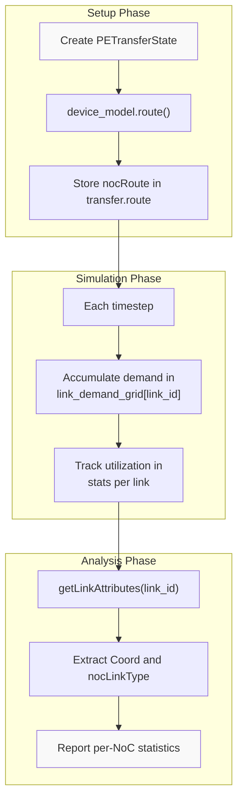

# Routing Algorithms and Link Lookup

Relevant source files
*   [tt_npe/cpp/include/device_models/blackhole.hpp](https://github.com/tenstorrent/tt-npe/blob/d1c8b91a/tt_npe/cpp/include/device_models/blackhole.hpp)
*   [tt_npe/cpp/include/device_models/wormhole_b0.hpp](https://github.com/tenstorrent/tt-npe/blob/d1c8b91a/tt_npe/cpp/include/device_models/wormhole_b0.hpp)
*   [tt_npe/cpp/include/device_models/wormhole_multichip.hpp](https://github.com/tenstorrent/tt-npe/blob/d1c8b91a/tt_npe/cpp/include/device_models/wormhole_multichip.hpp)
*   [tt_npe/cpp/include/npeDeviceModelIface.hpp](https://github.com/tenstorrent/tt-npe/blob/d1c8b91a/tt_npe/cpp/include/npeDeviceModelIface.hpp)
*   [tt_npe/cpp/include/npeDeviceModelUtils.hpp](https://github.com/tenstorrent/tt-npe/blob/d1c8b91a/tt_npe/cpp/include/npeDeviceModelUtils.hpp)
*   [tt_npe/cpp/include/npeStats.hpp](https://github.com/tenstorrent/tt-npe/blob/d1c8b91a/tt_npe/cpp/include/npeStats.hpp)

This page documents the routing algorithms used to determine NoC paths and the lookup table systems that map between physical coordinates and abstract resource identifiers. For information about the device model interface and architecture-specific parameters, see [Device Model Interface](https://deepwiki.com/tenstorrent/tt-npe/5.1-device-model-interface). For congestion modeling that operates on routed paths, see [Congestion Modeling](https://deepwiki.com/tenstorrent/tt-npe/4.4-congestion-modeling).

## Purpose and Scope

This page covers:

*   Link and NIU lookup table architecture used to convert between attributes and integer IDs
*   Unicast routing algorithms for NOC0 and NOC1 with X-Y and Y-X dimension ordering
*   Multicast routing implementation for rectangular destination grids
*   Multi-chip routing path elaboration
*   Implementation details across Wormhole B0, Blackhole, and multi-chip device models

## Routing System Overview

The routing system in tt-npe determines the physical path that NoC packets take from source to destination(s). Each device model implements the `route()` method from the `npeDeviceModel` interface, which returns a `nocRoute` — a vector of `nocLinkID` values representing the sequence of links traversed.

**Sources:**[tt_npe/cpp/include/npeDeviceModelIface.hpp 27-29](https://github.com/tenstorrent/tt-npe/blob/d1c8b91a/tt_npe/cpp/include/npeDeviceModelIface.hpp#L27-L29)[tt_npe/cpp/include/device_models/wormhole_b0.hpp 309-346](https://github.com/tenstorrent/tt-npe/blob/d1c8b91a/tt_npe/cpp/include/device_models/wormhole_b0.hpp#L309-L346)

## Link and NIU Lookup Tables

Device models maintain bidirectional lookup tables to convert between physical attributes and abstract integer IDs. This indirection enables efficient array-based storage of per-link and per-NIU state during simulation.

### Link Lookup Architecture

The link lookup system consists of two complementary data structures:

| Data Structure | Type | Purpose |
| --- | --- | --- |
| `link_id_to_attr_lookup` | `std::vector<nocLinkAttr>` | Maps link ID → attributes |
| `link_attr_to_id_lookup` | `boost::unordered_flat_map<nocLinkAttr, nocLinkID>` | Maps attributes → link ID |

Each `nocLinkAttr` contains a `Coord` (device_id, row, col) and a `nocLinkType` (NOC0_EAST, NOC0_SOUTH, NOC1_NORTH, NOC1_WEST).

**Sources:**[tt_npe/cpp/include/device_models/wormhole_b0.hpp 440-443](https://github.com/tenstorrent/tt-npe/blob/d1c8b91a/tt_npe/cpp/include/device_models/wormhole_b0.hpp#L440-L443)[tt_npe/cpp/include/device_models/wormhole_b0.hpp 248-256](https://github.com/tenstorrent/tt-npe/blob/d1c8b91a/tt_npe/cpp/include/device_models/wormhole_b0.hpp#L248-L256)

### NIU Lookup Architecture

Network Interface Units (NIUs) use an identical lookup pattern:

| Data Structure | Type | Purpose |
| --- | --- | --- |
| `niu_id_to_attr_lookup` | `std::vector<nocNIUAttr>` | Maps NIU ID → attributes |
| `niu_attr_to_id_lookup` | `boost::unordered_flat_map<nocNIUAttr, nocNIUID>` | Maps attributes → NIU ID |

Each `nocNIUAttr` contains a `Coord` and a `nocNIUType` (NOC0_SRC, NOC0_SINK, NOC1_SRC, NOC1_SINK).

**Sources:**[tt_npe/cpp/include/device_models/wormhole_b0.hpp 442-443](https://github.com/tenstorrent/tt-npe/blob/d1c8b91a/tt_npe/cpp/include/device_models/wormhole_b0.hpp#L442-L443)[tt_npe/cpp/include/device_models/wormhole_b0.hpp 258-274](https://github.com/tenstorrent/tt-npe/blob/d1c8b91a/tt_npe/cpp/include/device_models/wormhole_b0.hpp#L258-L274)

### Lookup Table Population

Lookup tables are populated during device model construction by iterating over all grid positions and resource types:

For Wormhole B0 (12×10 grid) with 4 link types per location, this creates 12 × 10 × 4 = 480 link mappings. For multi-chip models, this is multiplied by the number of chips.

**Sources:**[tt_npe/cpp/include/device_models/wormhole_b0.hpp 27-37](https://github.com/tenstorrent/tt-npe/blob/d1c8b91a/tt_npe/cpp/include/device_models/wormhole_b0.hpp#L27-L37)[tt_npe/cpp/include/device_models/wormhole_multichip.hpp 29-41](https://github.com/tenstorrent/tt-npe/blob/d1c8b91a/tt_npe/cpp/include/device_models/wormhole_multichip.hpp#L29-L41)

## Unicast Routing Algorithms

Unicast routing computes a path from a single source to a single destination. The algorithm uses **dimension-ordered routing** where one dimension is traversed completely before moving to the next dimension.

### NOC0 Routing: X-Y Dimension Ordering

NOC0 uses **X-first, then Y** ordering (East before South):

1.   Move **East** (increment column with wraparound) until reaching destination column
2.   Move **South** (increment row with wraparound) until reaching destination row

**Sources:**[tt_npe/cpp/include/device_models/wormhole_b0.hpp 318-330](https://github.com/tenstorrent/tt-npe/blob/d1c8b91a/tt_npe/cpp/include/device_models/wormhole_b0.hpp#L318-L330)

### NOC1 Routing: Y-X Dimension Ordering

NOC1 uses **Y-first, then X** ordering (North before West):

1.   Move **North** (decrement row with wraparound) until reaching destination row
2.   Move **West** (decrement column with wraparound) until reaching destination column

**Sources:**[tt_npe/cpp/include/device_models/wormhole_b0.hpp 331-344](https://github.com/tenstorrent/tt-npe/blob/d1c8b91a/tt_npe/cpp/include/device_models/wormhole_b0.hpp#L331-L344)

### Routing Example: NOC0 vs NOC1

Consider routing from (1,1) to (3,4) on a 12×10 Wormhole B0 grid:

| NoC Type | Path | Link Sequence |
| --- | --- | --- |
| NOC0 | (1,1) → (1,2) → (1,3) → (1,4) → (2,4) → (3,4) | NOC0_EAST × 3, NOC0_SOUTH × 2 |
| NOC1 | (1,1) → (2,1) → (3,1) → (3,0) → (3,9) → (3,8) → ... → (3,4) | NOC1_NORTH × 2 (wraps), NOC1_WEST × 7 (wraps) |

Note: NOC1 wraps around in both dimensions due to its backwards direction on a toroidal mesh.

**Sources:**[tt_npe/cpp/include/device_models/wormhole_b0.hpp 309-346](https://github.com/tenstorrent/tt-npe/blob/d1c8b91a/tt_npe/cpp/include/device_models/wormhole_b0.hpp#L309-L346)

## Multicast Routing

Multicast routing targets a rectangular grid of destinations specified by a `MulticastCoordSet`. The implementation creates a **tree of paths** by routing to strategic endpoints and collecting all unique links traversed.

### Multicast Algorithm

For NOC0:

*   Route to each **column** in the destination grid at the **end row**
*   Collect all unique links from these routes

For NOC1:

*   Route to each **row** in the destination grid at the **end column**
*   Collect all unique links from these routes

This algorithm ensures that all destinations in the rectangular grid receive the multicast packet via the tree structure created by the unique set of links.

**Sources:**[tt_npe/cpp/include/device_models/wormhole_b0.hpp 348-376](https://github.com/tenstorrent/tt-npe/blob/d1c8b91a/tt_npe/cpp/include/device_models/wormhole_b0.hpp#L348-L376)

### Multicast Grid Structure

The `MulticastCoordSet` contains a vector of `coord_grids`, where each grid specifies a `start_coord` and `end_coord` defining a rectangle. For single-chip multicasts, this vector has exactly one element.

**Sources:**[tt_npe/cpp/include/device_models/wormhole_b0.hpp 353-357](https://github.com/tenstorrent/tt-npe/blob/d1c8b91a/tt_npe/cpp/include/device_models/wormhole_b0.hpp#L353-L357)

## Multi-chip Routing

The `WormholeMultichipDeviceModel` extends routing to handle multiple chips by maintaining separate lookup tables for each chip and delegating actual path computation to a wrapped single-chip model.

### Device ID Substitution

Multi-chip routing follows these steps:

1.   **Validate** that source and destination(s) are on the same device
2.   **Route** using the wrapped `WormholeB0DeviceModel` (which assumes device_id=0)
3.   **Substitute** the correct device_id into each link's attributes

**Sources:**[tt_npe/cpp/include/device_models/wormhole_multichip.hpp 71-81](https://github.com/tenstorrent/tt-npe/blob/d1c8b91a/tt_npe/cpp/include/device_models/wormhole_multichip.hpp#L71-L81)[tt_npe/cpp/include/device_models/wormhole_multichip.hpp 58-68](https://github.com/tenstorrent/tt-npe/blob/d1c8b91a/tt_npe/cpp/include/device_models/wormhole_multichip.hpp#L58-L68)

### Multi-chip Link Lookups

Multi-chip models populate lookup tables for all chips during construction:

```
for device_id in <FileRef file-url="https://github.com/tenstorrent/tt-npe/blob/d1c8b91a/0, num_chips)#LNaN-LNaN" NaN  file-path="0, num_chips)">Hii</FileRef>

## Architecture-Specific Implementations

### Wormhole B0

- **Grid dimensions:** 12 rows × 10 columns
- **Link types:** NOC0_EAST, NOC0_SOUTH, NOC1_NORTH, NOC1_WEST
- **Total links (single chip):** 480
- **Routing:** Identical algorithm for all core types

**Sources:** <FileRef file-url="https://github.com/tenstorrent/tt-npe/blob/d1c8b91a/tt_npe/cpp/include/device_models/wormhole_b0.hpp#L434-L435" min=434 max=435 file-path="tt_npe/cpp/include/device_models/wormhole_b0.hpp">Hii</FileRef> <FileRef file-url="https://github.com/tenstorrent/tt-npe/blob/d1c8b91a/tt_npe/cpp/include/device_models/wormhole_b0.hpp#L444-L448" min=444 max=448 file-path="tt_npe/cpp/include/device_models/wormhole_b0.hpp">Hii</FileRef>

### Blackhole

- **Grid dimensions:** 12 rows × 17 columns
- **Link types:** NOC0_EAST, NOC0_SOUTH, NOC1_NORTH, NOC1_WEST (same as Wormhole)
- **Total links (single chip):** 816
- **Routing:** Same dimension-ordered algorithm as Wormhole B0

**Sources:** <FileRef file-url="https://github.com/tenstorrent/tt-npe/blob/d1c8b91a/tt_npe/cpp/include/device_models/blackhole.hpp#L446-L447" min=446 max=447 file-path="tt_npe/cpp/include/device_models/blackhole.hpp">Hii</FileRef> <FileRef file-url="https://github.com/tenstorrent/tt-npe/blob/d1c8b91a/tt_npe/cpp/include/device_models/blackhole.hpp#L457-L461" min=457 max=461 file-path="tt_npe/cpp/include/device_models/blackhole.hpp">Hii</FileRef>

## Routing Performance Characteristics

### Path Length Calculation

The number of hops in a route can be computed using modular arithmetic:
```

NOC0_hops = modulo(dst_col - src_col, num_cols) + modulo(dst_row - src_row, num_rows) NOC1_hops = modulo(src_col - dst_col, num_cols) + modulo(src_row - dst_row, num_rows)

```
These static methods are provided in both device models for latency estimation:

**Sources:** <FileRef file-url="https://github.com/tenstorrent/tt-npe/blob/d1c8b91a/tt_npe/cpp/include/device_models/wormhole_b0.hpp#L393-L407" min=393 max=407 file-path="tt_npe/cpp/include/device_models/wormhole_b0.hpp">Hii</FileRef> <FileRef file-url="https://github.com/tenstorrent/tt-npe/blob/d1c8b91a/tt_npe/cpp/include/device_models/blackhole.hpp#L405-L419" min=405 max=419 file-path="tt_npe/cpp/include/device_models/blackhole.hpp">Hii</FileRef>

### Lookup Performance

| Operation | Time Complexity | Data Structure |
|-----------|-----------------|----------------|
| `getLinkAttributes(id)` | O(1) | Vector indexing |
| `getLinkID(attr)` | O(1) average | Hash map lookup |
| `getNIUAttributes(id)` | O(1) | Vector indexing |
| `getNIUID(attr)` | O(1) average | Hash map lookup |

The use of `boost::unordered_flat_map` provides cache-friendly hash map performance.

**Sources:** <FileRef file-url="https://github.com/tenstorrent/tt-npe/blob/d1c8b91a/tt_npe/cpp/include/device_models/wormhole_b0.hpp#L243-L256" min=243 max=256 file-path="tt_npe/cpp/include/device_models/wormhole_b0.hpp">Hii</FileRef> <FileRef file-url="https://github.com/tenstorrent/tt-npe/blob/d1c8b91a/tt_npe/cpp/include/device_models/wormhole_b0.hpp#L258-L274" min=258 max=274 file-path="tt_npe/cpp/include/device_models/wormhole_b0.hpp">Hii</FileRef>

## Integration with Simulation Engine

The routing system integrates with the simulation engine as follows:

1. **Transfer initialization:** Each `PETransferState` stores its `route` computed during setup
2. **Congestion modeling:** The route's links are looked up in demand grids using link IDs
3. **Statistics collection:** Link utilization is tracked per-link using the lookup tables



**Sources:**[tt_npe/cpp/include/npeDeviceModelUtils.hpp 68-140](https://github.com/tenstorrent/tt-npe/blob/d1c8b91a/tt_npe/cpp/include/npeDeviceModelUtils.hpp#L68-L140)[tt_npe/cpp/include/device_models/wormhole_b0.hpp 55-129](https://github.com/tenstorrent/tt-npe/blob/d1c8b91a/tt_npe/cpp/include/device_models/wormhole_b0.hpp#L55-L129)

This wiki is featured in the [repository](https://github.com/tenstorrent/tt-npe/blob/main/README.md)

Dismiss
Refresh this wiki

Enter email to refresh