# Overview
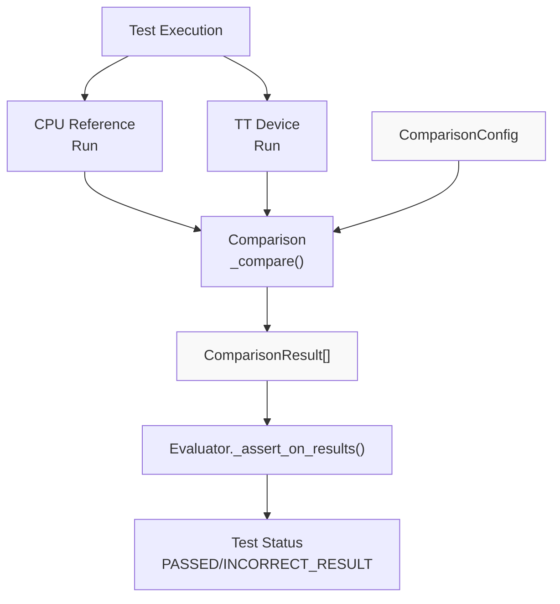
```mermaid
graph TB
    TestExec["Test Execution"]
    CPURef["CPU Reference<br/>Run"]
    TTDevice["TT Device<br/>Run"]
    Compare["Comparison<br/>_compare()"]
    CompConfig["ComparisonConfig"]
    Results["ComparisonResult[]"]
    Evaluate["Evaluator._assert_on_results()"]
    Status["Test Status<br/>PASSED/INCORRECT_RESULT"]
    
    TestExec --> CPURef
    TestExec --> TTDevice
    CPURef --> Compare
    TTDevice --> Compare
    CompConfig --> Compare
    Compare --> Results
    Results --> Evaluate
    Evaluate --> Status
    
    style CompConfig fill:#f9f9f9
    style Results fill:#f9f9f9
```

**Diagram: High-level comparison flow during test execution**

Sources: [tests/infra/testers/single_chip/model/torch_model_tester.py:170-278](), [tests/runner/test_utils.py:363-451]()
```


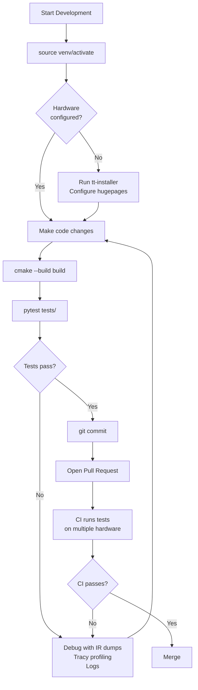
```mermaid
graph TB
    Start["Start Development"]
    
    Start --> Activate["source venv/activate"]
    Activate --> HWCheck{"Hardware<br/>configured?"}
    HWCheck -->|No| TTInstaller["Run tt-installer<br/>Configure hugepages"]
    HWCheck -->|Yes| CodeChange["Make code changes"]
    TTInstaller --> CodeChange
    
    CodeChange --> Build["cmake --build build"]
    Build --> Test["pytest tests/"]
    
    Test --> TestPass{"Tests pass?"}
    TestPass -->|No| Debug["Debug with IR dumps<br/>Tracy profiling<br/>Logs"]
    TestPass -->|Yes| Commit["git commit"]
    
    Debug --> CodeChange
    
    Commit --> PR["Open Pull Request"]
    PR --> CI["CI runs tests<br/>on multiple hardware"]
    CI --> CIPass{"CI passes?"}
    CIPass -->|No| Debug
    CIPass -->|Yes| Merge["Merge"]
```


Relevant source files
*   [.gitignore](https://github.com/tenstorrent/tt-xla/blob/c77995f6/.gitignore)
*   [README.md](https://github.com/tenstorrent/tt-xla/blob/c77995f6/README.md?plain=1)
*   [docs/src/getting_started.md](https://github.com/tenstorrent/tt-xla/blob/c77995f6/docs/src/getting_started.md?plain=1)
*   [docs/src/getting_started_build_from_source.md](https://github.com/tenstorrent/tt-xla/blob/c77995f6/docs/src/getting_started_build_from_source.md?plain=1)
*   [docs/src/getting_started_docker.md](https://github.com/tenstorrent/tt-xla/blob/c77995f6/docs/src/getting_started_docker.md?plain=1)
*   [docs/src/imgs/test_infra.png](https://github.com/tenstorrent/tt-xla/blob/c77995f6/docs/src/imgs/test_infra.png)
*   [docs/src/imgs/tt_smi.png](https://github.com/tenstorrent/tt-xla/blob/c77995f6/docs/src/imgs/tt_smi.png)
*   [docs/src/imgs/tt_xla_logo.png](https://github.com/tenstorrent/tt-xla/blob/c77995f6/docs/src/imgs/tt_xla_logo.png)
*   [docs/src/test_infra.md](https://github.com/tenstorrent/tt-xla/blob/c77995f6/docs/src/test_infra.md?plain=1)
*   [tests/filecheck/add.ttnn.mlir](https://github.com/tenstorrent/tt-xla/blob/c77995f6/tests/filecheck/add.ttnn.mlir)
*   [tests/filecheck/rms_norm.ttir.mlir](https://github.com/tenstorrent/tt-xla/blob/c77995f6/tests/filecheck/rms_norm.ttir.mlir)

This page describes the purpose, architecture, and major subsystems of the `tt-xla` repository. It is the entry point for understanding how the codebase fits together. For setup instructions, see [Getting Started](https://deepwiki.com/tenstorrent/tt-xla/2-getting-started). For detailed treatment of individual subsystems, follow the links to the relevant child pages throughout this document.

* * *

## What is TT-XLA?

TT-XLA is a PJRT (Portable JAX Runtime) plugin that enables running JAX, PyTorch, and vLLM models on Tenstorrent AI accelerator hardware. It acts as the integration layer between ML frameworks and the Tenstorrent compiler (TT-MLIR) and runtime (TT-Metal) stack.

The core artifact is `pjrt_plugin_tt.so`, a shared library implementing the PJRT C API. This plugin compiles StableHLO graphs from JAX and PyTorch into Tenstorrent-executable binaries and manages execution on devices including n150, p150, n300, and llmbox configurations.

**Key components by architectural importance:**

| Component | Importance | Description |
| --- | --- | --- |
| **PJRT Plugin** | Core (462.77) | Implements PJRT C API in `pjrt_plugin_tt.so`, manages compilation and execution |
| **Test Configuration** | Critical (322.28) | YAML-based model test definitions tracking EXPECTED_PASSING/KNOWN_FAILURE_XFAIL/NOT_SUPPORTED_SKIP status |
| **CI/CD Pipeline** | Infrastructure (166.78) | GitHub Actions workflows for building, testing, and releasing across hardware targets |
| **vLLM Integration** | Specialized (78.13) | `TTPlatform`, `TTWorker`, `TTModelRunner` for LLM serving |
| **PyTorch Backend** | Frontend (44.45) | `torch_plugin_tt` with FX graph transformation pipeline |

Sources: [README.md 19-28](https://github.com/tenstorrent/tt-xla/blob/c77995f6/README.md?plain=1#L19-L28)[README.md 26-42](https://github.com/tenstorrent/tt-xla/blob/c77995f6/README.md?plain=1#L26-L42)

* * *

## Position in the Tenstorrent Software Stack

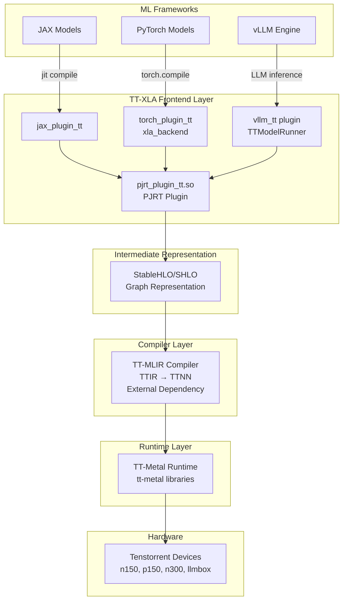
```mermaid
graph TB
    subgraph "ML Frameworks"
        JAX["JAX Models"]
        PyTorch["PyTorch Models"]
        vLLM["vLLM Engine"]
    end
    
    subgraph "TT-XLA Frontend Layer"
        PJRT["pjrt_plugin_tt.so<br/>PJRT Plugin"]
        JAXPlugin["jax_plugin_tt"]
        TorchPlugin["torch_plugin_tt<br/>xla_backend"]
        vLLMPlugin["vllm_tt plugin<br/>TTModelRunner"]
    end
    
    subgraph "Intermediate Representation"
        StableHLO["StableHLO/SHLO<br/>Graph Representation"]
    end
    
    subgraph "Compiler Layer"
        TTMLIR["TT-MLIR Compiler<br/>TTIR → TTNN<br/>External Dependency"]
    end
    
    subgraph "Runtime Layer"
        TTMetal["TT-Metal Runtime<br/>tt-metal libraries"]
    end
    
    subgraph "Hardware"
        TTHardware["Tenstorrent Devices<br/>n150, p150, n300, llmbox"]
    end
    
    JAX -->|"jit compile"| JAXPlugin
    PyTorch -->|"torch.compile"| TorchPlugin
    vLLM -->|"LLM inference"| vLLMPlugin
    
    JAXPlugin --> PJRT
    TorchPlugin --> PJRT
    vLLMPlugin --> PJRT
    
    PJRT --> StableHLO
    StableHLO --> TTMLIR
    TTMLIR --> TTMetal
    TTMetal --> TTHardware
```

Sources: [README.md:19-28](), [README.md:44-51](), [docs/src/getting_started.md:1-3]()

---
```


**Diagram: Overall System Architecture**

Sources: [README.md 19-28](https://github.com/tenstorrent/tt-xla/blob/c77995f6/README.md?plain=1#L19-L28)[README.md 44-51](https://github.com/tenstorrent/tt-xla/blob/c77995f6/README.md?plain=1#L44-L51)[docs/src/getting_started.md 1-3](https://github.com/tenstorrent/tt-xla/blob/c77995f6/docs/src/getting_started.md?plain=1#L1-L3)

* * *

## Major Subsystems

### 1. PJRT Plugin (`pjrt_plugin_tt.so`)

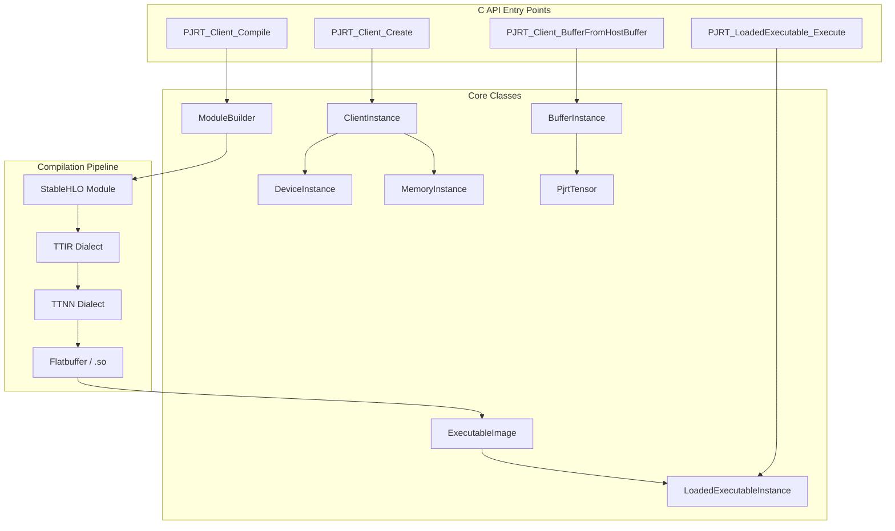
```mermaid
graph TB
    subgraph "C API Entry Points"
        CC["PJRT_Client_Create"]
        COMP["PJRT_Client_Compile"]
        EXEC["PJRT_LoadedExecutable_Execute"]
        BUF["PJRT_Client_BufferFromHostBuffer"]
    end

    subgraph "Core Classes"
        CI["ClientInstance"]
        DEV["DeviceInstance"]
        MEM["MemoryInstance"]
        MB["ModuleBuilder"]
        EI["ExecutableImage"]
        LEI["LoadedExecutableInstance"]
        BI["BufferInstance"]
        PT["PjrtTensor"]
    end

    subgraph "Compilation Pipeline"
        SHLO["StableHLO Module"]
        TTIR["TTIR Dialect"]
        TTNN["TTNN Dialect"]
        FB["Flatbuffer / .so"]
    end

    CC --> CI
    CI --> DEV
    CI --> MEM
    
    COMP --> MB
    MB --> SHLO
    SHLO --> TTIR
    TTIR --> TTNN
    TTNN --> FB
    FB --> EI
    EI --> LEI
    
    EXEC --> LEI
    
    BUF --> BI
    BI --> PT
```

The plugin is distributed as part of the `pjrt_plugin_tt` Python wheel, which includes the `.so` binary, TT-MLIR compiler libraries in `lib/`, and TT-Metal runtime assets in `tt-metal/`. See [PJRT Plugin System](#4.2) for implementation details.

Sources: [README.md:19-28](), [docs/src/getting_started_build_from_source.md:174-187]()

---
```


The PJRT plugin is the central hub (importance: 462.77) connecting ML frameworks to Tenstorrent hardware. Built via CMake in [CMakeLists.txt](https://github.com/tenstorrent/tt-xla/blob/c77995f6/CMakeLists.txt) it implements the PJRT C API specification and manages the complete compilation and execution lifecycle.

**Diagram: PJRT Plugin Architecture**

The plugin is distributed as part of the `pjrt_plugin_tt` Python wheel, which includes the `.so` binary, TT-MLIR compiler libraries in `lib/`, and TT-Metal runtime assets in `tt-metal/`. See [PJRT Plugin System](https://deepwiki.com/tenstorrent/tt-xla/4.2-pjrt-plugin-system) for implementation details.

Sources: [README.md 19-28](https://github.com/tenstorrent/tt-xla/blob/c77995f6/README.md?plain=1#L19-L28)[docs/src/getting_started_build_from_source.md 174-187](https://github.com/tenstorrent/tt-xla/blob/c77995f6/docs/src/getting_started_build_from_source.md?plain=1#L174-L187)

* * *

### 2. Compilation Pipeline


```mermaid
graph LR
    subgraph "Framework Tracing"
        USER["User Code"]
        TRACE["JAX Tracing / PyTorch FX"]
    end

    subgraph "PJRT Interface"
        PJRTAPI["PJRT_Client_Compile"]
    end

    subgraph "Graph Transformation"
        PASSES["Fusion, Decompositions,<br/>Composite Ops"]
        SHLO["StableHLO Generation"]
    end

    subgraph "TT-MLIR Multi-Stage Lowering"
        IMPORT["MLIR Import"]
        TTIR["TTIR Dialect<br/>ttir.rms_norm, etc."]
        TTNN["TTNN Dialect<br/>ttnn.add, etc."]
        CODEGEN["Code Generation"]
    end

    subgraph "Runtime Execution"
        METAL["TT-Metal Runtime"]
        DEVICE["TT Device"]
    end

    USER --> TRACE
    TRACE --> PJRTAPI
    PJRTAPI --> PASSES
    PASSES --> SHLO
    SHLO --> IMPORT
    IMPORT --> TTIR
    TTIR --> TTNN
    TTNN --> CODEGEN
    CODEGEN --> METAL
    METAL --> DEVICE
```

The compilation pipeline transforms user code through multiple stages:

1. **Framework tracing**: JAX's `jit` or PyTorch's `torch.compile` produces a computation graph
2. **Graph passes**: Apply optimization passes including fusion, decompositions, and composite op formation
3. **StableHLO**: Emit StableHLO representation with metadata
4. **TT-MLIR lowering**: Progressive lowering through TTIR → TTNN dialects (external dependency: [tt-mlir](https://github.com/tenstorrent/tt-mlir))
5. **Code generation**: Produce Flatbuffer binary or compiled `.so` consumed by TT-Metal

Compilation behavior is controlled by `CompileOptions` including `optimization_level`, `math_fidelity`, `enable_bfp8_conversion`, and `backend` selection. For detailed treatment, see [Compilation Pipeline](#4.1).

Sources: [README.md:19-28](), [tests/filecheck/rms_norm.ttir.mlir:1-2](), [tests/filecheck/add.ttnn.mlir:1-2]()

---
```


**Diagram: Data Flow Through Compilation**

The compilation pipeline transforms user code through multiple stages:

1.   **Framework tracing**: JAX's `jit` or PyTorch's `torch.compile` produces a computation graph
2.   **Graph passes**: Apply optimization passes including fusion, decompositions, and composite op formation
3.   **StableHLO**: Emit StableHLO representation with metadata
4.   **TT-MLIR lowering**: Progressive lowering through TTIR → TTNN dialects (external dependency: [tt-mlir](https://github.com/tenstorrent/tt-xla/blob/c77995f6/tt-mlir))
5.   **Code generation**: Produce Flatbuffer binary or compiled `.so` consumed by TT-Metal

Compilation behavior is controlled by `CompileOptions` including `optimization_level`, `math_fidelity`, `enable_bfp8_conversion`, and `backend` selection. For detailed treatment, see [Compilation Pipeline](https://deepwiki.com/tenstorrent/tt-xla/4.1-compilation-pipeline).

Sources: [README.md 19-28](https://github.com/tenstorrent/tt-xla/blob/c77995f6/README.md?plain=1#L19-L28)[tests/filecheck/rms_norm.ttir.mlir 1-2](https://github.com/tenstorrent/tt-xla/blob/c77995f6/tests/filecheck/rms_norm.ttir.mlir#L1-L2)[tests/filecheck/add.ttnn.mlir 1-2](https://github.com/tenstorrent/tt-xla/blob/c77995f6/tests/filecheck/add.ttnn.mlir#L1-L2)

* * *

### 3. Framework Integrations

TT-XLA provides three framework integration points, each with distinct architecture:

**JAX Integration** (via `jax_plugin_tt`):

*   Thin Python wrapper in [python_package/jax_plugin_tt/__init__.py](https://github.com/tenstorrent/tt-xla/blob/c77995f6/python_package/jax_plugin_tt/__init__.py)
*   Registered via setuptools `entry_points` under the `jax_plugins` group
*   JAX's `jit` decorator automatically routes to `pjrt_plugin_tt.so` when device is `'tt'`
*   Direct PJRT C API invocation with minimal graph transformation

**PyTorch Integration** (via `torch_plugin_tt`, importance: 44.45):

*   `torch.compile(backend='tt')` entry point in [python_package/torch_plugin_tt/__init__.py](https://github.com/tenstorrent/tt-xla/blob/c77995f6/python_package/torch_plugin_tt/__init__.py)
*   `TTPlugin` implements PyTorch's `DevicePlugin` interface
*   `torch_pass_pipeline()` applies FX graph transformations: 
    *   Fusion passes (attention, linear layers)
    *   Composite op formation (RMS norm, layer norm)
    *   Decompositions for unsupported ops
    *   Metadata propagation

*   `XLAExecutor` compiles transformed graph via PJRT

**vLLM Integration** (importance: 78.13):

*   Specialized LLM serving infrastructure in [integrations/vllm_tt/](https://github.com/tenstorrent/tt-xla/blob/c77995f6/integrations/vllm_tt/)
*   `TTPlatform` implements vLLM's platform interface
*   `TTWorker` manages device allocation and distributed execution
*   `TTModelRunner` handles generation tasks with optimization strategies: 
    *   `dummy_run()` pre-compilation to fixed shapes
    *   Token/request padding to prevent expensive recompilation
    *   SPMD setup for tensor parallelism

*   `TTPoolingRunner` for embedding tasks
*   Custom layers: `XlaMergedColumnParallelLinear`, `XlaQKVParallelLinear`

For detailed framework integration documentation, see [Framework Integration](https://deepwiki.com/tenstorrent/tt-xla/5-framework-integration).

Sources: [README.md 19-28](https://github.com/tenstorrent/tt-xla/blob/c77995f6/README.md?plain=1#L19-L28)[docs/src/getting_started_build_from_source.md 174-187](https://github.com/tenstorrent/tt-xla/blob/c77995f6/docs/src/getting_started_build_from_source.md?plain=1#L174-L187)

* * *

### 4. Build System

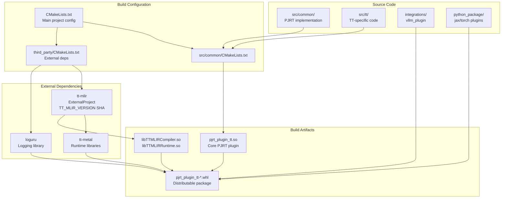
```mermaid
graph TB
    subgraph "Source Code"
        SRC_COMMON["src/common/<br/>PJRT implementation"]
        SRC_TT["src/tt/<br/>TT-specific code"]
        INTEGRATIONS["integrations/<br/>vllm_plugin"]
        PY_PKG["python_package/<br/>jax/torch plugins"]
    end
    
    subgraph "Build Configuration"
        ROOT_CMAKE["CMakeLists.txt<br/>Main project config"]
        COMMON_CMAKE["src/common/CMakeLists.txt"]
        THIRD_CMAKE["third_party/CMakeLists.txt<br/>External deps"]
    end
    
    subgraph "External Dependencies"
        TTMLIR["tt-mlir<br/>ExternalProject<br/>TT_MLIR_VERSION SHA"]
        LOGURU["loguru<br/>Logging library"]
        TTMETAL["tt-metal<br/>Runtime libraries"]
    end
    
    subgraph "Build Artifacts"
        PJRT_SO["pjrt_plugin_tt.so<br/>Core PJRT plugin"]
        TTMLIR_LIB["libTTMLIRCompiler.so<br/>libTTMLIRRuntime.so"]
        WHEEL["pjrt_plugin_tt-*.whl<br/>Distributable package"]
    end
    
    ROOT_CMAKE --> COMMON_CMAKE
    ROOT_CMAKE --> THIRD_CMAKE
    
    THIRD_CMAKE --> TTMLIR
    THIRD_CMAKE --> LOGURU
    TTMLIR --> TTMETAL
    
    SRC_COMMON --> COMMON_CMAKE
    SRC_TT --> COMMON_CMAKE
    
    COMMON_CMAKE --> PJRT_SO
    TTMLIR --> TTMLIR_LIB
    
    PJRT_SO --> WHEEL
    TTMLIR_LIB --> WHEEL
    LOGURU --> WHEEL
    TTMETAL --> WHEEL
    PY_PKG --> WHEEL
    INTEGRATIONS --> WHEEL
```

**Build Process:**

1. **CMake configuration** in [CMakeLists.txt]() defines library targets:
   - `TTPJRTUtils` (utilities and logging)
   - `TTPJRTApi` (PJRT C API implementation)
   - `TTPJRTBindings` (C++ bindings)
   - `TTPJRTTTDylib` (final `pjrt_plugin_tt.so`)

2. **External dependencies**:
   - `tt-mlir` fetched as `ExternalProject` at version pinned by `TT_MLIR_VERSION` SHA
   - `loguru` for logging infrastructure
   - `tt-metal` runtime automatically included via tt-mlir

3. **Python wheel** built via [python_package/setup.py]():
   ```
   pjrt_plugin_tt/
       pjrt_plugin_tt.so        # PJRT plugin binary
       tt-metal/                # TT Metal runtime assets
       lib/                     # tt-mlir and tt-metal .so files
   jax_plugin_tt/
       __init__.py              # JAX integration
   torch_plugin_tt/
       __init__.py              # PyTorch integration
   vllm_tt/
       platform.py              # vLLM integration
   ```

4. **CI/CD** (importance: 166.78):
   - Docker images: base, CI, IRD variants in [.github/workflows/]()
   - Manylinux wheel builds for portability
   - Artifact caching by SHA for efficiency
   - Multi-stage builds for different configurations (Release/Explorer/Debug)

For complete build instructions, see [Build System](#3).

Sources: [docs/src/getting_started_build_from_source.md:114-188](), [.gitignore:1-46]()

---
```


The build system (importance: 462.77) uses CMake with external dependency management and Python wheel packaging.

**Diagram: Build Dependency Chain**

**Build Process:**

1.   **CMake configuration** in [CMakeLists.txt](https://github.com/tenstorrent/tt-xla/blob/c77995f6/CMakeLists.txt) defines library targets:

    *   `TTPJRTUtils` (utilities and logging)
    *   `TTPJRTApi` (PJRT C API implementation)
    *   `TTPJRTBindings` (C++ bindings)
    *   `TTPJRTTTDylib` (final `pjrt_plugin_tt.so`)

2.   **External dependencies**:

    *   `tt-mlir` fetched as `ExternalProject` at version pinned by `TT_MLIR_VERSION` SHA
    *   `loguru` for logging infrastructure
    *   `tt-metal` runtime automatically included via tt-mlir

3.   **Python wheel** built via [python_package/setup.py](https://github.com/tenstorrent/tt-xla/blob/c77995f6/python_package/setup.py):

```
pjrt_plugin_tt/
    pjrt_plugin_tt.so        # PJRT plugin binary
    tt-metal/                # TT Metal runtime assets
    lib/                     # tt-mlir and tt-metal .so files
jax_plugin_tt/
    __init__.py              # JAX integration
torch_plugin_tt/
    __init__.py              # PyTorch integration
vllm_tt/
    platform.py              # vLLM integration
```
4.   **CI/CD** (importance: 166.78):

    *   Docker images: base, CI, IRD variants in [.github/workflows/](https://github.com/tenstorrent/tt-xla/blob/c77995f6/.github/workflows/)
    *   Manylinux wheel builds for portability
    *   Artifact caching by SHA for efficiency
    *   Multi-stage builds for different configurations (Release/Explorer/Debug)

For complete build instructions, see [Build System](https://deepwiki.com/tenstorrent/tt-xla/3-build-system).

Sources: [docs/src/getting_started_build_from_source.md 114-188](https://github.com/tenstorrent/tt-xla/blob/c77995f6/docs/src/getting_started_build_from_source.md?plain=1#L114-L188)[.gitignore 1-46](https://github.com/tenstorrent/tt-xla/blob/c77995f6/.gitignore#L1-L46)

* * *

### 5. Testing Infrastructure

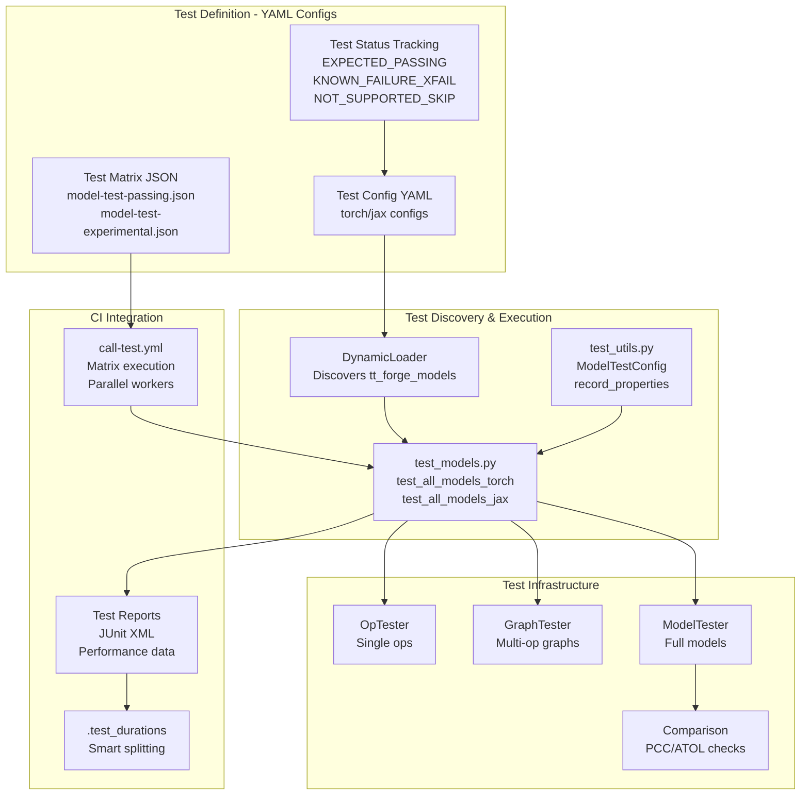
```mermaid
graph TB
    subgraph "Test Definition - YAML Configs"
        YAML["Test Config YAML<br/>torch/jax configs"]
        MATRIX["Test Matrix JSON<br/>model-test-passing.json<br/>model-test-experimental.json"]
        STATUS["Test Status Tracking<br/>EXPECTED_PASSING<br/>KNOWN_FAILURE_XFAIL<br/>NOT_SUPPORTED_SKIP"]
    end
    
    subgraph "Test Discovery & Execution"
        LOADER["DynamicLoader<br/>Discovers tt_forge_models"]
        RUNNER["test_models.py<br/>test_all_models_torch<br/>test_all_models_jax"]
        UTILS["test_utils.py<br/>ModelTestConfig<br/>record_properties"]
    end
    
    subgraph "Test Infrastructure"
        OP["OpTester<br/>Single ops"]
        GRAPH["GraphTester<br/>Multi-op graphs"]
        MODEL["ModelTester<br/>Full models"]
        EVAL["Comparison<br/>PCC/ATOL checks"]
    end
    
    subgraph "CI Integration"
        GH["call-test.yml<br/>Matrix execution<br/>Parallel workers"]
        REPORTS["Test Reports<br/>JUnit XML<br/>Performance data"]
        DURATION[".test_durations<br/>Smart splitting"]
    end
    
    YAML --> LOADER
    MATRIX --> GH
    STATUS --> YAML
    
    LOADER --> RUNNER
    UTILS --> RUNNER
    
    RUNNER --> OP
    RUNNER --> GRAPH
    RUNNER --> MODEL
    
    MODEL --> EVAL
    
    GH --> RUNNER
    RUNNER --> REPORTS
    REPORTS --> DURATION
```

**Test Organization:**

| Category | Location | Primary Classes |
|---|---|---|
| JAX ops/graphs | [tests/jax/single_chip/]() | `OpTester`, `GraphTester` |
| JAX models | [tests/jax/models/]() | `JaxModelTester`, `DynamicJaxModelTester` |
| PyTorch ops | [tests/torch/]() | `TorchWorkload`, `TorchDeviceRunner` |
| Multi-chip | [tests/jax/multi_chip/n300/](), [tests/jax/multi_chip/llmbox/]() | `JaxMultichipWorkload` |
| IR validation | [tests/filecheck/]() | `pytest.mark.filecheck` decorator |
| vLLM sampling | [tests/vllm/]() | Sampling correctness tests (importance: 35.42) |

Tests compare device outputs against CPU reference using PCC (Pearson Correlation Coefficient) and ATOL thresholds defined in YAML configs. The test matrix JSON files drive CI execution across n150, p150, n300, and llmbox hardware targets.

For the complete testing framework, see [Testing Infrastructure](#6).

Sources: [docs/src/getting_started_build_from_source.md:188-194](), [docs/src/test_infra.md:1-155]()

---
```


The testing system (importance: 322.28 for test configs, 71.91 for test runner, 93.48 for CI orchestration) validates model correctness and tracks bringup status across multiple hardware configurations.

**Diagram: Testing Ecosystem**

**Test Organization:**

| Category | Location | Primary Classes |
| --- | --- | --- |
| JAX ops/graphs | [tests/jax/single_chip/](https://github.com/tenstorrent/tt-xla/blob/c77995f6/tests/jax/single_chip/) | `OpTester`, `GraphTester` |
| JAX models | [tests/jax/models/](https://github.com/tenstorrent/tt-xla/blob/c77995f6/tests/jax/models/) | `JaxModelTester`, `DynamicJaxModelTester` |
| PyTorch ops | [tests/torch/](https://github.com/tenstorrent/tt-xla/blob/c77995f6/tests/torch/) | `TorchWorkload`, `TorchDeviceRunner` |
| Multi-chip | [tests/jax/multi_chip/n300/](https://github.com/tenstorrent/tt-xla/blob/c77995f6/tests/jax/multi_chip/n300/)[tests/jax/multi_chip/llmbox/](https://github.com/tenstorrent/tt-xla/blob/c77995f6/tests/jax/multi_chip/llmbox/) | `JaxMultichipWorkload` |
| IR validation | [tests/filecheck/](https://github.com/tenstorrent/tt-xla/blob/c77995f6/tests/filecheck/) | `pytest.mark.filecheck` decorator |
| vLLM sampling | [tests/vllm/](https://github.com/tenstorrent/tt-xla/blob/c77995f6/tests/vllm/) | Sampling correctness tests (importance: 35.42) |

Tests compare device outputs against CPU reference using PCC (Pearson Correlation Coefficient) and ATOL thresholds defined in YAML configs. The test matrix JSON files drive CI execution across n150, p150, n300, and llmbox hardware targets.

For the complete testing framework, see [Testing Infrastructure](https://deepwiki.com/tenstorrent/tt-xla/6-testing-infrastructure).

Sources: [docs/src/getting_started_build_from_source.md 188-194](https://github.com/tenstorrent/tt-xla/blob/c77995f6/docs/src/getting_started_build_from_source.md?plain=1#L188-L194)[docs/src/test_infra.md 1-155](https://github.com/tenstorrent/tt-xla/blob/c77995f6/docs/src/test_infra.md?plain=1#L1-L155)

* * *

## Related Tenstorrent Projects

TT-XLA is part of a broader Tenstorrent software ecosystem:

| Project | Role | Use Case |
| --- | --- | --- |
| **TT-MLIR** | Compiler (external dependency) | Lowers StableHLO → TTIR → TTNN, produces Flatbuffer/`.so` binaries |
| **TT-Metal** | Runtime (external dependency) | Low-level kernel execution, memory management, device orchestration |
| **TT-Forge-FE** | Alternative frontend | ONNX/PaddlePaddle support (single-chip only, TVM-based) |
| **TT-TVM** | Compiler infrastructure | TVM fork for TT-Forge-FE graph compilation |
| **TT-Torch** | Deprecated | Former PyTorch frontend; **users should migrate to TT-XLA** |

**Architectural Positioning:**

*   **For PyTorch, JAX, vLLM**: Use **TT-XLA** (this repository) - supports both single and multi-chip
*   **For ONNX, PaddlePaddle**: Use **TT-Forge-FE** - single-chip only
*   **All frontends** compile through **TT-MLIR** and execute on **TT-Metal**

Sources: [README.md 30-51](https://github.com/tenstorrent/tt-xla/blob/c77995f6/README.md?plain=1#L30-L51)

* * *

## Quick Start

To verify a working installation after installing the wheel:

For full setup instructions, see [Getting Started](https://deepwiki.com/tenstorrent/tt-xla/2-getting-started).

Sources: [docs/src/getting_started.md 51-70](https://github.com/tenstorrent/tt-xla/blob/c77995f6/docs/src/getting_started.md?plain=1#L51-L70)[docs/src/getting_started_build_from_source.md 152-159](https://github.com/tenstorrent/tt-xla/blob/c77995f6/docs/src/getting_started_build_from_source.md?plain=1#L152-L159)

Dismiss
Refresh this wiki

Enter email to refresh


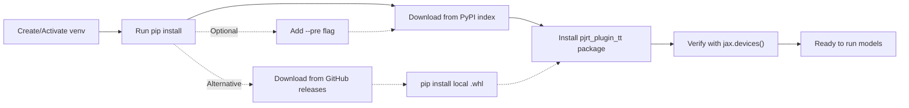
```mermaid
graph LR
    A["Create/Activate venv"] --> B["Run pip install"]
    B --> C["Download from PyPI index"]
    C --> D["Install pjrt_plugin_tt package"]
    D --> E["Verify with jax.devices()"]
    E --> F["Ready to run models"]
    
    B -.Optional.-> G["Add --pre flag"]
    G -.-> C
    B -.Alternative.-> H["Download from GitHub releases"]
    H -.-> I["pip install local .whl"]
    I -.-> D
```

### Related: Build Dependency Chain

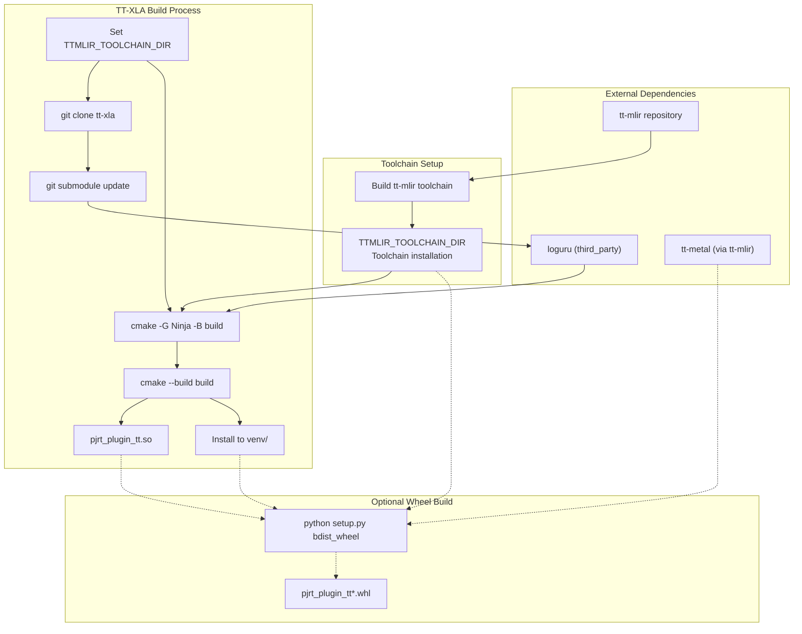
```mermaid
graph TD
    subgraph External["External Dependencies"]
        TtmlirRepo["tt-mlir repository"]
        LoguruRepo["loguru (third_party)"]
        MetalRepo["tt-metal (via tt-mlir)"]
    end
    
    subgraph ToolchainSetup["Toolchain Setup"]
        TtmlirRepo --> TtmlirBuild["Build tt-mlir toolchain"]
        TtmlirBuild --> TtmlirToolchain["TTMLIR_TOOLCHAIN_DIR<br/>Toolchain installation"]
    end
    
    subgraph TtxlaBuild["TT-XLA Build Process"]
        EnvVar["Set TTMLIR_TOOLCHAIN_DIR"] --> Clone["git clone tt-xla"]
        Clone --> Submodules["git submodule update"]
        Submodules --> LoguruRepo
        TtmlirToolchain --> CmakeConfig["cmake -G Ninja -B build"]
        EnvVar --> CmakeConfig
        LoguruRepo --> CmakeConfig
        CmakeConfig --> CmakeBuild["cmake --build build"]
        CmakeBuild --> PjrtPlugin["pjrt_plugin_tt.so"]
        CmakeBuild --> VenvInstall["Install to venv/"]
    end
    
    subgraph OptionalWheel["Optional Wheel Build"]
        VenvInstall -.-> WheelBuild["python setup.py bdist_wheel"]
        PjrtPlugin -.-> WheelBuild
        MetalRepo -.-> WheelBuild
        TtmlirToolchain -.-> WheelBuild
        WheelBuild -.-> WheelFile["pjrt_plugin_tt*.whl"]
    end
```

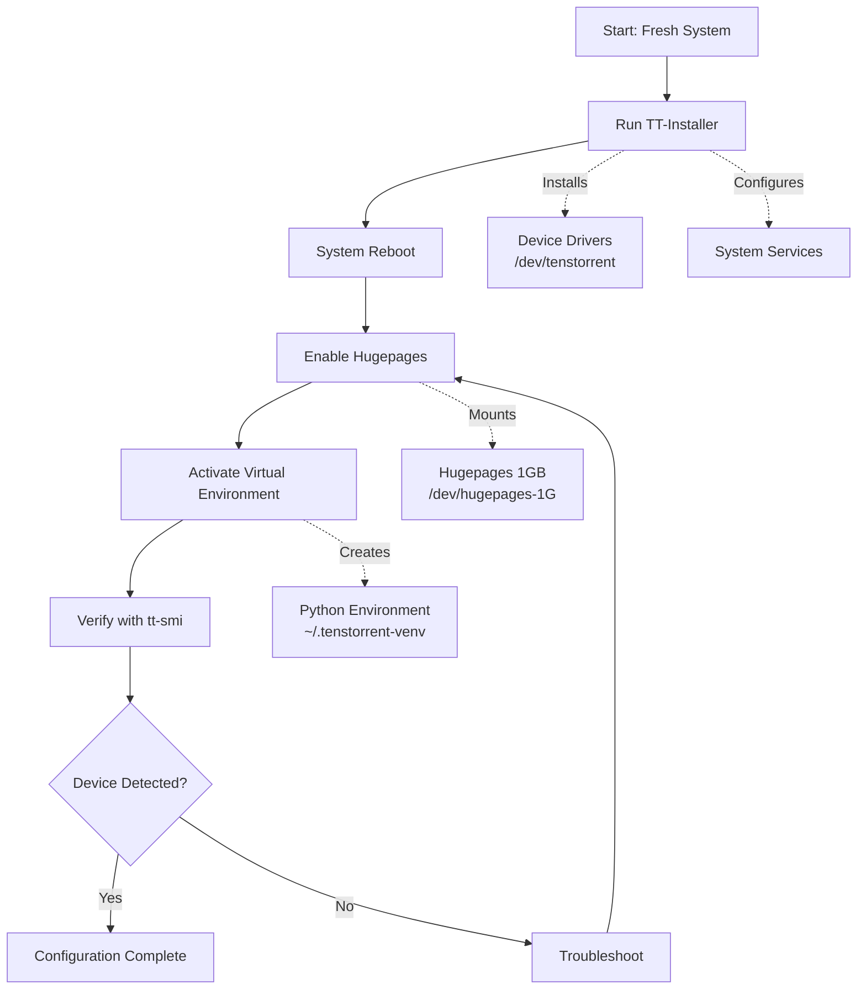
```mermaid
graph TD
    A["Start: Fresh System"] --> B["Run TT-Installer"]
    B --> C["System Reboot"]
    C --> D["Enable Hugepages"]
    D --> E["Activate Virtual Environment"]
    E --> F["Verify with tt-smi"]
    F --> G{"Device Detected?"}
    G -->|Yes| H["Configuration Complete"]
    G -->|No| I["Troubleshoot"]
    I --> D
    
    B -.->|Installs| J["Device Drivers<br/>/dev/tenstorrent"]
    B -.->|Configures| K["System Services"]
    D -.->|Mounts| L["Hugepages 1GB<br/>/dev/hugepages-1G"]
    E -.->|Creates| M["Python Environment<br/>~/.tenstorrent-venv"]
```

### Related: Device Architecture Overview

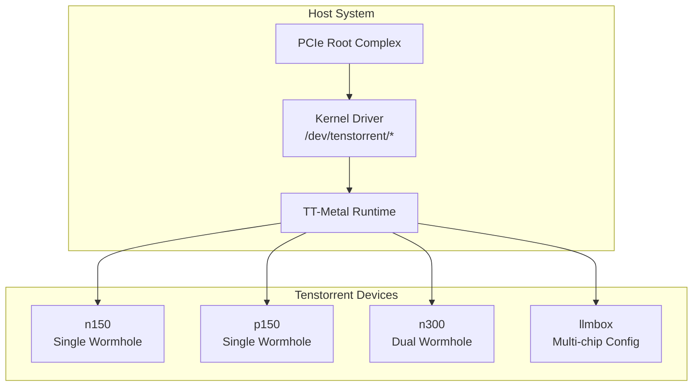
```mermaid
graph TB
    subgraph "Host System"
        A["PCIe Root Complex"]
        B["Kernel Driver<br/>/dev/tenstorrent/*"]
        C["TT-Metal Runtime"]
    end
    
    subgraph "Tenstorrent Devices"
        D["n150<br/>Single Wormhole"]
        E["p150<br/>Single Wormhole"]
        F["n300<br/>Dual Wormhole"]
        G["llmbox<br/>Multi-chip Config"]
    end
    
    A --> B
    B --> C
    C --> D
    C --> E
    C --> F
    C --> G
```

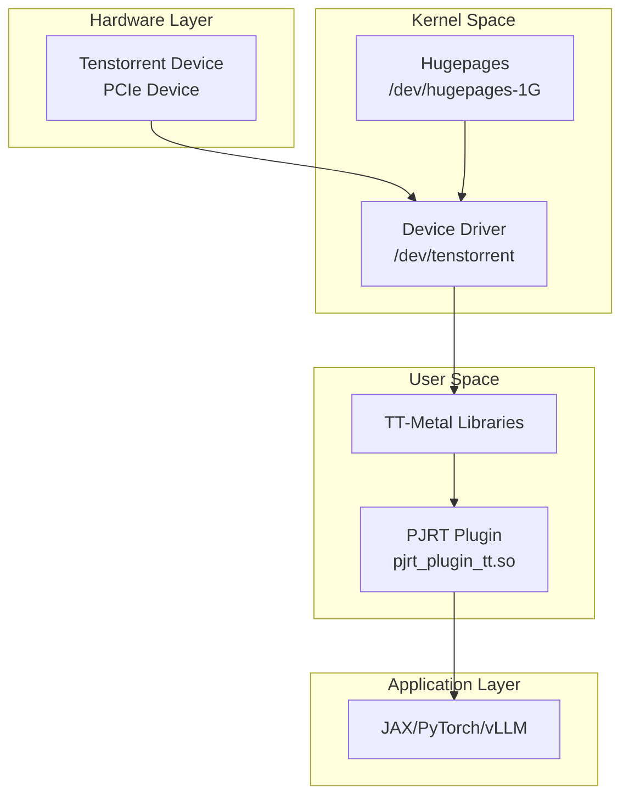
```mermaid
graph TD
    subgraph "Hardware Layer"
        A["Tenstorrent Device<br/>PCIe Device"]
    end
    
    subgraph "Kernel Space"
        B["Device Driver<br/>/dev/tenstorrent"]
        C["Hugepages<br/>/dev/hugepages-1G"]
    end
    
    subgraph "User Space"
        D["TT-Metal Libraries"]
        E["PJRT Plugin<br/>pjrt_plugin_tt.so"]
    end
    
    subgraph "Application Layer"
        F["JAX/PyTorch/vLLM"]
    end
    
    A --> B
    C --> B
    B --> D
    D --> E
    E --> F
```

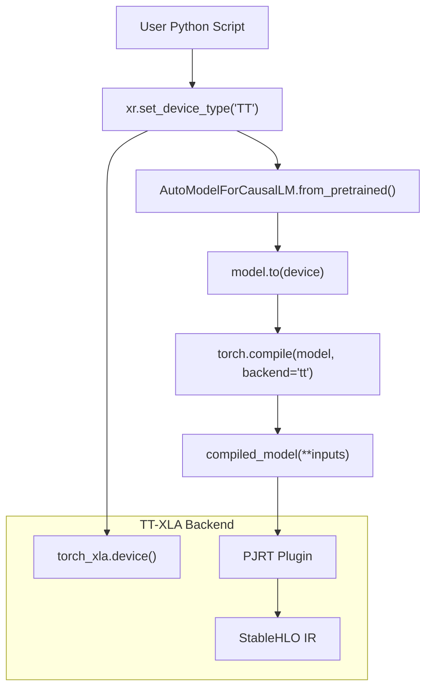
```mermaid
graph TB
    UserCode["User Python Script"]
    SetDevice["xr.set_device_type('TT')"]
    LoadModel["AutoModelForCausalLM.from_pretrained()"]
    ToDevice["model.to(device)"]
    Compile["torch.compile(model, backend='tt')"]
    Execute["compiled_model(**inputs)"]
    
    UserCode --> SetDevice
    SetDevice --> LoadModel
    LoadModel --> ToDevice
    ToDevice --> Compile
    Compile --> Execute
    
    subgraph "TT-XLA Backend"
        TorchXLA["torch_xla.device()"]
        PJRTPlugin["PJRT Plugin"]
        StableHLO["StableHLO IR"]
    end
    
    SetDevice --> TorchXLA
    Execute --> PJRTPlugin
    PJRTPlugin --> StableHLO
```

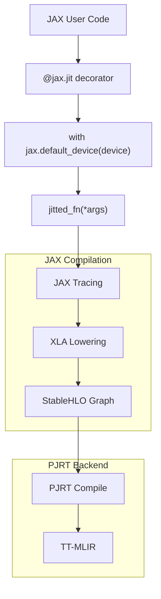
```mermaid
graph TB
    JaxCode["JAX User Code"]
    JitDecorator["@jax.jit decorator"]
    DeviceSpec["with jax.default_device(device)"]
    Execute["jitted_fn(*args)"]
    
    JaxCode --> JitDecorator
    JitDecorator --> DeviceSpec
    DeviceSpec --> Execute
    
    subgraph "JAX Compilation"
        Trace["JAX Tracing"]
        XLALower["XLA Lowering"]
        StableHLO["StableHLO Graph"]
    end
    
    Execute --> Trace
    Trace --> XLALower
    XLALower --> StableHLO
    
    subgraph "PJRT Backend"
        PJRTCompile["PJRT Compile"]
        TTMLIR["TT-MLIR"]
    end
    
    StableHLO --> PJRTCompile
    PJRTCompile --> TTMLIR
```

### Related: Build System Architecture

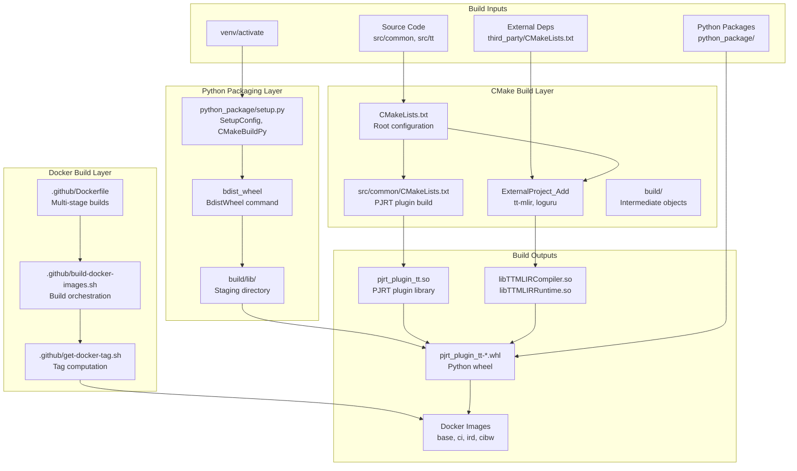
```mermaid
graph TB
    subgraph "Build Inputs"
        SourceCode["Source Code<br/>src/common, src/tt"]
        PythonPkg["Python Packages<br/>python_package/"]
        ThirdParty["External Deps<br/>third_party/CMakeLists.txt"]
        VenvActivate["venv/activate"]
    end
    
    subgraph "CMake Build Layer"
        RootCMake["CMakeLists.txt<br/>Root configuration"]
        CommonCMake["src/common/CMakeLists.txt<br/>PJRT plugin build"]
        ExtProjects["ExternalProject_Add<br/>tt-mlir, loguru"]
        BuildDir["build/<br/>Intermediate objects"]
    end
    
    subgraph "Python Packaging Layer"
        SetupPy["python_package/setup.py<br/>SetupConfig, CMakeBuildPy"]
        BdistWheel["bdist_wheel<br/>BdistWheel command"]
        BuildLib["build/lib/<br/>Staging directory"]
    end
    
    subgraph "Docker Build Layer"
        Dockerfile[".github/Dockerfile<br/>Multi-stage builds"]
        BuildScript[".github/build-docker-images.sh<br/>Build orchestration"]
        DockerTag[".github/get-docker-tag.sh<br/>Tag computation"]
    end
    
    subgraph "Build Outputs"
        PJRTPlugin["pjrt_plugin_tt.so<br/>PJRT plugin library"]
        TTMLIRLibs["libTTMLIRCompiler.so<br/>libTTMLIRRuntime.so"]
        Wheel["pjrt_plugin_tt-*.whl<br/>Python wheel"]
        DockerImages["Docker Images<br/>base, ci, ird, cibw"]
    end
    
    SourceCode --> RootCMake
    ThirdParty --> ExtProjects
    VenvActivate --> SetupPy
    
    RootCMake --> CommonCMake
    RootCMake --> ExtProjects
    
    ExtProjects --> TTMLIRLibs
    CommonCMake --> PJRTPlugin
    
    SetupPy --> BdistWheel
    BdistWheel --> BuildLib
    BuildLib --> Wheel
    
    PJRTPlugin --> Wheel
    TTMLIRLibs --> Wheel
    PythonPkg --> Wheel
    
    Dockerfile --> BuildScript
    BuildScript --> DockerTag
    DockerTag --> DockerImages
    
    Wheel --> DockerImages
```

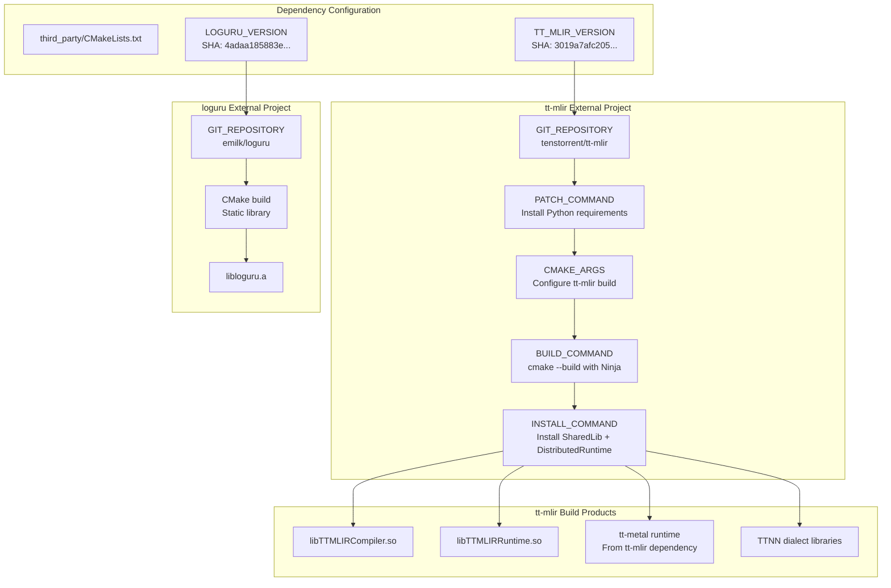
```mermaid
graph TB
    subgraph "Dependency Configuration"
        ThirdPartyCMake["third_party/CMakeLists.txt"]
        TT_MLIR_VERSION["TT_MLIR_VERSION<br/>SHA: 3019a7afc205..."]
        LOGURU_VERSION["LOGURU_VERSION<br/>SHA: 4adaa185883e..."]
    end
    
    subgraph "tt-mlir External Project"
        GitClone["GIT_REPOSITORY<br/>tenstorrent/tt-mlir"]
        PatchCmd["PATCH_COMMAND<br/>Install Python requirements"]
        CMakeArgs["CMAKE_ARGS<br/>Configure tt-mlir build"]
        BuildCmd["BUILD_COMMAND<br/>cmake --build with Ninja"]
        InstallCmd["INSTALL_COMMAND<br/>Install SharedLib + DistributedRuntime"]
    end
    
    subgraph "tt-mlir Build Products"
        TTMLIRCompiler["libTTMLIRCompiler.so"]
        TTMLIRRuntime["libTTMLIRRuntime.so"]
        TTMetalRuntime["tt-metal runtime<br/>From tt-mlir dependency"]
        TTNNDialect["TTNN dialect libraries"]
    end
    
    subgraph "loguru External Project"
        LoguruGit["GIT_REPOSITORY<br/>emilk/loguru"]
        LoguruBuild["CMake build<br/>Static library"]
        LoguruLib["libloguru.a"]
    end
    
    TT_MLIR_VERSION --> GitClone
    GitClone --> PatchCmd
    PatchCmd --> CMakeArgs
    CMakeArgs --> BuildCmd
    BuildCmd --> InstallCmd
    
    InstallCmd --> TTMLIRCompiler
    InstallCmd --> TTMLIRRuntime
    InstallCmd --> TTMetalRuntime
    InstallCmd --> TTNNDialect
    
    LOGURU_VERSION --> LoguruGit
    LoguruGit --> LoguruBuild
    LoguruBuild --> LoguruLib
```

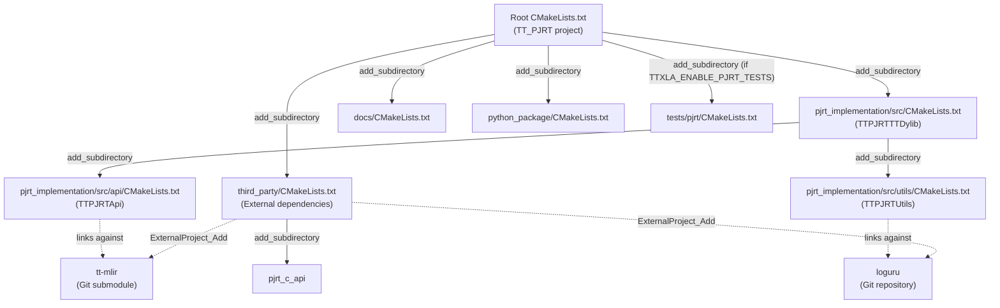
```mermaid
graph TB
    Root["Root CMakeLists.txt<br/>(TT_PJRT project)"]
    ThirdParty["third_party/CMakeLists.txt<br/>(External dependencies)"]
    PJRTImpl["pjrt_implementation/src/CMakeLists.txt<br/>(TTPJRTTTDylib)"]
    API["pjrt_implementation/src/api/CMakeLists.txt<br/>(TTPJRTApi)"]
    Utils["pjrt_implementation/src/utils/CMakeLists.txt<br/>(TTPJRTUtils)"]
    Docs["docs/CMakeLists.txt"]
    Python["python_package/CMakeLists.txt"]
    Tests["tests/pjrt/CMakeLists.txt"]
    
    Root -->|"add_subdirectory"| ThirdParty
    Root -->|"add_subdirectory"| PJRTImpl
    Root -->|"add_subdirectory"| Docs
    Root -->|"add_subdirectory"| Python
    Root -->|"add_subdirectory (if TTXLA_ENABLE_PJRT_TESTS)"| Tests
    
    PJRTImpl -->|"add_subdirectory"| API
    PJRTImpl -->|"add_subdirectory"| Utils
    
    ThirdParty -.->|"ExternalProject_Add"| TTMLIR["tt-mlir<br/>(Git submodule)"]
    ThirdParty -.->|"ExternalProject_Add"| Loguru["loguru<br/>(Git repository)"]
    ThirdParty -->|"add_subdirectory"| PJRTC["pjrt_c_api"]
    
    API -.->|"links against"| TTMLIR
    Utils -.->|"links against"| Loguru
```

### Related: Dependency Installation Flow

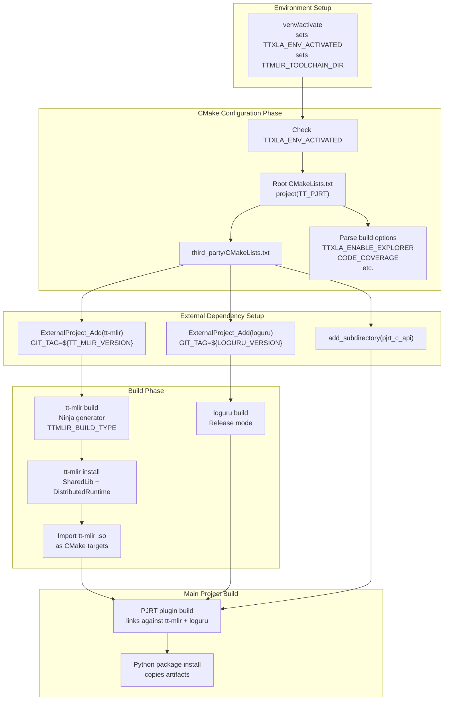
```mermaid
graph TB
    subgraph "Environment Setup"
        VenvActivate["venv/activate<br/>sets TTXLA_ENV_ACTIVATED<br/>sets TTMLIR_TOOLCHAIN_DIR"]
    end
    
    subgraph "CMake Configuration Phase"
        RootCMake["Root CMakeLists.txt<br/>project(TT_PJRT)"]
        EnvCheck["Check TTXLA_ENV_ACTIVATED"]
        ThirdPartyCMake["third_party/CMakeLists.txt"]
        Options["Parse build options<br/>TTXLA_ENABLE_EXPLORER<br/>CODE_COVERAGE<br/>etc."]
    end
    
    subgraph "External Dependency Setup"
        TTMLIR_EP["ExternalProject_Add(tt-mlir)<br/>GIT_TAG=${TT_MLIR_VERSION}"]
        Loguru_EP["ExternalProject_Add(loguru)<br/>GIT_TAG=${LOGURU_VERSION}"]
        PJRTC["add_subdirectory(pjrt_c_api)"]
    end
    
    subgraph "Build Phase"
        TTMLIR_Build["tt-mlir build<br/>Ninja generator<br/>TTMLIR_BUILD_TYPE"]
        TTMLIR_Install["tt-mlir install<br/>SharedLib + DistributedRuntime"]
        Loguru_Build["loguru build<br/>Release mode"]
        TTMLIR_Import["Import tt-mlir .so<br/>as CMake targets"]
    end
    
    subgraph "Main Project Build"
        PJRT_Build["PJRT plugin build<br/>links against tt-mlir + loguru"]
        Python_Install["Python package install<br/>copies artifacts"]
    end
    
    VenvActivate --> EnvCheck
    EnvCheck --> RootCMake
    RootCMake --> Options
    RootCMake --> ThirdPartyCMake
    
    ThirdPartyCMake --> TTMLIR_EP
    ThirdPartyCMake --> Loguru_EP
    ThirdPartyCMake --> PJRTC
    
    TTMLIR_EP --> TTMLIR_Build
    TTMLIR_Build --> TTMLIR_Install
    TTMLIR_Install --> TTMLIR_Import
    
    Loguru_EP --> Loguru_Build
    
    TTMLIR_Import --> PJRT_Build
    Loguru_Build --> PJRT_Build
    PJRTC --> PJRT_Build
    
    PJRT_Build --> Python_Install
```

### Related: Image Dependency Flow

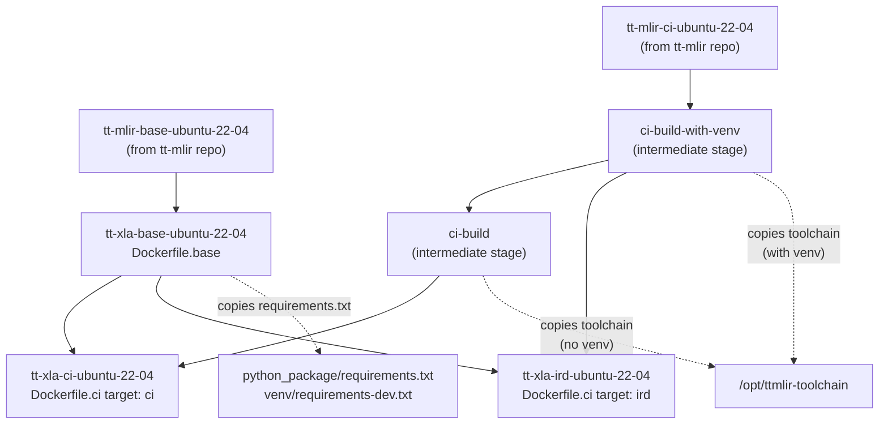
```mermaid
graph TB
    MLIR_BASE["tt-mlir-base-ubuntu-22-04<br/>(from tt-mlir repo)"]
    MLIR_CI["tt-mlir-ci-ubuntu-22-04<br/>(from tt-mlir repo)"]
    
    XLA_BASE["tt-xla-base-ubuntu-22-04<br/>Dockerfile.base"]
    XLA_CI["tt-xla-ci-ubuntu-22-04<br/>Dockerfile.ci target: ci"]
    XLA_IRD["tt-xla-ird-ubuntu-22-04<br/>Dockerfile.ci target: ird"]
    
    CI_BUILD_VENV["ci-build-with-venv<br/>(intermediate stage)"]
    CI_BUILD["ci-build<br/>(intermediate stage)"]
    
    MLIR_BASE --> XLA_BASE
    MLIR_CI --> CI_BUILD_VENV
    CI_BUILD_VENV --> CI_BUILD
    
    XLA_BASE --> XLA_CI
    XLA_BASE --> XLA_IRD
    
    CI_BUILD --> XLA_CI
    CI_BUILD_VENV --> XLA_IRD
    
    XLA_BASE -.->|"copies requirements.txt"| REQ_TXT["python_package/requirements.txt<br/>venv/requirements-dev.txt"]
    CI_BUILD -.->|"copies toolchain<br/>(no venv)"| TOOLCHAIN["/opt/ttmlir-toolchain"]
    CI_BUILD_VENV -.->|"copies toolchain<br/>(with venv)"| TOOLCHAIN
```

### Related: Intermediate Build Stages

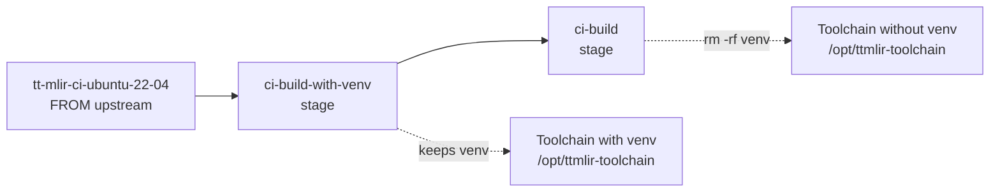
```mermaid
graph LR
    MLIR_CI["tt-mlir-ci-ubuntu-22-04<br/>FROM upstream"]
    
    CI_VENV["ci-build-with-venv<br/>stage"]
    CI_CLEAN["ci-build<br/>stage"]
    
    MLIR_CI --> CI_VENV
    CI_VENV --> CI_CLEAN
    
    CI_CLEAN -.->|"rm -rf venv"| VENV_REMOVED["Toolchain without venv<br/>/opt/ttmlir-toolchain"]
    CI_VENV -.->|"keeps venv"| VENV_KEPT["Toolchain with venv<br/>/opt/ttmlir-toolchain"]
```

```mermaid
graph TB
    START["build-docker-images.sh<br/>args: tt_mlir_sha, --check-only"]
    
    CLONE["Clone tt-mlir repo<br/>to .tmp/tt-mlir"]
    CHECKOUT["git checkout<br/>tt_mlir_sha"]
    
    GET_MLIR_TAG["Execute tt-mlir's<br/>get-docker-tag.sh"]
    CHECK_MLIR["Check if tt-mlir<br/>docker images exist"]
    
    MLIR_OK{{"tt-mlir<br/>images exist?"}}
    
    CALC_XLA_TAG["Calculate XLA docker tag<br/>get-docker-tag.sh<br/>MLIR_DOCKER_TAG"]
    
    BUILD_LOOP["For each image:<br/>base, ci, ird"]
    
    CHECK_EXISTS["docker manifest inspect<br/>image:tag"]
    
    EXISTS{{"Image<br/>exists?"}}
    
    CHECK_MODE{{"--check-only<br/>mode?"}}
    
    SKIP["Echo 'already exists'<br/>return 0"]
    
    BUILD["docker build<br/>--build-arg MLIR_TAG<br/>--build-arg FROM_TAG"]
    
    PUSH["docker push<br/>image:tag"]
    
    DONE["Output final<br/>CI_IMAGE_NAME"]
    
    START --> CLONE
    CLONE --> CHECKOUT
    CHECKOUT --> GET_MLIR_TAG
    GET_MLIR_TAG --> CHECK_MLIR
    CHECK_MLIR --> MLIR_OK
    
    MLIR_OK -->|"No"| ERROR["Exit 9:<br/>tt-mlir images<br/>must be built first"]
    MLIR_OK -->|"Yes"| CALC_XLA_TAG
    
    CALC_XLA_TAG --> BUILD_LOOP
    BUILD_LOOP --> CHECK_EXISTS
    CHECK_EXISTS --> EXISTS
    
    EXISTS -->|"Yes"| SKIP
    EXISTS -->|"No"| CHECK_MODE
    
    CHECK_MODE -->|"Yes"| REPORT["Echo 'does not exist'<br/>return 2"]
    CHECK_MODE -->|"No"| BUILD
    
    BUILD --> PUSH
    PUSH --> BUILD_LOOP
    SKIP --> BUILD_LOOP
    
    BUILD_LOOP --> DONE
```

```mermaid
graph TB
    DOCKERFILE_BASE[".github/Dockerfile.base"]
    DOCKERFILE_CI[".github/Dockerfile.ci"]
    MLIR_TAG["MLIR_DOCKER_TAG\
(parameter from tt-mlir's get-docker-tag.sh)"]

    CAT["cat Dockerfile.base Dockerfile.ci | sha256sum"]
    SHA1["DOCKERFILE_HASH"]

    COMBINE["echo DOCKERFILE_HASH MLIR_DOCKER_TAG | sha256sum"]
    SHA2["COMBINED_HASH"]

    TAG["Final tag: dt-{COMBINED_HASH}"]

    DOCKERFILE_BASE --> CAT
    DOCKERFILE_CI --> CAT
    CAT --> SHA1
    SHA1 --> COMBINE
    MLIR_TAG --> COMBINE
    COMBINE --> SHA2
    SHA2 --> TAG
```

```mermaid
graph TB
    TRIGGER["Workflow Call<br/>inputs: mlir_override,<br/>xla_sha_override"]
    
    JOB1["Job: check-if-docker-exist"]
    JOB2["Job: build-image"]
    JOB3["Job: set-latest-tag"]
    
    CHECKOUT1["Checkout<br/>ref: xla_sha_override"]
    
    GET_SHA["Extract tt_mlir_sha<br/>from CMakeLists.txt<br/>or use mlir_override"]
    
    RUN_CHECK["Run build-docker-images.sh<br/>--check-only"]
    
    EXISTS{{"Images<br/>exist?"}}
    
    OUTPUT1["Output:<br/>docker-image,<br/>docker-image-base"]
    
    SKIP_BUILD["Skip build-image job"]
    
    NEED_BUILD{{"docker-image<br/>output empty?"}}
    
    RUN_BUILD["Run build-docker-images.sh<br/>(full build)"]
    
    OUTPUT2["Output:<br/>docker-image,<br/>docker-image-base"]
    
    MAIN_PUSH{{"Push to main<br/>branch?"}}
    
    TAG_LATEST["Tag images as 'latest'<br/>using skopeo copy"]
    
    TRIGGER --> JOB1
    JOB1 --> CHECKOUT1
    CHECKOUT1 --> GET_SHA
    GET_SHA --> RUN_CHECK
    RUN_CHECK --> EXISTS
    
    EXISTS -->|"Yes"| OUTPUT1
    EXISTS -->|"No"| OUTPUT1
    
    OUTPUT1 --> NEED_BUILD
    
    NEED_BUILD -->|"Yes"| JOB2
    NEED_BUILD -->|"No"| SKIP_BUILD
    
    JOB2 --> RUN_BUILD
    RUN_BUILD --> OUTPUT2
    
    OUTPUT1 --> JOB3
    OUTPUT2 --> JOB3
    
    JOB3 --> MAIN_PUSH
    MAIN_PUSH -->|"Yes"| TAG_LATEST
    MAIN_PUSH -->|"No"| END["End"]
    TAG_LATEST --> END
```

```mermaid
graph LR
    DOCKER_BUILD["Build Docker Image<br/>call-build-docker.yml"]
    
    ARTIFACT_CHECK["Check Artifact Exists<br/>call-build.yml"]
    
    NATIVE_BUILD["Build TT-XLA<br/>setup.py bdist_wheel"]
    
    TEST_EXEC["Run Tests<br/>pytest in CI image"]
    
    DOCKER_BUILD --> ARTIFACT_CHECK
    ARTIFACT_CHECK -.->|"Artifact missing"| NATIVE_BUILD
    NATIVE_BUILD --> TEST_EXEC
    
    DOCKER_BUILD -.->|"Provides CI image"| TEST_EXEC
```

### Related: Pipeline Architecture

```mermaid
graph TB
    Input["string_view mlir_code<br/>VHLO/StableHLO from<br/>JAX/PyTorch/vLLM"]
    
    BuildModule["ModuleBuilder::buildModule()<br/>Main orchestration entry point<br/>line 208-374"]
    
    Parse["createVHLOModule()<br/>mlir::parseSourceString()<br/>line 377-393"]
    
    VHLO2SHLO["convertFromVHLOToSHLO()<br/>mlir::stablehlo::createStablehloDeserializePipeline()<br/>line 395-413"]
    
    FrontendPipeline["runFrontendSHLOPipeline()<br/>frontend_passes::annotateArgumentAttributes()<br/>line 415-426"]
    
    CollectShardings["collectInputShardings()<br/>collectOutputShardings() - GSPMD<br/>line 255-277"]
    
    CompilerPipeline["runCompilerStableHLOPipeline()<br/>mlir::tt::stablehlo::createStableHLOPipeline()<br/>line 746-772"]
    
    ShardyCheck{"isUsingShardyManualComputation()?<br/>line 289-318"}
    
    CleanXLA["cleanForXlaIngestion()<br/>Strip Shardy attributes<br/>line 309-318"]
    
    SHLO2TTIR["convertFromSHLOToTTIR()<br/>mlir::tt::ttir::createStableHLOToTTIRPipeline()<br/>line 774-800"]
    
    TTIR2TTNN["convertFromTTIRToTTNN()<br/>mlir::tt::ttnn::createTTIRToTTNNBackendPipeline()<br/>line 892-1037"]
    
    BackendChoice{"CompileOptions::backend<br/>line 353-370"}
    
    Flatbuffer["buildModuleForTTNNRuntime()<br/>createFlatbufferBinary()<br/>mlir::tt::ttnn::ttnnToFlatbuffer<br/>line 1062-1180"]
    
    Codegen["buildModuleForTTNNCodegen()<br/>performCodegen()<br/>TTAlchemistHandler::generate*<br/>line 1182-1279"]
    
    FBImage["FlatbufferExecutableImage<br/>with tt::runtime::Binary"]
    
    SOImage["SOExecutableImage<br/>with generated code path"]
    
    Input --> BuildModule
    BuildModule --> Parse
    Parse --> VHLO2SHLO
    VHLO2SHLO --> FrontendPipeline
    FrontendPipeline --> CollectShardings
    CollectShardings --> CompilerPipeline
    CompilerPipeline --> ShardyCheck
    ShardyCheck -->|"Yes"| CleanXLA
    ShardyCheck -->|"No"| SHLO2TTIR
    CleanXLA --> SHLO2TTIR
    SHLO2TTIR --> TTIR2TTNN
    TTIR2TTNN --> BackendChoice
    BackendChoice -->|"BackendRuntime::TTNNFlatbuffer"| Flatbuffer
    BackendChoice -->|"BackendRuntime::TTNNCodegen*"| Codegen
    Flatbuffer --> FBImage
    Codegen --> SOImage
```

```mermaid
graph TB
    ModuleBuilder["ModuleBuilder<br/>pjrt_implementation/inc/api/<br/>module_builder/module_builder.h:121"]
    
    Context["m_context<br/>std::unique_ptr&lt;mlir::MLIRContext&gt;<br/>line 350<br/>Initialized in constructor<br/>with all dialects registered"]
    
    Alchemist["m_tt_alchemist_handler<br/>TTAlchemistHandler<br/>line 353<br/>Dynamic library loader<br/>for code generation"]
    
    GraphState["m_graph_counter: int<br/>m_last_model_name: string<br/>lines 357-358<br/>Tracks g0, g1, ... numbering"]
    
    PublicAPI["buildModule()<br/>line 128-132<br/>Main entry point<br/>Returns tuple&lt;tt_pjrt_status,<br/>shared_ptr&lt;ExecutableImage&gt;&gt;"]
    
    Converters["createVHLOModule() - line 143<br/>convertFromVHLOToSHLO() - line 150<br/>convertFromSHLOToTTIR() - line 187<br/>convertFromTTIRToTTNN() - line 210"]
    
    Collectors["collectInputShardings() - line 170<br/>collectOutputShardings() - line 175<br/>collectNumArguments() - line 166<br/>collectMeshShape() - line 194<br/>collectNumDevicesToUtilize() - line 206"]
    
    Builders["buildModuleForTTNNRuntime() - line 308<br/>buildModuleForTTNNCodegen() - line 326<br/>createFlatbufferBinary() - line 217<br/>performCodegen() - line 346"]
    
    Helpers["getPublicFuncOps() - line 304<br/>printModule() - line 243<br/>createShardingsFromGSPMD() - line 286<br/>createShardingsFromShardy() - line 293"]
    
    ModuleBuilder --> Context
    ModuleBuilder --> Alchemist
    ModuleBuilder --> GraphState
    ModuleBuilder --> PublicAPI
    PublicAPI --> Converters
    PublicAPI --> Collectors
    PublicAPI --> Builders
    Builders --> Helpers
```

### Related: Graph Counter System

```mermaid
graph LR
    Input["export_model_name:<br/>my_model"]
    
    Check{"model_name changed?"}
    
    Reset["m_graph_counter = 0<br/>m_last_model_name = model_name"]
    
    Increment["graph_num = m_graph_counter++"]
    
    Append["export_model_name += '_g' + graph_num<br/>Result: my_model_g0, my_model_g1, ..."]
    
    Input --> Check
    Check -->|"Yes"| Reset
    Check -->|"No"| Increment
    Reset --> Increment
    Increment --> Append
```

```mermaid
graph TB
    CompileOptions["CompileOptions"]
    
    Optimization["optimization_level: int<br/>0 = none, 1 = basic, 2 = advanced"]
    
    DataType["Data Type Options:<br/>enable_bfp8_conversion: bool<br/>experimental_enable_weight_bfp8_conversion: bool"]
    
    ComputeKernel["Compute Kernel Config:<br/>math_fidelity: optional&lt;string&gt;<br/>fp32_dest_acc_en: optional&lt;bool&gt;"]
    
    Optimizations["Optimization Flags:<br/>experimental_enable_fusing_conv2d_with_multiply_pattern<br/>experimental_enable_permute_matmul_fusion<br/>enable_const_eval"]
    
    Backend["backend: BackendRuntime<br/>TTNNFlatbuffer | TTNNCodegenCpp | TTNNCodegenPy"]
    
    Performance["Performance:<br/>enable_trace: bool<br/>ttnn_perf_metrics_enabled: bool<br/>ttnn_perf_metrics_output_file: string"]
    
    Export["Export Options:<br/>export_path: optional&lt;string&gt;<br/>export_model_name: string<br/>export_tensors: bool<br/>codegen_try_recover_structure: bool"]
    
    CompileOptions --> Optimization
    CompileOptions --> DataType
    CompileOptions --> ComputeKernel
    CompileOptions --> Optimizations
    CompileOptions --> Backend
    CompileOptions --> Performance
    CompileOptions --> Export
```

```mermaid
graph TB
    TTNNModule["mlir::OwningOpRef&lt;mlir::ModuleOp&gt;<br/>After convertFromTTIRToTTNN()<br/>line 892-1037"]
    
    BackendSwitch{"CompileOptions::backend<br/>line 353-370"}
    
    FlatbufferPath["BackendRuntime::TTNNFlatbuffer<br/>Default runtime"]
    
    CodegenCppPath["BackendRuntime::TTNNCodegenCpp<br/>Generate C++ code"]
    
    CodegenPyPath["BackendRuntime::TTNNCodegenPy<br/>Generate Python code"]
    
    BuildRuntime["buildModuleForTTNNRuntime()<br/>line 1062-1180"]
    
    BuildCodegen["buildModuleForTTNNCodegen()<br/>line 1182-1279"]
    
    CreateBinary["createFlatbufferBinary()<br/>mlir::tt::ttnn::ttnnToFlatbuffer()<br/>line 1351-1365"]
    
    VerifyBinary["verifyCreatedFlatbufferBinary()<br/>Check input/output counts<br/>line 1367-1392"]
    
    CodegenFunc["performCodegen()<br/>TTAlchemistHandler::generate*<br/>line 1458-1524"]
    
    RuntimeBinary["tt::runtime::Binary<br/>Flatbuffer format<br/>m_flatbuffer_binary"]
    
    CodeFiles["Generated files at<br/>export_path/solutions/<br/>*.cpp or *.py"]
    
    FBImage["FlatbufferExecutableImage::createInstance()<br/>line 29-89<br/>Contains Binary + metadata"]
    
    SOImage["SOExecutableImage::createInstance()<br/>line 91-145<br/>Contains code path + metadata"]
    
    TTNNModule --> BackendSwitch
    BackendSwitch -->|"TTNNFlatbuffer"| FlatbufferPath
    BackendSwitch -->|"TTNNCodegenCpp"| CodegenCppPath
    BackendSwitch -->|"TTNNCodegenPy"| CodegenPyPath
    
    FlatbufferPath --> BuildRuntime
    CodegenCppPath --> BuildCodegen
    CodegenPyPath --> BuildCodegen
    
    BuildRuntime --> CreateBinary
    CreateBinary --> VerifyBinary
    VerifyBinary --> RuntimeBinary
    RuntimeBinary --> FBImage
    
    BuildCodegen --> CodegenFunc
    CodegenFunc --> CodeFiles
    CodeFiles --> SOImage
```

### Related: Pipeline Overview

```mermaid
graph TB
    Input["torch.fx.GraphModule<br/>from torch.compile"]
    
    FusionCheck{"tt_enable_torch_fx_fusion_pass<br/>option enabled?"}
    FusionPass["run_fusion_passes()<br/>Pattern-based fusion"]
    
    CompositeCheck{"tt_enable_composite_ops<br/>option enabled?"}
    CompositePass["handle_composite_ops()<br/>Wrap high-level ops"]
    
    Export["torch.export.export()<br/>Capture graph"]
    Decompose["run_decompositions()<br/>Custom decompositions"]
    
    ArgMarkers["insert_argument_type_markers()<br/>Mark inputs/params/constants"]
    DtypePass["bypass_dtype_promotion_and_redundant_cast()<br/>Remove unwanted casts"]
    GetitemPass["bypass_redundant_getitem()<br/>Simplify tuple access"]
    AssertPass["bypass_assert_tensor_metadata()<br/>Remove CPU assertions"]
    
    Recompile["GraphModule.recompile()<br/>Finalize modifications"]
    MetadataExtract["extract_nodes_info()<br/>For debugging"]
    
    Output["Transformed GraphModule<br/>+ ExportGraphSignature<br/>+ node metadata"]
    
    Input --> FusionCheck
    FusionCheck -->|"True (default)"| FusionPass
    FusionCheck -->|False| CompositeCheck
    FusionPass --> CompositeCheck
    
    CompositeCheck -->|"True (default)"| CompositePass
    CompositeCheck -->|False| Export
    CompositePass --> Export
    
    Export --> Decompose
    Decompose --> ArgMarkers
    ArgMarkers --> DtypePass
    DtypePass --> GetitemPass
    GetitemPass --> AssertPass
    AssertPass --> Recompile
    Recompile --> MetadataExtract
    MetadataExtract --> Output
```

### Related: Fusion Provider Architecture

```mermaid
graph TB
    subgraph "Registration"
        FusionProvider["FusionProvider<br/>(ABC)"]
        Register["__init_subclass__<br/>Auto-registration"]
        Registry["_registered_providers<br/>Class list"]
    end
    
    subgraph "Provider Implementation"
        RMSNormProvider["RMSNormFusionProvider"]
        ProviderName["name property<br/>'rms_norm_fusion'"]
        Pattern["pattern() static method<br/>Pattern to match"]
        Replacement["replacement() static method<br/>Replacement function"]
        MatchFilter["match_filter() static method<br/>Optional validation"]
    end
    
    subgraph "Execution"
        RunFusion["run_fusion_passes(gm)"]
        GetProviders["get_registered_providers()"]
        ReplacePattern["provider.replace_pattern(gm)"]
        TorchRewriter["torch.fx.subgraph_rewriter<br/>replace_pattern_with_filters"]
    end
    
    FusionProvider --> Register
    Register --> Registry
    
    RMSNormProvider -.inherits.-> FusionProvider
    RMSNormProvider --> ProviderName
    RMSNormProvider --> Pattern
    RMSNormProvider --> Replacement
    RMSNormProvider --> MatchFilter
    
    RunFusion --> GetProviders
    GetProviders --> Registry
    RunFusion --> ReplacePattern
    ReplacePattern --> Pattern
    ReplacePattern --> Replacement
    ReplacePattern --> MatchFilter
    ReplacePattern --> TorchRewriter
```

```mermaid
graph TB
    subgraph "Compile Time"
        FXGraph["FX Graph<br/>with stack_trace metadata"]
        ExtractInfo["extract_nodes_info(gm)<br/>Parse stack traces"]
        NodeInfo["dict[node_name] -> metadata_string<br/>'{op_index}|{modules}|{file}|{func}|{line}|'"]
    end
    
    subgraph "Runtime"
        Interpreter["MetadataInterpreter<br/>Executes FX graph"]
        ContextVar["_current_node_metadata<br/>ContextVar"]
        DispatchMode["MetadataDispatchMode<br/>Intercepts operations"]
        SetMetadata["torch_xla._XLAC._set_xla_custom_op_name_prefix<br/>Attach to XLA tensor"]
    end
    
    subgraph "HLO IR Output"
        HLONode["HLO operation node<br/>with location metadata"]
    end
    
    FXGraph --> ExtractInfo
    ExtractInfo --> NodeInfo
    
    NodeInfo --> Interpreter
    Interpreter --> ContextVar
    ContextVar --> DispatchMode
    DispatchMode --> SetMetadata
    SetMetadata --> HLONode
```

### Related: XLAExecutor and Graph Cutting

```mermaid
graph TB
    subgraph "Initialization"
        Module["Transformed GraphModule"]
        Signature["ExportGraphSignature"]
        NodeInfo["Node metadata dict"]
        Executor["XLAExecutor.__init__"]
    end
    
    subgraph "Execution Modes"
        LegacyCheck{"legacy_compile_enabled?"}
        LegacyPath["Legacy: module(*args)<br/>Trace on every call"]
        ExperimentalPath["Experimental: extract_compiled_graph<br/>Cache and reuse"]
    end
    
    subgraph "Graph Cutting"
        OutputCheck{"Functional output only?"}
        SyncMulti["_xla_sync_multi(output, devices)<br/>Cut at user outputs"]
        SyncAll["xla.sync()<br/>Force all mutations"]
    end
    
    Module --> Executor
    Signature --> Executor
    NodeInfo --> Executor
    
    Executor --> LegacyCheck
    LegacyCheck -->|True| LegacyPath
    LegacyCheck -->|"False (default)"| ExperimentalPath
    
    LegacyPath --> OutputCheck
    ExperimentalPath --> OutputCheck
    
    OutputCheck -->|"All USER_OUTPUT"| SyncMulti
    OutputCheck -->|"Has mutations"| SyncAll
```

### Related: System Overview

```mermaid
graph LR
    Input["FX Graph<br/>(torch ops)"]
    Fusion["Fusion Pass<br/>detect & fuse patterns"]
    Composite["Composite Ops Pass<br/>wrap high-level ops"]
    Decomp["Decomposition Pass<br/>break down ops"]
    Output["Transformed Graph<br/>(tt-mlir compatible)"]
    
    Input --> Fusion
    Fusion --> Composite
    Composite --> Decomp
    Decomp --> Output
```

### Related: Architecture

```mermaid
graph TB
    subgraph "Decomposition Registration"
        PopDec["populate_decompositions()"]
        CoreAten["core_aten_decompositions()"]
        DefaultOps["_get_default_decomposition_ops()"]
        CustomOps["_get_custom_decompositions()"]
    end
    
    subgraph "Decomposition Table"
        Table["DecompositionTable<br/>Dict[OpOverload, Callable]"]
    end
    
    subgraph "Export Pipeline"
        Export["torch.export.export()"]
        RunDecomp["program.run_decompositions()"]
    end
    
    PopDec --> CoreAten
    PopDec --> DefaultOps
    PopDec --> CustomOps
    
    CoreAten --> Table
    DefaultOps --> Table
    CustomOps --> Table
    
    Table --> RunDecomp
    Export --> RunDecomp
```

```mermaid
graph LR
    subgraph "PyTorch Operations"
        UN1["aten.upsample_nearest1d"]
        UN2["aten.upsample_nearest2d"]
        UN3["aten.upsample_nearest3d"]
        UL1["aten.upsample_linear1d"]
        UB2["aten.upsample_bilinear2d"]
        UT3["aten.upsample_trilinear3d"]
    end
    
    subgraph "Decomposition Functions"
        UNV["upsample_nearest_vec"]
        UND["upsample_nearest_default"]
        ULV["upsample_linear_vec"]
        ULD["upsample_linear_default"]
    end
    
    subgraph "Weight Computation"
        CNW["compute_nearest_weight"]
        CLW["compute_linear_weight"]
    end
    
    subgraph "Core Implementation"
        MatMul["Matrix Multiplication<br/>res = input @ weight"]
    end
    
    UN1 --> UNV
    UN2 --> UNV
    UN3 --> UNV
    
    UL1 --> ULV
    UB2 --> ULV
    UT3 --> ULV
    
    UNV --> UND
    ULV --> ULD
    
    UND --> CNW
    ULD --> CLW
    
    CNW --> MatMul
    CLW --> MatMul
```

### Related: Fusion Provider Architecture

```mermaid
graph TB
    subgraph "Provider Registration"
        Base["FusionProvider<br/>(ABC)"]
        Subclass["RMSNormFusionProvider"]
        Registry["_registered_providers<br/>(class list)"]
    end
    
    subgraph "Provider Interface"
        Name["name property"]
        Pattern["pattern() static method"]
        Replacement["replacement() static method"]
        Filter["match_filter() method"]
    end
    
    subgraph "Execution"
        Runner["run_fusion_passes(gm)"]
        Loop["For each provider"]
        Replace["provider.replace_pattern(gm)"]
    end
    
    Base --> Subclass
    Subclass -->|"__init_subclass__"| Registry
    
    Subclass --> Name
    Subclass --> Pattern
    Subclass --> Replacement
    Subclass --> Filter
    
    Runner --> Loop
    Loop --> Registry
    Loop --> Replace
    Replace --> Pattern
    Replace --> Replacement
    Replace --> Filter
```

### Related: Integration in Compilation Pipeline

```mermaid
graph TB
    Input["FX GraphModule"]
    
    Fusion["run_fusion_passes(gm)<br/>Detect & fuse patterns<br/>e.g., RMS norm"]
    
    Composite["handle_composite_ops(gm)<br/>Wrap high-level ops<br/>e.g., GELU, layer norm"]
    
    Export["torch.export.export(gm)<br/>Create ExportedProgram"]
    
    Decomp["program.run_decompositions()<br/>Apply decomposition table<br/>from populate_decompositions()"]
    
    Other["Other passes:<br/>- insert_argument_type_markers<br/>- bypass_dtype_promotion<br/>- bypass_redundant_getitem<br/>- bypass_assert_tensor_metadata"]
    
    Output["Compiled GraphModule"]
    
    Input --> Fusion
    Fusion --> Composite
    Composite --> Export
    Export --> Decomp
    Decomp --> Other
    Other --> Output
```

### Related: Integration Architecture

```mermaid
graph TB
    subgraph "User Code"
        JAXCode["JAX Program<br/>@jax.jit decorated"]
        FlaxModel["Flax Model<br/>nn.Module"]
    end
    
    subgraph "JAX Framework"
        JIT["jax.jit()<br/>Tracing Engine"]
        JAXJIT["JAX JIT Compiler"]
        XLAInterface["XLA Interface"]
    end
    
    subgraph "jax_plugin_tt Package"
        PluginInit["jax_plugin_tt/__init__.py<br/>Plugin Registration"]
        PluginDiscovery["Device Discovery<br/>jax.devices('tt')"]
    end
    
    subgraph "pjrt_plugin_tt Package"
        PJRTPlugin["pjrt_plugin_tt.so<br/>PJRT C API Implementation"]
        DeviceManager["Device Management<br/>TTDevice objects"]
    end
    
    subgraph "TT-MLIR Compiler"
        StableHLO["StableHLO Graph<br/>Serialized Program"]
        Compiler["TT-MLIR<br/>TTIR → TTNN"]
    end
    
    subgraph "TT-Metal Runtime"
        Runtime["tt-metal libraries<br/>Kernel execution"]
        Hardware["Tenstorrent Device<br/>n150, p150, n300, etc."]
    end
    
    JAXCode --> JIT
    FlaxModel --> JIT
    JIT --> JAXJIT
    JAXJIT --> XLAInterface
    
    XLAInterface --> PluginInit
    PluginInit --> PJRTPlugin
    PluginDiscovery --> DeviceManager
    
    PJRTPlugin --> StableHLO
    StableHLO --> Compiler
    Compiler --> Runtime
    Runtime --> Hardware
    
    Hardware -.Results.-> PJRTPlugin
    PJRTPlugin -.Tensors.-> XLAInterface
```

### Related: JAX Compilation Flow

```mermaid
graph LR
    subgraph "User Space"
        UserFunc["@jax.jit<br/>def my_fn(x):<br/>  return f(x)"]
        Input["JAX Arrays<br/>Input Data"]
    end
    
    subgraph "JAX Tracing"
        Trace["Function Tracing<br/>Abstract Evaluation"]
        HLO["HLO IR Generation<br/>JAX primitives → HLO"]
    end
    
    subgraph "PJRT Interface"
        PJRTCompile["PJRT_Client_Compile()<br/>Compilation Request"]
        PJRTExecute["PJRT_LoadedExecutable_Execute()<br/>Execution Request"]
    end
    
    subgraph "TT-XLA Processing"
        StableHLO["StableHLO Graph<br/>Serialized format"]
        Metadata["Metadata Extraction<br/>Shape, dtype info"]
    end
    
    subgraph "TT-MLIR Compilation"
        MLIR["MLIR Import<br/>StableHLO dialect"]
        TTIR["TTIR Lowering<br/>TT-specific ops"]
        TTNN["TTNN Lowering<br/>Kernel selection"]
        Binary["Compiled Binary<br/>Device program"]
    end
    
    subgraph "Execution"
        TTMetal["TT-Metal Runtime<br/>Program loading"]
        Device["Device Execution<br/>Kernel dispatch"]
        Results["Output Arrays<br/>JAX format"]
    end
    
    UserFunc --> Trace
    Input --> Trace
    Trace --> HLO
    HLO --> PJRTCompile
    
    PJRTCompile --> StableHLO
    StableHLO --> Metadata
    Metadata --> MLIR
    
    MLIR --> TTIR
    TTIR --> TTNN
    TTNN --> Binary
    
    Binary --> TTMetal
    Input --> PJRTExecute
    PJRTExecute --> TTMetal
    TTMetal --> Device
    Device --> Results
    Results --> UserFunc
```

### Related: StableHLO Graph Generation

```mermaid
graph TB
    subgraph "JAX Computation"
        JAXOps["JAX Operations<br/>jnp.add, jnp.matmul, etc."]
    end
    
    subgraph "StableHLO Graph"
        HLOOps["StableHLO Operations<br/>stablehlo.add, stablehlo.dot, etc."]
        HLOTypes["Type Information<br/>Shapes, dtypes"]
        HLOControl["Control Flow<br/>while, cond, etc."]
    end
    
    subgraph "Metadata"
        ShapeInfo["Shape Information<br/>Tensor dimensions"]
        DTypeInfo["Data Type Info<br/>f32, f16, i32, etc."]
        LayoutInfo["Layout Hints<br/>Memory layout preferences"]
    end
    
    subgraph "TTIR Conversion"
        TTIROps["TTIR Operations<br/>ttir.add, ttir.matmul<br/>ttir.rms_norm, etc."]
    end
    
    JAXOps --> HLOOps
    HLOOps --> HLOTypes
    HLOOps --> HLOControl
    HLOTypes --> ShapeInfo
    HLOTypes --> DTypeInfo
    HLOTypes --> LayoutInfo
    
    HLOOps --> TTIROps
    ShapeInfo --> TTIROps
    DTypeInfo --> TTIROps
```

### Related: Test Discovery and Entry Points

```mermaid
graph TB
    subgraph "Test Discovery Phase"
        TorchLoader["TorchDynamicLoader.setup_test_discovery()"]
        JaxLoader["JaxDynamicLoader.setup_test_discovery()"]
        ModelsRoot["MODELS_ROOT_TORCH<br/>MODELS_ROOT_JAX"]
        TestEntries["test_entries_torch<br/>test_entries_jax<br/>List[ModelTestEntry]"]
    end
    
    subgraph "Pytest Parametrization"
        TestModels["test_models.py<br/>test_all_models_torch()<br/>test_all_models_jax()"]
        Parametrize["@pytest.mark.parametrize<br/>run_mode, parallelism, test_entry"]
        LLMTests["test_llms_torch()<br/>prefill/decode phases"]
    end
    
    subgraph "Test Configuration"
        ConfigFixture["test_metadata fixture<br/>conftest.py"]
        YAMLConfig["YAML test configs<br/>ModelTestConfig"]
    end
    
    subgraph "Test Execution"
        TestImpl["_run_model_test_impl()"]
        TorchTester["DynamicTorchModelTester"]
        JaxTester["DynamicJaxModelTester"]
    end
    
    TorchLoader --> TestEntries
    JaxLoader --> TestEntries
    TestEntries --> ModelsRoot
    
    TestEntries --> Parametrize
    Parametrize --> TestModels
    Parametrize --> LLMTests
    
    TestModels --> ConfigFixture
    ConfigFixture --> YAMLConfig
    
    TestModels --> TestImpl
    TestImpl --> TorchTester
    TestImpl --> JaxTester
```

```mermaid
graph TB
    subgraph "Abstract Base Classes"
        BaseTester["BaseTester<br/>infra/testers/base_tester.py"]
        ModelTester["ModelTester<br/>infra/testers/single_chip/model/model_tester.py"]
    end
    
    subgraph "Framework-Specific Testers"
        TorchTester["TorchModelTester<br/>_compile_for_cpu()<br/>_compile_for_tt_device()<br/>_test_training()"]
        JaxTester["JaxModelTester<br/>_compile_for_cpu()<br/>_compile_for_tt_device()"]
    end
    
    subgraph "Dynamic Loaders"
        DynamicTorch["DynamicTorchModelTester<br/>_get_model()<br/>_get_input_activations()"]
        DynamicJax["DynamicJaxModelTester"]
        DynamicJaxMulti["DynamicJaxMultiChipModelTester"]
    end
    
    subgraph "Workload Abstraction"
        Workload["Workload<br/>framework, executable, args, kwargs"]
        TorchWorkload["TorchWorkload<br/>model, args, kwargs, mesh, shard_spec_fn"]
    end
    
    BaseTester --> ModelTester
    ModelTester --> TorchTester
    ModelTester --> JaxTester
    
    TorchTester --> DynamicTorch
    JaxTester --> DynamicJax
    JaxTester --> DynamicJaxMulti
    
    TorchTester --> TorchWorkload
    TorchWorkload --> Workload
```

### Related: Dynamic Test Discovery

```mermaid
graph LR
    subgraph "Discovery Process"
        SetupDiscovery["TorchDynamicLoader.setup_test_discovery()"]
        FindLoaders["_find_all_loaders()<br/>Scan loader.py files"]
        LoadModule["importlib.import_module()"]
        GetVariants["get_variants()"]
        ModelTestEntry["ModelTestEntry<br/>path, variant_info, framework"]
    end
    
    subgraph "Pytest Integration"
        Parametrize["@pytest.mark.parametrize<br/>test_entry parameter"]
        TestID["create_test_id_generator()<br/>Generate readable test IDs"]
        CollectionTime["Pytest collection phase"]
    end
    
    SetupDiscovery --> FindLoaders
    FindLoaders --> LoadModule
    LoadModule --> GetVariants
    GetVariants --> ModelTestEntry
    
    ModelTestEntry --> Parametrize
    Parametrize --> TestID
    TestID --> CollectionTime
```

### Related: ComparisonConfig and Metrics

```mermaid
graph TB
    subgraph "ComparisonConfig"
        Config["ComparisonConfig"]
        PCC["pcc.enabled<br/>pcc.required_pcc = 0.99"]
        ATOL["atol.enabled<br/>atol.required_atol"]
        ALLCLOSE["allclose.enabled<br/>allclose.rtol<br/>allclose.atol"]
    end
    
    subgraph "ModelTestConfig Conversion"
        TestConfig["ModelTestConfig<br/>YAML configuration"]
        Convert["to_comparison_config()"]
    end
    
    subgraph "Comparison Execution"
        CPUResult["CPU output"]
        TTResult["TT device output"]
        Compare["_compare_results()"]
        CompResult["ComparisonResult<br/>pcc, atol, passed, error_message"]
    end
    
    TestConfig --> Convert
    Convert --> Config
    
    Config --> PCC
    Config --> ATOL
    Config --> ALLCLOSE
    
    CPUResult --> Compare
    TTResult --> Compare
    Config --> Compare
    Compare --> CompResult
```

```mermaid
graph TB
    subgraph "Stage Markers"
        Marker1["FE_COMPILATION_START"]
        Marker2["TTMLIR_COMPILATION_START"]
        Marker3["RUNTIME_EXECUTION_START"]
    end
    
    subgraph "Stage File"
        StageFile["._bringup_stage.txt<br/>Written by C++ pipeline"]
        Parse["parse_last_bringup_stage()"]
    end
    
    subgraph "Status Mapping"
        FEFail["FAILED_FE_COMPILATION"]
        MLIRFail["FAILED_TTMLIR_COMPILATION"]
        RTFail["FAILED_RUNTIME"]
    end
    
    Marker1 --> StageFile
    Marker2 --> StageFile
    Marker3 --> StageFile
    
    StageFile --> Parse
    
    Parse --> FEFail
    Parse --> MLIRFail
    Parse --> RTFail
```

```mermaid
graph TB
    subgraph "Input Data"
        ModelInfo["model_info<br/>name, task, group, variant"]
        TestMetadata["test_metadata<br/>status, pcc, reason"]
        CompResults["comparison_results"]
        TestPassed["test_passed boolean"]
    end
    
    subgraph "Property Assembly"
        Tags["tags dict"]
        TestName["test_name, specific_test_case"]
        Status["bringup_status, model_test_status"]
        Metrics["pcc, atol, comparison_passed"]
        FailReason["failing_reason, runtime_reason"]
        Guidance["guidance tags<br/>RM_XFAIL, ADD_CONFIG,<br/>ENABLE_PCC, RAISE_PCC"]
    end
    
    subgraph "Pytest Integration"
        RecordProp["record_property()<br/>pytest fixture"]
        UserProps["request.node.user_properties"]
        XMLReport["JUnit XML report"]
    end
    
    subgraph "Control Flow"
        SkipCheck["Check NOT_SUPPORTED_SKIP"]
        Skip["pytest.skip(reason)"]
        XfailCheck["Check KNOWN_FAILURE_XFAIL"]
        Xfail["pytest.xfail(reason)"]
    end
    
    ModelInfo --> Tags
    TestMetadata --> Tags
    CompResults --> Metrics
    TestPassed --> Status
    
    Tags --> RecordProp
    Metrics --> RecordProp
    FailReason --> RecordProp
    Guidance --> RecordProp
    
    RecordProp --> UserProps
    UserProps --> XMLReport
    
    Status --> SkipCheck
    SkipCheck --> Skip
    Status --> XfailCheck
    XfailCheck --> Xfail
```

```mermaid
graph TB
    subgraph "Test Parametrization"
        Param["@pytest.mark.parametrize('parallelism', ...)"]
        SingleDev["SINGLE_DEVICE"]
        DataPar["DATA_PARALLEL"]
        TensorPar["TENSOR_PARALLEL"]
    end
    
    subgraph "Tester Selection"
        Framework{Framework?}
        TorchSingle["DynamicTorchModelTester"]
        JaxSingle["DynamicJaxModelTester"]
        JaxMulti["DynamicJaxMultiChipModelTester"]
    end
    
    subgraph "Configuration"
        Mesh["Mesh(device_ids, axis_names)"]
        ShardSpec["shard_spec_fn<br/>Define parameter sharding"]
        Workload["TorchWorkload<br/>mesh, shard_spec_fn"]
    end
    
    Param --> SingleDev
    Param --> DataPar
    Param --> TensorPar
    
    SingleDev --> Framework
    DataPar --> Framework
    TensorPar --> Framework
    
    Framework -->|Torch| TorchSingle
    Framework -->|JAX Single| JaxSingle
    Framework -->|JAX Multi| JaxMulti
    
    TensorPar --> Mesh
    TensorPar --> ShardSpec
    Mesh --> Workload
    ShardSpec --> Workload
```

```mermaid
graph TB
    subgraph "Test Parameters"
        Phase["RunPhase<br/>LLM_PREFILL | LLM_DECODE"]
        SeqLen["sequence_length<br/>None, 128, 1024, 2048, 4096, 8192"]
        Batch["batch_size<br/>1, 2"]
    end
    
    subgraph "Input Loading"
        LoaderCheck{Loader has<br/>load_inputs_prefill()?}
        LoadPrefill["load_inputs_prefill(seq_len, batch)"]
        LoadDecode["load_inputs_decode(batch)"]
        DefaultInput["load_inputs()"]
    end
    
    subgraph "Test Execution"
        Tester["DynamicTorchModelTester"]
        CompareResults["Compare CPU vs TT output"]
    end
    
    Phase --> LoaderCheck
    SeqLen --> LoadPrefill
    Batch --> LoadPrefill
    Batch --> LoadDecode
    
    LoaderCheck -->|Prefill| LoadPrefill
    LoaderCheck -->|Decode| LoadDecode
    LoaderCheck -->|No special method| DefaultInput
    
    LoadPrefill --> Tester
    LoadDecode --> Tester
    DefaultInput --> Tester
    
    Tester --> CompareResults
```

### Related: FailingReasonsFinder Architecture

```mermaid
graph TB
    subgraph "Exception Capture"
        TestExc["Test raises Exception"]
        CaptureStdout["Capture stdout/stderr"]
        GetTraceback["Get long traceback repr"]
    end
    
    subgraph "ExceptionData Construction"
        BuildData["FailingReasonsFinder.build_ex_data()"]
        ExData["ExceptionData:<br/>class_name, message, error_log<br/>stdout, stderr"]
    end
    
    subgraph "Pattern Matching Engine"
        FindReason["FailingReasonsFinder.find_reason_by_ex_data()"]
        IterReasons["Iterate FailingReasons enum"]
        CheckPattern["FailingReason.check(ex_data)"]
        
        subgraph "ExceptionCheck Validation"
            CheckClass["Check class_name"]
            CheckComponent["Check component (XLA/METAL/TTNN/TORCH)"]
            CheckMessage["Check message matchers"]
            CheckLog["Check error_log matchers"]
            CheckStdout["Check stdout matchers"]
            CheckStderr["Check stderr matchers"]
        end
    end
    
    subgraph "Result"
        ExReason["ExceptionReason:<br/>failing_reasons, summary"]
        UpdateMeta["update_test_metadata_for_exception()"]
        SetAttrs["Set failing_reason,<br/>failing_reason_summary<br/>on test_metadata"]
    end
    
    TestExc --> CaptureStdout
    CaptureStdout --> GetTraceback
    GetTraceback --> BuildData
    BuildData --> ExData
    ExData --> FindReason
    FindReason --> IterReasons
    IterReasons --> CheckPattern
    CheckPattern --> CheckClass
    CheckClass --> CheckComponent
    CheckComponent --> CheckMessage
    CheckMessage --> CheckLog
    CheckLog --> CheckStdout
    CheckStdout --> CheckStderr
    CheckStderr --> ExReason
    ExReason --> UpdateMeta
    UpdateMeta --> SetAttrs
```

### Related: Discovery Flow

```mermaid
graph TB
    subgraph "Test Discovery Phase"
        A["TorchDynamicLoader.setup_test_discovery()"]
        B["JaxDynamicLoader.setup_test_discovery()"]
        C["scan_loader_directories()"]
        D["validate_loader_class()"]
        E["collect test_entries_torch[]"]
        F["collect test_entries_jax[]"]
    end
    
    subgraph "Model Loaders Repository"
        G["third_party/tt_forge_models/"]
        H["torch/modelname/loader.py"]
        I["jax/modelname/loader.py"]
        J["ModelLoader base class"]
        K["variant_name property"]
    end
    
    subgraph "Test Parameterization"
        L["pytest.mark.parametrize"]
        M["test_entry: ModelTestEntry"]
        N["run_mode: INFERENCE|TRAINING"]
        O["parallelism: SINGLE_DEVICE|DATA_PARALLEL|TENSOR_PARALLEL"]
        P["Generated test IDs"]
    end
    
    A --> C
    B --> C
    C --> G
    C --> H
    C --> I
    H --> D
    I --> D
    D --> J
    D --> K
    D --> E
    D --> F
    
    E --> L
    F --> L
    L --> M
    L --> N
    L --> O
    M --> P
    N --> P
    O --> P
    
    style A fill:#f9f9f9
    style B fill:#f9f9f9
    style L fill:#f9f9f9
```

```mermaid
graph LR
    subgraph "Test Parameters"
        A["test_entry<br/>(falcon/3_1B_Base)"]
        B["run_mode<br/>(inference)"]
        C["parallelism<br/>(single_device)"]
    end
    
    subgraph "Generated Test ID"
        D["falcon/pytorch-3_1B_Base-single_device-inference"]
    end
    
    subgraph "Test Markers Applied"
        E["@pytest.mark.model_test"]
        F["@pytest.mark.inference"]
        G["@pytest.mark.single_device"]
        H["@pytest.mark.n150<br/>@pytest.mark.p150"]
    end
    
    A --> D
    B --> D
    C --> D
    D --> E
    D --> F
    D --> G
    D --> H
```

```mermaid
graph TB
    subgraph "CPU Training Baseline"
        A["Forward: cpu_res = model(*args, **kwargs)"]
        B["Generate random_grad tensor"]
        C["Backward: cpu_res.backward(gradient=random_grad)"]
        D["Extract CPU gradients: _extract_grads()"]
        E["model.zero_grad()"]
    end
    
    subgraph "TT Device Training"
        F["Forward: tt_res = model(*args, **kwargs)"]
        G["torch_xla.sync(wait=True)"]
        H["Backward: tt_res.backward(gradient=random_grad)"]
        I["Extract TT gradients: _extract_grads()"]
        J["For tensor_parallel: mark_gradient_sharding()"]
    end
    
    subgraph "Comparison"
        K["Compare forward outputs"]
        L["Compare gradients"]
        M["Return tuple of ComparisonResults"]
    end
    
    A --> B
    B --> C
    C --> D
    D --> E
    
    E --> F
    F --> G
    G --> H
    H --> I
    I --> J
    
    J --> K
    J --> L
    K --> M
    L --> M
```

```mermaid
graph TB
    subgraph "Test Execution Result"
        A["test_passed: bool"]
        B["comparison_results: List[ComparisonResult]"]
        C["exception: Optional[Exception]"]
    end
    
    subgraph "Metadata Enrichment"
        D["test_metadata: ModelTestConfig"]
        E["model_info: ModelInfo"]
        F["parse_last_bringup_stage()"]
        G["update_test_metadata_for_exception()"]
        H["FailingReasonsFinder.find_reason_by_exception()"]
    end
    
    subgraph "Property Tags"
        I["test_name, specific_test_case"]
        J["category, model_name, run_mode"]
        K["bringup_status, model_test_status"]
        L["failing_reason with component"]
        M["parallelism, arch, seq_len, batch_size"]
        N["pcc, atol, comparison_passed"]
        O["guidance tags (RM_XFAIL, ENABLE_PCC, etc.)"]
    end
    
    subgraph "Pytest Actions"
        P["record_property() for each tag"]
        Q["pytest.skip() if NOT_SUPPORTED_SKIP"]
        R["pytest.xfail() if KNOWN_FAILURE_XFAIL"]
    end
    
    A --> D
    B --> D
    C --> G
    G --> H
    F --> K
    H --> L
    
    D --> I
    E --> J
    D --> K
    D --> L
    D --> M
    B --> N
    N --> O
    
    I --> P
    J --> P
    K --> P
    L --> P
    M --> P
    N --> P
    O --> P
    
    K --> Q
    K --> R
```

```mermaid
graph TD
    A["Test Execution Flow"]
    B{Test Passed?}
    C{comparison_results exist?}
    D["Check PCC values"]
    E{All PCCs pass?}
    F["PASSED"]
    G["INCORRECT_RESULT"]
    H["parse_last_bringup_stage()"]
    I["Read ._bringup_stage.txt"]
    J{Stage file exists?}
    K["FAILED_FE_COMPILATION"]
    L["FAILED_TTMLIR_COMPILATION"]
    M["FAILED_RUNTIME"]
    N["UNKNOWN"]
    O["Status from config: NOT_SUPPORTED_SKIP"]
    P{status == NOT_SUPPORTED_SKIP?}
    
    A --> P
    P -->|Yes| O
    P -->|No| B
    B -->|Yes| C
    C -->|Yes| D
    D --> E
    E -->|Yes| F
    E -->|No| G
    C -->|No| F
    B -->|No| H
    H --> I
    I --> J
    J -->|FE_COMPILATION_START| K
    J -->|TTMLIR_COMPILATION_START| L
    J -->|RUNTIME_EXECUTION_START| M
    J -->|No| N
```

### Related: Architecture Overview

```mermaid
graph TB
    TestExecution["Test Execution<br/>(test_models.py)"]
    
    subgraph "Exception Capture"
        Exception["Exception Raised"]
        CapturedOutput["captured_output_fixture<br/>(stdout/stderr)"]
    end
    
    subgraph "Classification Pipeline"
        UpdateMetadata["update_test_metadata_for_exception<br/>(test_utils.py:221-263)"]
        FindReason["FailingReasonsFinder.find_reason_by_exception<br/>(finder.py:86-101)"]
        BuildExData["build_ex_data<br/>(finder.py:17-46)"]
        FindByExData["find_reason_by_ex_data<br/>(finder.py:49-72)"]
    end
    
    subgraph "Pattern Matching"
        ExceptionData["ExceptionData<br/>(class_name, message, error_log)"]
        FailingReasons["FailingReasons Enum<br/>(checks_xla.py:157-596)"]
        ExceptionCheck["ExceptionCheck<br/>(utils.py:104-166)"]
    end
    
    subgraph "Stage Tracking"
        BringupFile["._bringup_stage.txt<br/>(BRINGUP_STAGE_FILE)"]
        ParseStage["parse_last_bringup_stage<br/>(test_utils.py:191-218)"]
        BringupStatus["BringupStatus Enum<br/>(FAILED_FE_COMPILATION, etc.)"]
    end
    
    subgraph "Result Recording"
        TestMetadata["ModelTestConfig<br/>(failing_reason, failing_reason_summary)"]
        RecordProps["record_model_test_properties<br/>(test_utils.py:483-656)"]
        PytestReport["pytest report<br/>(user_properties)"]
    end
    
    TestExecution -->|raises| Exception
    TestExecution -->|captures| CapturedOutput
    Exception --> UpdateMetadata
    CapturedOutput --> UpdateMetadata
    
    UpdateMetadata --> FindReason
    FindReason --> BuildExData
    BuildExData --> ExceptionData
    
    ExceptionData --> FindByExData
    FailingReasons -->|matched against| FindByExData
    FailingReasons -->|contains| ExceptionCheck
    ExceptionCheck -->|checks| ExceptionData
    
    FindByExData -->|returns| ExceptionReason["ExceptionReason<br/>(failing_reasons, summary)"]
    ExceptionReason --> TestMetadata
    
    TestExecution -->|on failure| ParseStage
    BringupFile --> ParseStage
    ParseStage --> BringupStatus
    BringupStatus --> TestMetadata
    
    TestMetadata --> RecordProps
    RecordProps --> PytestReport

    style UpdateMetadata fill:#f9f9f9
    style FindByExData fill:#f9f9f9
    style RecordProps fill:#f9f9f9
```

```mermaid
graph TB
    subgraph "Test Configuration Files"
        ConfigTP["test_config_inference_tensor_parallel.yaml<br/>Tensor parallel models"]
        ConfigSingle["test_config_inference_single_device.yaml<br/>Single-device models"]
    end
    
    subgraph "Configuration Fields"
        SupportedArchs["supported_archs: [n300-llmbox]<br/>Restricts execution to 8-chip"]
        Status["status: EXPECTED_PASSING<br/>Test status"]
        PCC["required_pcc: 0.985<br/>Accuracy threshold"]
        ArchOverride["arch_overrides:<br/>  p150:<br/>    status: EXPECTED_PASSING"]
    end
    
    subgraph "Runtime Enforcement"
        ArchFilter["Architecture Filter<br/>Skip if not in supported_archs"]
        OverrideApply["Apply arch_overrides<br/>Merge with base config"]
        TestMetadata["ModelTestConfig<br/>Final merged config"]
    end
    
    ConfigTP --> SupportedArchs
    ConfigSingle --> ArchOverride
    
    SupportedArchs --> ArchFilter
    PCC --> OverrideApply
    ArchOverride --> OverrideApply
    
    ArchFilter --> TestMetadata
    OverrideApply --> TestMetadata
    
    TestMetadata --> Execution["Test Execution"]
```

### Related: Test Routing by Parallelism

```mermaid
graph TB
    subgraph "Test Entry Point"
        TestFunc["test_all_models_torch<br/>test_all_models_jax"]
        Params["Parameters:<br/>test_entry, run_mode,<br/>parallelism, framework"]
    end
    
    subgraph "Shared Implementation"
        RunImpl["_run_model_test_impl"]
        LoadVariant["ModelLoader = test_entry.variant_info[1]<br/>loader = ModelLoader(variant)"]
    end
    
    subgraph "Framework & Parallelism Routing"
        CheckFW{"framework?"}
        
        CheckTorchPar{"parallelism?"}
        CheckJaxPar{"parallelism?"}
        
        TorchSingle["DynamicTorchModelTester<br/>Single chip"]
        TorchMulti["(Future) DynamicTorchMultiChipModelTester"]
        
        JaxSingle["DynamicJaxModelTester<br/>Single chip"]
        JaxMulti["DynamicJaxMultiChipModelTester<br/>Multi-chip with mesh"]
    end
    
    subgraph "Execution"
        TesterTest["tester.test(request)<br/>Returns ComparisonResult"]
        RecordProps["record_model_test_properties<br/>JUnit report"]
    end
    
    TestFunc --> RunImpl
    Params --> RunImpl
    RunImpl --> LoadVariant
    LoadVariant --> CheckFW
    
    CheckFW -->|"Framework.TORCH"| CheckTorchPar
    CheckFW -->|"Framework.JAX"| CheckJaxPar
    
    CheckTorchPar -->|"SINGLE_DEVICE"| TorchSingle
    CheckTorchPar -->|"TENSOR_PARALLEL<br/>DATA_PARALLEL"| TorchMulti
    
    CheckJaxPar -->|"SINGLE_DEVICE"| JaxSingle
    CheckJaxPar -->|"TENSOR_PARALLEL<br/>DATA_PARALLEL"| JaxMulti
    
    TorchSingle --> TesterTest
    TorchMulti --> TesterTest
    JaxSingle --> TesterTest
    JaxMulti --> TesterTest
    
    TesterTest --> RecordProps
```

```mermaid
graph LR
    subgraph "JAX Test Files"
        JaxSingleConfig["test_config_inference_single_device.yaml<br/>Single-chip JAX models"]
        JaxTPConfig["test_config_inference_tensor_parallel.yaml<br/>Multi-chip tensor parallel"]
        JaxDPConfig["test_config_inference_data_parallel.yaml<br/>Multi-chip data parallel"]
    end
    
    subgraph "Test Execution"
        TestJax["test_all_models_jax"]
        JaxMultiTester["DynamicJaxMultiChipModelTester"]
    end
    
    subgraph "Runtime Components"
        JaxMesh["jax.sharding.Mesh<br/>JAX device mesh"]
        ShardingSpecs["Sharding specs from loader"]
        JaxDevices["jax.devices('tt')<br/>Device discovery"]
    end
    
    JaxTPConfig --> TestJax
    JaxDPConfig --> TestJax
    TestJax --> JaxMultiTester
    
    JaxMultiTester --> JaxMesh
    JaxMultiTester --> ShardingSpecs
    JaxMesh --> JaxDevices
```

### Related: Test Selection by Architecture

```mermaid
graph TB
    subgraph "Pytest Collection"
        Collect["pytest --collect-only<br/>-m tensor_parallel"]
        ApplyMarkers["Apply parametrize markers<br/>parallelism=TENSOR_PARALLEL"]
    end
    
    subgraph "Test Metadata Loading"
        LoadConfig["Load YAML config<br/>test_config_*_tensor_parallel.yaml"]
        GetArch["get_xla_device_arch()<br/>Returns 'n300-llmbox'"]
        CheckSupported{"test in<br/>supported_archs?"}
    end
    
    subgraph "Collection Decision"
        Include["Include test"]
        Skip["pytest.skip()<br/>Architecture mismatch"]
    end
    
    Collect --> ApplyMarkers
    ApplyMarkers --> LoadConfig
    LoadConfig --> GetArch
    GetArch --> CheckSupported
    
    CheckSupported -->|Yes| Include
    CheckSupported -->|No| Skip
```

### Related: Docker Image Pipeline

```mermaid
graph TB
    subgraph CheckExist["check-if-docker-exist"]
        ExtractSHA["Extract TT_MLIR_VERSION<br/>from CMakeLists.txt"]
        CheckMLIR["Check tt-mlir repo<br/>for Docker image"]
        ComputeHash["Compute Dockerfile hash<br/>get-docker-tag.sh"]
        CheckXLA{"Docker image<br/>exists in registry?"}
    end
    
    subgraph BuildImage["build-image"]
        CloneTTMLIR["Clone tt-mlir repo<br/>checkout SHA"]
        EnsureMLIRDocker["Ensure tt-mlir<br/>Docker exists"]
        BuildBase["docker build<br/>target=base<br/>FROM tt-mlir"]
        BuildCI["docker build<br/>target=ci<br/>installs dev tools"]
        BuildIRD["docker build<br/>target=ird<br/>IRD runner env"]
        BuildCIBW["docker build<br/>target=cibw<br/>manylinux2014"]
        PushRegistry["Push to ghcr.io"]
    end
    
    subgraph SetLatest["set-latest-tag"]
        CheckMain{"Push to main?"}
        TagLatest["skopeo copy<br/>tag as :latest"]
    end
    
    ExtractSHA --> CheckMLIR
    CheckMLIR --> ComputeHash
    ComputeHash --> CheckXLA
    
    CheckXLA -->|exists| SetLatest
    CheckXLA -->|not exists| CloneTTMLIR
    
    CloneTTMLIR --> EnsureMLIRDocker
    EnsureMLIRDocker --> BuildBase
    BuildBase --> BuildCI
    BuildCI --> BuildIRD
    BuildIRD --> BuildCIBW
    BuildCIBW --> PushRegistry
    PushRegistry --> SetLatest
    
    CheckMain -->|yes| TagLatest
```

### Related: Wheel Build and Artifact Caching

```mermaid
graph TB
    subgraph CheckArtifact["check-existing-artifact"]
        GenName["Generate artifact name<br/>xla-whl-{build_type}"]
        AddSHA{"Reusable artifact?<br/>not PR and<br/>no mlir_override and<br/>single parent"}
        AppendSHA["Append commit SHA<br/>xla-whl-{type}-{sha}"]
        QueryAPI["GitHub API<br/>search artifacts"]
        Found{"Artifact<br/>exists?"}
    end
    
    subgraph BuildTTXLA["build-ttxla"]
        Setup["Setup ccache<br/>container environment"]
        CMakeBuild["CMake configure<br/>-DTTXLA_ENABLE_TOOLS<br/>-DCODE_COVERAGE"]
        NinjaBuild["ninja build<br/>compile PJRT plugin"]
        InstallStep["cmake install<br/>to python_package/build/lib"]
        SetupPy["setup.py bdist_wheel<br/>--build-type {release|explorer|debug}"]
        PruneWheel["Prune install tree<br/>remove static libs<br/>strip symbols<br/>deduplicate .so files"]
        ValidateWheel["wheel-inspect<br/>verify build type metadata"]
        UploadWheel["Upload wheel artifact"]
        UploadAlchemist["Upload alchemist lib<br/>and templates"]
    end
    
    subgraph BuildVLLM["build-vllm-plugin"]
        VLLMSetup["integrations/vllm_plugin/setup.py"]
        VLLMWheel["bdist_wheel"]
        UploadVLLM["Upload vllm-tt wheel"]
    end
    
    GenName --> AddSHA
    AddSHA -->|yes| AppendSHA
    AddSHA -->|no| QueryAPI
    AppendSHA --> QueryAPI
    QueryAPI --> Found
    
    Found -->|no| Setup
    Found -->|yes| UploadWheel
    
    Setup --> CMakeBuild
    CMakeBuild --> NinjaBuild
    NinjaBuild --> InstallStep
    InstallStep --> SetupPy
    SetupPy --> PruneWheel
    PruneWheel --> ValidateWheel
    ValidateWheel --> UploadWheel
    UploadWheel --> UploadAlchemist
    UploadAlchemist --> VLLMSetup
    VLLMSetup --> VLLMWheel
    VLLMWheel --> UploadVLLM
```

### Related: Test Execution Flow

```mermaid
graph TB
    subgraph GenerateMatrix["generate-matrix-test"]
        LoadPreset["Load JSON preset<br/>basic-test.json"]
        ExpandMatrix["Expand matrix<br/>parallel groups"]
        ComputeHash["Compute matrix hash<br/>for artifact naming"]
    end
    
    subgraph RunTests["run-tests (matrix job)"]
        FetchJobId["Fetch GitHub job ID<br/>tenstorrent/tt-github-actions"]
        DownloadWheel["Download wheel artifact<br/>gh run download"]
        InstallWheel["uv pip install wheel<br/>+ vllm-tt if needed"]
        DownloadAlchemist["Download alchemist artifact<br/>setup TT_MLIR_HOME"]
        CheckRerun{"Rerun attempt > 1?"}
        DownloadOldReports["Download old test reports<br/>from previous attempt"]
        FindFailed["find_all_failed_tests.py<br/>create .pytest_tests_to_run"]
        CollectTests["pytest --collect-only<br/>calculate timeout"]
        CalcTimeout["calculate_test_timeout.py<br/>from .test_durations"]
        RunPytest["pytest with dynamic timeout<br/>--forked for torch<br/>--splits --group"]
        UploadLog["Upload pytest.log"]
        UploadReport["Upload JUnit XML<br/>test-reports-{hash}-{attempt}"]
        UploadPerf["Upload perf reports<br/>perf-reports-{hash}"]
    end
    
    subgraph TestSummary["test-summary"]
        DownloadAllReports["Download all test reports<br/>pattern: test-reports-{hash}-*"]
        Consolidate["Consolidate XML files"]
        JUnitReport["mikepenz/action-junit-report<br/>GitHub check annotation"]
    end
    
    LoadPreset --> ExpandMatrix
    ExpandMatrix --> ComputeHash
    ComputeHash --> FetchJobId
    
    FetchJobId --> DownloadWheel
    DownloadWheel --> InstallWheel
    InstallWheel --> DownloadAlchemist
    DownloadAlchemist --> CheckRerun
    
    CheckRerun -->|yes| DownloadOldReports
    CheckRerun -->|no| CollectTests
    DownloadOldReports --> FindFailed
    FindFailed --> CollectTests
    
    CollectTests --> CalcTimeout
    CalcTimeout --> RunPytest
    RunPytest --> UploadLog
    UploadLog --> UploadReport
    UploadReport --> UploadPerf
    
    UploadReport --> DownloadAllReports
    DownloadAllReports --> Consolidate
    Consolidate --> JUnitReport
```

```mermaid
graph TB
    subgraph BenchTrigger["Benchmark Triggers"]
        PRUplift["PR with 'uplift-mlir' label<br/>RUN_PERF_ON_UPLIFT=true"]
        Manual["Manual trigger<br/>manual-benchmark.yml"]
        Nightly["Nightly after test_full_model"]
    end
    
    subgraph BenchConfig["Benchmark Configuration"]
        HardwareFilter["runs-on-filter:<br/>n150, llmbox, galaxy"]
        TestFilter["test_filter:<br/>resnet, llama_3_1_8b_instruct"]
        SkipDevicePerf["skip-device-perf:<br/>skip TT-Metal device profiling"]
        RegressionCheck["perf_regression_check:<br/>compare against baseline"]
    end
    
    subgraph BenchExec["Benchmark Execution"]
        CollectTests["Collect perf tests<br/>pytest --collect-only"]
        RunPerf["pytest --perf-report-dir<br/>--perf-id {job_id}"]
        MeasureLatency["ModelTester.run_perf_test<br/>measure compile + inference"]
        SaveJSON["Save perf JSON<br/>benchmark_reports/*.json"]
    end
    
    subgraph BenchReport["Benchmark Reporting"]
        UploadArtifact["Upload perf reports<br/>perf-reports-{hash}-{job_id}"]
        DownloadAll["Download all perf artifacts"]
        Aggregate["Aggregate JSON results"]
        CompareBaseline["Compare to baseline<br/>check regression thresholds"]
    end
    
    PRUplift --> HardwareFilter
    Manual --> HardwareFilter
    Nightly --> HardwareFilter
    
    HardwareFilter --> TestFilter
    TestFilter --> SkipDevicePerf
    SkipDevicePerf --> RegressionCheck
    
    RegressionCheck --> CollectTests
    CollectTests --> RunPerf
    RunPerf --> MeasureLatency
    MeasureLatency --> SaveJSON
    
    SaveJSON --> UploadArtifact
    UploadArtifact --> DownloadAll
    DownloadAll --> Aggregate
    Aggregate --> CompareBaseline
```

### Related: Test Report Processing

```mermaid
graph TB
    subgraph TestExecution["Test Execution Phase"]
        RunPytest["pytest execution<br/>multiple parallel jobs"]
        GenerateXML["Generate JUnit XML<br/>--junitxml=report_{job_id}.xml"]
        AttachProperties["Attach test properties<br/>pytest_collection_modifyitems"]
    end
    
    subgraph Artifacts["Artifact Upload"]
        UploadLog["Upload pytest.log<br/>test-log-{arch}-{mark}-{job_id}"]
        UploadXML["Upload JUnit XML<br/>test-reports-{matrix_hash}-{attempt}.{job_index}"]
        UploadPerf["Upload perf JSON<br/>perf-reports-{matrix_hash}"]
    end
    
    subgraph Consolidation["Report Consolidation"]
        DownloadPattern["gh run download<br/>pattern: test-reports-{hash}-*"]
        ExtractXML["Find all report_*.xml<br/>move to single directory"]
        ConsolidateXML["Merge all XML files<br/>from matrix jobs"]
    end
    
    subgraph Reporting["GitHub Integration"]
        JUnitAction["mikepenz/action-junit-report@v5"]
        CreateCheck["Create GitHub check<br/>name: TT-XLA {matrix_name}"]
        Annotate["Annotate PR with failures<br/>file:line references"]
        Summary["Generate summary table<br/>passed/failed/skipped counts"]
    end
    
    subgraph DurationTracking["Duration Tracking"]
        ParseXML["get_test_duration_from_junit_xmls.py"]
        ExtractTimes["Extract testcase time attributes"]
        UpdateDurations["Update .test_durations JSON"]
        CommitChanges["Commit to repository<br/>for next run"]
    end
    
    RunPytest --> GenerateXML
    GenerateXML --> AttachProperties
    AttachProperties --> UploadLog
    UploadLog --> UploadXML
    UploadXML --> UploadPerf
    
    UploadXML --> DownloadPattern
    DownloadPattern --> ExtractXML
    ExtractXML --> ConsolidateXML
    
    ConsolidateXML --> JUnitAction
    JUnitAction --> CreateCheck
    CreateCheck --> Annotate
    Annotate --> Summary
    
    ConsolidateXML --> ParseXML
    ParseXML --> ExtractTimes
    ExtractTimes --> UpdateDurations
    UpdateDurations --> CommitChanges
```

```mermaid
graph LR
    subgraph FailNotify["fail-notify job"]
        CheckNeeds["Check all job results"]
        AllsGreen["re-actors/alls-green@v1<br/>aggregate job statuses"]
        CheckBranch{"Branch == main?"}
        SetOutputs["Set is-main and failed outputs"]
    end
    
    subgraph FailSendMsg["fail-send-msg job"]
        CheckCondition{"is-main && failed?"}
        SendFail["Slack webhook<br/>SLACK_NIGHTLY_FAIL"]
        SendSuccess["Slack webhook<br/>SLACK_NIGHTLY_SUCCESS"]
    end
    
    CheckNeeds --> AllsGreen
    AllsGreen --> CheckBranch
    CheckBranch --> SetOutputs
    
    SetOutputs --> CheckCondition
    CheckCondition -->|yes| SendFail
    CheckCondition -->|no| SendSuccess
```

```mermaid
graph LR
    Daily["schedule-nightly.yml<br/>Cron: '0 0 * * *'<br/>Midnight UTC"]
    Experimental["schedule-nightly-experimental.yml<br/>Cron: '0 4 * * *'<br/>4 AM UTC"]
    Weekly["schedule-weekly.yml<br/>Cron: '0 8 * * 6'<br/>Saturday 8 AM"]
    Training["schedule-weekly-training.yml<br/>Cron: '0 8 * * 6'<br/>Saturday 8 AM"]
    
    Daily --> FullTests["model-test-full.json<br/>model-test-passing.json<br/>model-test-xfail.json"]
    Experimental --> ExpTests["model-test-experimental.json<br/>Unknown status models"]
    Weekly --> WeeklyTests["model-test-passing-weekly.json<br/>model-test-xfail-weekly.json"]
    Training --> TrainingTests["model-test-training-xfail-weekly.json"]
```

```mermaid
graph TB
    subgraph "Trigger Workflows"
        PR["pr-main.yml<br/>on: pull_request"]
        Push["push-main.yml<br/>on: push"]
        Nightly["schedule-nightly.yml<br/>on: schedule"]
        Manual["manual-test.yml<br/>on: workflow_dispatch"]
    end
    
    subgraph "Reusable Workflows (call-*.yml)"
        BuildDocker["call-build-docker.yml<br/>Build container images"]
        Build["call-build.yml<br/>Build tt-xla wheel"]
        BuildDebug["call-build-debug.yml<br/>Build debug with coverage"]
        Test["call-test.yml<br/>Execute test suites"]
        GenMatrix["call-generate-matrix.yml<br/>Generate test matrix"]
    end
    
    subgraph "Actions"
        InspectChanges["inspect-changes<br/>.github/actions/"]
    end
    
    subgraph "Scripts"
        GenScript["generate_test_matrix.py<br/>Matrix expansion logic"]
    end
    
    PR --> InspectChanges
    PR --> BuildDocker
    PR --> Build
    PR --> Test
    
    Push --> BuildDocker
    Push --> Build
    Push --> Test
    
    Nightly --> BuildDocker
    Nightly --> Build
    Nightly --> Test
    
    Manual --> BuildDocker
    Manual --> Build
    Manual --> Test
    
    Test --> GenMatrix
    GenMatrix --> GenScript
```

```mermaid
graph TB
    PreCommit["pre-commit<br/>Code formatting checks"]
    Inspect["inspect-changes<br/>Analyze changed files"]
    
    BuildImage["build-image<br/>call-build-docker.yml"]
    BuildRelease["build-ttxla-release<br/>call-build.yml"]
    BuildExplorer["build-ttxla-explorer<br/>call-build.yml<br/>build_type: explorer"]
    BuildDebug["build-ttxla-debug<br/>call-build-debug.yml"]
    
    Test["test<br/>call-test.yml<br/>basic-test.json"]
    TestForge["test_forge_models_push<br/>call-test.yml<br/>model-test-push.json"]
    TestUplift["test_models_on_uplift<br/>call-test.yml<br/>model-test-extended.json"]
    TestTools["test-tools<br/>call-test-tools.yml"]
    
    PerfN150["perf-benchmark-n150<br/>tt-forge/perf-benchmark.yml"]
    PerfLLMBox["perf-benchmark-llmbox<br/>tt-forge/perf-benchmark.yml"]
    
    BuildDocs["build-docs<br/>call-check-docs-build.yml"]
    
    CheckGreen["check-all-green<br/>alls-green action"]
    
    Inspect --> BuildImage
    Inspect --> BuildRelease
    Inspect --> BuildExplorer
    Inspect --> BuildDebug
    
    BuildImage --> BuildRelease
    BuildImage --> BuildExplorer
    BuildImage --> BuildDebug
    
    BuildImage --> Test
    BuildRelease --> Test
    
    BuildImage --> TestForge
    BuildRelease --> TestForge
    
    BuildImage --> TestUplift
    BuildRelease --> TestUplift
    
    BuildImage --> TestTools
    BuildRelease --> TestTools
    
    BuildImage --> PerfN150
    BuildRelease --> PerfN150
    
    BuildImage --> PerfLLMBox
    BuildRelease --> PerfLLMBox
    
    BuildImage --> BuildDocs
    BuildRelease --> BuildDocs
    
    PreCommit --> CheckGreen
    BuildImage --> CheckGreen
    BuildRelease --> CheckGreen
    BuildExplorer --> CheckGreen
    BuildDebug --> CheckGreen
    Test --> CheckGreen
    TestForge --> CheckGreen
    TestUplift --> CheckGreen
    TestTools --> CheckGreen
    PerfN150 --> CheckGreen
    PerfLLMBox --> CheckGreen
    BuildDocs --> CheckGreen
```

```mermaid
graph LR
    subgraph "Trigger Workflows"
        T1["pr-main.yml"]
        T2["push-main.yml"]
        T3["manual-test.yml"]
    end
    
    subgraph "Reusable Workflows"
        RW1["call-build-docker.yml<br/>inputs: mlir_override<br/>outputs: docker-image"]
        RW2["call-build.yml<br/>inputs: docker_image, build_type<br/>outputs: wheel_artifact_name"]
        RW3["call-test.yml<br/>inputs: test_suite, docker_image<br/>outputs: none"]
        RW4["call-generate-matrix.yml<br/>inputs: test_suite<br/>outputs: test_matrix"]
    end
    
    T1 --> RW1
    T1 --> RW2
    T1 --> RW3
    
    T2 --> RW1
    T2 --> RW2
    T2 --> RW3
    
    T3 --> RW1
    T3 --> RW2
    T3 --> RW3
    
    RW3 --> RW4
```

### Related: Matrix Generation Pipeline

```mermaid
graph TB
    subgraph "Input Sources"
        Preset["Test Suite Preset<br/>model-test-push.json"]
        Custom["Custom JSON<br/>workflow_dispatch input"]
        Include["Included Files<br/>'include' directive"]
    end
    
    subgraph "Processing Pipeline"
        Read["read_preset_test_entries()<br/>Resolve includes recursively"]
        Map["map_shared_runners_field()<br/>Convert string → boolean"]
        MapRunner["map_runner_name()<br/>Apply shared runner mapping"]
        Expand["expand_parallel_entry()<br/>Expand parallel-groups"]
    end
    
    subgraph "Output"
        Matrix["Expanded Matrix JSON<br/>Array of job configs"]
        RunsOn["runs-on field<br/>Hardware target"]
        RunsOnOrig["runs-on-original<br/>Preserved arch name"]
        GroupID["group-id field<br/>1..N for parallel groups"]
    end
    
    Preset --> Read
    Custom --> Read
    Include --> Read
    
    Read --> Map
    Map --> MapRunner
    MapRunner --> Expand
    
    Expand --> Matrix
    Matrix --> RunsOn
    Matrix --> RunsOnOrig
    Matrix --> GroupID
```

### Related: Notification System

```mermaid
graph TB
    Workflow["Scheduled Workflow<br/>Completes"]
    
    FailNotify["fail-notify job<br/>if: always()"]
    CheckBranch["Check if branch is main<br/>IS_MAIN output"]
    CheckJobs["alls-green action<br/>Check job statuses"]
    
    SendMsg["fail-send-msg job<br/>if: always()"]
    
    SendFail["Send Fail Notification<br/>if: failed && is-main"]
    SendSuccess["Send Success Notification<br/>if: !failed && is-main"]
    
    Slack["Slack Webhook<br/>Channel: C08GYB57C8M"]
    
    Workflow --> FailNotify
    FailNotify --> CheckBranch
    FailNotify --> CheckJobs
    
    FailNotify --> SendMsg
    SendMsg --> SendFail
    SendMsg --> SendSuccess
    
    SendFail --> Slack
    SendSuccess --> Slack
```

### Related: Workflow Parameter Flow

```mermaid
graph LR
    subgraph "call-build.yml outputs"
        ORunID["artifacts_run_id"]
        OWheel["wheel_artifact_name"]
        OVLLM["wheel_release_vllm_tt_artifact_name"]
        OAlchemist["alchemist_artifact_name"]
    end

    subgraph "call-test.yml inputs"
        IRunID["artifact_release_run_id"]
        IWheel["wheel_release_artifact_name"]
        IVLLM["wheel_release_vllm_tt_artifact_name"]
        IAlchemist["alchemist_artifact_name"]
    end

    ORunID --> IRunID
    OWheel --> IWheel
    OVLLM --> IVLLM
    OAlchemist --> IAlchemist

    subgraph "run-tests job"
        Download["gh run download {artifact_release_run_id}\
--name {wheel_release_artifact_name}\
--dir wheels/"]
        IRunID --> Download
        IWheel --> Download
        IVLLM --> Download
        IAlchemist --> Download
    end
```

### Related: Test Report Aggregation

```mermaid
graph TB
    subgraph "Parallel run-tests jobs"
        J0["Job 0\
report_{job_id_0}.xml"]
        J1["Job 1\
report_{job_id_1}.xml"]
        JN["Job N\
report_{job_id_N}.xml"]
    end

    subgraph "GitHub Artifacts"
        A0["test-reports-{hash}-{attempt}.0-..."]
        A1["test-reports-{hash}-{attempt}.1-..."]
        AN["test-reports-{hash}-{attempt}.N-..."]
    end

    subgraph "test-summary job"
        DL["gh run download {run_id}\
--pattern test-reports-{hash}-*\
--dir test_reports/"]
        Flatten["find test_reports -name report_*.xml\
-exec mv {} test_reports/"]
        JUnit["mikepenz/action-junit-report@v5\
report_paths: test_reports/report_*.xml\
check_name: TT-XLA {test_matrix_name}\
detailed_summary: true\
group_suite: true"]
    end

    J0 --> A0
    J1 --> A1
    JN --> AN
    A0 --> DL
    A1 --> DL
    AN --> DL
    DL --> Flatten --> JUnit
```

### Related: Generation Process

```mermaid
graph LR
    Trigger["Workflow Trigger<br/>PR/Push/Schedule"] --> Generate["generate-matrix-test Job<br/>call-generate-matrix.yml"]
    
    Generate --> LoadPreset["Load Preset JSON<br/>test_suite input"]
    LoadPreset --> ParseMatrix["Parse Matrix Entries<br/>fromJson()"]
    ParseMatrix --> OutputMatrix["Output Matrix<br/>test_matrix output"]
    
    OutputMatrix --> RunTests["run-tests Job<br/>strategy.matrix"]
    
    RunTests --> Job1["Job Instance 1<br/>runs-on: n150"]
    RunTests --> Job2["Job Instance 2<br/>runs-on: p150"]
    RunTests --> JobN["Job Instance N<br/>runs-on: n300-llmbox"]
```

### Related: Execution Flow with Parallelization

```mermaid
graph TB
    Matrix["Test Matrix Entry<br/>parallel-groups: 3"] --> CreateJobs["Create Strategy Matrix<br/>Job Indices: 0, 1, 2"]
    
    CreateJobs --> Job0["Job 0<br/>group-id: 1<br/>strategy.job-index: 0"]
    CreateJobs --> Job1["Job 1<br/>group-id: 2<br/>strategy.job-index: 1"]
    CreateJobs --> Job2["Job 2<br/>group-id: 3<br/>strategy.job-index: 2"]
    
    Job0 --> Collect0["Collect Tests<br/>pytest --collect-only"]
    Job1 --> Collect1["Collect Tests<br/>pytest --collect-only"]
    Job2 --> Collect2["Collect Tests<br/>pytest --collect-only"]
    
    Collect0 --> Split0["Split Tests<br/>--splits 3 --group 1<br/>--splitting-algorithm least_duration"]
    Collect1 --> Split1["Split Tests<br/>--splits 3 --group 2"]
    Collect2 --> Split2["Split Tests<br/>--splits 3 --group 3"]
    
    Split0 --> Execute0["Execute Subset<br/>pytest -vv"]
    Split1 --> Execute1["Execute Subset<br/>pytest -vv"]
    Split2 --> Execute2["Execute Subset<br/>pytest -vv"]
    
    Execute0 --> Report0["Upload Report<br/>report_job_id.xml"]
    Execute1 --> Report1["Upload Report<br/>report_job_id.xml"]
    Execute2 --> Report2["Upload Report<br/>report_job_id.xml"]
```

```mermaid
graph LR
    Collect["pytest --collect-only"] --> CheckNotimeout["Check for notimeout Marker"]
    CheckNotimeout -->|Has notimeout| Default["Default Timeout<br/>240 minutes"]
    CheckNotimeout -->|No notimeout| Calculate["calculate_test_timeout.py"]
    
    Calculate --> Lookup["Lookup Durations<br/>.test_durations"]
    Lookup --> Sum["Sum Test Durations"]
    Sum --> Buffer["Add Buffer<br/>for overhead"]
    Buffer --> SetTimeout["Set timeout-minutes"]
    
    Default --> SetTimeout
```

### Related: Pytest Marker System

```mermaid
graph TB
    Matrix["Matrix Entry<br/>test-mark: 'n150 and nightly and expected_passing'"]
    --> PytestM["pytest -m 'n150 and nightly and expected_passing'"]
    
    PytestM --> SelectTests["Select Tests Matching<br/>All Conditions"]
    
    SelectTests --> Check1["Has marker: n150?"]
    SelectTests --> Check2["Has marker: nightly?"]
    SelectTests --> Check3["Has marker: expected_passing?"]
    
    Check1 --> Include["Include in Test Run"]
    Check2 --> Include
    Check3 --> Include
```

### Related: Benchmark Data Collection Flow

```mermaid
graph TB
    subgraph "CI Workflow"
        TestJob["Test Job<br/>(run-tests)"]
        SetStrings["Set reusable strings<br/>perf_report_dir<br/>perf_id"]
    end
    
    subgraph "Pytest Execution"
        PytestCmd["pytest command<br/>with --perf-report-dir<br/>and --perf-id"]
        Testers["Test Testers<br/>(ModelTester, etc)"]
        PerfHooks["Performance Hooks<br/>Check DISABLE_PERF_MEASUREMENT"]
    end
    
    subgraph "Data Collection"
        BenchmarkFiles["Benchmark Report Files<br/>benchmark_reports/"]
        JUnitXML["JUnit XML Reports<br/>report_*.xml"]
    end
    
    subgraph "Artifact Upload"
        UploadPerf["Upload Benchmark Report<br/>perf-reports-{hash}-{attempt}"]
        UploadTest["Upload Test Report<br/>test-reports-{hash}-{attempt}"]
    end
    
    TestJob --> SetStrings
    SetStrings --> PytestCmd
    PytestCmd --> Testers
    Testers --> PerfHooks
    PerfHooks --> BenchmarkFiles
    PytestCmd --> JUnitXML
    
    BenchmarkFiles --> UploadPerf
    JUnitXML --> UploadTest
    
    style PytestCmd fill:#f9f9f9
    style BenchmarkFiles fill:#f9f9f9
    style UploadPerf fill:#f9f9f9
```

### Related: Artifact Naming Convention

```mermaid
graph LR
    subgraph "Artifact Name Components"
        Prefix["perf-reports-"]
        Hash["test_matrix_hash"]
        Attempt["run_attempt"]
        JobIndex["job-index"]
        RunsOn["runs-on"]
        TestMark["test-mark"]
        JobID["job_id"]
    end
    
    Prefix --> Hash
    Hash --> Dash1["-"]
    Dash1 --> Attempt
    Attempt --> Dot1["."]
    Dot1 --> JobIndex
    JobIndex --> Dash2["-"]
    Dash2 --> RunsOn
    RunsOn --> Dash3["-"]
    Dash3 --> TestMark
    TestMark --> Dash4["-"]
    Dash4 --> JobID
    
    Example["Example:<br/>perf-reports-a1b2c3-1.0-n150-push-123456"]
    
    style Example fill:#f9f9f9
```

```mermaid
graph TB
    subgraph "Input"
        XMLFiles["JUnit XML Files<br/>test_reports/report_*.xml"]
    end
    
    subgraph "Processing"
        Parser["XML Parser<br/>extract_test_case_info()"]
        ProcessDir["process_directory()<br/>Walk directory tree"]
    end
    
    subgraph "Extraction Logic"
        TestSuites["Find testsuite elements"]
        TestCases["Find testcase elements"]
        ExtractInfo["Extract:<br/>- classname (path)<br/>- name<br/>- time (duration)"]
    end
    
    subgraph "Data Transformation"
        BuildKey["Build key:<br/>path.py::name"]
        ConvertTime["Convert time to float"]
        DefaultDuration["Assign 0.01s to 0s tests"]
    end
    
    subgraph "Output"
        JSONFile["JSON Output<br/>.test_durations"]
    end
    
    XMLFiles --> ProcessDir
    ProcessDir --> Parser
    Parser --> TestSuites
    TestSuites --> TestCases
    TestCases --> ExtractInfo
    ExtractInfo --> BuildKey
    BuildKey --> ConvertTime
    ConvertTime --> DefaultDuration
    DefaultDuration --> JSONFile
    
    style JSONFile fill:#f9f9f9
```

### Related: vLLM Pooling Performance Test

```mermaid
graph TB
    subgraph "Test Setup"
        ModelInit["Model Initialization<br/>vllm.LLM(**llm_args)"]
        SeqLengths["Sequence Lengths<br/>128, 256, 512, ..., 16384"]
        Prompts["Generate Prompts<br/>hello * (seq_len - 2)"]
    end
    
    subgraph "Precompilation Phase"
        PrecompileLoop["For each seq_len"]
        RunEmbed1["model.embed(prompts)"]
        WarmGraph["Compile graphs for<br/>pre/post processing"]
    end
    
    subgraph "Benchmark Phase"
        BenchLoop["For each seq_len"]
        StartTime["start_time = time.time()"]
        RunEmbed2["output = model.embed(prompts)"]
        EndTime["end_time = time.time()"]
        CalcLatency["latency = end_time - start_time"]
        StorePerf["perf_data[seq_len] = latency"]
    end
    
    subgraph "Output"
        PrintResults["Print latency per seq_len"]
    end
    
    ModelInit --> SeqLengths
    SeqLengths --> Prompts
    Prompts --> PrecompileLoop
    PrecompileLoop --> RunEmbed1
    RunEmbed1 --> WarmGraph
    WarmGraph --> BenchLoop
    BenchLoop --> StartTime
    StartTime --> RunEmbed2
    RunEmbed2 --> EndTime
    EndTime --> CalcLatency
    CalcLatency --> StorePerf
    StorePerf --> PrintResults
    
    style ModelInit fill:#f9f9f9
    style BenchLoop fill:#f9f9f9
    style PrintResults fill:#f9f9f9
```

### Related: Performance Data Workflow Summary

```mermaid
graph TB
    subgraph "Test Execution"
        RunTests["pytest with<br/>--perf-report-dir<br/>--perf-id"]
        GenerateReports["Generate:<br/>- benchmark_reports/*<br/>- report_*.xml"]
    end
    
    subgraph "Artifact Collection"
        UploadPerf["Upload perf-reports<br/>artifact"]
        UploadTest["Upload test-reports<br/>artifact"]
    end
    
    subgraph "Post-Processing"
        DownloadReports["Download test-reports<br/>artifacts"]
        ExtractDurations["Extract test durations<br/>from JUnit XML"]
        UpdateCache["Update .test_durations<br/>cache file"]
    end
    
    subgraph "Next Run"
        LoadDurations["Load .test_durations"]
        SplitTests["Split tests using<br/>least_duration algorithm"]
        CalcTimeout["Calculate timeout<br/>based on estimated duration"]
    end
    
    RunTests --> GenerateReports
    GenerateReports --> UploadPerf
    GenerateReports --> UploadTest
    
    UploadTest --> DownloadReports
    DownloadReports --> ExtractDurations
    ExtractDurations --> UpdateCache
    
    UpdateCache --> LoadDurations
    LoadDurations --> SplitTests
    SplitTests --> CalcTimeout
    CalcTimeout --> RunTests
    
    style RunTests fill:#f9f9f9
    style ExtractDurations fill:#f9f9f9
    style LoadDurations fill:#f9f9f9
```

### Related: Core Compilation Options

```mermaid
graph LR
    subgraph "Optimization Control"
        OptLevel["optimization_level<br/>0: No optimization<br/>1: Basic passes<br/>2: Advanced passes"]
        BFP8["enable_bfp8_conversion<br/>Auto BF16→BFP8 conversion"]
        WeightBFP8["experimental_enable_weight_bfp8_conversion<br/>BFP8 weight conversion"]
        MathFidelity["math_fidelity<br/>lofi/hifi2/hifi3/hifi4/ttnn_default"]
        FP32DestAcc["fp32_dest_acc_en<br/>FP32 accumulation"]
    end
    
    subgraph "Performance Features"
        Trace["enable_trace<br/>Host overhead elimination"]
        ConstEval["enable_const_eval<br/>Constant folding"]
        ConstEvalCPU["enable_const_eval_on_cpu<br/>CPU execution for constants"]
        PermuteMatmul["experimental_enable_permute_matmul_fusion<br/>Fuse transpose + matmul"]
    end
    
    subgraph "Backend Selection"
        Backend["backend<br/>TTNNFlatbuffer<br/>TTNNCodegenCpp<br/>TTNNCodegenPy"]
    end
    
    subgraph "Debug/Export"
        ExportPath["export_path<br/>IR dump directory"]
        ExportModelName["export_model_name<br/>Model identifier"]
        ExportTensors["export_tensors<br/>Save inputs to disk"]
        PerfMetrics["ttnn_perf_metrics_enabled<br/>Performance metrics"]
        PerfOutput["ttnn_perf_metrics_output_file<br/>Metrics output path"]
    end
```

### Related: Sanitization Process

```mermaid
graph LR
    Original["Original SHLO Module<br/>with TT attributes"]
    
    Original --> Clone["Clone module"]
    Clone --> Strip["Strip ttcore/ttir attributes<br/>from function args/results"]
    Strip --> RemoveLoc["Remove debug locations<br/>mlir::createStripDebugInfoPass"]
    RemoveLoc --> RemoveMesh["Remove sdy.mesh operations"]
    
    RemoveMesh --> CheckManual{"Has sdy.manual_computation?"}
    CheckManual -->|Yes| ExtractShardy["Extract output shardings<br/>Convert to HloShardingV2"]
    CheckManual -->|No| Done["Sanitized Module"]
    
    ExtractShardy --> InjectAttr["Inject mhlo.spmd_output_sharding<br/>module attribute"]
    InjectAttr --> Simplify["Simplify main function<br/>Replace body with dummy outputs"]
    Simplify --> Done
    
    Done --> XLA["Return to XLA<br/>via OptimizedProgram"]
```

### Related: Activation Script Workflow

```mermaid
graph TB
    Start["source venv/activate"] --> CheckTTMLIR{"TTMLIR_TOOLCHAIN_DIR\
set?"}
    CheckTTMLIR -->|No| SetDefault["TTMLIR_TOOLCHAIN_DIR=\
/opt/ttmlir-toolchain"]
    CheckTTMLIR -->|Yes| AddLibPath["LD_LIBRARY_PATH+=\
$TTMLIR_TOOLCHAIN_DIR/lib"]
    SetDefault --> AddLibPath
    
    AddLibPath --> SetPaths["TT_MLIR_HOME=\
third_party/tt-mlir/src/tt-mlir/\
PYTHONPATH+=repo_root:tests:integrations"]
    
    SetPaths --> CheckVenv{"venv/\
exists?"}
    CheckVenv -->|No| CreateVenv["python3.12 -m venv venv"]
    CheckVenv -->|Yes| ActivateVenv["source venv/bin/activate"]
    
    CreateVenv --> InstallPip["$PIP install --upgrade pip"]
    InstallPip --> InstallReqs["$PIP install -r\
python_package/requirements.txt"]
    InstallReqs --> InstallDevReqs["$PIP install -r\
venv/requirements-dev.txt"]
    InstallDevReqs --> SetEnvVars
    
    ActivateVenv --> SetEnvVars["TTXLA_ENV_ACTIVATED=1\
VLLM_TARGET_DEVICE=empty\
TT_METAL_LOGGER_LEVEL=ERROR\
ARCH_NAME=wormhole_b0"]
    
    SetEnvVars --> UpdatePath["PATH=\
$TTMLIR_TOOLCHAIN_DIR/bin:\
$TT_MLIR_HOME/build/bin:\
$PATH"]
    UpdatePath --> SetAlias["alias pytest=\
'python -m pytest'"]
    SetAlias --> Complete["Ready for development"]
```

### Related: Dependency File Structure

```mermaid
graph TB
    subgraph "Runtime Dependencies"
        RuntimeTxt["python_package/requirements.txt"]
        RuntimeTxt --> JAX["jax, jaxlib"]
        RuntimeTxt --> PyTorch["torch, torch-xla"]
        RuntimeTxt --> Utils["loguru, networkx, pyyaml"]
    end
    
    subgraph "Development Dependencies"
        DevTxt["venv/requirements-dev.txt"]
        DevTxt --> Testing["pytest, pytest-forked,\
pytest-json-report"]
        DevTxt --> Build["cmake, ninja, pybind11"]
        DevTxt --> Formatting["black, clang-format,\
pre-commit"]
        DevTxt --> Models["transformers, diffusers,\
timm, flax"]
    end
    
    subgraph "TT-MLIR Dependencies"
        TTMLIRScript["venv/install_ttmlir_requirements.sh"]
        TTMLIRScript --> LLVMReqs["LLVM Python bindings"]
        TTMLIRScript --> MLIRReqs["tt-mlir build-requirements.txt"]
    end
    
    Activate["source venv/activate"] --> RuntimeTxt
    Activate --> DevTxt
    CMakeBuild["cmake --build build"] --> TTMLIRScript
```

### Related: TT-MLIR Dependency Installation

```mermaid
graph TB
    CMakeBuild["cmake --build build"] --> ExternalProject["ExternalProject_Add(tt-mlir)"]
    ExternalProject --> Patch["PATCH_COMMAND"]
    Patch --> InstallScript["venv/install_ttmlir_requirements.sh"]
    
    InstallScript --> CheckEnv{"TTXLA_ENV_ACTIVATED?"}
    CheckEnv -->|No| ActivateVenv["source venv/activate"]
    CheckEnv -->|Yes| ReadCMake["Parse LLVM_PROJECT_COMMIT\
from third_party/tt-mlir/\
src/tt-mlir/env/CMakeLists.txt"]
    ActivateVenv --> ReadCMake
    
    ReadCMake --> CheckCache{"venv/bin/requirements_cache/\
LLVM_VERSION.txt exists?"}
    CheckCache -->|No| DownloadLLVM["wget https://raw.githubusercontent.com/\
llvm/llvm-project/$LLVM_COMMIT/\
mlir/python/requirements.txt"]
    CheckCache -->|Yes| UseCached["Use cached requirements"]
    DownloadLLVM --> CacheReqs["Save to requirements_cache/"]
    
    CacheReqs --> InstallLLVM["$PIP install -r\
requirements_cache/LLVM_VERSION.txt"]
    UseCached --> InstallLLVM
    
    InstallLLVM --> InstallTTMLIR["$PIP install -r\
third_party/tt-mlir/src/tt-mlir/\
build-requirements.txt"]
```

```mermaid
graph TB
    Clone["git clone tt-xla"] --> Submodules["git submodule update\
--init --recursive"]
    Submodules --> Activate["source venv/activate"]
    
    Activate --> CheckVenv{"venv/\
exists?"}
    CheckVenv -->|No| CreateVenv["python3.12 -m venv venv"]
    CheckVenv -->|Yes| UseVenv["source venv/bin/activate"]
    
    CreateVenv --> UpgradePip["$PIP install --upgrade pip"]
    UpgradePip --> InstallRuntime["$PIP install -r\
python_package/requirements.txt"]
    InstallRuntime --> InstallDev["$PIP install -r\
venv/requirements-dev.txt"]
    
    UseVenv --> ConfigureCMake["cmake -G Ninja -B build"]
    InstallDev --> ConfigureCMake
    
    ConfigureCMake --> BuildTargets["cmake --build build"]
    BuildTargets --> TTMLIRDownload["ExternalProject downloads\
tt-mlir source"]
    TTMLIRDownload --> TTMLIRPatch["PATCH_COMMAND:\
venv/install_ttmlir_requirements.sh"]
    
    TTMLIRPatch --> LLVMReqs["Install LLVM Python\
bindings"]
    LLVMReqs --> TTMLIRBuildReqs["Install tt-mlir\
build-requirements.txt"]
    TTMLIRBuildReqs --> CompileTTMLIR["Build tt-mlir\
(libTTMLIRCompiler.so)"]
    
    CompileTTMLIR --> CompilePJRT["Build pjrt_plugin_tt.so"]
    CompilePJRT --> InstallPlugin["Install to venv/\
lib/python3.12/site-packages"]
    
    InstallPlugin --> Ready["Development environment ready"]
```

### Related: Build Process Overview

```mermaid
graph TB
    subgraph "Stage 1: TT-MLIR Toolchain"
        A["Clone tt-mlir<br/>from GitHub"]
        B["Build tt-mlir<br/>toolchain"]
        C["Install to<br/>TTMLIR_TOOLCHAIN_DIR"]
    end
    
    subgraph "Stage 2: TT-XLA Build"
        D["Clone tt-xla"]
        E["Initialize<br/>submodules"]
        F["Activate venv"]
        G["Run CMake<br/>configure"]
        H["Build tt-mlir<br/>ExternalProject"]
        I["Build loguru<br/>ExternalProject"]
        J["Build PJRT plugin<br/>libpjrt_plugin_tt.so"]
        K["Install to<br/>venv"]
    end
    
    subgraph "Build Artifacts"
        L["pjrt_plugin_tt.so"]
        M["TT-MLIR libraries<br/>(libTTMLIRCompiler.so, etc.)"]
        N["Python wheel<br/>(optional)"]
    end
    
    A --> B
    B --> C
    C -.provides.-> G
    D --> E
    E --> F
    F --> G
    G --> H
    G --> I
    H --> J
    I --> J
    J --> K
    K --> L
    K --> M
    K -.optional.-> N
    
    style A fill:#f9f9f9
    style D fill:#f9f9f9
    style L fill:#e8f5e9
    style M fill:#e8f5e9
    style N fill:#e8f5e9
```

### Related: Build Flow Diagram

```mermaid
graph TB
    subgraph "CMake Target Dependencies"
        ROOT["Root CMakeLists.txt"]
        THIRD["third_party/<br/>CMakeLists.txt"]
        SRC["src/common/<br/>CMakeLists.txt"]
        PKG["python_package/<br/>CMakeLists.txt"]
    end
    
    subgraph "External Dependencies"
        TTMLIR["ExternalProject: tt-mlir<br/>GIT_TAG: TT_MLIR_VERSION"]
        LOGURU["ExternalProject: loguru<br/>GIT_TAG: LOGURU_VERSION"]
    end
    
    subgraph "Build Targets"
        PJRT["pjrt_plugin_tt.so<br/>(TTPJRTTTDylib)"]
        BINDINGS["TTPJRTBindings"]
        API["TTPJRTApi"]
        UTILS["TTPJRTUtils"]
    end
    
    subgraph "Imported Libraries"
        COMPILER["TTMLIRCompiler<br/>(from tt-mlir)"]
        RUNTIME["TTMLIRRuntime<br/>(from tt-mlir)"]
        LOG["loguru<br/>(from loguru)"]
    end
    
    ROOT --> THIRD
    ROOT --> SRC
    ROOT --> PKG
    
    THIRD --> TTMLIR
    THIRD --> LOGURU
    
    TTMLIR --> COMPILER
    TTMLIR --> RUNTIME
    LOGURU --> LOG
    
    SRC --> BINDINGS
    BINDINGS --> API
    API --> COMPILER
    API --> RUNTIME
    API --> UTILS
    UTILS --> LOG
    BINDINGS --> PJRT
    
    style PJRT fill:#e8f5e9
    style COMPILER fill:#fff3e0
    style RUNTIME fill:#fff3e0
    style LOG fill:#fff3e0
```

### Related: Test Discovery and Parametrization

```mermaid
graph TB
    subgraph "Test Discovery Process"
        DynamicLoader["DynamicLoader<br/>(TorchDynamicLoader, JaxDynamicLoader)"]
        setup["setup_test_discovery()"]
        discover["discover_loader_paths()"]
        variants["get_model_variants()"]
        TestEntry["ModelTestEntry<br/>(path, variant_info, framework)"]
    end
    
    subgraph "Test Parametrization"
        test_all["test_all_models_torch/<br/>test_all_models_jax"]
        params["@pytest.mark.parametrize<br/>(run_mode, parallelism, test_entry)"]
        run_impl["_run_model_test_impl()"]
    end
    
    subgraph "Model Loaders"
        ModelLoader["ModelLoader.query_available_variants()"]
        LoadModel["load_model()"]
        LoadInputs["load_inputs()"]
    end
    
    setup --> discover
    discover --> variants
    variants --> ModelLoader
    variants --> TestEntry
    TestEntry --> params
    params --> test_all
    test_all --> run_impl
    run_impl --> LoadModel
    run_impl --> LoadInputs
    
    style DynamicLoader fill:#f9f9f9
    style test_all fill:#f9f9f9
    style ModelLoader fill:#f9f9f9
```

### Related: Compilation Configuration

```mermaid
graph LR
    subgraph "Test Metadata"
        TestConfig["ModelTestConfig<br/>(test_metadata)"]
        CompilerFlags["enable_weight_bfp8_conversion<br/>filechecks"]
    end
    
    subgraph "Compiler Configuration"
        CompilerConfig["CompilerConfig"]
        ExportPath["export_path<br/>export_model_name"]
        TorchOptions["to_torch_compile_options()"]
        JaxOptions["to_jax_compiler_options()"]
    end
    
    subgraph "Serialization"
        serialize["handle_filecheck_and_serialization()"]
        DeviceRunner["DeviceRunner.serialize_on_device()"]
    end
    
    TestConfig --> CompilerFlags
    CompilerFlags --> CompilerConfig
    CompilerConfig --> ExportPath
    ExportPath --> TorchOptions
    ExportPath --> JaxOptions
    TorchOptions --> serialize
    JaxOptions --> serialize
    serialize --> DeviceRunner
    
    style CompilerConfig fill:#f9f9f9
    style serialize fill:#f9f9f9
```

### Related: Pre-Commit Hook Configuration

```mermaid
graph TB
    subgraph "Pre-Commit Workflow"
        Commit["git commit"]
        PreCommit["pre-commit hooks"]
        
        Black["black<br/>Python formatter"]
        Isort["isort<br/>Import sorting"]
        ClangFormat["clang-format<br/>C++ formatter"]
        Copyright["check-copyright<br/>SPDX headers"]
        Hooks["pre-commit-hooks<br/>whitespace, EOF, YAML"]
    end
    
    subgraph "Validation Results"
        Pass["All checks pass<br/>→ Commit succeeds"]
        Fail["Any check fails<br/>→ Commit blocked"]
        AutoFix["Auto-fixed files<br/>→ Review & re-commit"]
    end
    
    Commit --> PreCommit
    PreCommit --> Black
    PreCommit --> Isort
    PreCommit --> ClangFormat
    PreCommit --> Copyright
    PreCommit --> Hooks
    
    Black --> Pass
    Black --> AutoFix
    Isort --> Pass
    Isort --> AutoFix
    ClangFormat --> Pass
    ClangFormat --> AutoFix
    Copyright --> Pass
    Copyright --> Fail
    Hooks --> Pass
    Hooks --> Fail
```

### Related: CI Test Matrix

```mermaid
graph LR
    subgraph "Local Testing"
        DevTest["Run pytest locally<br/>Single device"]
        ValidatePass["Verify test passes<br/>Check PCC/ATOL"]
        UpdateConfig["Update test config YAML<br/>Set status"]
    end
    
    subgraph "CI Testing"
        PRSubmit["Submit Pull Request"]
        MatrixGen["Generate test matrix<br/>From JSON presets"]
        ParallelExec["Parallel execution<br/>n150/p150/n300"]
        Results["Test results<br/>JUnit XML"]
    end
    
    subgraph "Test Validation"
        PCCCheck["PCC validation<br/>Numerical accuracy"]
        IRCheck["FileCheck tests<br/>IR validation"]
        PerfCheck["Performance check<br/>Duration tracking"]
    end
    
    DevTest --> ValidatePass
    ValidatePass --> UpdateConfig
    UpdateConfig --> PRSubmit
    
    PRSubmit --> MatrixGen
    MatrixGen --> ParallelExec
    ParallelExec --> Results
    
    Results --> PCCCheck
    Results --> IRCheck
    Results --> PerfCheck
```

### Related: PR Review Process

```mermaid
graph TB
    subgraph "PR Lifecycle"
        Create["Create Pull Request"]
        PreCommitCheck["Pre-commit hooks run"]
        CITrigger["CI workflows triggered"]
        
        Build["Build Stage<br/>Docker images + wheel"]
        Test["Test Stage<br/>Parallel execution"]
        Validate["Validation<br/>PCC + IR checks"]
        
        Review["Code Review"]
        Changes["Requested Changes"]
        Approve["Approval"]
        Merge["Merge to main"]
    end
    
    subgraph "CI Validation"
        InspectChanges["inspect-changes<br/>Analyze modified files"]
        BuildSkip{"Skip build?"}
        RunBuild["build-ttxla<br/>Compile wheel"]
        RunTest["run-tests<br/>Test matrix"]
        Reports["Test reports<br/>JUnit XML"]
    end
    
    Create --> PreCommitCheck
    PreCommitCheck --> CITrigger
    CITrigger --> InspectChanges
    
    InspectChanges --> BuildSkip
    BuildSkip -->|"No skip"| RunBuild
    BuildSkip -->|"Skip"| Reports
    RunBuild --> RunTest
    RunTest --> Reports
    
    Reports --> Build
    Build --> Test
    Test --> Validate
    Validate --> Review
    
    Review --> Changes
    Review --> Approve
    Changes --> Create
    Approve --> Merge
```

```mermaid
graph TB
    subgraph "Development Iteration"
        Clone["Clone repository"]
        Branch["Create feature branch<br/>git checkout -b feature"]
        
        Code["Implement changes"]
        LocalTest["Run tests locally<br/>pytest tests/..."]
        PreCommit["Pre-commit checks<br/>pre-commit run"]
        
        Commit["git commit"]
        Push["git push origin feature"]
        PR["Create Pull Request"]
        
        CIWait["Wait for CI<br/>20-40 min"]
        ReviewAddr["Address review comments"]
        Iterate["Iterate on feedback"]
    end
    
    subgraph "Quality Gates"
        StyleCheck["Code style<br/>black + clang-format"]
        TestPass["Test passing<br/>PCC validation"]
        BuildSuccess["Build success<br/>Wheel creation"]
        ReviewApprove["Review approval<br/>2+ reviewers"]
    end
    
    Clone --> Branch
    Branch --> Code
    Code --> LocalTest
    LocalTest --> PreCommit
    PreCommit --> Commit
    Commit --> Push
    Push --> PR
    
    PR --> CIWait
    CIWait --> StyleCheck
    CIWait --> TestPass
    CIWait --> BuildSuccess
    
    StyleCheck --> ReviewAddr
    TestPass --> ReviewAddr
    BuildSuccess --> ReviewAddr
    ReviewAddr --> ReviewApprove
    ReviewApprove --> Iterate
    Iterate --> Code
```
