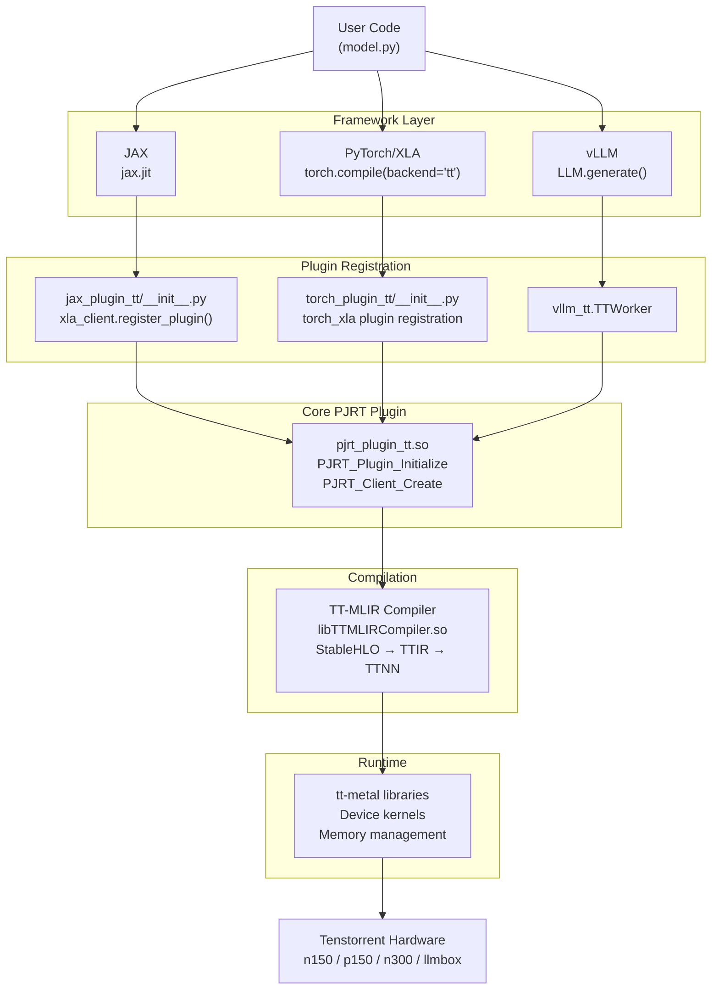
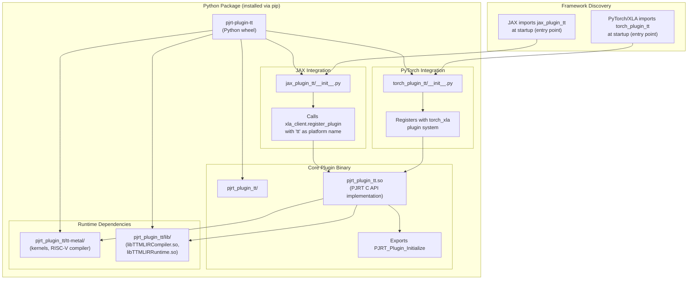

# Getting Started

Relevant source files
*   [.gitignore](https://github.com/tenstorrent/tt-xla/blob/c77995f6/.gitignore)
*   [README.md](https://github.com/tenstorrent/tt-xla/blob/c77995f6/README.md?plain=1)
*   [docs/src/getting_started.md](https://github.com/tenstorrent/tt-xla/blob/c77995f6/docs/src/getting_started.md?plain=1)
*   [docs/src/getting_started_build_from_source.md](https://github.com/tenstorrent/tt-xla/blob/c77995f6/docs/src/getting_started_build_from_source.md?plain=1)
*   [docs/src/getting_started_docker.md](https://github.com/tenstorrent/tt-xla/blob/c77995f6/docs/src/getting_started_docker.md?plain=1)
*   [docs/src/imgs/test_infra.png](https://github.com/tenstorrent/tt-xla/blob/c77995f6/docs/src/imgs/test_infra.png)
*   [docs/src/imgs/tt_smi.png](https://github.com/tenstorrent/tt-xla/blob/c77995f6/docs/src/imgs/tt_smi.png)
*   [docs/src/imgs/tt_xla_logo.png](https://github.com/tenstorrent/tt-xla/blob/c77995f6/docs/src/imgs/tt_xla_logo.png)
*   [docs/src/test_infra.md](https://github.com/tenstorrent/tt-xla/blob/c77995f6/docs/src/test_infra.md?plain=1)
*   [tests/filecheck/add.ttnn.mlir](https://github.com/tenstorrent/tt-xla/blob/c77995f6/tests/filecheck/add.ttnn.mlir)
*   [tests/filecheck/rms_norm.ttir.mlir](https://github.com/tenstorrent/tt-xla/blob/c77995f6/tests/filecheck/rms_norm.ttir.mlir)

This page introduces the setup options for tt-xla and provides the context needed to choose the right path. It does not cover the detailed steps for each installation method — those are in the sub-pages linked throughout. For deeper background on how the PJRT plugin works internally, see [Core Architecture](https://deepwiki.com/tenstorrent/tt-xla/4-system-architecture). For information on the build system, see [Build System](https://deepwiki.com/tenstorrent/tt-xla/3-build-system).

* * *

## What You Are Setting Up

tt-xla exposes Tenstorrent AI hardware to JAX, PyTorch/XLA, and vLLM via a [PJRT](https://github.com/tenstorrent/tt-xla/blob/c77995f6/PJRT) plugin. When installed, it provides:

*   `pjrt_plugin_tt.so` — the core PJRT plugin binary implementing the PJRT C API
*   `jax_plugin_tt` — Python package that registers the plugin with JAX
*   `torch_plugin_tt` — Python package that registers the plugin with PyTorch/XLA
*   `vllm_tt` — integration for vLLM-based LLM serving (optional)

Once the plugin is loaded, JAX sees Tenstorrent devices alongside CPU/GPU, and models compiled with `jax.jit` or `torch.compile(backend='tt')` are dispatched through the TT-MLIR compiler to Tenstorrent hardware. The plugin handles:

1.   Device enumeration and management via PJRT API
2.   Compilation requests to TT-MLIR (StableHLO → TTIR → TTNN → device code)
3.   Execution scheduling and memory management on TT devices

**Wheel package layout:**

```
pjrt_plugin_tt/
    __init__.py
    pjrt_plugin_tt.so          # PJRT plugin binary (C API implementation)
    tt-metal/                  # Runtime kernels and RISC-V toolchain
    lib/                       # Shared library dependencies (libTTMLIRCompiler.so, etc.)
jax_plugin_tt/
    __init__.py                # Imports pjrt_plugin_tt and calls xla_client.register_plugin
torch_plugin_tt/
    __init__.py                # Imports pjrt_plugin_tt and registers with torch_xla
```

Sources: [docs/src/getting_started_build_from_source.md 174-187](https://github.com/tenstorrent/tt-xla/blob/c77995f6/docs/src/getting_started_build_from_source.md?plain=1#L174-L187)[README.md 19](https://github.com/tenstorrent/tt-xla/blob/c77995f6/README.md?plain=1#L19-L19)

* * *

## How the Plugin Fits Into the Stack



Sources: [README.md:19-19](), [docs/src/getting_started_build_from_source.md:174-187]()

---
```


**Diagram: Component interaction from user code to hardware**

Sources: [README.md 19](https://github.com/tenstorrent/tt-xla/blob/c77995f6/README.md?plain=1#L19-L19)[docs/src/getting_started_build_from_source.md 174-187](https://github.com/tenstorrent/tt-xla/blob/c77995f6/docs/src/getting_started_build_from_source.md?plain=1#L174-L187)

* * *

## Choosing a Setup Path

There are three ways to install tt-xla. The table below summarizes when to use each.

| Path | Package / Entry Point | Best For |
| --- | --- | --- |
| **pip wheel** | `pip install pjrt-plugin-tt` | Running models; fastest setup |
| **Docker container** | `ghcr.io/tenstorrent/tt-xla-slim:latest` | Isolated environment; no system changes |
| **Build from source** | `source venv/activate && cmake ...` | Developing or modifying tt-xla |

Detailed instructions for each path are in the sub-pages:

 — pip wheel, Docker, and build-from-source details
 — TT-Installer, hugepages, and `tt-smi`
 — a concrete end-to-end example

* * *

## Setup Decision Flow

**Diagram: Choosing a setup path**

Sources: [docs/src/getting_started.md 19-23](https://github.com/tenstorrent/tt-xla/blob/c77995f6/docs/src/getting_started.md?plain=1#L19-L23)

* * *

## Hardware Prerequisites

Before any software installation, the host machine must have Tenstorrent hardware configured. This requires:

1.   Running the [TT-Installer](https://docs.tenstorrent.com/getting-started/README.html) to install device drivers and firmware.
2.   Rebooting the machine.
3.   Enabling hugepages: `sudo systemctl enable --now 'dev-hugepages\x2d1G.mount'sudo systemctl enable --now tenstorrent-hugepages.service`
4.   Activating the virtual environment created by TT-Installer: `source ~/.tenstorrent-venv/bin/activate`
5.   Verifying device visibility with `tt-smi`, which displays real-time device stats and health.

See [Hardware Configuration](https://deepwiki.com/tenstorrent/tt-xla/2.2-hardware-configuration) for the full walkthrough.

Sources: [docs/src/getting_started.md 25-47](https://github.com/tenstorrent/tt-xla/blob/c77995f6/docs/src/getting_started.md?plain=1#L25-L47)

* * *

## Quick Install (Wheel Path)

Once hardware is configured, install the wheel in your active virtual environment:

`pip install pjrt-plugin-tt --extra-index-url https://pypi.eng.aws.tenstorrent.com/`
**Install options:**

*   Stable releases: use the command above
*   Pre-release builds: add `--pre` flag
*   Nightly builds: download from [GitHub Releases](https://github.com/tenstorrent/tt-xla/blob/c77995f6/GitHub%20Releases)

After installation, verify the plugin is loaded correctly:

`python -c "import jax; print(jax.devices('tt'))"`
Expected output (example):

```
[TTDevice(id=0, arch=Wormhole_b0)]
```

This confirms that:

1.   `jax_plugin_tt/__init__.py` imported successfully
2.   The PJRT plugin (`pjrt_plugin_tt.so`) loaded without errors
3.   The plugin successfully enumerated Tenstorrent devices via the PJRT `PJRT_Client_Devices` API
4.   JAX can now dispatch computations to `TTDevice` instances

If you see an error or an empty list, check [Hardware Configuration](https://deepwiki.com/tenstorrent/tt-xla/2.2-hardware-configuration) to ensure drivers and hugepages are configured.

Sources: [docs/src/getting_started.md 51-88](https://github.com/tenstorrent/tt-xla/blob/c77995f6/docs/src/getting_started.md?plain=1#L51-L88)[docs/src/getting_started_build_from_source.md 154-159](https://github.com/tenstorrent/tt-xla/blob/c77995f6/docs/src/getting_started_build_from_source.md?plain=1#L154-L159)

* * *

## Key Files and Entry Points



The plugin uses Python's [entry point mechanism](https://packaging.python.org/en/latest/specifications/entry-points/) to automatically register with JAX and PyTorch/XLA when the packages are imported. This means no manual configuration is needed — just import JAX or PyTorch/XLA and the `tt` backend is available.

Sources: [docs/src/getting_started_build_from_source.md:174-187]()

---
```


**Diagram: Package structure and plugin loading mechanism**

The plugin uses Python's [entry point mechanism](https://packaging.python.org/en/latest/specifications/entry-points/) to automatically register with JAX and PyTorch/XLA when the packages are imported. This means no manual configuration is needed — just import JAX or PyTorch/XLA and the `tt` backend is available.

Sources: [docs/src/getting_started_build_from_source.md 174-187](https://github.com/tenstorrent/tt-xla/blob/c77995f6/docs/src/getting_started_build_from_source.md?plain=1#L174-L187)

* * *

## System Dependencies (Build from Source Only)

If building from source, the following are required on Ubuntu 22.04:

| Dependency | Version |
| --- | --- |
| Python | 3.12 |
| Clang | 17 |
| GCC | 12 |
| CMake | 4.0.3 |
| Ninja | any recent |
| OpenMPI | 5.0.7-ulfm |

Additional libraries: `protobuf-compiler`, `libprotobuf-dev`, `ccache`, `libnuma-dev`, `libhwloc-dev`, `libboost-all-dev`.

The build also depends on the TT-MLIR toolchain (built separately from the [tt-mlir](https://github.com/tenstorrent/tt-xla/blob/c77995f6/tt-mlir) repository). The environment variable `TTMLIR_TOOLCHAIN_DIR` must point to the toolchain directory before running CMake.

See [Installation Options](https://deepwiki.com/tenstorrent/tt-xla/2.1-installation-options) and [Development Environment Setup](https://deepwiki.com/tenstorrent/tt-xla/8.1-development-environment-setup) for the complete procedures.

Sources: [docs/src/getting_started_build_from_source.md 22-113](https://github.com/tenstorrent/tt-xla/blob/c77995f6/docs/src/getting_started_build_from_source.md?plain=1#L22-L113)

* * *

## Where to Go Next

| Goal | Page |
| --- | --- |
| Detailed install instructions (wheel, Docker, source) | [Installation Options](https://deepwiki.com/tenstorrent/tt-xla/2.1-installation-options) |
| Configure hardware (TT-Installer, hugepages, tt-smi) | [Hardware Configuration](https://deepwiki.com/tenstorrent/tt-xla/2.2-hardware-configuration) |
| Run a concrete JAX or PyTorch model | [Running Your First Model](https://deepwiki.com/tenstorrent/tt-xla/2.3-running-your-first-model) |
| Understand how the PJRT plugin works | [PJRT Plugin System](https://deepwiki.com/tenstorrent/tt-xla/4.1-compilation-pipeline) |
| Understand the compilation pipeline | [MLIR Compilation Pipeline](https://deepwiki.com/tenstorrent/tt-xla/4.2-pjrt-plugin-system) |
| Set up a development environment | [Development Environment Setup](https://deepwiki.com/tenstorrent/tt-xla/8.1-development-environment-setup) |
| Explore the test suite | [Testing Infrastructure](https://deepwiki.com/tenstorrent/tt-xla/6-testing-infrastructure) |

Sources: [docs/src/getting_started.md 91-99](https://github.com/tenstorrent/tt-xla/blob/c77995f6/docs/src/getting_started.md?plain=1#L91-L99)[README.md 22-24](https://github.com/tenstorrent/tt-xla/blob/c77995f6/README.md?plain=1#L22-L24)

This wiki is featured in the [repository](https://github.com/tenstorrent/tt-xla/blob/main/README.md)

Dismiss
Refresh this wiki

Enter email to refresh