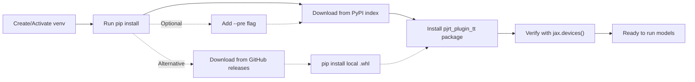
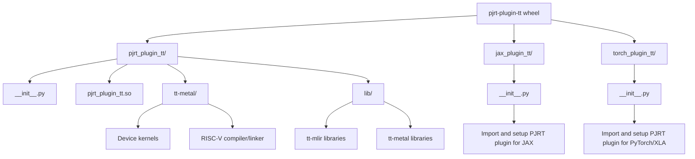
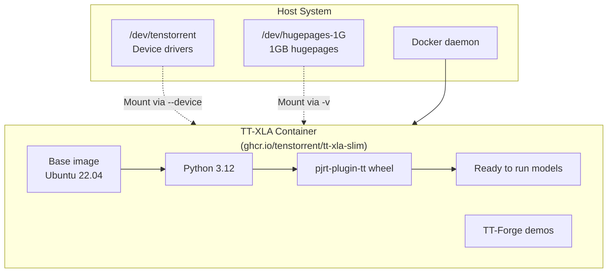
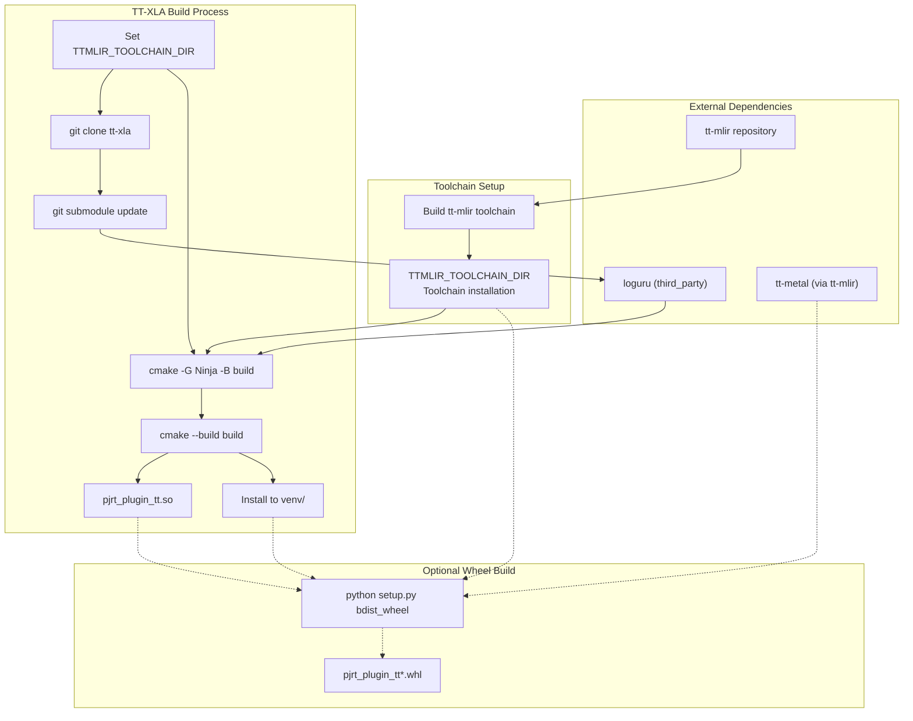
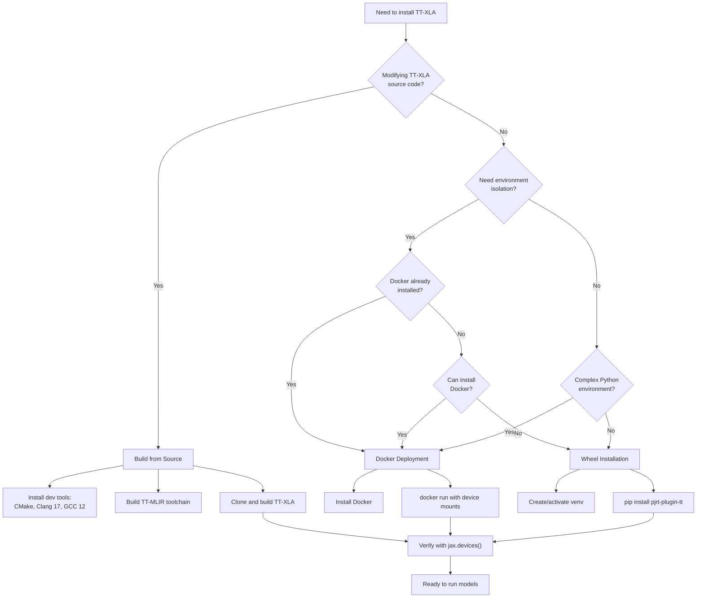

# Installation Options

Relevant source files
*   [.gitignore](https://github.com/tenstorrent/tt-xla/blob/c77995f6/.gitignore)
*   [README.md](https://github.com/tenstorrent/tt-xla/blob/c77995f6/README.md?plain=1)
*   [docs/src/getting_started.md](https://github.com/tenstorrent/tt-xla/blob/c77995f6/docs/src/getting_started.md?plain=1)
*   [docs/src/getting_started_build_from_source.md](https://github.com/tenstorrent/tt-xla/blob/c77995f6/docs/src/getting_started_build_from_source.md?plain=1)
*   [docs/src/getting_started_docker.md](https://github.com/tenstorrent/tt-xla/blob/c77995f6/docs/src/getting_started_docker.md?plain=1)
*   [docs/src/imgs/test_infra.png](https://github.com/tenstorrent/tt-xla/blob/c77995f6/docs/src/imgs/test_infra.png)
*   [docs/src/imgs/tt_smi.png](https://github.com/tenstorrent/tt-xla/blob/c77995f6/docs/src/imgs/tt_smi.png)
*   [docs/src/imgs/tt_xla_logo.png](https://github.com/tenstorrent/tt-xla/blob/c77995f6/docs/src/imgs/tt_xla_logo.png)
*   [docs/src/test_infra.md](https://github.com/tenstorrent/tt-xla/blob/c77995f6/docs/src/test_infra.md?plain=1)
*   [tests/filecheck/add.ttnn.mlir](https://github.com/tenstorrent/tt-xla/blob/c77995f6/tests/filecheck/add.ttnn.mlir)
*   [tests/filecheck/rms_norm.ttir.mlir](https://github.com/tenstorrent/tt-xla/blob/c77995f6/tests/filecheck/rms_norm.ttir.mlir)

## Purpose and Scope

This document compares the three installation approaches for TT-XLA: wheel installation, Docker deployment, and building from source. Each approach serves different use cases and has distinct prerequisites, complexity levels, and capabilities.

For detailed hardware configuration requirements (TT-Installer, hugepages, device verification), see [Hardware Configuration](https://deepwiki.com/tenstorrent/tt-xla/2.2-hardware-configuration). For step-by-step instructions on running your first model after installation, see [Running Your First Model](https://deepwiki.com/tenstorrent/tt-xla/2.3-running-your-first-model). For comprehensive build system documentation, see [Build System](https://deepwiki.com/tenstorrent/tt-xla/3-build-system).

* * *

## Installation Approach Comparison

The following table summarizes the key differences between the three installation methods:

| Aspect | Wheel Installation | Docker Deployment | Build from Source |
| --- | --- | --- | --- |
| **Complexity** | Low | Medium | High |
| **Primary Use Case** | Running models | Isolated environment | Development/debugging |
| **Time to Setup** | 2-5 minutes | 5-10 minutes | 30-60 minutes |
| **Disk Space Required** | ~2GB | ~5GB | ~10GB+ |
| **Prerequisites** | Python 3.12, pip | Docker, device drivers | CMake, Clang 17, GCC 12, Ninja |
| **Customization** | None | Limited | Full control |
| **Update Process** | `pip install --upgrade` | Pull new image | Rebuild |
| **Debug Symbols** | Not included | Not included | Optional |
| **Hardware Access** | Direct | Through container | Direct |
| **Python Environment** | User-managed | Container-managed | User-managed |

**Sources:**[docs/src/getting_started.md 19-24](https://github.com/tenstorrent/tt-xla/blob/c77995f6/docs/src/getting_started.md?plain=1#L19-L24)[docs/src/getting_started_docker.md 1-11](https://github.com/tenstorrent/tt-xla/blob/c77995f6/docs/src/getting_started_docker.md?plain=1#L1-L11)[docs/src/getting_started_build_from_source.md 1-14](https://github.com/tenstorrent/tt-xla/blob/c77995f6/docs/src/getting_started_build_from_source.md?plain=1#L1-L14)

* * *

## Wheel Installation

### Overview

Wheel installation provides pre-compiled Python packages from Tenstorrent's PyPI index. This is the recommended approach for users who want to run JAX or PyTorch models on Tenstorrent hardware without modifying TT-XLA itself.

### When to Choose Wheel Installation

*   You want to run existing JAX/PyTorch models
*   You don't need to modify TT-XLA source code
*   You prefer standard Python package management
*   You want the fastest setup time

### Prerequisites

*   Python 3.12
*   `pip` package manager
*   Active virtual environment (recommended)
*   Configured Tenstorrent hardware (see [Hardware Configuration](https://deepwiki.com/tenstorrent/tt-xla/2.2-hardware-configuration))

### Installation Process

**Wheel Installation Flow:**

**Sources:**[docs/src/getting_started.md 51-71](https://github.com/tenstorrent/tt-xla/blob/c77995f6/docs/src/getting_started.md?plain=1#L51-L71)

### Installation Commands

1.   **Standard release installation:**

`pip install pjrt-plugin-tt --extra-index-url https://pypi.eng.aws.tenstorrent.com/`
1.   **Pre-release installation:**

`pip install pjrt-plugin-tt --pre --extra-index-url https://pypi.eng.aws.tenstorrent.com/`
1.   **Verification:**

`python -c "import jax; print(jax.devices('tt'))"`
Expected output: `[TTDevice(id=0, arch=Wormhole_b0)]`

**Sources:**[docs/src/getting_started.md 62-71](https://github.com/tenstorrent/tt-xla/blob/c77995f6/docs/src/getting_started.md?plain=1#L62-L71)[docs/src/getting_started_build_from_source.md 154-159](https://github.com/tenstorrent/tt-xla/blob/c77995f6/docs/src/getting_started_build_from_source.md?plain=1#L154-L159)

### Installed Wheel Structure

The `pjrt-plugin-tt` wheel contains the following components:

**Sources:**[docs/src/getting_started_build_from_source.md 174-188](https://github.com/tenstorrent/tt-xla/blob/c77995f6/docs/src/getting_started_build_from_source.md?plain=1#L174-L188)

### Key Components

*   `pjrt_plugin_tt.so` - Core PJRT plugin binary implementing the plugin interface
*   `tt-metal/` - Runtime dependencies including device kernels and RISC-V toolchain
*   `lib/` - Shared library dependencies from tt-mlir and tt-metal
*   `jax_plugin_tt/` - Thin wrapper registering the plugin with JAX
*   `torch_plugin_tt/` - Thin wrapper registering the plugin with PyTorch/XLA

**Sources:**[docs/src/getting_started_build_from_source.md 174-188](https://github.com/tenstorrent/tt-xla/blob/c77995f6/docs/src/getting_started_build_from_source.md?plain=1#L174-L188)

* * *

## Docker Deployment

### Overview

Docker deployment provides a containerized environment with TT-XLA and its dependencies pre-installed. This approach isolates TT-XLA from the host system while maintaining access to Tenstorrent hardware.

### When to Choose Docker

*   You want complete environment isolation
*   You're working on a shared system
*   You want to avoid installing system dependencies
*   You need reproducible execution environments
*   You're testing different TT-XLA versions

### Prerequisites

*   Docker installed and running
*   User added to `docker` group
*   Configured Tenstorrent hardware with drivers
*   Hugepages enabled on host system

### Container Architecture

**Docker Container Components:**

**Sources:**[docs/src/getting_started_docker.md 44-52](https://github.com/tenstorrent/tt-xla/blob/c77995f6/docs/src/getting_started_docker.md?plain=1#L44-L52)

### Installation Steps

1.   **Install Docker (if not already installed):**

`sudo apt updatesudo apt install docker.io -ysudo systemctl start dockersudo systemctl enable docker`
1.   **Add user to Docker group:**

`sudo usermod -aG docker $USERnewgrp docker`
1.   **Run TT-XLA container:**

`docker run -it --rm \  --device /dev/tenstorrent \  -v /dev/hugepages-1G:/dev/hugepages-1G \  ghcr.io/tenstorrent/tt-xla-slim:latest`
**Sources:**[docs/src/getting_started_docker.md 21-50](https://github.com/tenstorrent/tt-xla/blob/c77995f6/docs/src/getting_started_docker.md?plain=1#L21-L50)

### Critical Configuration Notes

*   **Device Mounting:** Must pass `--device /dev/tenstorrent` to access all Tenstorrent devices. Device isolation (e.g., `--device /dev/tenstorrent/1`) is not supported and will cause fatal errors.

*   **Hugepages:** Must mount `-v /dev/hugepages-1G:/dev/hugepages-1G` for proper memory allocation. This requires hugepages to be configured on the host system.

*   **Container Lifecycle:** The `--rm` flag automatically removes the container when it exits, preventing disk space accumulation.

**Sources:**[docs/src/getting_started_docker.md 52](https://github.com/tenstorrent/tt-xla/blob/c77995f6/docs/src/getting_started_docker.md?plain=1#L52-L52)

* * *

## Building from Source

### Overview

Building from source compiles TT-XLA and its dependencies from source code. This approach is required for TT-XLA development, debugging, and contributing new features.

### When to Choose Build from Source

*   You're developing TT-XLA features or fixes
*   You need debug symbols for troubleshooting
*   You want to use unreleased changes from the main branch
*   You need to modify compilation flags or dependencies
*   You're investigating compiler passes or MLIR transformations

### System Dependencies

The following system packages must be installed before building:

| Dependency | Version | Purpose |
| --- | --- | --- |
| Ubuntu | 22.04 | Base OS |
| Python | 3.12 | Runtime and build scripts |
| CMake | 4.0.3+ | Build system |
| Clang | 17 | C++ compiler |
| GCC | 12 | Standard library provider |
| Ninja | Latest | Build executor |
| OpenMPI | 5.0.7-ulfm | Multi-device communication |
| protobuf | Latest | Serialization |
| ccache | Latest | Build caching |
| libnuma-dev | Latest | NUMA awareness |
| libhwloc-dev | Latest | Hardware locality |
| libboost-all-dev | Latest | C++ utilities |

**Sources:**[docs/src/getting_started_build_from_source.md 21-112](https://github.com/tenstorrent/tt-xla/blob/c77995f6/docs/src/getting_started_build_from_source.md?plain=1#L21-L112)

### Build Dependency Chain

**TT-XLA Build Dependencies:**

**Sources:**[docs/src/getting_started_build_from_source.md 114-172](https://github.com/tenstorrent/tt-xla/blob/c77995f6/docs/src/getting_started_build_from_source.md?plain=1#L114-L172)[README.md 1-62](https://github.com/tenstorrent/tt-xla/blob/c77995f6/README.md?plain=1#L1-L62)

### Build Process Steps

1.   **Build TT-MLIR toolchain:**

`# Clone and build tt-mlir separatelygit clone https://github.com/tenstorrent/tt-mlircd tt-mlir# Follow tt-mlir build instructionsexport TTMLIR_TOOLCHAIN_DIR=/opt/ttmlir-toolchain/`
1.   **Set environment variables:**

`export TTMLIR_TOOLCHAIN_DIR=/opt/ttmlir-toolchain/export TTXLA_LOGGER_LEVEL=DEBUG  # Optional: enable debug logs`
1.   **Clone and build TT-XLA:**

`git clone https://github.com/tenstorrent/tt-xla.gitcd tt-xlagit submodule update --init --recursivesource venv/activatecmake -G Ninja -B build  # Add -DCMAKE_BUILD_TYPE=Debug for debug buildcmake --build build`
1.   **Verify installation:**

`python -c "import jax; print(jax.devices('tt'))"`
1.   **Optional: Build distributable wheel:**

`cd python_packagepython setup.py bdist_wheelpip install dist/pjrt_plugin_tt*.whl`
**Sources:**[docs/src/getting_started_build_from_source.md 117-172](https://github.com/tenstorrent/tt-xla/blob/c77995f6/docs/src/getting_started_build_from_source.md?plain=1#L117-L172)

### Build Artifacts

The build process creates the following artifacts:

| Artifact | Location | Description |
| --- | --- | --- |
| `pjrt_plugin_tt.so` | `build/src/common/` | Core PJRT plugin binary |
| `libTTMLIRCompiler.so` | From `TTMLIR_TOOLCHAIN_DIR` | TT-MLIR compiler library |
| `libTTMLIRRuntime.so` | From `TTMLIR_TOOLCHAIN_DIR` | TT-MLIR runtime library |
| Python packages | `venv/lib/python3.12/site-packages/` | Installed Python modules |
| `compile_commands.json` | `build/` | Compilation database for IDEs |
| Test binaries | `build/tests/` | Unit and integration tests |
| Wheel file | `python_package/dist/` | Optional distributable package |

**Sources:**[docs/src/getting_started_build_from_source.md 145-172](https://github.com/tenstorrent/tt-xla/blob/c77995f6/docs/src/getting_started_build_from_source.md?plain=1#L145-L172)[.gitignore 1-46](https://github.com/tenstorrent/tt-xla/blob/c77995f6/.gitignore#L1-L46)

### Build Configuration Options

Common CMake configuration flags:

*   `-DCMAKE_BUILD_TYPE=Debug` - Include debug symbols
*   `-DCMAKE_BUILD_TYPE=Release` - Optimized build (default)
*   `-DCMAKE_BUILD_TYPE=RelWithDebInfo` - Optimized with debug info
*   `-DTTXLA_ENABLE_TESTS=OFF` - Disable test compilation
*   `-DCMAKE_EXPORT_COMPILE_COMMANDS=ON` - Generate compilation database

**Sources:**[docs/src/getting_started_build_from_source.md 145-151](https://github.com/tenstorrent/tt-xla/blob/c77995f6/docs/src/getting_started_build_from_source.md?plain=1#L145-L151)

* * *

## Installation Approach Decision Guide

Use the following decision tree to select the appropriate installation method:

**Sources:**[docs/src/getting_started.md 19-24](https://github.com/tenstorrent/tt-xla/blob/c77995f6/docs/src/getting_started.md?plain=1#L19-L24)[docs/src/getting_started_docker.md 1-11](https://github.com/tenstorrent/tt-xla/blob/c77995f6/docs/src/getting_started_docker.md?plain=1#L1-L11)[docs/src/getting_started_build_from_source.md 1-14](https://github.com/tenstorrent/tt-xla/blob/c77995f6/docs/src/getting_started_build_from_source.md?plain=1#L1-L14)

* * *

## Next Steps

After installing TT-XLA using your chosen method:

1.   **Configure Hardware:** Ensure your Tenstorrent devices are properly configured with drivers and hugepages - see [Hardware Configuration](https://deepwiki.com/tenstorrent/tt-xla/2.2-hardware-configuration)

2.   **Verify Installation:** Run `python -c "import jax; print(jax.devices('tt'))"` to confirm TT devices are detected

3.   **Run Your First Model:** Follow the examples in [Running Your First Model](https://deepwiki.com/tenstorrent/tt-xla/2.3-running-your-first-model)

4.   **Explore Demos:** Check the [TT-Forge demos repository](https://github.com/tenstorrent/tt-xla/blob/c77995f6/TT-Forge%20demos%20repository) for JAX and PyTorch examples

5.   **Developer Setup:** If building from source, consider setting up pre-commit hooks for code quality checks - see [docs/src/getting_started_build_from_source.md 196-210](https://github.com/tenstorrent/tt-xla/blob/c77995f6/docs/src/getting_started_build_from_source.md?plain=1#L196-L210)

**Sources:**[docs/src/getting_started.md 96-99](https://github.com/tenstorrent/tt-xla/blob/c77995f6/docs/src/getting_started.md?plain=1#L96-L99)[docs/src/getting_started_docker.md 95-98](https://github.com/tenstorrent/tt-xla/blob/c77995f6/docs/src/getting_started_docker.md?plain=1#L95-L98)[docs/src/getting_started_build_from_source.md 189-211](https://github.com/tenstorrent/tt-xla/blob/c77995f6/docs/src/getting_started_build_from_source.md?plain=1#L189-L211)

This wiki is featured in the [repository](https://github.com/tenstorrent/tt-xla/blob/main/README.md)

Dismiss
Refresh this wiki

Enter email to refresh
