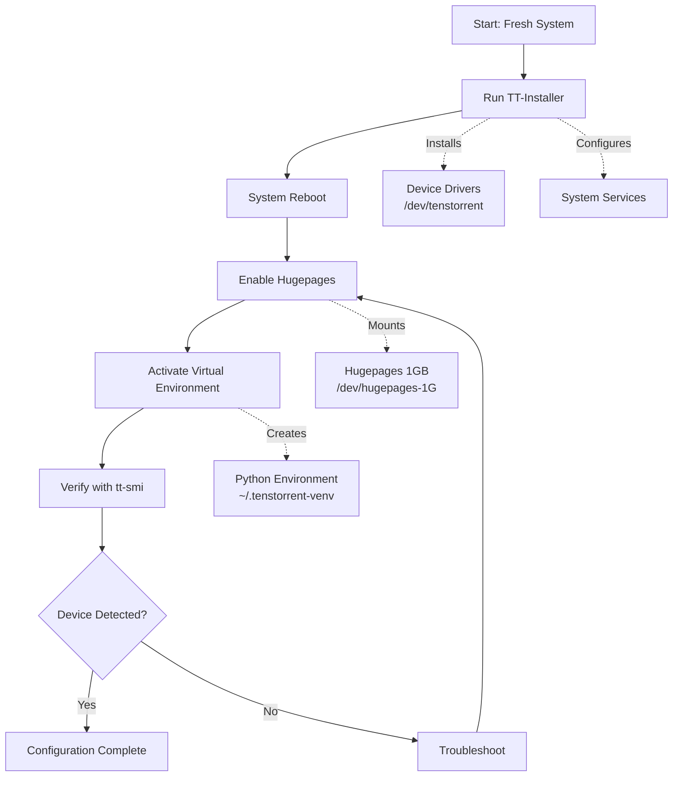
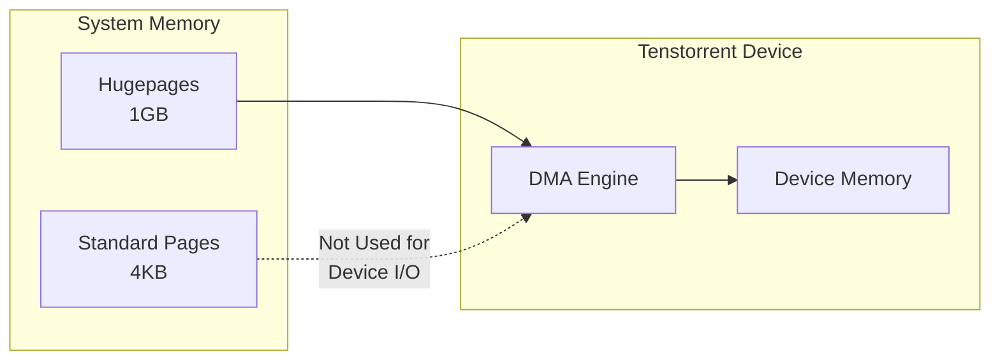
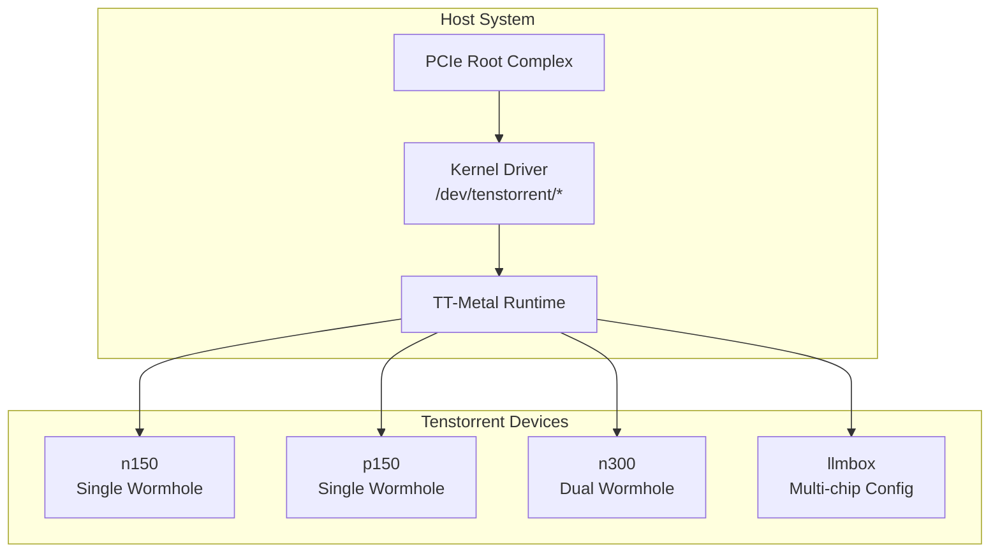
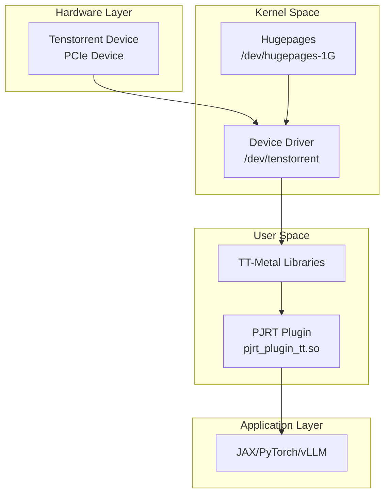

# Hardware Configuration

Relevant source files
*   [.gitignore](https://github.com/tenstorrent/tt-xla/blob/c77995f6/.gitignore)
*   [README.md](https://github.com/tenstorrent/tt-xla/blob/c77995f6/README.md?plain=1)
*   [docs/src/getting_started.md](https://github.com/tenstorrent/tt-xla/blob/c77995f6/docs/src/getting_started.md?plain=1)
*   [docs/src/getting_started_build_from_source.md](https://github.com/tenstorrent/tt-xla/blob/c77995f6/docs/src/getting_started_build_from_source.md?plain=1)
*   [docs/src/getting_started_docker.md](https://github.com/tenstorrent/tt-xla/blob/c77995f6/docs/src/getting_started_docker.md?plain=1)
*   [docs/src/imgs/test_infra.png](https://github.com/tenstorrent/tt-xla/blob/c77995f6/docs/src/imgs/test_infra.png)
*   [docs/src/imgs/tt_smi.png](https://github.com/tenstorrent/tt-xla/blob/c77995f6/docs/src/imgs/tt_smi.png)
*   [docs/src/imgs/tt_xla_logo.png](https://github.com/tenstorrent/tt-xla/blob/c77995f6/docs/src/imgs/tt_xla_logo.png)
*   [docs/src/test_infra.md](https://github.com/tenstorrent/tt-xla/blob/c77995f6/docs/src/test_infra.md?plain=1)
*   [tests/filecheck/add.ttnn.mlir](https://github.com/tenstorrent/tt-xla/blob/c77995f6/tests/filecheck/add.ttnn.mlir)
*   [tests/filecheck/rms_norm.ttir.mlir](https://github.com/tenstorrent/tt-xla/blob/c77995f6/tests/filecheck/rms_norm.ttir.mlir)

## Purpose and Scope

This document describes the hardware setup requirements for running TT-XLA on Tenstorrent accelerator devices. It covers the installation of system drivers, configuration of memory management components, and verification procedures to ensure devices are ready for use. This configuration must be completed before proceeding with software installation ([Installation Options](https://deepwiki.com/tenstorrent/tt-xla/2.1-installation-options)) or running models ([Running Your First Model](https://deepwiki.com/tenstorrent/tt-xla/2.3-running-your-first-model)).

The setup process applies to all supported Tenstorrent hardware configurations including n150, p150, n300, and llmbox systems.

* * *

## Configuration Workflow

The hardware configuration process follows these sequential steps:

**Sources:**[docs/src/getting_started.md 25-49](https://github.com/tenstorrent/tt-xla/blob/c77995f6/docs/src/getting_started.md?plain=1#L25-L49)

* * *



## Prerequisites

Before starting hardware configuration, ensure your system meets the following requirements:

| Component | Requirement |
| --- | --- |
| Operating System | Ubuntu 22.04 |
| Root Access | Required for driver installation and system configuration |
| Internet Connection | Required for TT-Installer downloads |
| PCIe Slots | Available slots for Tenstorrent accelerator cards |

**Sources:**[docs/src/getting_started_build_from_source.md 21-31](https://github.com/tenstorrent/tt-xla/blob/c77995f6/docs/src/getting_started_build_from_source.md?plain=1#L21-L31)

* * *

## TT-Installer Setup

### Running TT-Installer

TT-Installer is the primary tool for configuring Tenstorrent hardware. It installs device drivers, configures system services, and sets up the necessary software environment.

1.   Follow the installation instructions at the [Tenstorrent Getting Started documentation](https://docs.tenstorrent.com/getting-started/README.html#software-installation)

2.   The installer will:

    *   Install kernel drivers for `/dev/tenstorrent` devices
    *   Configure systemd services for device management
    *   Create a Python virtual environment at `~/.tenstorrent-venv`
    *   Install base dependencies for TT-Metal runtime

3.   **Mandatory system reboot** is required after TT-Installer completes to load the device drivers

**Sources:**[docs/src/getting_started.md 28-30](https://github.com/tenstorrent/tt-xla/blob/c77995f6/docs/src/getting_started.md?plain=1#L28-L30)

* * *

## System Configuration

### Hugepages Configuration

Hugepages are required for efficient memory management when communicating with Tenstorrent devices. The system must be configured to allocate 1GB hugepages.

#### Enabling Hugepages Service

After rebooting, enable and start the hugepages services:

`sudo systemctl enable --now 'dev-hugepages\x2d1G.mount'sudo systemctl enable --now tenstorrent-hugepages.service`
These commands:

*   **`dev-hugepages\x2d1G.mount`**: Mounts 1GB hugepage filesystem at `/dev/hugepages-1G`
*   **`tenstorrent-hugepages.service`**: Manages hugepage allocation for Tenstorrent devices

#### Memory Layout

Hugepages reduce TLB (Translation Lookaside Buffer) misses during DMA operations, improving data transfer performance between host and device memory.

**Sources:**[docs/src/getting_started.md 32-37](https://github.com/tenstorrent/tt-xla/blob/c77995f6/docs/src/getting_started.md?plain=1#L32-L37)




Hugepages reduce TLB (Translation Lookaside Buffer) misses during DMA operations, improving data transfer performance between host and device memory.
```
### Virtual Environment Activation

After TT-Installer completes, activate the created virtual environment:

`source ~/.tenstorrent-venv/bin/activate`
This environment contains:

*   TT-Metal runtime libraries
*   Device management utilities including `tt-smi`
*   Python bindings for device interaction

The environment must be activated for all device operations and verification steps.

**Sources:**[docs/src/getting_started.md 39](https://github.com/tenstorrent/tt-xla/blob/c77995f6/docs/src/getting_started.md?plain=1#L39-L39)

* * *

## Device Verification with tt-smi

### Running tt-smi

After configuration is complete, verify device detection:

`tt-smi`
The `tt-smi` (Tenstorrent System Management Interface) command displays real-time information about detected Tenstorrent devices.

### Expected Output

A successful configuration will display the Tenstorrent System Management Interface showing:

*   Device ID and architecture (e.g., Wormhole_b0, Grayskull)
*   Device status and health metrics
*   Temperature and power consumption
*   Firmware version
*   Memory information

Example output structure:

```
+-----------------------------------------------------------------------------+
| Tenstorrent System Management Interface (tt-smi)                           |
+=============================================================================+
| Device 0: Wormhole_b0                                                      |
|   Status:        Active                                                     |
|   Temperature:   XX°C                                                       |
|   Power:         XX W                                                       |
+-----------------------------------------------------------------------------+
```

**Sources:**[docs/src/getting_started.md 42-49](https://github.com/tenstorrent/tt-xla/blob/c77995f6/docs/src/getting_started.md?plain=1#L42-L49)

### Device Enumeration in Code

The PJRT plugin discovers devices through the TT-Metal runtime. When you run:

`import jaxprint(jax.devices('tt'))`
Expected output:

```
[TTDevice(id=0, arch=Wormhole_b0)]
```

This verifies that the PJRT plugin can communicate with the device through the configured drivers.

**Sources:**[docs/src/getting_started_build_from_source.md 155-159](https://github.com/tenstorrent/tt-xla/blob/c77995f6/docs/src/getting_started_build_from_source.md?plain=1#L155-L159)

* * *

## Docker Considerations

### Device Passthrough

When using Docker containers ([Getting Started with Docker](https://deepwiki.com/tenstorrent/tt-xla/2.1-installation-options)), Tenstorrent devices must be passed through to the container:

`docker run -it --rm \  --device /dev/tenstorrent \  -v /dev/hugepages-1G:/dev/hugepages-1G \  ghcr.io/tenstorrent/tt-xla-slim:latest`
Key requirements:

*   **`--device /dev/tenstorrent`**: Passes all Tenstorrent devices to the container
*   **`-v /dev/hugepages-1G:/dev/hugepages-1G`**: Mounts the hugepages filesystem

### Device Isolation Limitation

**Important:** You cannot isolate individual devices within containers. Do not attempt to pass specific device nodes like `--device /dev/tenstorrent/1`, as this will result in fatal errors during execution. The entire `/dev/tenstorrent` hierarchy must be passed through.

**Sources:**[docs/src/getting_started_docker.md 44-52](https://github.com/tenstorrent/tt-xla/blob/c77995f6/docs/src/getting_started_docker.md?plain=1#L44-L52)

* * *

## Supported Hardware Configurations

### Device Architecture Overview



### Device Specifications

| Device Model | Architecture | Chip Count | Typical Use Case |
| --- | --- | --- | --- |
| n150 | Wormhole_b0 | 1 | Single-chip inference/training |
| p150 | Wormhole_b0 | 1 | Single-chip inference/training |
| n300 | Wormhole_b0 | 2 | Tensor parallel, multi-chip |
| llmbox | Wormhole_b0 | Multiple | LLM serving, large models |

Each device is enumerated under `/dev/tenstorrent/` and assigned a unique device ID accessible through the TT-Metal runtime.

**Sources:**[README.md 1-62](https://github.com/tenstorrent/tt-xla/blob/c77995f6/README.md?plain=1#L1-L62)[docs/src/getting_started_build_from_source.md 190](https://github.com/tenstorrent/tt-xla/blob/c77995f6/docs/src/getting_started_build_from_source.md?plain=1#L190-L190)

* * *

## Hardware-to-Runtime Integration

This layered architecture ensures that:

1.   Hardware is properly initialized through kernel drivers
2.   Memory is efficiently managed through hugepages
3.   TT-Metal provides device abstraction
4.   PJRT exposes devices to ML frameworks

**Sources:** Architecture diagrams from context, [README.md 18-19](https://github.com/tenstorrent/tt-xla/blob/c77995f6/README.md?plain=1#L18-L19)

* * *




This layered architecture ensures that:
1. Hardware is properly initialized through kernel drivers
2. Memory is efficiently managed through hugepages
3. TT-Metal provides device abstraction
4. PJRT exposes devices to ML frameworks
```
## Troubleshooting

### Device Not Detected

If `tt-smi` does not detect devices:

1.   Verify driver installation:

`ls -l /dev/tenstorrent*`
Should show device nodes like `/dev/tenstorrent/0`

2.   Check hugepages mount:

`mount | grep hugepages`
Should show `/dev/hugepages-1G` mounted

3.   Verify systemd services:

`systemctl status tenstorrent-hugepages.servicesystemctl status 'dev-hugepages\x2d1G.mount'`
4.   Ensure proper reboot after TT-Installer

5.   Check PCIe enumeration:

`lspci | grep Tenstorrent`

### Permission Issues

If device access is denied:

*   Ensure the user is in the appropriate group (typically configured by TT-Installer)
*   Verify virtual environment is activated
*   Check `/dev/tenstorrent` permissions

**Sources:**[docs/src/getting_started.md 16-17](https://github.com/tenstorrent/tt-xla/blob/c77995f6/docs/src/getting_started.md?plain=1#L16-L17)

* * *

## Next Steps

After completing hardware configuration and verifying device detection with `tt-smi`:

1.   **For wheel users:** Proceed to [Installation Options](https://deepwiki.com/tenstorrent/tt-xla/2.1-installation-options) to install the TT-XLA Python package
2.   **For Docker users:** Continue with [Getting Started with Docker](https://deepwiki.com/tenstorrent/tt-xla/2.1-installation-options) to set up containerized environment
3.   **For developers:** See [Building from Source](https://deepwiki.com/tenstorrent/tt-xla/8.2-building-from-source) to compile TT-XLA from source
4.   **Ready to run models:** Jump to [Running Your First Model](https://deepwiki.com/tenstorrent/tt-xla/2.3-running-your-first-model)

The hardware configuration established here provides the foundation for all TT-XLA operations and must be maintained throughout the lifecycle of your deployment.

This wiki is featured in the [repository](https://github.com/tenstorrent/tt-xla/blob/main/README.md)

Dismiss
Refresh this wiki

Enter email to refresh
