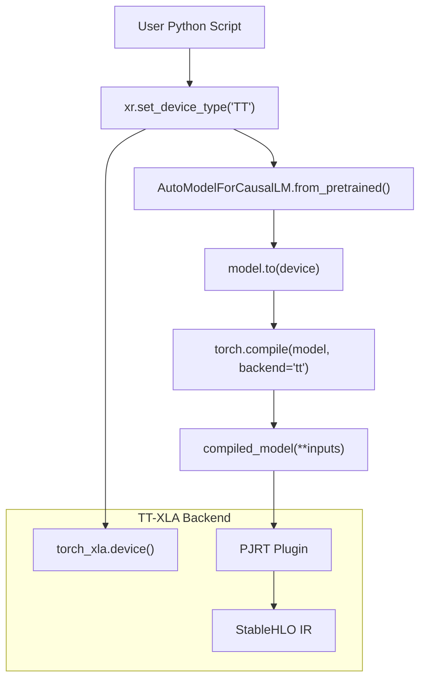
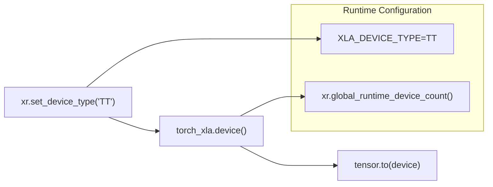
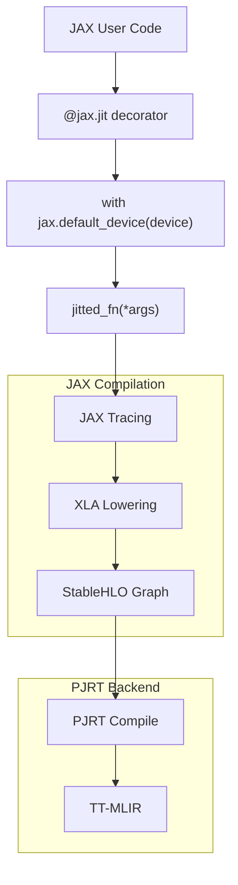
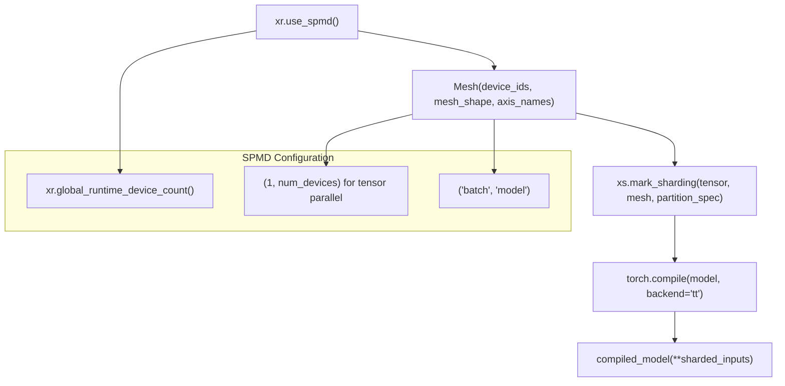
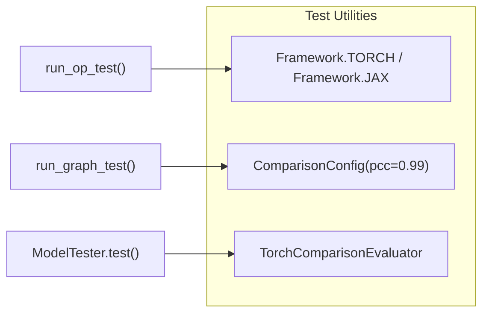

# Running Your First Model

Relevant source files
*   [.gitignore](https://github.com/tenstorrent/tt-xla/blob/c77995f6/.gitignore)
*   [README.md](https://github.com/tenstorrent/tt-xla/blob/c77995f6/README.md?plain=1)
*   [docs/src/getting_started.md](https://github.com/tenstorrent/tt-xla/blob/c77995f6/docs/src/getting_started.md?plain=1)
*   [docs/src/getting_started_build_from_source.md](https://github.com/tenstorrent/tt-xla/blob/c77995f6/docs/src/getting_started_build_from_source.md?plain=1)
*   [docs/src/getting_started_docker.md](https://github.com/tenstorrent/tt-xla/blob/c77995f6/docs/src/getting_started_docker.md?plain=1)
*   [docs/src/imgs/test_infra.png](https://github.com/tenstorrent/tt-xla/blob/c77995f6/docs/src/imgs/test_infra.png)
*   [docs/src/imgs/tt_smi.png](https://github.com/tenstorrent/tt-xla/blob/c77995f6/docs/src/imgs/tt_smi.png)
*   [docs/src/imgs/tt_xla_logo.png](https://github.com/tenstorrent/tt-xla/blob/c77995f6/docs/src/imgs/tt_xla_logo.png)
*   [docs/src/test_infra.md](https://github.com/tenstorrent/tt-xla/blob/c77995f6/docs/src/test_infra.md?plain=1)
*   [examples/pytorch/llama.py](https://github.com/tenstorrent/tt-xla/blob/c77995f6/examples/pytorch/llama.py)
*   [python_package/requirements.txt](https://github.com/tenstorrent/tt-xla/blob/c77995f6/python_package/requirements.txt)
*   [python_package/tt_torch/backend/decompositions.py](https://github.com/tenstorrent/tt-xla/blob/c77995f6/python_package/tt_torch/backend/decompositions.py)
*   [tests/filecheck/add.ttnn.mlir](https://github.com/tenstorrent/tt-xla/blob/c77995f6/tests/filecheck/add.ttnn.mlir)
*   [tests/filecheck/rms_norm.ttir.mlir](https://github.com/tenstorrent/tt-xla/blob/c77995f6/tests/filecheck/rms_norm.ttir.mlir)
*   [tests/torch/graphs/test_attention.py](https://github.com/tenstorrent/tt-xla/blob/c77995f6/tests/torch/graphs/test_attention.py)
*   [tests/torch/graphs/test_decoder_layer.py](https://github.com/tenstorrent/tt-xla/blob/c77995f6/tests/torch/graphs/test_decoder_layer.py)
*   [tests/torch/graphs/test_mlp.py](https://github.com/tenstorrent/tt-xla/blob/c77995f6/tests/torch/graphs/test_mlp.py)
*   [tests/torch/graphs/test_rms_norm.py](https://github.com/tenstorrent/tt-xla/blob/c77995f6/tests/torch/graphs/test_rms_norm.py)
*   [tests/torch/graphs/test_rotary_emb.py](https://github.com/tenstorrent/tt-xla/blob/c77995f6/tests/torch/graphs/test_rotary_emb.py)
*   [tests/torch/models/llama3/test_llama_step_n300.py](https://github.com/tenstorrent/tt-xla/blob/c77995f6/tests/torch/models/llama3/test_llama_step_n300.py)
*   [venv/requirements-dev.txt](https://github.com/tenstorrent/tt-xla/blob/c77995f6/venv/requirements-dev.txt)

This page demonstrates how to execute models on Tenstorrent hardware using TT-XLA. It covers basic single-device execution patterns for both PyTorch and JAX frameworks, explaining the essential APIs and configuration needed to compile and run your first model.

For hardware setup and device verification, see [Hardware Configuration](https://deepwiki.com/tenstorrent/tt-xla/2.2-hardware-configuration). For installation options (wheel vs source), see [Installation Options](https://deepwiki.com/tenstorrent/tt-xla/2.1-installation-options). For framework-specific integration details, see [PyTorch/XLA Backend](https://deepwiki.com/tenstorrent/tt-xla/5.1-pytorchxla-backend) and [JAX Backend](https://deepwiki.com/tenstorrent/tt-xla/5.2-jax-backend).

* * *

## Execution Prerequisites

Before running models, ensure the following setup is complete:

| Requirement | Verification Command | Expected Output |
| --- | --- | --- |
| Hardware configured | `tt-smi` | Device list with status |
| TT-XLA installed | `python -c "import jax; print(jax.devices('tt'))"` | `[TTDevice(id=0, ...)]` |
| Virtual environment active | `which python` | Path to venv python |

The device type must be explicitly set to `"TT"` at the start of your program using `torch_xla.runtime.set_device_type("TT")` before any device operations.

**Sources:**[docs/src/getting_started.md 41-47](https://github.com/tenstorrent/tt-xla/blob/c77995f6/docs/src/getting_started.md?plain=1#L41-L47)[docs/src/getting_started_build_from_source.md 153-159](https://github.com/tenstorrent/tt-xla/blob/c77995f6/docs/src/getting_started_build_from_source.md?plain=1#L153-L159)

* * *

## PyTorch Model Execution Flow

The execution flow follows a specific sequence where device type configuration precedes model instantiation, and compilation happens before inference. The `torch.compile(backend='tt')` call triggers the TT-XLA compiler pipeline.

**Sources:**[examples/pytorch/llama.py 61-128](https://github.com/tenstorrent/tt-xla/blob/c77995f6/examples/pytorch/llama.py#L61-L128)[docs/src/getting_started.md 82-88](https://github.com/tenstorrent/tt-xla/blob/c77995f6/docs/src/getting_started.md?plain=1#L82-L88)

* * *




The execution flow follows a specific sequence where device type configuration precedes model instantiation, and compilation happens before inference. The `torch.compile(backend='tt')` call triggers the TT-XLA compiler pipeline.
```
## Basic PyTorch Example

### Minimal Single-Device Inference

The `torch.compile(backend="tt")` invocation triggers graph capture via PyTorch's Dynamo tracing, followed by decomposition passes and StableHLO export through the PJRT plugin.

**Sources:**[examples/pytorch/llama.py 61-128](https://github.com/tenstorrent/tt-xla/blob/c77995f6/examples/pytorch/llama.py#L61-L128)[docs/src/getting_started.md 72-86](https://github.com/tenstorrent/tt-xla/blob/c77995f6/docs/src/getting_started.md?plain=1#L72-L86)

* * *

## PyTorch Key Components

### Device Configuration

The device type must be set via `xr.set_device_type("TT")` before acquiring device handles. This configures the XLA runtime to target Tenstorrent hardware through the PJRT plugin.

**Sources:**[examples/pytorch/llama.py 414](https://github.com/tenstorrent/tt-xla/blob/c77995f6/examples/pytorch/llama.py#L414-L414)[tests/torch/graphs/test_attention.py 157-162](https://github.com/tenstorrent/tt-xla/blob/c77995f6/tests/torch/graphs/test_attention.py#L157-L162)




The device type must be set via `xr.set_device_type("TT")` before acquiring device handles. This configures the XLA runtime to target Tenstorrent hardware through the PJRT plugin.
```
### Model Compilation

The compilation process converts PyTorch eager execution to optimized device code:

| Stage | Component | Description |
| --- | --- | --- |
| Graph Capture | `torch.compile` | Dynamo traces model execution |
| Decomposition | [python_package/tt_torch/backend/decompositions.py](https://github.com/tenstorrent/tt-xla/blob/c77995f6/python_package/tt_torch/backend/decompositions.py) | Custom ops decomposed to primitives |
| StableHLO Export | PJRT Plugin | Converts to framework-independent IR |
| TT-MLIR Lowering | External Compiler | TTIR → TTNN dialects |
| Code Generation | TT-Metal | Device-specific kernels |

The decomposition table at [python_package/tt_torch/backend/decompositions.py 382-398](https://github.com/tenstorrent/tt-xla/blob/c77995f6/python_package/tt_torch/backend/decompositions.py#L382-L398) defines custom transformations for operations like `upsample_bilinear2d`, `matmul`, and `copy`.

**Sources:**[python_package/tt_torch/backend/decompositions.py 1-399](https://github.com/tenstorrent/tt-xla/blob/c77995f6/python_package/tt_torch/backend/decompositions.py#L1-L399)[README.md 19](https://github.com/tenstorrent/tt-xla/blob/c77995f6/README.md?plain=1#L19-L19)

### Static Cache for LLMs

Generative models require KV cache management. TT-XLA uses `StaticCache` to preallocate cache buffers:

The cache must be initialized on CPU first, then transferred to device to prevent tracing unfusable creation ops (see issue referenced at [examples/pytorch/llama.py 213](https://github.com/tenstorrent/tt-xla/blob/c77995f6/examples/pytorch/llama.py#L213-L213)).

**Sources:**[examples/pytorch/llama.py 183-230](https://github.com/tenstorrent/tt-xla/blob/c77995f6/examples/pytorch/llama.py#L183-L230)[tests/torch/models/llama3/test_llama_step_n300.py 83-98](https://github.com/tenstorrent/tt-xla/blob/c77995f6/tests/torch/models/llama3/test_llama_step_n300.py#L83-L98)

* * *

## JAX Model Execution Flow

JAX uses decorator-based compilation with `@jax.jit`, which traces the function and compiles it through the PJRT plugin to TT-MLIR.

**Sources:**[README.md 19](https://github.com/tenstorrent/tt-xla/blob/c77995f6/README.md?plain=1#L19-L19)[docs/src/getting_started.md 1-3](https://github.com/tenstorrent/tt-xla/blob/c77995f6/docs/src/getting_started.md?plain=1#L1-L3)

* * *




JAX uses decorator-based compilation with `@jax.jit`, which traces the function and compiles it through the PJRT plugin to TT-MLIR.
```
## Basic JAX Example

### Minimal JAX Inference

JAX's `@jax.jit` decorator triggers compilation on first invocation. The compiled function is cached and reused for subsequent calls with the same input shapes.

**Sources:**[docs/src/getting_started.md 72-78](https://github.com/tenstorrent/tt-xla/blob/c77995f6/docs/src/getting_started.md?plain=1#L72-L78)[README.md 19](https://github.com/tenstorrent/tt-xla/blob/c77995f6/README.md?plain=1#L19-L19)

* * *

## Multi-Chip Execution Pattern

For multi-device execution, TT-XLA supports SPMD (Single Program Multiple Data) parallelism:

SPMD requires explicit initialization via `xr.use_spmd()` and tensor sharding annotation using `xs.mark_sharding()`.

**Sources:**[examples/pytorch/llama.py 130-158](https://github.com/tenstorrent/tt-xla/blob/c77995f6/examples/pytorch/llama.py#L130-L158)[tests/torch/graphs/test_attention.py 153-223](https://github.com/tenstorrent/tt-xla/blob/c77995f6/tests/torch/graphs/test_attention.py#L153-L223)




SPMD requires explicit initialization via `xr.use_spmd()` and tensor sharding annotation using `xs.mark_sharding()`.
```
### SPMD Setup Example

The partition spec `("model", None)` indicates the first dimension is sharded across the "model" mesh axis, while `None` means the dimension is replicated.

**Sources:**[examples/pytorch/llama.py 145-158](https://github.com/tenstorrent/tt-xla/blob/c77995f6/examples/pytorch/llama.py#L145-L158)[examples/pytorch/llama.py 290-318](https://github.com/tenstorrent/tt-xla/blob/c77995f6/examples/pytorch/llama.py#L290-L318)

* * *

## Compilation and Execution Lifecycle

The first inference call triggers full compilation. Subsequent calls with the same input shapes reuse the cached compiled artifact. Shape changes trigger recompilation.

**Sources:**[examples/pytorch/llama.py 110-124](https://github.com/tenstorrent/tt-xla/blob/c77995f6/examples/pytorch/llama.py#L110-L124)[tests/torch/graphs/test_attention.py 216-223](https://github.com/tenstorrent/tt-xla/blob/c77995f6/tests/torch/graphs/test_attention.py#L216-L223)

* * *

## Validation and Debugging

### Verifying Successful Compilation

After compilation, you can verify the model executed correctly:

The output tensor must be transferred back to CPU using `.to("cpu")` before decoding or comparison.

**Sources:**[examples/pytorch/llama.py 353-361](https://github.com/tenstorrent/tt-xla/blob/c77995f6/examples/pytorch/llama.py#L353-L361)[tests/torch/models/llama3/test_llama_step_n300.py 157-164](https://github.com/tenstorrent/tt-xla/blob/c77995f6/tests/torch/models/llama3/test_llama_step_n300.py#L157-L164)

### Common Configuration Patterns

| Pattern | Code | Purpose |
| --- | --- | --- |
| Device verification | `jax.devices('tt')` or `xr.global_runtime_device_count()` | Check available devices |
| Debug logging | `export TTXLA_LOGGER_LEVEL=DEBUG` | Enable compilation logs |
| Serialize IR | `pytest --serialize` | Dump intermediate representations |
| Force recompilation | Change input shape | Trigger new trace |

For IR inspection and FileCheck validation patterns, see [Test Infrastructure](https://deepwiki.com/tenstorrent/tt-xla/6-testing-infrastructure).

**Sources:**[docs/src/getting_started_build_from_source.md 123](https://github.com/tenstorrent/tt-xla/blob/c77995f6/docs/src/getting_started_build_from_source.md?plain=1#L123-L123)[docs/src/test_infra.md 119-154](https://github.com/tenstorrent/tt-xla/blob/c77995f6/docs/src/test_infra.md?plain=1#L119-L154)

* * *

## Example Test Patterns

The test suite demonstrates common model execution patterns:

The test infrastructure provides reusable patterns for validating model compilation and output correctness.

**Sources:**[tests/torch/graphs/test_attention.py 1-30](https://github.com/tenstorrent/tt-xla/blob/c77995f6/tests/torch/graphs/test_attention.py#L1-L30)[docs/src/test_infra.md 11-40](https://github.com/tenstorrent/tt-xla/blob/c77995f6/docs/src/test_infra.md?plain=1#L11-L40)




The test infrastructure provides reusable patterns for validating model compilation and output correctness.
```
### Graph Test Example

The `run_graph_test()` function handles compilation, execution, CPU comparison, and metric validation automatically.

**Sources:**[tests/torch/graphs/test_attention.py 145-223](https://github.com/tenstorrent/tt-xla/blob/c77995f6/tests/torch/graphs/test_attention.py#L145-L223)[tests/torch/graphs/test_mlp.py 140-195](https://github.com/tenstorrent/tt-xla/blob/c77995f6/tests/torch/graphs/test_mlp.py#L140-L195)

* * *

## Next Steps

After successfully running your first model:

1.   **Explore model zoo**: See [Model Testing Workflow](https://deepwiki.com/tenstorrent/tt-xla/6.3-model-testing-workflow) for available model configurations
2.   **Optimize performance**: Learn about compilation options and performance tuning
3.   **Multi-chip scaling**: Review [Multi-Chip and Parallelism Testing](https://deepwiki.com/tenstorrent/tt-xla/6.6-multi-chip-and-parallelism-testing) for distributed execution
4.   **Custom models**: Study [Custom Operations and Decompositions](https://deepwiki.com/tenstorrent/tt-xla/5.1.2-custom-operations-and-decompositions) for extending supported operations
5.   **vLLM integration**: For LLM serving, see [vLLM Integration](https://deepwiki.com/tenstorrent/tt-xla/5.3-vllm-integration)

For debugging compilation issues, enable verbose logging with `export TTXLA_LOGGER_LEVEL=VERBOSE` and inspect serialized IR artifacts using the `--serialize` pytest flag.

**Sources:**[docs/src/getting_started.md 96-98](https://github.com/tenstorrent/tt-xla/blob/c77995f6/docs/src/getting_started.md?plain=1#L96-L98)[docs/src/getting_started_build_from_source.md 123](https://github.com/tenstorrent/tt-xla/blob/c77995f6/docs/src/getting_started_build_from_source.md?plain=1#L123-L123)[docs/src/test_infra.md 119-154](https://github.com/tenstorrent/tt-xla/blob/c77995f6/docs/src/test_infra.md?plain=1#L119-L154)

Dismiss
Refresh this wiki

Enter email to refresh
