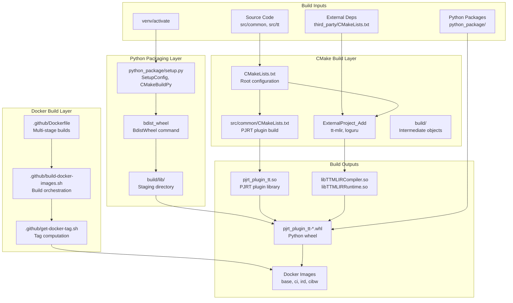
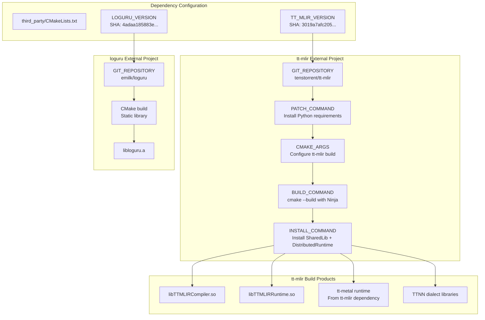
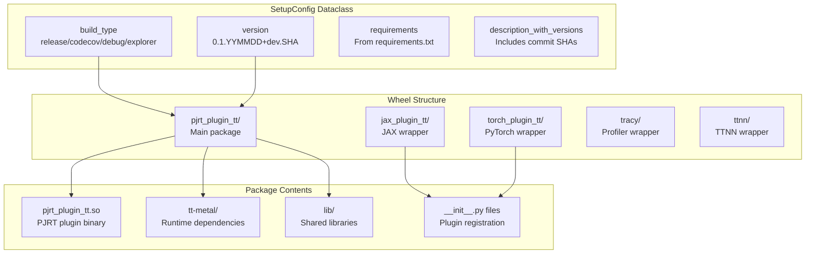

# Build System

Relevant source files
*   [.github/actions/inspect-changes/action.yml](https://github.com/tenstorrent/tt-xla/blob/c77995f6/.github/actions/inspect-changes/action.yml)
*   [.github/build-docker-images.sh](https://github.com/tenstorrent/tt-xla/blob/c77995f6/.github/build-docker-images.sh)
*   [.github/entrypoint.sh](https://github.com/tenstorrent/tt-xla/blob/c77995f6/.github/entrypoint.sh)
*   [.github/workflows/call-build-docker.yml](https://github.com/tenstorrent/tt-xla/blob/c77995f6/.github/workflows/call-build-docker.yml)
*   [.github/workflows/call-build.yml](https://github.com/tenstorrent/tt-xla/blob/c77995f6/.github/workflows/call-build.yml)
*   [.github/workflows/pr-main.yml](https://github.com/tenstorrent/tt-xla/blob/c77995f6/.github/workflows/pr-main.yml)
*   [.github/workflows/push-main.yml](https://github.com/tenstorrent/tt-xla/blob/c77995f6/.github/workflows/push-main.yml)
*   [CMakeLists.txt](https://github.com/tenstorrent/tt-xla/blob/c77995f6/CMakeLists.txt)
*   [python_package/setup.py](https://github.com/tenstorrent/tt-xla/blob/c77995f6/python_package/setup.py)
*   [tests/runner/test_config/model_diff.py](https://github.com/tenstorrent/tt-xla/blob/c77995f6/tests/runner/test_config/model_diff.py)
*   [third_party/CMakeLists.txt](https://github.com/tenstorrent/tt-xla/blob/c77995f6/third_party/CMakeLists.txt)
*   [venv/activate](https://github.com/tenstorrent/tt-xla/blob/c77995f6/venv/activate)

## Purpose and Scope

This document describes the TT-XLA build system, which compiles native C++ code, manages external dependencies, packages everything into distributable Python wheels, and creates Docker images for development and CI. The build system is CMake-based with custom Python packaging logic and Docker infrastructure.

For information about CI/CD workflows that invoke this build system, see [CI/CD Pipeline](https://deepwiki.com/tenstorrent/tt-xla/7-cicd-pipeline). For development environment setup and building from source, see [Development Environment Setup](https://deepwiki.com/tenstorrent/tt-xla/8.1-development-environment-setup) and [Building from Source](https://deepwiki.com/tenstorrent/tt-xla/8.2-building-from-source).

## Build System Architecture

The TT-XLA build system consists of three main components: CMake-based native compilation, Python wheel packaging, and Docker image building. These components work together to produce distributable artifacts and development environments.

**Sources:**[CMakeLists.txt 1-111](https://github.com/tenstorrent/tt-xla/blob/c77995f6/CMakeLists.txt#L1-L111)[python_package/setup.py 1-512](https://github.com/tenstorrent/tt-xla/blob/c77995f6/python_package/setup.py#L1-L512)[.github/build-docker-images.sh 1-107](https://github.com/tenstorrent/tt-xla/blob/c77995f6/.github/build-docker-images.sh#L1-L107)



## CMake Configuration

### Root CMakeLists.txt

The root `CMakeLists.txt` defines the project structure, compiler settings, and build options. It requires the TT-XLA environment to be activated and sets up essential build configurations.

**Key Configuration:**

| Setting | Value | Description |
| --- | --- | --- |
| `CMAKE_C_COMPILER` | `clang` | C compiler |
| `CMAKE_CXX_COMPILER` | `clang++` | C++ compiler |
| `CMAKE_CXX_STANDARD` | `17` | C++ language standard |
| `CMAKE_POSITION_INDEPENDENT_CODE` | `ON` | Required for shared libraries |
| `CMAKE_CXX_FLAGS` | Contains `-fno-rtti` | Disable RTTI for compatibility |

**Build Options:**

`option(TTMLIR_ENABLE_PERF_TRACE "Enable performance tracing in tt-mlir" ON)option(TTMLIR_ENABLE_BINDINGS_PYTHON "Enable Python bindings in tt-mlir" OFF)option(TTXLA_ENABLE_EXPLORER "Enable Explorer feature in tt-mlir" OFF)option(TTXLA_ENABLE_PJRT_TESTS "Enable PJRT tests" OFF)option(TTXLA_ENABLE_EWHEEL_INSTALL "Enable editable wheel install" ON)option(TTXLA_ENABLE_TOOLS "Enable building tools" ON)option(CODE_COVERAGE "Enable coverage reporting" OFF)option(TTXLA_TRACY_ZONES "Enable PJRT tracy zones" OFF)`
The build type for tt-mlir can be separately configured via `TTMLIR_BUILD_TYPE` (Release/Debug/RelWithDebInfo/MinSizeRel), allowing different optimization levels for the dependency versus the main project.

**Sources:**[CMakeLists.txt 25-110](https://github.com/tenstorrent/tt-xla/blob/c77995f6/CMakeLists.txt#L25-L110)

### External Dependencies

The build system manages external dependencies through CMake's `ExternalProject_Add`. Dependencies are built from specific Git SHAs to ensure reproducibility.

**tt-mlir Configuration:**

The tt-mlir dependency is built with extensive CMake arguments:

*   `CMAKE_BUILD_TYPE=${TTMLIR_BUILD_TYPE}`: Separate build type from main project
*   `CMAKE_CXX_COMPILER_LAUNCHER=ccache`: Enable build caching
*   `DTT_RUNTIME_ENABLE_TTNN=ON`: Enable TTNN backend
*   `DTTMLIR_ENABLE_STABLEHLO=ON`: Enable StableHLO frontend
*   `DTTMLIR_ENABLE_RUNTIME=ON`: Enable runtime libraries
*   `DTT_RUNTIME_DEBUG=${TT_RUNTIME_DEBUG}`: Debug mode for runtime
*   `DTTMLIR_ENABLE_OPMODEL=ON`: Enable operation model
*   `DTTMLIR_ENABLE_EXPLORER=${TTXLA_ENABLE_EXPLORER}`: Optional explorer tools
*   `DTTMLIR_ENABLE_TESTS=OFF`: Skip tests in external project

The build process includes a `PATCH_COMMAND` that installs Python requirements for tt-mlir before building:

`PATCH_COMMAND mkdir -p ${TTMLIR_BUILD_DIR}COMMAND TTPJRT_SOURCE_DIR=${TTPJRT_SOURCE_DIR} bash ${TTPJRT_SOURCE_DIR}/venv/install_ttmlir_requirements.sh`
**Environment Variables:**

If `TT_METAL_RUNTIME_ROOT` is not set, the build sets it to point to tt-metal within tt-mlir's build tree. This is handled via the `WITH_METAL_RUNTIME_ROOT_SET` variable.

**Sources:**[third_party/CMakeLists.txt 1-133](https://github.com/tenstorrent/tt-xla/blob/c77995f6/third_party/CMakeLists.txt#L1-L133)




**tt-mlir Configuration:**

The tt-mlir dependency is built with extensive CMake arguments:

- `CMAKE_BUILD_TYPE=${TTMLIR_BUILD_TYPE}`: Separate build type from main project
- `CMAKE_CXX_COMPILER_LAUNCHER=ccache`: Enable build caching
- `DTT_RUNTIME_ENABLE_TTNN=ON`: Enable TTNN backend
- `DTTMLIR_ENABLE_STABLEHLO=ON`: Enable StableHLO frontend
- `DTTMLIR_ENABLE_RUNTIME=ON`: Enable runtime libraries
- `DTT_RUNTIME_DEBUG=${TT_RUNTIME_DEBUG}`: Debug mode for runtime
- `DTTMLIR_ENABLE_OPMODEL=ON`: Enable operation model
- `DTTMLIR_ENABLE_EXPLORER=${TTXLA_ENABLE_EXPLORER}`: Optional explorer tools
- `DTTMLIR_ENABLE_TESTS=OFF`: Skip tests in external project

The build process includes a `PATCH_COMMAND` that installs Python requirements for tt-mlir before building:

```bash
PATCH_COMMAND mkdir -p ${TTMLIR_BUILD_DIR}
COMMAND TTPJRT_SOURCE_DIR=${TTPJRT_SOURCE_DIR} bash ${TTPJRT_SOURCE_DIR}/venv/install_ttmlir_requirements.sh
```

**Environment Variables:**

If `TT_METAL_RUNTIME_ROOT` is not set, the build sets it to point to tt-metal within tt-mlir's build tree. This is handled via the `WITH_METAL_RUNTIME_ROOT_SET` variable.
```
### Library Exposure

After building external projects, the build system exposes tt-mlir's shared libraries as imported CMake targets:

`file(GLOB TTMLIR_LIBRARIES "${TTMLIR_LIB_DIR}/*.so")foreach(TTMLIR_LIBRARY ${TTMLIR_LIBRARIES})    # Remove `lib` prefix and `.so` extension from shared lib name    get_filename_component(lib_name ${TTMLIR_LIBRARY} NAME_WE)    string(REPLACE "lib" "" lib_name ${lib_name})        add_library(${lib_name} SHARED IMPORTED GLOBAL)    set_target_properties(${lib_name} PROPERTIES        EXCLUDE_FROM_ALL TRUE        IMPORTED_LOCATION ${TTMLIR_LIBRARY}    )    add_dependencies(${lib_name} tt-mlir)endforeach()`
This allows other CMake targets to link against tt-mlir libraries by name without knowing the full path.

**Sources:**[third_party/CMakeLists.txt 98-112](https://github.com/tenstorrent/tt-xla/blob/c77995f6/third_party/CMakeLists.txt#L98-L112)

## Python Wheel Packaging

### Setup Configuration

The `setup.py` file contains a `SetupConfig` dataclass that defines wheel structure and build parameters:

**Version Generation:**

The wheel version follows the pattern `0.1.YYMMDD+dev.SHA` where:

*   `YYMMDD`: Date of the commit in format YYMMDD
*   `SHA`: Short Git commit hash

This version is generated dynamically:

`short_hash = subprocess.check_output(["git", "rev-parse", "--short", "HEAD"])    .decode("ascii").strip()date = subprocess.check_output(    ["git", "show", "-s", "--format=%cd", "--date=format:%y%m%d", "HEAD"]).decode("ascii").strip()return "0.1." + date + "+dev." + short_hash`
**Description with Versions:**

The wheel description includes Git SHAs for all components:

*   Frontend SHA from current repository
*   tt-mlir SHA from `third_party/CMakeLists.txt`
*   tt-metal SHA fetched from tt-mlir's `CMakeLists.txt`
*   Build date and build type

This provides full traceability of the build artifacts.

**Sources:**[python_package/setup.py 23-195](https://github.com/tenstorrent/tt-xla/blob/c77995f6/python_package/setup.py#L23-L195)




**Version Generation:**

The wheel version follows the pattern `0.1.YYMMDD+dev.SHA` where:
- `YYMMDD`: Date of the commit in format YYMMDD
- `SHA`: Short Git commit hash

This version is generated dynamically:

```python
short_hash = subprocess.check_output(["git", "rev-parse", "--short", "HEAD\
1d:T4feb,
```
### Custom Build Commands

The wheel build process uses two custom setuptools commands:

**BdistWheel:**

The `BdistWheel` class customizes wheel creation:

*   Accepts `--build-type` argument (release/codecov/debug/explorer)
*   Marks wheel as non-pure (`root_is_pure = False`) for native binaries
*   Forces Python 3.12 ABI tag (`cp312-cp312`)
*   Updates wheel description with version information before building

**CMakeBuildPy:**

The `CMakeBuildPy` class handles the CMake build:

1.   **Build CMake Project:** Invokes CMake with appropriate arguments:

`cmake -G Ninja -B build     -DTTXLA_ENABLE_EWHEEL_INSTALL=OFF    -DTTXLA_ENABLE_TOOLS={ON|OFF}    -DCODE_COVERAGE={ON|OFF}    -DTTXLA_ENABLE_EXPLORER={ON|OFF}    -DCMAKE_INSTALL_PREFIX=<install_dir>cmake --build buildcmake --install build`
2.   **Portable Build Environment Variables:**

`os.environ["TRACY_NO_ISA_EXTENSIONS"] = "1"os.environ["TRACY_NO_INVARIANT_CHECK"] = "1"`
3.   **Discover Packages:** After build, rediscover packages to include newly built components like `tracy` module from tt-metal.

4.   **Continue Python Build:** Call parent `build_py.run()` to complete packaging.

**Sources:**[python_package/setup.py 198-400](https://github.com/tenstorrent/tt-xla/blob/c77995f6/python_package/setup.py#L198-L400)

### Artifact Pruning

After installation, the build system prunes the install tree to reduce wheel size:

**Pruning Operations:**

| Operation | Files Removed | Rationale |
| --- | --- | --- |
| `_remove_broken_symlinks` | Broken symlinks | Prevent packaging errors |
| `_remove_static_archives` | `*.a` files in lib/ | Not needed at runtime |
| `_remove_bloat_dir` | `lib/cmake/`, `lib/pkgconfig/`, `include/` | Development files |
| `_strip_shared_objects` | Debug symbols from `*.so` | Reduce size (release only) |
| `_deduplicate_shared_objects` | Duplicate `.so` files | Replace with symlinks |

**Deduplication:**

The `_deduplicate_shared_objects` function computes SHA256 checksums of all shared objects and replaces duplicates with relative symlinks:

`def _deduplicate_shared_objects(root: Path) -> None:    seen: dict[str, Path] = {}    for so_file in sorted(root.rglob("*.so*")):        if so_file.is_symlink() or not so_file.is_file():            continue        checksum = _sha256_file(so_file)        if checksum in seen:            target = seen[checksum]            link_target = os.path.relpath(target, so_file.parent)            so_file.unlink()            os.symlink(link_target, so_file)        else:            seen[checksum] = so_file`
**CI-Specific Pruning:**

In CI environments (detected via `IN_CIBW_ENV=ON`), additional directories are removed:

*   `bin/`: Command-line tools (removes multi-host support)
*   `tt-metal/tests/`: Test files

**Sources:**[python_package/setup.py 366-470](https://github.com/tenstorrent/tt-xla/blob/c77995f6/python_package/setup.py#L366-L470)

## Docker Build Infrastructure

### Image Hierarchy

The Docker build creates multiple images for different purposes:

**Image Descriptions:**

| Image | Target Stage | Purpose |
| --- | --- | --- |
| `tt-xla-base-ubuntu-22-04` | `base` | Minimal runtime environment for running tests |
| `tt-xla-ci-ubuntu-22-04` | `ci` | Build tools, compilers, Python dependencies |
| `tt-xla-ird-ubuntu-22-04` | `ird` | Full IDE/development setup |
| `tt-xla-cibuildwheel-manylinux-2-34` | `cibw` | Manylinux-compliant wheel building |

**Sources:**[.github/build-docker-images.sh 50-102](https://github.com/tenstorrent/tt-xla/blob/c77995f6/.github/build-docker-images.sh#L50-L102)

### Build Process

The Docker build is orchestrated by `.github/build-docker-images.sh`:

**Tag Computation:**

The `.github/get-docker-tag.sh` script computes a stable tag for Docker images based on:

*   Hash of the Dockerfile
*   tt-mlir Docker tag (passed as argument)

This ensures images are only rebuilt when the Dockerfile or tt-mlir dependency changes.

**Build Arguments:**

`docker build \    --progress=plain \    --build-arg FROM_TAG=$DOCKER_TAG \    --build-arg MLIR_TAG=$MLIR_DOCKER_TAG \    ${target_image:+--target $target_image} \    -t $image_name:$DOCKER_TAG \    -t $image_name:latest \    -f .github/Dockerfile .`
**Check-Only Mode:**

The script supports `--check-only` mode to verify image existence without building:

`.github/build-docker-images.sh $tt_mlir_sha ci --check-only`
This is used in CI to determine if a build is needed.

**Sources:**[.github/build-docker-images.sh 1-107](https://github.com/tenstorrent/tt-xla/blob/c77995f6/.github/build-docker-images.sh#L1-L107)[.github/workflows/call-build-docker.yml 1-153](https://github.com/tenstorrent/tt-xla/blob/c77995f6/.github/workflows/call-build-docker.yml#L1-L153)

### CI Integration

The Docker build integrates with GitHub Actions workflows through `call-build-docker.yml`:

**Workflow Outputs:**

The workflow outputs image names for use by dependent workflows:

*   `docker-image`: CI image for building tt-xla
*   `docker-image-base`: Base image for running tests
*   `docker-image-manylinux`: Manylinux image for portable wheels

**Latest Tag Management:**

On push to main, the workflow uses `skopeo` to copy the tagged image to the `latest` tag:

`skopeo copy "docker://$CI_IMAGE_NAME:$DOCKER_TAG" "docker://$CI_IMAGE_NAME:latest"`
This ensures the latest tag always points to the most recent main branch build.

**Sources:**[.github/workflows/call-build-docker.yml 1-153](https://github.com/tenstorrent/tt-xla/blob/c77995f6/.github/workflows/call-build-docker.yml#L1-L153)

## Build Artifacts

The build system produces the following artifacts:

### PJRT Plugin Library

**File:**`pjrt_plugin_tt.so`**Location:**`build/pjrt_implementation/src/libpjrt_plugin_tt.so`**Description:** The core PJRT plugin implementing the OpenXLA PJRT API for Tenstorrent devices. This shared library is loaded by JAX/PyTorch to provide TT device support.

### Python Wheel

**File:**`pjrt_plugin_tt-0.1.YYMMDD+dev.SHA-cp312-cp312-linux_x86_64.whl`**Location:**`python_package/dist/`**Contents:**

*   `pjrt_plugin_tt/` - PJRT plugin package with `.so` and dependencies
*   `jax_plugin_tt/` - JAX plugin registration
*   `torch_plugin_tt/` - PyTorch/XLA plugin registration
*   `tracy/` - Tracy profiler wrapper
*   `ttnn/` - TTNN module wrapper

**Entry Points:**

*   `jax_plugins`: `pjrt_plugin_tt = jax_plugin_tt`
*   `torch_xla.plugins`: `tt = torch_plugin_tt:TTPlugin`
*   `console_scripts`: `tt-forge-install`, `tracy`

### vLLM Plugin Wheel

**File:**`vllm_tt-*.whl`**Location:**`integrations/vllm_plugin/dist/`**Description:** Separate wheel for vLLM integration providing `TTPlatform`, `TTWorker`, and `TTModelRunner`.

### Alchemist Library

**File:**`libtt-alchemist-lib.so`**Location:**`third_party/tt-mlir/src/tt-mlir/build/lib/`**Description:** Op model library for performance analysis, included in release builds.

**Sources:**[python_package/setup.py 28-43](https://github.com/tenstorrent/tt-xla/blob/c77995f6/python_package/setup.py#L28-L43)[.github/workflows/call-build.yml 178-202](https://github.com/tenstorrent/tt-xla/blob/c77995f6/.github/workflows/call-build.yml#L178-L202)

## Environment Setup

### venv/activate Script

The `venv/activate` script sets up the build environment with required paths and variables:

**Key Environment Variables:**

| Variable | Value | Purpose |
| --- | --- | --- |
| `TTMLIR_TOOLCHAIN_DIR` | `/opt/ttmlir-toolchain` or user-specified | Toolchain installation path |
| `LD_LIBRARY_PATH` | Includes `$TTMLIR_TOOLCHAIN_DIR/lib` | Shared library search path |
| `TT_MLIR_HOME` | `$(pwd)/third_party/tt-mlir/src/tt-mlir/` | tt-mlir source location |
| `PYTHONPATH` | Multiple paths including vllm_plugin | Python module search path |
| `TTXLA_ENV_ACTIVATED` | `1` | Build system requires this |
| `PATH` | Includes toolchain bin and tt-mlir build/bin | Executable search path |
| `ARCH_NAME` | `wormhole_b0` or user-specified | Target architecture |

**Virtual Environment Creation:**

If the virtual environment doesn't exist, the script creates it and installs dependencies:

`python3.12 -m venv $TTMLIR_VENV_DIRsource $TTMLIR_VENV_DIR/bin/activate$PIP install --upgrade pip$PIP install -r python_package/requirements.txt$PIP install -r venv/requirements-dev.txt`
The script uses `uv pip` if available, falling back to standard `pip`.

**Sources:**[venv/activate 1-44](https://github.com/tenstorrent/tt-xla/blob/c77995f6/venv/activate#L1-L44)

## CI Build Workflow

The `call-build.yml` workflow implements artifact caching to avoid unnecessary rebuilds:

**Artifact Naming Convention:**

*   **With SHA suffix:**`xla-whl-release-abc1234` (reusable, individual commits on main)
*   **Without SHA suffix:**`xla-whl-release` (non-reusable, PRs and merge commits)

**Reusability Conditions:**

An artifact is reusable only when:

1.   Not a pull request event (`github.event_name != "pull_request"`)
2.   Single parent commit (not a merge: `git cat-file -p HEAD | grep -c "^parent" == 1`)
3.   No MLIR override specified (`mlir_override == ""`)
4.   Force rebuild not requested (`force_rebuild != "true"`)

**Workflow Outputs:**

*   `wheel_artifact_name`: Name of the PJRT plugin wheel
*   `wheel_release_vllm_tt_artifact_name`: Name of vLLM plugin wheel
*   `alchemist_artifact_name`: Name of alchemist library
*   `artifacts_run_id`: Run ID where artifacts are stored (for reuse)

**Build Type Validation:**

After building, the workflow validates the build type matches the request:

`wheel_summary=$(wheel2json pjrt_plugin_tt*.whl | jq -r '.dist_info.metadata.summary')match=$(echo "$wheel_summary" | grep -oP "build-type=release" || true)if [ -z "$match" ]; then    exit 1fi`
This ensures the correct build configuration was used.

**Sources:**[.github/workflows/call-build.yml 1-203](https://github.com/tenstorrent/tt-xla/blob/c77995f6/.github/workflows/call-build.yml#L1-L203)

## Change Detection

The `inspect-changes` action analyzes modified files to determine if a build is necessary:

**Skip Build Conditions:**

Builds are skipped when only these files are modified:

*   Documentation (`*.md`, `docs/*`)
*   Configuration files (`*.gitignore`, `LICENSE`, `CODEOWNERS`)
*   Test matrix presets (JSON files in `.github/workflows/test-matrix-presets/`)
*   Specific workflows (schedule, manual-test)
*   Test runner configuration (`tests/runner/*` YAML files without test_config changes)

**Wheel Change Detection:**

The action detects changes to wheel build files:

*   `CMakeLists.txt` (root and subdirectories)
*   `python_package/*`

When detected, `wheel-changes=true` triggers manylinux wheel building.

**tt-mlir Version Change Detection:**

The action detects `TT_MLIR_VERSION` changes in `third_party/CMakeLists.txt` using diff parsing:

`TT_MLIR_DIFF=$(gh pr diff $PR_NUMBER --repo $REPO)CMAKE_FILE_DIFF=$(echo "$TT_MLIR_DIFF" |     sed -n '/^diff --git a\/third_party\/CMakeLists\.txt/,/^diff --git /p')if echo "$CMAKE_FILE_DIFF" | grep -qE '^[+-][[:space:]]*set\(TT_MLIR_VERSION'; then    tt_mlir_version_changed=truefi`
When detected, `run-uplift-model-tests=true` triggers extended testing.

**Sources:**[.github/actions/inspect-changes/action.yml 1-187](https://github.com/tenstorrent/tt-xla/blob/c77995f6/.github/actions/inspect-changes/action.yml#L1-L187)

This wiki is featured in the [repository](https://github.com/tenstorrent/tt-xla/blob/main/README.md)

Dismiss
Refresh this wiki

Enter email to refresh
