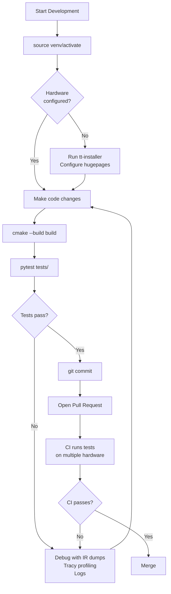
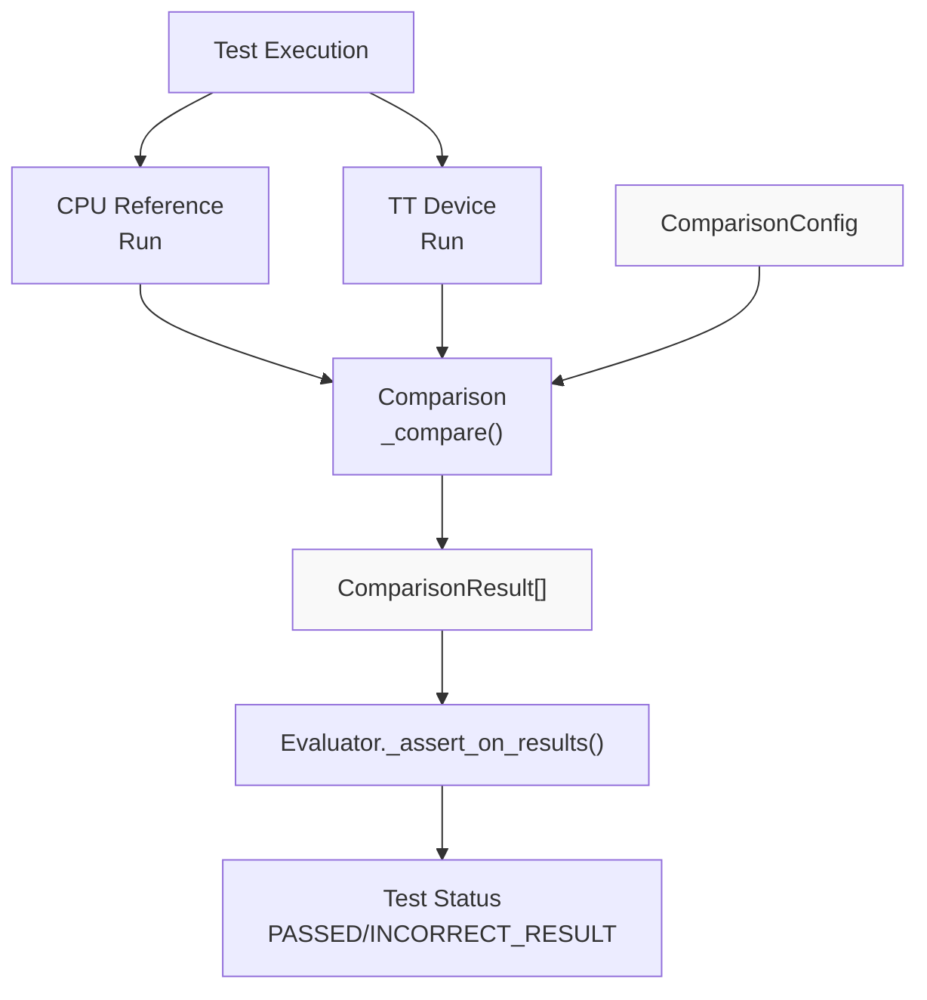
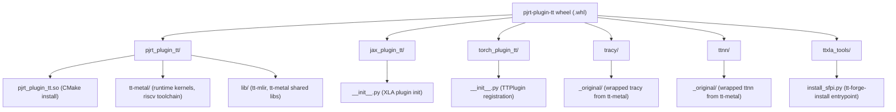

# Python Package Build and Distribution

Relevant source files
*   [.github/actions/inspect-changes/action.yml](https://github.com/tenstorrent/tt-xla/blob/c77995f6/.github/actions/inspect-changes/action.yml)
*   [.github/build-docker-images.sh](https://github.com/tenstorrent/tt-xla/blob/c77995f6/.github/build-docker-images.sh)
*   [.github/entrypoint.sh](https://github.com/tenstorrent/tt-xla/blob/c77995f6/.github/entrypoint.sh)
*   [.github/workflows/call-build-docker.yml](https://github.com/tenstorrent/tt-xla/blob/c77995f6/.github/workflows/call-build-docker.yml)
*   [.github/workflows/call-build.yml](https://github.com/tenstorrent/tt-xla/blob/c77995f6/.github/workflows/call-build.yml)
*   [.github/workflows/pr-main.yml](https://github.com/tenstorrent/tt-xla/blob/c77995f6/.github/workflows/pr-main.yml)
*   [.github/workflows/push-main.yml](https://github.com/tenstorrent/tt-xla/blob/c77995f6/.github/workflows/push-main.yml)
*   [CMakeLists.txt](https://github.com/tenstorrent/tt-xla/blob/c77995f6/CMakeLists.txt)
*   [python_package/setup.py](https://github.com/tenstorrent/tt-xla/blob/c77995f6/python_package/setup.py)
*   [tests/runner/test_config/model_diff.py](https://github.com/tenstorrent/tt-xla/blob/c77995f6/tests/runner/test_config/model_diff.py)
*   [third_party/CMakeLists.txt](https://github.com/tenstorrent/tt-xla/blob/c77995f6/third_party/CMakeLists.txt)
*   [venv/activate](https://github.com/tenstorrent/tt-xla/blob/c77995f6/venv/activate)

This page covers the `setuptools`-based wheel build system for tt-xla, including the custom build commands in `python_package/setup.py`, the four supported build types, post-build pruning steps, plugin entry point registration, and the `venv/activate` development environment script.

For the underlying CMake target graph that produces `pjrt_plugin_tt.so`, see [3.1](https://deepwiki.com/tenstorrent/tt-xla/3.1-cmake-configuration-and-external-dependencies). For Docker image construction used in CI builds, see [3.3](https://deepwiki.com/tenstorrent/tt-xla/3.3-docker-build-infrastructure). For CI artifact naming and upload, see [7.2](https://deepwiki.com/tenstorrent/tt-xla/7.2-build-and-artifact-management).

* * *

## Overview

The Python package (`pjrt-plugin-tt`) is a platform-specific wheel that bundles the compiled PJRT plugin binary together with all its runtime dependencies. It exposes three Python namespaces — `pjrt_plugin_tt`, `jax_plugin_tt`, and `torch_plugin_tt` — through standard plugin entry points so that JAX and PyTorch/XLA automatically discover and load the Tenstorrent backend without any user-side registration code.

The build is driven by `python_package/setup.py`, which subclasses two `setuptools` commands:

| Class | Base class | Responsibility |
| --- | --- | --- |
| `CMakeBuildPy` | `build_py` | Invokes CMake, installs artifacts, prunes the install tree |
| `BdistWheel` | `bdist_wheel` | Selects build type, forces `cp312` ABI tag, injects version metadata |

* * *







**Diagram: High-level comparison flow during test execution**

Sources: [tests/infra/testers/single_chip/model/torch_model_tester.py:170-278](), [tests/runner/test_utils.py:363-451]()
```
## Wheel Layout

**Diagram: Wheel directory structure and source of each component**

Sources: [python_package/setup.py 22-43](https://github.com/tenstorrent/tt-xla/blob/c77995f6/python_package/setup.py#L22-L43)

* * *




Sources: [python_package/setup.py:22-43]()

---
```
## SetupConfig Dataclass

`SetupConfig` is a `@dataclass` defined at [python_package/setup.py 22-191](https://github.com/tenstorrent/tt-xla/blob/c77995f6/python_package/setup.py#L22-L191) that centralises all wheel metadata and path constants.

| Field / Property | Type | Description |
| --- | --- | --- |
| `build_type` | `str` (field) | One of `release`, `debug`, `codecov`, `explorer`. Default: `release` |
| `enable_explorer` | `bool` (field) | Set `True` automatically when `build_type == "explorer"` |
| `version` (property) | `str` | `0.1.<YYMMDD>+dev.<short-sha>` derived from `git rev-parse` |
| `requirements` (property) | `list[str]` | Parsed from `python_package/requirements.txt`, strips `--extra-index-url` lines |
| `long_description` (property) | `str` | Contents of the top-level `README.md` |
| `description_with_versions` (property) | `str` | Embeds `commit`, `tt-mlir-commit`, `tt-metal-commit`, `built-date`, `build-type` |
| `shared_device_package_target_dir_relpath` (property) | `Path` | `pjrt_plugin_tt` — CMake install prefix relative path |

The `description_with_versions` property fetches the `TT_MLIR_VERSION` SHA from `third_party/CMakeLists.txt`, then fetches tt-metal's SHA from the tt-mlir GitHub repository at that commit [python_package/setup.py 95-144](https://github.com/tenstorrent/tt-xla/blob/c77995f6/python_package/setup.py#L95-L144) This value is stored in the wheel's `Summary` metadata field and validated in CI [.github/workflows/call-build.yml 152-165](https://github.com/tenstorrent/tt-xla/blob/c77995f6/.github/workflows/call-build.yml#L152-L165)

* * *

## BdistWheel: Custom Wheel Command

`BdistWheel` extends `bdist_wheel`[python_package/setup.py 197-243](https://github.com/tenstorrent/tt-xla/blob/c77995f6/python_package/setup.py#L197-L243) and makes three changes:

1.   **Adds `--build-type` option** accepting `release`, `debug`, `codecov`, or `explorer`. Invalid values raise `ValueError` at `finalize_options` time.
2.   **Forces `cp312-cp312` ABI tag** via `get_tag()`, overriding whatever the environment would normally produce. The platform tag is preserved as-is.
3.   **Sets `root_is_pure = False`** to mark the wheel as platform-specific (required because `pjrt_plugin_tt.so` is a native binary).

Sources: [python_package/setup.py 197-243](https://github.com/tenstorrent/tt-xla/blob/c77995f6/python_package/setup.py#L197-L243)

* * *

## CMakeBuildPy: CMake Invocation

`CMakeBuildPy.run()`[python_package/setup.py 262-281](https://github.com/tenstorrent/tt-xla/blob/c77995f6/python_package/setup.py#L262-L281) is called by `setuptools` during wheel construction before Python source is assembled. The core logic lives in `build_cmake_project()`[python_package/setup.py 283-319](https://github.com/tenstorrent/tt-xla/blob/c77995f6/python_package/setup.py#L283-L319):

**Build type → CMake flag mapping**

| `build_type` | `CODE_COVERAGE` | `TTXLA_ENABLE_EXPLORER` |
| --- | --- | --- |
| `release` | `OFF` | `OFF` |
| `debug` | `OFF` | `OFF` |
| `codecov` | `ON` | `OFF` |
| `explorer` | `OFF` | `ON` |

The CMake invocation sequence:

```
cmake -G Ninja -B build -DCODE_COVERAGE=... -DTTXLA_ENABLE_EXPLORER=... -DCMAKE_INSTALL_PREFIX=<build_lib>/pjrt_plugin_tt
cmake --build build
cmake --install build
```

Two environment variables are set before `cmake --build` to ensure a portable build: `TRACY_NO_ISA_EXTENSIONS=1` and `TRACY_NO_INVARIANT_CHECK=1`[python_package/setup.py 311-312](https://github.com/tenstorrent/tt-xla/blob/c77995f6/python_package/setup.py#L311-L312)

After install, `_prune_install_tree()` is called immediately.

Sources: [python_package/setup.py 246-344](https://github.com/tenstorrent/tt-xla/blob/c77995f6/python_package/setup.py#L246-L344)

* * *

## Post-Build Install Tree Pruning

`_prune_install_tree()`[python_package/setup.py 321-332](https://github.com/tenstorrent/tt-xla/blob/c77995f6/python_package/setup.py#L321-L332) calls four helper functions in sequence:

**Diagram: Pruning pipeline**

| Function | What it removes / transforms |
| --- | --- |
| `_remove_broken_symlinks` | Dangling symlinks caused by tt-umd → tt-metal → tt-mlir uplifts |
| `_remove_static_archives` | All `*.a` files under `lib/` to reduce wheel size |
| `_strip_shared_objects` | Debug symbols from `*.so` files (release builds only) |
| `_deduplicate_shared_objects` | Replaces duplicate `*.so` files (same SHA-256) with relative symlinks to the canonical copy |

Sources: [python_package/setup.py 346-408](https://github.com/tenstorrent/tt-xla/blob/c77995f6/python_package/setup.py#L346-L408)

* * *

## Entry Points and Plugin Registration

The `setup()` call at [python_package/setup.py 411-455](https://github.com/tenstorrent/tt-xla/blob/c77995f6/python_package/setup.py#L411-L455) declares three entry point groups:

```
entry_points = {
    "jax_plugins":         ["pjrt_plugin_tt = jax_plugin_tt"],
    "torch_xla.plugins":   ["tt = torch_plugin_tt:TTPlugin"],
    "console_scripts":     [
        "tt-forge-install = ttxla_tools.install_sfpi:main",
        "tracy = tracy.__main__:main",
    ],
}
```

**Diagram: Entry point resolution at runtime**

The `jax_plugins` group is scanned by JAX's plugin loader automatically when JAX is imported; no explicit `jax.config.update` is needed. The `torch_xla.plugins` group is read by PyTorch/XLA's device plugin infrastructure. For more on what happens inside these `__init__.py` modules, see [5.1](https://deepwiki.com/tenstorrent/tt-xla/5.1-pytorchxla-backend) and [5.2](https://deepwiki.com/tenstorrent/tt-xla/5.2-jax-backend).

Sources: [python_package/setup.py 424-436](https://github.com/tenstorrent/tt-xla/blob/c77995f6/python_package/setup.py#L424-L436)

* * *

## Version Scheme

The wheel version is computed by `SetupConfig.version`[python_package/setup.py 51-67](https://github.com/tenstorrent/tt-xla/blob/c77995f6/python_package/setup.py#L51-L67):

```
0.1.<YYMMDD>+dev.<short-sha>
```

*   `YYMMDD` — author date of `HEAD`, formatted via `git show -s --format=%cd --date=format:%y%m%d`
*   `short-sha` — output of `git rev-parse --short HEAD`

Example: `0.1.250614+dev.a3f1b2c`

This scheme matches the convention used by `tt-forge-fe`.

Sources: [python_package/setup.py 51-67](https://github.com/tenstorrent/tt-xla/blob/c77995f6/python_package/setup.py#L51-L67)

* * *

## Development Environment: venv/activate

`venv/activate`[venv/activate 1-43](https://github.com/tenstorrent/tt-xla/blob/c77995f6/venv/activate#L1-L43) is a shell script (sourced, not executed) that sets up the local development environment without building a wheel.

**Environment variables set by `venv/activate`**

| Variable | Value | Purpose |
| --- | --- | --- |
| `TTMLIR_TOOLCHAIN_DIR` | `/opt/ttmlir-toolchain` (default) | Toolchain prefix for LLVM/clang binaries |
| `LD_LIBRARY_PATH` | `$TTMLIR_TOOLCHAIN_DIR/lib:...` | Runtime shared library search path |
| `TT_MLIR_HOME` | `$(pwd)/third_party/tt-mlir/src/tt-mlir/` | Points to tt-mlir source tree |
| `PYTHONPATH` | Includes repo root, `tests/`, vllm plugin, tt-mlir Python packages | Makes all in-tree modules importable |
| `UV_INDEX_STRATEGY` | `unsafe-best-match` | Allows `uv` to resolve across multiple PyPI indexes |
| `TTMLIR_VENV_DIR` | `$(pwd)/venv` | Virtual environment directory |
| `VLLM_TARGET_DEVICE` | `empty` | Prevents vLLM from initialising CUDA |
| `ARCH_NAME` | `wormhole_b0` (default) | Target Tenstorrent architecture |
| `PATH` | Prepends `$TTMLIR_TOOLCHAIN_DIR/bin` and tt-mlir build `bin/` | Makes `clang-17`, `FileCheck`, etc. available |
| `TTXLA_ENV_ACTIVATED` | `1` | Guard used by other scripts |

On first run, the script creates a Python 3.12 virtual environment at `$(pwd)/venv`, installs `python_package/requirements.txt` and `venv/requirements-dev.txt`, and activates it. On subsequent runs it simply activates the existing environment.

`venv/install_ttmlir_requirements.sh`[venv/install_ttmlir_requirements.sh 1-31](https://github.com/tenstorrent/tt-xla/blob/c77995f6/venv/install_ttmlir_requirements.sh#L1-L31) is a separate script (invoked by the tt-mlir CMake build) that installs LLVM Python bindings at the version matching the pinned `LLVM_PROJECT_VERSION` from tt-mlir's `env/CMakeLists.txt`.

Sources: [venv/activate 1-43](https://github.com/tenstorrent/tt-xla/blob/c77995f6/venv/activate#L1-L43)[venv/install_ttmlir_requirements.sh 1-31](https://github.com/tenstorrent/tt-xla/blob/c77995f6/venv/install_ttmlir_requirements.sh#L1-L31)

* * *

## CI Build Invocation

In CI, the wheel is built by `.github/workflows/call-build.yml`[.github/workflows/call-build.yml 145-151](https://github.com/tenstorrent/tt-xla/blob/c77995f6/.github/workflows/call-build.yml#L145-L151) with:

`source venv/activatecd python_packagepython setup.py bdist_wheel --build-type ${{ inputs.build_type }}`
Valid `build_type` inputs accepted by the workflow are `release` and `explorer`. The produced wheel file matches `python_package/dist/pjrt_plugin_tt*.whl`.

After upload, the CI job validates the embedded `build-type=<value>` string in the wheel's `Summary` metadata field using `wheel2json`[.github/workflows/call-build.yml 152-165](https://github.com/tenstorrent/tt-xla/blob/c77995f6/.github/workflows/call-build.yml#L152-L165)

**Diagram: CI build flow (code entities)**

Sources: [.github/workflows/call-build.yml 37-197](https://github.com/tenstorrent/tt-xla/blob/c77995f6/.github/workflows/call-build.yml#L37-L197)

* * *

## Package Metadata Summary

| `setup()` parameter | Value |
| --- | --- |
| `name` | `pjrt-plugin-tt` |
| `python_requires` | `>=3.12, <3.13` |
| `zip_safe` | `False` (embedded `.so` files) |
| `include_package_data` | `True` (MANIFEST.in controls non-Python files) |
| `license` | `Apache-2.0` |
| `url` | `https://github.com/tenstorrent/tt-xla` |
| ABI tag | `cp312-cp312` (forced by `BdistWheel.get_tag`) |

The `ext_modules` list includes a stub `Extension("pjrt_plugin_tt.native", sources=[])`[python_package/setup.py 437-442](https://github.com/tenstorrent/tt-xla/blob/c77995f6/python_package/setup.py#L437-L442) which causes `setuptools` to treat the package as platform-specific even before `root_is_pure = False` is set; this ensures the wheel filename contains the platform tag in all tool versions.

Sources: [python_package/setup.py 411-455](https://github.com/tenstorrent/tt-xla/blob/c77995f6/python_package/setup.py#L411-L455)

This wiki is featured in the [repository](https://github.com/tenstorrent/tt-xla/blob/main/README.md)

Dismiss
Refresh this wiki

Enter email to refresh
