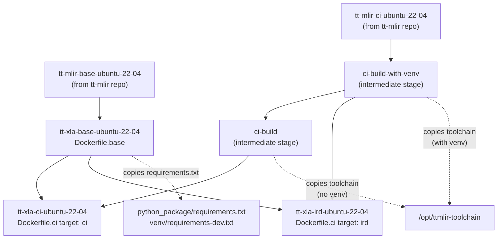
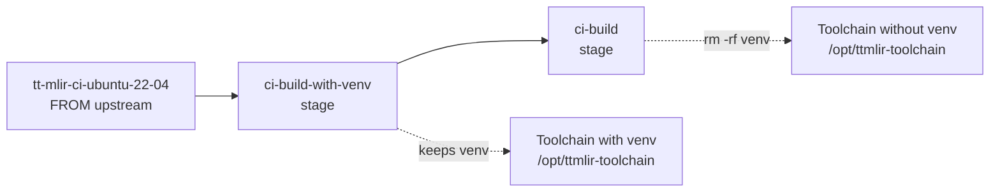
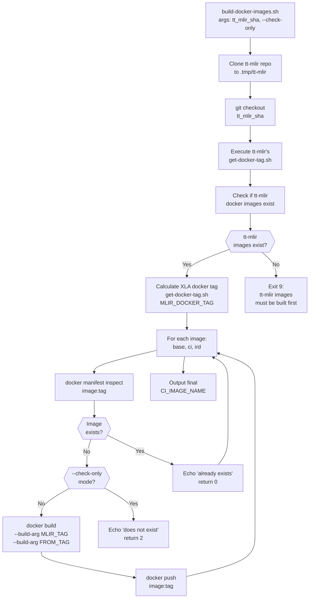
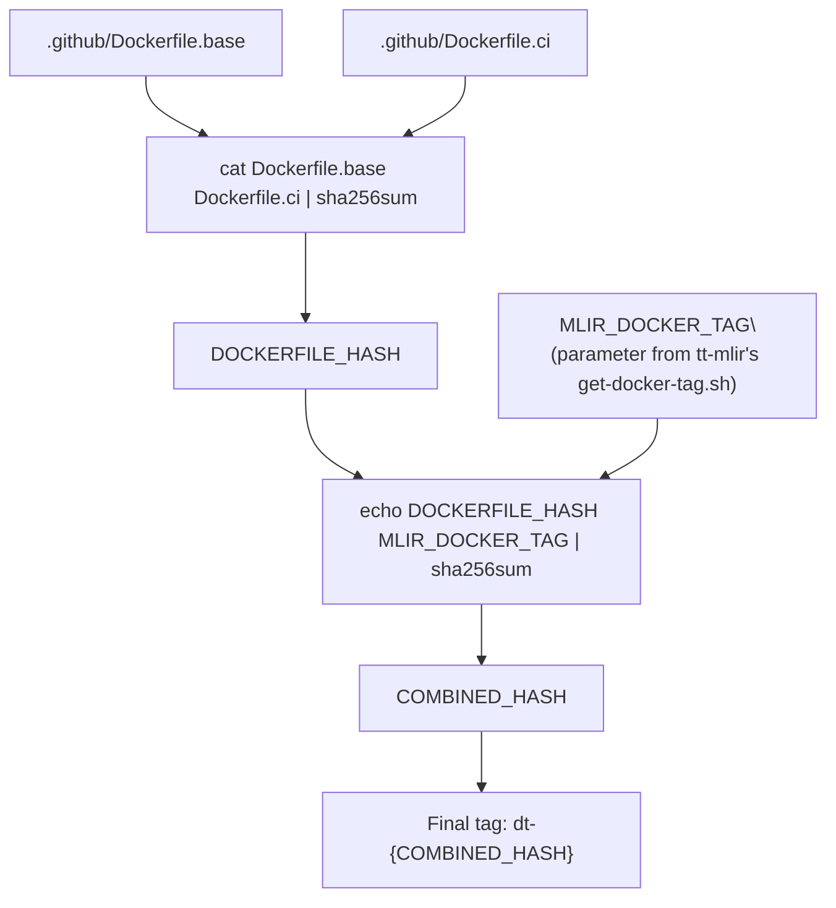
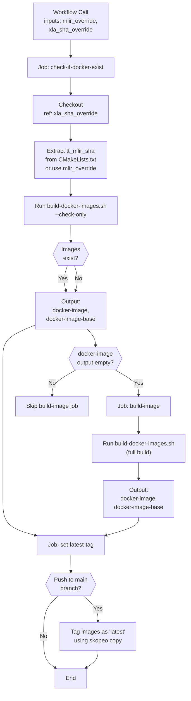
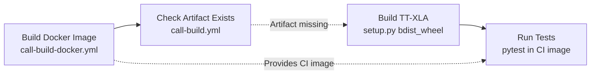

# Docker Build Infrastructure

Relevant source files
*   [.github/actions/inspect-changes/action.yml](https://github.com/tenstorrent/tt-xla/blob/c77995f6/.github/actions/inspect-changes/action.yml)
*   [.github/build-docker-images.sh](https://github.com/tenstorrent/tt-xla/blob/c77995f6/.github/build-docker-images.sh)
*   [.github/entrypoint.sh](https://github.com/tenstorrent/tt-xla/blob/c77995f6/.github/entrypoint.sh)
*   [.github/workflows/call-build-docker.yml](https://github.com/tenstorrent/tt-xla/blob/c77995f6/.github/workflows/call-build-docker.yml)
*   [.github/workflows/call-build.yml](https://github.com/tenstorrent/tt-xla/blob/c77995f6/.github/workflows/call-build.yml)
*   [.github/workflows/pr-main.yml](https://github.com/tenstorrent/tt-xla/blob/c77995f6/.github/workflows/pr-main.yml)
*   [.github/workflows/push-main.yml](https://github.com/tenstorrent/tt-xla/blob/c77995f6/.github/workflows/push-main.yml)
*   [python_package/setup.py](https://github.com/tenstorrent/tt-xla/blob/c77995f6/python_package/setup.py)
*   [tests/runner/test_config/model_diff.py](https://github.com/tenstorrent/tt-xla/blob/c77995f6/tests/runner/test_config/model_diff.py)
*   [venv/activate](https://github.com/tenstorrent/tt-xla/blob/c77995f6/venv/activate)

## Purpose and Scope

This document describes the Docker image build infrastructure for TT-XLA, including the three-tier image hierarchy, build scripts, tag calculation for caching, and GitHub Actions integration. The Docker images provide reproducible environments for building, testing, and developing TT-XLA components.

For information about building the native PJRT plugin and Python packages, see [CMake Configuration and External Dependencies](https://deepwiki.com/tenstorrent/tt-xla/3.1-cmake-configuration-and-external-dependencies) and [Python Package Build and Distribution](https://deepwiki.com/tenstorrent/tt-xla/3.2-python-package-build-and-distribution). For information about how Docker images are used in CI/CD pipelines, see [Workflow Architecture](https://deepwiki.com/tenstorrent/tt-xla/7.1-workflow-architecture).

* * *

## Image Hierarchy

TT-XLA uses a three-tier Docker image hierarchy, each built on top of the previous:

| Image Name | Purpose | Base Image | Key Components |
| --- | --- | --- | --- |
| `tt-xla-base-ubuntu-22-04` | Python dependencies and XLA requirements | `tt-mlir-base-ubuntu-22-04` | Python packages, system libraries |
| `tt-xla-ci-ubuntu-22-04` | CI test execution environment | `tt-xla-base-ubuntu-22-04` | tt-mlir toolchain (no venv) |
| `tt-xla-ird-ubuntu-22-04` | Interactive R&D environment | `tt-xla-base-ubuntu-22-04` | tt-mlir toolchain (with venv), dev tools |

All images are hosted at `ghcr.io/tenstorrent/tt-xla/` and tagged with content-based hashes for caching.

Sources: [.github/Dockerfile.base](https://github.com/tenstorrent/tt-xla/blob/c77995f6/.github/Dockerfile.base)[.github/Dockerfile.ci](https://github.com/tenstorrent/tt-xla/blob/c77995f6/.github/Dockerfile.ci)[.github/build-docker-images.sh 49-52](https://github.com/tenstorrent/tt-xla/blob/c77995f6/.github/build-docker-images.sh#L49-L52)

* * *

## Image Dependency Flow

**Image Dependency Flow**: The base image extends tt-mlir's base image with XLA-specific dependencies. The CI and IRD images both start from the XLA base but receive different versions of the tt-mlir toolchain from intermediate build stages. CI gets a clean toolchain without virtual environment for test execution, while IRD includes the full toolchain with venv for interactive development.

Sources: [.github/Dockerfile.base 3](https://github.com/tenstorrent/tt-xla/blob/c77995f6/.github/Dockerfile.base#L3-L3)[.github/Dockerfile.ci 5-8](https://github.com/tenstorrent/tt-xla/blob/c77995f6/.github/Dockerfile.ci#L5-L8)[.github/Dockerfile.ci 15](https://github.com/tenstorrent/tt-xla/blob/c77995f6/.github/Dockerfile.ci#L15-L15)[.github/Dockerfile.ci 25](https://github.com/tenstorrent/tt-xla/blob/c77995f6/.github/Dockerfile.ci#L25-L25)

* * *




**Image Dependency Flow**: The base image extends tt-mlir's base image with XLA-specific dependencies. The CI and IRD images both start from the XLA base but receive different versions of the tt-mlir toolchain from intermediate build stages. CI gets a clean toolchain without virtual environment for test execution, while IRD includes the full toolchain with venv for interactive development.

Sources: [.github/Dockerfile.base:3](), [.github/Dockerfile.ci:5-8](), [.github/Dockerfile.ci:15](), [.github/Dockerfile.ci:25]()

---
```
## Base Image Construction

The base image (`Dockerfile.base`) provides the foundation with XLA-specific system dependencies and Python packages.

### System Dependencies

[.github/Dockerfile.base 12-19](https://github.com/tenstorrent/tt-xla/blob/c77995f6/.github/Dockerfile.base#L12-L19) installs system packages required for XLA operations and model testing:

| Package | Purpose |
| --- | --- |
| `g++-12` | C++ compiler for native extensions |
| `git-lfs` | Large file support for model weights |
| `patchelf` | Binary modification for RPATH fixup |
| `protobuf-compiler`, `libprotobuf-dev` | Protocol buffer compilation |
| `xxd` | Hexadecimal dump utility |
| `ffmpeg` | Audio processing (Whisper, Wav2Vec2 models) |

### Additional Base Image Steps

[.github/Dockerfile.base 22-25](https://github.com/tenstorrent/tt-xla/blob/c77995f6/.github/Dockerfile.base#L22-L25) installs the `uv` package manager into `/usr/local/bin`:

```
RUN curl -LsSf https://astral.sh/uv/install.sh | env UV_INSTALL_DIR=/usr/local/bin sh
```

[.github/Dockerfile.base 27-28](https://github.com/tenstorrent/tt-xla/blob/c77995f6/.github/Dockerfile.base#L27-L28) creates a `FileCheck` symlink pointing to `FileCheck-17`, enabling IR verification tests to locate the binary:

```
RUN ln -sf /usr/bin/FileCheck-17 /usr/bin/FileCheck
```

Python requirements are **not** installed in the base image. They are installed at build or test time via `uv` after the repository is checked out. This keeps the base image lean and avoids baking in frequently-changing Python dependencies.

Sources: [.github/Dockerfile.base 1-28](https://github.com/tenstorrent/tt-xla/blob/c77995f6/.github/Dockerfile.base#L1-L28)

* * *

## CI and IRD Images

The `Dockerfile.ci` defines two target images using multi-stage builds: `ci` for automated testing and `ird` for interactive development.

### Intermediate Build Stages

**Intermediate Stage Strategy**: [.github/Dockerfile.ci 5-12](https://github.com/tenstorrent/tt-xla/blob/c77995f6/.github/Dockerfile.ci#L5-L12) creates two intermediate stages from tt-mlir's CI image. The `ci-build-with-venv` stage preserves the complete toolchain, while `ci-build` removes the virtual environment at `/opt/ttmlir-toolchain/venv` to create a clean runtime environment for CI tests.




**Intermediate Stage Strategy**: [.github/Dockerfile.ci:5-12]() creates two intermediate stages from tt-mlir's CI image. The `ci-build-with-venv` stage preserves the complete toolchain, while `ci-build` removes the virtual environment at `/opt/ttmlir-toolchain/venv` to create a clean runtime environment for CI tests.
```
### CI Image Target

[.github/Dockerfile.ci 14-22](https://github.com/tenstorrent/tt-xla/blob/c77995f6/.github/Dockerfile.ci#L14-L22) builds the CI image:

`FROM ghcr.io/tenstorrent/tt-xla/tt-xla-base-ubuntu-22-04:${FROM_TAG} AS ciENV TTMLIR_TOOLCHAIN_DIR=/opt/ttmlir-toolchainCOPY --from=ci-build --chown=root:root --chmod=777 $TTMLIR_TOOLCHAIN_DIR $TTMLIR_TOOLCHAIN_DIR`
The CI image receives the **toolchain without venv** from `ci-build` stage. This ensures tests run in a clean environment with only the globally installed packages from the base image.

### IRD Image Target

[.github/Dockerfile.ci 24-62](https://github.com/tenstorrent/tt-xla/blob/c77995f6/.github/Dockerfile.ci#L24-L62) builds the IRD (Interactive R&D) image with additional development tools:

**Additional Packages**:

*   SSH server (`ssh`, `sudo`)
*   Text editors (`vim`, `nano`)
*   Terminal multiplexer (`tmux`)
*   Process management (`psmisc`)
*   Shell completion (`bash-completion`)

**GDB 14.2 Installation**: [.github/Dockerfile.ci 46-57](https://github.com/tenstorrent/tt-xla/blob/c77995f6/.github/Dockerfile.ci#L46-L57) compiles and installs GDB 14.2 from source for advanced debugging capabilities.

**Entrypoint Script**: [.github/Dockerfile.ci 60-62](https://github.com/tenstorrent/tt-xla/blob/c77995f6/.github/Dockerfile.ci#L60-L62) configures an entrypoint that starts the SSH service, enabling remote development workflows. The entrypoint at [.github/entrypoint.sh 8-12](https://github.com/tenstorrent/tt-xla/blob/c77995f6/.github/entrypoint.sh#L8-L12) starts `sshd` in the background before executing the container command.

Sources: [.github/Dockerfile.ci 1-63](https://github.com/tenstorrent/tt-xla/blob/c77995f6/.github/Dockerfile.ci#L1-L63)[.github/entrypoint.sh 1-13](https://github.com/tenstorrent/tt-xla/blob/c77995f6/.github/entrypoint.sh#L1-L13)

* * *

## Build Script Architecture

The `build-docker-images.sh` script orchestrates the Docker build process with dependency checking and tag calculation.

### Build Script Flow

**Build Script Control Flow**: The script validates tt-mlir dependencies, calculates content-based tags, and conditionally builds images. The `--check-only` flag enables cache validation without building.

Sources: [.github/build-docker-images.sh 1-99](https://github.com/tenstorrent/tt-xla/blob/c77995f6/.github/build-docker-images.sh#L1-L99)




**Build Script Control Flow**: The script validates tt-mlir dependencies, calculates content-based tags, and conditionally builds images. The `--check-only` flag enables cache validation without building.

Sources: [.github/build-docker-images.sh:1-99]()
```
### Key Functions

#### tt-mlir Dependency Validation

[.github/build-docker-images.sh 15-41](https://github.com/tenstorrent/tt-xla/blob/c77995f6/.github/build-docker-images.sh#L15-L41) ensures the required tt-mlir Docker image exists:

1.   Clone tt-mlir repository to `.tmp/tt-mlir`
2.   Checkout the specified SHA
3.   Execute tt-mlir's `get-docker-tag.sh` to get required tag
4.   Run tt-mlir's `build-docker-images.sh ci --check-only` to verify image exists
5.   Exit with code 9 if missing (except in check-only mode)

This dependency check prevents building XLA images with incompatible tt-mlir toolchain versions.

#### Image Build and Push

[.github/build-docker-images.sh 54-90](https://github.com/tenstorrent/tt-xla/blob/c77995f6/.github/build-docker-images.sh#L54-L90) implements the `build_and_push` function:

**Arguments**:

*   `image_name`: Full image name (e.g., `ghcr.io/tenstorrent/tt-xla/tt-xla-base-ubuntu-22-04`)
*   `dockerfile`: Path to Dockerfile
*   `target_image`: Build target (optional, used for multi-stage builds)

**Logic**:

1.   Check if image exists with `docker manifest inspect`
2.   If `--check-only` mode, return appropriate status code
3.   If image exists and not in check-only mode, skip build
4.   Otherwise, build with `docker build --build-arg FROM_TAG --build-arg MLIR_TAG`
5.   Push to registry with both computed tag and `latest` tag

**Build Execution**: [.github/build-docker-images.sh 92-94](https://github.com/tenstorrent/tt-xla/blob/c77995f6/.github/build-docker-images.sh#L92-L94) calls `build_and_push` three times:

`build_and_push $BASE_IMAGE_NAME .github/Dockerfile.basebuild_and_push $CI_IMAGE_NAME .github/Dockerfile.ci cibuild_and_push $IRD_IMAGE_NAME .github/Dockerfile.ci ird`
Sources: [.github/build-docker-images.sh 54-94](https://github.com/tenstorrent/tt-xla/blob/c77995f6/.github/build-docker-images.sh#L54-L94)

* * *

## Tag Calculation and Caching Strategy

Docker image tags are content-based hashes computed from all inputs that affect image contents. This enables deterministic caching: identical inputs produce identical tags.

### Tag Computation

**Tag Calculation Process**: The `get-docker-tag.sh` script computes a content-based tag by hashing the two Dockerfiles, then combining with the tt-mlir dependency tag.

[.github/get-docker-tag.sh 19-21](https://github.com/tenstorrent/tt-xla/blob/c77995f6/.github/get-docker-tag.sh#L19-L21) implements the calculation:

`DOCKERFILE_HASH=$( (cat .github/Dockerfile.base .github/Dockerfile.ci | sha256sum) | cut -d ' ' -f 1)COMBINED_HASH=$( (echo $DOCKERFILE_HASH $MLIR_DOCKER_TAG | sha256sum) | cut -d ' ' -f 1)echo dt-$COMBINED_HASH`
**Tag Format**: `dt-{sha256}` where the hash is computed from:

1.   Dockerfile contents (`.github/Dockerfile.base` and `.github/Dockerfile.ci` concatenated)
2.   tt-mlir dependency tag (transitively includes tt-mlir and tt-metal versions)

This ensures any change to system packages or Dockerfile instructions produces a new unique tag. Python requirements files are **not** part of the hash because they are not baked into the images.

Sources: [.github/get-docker-tag.sh 1-22](https://github.com/tenstorrent/tt-xla/blob/c77995f6/.github/get-docker-tag.sh#L1-L22)[.github/build-docker-images.sh 46](https://github.com/tenstorrent/tt-xla/blob/c77995f6/.github/build-docker-images.sh#L46-L46)</old_str><new_str>**Tag Calculation Process**: The `get-docker-tag.sh` script computes a content-based tag by hashing the two Dockerfiles, then combining with the tt-mlir dependency tag.

[.github/get-docker-tag.sh 19-21](https://github.com/tenstorrent/tt-xla/blob/c77995f6/.github/get-docker-tag.sh#L19-L21) implements the calculation:

`DOCKERFILE_HASH=$( (cat .github/Dockerfile.base .github/Dockerfile.ci | sha256sum) | cut -d ' ' -f 1)COMBINED_HASH=$( (echo $DOCKERFILE_HASH $MLIR_DOCKER_TAG | sha256sum) | cut -d ' ' -f 1)echo dt-$COMBINED_HASH`
**Tag Format**: `dt-{sha256}` where the hash is computed from:

1.   Dockerfile contents (`.github/Dockerfile.base` and `.github/Dockerfile.ci` concatenated)
2.   tt-mlir dependency tag (transitively includes tt-mlir and tt-metal versions)

This ensures any change to system packages or Dockerfile instructions produces a new unique tag. Python requirements files are **not** part of the hash because they are not baked into the images.

Sources: [.github/get-docker-tag.sh 1-22](https://github.com/tenstorrent/tt-xla/blob/c77995f6/.github/get-docker-tag.sh#L1-L22)[.github/build-docker-images.sh 46](https://github.com/tenstorrent/tt-xla/blob/c77995f6/.github/build-docker-images.sh#L46-L46)




**Tag Calculation Process**: The `get-docker-tag.sh` script computes a content-based tag by hashing the two Dockerfiles, then combining with the tt-mlir dependency tag.

[.github/get-docker-tag.sh:19-21]() implements the calculation:

```bash
DOCKERFILE_HASH=$( (cat .github/Dockerfile.base .github/Dockerfile.ci | sha256sum) | cut -d ' ' -f 1)
COMBINED_HASH=$( (echo $DOCKERFILE_HASH $MLIR_DOCKER_TAG | sha256sum) | cut -d ' ' -f 1)
echo dt-$COMBINED_HASH
```

**Tag Format**: `dt-{sha256}` where the hash is computed from:
1. Dockerfile contents (`.github/Dockerfile.base` and `.github/Dockerfile.ci` concatenated)
2. tt-mlir dependency tag (transitively includes tt-mlir and tt-metal versions)

This ensures any change to system packages or Dockerfile instructions produces a new unique tag. Python requirements files are **not** part of the hash because they are not baked into the images.

Sources: [.github/get-docker-tag.sh:1-22](), [.github/build-docker-images.sh:46]()
</thinking>
</old_str>
<new_str>
**Tag Calculation Process**: The `get-docker-tag.sh` script computes a content-based tag by hashing the two Dockerfiles, then combining with the tt-mlir dependency tag.

[.github/get-docker-tag.sh:19-21]() implements the calculation:

```bash
DOCKERFILE_HASH=$( (cat .github/Dockerfile.base .github/Dockerfile.ci | sha256sum) | cut -d ' ' -f 1)
COMBINED_HASH=$( (echo $DOCKERFILE_HASH $MLIR_DOCKER_TAG | sha256sum) | cut -d ' ' -f 1)
echo dt-$COMBINED_HASH
```

**Tag Format**: `dt-{sha256}` where the hash is computed from:
1. Dockerfile contents (`.github/Dockerfile.base` and `.github/Dockerfile.ci` concatenated)
2. tt-mlir dependency tag (transitively includes tt-mlir and tt-metal versions)

This ensures any change to system packages or Dockerfile instructions produces a new unique tag. Python requirements files are **not** part of the hash because they are not baked into the images.

Sources: [.github/get-docker-tag.sh:1-22](), [.github/build-docker-images.sh:46]()
```
### Caching Benefits

The content-based tagging strategy provides several benefits:

1.   **Deterministic Builds**: Same inputs always produce same tag, enabling reliable caching
2.   **Transitive Dependencies**: tt-mlir tag changes propagate through to XLA image tags
3.   **Selective Rebuilds**: Only changed images rebuild; unchanged images reuse cached versions
4.   **Parallel Development**: Multiple PRs with same dependencies share cached images

Example: If two PRs modify only source code (not Dockerfiles or requirements), they share the same Docker image tag and reuse the cached build.

* * *

## GitHub Actions Integration

The `call-build-docker.yml` workflow integrates Docker builds into the CI/CD pipeline with optimized caching.

### Workflow Structure

**Workflow Job Dependencies**: The workflow uses conditional execution to skip builds when cached images exist. The `set-latest-tag` job updates the `latest` tag only for pushes to main.

Sources: [.github/workflows/call-build-docker.yml 1-140](https://github.com/tenstorrent/tt-xla/blob/c77995f6/.github/workflows/call-build-docker.yml#L1-L140)




**Workflow Job Dependencies**: The workflow uses conditional execution to skip builds when cached images exist. The `set-latest-tag` job updates the `latest` tag only for pushes to main.

Sources: [.github/workflows/call-build-docker.yml:1-140]()
```
### Cache Check Job

[.github/workflows/call-build-docker.yml 33-66](https://github.com/tenstorrent/tt-xla/blob/c77995f6/.github/workflows/call-build-docker.yml#L33-L66) implements the `check-if-docker-exist` job:

**Steps**:

1.   **Extract tt-mlir SHA**: [.github/workflows/call-build-docker.yml 47-54](https://github.com/tenstorrent/tt-xla/blob/c77995f6/.github/workflows/call-build-docker.yml#L47-L54) reads `TT_MLIR_VERSION` from `third_party/CMakeLists.txt` or uses override
2.   **Run cache check**: [.github/workflows/call-build-docker.yml 57-66](https://github.com/tenstorrent/tt-xla/blob/c77995f6/.github/workflows/call-build-docker.yml#L57-L66) executes `build-docker-images.sh --check-only`
3.   **Set outputs**: If images exist, sets `docker-image` and `docker-image-base` outputs; otherwise leaves empty

**Output Parsing**: The script captures the final line of build script output, which contains the full image name with tag.

### Build Job

[.github/workflows/call-build-docker.yml 68-105](https://github.com/tenstorrent/tt-xla/blob/c77995f6/.github/workflows/call-build-docker.yml#L68-L105) implements the `build-image` job:

**Conditional Execution**: Only runs if `check-if-docker-exist.outputs.docker-image == ''`

**Key Steps**:

1.   **Runner Selection**: Uses `runs-on: docker-builder` for specialized build hardware
2.   **Authentication**: [.github/workflows/call-build-docker.yml 88-93](https://github.com/tenstorrent/tt-xla/blob/c77995f6/.github/workflows/call-build-docker.yml#L88-L93) logs into GitHub Container Registry
3.   **Build Execution**: [.github/workflows/call-build-docker.yml 96-105](https://github.com/tenstorrent/tt-xla/blob/c77995f6/.github/workflows/call-build-docker.yml#L96-L105) runs full build script
4.   **Output Extraction**: Parses last line for image name, derives base image name by replacing `-ci-` with `-base-`

### Latest Tag Management

[.github/workflows/call-build-docker.yml 107-139](https://github.com/tenstorrent/tt-xla/blob/c77995f6/.github/workflows/call-build-docker.yml#L107-L139) implements the `set-latest-tag` job:

**Conditions**: Only runs when:

*   Event is push to main branch
*   `xla_sha_override` matches `github.sha` (no override)
*   Previous jobs succeeded

**Image Tagging**: [.github/workflows/call-build-docker.yml 121-139](https://github.com/tenstorrent/tt-xla/blob/c77995f6/.github/workflows/call-build-docker.yml#L121-L139) uses `skopeo copy` to tag both CI and IRD images as `latest`:

`skopeo copy "docker://$CI_IMAGE_NAME:$DOCKER_TAG" "docker://$CI_IMAGE_NAME:latest"skopeo copy "docker://$IRD_IMAGE_NAME:$DOCKER_TAG" "docker://$IRD_IMAGE_NAME:latest"`
This maintains stable `latest` tags for users while preserving all versioned tags for reproducibility.

Sources: [.github/workflows/call-build-docker.yml 1-140](https://github.com/tenstorrent/tt-xla/blob/c77995f6/.github/workflows/call-build-docker.yml#L1-L140)

* * *

## Build Artifacts and Environment Variables

The Docker images establish standardized environment variables used throughout the TT-XLA build and runtime systems.

### Environment Variables Set by Images

| Variable | Value | Set By | Purpose |
| --- | --- | --- | --- |
| `TTMLIR_TOOLCHAIN_DIR` | `/opt/ttmlir-toolchain` | [.github/Dockerfile.ci 11-30](https://github.com/tenstorrent/tt-xla/blob/c77995f6/.github/Dockerfile.ci#L11-L30) | Toolchain installation root, used by both `ci` and `ird` targets |
| `DEBIAN_FRONTEND` | `noninteractive` | [.github/Dockerfile.base 7](https://github.com/tenstorrent/tt-xla/blob/c77995f6/.github/Dockerfile.base#L7-L7)[.github/Dockerfile.ci 29](https://github.com/tenstorrent/tt-xla/blob/c77995f6/.github/Dockerfile.ci#L29-L29) | Non-interactive apt operations |

`LD_LIBRARY_PATH` (to include `$TTMLIR_TOOLCHAIN_DIR/lib`) is set by `venv/activate` at runtime, not inside the Docker images themselves. See [venv/activate 10](https://github.com/tenstorrent/tt-xla/blob/c77995f6/venv/activate#L10-L10)

### Toolchain Directory Structure

The `/opt/ttmlir-toolchain` directory copied from tt-mlir contains:

*   `bin/` - Compiled binaries (mlir-opt, ttmlir-translate, etc.)
*   `lib/` - Shared libraries (tt-mlir, tt-metal, TTNN)
*   `include/` - C++ headers
*   `venv/` - Python virtual environment (IRD image only)
*   `share/` - CMake configuration files

The `venv` directory is removed in the CI image [.github/Dockerfile.ci 12](https://github.com/tenstorrent/tt-xla/blob/c77995f6/.github/Dockerfile.ci#L12-L12) to ensure tests use globally installed packages.

Sources: [.github/Dockerfile.ci 11-30](https://github.com/tenstorrent/tt-xla/blob/c77995f6/.github/Dockerfile.ci#L11-L30)[venv/activate 6-10](https://github.com/tenstorrent/tt-xla/blob/c77995f6/venv/activate#L6-L10)

* * *

## Usage Patterns

### Building Images Locally

To build all images locally:

`# Extract tt-mlir SHA from CMakeLists.txttt_mlir_sha=$(grep -oP 'set\(TT_MLIR_VERSION "\K[^"]+' third_party/CMakeLists.txt) # Build images (requires GitHub Container Registry authentication).github/build-docker-images.sh $tt_mlir_sha`
### Checking Cache Status

To check if images exist without building:

`.github/build-docker-images.sh $tt_mlir_sha --check-only`
Exit codes:

*   `0`: All images exist
*   `2`: Some images missing (check-only mode)
*   `9`: tt-mlir dependency missing

### Running Tests in CI Image

`# Get image name from workflow output or calculate manuallyDOCKER_TAG=$(./.github/get-docker-tag.sh $(cat .tmp/tt-mlir/.github/get-docker-tag.sh))CI_IMAGE="ghcr.io/tenstorrent/tt-xla/tt-xla-ci-ubuntu-22-04:$DOCKER_TAG" # Run testsdocker run --rm -v $(pwd):/workspace -w /workspace $CI_IMAGE \  python -m pytest tests/`
### Interactive Development with IRD Image

`# Get IRD image (replace CI with IRD in image name)IRD_IMAGE="ghcr.io/tenstorrent/tt-xla/tt-xla-ird-ubuntu-22-04:$DOCKER_TAG" # Start interactive container with SSH enableddocker run -d -p 2222:22 \  --name tt-xla-dev \  $IRD_IMAGE \  bash # Connect via SSHssh -p 2222 root@localhost`
Sources: [.github/build-docker-images.sh 54-96](https://github.com/tenstorrent/tt-xla/blob/c77995f6/.github/build-docker-images.sh#L54-L96)[.github/entrypoint.sh 8-12](https://github.com/tenstorrent/tt-xla/blob/c77995f6/.github/entrypoint.sh#L8-L12)

* * *

## Integration with Build System

The Docker infrastructure integrates with the CMake build system and Python packaging:

### Relationship to Native Builds

Docker images provide the **environment** for native builds, but do not perform the builds themselves. The actual compilation happens via:

1.   **CMake Configuration**: See [CMake Configuration and External Dependencies](https://deepwiki.com/tenstorrent/tt-xla/3.1-cmake-configuration-and-external-dependencies) for details on how CMake builds the PJRT plugin
2.   **Python Packaging**: See [Python Package Build and Distribution](https://deepwiki.com/tenstorrent/tt-xla/3.2-python-package-build-and-distribution) for wheel creation using `setup.py`

The CI image includes all necessary compilers and build tools from the tt-mlir toolchain at `/opt/ttmlir-toolchain`.

### Build Workflow Integration




**Integration Pattern**: Docker images are built first to establish the environment, then artifact caching determines if native builds are needed, and finally tests execute in the CI image.

Sources: [.github/workflows/call-build-docker.yml](), see also [Build and Artifact Management](#7.2)
20:T3833,
```

**Integration Pattern**: Docker images are built first to establish the environment, then artifact caching determines if native builds are needed, and finally tests execute in the CI image.

Sources: [.github/workflows/call-build-docker.yml](https://github.com/tenstorrent/tt-xla/blob/c77995f6/.github/workflows/call-build-docker.yml) see also [Build and Artifact Management](https://deepwiki.com/tenstorrent/tt-xla/7.2-build-and-artifact-management)

This wiki is featured in the [repository](https://github.com/tenstorrent/tt-xla/blob/main/README.md)

Dismiss
Refresh this wiki

Enter email to refresh
