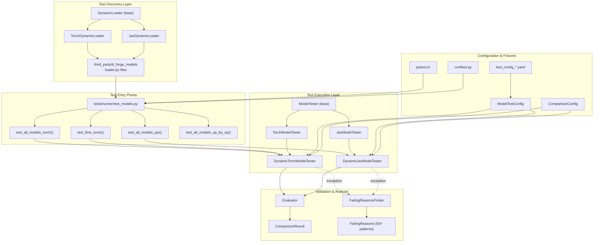
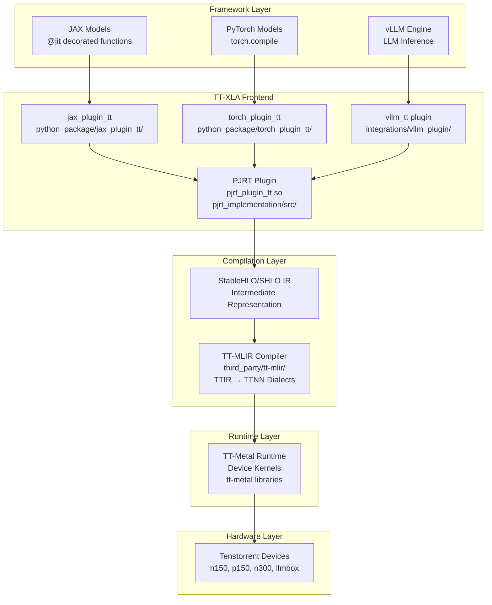
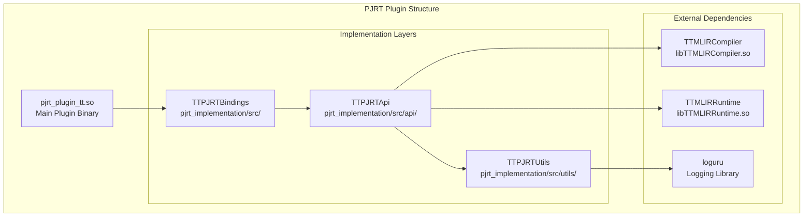
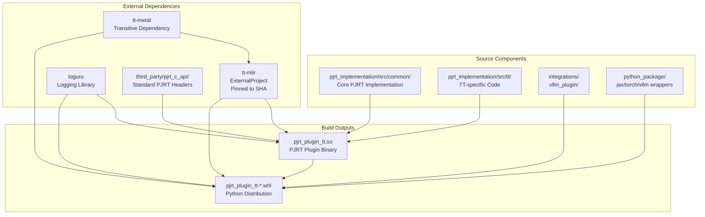
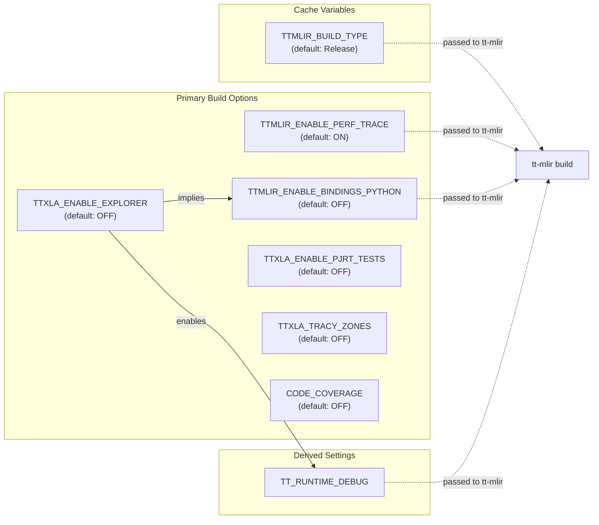
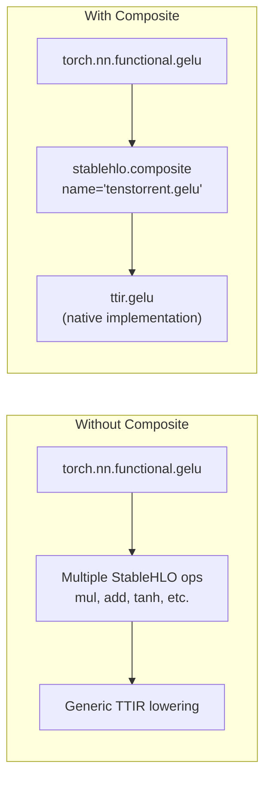
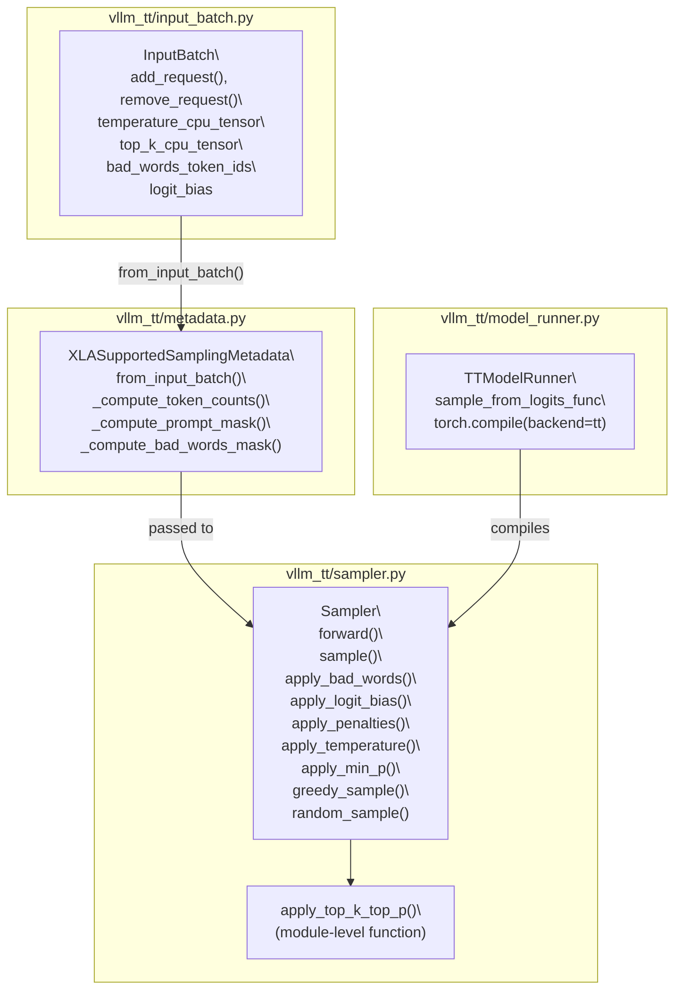
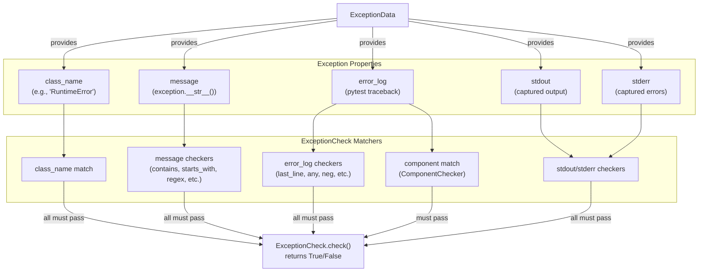
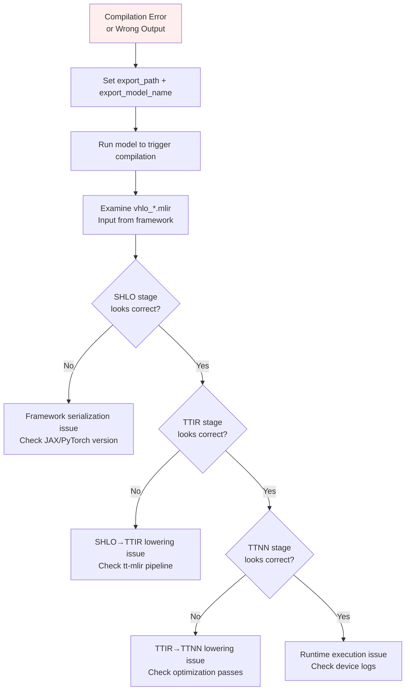

# System Architecture

Relevant source files
*   [.gitignore](https://github.com/tenstorrent/tt-xla/blob/c77995f6/.gitignore)
*   [CMakeLists.txt](https://github.com/tenstorrent/tt-xla/blob/c77995f6/CMakeLists.txt)
*   [README.md](https://github.com/tenstorrent/tt-xla/blob/c77995f6/README.md?plain=1)
*   [docs/src/getting_started.md](https://github.com/tenstorrent/tt-xla/blob/c77995f6/docs/src/getting_started.md?plain=1)
*   [docs/src/getting_started_build_from_source.md](https://github.com/tenstorrent/tt-xla/blob/c77995f6/docs/src/getting_started_build_from_source.md?plain=1)
*   [docs/src/getting_started_docker.md](https://github.com/tenstorrent/tt-xla/blob/c77995f6/docs/src/getting_started_docker.md?plain=1)
*   [docs/src/imgs/test_infra.png](https://github.com/tenstorrent/tt-xla/blob/c77995f6/docs/src/imgs/test_infra.png)
*   [docs/src/imgs/tt_smi.png](https://github.com/tenstorrent/tt-xla/blob/c77995f6/docs/src/imgs/tt_smi.png)
*   [docs/src/imgs/tt_xla_logo.png](https://github.com/tenstorrent/tt-xla/blob/c77995f6/docs/src/imgs/tt_xla_logo.png)
*   [docs/src/test_infra.md](https://github.com/tenstorrent/tt-xla/blob/c77995f6/docs/src/test_infra.md?plain=1)
*   [tests/filecheck/add.ttnn.mlir](https://github.com/tenstorrent/tt-xla/blob/c77995f6/tests/filecheck/add.ttnn.mlir)
*   [tests/filecheck/rms_norm.ttir.mlir](https://github.com/tenstorrent/tt-xla/blob/c77995f6/tests/filecheck/rms_norm.ttir.mlir)
*   [third_party/CMakeLists.txt](https://github.com/tenstorrent/tt-xla/blob/c77995f6/third_party/CMakeLists.txt)

## Purpose and Scope

This document provides a high-level overview of the TT-XLA system architecture, describing how the various components interact to enable running JAX, PyTorch, and vLLM models on Tenstorrent hardware. It covers the major architectural layers, data flow through the compilation pipeline, and the relationships between core components.

For detailed information about specific subsystems, see:

*   **Compilation Pipeline**: [4.1](https://deepwiki.com/tenstorrent/tt-xla/4.1-compilation-pipeline) - Detailed flow from framework code to device execution
*   **PJRT Plugin Implementation**: [4.2](https://deepwiki.com/tenstorrent/tt-xla/4.2-pjrt-plugin-system) - Technical details of the PJRT plugin interface
*   **Framework Integration**: [5](https://deepwiki.com/tenstorrent/tt-xla/5-framework-integration) - How JAX, PyTorch, and vLLM integrate with TT-XLA
*   **Build System**: [3](https://deepwiki.com/tenstorrent/tt-xla/3-build-system) - CMake configuration and dependency management

## Architectural Overview

TT-XLA serves as an integration layer between machine learning frameworks and Tenstorrent hardware, using the PJRT (Portable JAX Runtime) interface as the primary integration mechanism. The system transforms framework-specific computational graphs into optimized device code through a multi-stage compilation pipeline.

### High-Level Architecture


**Architecture Overview**: The test framework follows a layered architecture. At the top, `DynamicLoader` classes discover models from the `tt_forge_models` repository. Test entry points in `test_models.py` parametrize these models with run modes (inference/training) and parallelism modes (single-device/data-parallel/tensor-parallel). The execution layer uses framework-specific `ModelTester` subclasses to compile and run models on both CPU and TT hardware. Results flow through the validation layer (`Evaluator` and `ComparisonResult`) which applies PCC and ATOL thresholds. On failure, the `FailingReasonsFinder` classifies exceptions using 50+ predefined patterns.
```





**Sources:**[README.md 19](https://github.com/tenstorrent/tt-xla/blob/c77995f6/README.md?plain=1#L19-L19)[README.md 26-33](https://github.com/tenstorrent/tt-xla/blob/c77995f6/README.md?plain=1#L26-L33)[CMakeLists.txt 10-23](https://github.com/tenstorrent/tt-xla/blob/c77995f6/CMakeLists.txt#L10-L23)

## Core Components

### Framework Integration Layer

TT-XLA provides thin wrapper packages for each supported framework that set up the PJRT plugin and enable framework-specific tracing and compilation:

| Component | Location | Purpose |
| --- | --- | --- |
| `jax_plugin_tt` | [python_package/jax_plugin_tt/](https://github.com/tenstorrent/tt-xla/blob/c77995f6/python_package/jax_plugin_tt/) | Imports and configures PJRT plugin for JAX |
| `torch_plugin_tt` | [python_package/torch_plugin_tt/](https://github.com/tenstorrent/tt-xla/blob/c77995f6/python_package/torch_plugin_tt/) | Registers PJRT plugin as PyTorch XLA backend |
| `vllm_tt` | [integrations/vllm_plugin/](https://github.com/tenstorrent/tt-xla/blob/c77995f6/integrations/vllm_plugin/) | Integrates with vLLM's platform interface for LLM serving |

These plugins are packaged together in the Python wheel distribution alongside the core PJRT plugin binary.

**Sources:**[docs/src/getting_started_build_from_source.md 174-185](https://github.com/tenstorrent/tt-xla/blob/c77995f6/docs/src/getting_started_build_from_source.md?plain=1#L174-L185)

### PJRT Plugin (`pjrt_plugin_tt.so`)



**Key Responsibilities:**
- **Device Management**: Enumerates and manages Tenstorrent devices
- **Graph Compilation**: Accepts StableHLO graphs and invokes TT-MLIR compiler
- **Execution**: Schedules compiled programs on devices and manages buffers
- **Memory Management**: Allocates and tracks device memory
```


The PJRT plugin is the central integration point with an importance score of 462.77, making it the most critical component in the system. It implements the standard PJRT C API, providing a uniform device interface that frameworks can target without TT-specific modifications.

**Key Responsibilities:**

*   **Device Management**: Enumerates and manages Tenstorrent devices
*   **Graph Compilation**: Accepts StableHLO graphs and invokes TT-MLIR compiler
*   **Execution**: Schedules compiled programs on devices and manages buffers
*   **Memory Management**: Allocates and tracks device memory

**Sources:**[CMakeLists.txt 10-23](https://github.com/tenstorrent/tt-xla/blob/c77995f6/CMakeLists.txt#L10-L23)[pjrt_implementation/src/](https://github.com/tenstorrent/tt-xla/blob/c77995f6/pjrt_implementation/src/)

### Intermediate Representation Layer

TT-XLA uses StableHLO (Stable HLO) as the intermediate representation format between frameworks and the TT-MLIR compiler. StableHLO provides a stable, portable representation of ML operations that can be generated from multiple frameworks.

**Why StableHLO:**

*   Framework-agnostic representation
*   Well-defined semantics for ML operations
*   Versioned format with backward compatibility guarantees
*   Standard format supported by multiple compiler toolchains

**Sources:**[README.md 19](https://github.com/tenstorrent/tt-xla/blob/c77995f6/README.md?plain=1#L19-L19)[README.md 32](https://github.com/tenstorrent/tt-xla/blob/c77995f6/README.md?plain=1#L32-L32)

### TT-MLIR Compiler

TT-MLIR is an external dependency (built via CMake ExternalProject) that performs the core compilation from StableHLO to device-executable code. The compiler implements multiple dialect levels:

1.   **TTIR (Tenstorrent IR)**: High-level operations specific to TT hardware (e.g., `ttir.rms_norm`)
2.   **TTNN (Tenstorrent Neural Network)**: Lower-level operations mapping to device primitives (e.g., `ttnn.add`)
3.   **Code Generation**: Produces device kernels for TT-Metal runtime

**Configuration:**

The TT-MLIR dependency is configured in [third_party/CMakeLists.txt 47-84](https://github.com/tenstorrent/tt-xla/blob/c77995f6/third_party/CMakeLists.txt#L47-L84) with specific build options:

The version is pinned to a specific commit SHA to ensure reproducible builds: [third_party/CMakeLists.txt 8](https://github.com/tenstorrent/tt-xla/blob/c77995f6/third_party/CMakeLists.txt#L8-L8)

**Sources:**[third_party/CMakeLists.txt 33-96](https://github.com/tenstorrent/tt-xla/blob/c77995f6/third_party/CMakeLists.txt#L33-L96)[tests/filecheck/rms_norm.ttir.mlir 1-2](https://github.com/tenstorrent/tt-xla/blob/c77995f6/tests/filecheck/rms_norm.ttir.mlir#L1-L2)[tests/filecheck/add.ttnn.mlir 1-2](https://github.com/tenstorrent/tt-xla/blob/c77995f6/tests/filecheck/add.ttnn.mlir#L1-L2)

### TT-Metal Runtime

TT-Metal provides the low-level runtime services for executing compiled code on Tenstorrent devices. It is included as a transitive dependency through TT-MLIR and packaged in the final distribution.

**Runtime Services:**

*   Device initialization and configuration
*   Kernel loading and dispatch
*   Inter-chip communication (for multi-chip configurations)
*   Performance tracing and profiling

**Sources:**[third_party/CMakeLists.txt 38-39](https://github.com/tenstorrent/tt-xla/blob/c77995f6/third_party/CMakeLists.txt#L38-L39)

## Component Dependency Graph




The following diagram shows the build-time dependencies between major components:

**Sources:**[CMakeLists.txt 97-106](https://github.com/tenstorrent/tt-xla/blob/c77995f6/CMakeLists.txt#L97-L106)[third_party/CMakeLists.txt 29-132](https://github.com/tenstorrent/tt-xla/blob/c77995f6/third_party/CMakeLists.txt#L29-L132)[docs/src/getting_started_build_from_source.md 174-185](https://github.com/tenstorrent/tt-xla/blob/c77995f6/docs/src/getting_started_build_from_source.md?plain=1#L174-L185)

## System Boundaries and Interfaces

### PJRT C API Boundary

The PJRT C API ([third_party/pjrt_c_api/](https://github.com/tenstorrent/tt-xla/blob/c77995f6/third_party/pjrt_c_api/)) defines the primary interface boundary between framework-specific code and the TT-XLA plugin. This is a standardized interface that allows:

*   **Framework Independence**: Frameworks interact only with standard PJRT API, not TT-specific code
*   **Binary Compatibility**: Plugin can be loaded dynamically without recompiling frameworks
*   **Uniform Semantics**: Consistent behavior across different accelerator backends

**Key API Functions:**

*   `PJRT_Client_Create`: Initialize connection to TT devices
*   `PJRT_Compile`: Accept StableHLO and produce executable
*   `PJRT_Executable_Execute`: Run compiled program on device
*   `PJRT_Buffer_*`: Memory management operations

**Sources:**[third_party/CMakeLists.txt 31](https://github.com/tenstorrent/tt-xla/blob/c77995f6/third_party/CMakeLists.txt#L31-L31)

### Compiler Interface

The interface between PJRT plugin and TT-MLIR compiler consists of:

1.   **Input**: StableHLO MLIR module (serialized or in-memory)
2.   **Output**: Compiled executable with device kernels and metadata
3.   **Configuration**: Compilation options (optimization level, debugging, etc.)

The TT-MLIR libraries ([third_party/CMakeLists.txt 98-112](https://github.com/tenstorrent/tt-xla/blob/c77995f6/third_party/CMakeLists.txt#L98-L112)) expose APIs for:

*   `TTMLIRCompiler`: Compilation services
*   `TTMLIRRuntime`: Execution and memory management

**Sources:**[third_party/CMakeLists.txt 98-112](https://github.com/tenstorrent/tt-xla/blob/c77995f6/third_party/CMakeLists.txt#L98-L112)

### Runtime Interface

The TT-Metal runtime provides device services through its API, including:

*   Device enumeration and initialization via `tt-smi`-compatible interfaces
*   Kernel execution scheduling
*   Memory allocation and transfer
*   Multi-chip coordination (for n300, llmbox configurations)

**Sources:**[docs/src/getting_started.md 42-49](https://github.com/tenstorrent/tt-xla/blob/c77995f6/docs/src/getting_started.md?plain=1#L42-L49)

## Installation Structure

The final wheel package assembles all components into a cohesive installation:

```
pjrt_plugin_tt/                    # Main package
├── __init__.py
├── pjrt_plugin_tt.so              # Core PJRT plugin
├── lib/                           # Shared libraries
│   ├── libTTMLIRCompiler.so       # Compiler library
│   ├── libTTMLIRRuntime.so        # Runtime library
│   └── libloguru.so               # Logging library
└── tt-metal/                      # Runtime dependencies
    ├── kernels/                   # Device kernels
    └── runtime/                   # Metal runtime files

jax_plugin_tt/                     # JAX integration
└── __init__.py                    # Imports and configures PJRT

torch_plugin_tt/                   # PyTorch integration
└── __init__.py                    # Registers backend

vllm_tt/                           # vLLM integration (optional)
└── ...                            # Platform implementation
```

This structure allows the package to be pip-installed and used across different frameworks without conflicts.

**Sources:**[docs/src/getting_started_build_from_source.md 174-187](https://github.com/tenstorrent/tt-xla/blob/c77995f6/docs/src/getting_started_build_from_source.md?plain=1#L174-L187)

## Hardware Configuration

TT-XLA supports multiple Tenstorrent device configurations:

| Device | Description | Multi-Chip Support |
| --- | --- | --- |
| n150 | Single Wormhole chip | No |
| p150 | Single Wormhole chip | No |
| n300 | Dual Wormhole chips | Yes (tensor parallel) |
| llmbox | Multi-chip system | Yes (tensor/data parallel) |
| galaxy | Large-scale deployment | Yes (distributed) |

Device detection and initialization occurs through:

1.   Hardware configuration via TT-Installer
2.   Hugepages setup for efficient memory allocation
3.   Device enumeration through `tt-smi` utility

**Sources:**[docs/src/getting_started.md 25-49](https://github.com/tenstorrent/tt-xla/blob/c77995f6/docs/src/getting_started.md?plain=1#L25-L49)

## Configuration and Environment

The system behavior can be configured through environment variables:

| Variable | Purpose | Default |
| --- | --- | --- |
| `TTMLIR_TOOLCHAIN_DIR` | Path to TT-MLIR toolchain | (required) |
| `TTXLA_LOGGER_LEVEL` | Logging verbosity | INFO |
| `TT_METAL_RUNTIME_ROOT` | Metal runtime location | (auto-detected) |

Build-time configuration options in [CMakeLists.txt 46-63](https://github.com/tenstorrent/tt-xla/blob/c77995f6/CMakeLists.txt#L46-L63):

*   `TTMLIR_ENABLE_PERF_TRACE`: Enable performance tracing
*   `TTXLA_ENABLE_EXPLORER`: Enable TT-MLIR Explorer tool
*   `TTXLA_ENABLE_PJRT_TESTS`: Build PJRT unit tests
*   `TTXLA_TRACY_ZONES`: Enable Tracy profiling zones

**Sources:**[CMakeLists.txt 46-63](https://github.com/tenstorrent/tt-xla/blob/c77995f6/CMakeLists.txt#L46-L63)[docs/src/getting_started_build_from_source.md 123](https://github.com/tenstorrent/tt-xla/blob/c77995f6/docs/src/getting_started_build_from_source.md?plain=1#L123-L123)

## Summary

The TT-XLA system architecture is organized in clean layers with well-defined interfaces:

1.   **Framework Layer**: JAX, PyTorch, vLLM provide models
2.   **Plugin Layer**: Thin wrappers configure PJRT plugin for each framework
3.   **PJRT Layer**: Standard interface implements compilation and execution
4.   **Compiler Layer**: TT-MLIR transforms StableHLO to device code
5.   **Runtime Layer**: TT-Metal executes kernels on hardware
6.   **Hardware Layer**: Tenstorrent accelerators perform computation

The PJRT plugin serves as the central integration point, decoupling framework-specific concerns from device-specific compilation and execution. This architecture enables adding new frameworks or new Tenstorrent hardware generations without requiring changes throughout the stack.

**Sources:**[README.md 18-33](https://github.com/tenstorrent/tt-xla/blob/c77995f6/README.md?plain=1#L18-L33)[CMakeLists.txt 10-23](https://github.com/tenstorrent/tt-xla/blob/c77995f6/CMakeLists.txt#L10-L23)

Dismiss
Refresh this wiki

Enter email to refresh

## Additional Diagrams


### Build Options and Configuration Variables




**Diagram: Build Configuration Options and Dependencies**
```


#### Purpose and Mechanism




**Diagram: Composite operations enable native TT-MLIR implementations**

Sources: [python_package/tt_torch/composite_ops.py:1-25]()
```


### Code Entity Map




Sources: [integrations/vllm_plugin/vllm_tt/input_batch.py:24-210](), [integrations/vllm_plugin/vllm_tt/metadata.py:24-328](), [integrations/vllm_plugin/vllm_tt/sampler.py:14-244](), [integrations/vllm_plugin/vllm_tt/model_runner.py:438-446]()
2b:T870b,
```


#### Exception-Based Detection





#### Debugging a Compilation Issue




**Workflow Example**:

1. **Enable IR Export**:
```python
torch_xla.set_custom_compile_options({
    "export_path": "./debug",
    "export_model_name": "problematic_model",
})
```

2. **Trigger Compilation**:
```python
output = model(input)
torch_xla.sync()
```

3. **Examine Generated IRs**:
```bash
ls debug/irs/
```

