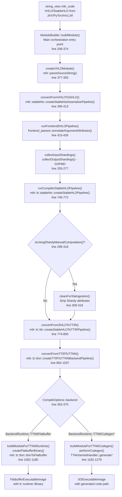
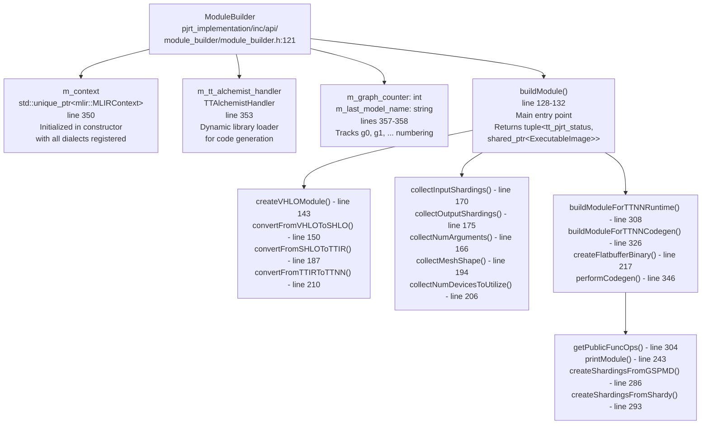
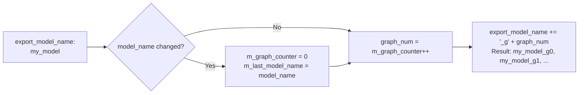
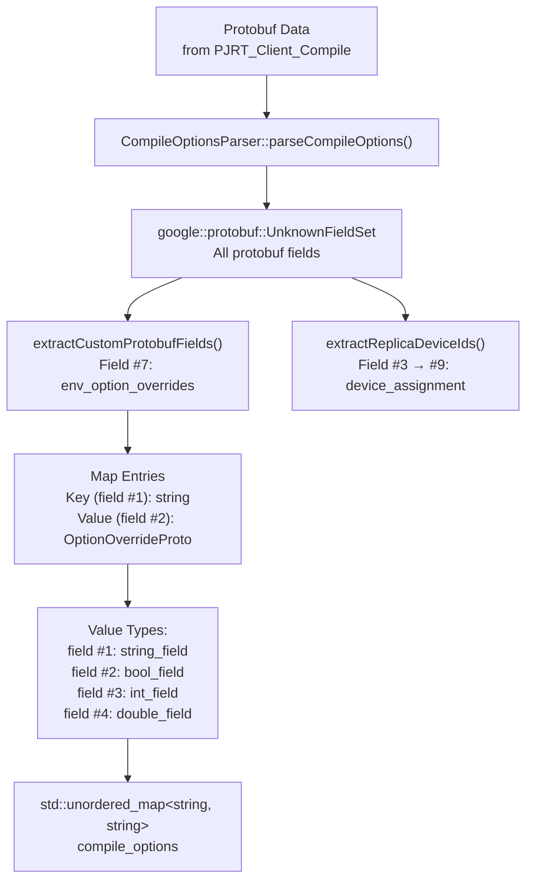
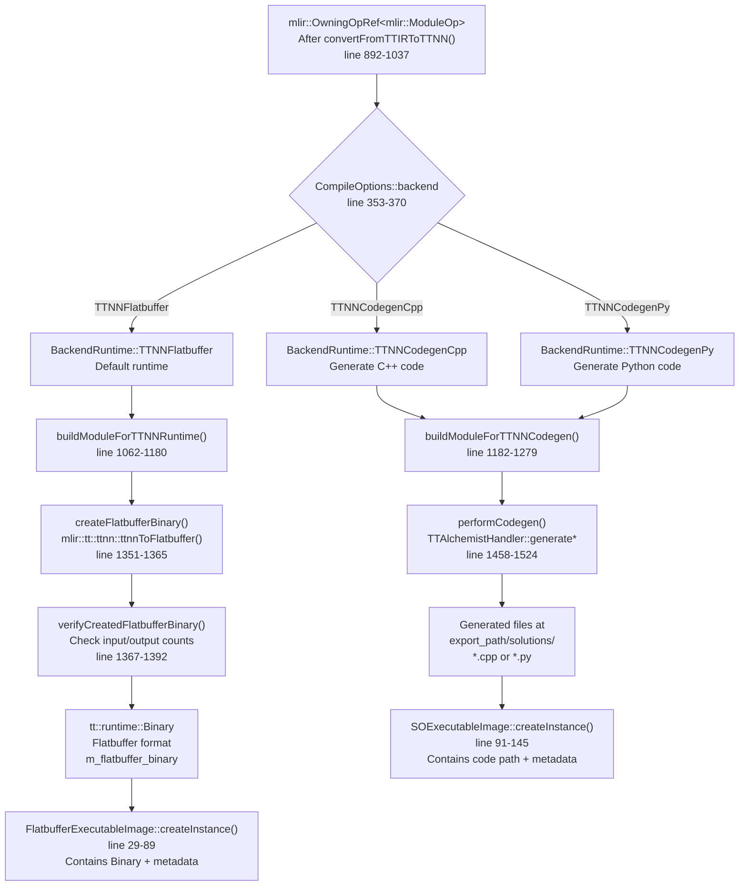
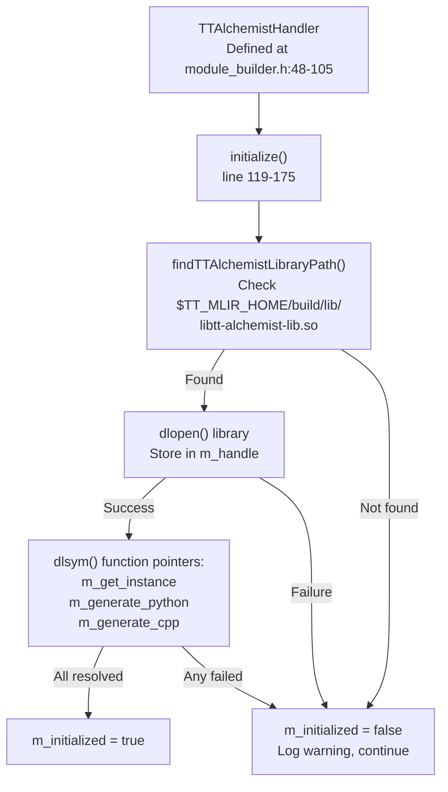
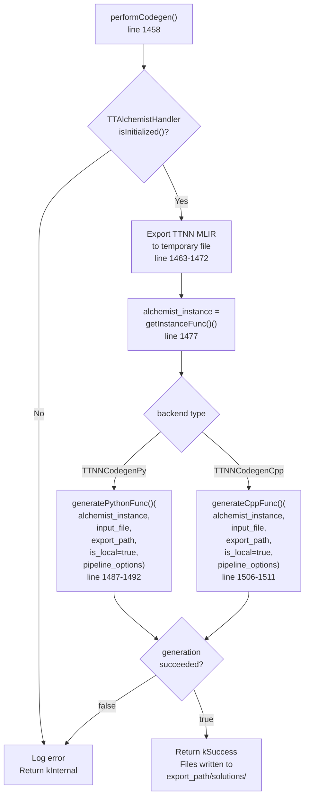
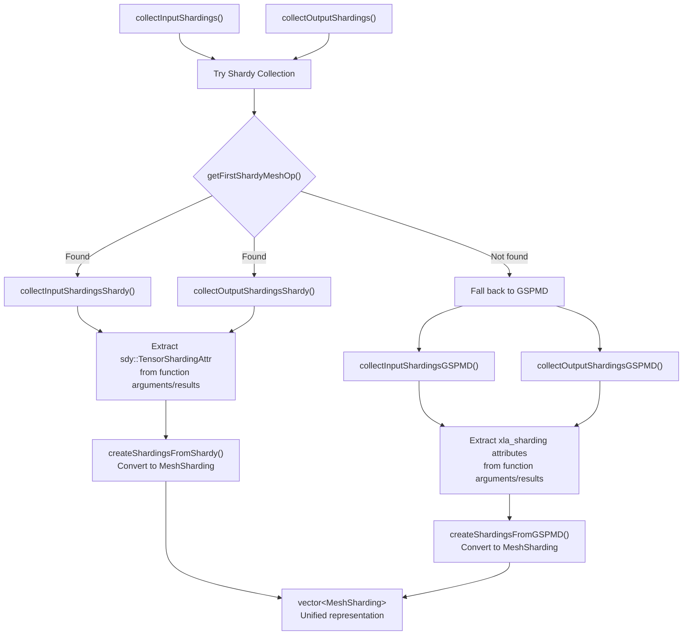
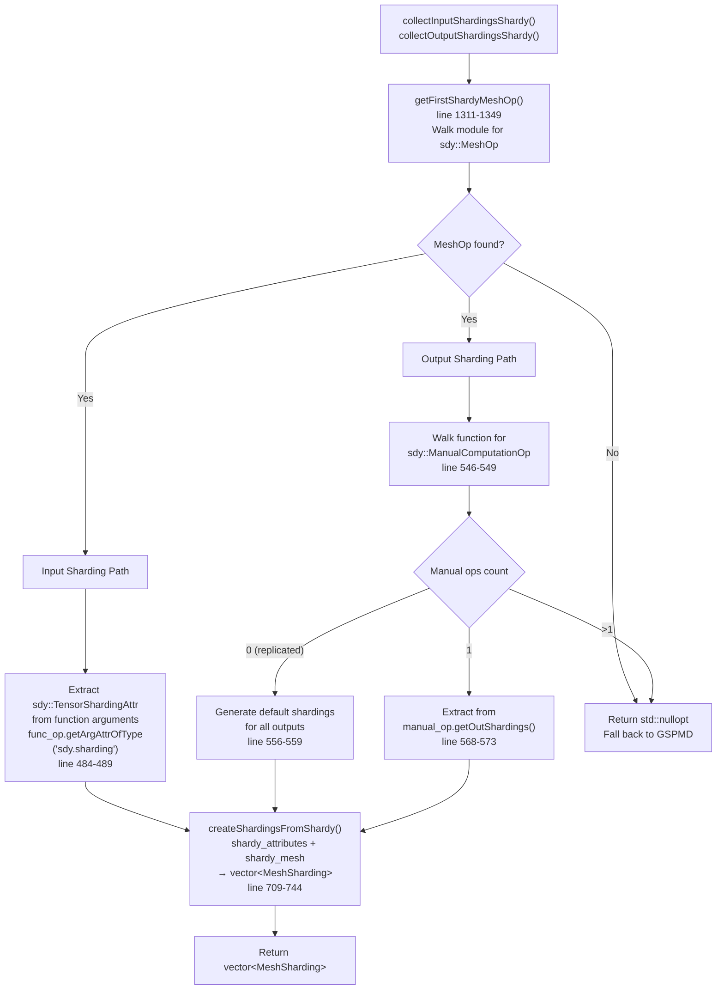

# MLIR Compilation Pipeline

Relevant source files
*   [.gitignore](https://github.com/tenstorrent/tt-xla/blob/c77995f6/.gitignore)
*   [README.md](https://github.com/tenstorrent/tt-xla/blob/c77995f6/README.md?plain=1)
*   [docs/src/getting_started.md](https://github.com/tenstorrent/tt-xla/blob/c77995f6/docs/src/getting_started.md?plain=1)
*   [docs/src/getting_started_build_from_source.md](https://github.com/tenstorrent/tt-xla/blob/c77995f6/docs/src/getting_started_build_from_source.md?plain=1)
*   [docs/src/getting_started_docker.md](https://github.com/tenstorrent/tt-xla/blob/c77995f6/docs/src/getting_started_docker.md?plain=1)
*   [docs/src/imgs/test_infra.png](https://github.com/tenstorrent/tt-xla/blob/c77995f6/docs/src/imgs/test_infra.png)
*   [docs/src/imgs/tt_smi.png](https://github.com/tenstorrent/tt-xla/blob/c77995f6/docs/src/imgs/tt_smi.png)
*   [docs/src/imgs/tt_xla_logo.png](https://github.com/tenstorrent/tt-xla/blob/c77995f6/docs/src/imgs/tt_xla_logo.png)
*   [docs/src/test_infra.md](https://github.com/tenstorrent/tt-xla/blob/c77995f6/docs/src/test_infra.md?plain=1)
*   [python_package/jax_plugin_tt/__init__.py](https://github.com/tenstorrent/tt-xla/blob/c77995f6/python_package/jax_plugin_tt/__init__.py)
*   [python_package/pjrt_plugin_tt/__init__.py](https://github.com/tenstorrent/tt-xla/blob/c77995f6/python_package/pjrt_plugin_tt/__init__.py)
*   [python_package/torch_plugin_tt/__init__.py](https://github.com/tenstorrent/tt-xla/blob/c77995f6/python_package/torch_plugin_tt/__init__.py)
*   [python_package/tt_torch/backend/backend.py](https://github.com/tenstorrent/tt-xla/blob/c77995f6/python_package/tt_torch/backend/backend.py)
*   [python_package/tt_torch/backend/metadata_propagation.py](https://github.com/tenstorrent/tt-xla/blob/c77995f6/python_package/tt_torch/backend/metadata_propagation.py)
*   [python_package/tt_torch/backend/passes.py](https://github.com/tenstorrent/tt-xla/blob/c77995f6/python_package/tt_torch/backend/passes.py)
*   [python_package/tt_torch/composite_ops.py](https://github.com/tenstorrent/tt-xla/blob/c77995f6/python_package/tt_torch/composite_ops.py)
*   [python_package/tt_torch/fusion_providers.py](https://github.com/tenstorrent/tt-xla/blob/c77995f6/python_package/tt_torch/fusion_providers.py)
*   [python_package/ttxla_tools/logging.py](https://github.com/tenstorrent/tt-xla/blob/c77995f6/python_package/ttxla_tools/logging.py)
*   [tests/filecheck/add.ttnn.mlir](https://github.com/tenstorrent/tt-xla/blob/c77995f6/tests/filecheck/add.ttnn.mlir)
*   [tests/filecheck/rms_norm.ttir.mlir](https://github.com/tenstorrent/tt-xla/blob/c77995f6/tests/filecheck/rms_norm.ttir.mlir)
*   [tests/infra/utilities/torch_multichip_utils.py](https://github.com/tenstorrent/tt-xla/blob/c77995f6/tests/infra/utilities/torch_multichip_utils.py)
*   [tests/torch/multi_host/__init__.py](https://github.com/tenstorrent/tt-xla/blob/c77995f6/tests/torch/multi_host/__init__.py)
*   [tests/torch/multi_host/llmbox/__init__.py](https://github.com/tenstorrent/tt-xla/blob/c77995f6/tests/torch/multi_host/llmbox/__init__.py)
*   [tests/torch/ops/test_fusion_ops.py](https://github.com/tenstorrent/tt-xla/blob/c77995f6/tests/torch/ops/test_fusion_ops.py)

## Purpose and Scope

This document describes the MLIR compilation pipeline in TT-XLA, which transforms high-level ML framework representations into executable code for Tenstorrent hardware. The pipeline is orchestrated by the `ModuleBuilder` class and performs a series of dialect transformations: VHLO → SHLO → TTIR → TTNN.

For information about how this pipeline is invoked through the PJRT API, see [PJRT Plugin System](https://deepwiki.com/tenstorrent/tt-xla/3.1-cmake-configuration-and-external-dependencies). For details on how sharding attributes are processed during multi-device execution, see [Sharding and Multi-Device Execution](https://deepwiki.com/tenstorrent/tt-xla/3.3-docker-build-infrastructure).

Sources: [pjrt_implementation/inc/api/module_builder/module_builder.h 1-363](https://github.com/tenstorrent/tt-xla/blob/c77995f6/pjrt_implementation/inc/api/module_builder/module_builder.h#L1-L363)

## Pipeline Architecture

The compilation pipeline operates as a multi-stage transformation process, with each stage converting MLIR from one dialect to another until producing the final backend output. The entire flow is orchestrated by `ModuleBuilder::buildModule()` at [pjrt_implementation/src/api/module_builder/module_builder.cc 208-374](https://github.com/tenstorrent/tt-xla/blob/c77995f6/pjrt_implementation/src/api/module_builder/module_builder.cc#L208-L374)

**High-Level Pipeline Flow**

**Key Pipeline Stages:**

| Stage | Input Dialect | Output Dialect | Function | Lines | Purpose |
| --- | --- | --- | --- | --- | --- |
| Parse | Text MLIR | VHLO | `createVHLOModule()` | 377-393 | Parse versioned HLO with `mlir::parseSourceString()` |
| VHLO→SHLO | VHLO | StableHLO | `convertFromVHLOToSHLO()` | 395-413 | Deserialize with `createStablehloDeserializePipeline()` |
| Frontend | StableHLO | StableHLO | `runFrontendSHLOPipeline()` | 415-426 | Annotate arguments with `annotateArgumentAttributes()` |
| Sharding | StableHLO | StableHLO | `collectInputShardings()` `collectOutputShardings()` | 437-584 | Extract GSPMD/Shardy sharding metadata |
| Compiler | StableHLO | StableHLO | `runCompilerStableHLOPipeline()` | 746-772 | Run `createStableHLOPipeline()` for optimizations |
| XLA Clean | StableHLO | StableHLO | `cleanForXlaIngestion()` | 309-318 | Strip Shardy attributes (if used) |
| SHLO→TTIR | StableHLO | TTIR | `convertFromSHLOToTTIR()` | 774-800 | Convert with `createStableHLOToTTIRPipeline()` |
| TTIR→TTNN | TTIR | TTNN | `convertFromTTIRToTTNN()` | 892-1037 | Lower with `createTTIRToTTNNBackendPipeline()` |
| Backend | TTNN | Binary/Code | `buildModuleForTTNNRuntime()` or `buildModuleForTTNNCodegen()` | 1062-1279 | Generate flatbuffer via `ttnnToFlatbuffer()` or code via `TTAlchemistHandler` |

Sources: [pjrt_implementation/src/api/module_builder/module_builder.cc 208-1279](https://github.com/tenstorrent/tt-xla/blob/c77995f6/pjrt_implementation/src/api/module_builder/module_builder.cc#L208-L1279)




**Key Pipeline Stages:**

| Stage | Input Dialect | Output Dialect | Function | Lines | Purpose |
|-------|--------------|----------------|----------|-------|---------|
| Parse | Text MLIR | VHLO | `createVHLOModule()` | 377-393 | Parse versioned HLO with `mlir::parseSourceString()` |
| VHLO→SHLO | VHLO | StableHLO | `convertFromVHLOToSHLO()` | 395-413 | Deserialize with `createStablehloDeserializePipeline()` |
| Frontend | StableHLO | StableHLO | `runFrontendSHLOPipeline()` | 415-426 | Annotate arguments with `annotateArgumentAttributes()` |
| Sharding | StableHLO | StableHLO | `collectInputShardings()`<br/>`collectOutputShardings()` | 437-584 | Extract GSPMD/Shardy sharding metadata |
| Compiler | StableHLO | StableHLO | `runCompilerStableHLOPipeline()` | 746-772 | Run `createStableHLOPipeline()` for optimizations |
| XLA Clean | StableHLO | StableHLO | `cleanForXlaIngestion()` | 309-318 | Strip Shardy attributes (if used) |
| SHLO→TTIR | StableHLO | TTIR | `convertFromSHLOToTTIR()` | 774-800 | Convert with `createStableHLOToTTIRPipeline()` |
| TTIR→TTNN | TTIR | TTNN | `convertFromTTIRToTTNN()` | 892-1037 | Lower with `createTTIRToTTNNBackendPipeline()` |
| Backend | TTNN | Binary/Code | `buildModuleForTTNNRuntime()`<br/>or `buildModuleForTTNNCodegen()` | 1062-1279 | Generate flatbuffer via `ttnnToFlatbuffer()` or code via `TTAlchemistHandler` |

Sources: [pjrt_implementation/src/api/module_builder/module_builder.cc:208-1279]()
```
## ModuleBuilder Orchestration

The `ModuleBuilder` class is the central orchestrator for the compilation pipeline. It maintains the MLIR context, coordinates dialect transformations, and manages compilation options.

### Class Structure

The `ModuleBuilder` class (defined at [pjrt_implementation/inc/api/module_builder/module_builder.h 121-359](https://github.com/tenstorrent/tt-xla/blob/c77995f6/pjrt_implementation/inc/api/module_builder/module_builder.h#L121-L359)) manages the entire compilation pipeline:



### Graph Counter System

The `ModuleBuilder` tracks multiple graph compilations within a single model run using a graph counter that appends `_g0`, `_g1`, etc. to exported filenames:

This mechanism allows tracking multiple graphs in a single execution (e.g., forward pass as `g0`, backward pass as `g1`):

Sources: [pjrt_implementation/src/api/module_builder/module_builder.cc 222-229](https://github.com/tenstorrent/tt-xla/blob/c77995f6/pjrt_implementation/src/api/module_builder/module_builder.cc#L222-L229)[pjrt_implementation/inc/api/module_builder/module_builder.h 356-358](https://github.com/tenstorrent/tt-xla/blob/c77995f6/pjrt_implementation/inc/api/module_builder/module_builder.h#L356-L358)




This mechanism allows tracking multiple graphs in a single execution (e.g., forward pass as `g0`, backward pass as `g1`):

Sources: [pjrt_implementation/src/api/module_builder/module_builder.cc:222-229](), [pjrt_implementation/inc/api/module_builder/module_builder.h:356-358]()
```
### Initialization

The `ModuleBuilder` constructor at [pjrt_implementation/src/api/module_builder/module_builder.cc 177-206](https://github.com/tenstorrent/tt-xla/blob/c77995f6/pjrt_implementation/src/api/module_builder/module_builder.cc#L177-L206) registers all required MLIR dialects and passes:

**Dialect Registration (lines 180-189):**

```
registry.insert<mlir::arith::ArithDialect>()        // Arithmetic operations
registry.insert<mlir::func::FuncDialect>()          // Function definitions  
registry.insert<mlir::ml_program::MLProgramDialect>() // ML program constructs
registry.insert<mlir::shape::ShapeDialect>()        // Shape operations

mlir::tt::registerAllDialects(registry)             // TTIR, TTNN, TTCore dialects
mlir::stablehlo::registerAllDialects(registry)      // StableHLO dialect
mlir::sdy::registerAllDialects(registry)            // Shardy sharding dialect
```

**Extension and Pass Registration (lines 191-195):**

```
mlir::func::registerAllExtensions(registry)
mlir::tt::registerAllExtensions(registry)
mlir::tt::ttir::registerPasses()                    // TTIR transformation passes
mlir::tt::ttnn::registerPasses()                    // TTNN optimization passes
```

**Unregistered Dialect Handling (lines 197-201):**

```
m_context->allowUnregisteredDialects()
```

This is required because Shardy uses MHLO dialect attributes from OpenXLA that are not registered in TT-XLA's context. See issue [#355](https://github.com/tenstorrent/tt-xla/blob/c77995f6/#355)

**TTAlchemist Initialization (line 205):**

```
m_tt_alchemist_handler.initialize()
```

Attempts to dynamically load the TTAlchemist code generation library. This operation is fallible and logs a warning if the library is not found.

Sources: [pjrt_implementation/src/api/module_builder/module_builder.cc 177-206](https://github.com/tenstorrent/tt-xla/blob/c77995f6/pjrt_implementation/src/api/module_builder/module_builder.cc#L177-L206)

## Dialect Transformations

### Stage 1: VHLO Parsing

The `createVHLOModule()` method parses the input MLIR text into a VHLO (Versioned HLO) module:

`mlir::OwningOpRef<mlir::ModuleOp> vhlo_module =     mlir::parseSourceString<mlir::ModuleOp>(        llvm::StringRef(mlir_code.data(), mlir_code.size()),        mlir::ParserConfig{m_context.get(), /*verifyAfterParse=*/true});`
If `export_path` is set, the module is printed to disk with the stage name `"vhlo"` and optional model name.

Sources: [pjrt_implementation/src/api/module_builder/module_builder.cc 376-393](https://github.com/tenstorrent/tt-xla/blob/c77995f6/pjrt_implementation/src/api/module_builder/module_builder.cc#L376-L393)

### Stage 2: VHLO → StableHLO Deserialization

The `convertFromVHLOToSHLO()` method uses StableHLO's deserialization pipeline to convert versioned HLO to the stable representation:

`mlir::PassManager vhlo_to_shlo_pm(mlir_module.get()->getName());mlir::stablehlo::createStablehloDeserializePipeline(vhlo_to_shlo_pm);`
The output is exported as `"shlo"` stage if export is enabled.

Sources: [pjrt_implementation/src/api/module_builder/module_builder.cc 395-413](https://github.com/tenstorrent/tt-xla/blob/c77995f6/pjrt_implementation/src/api/module_builder/module_builder.cc#L395-L413)

### Stage 3: Frontend StableHLO Pipeline

The `runFrontendSHLOPipeline()` applies frontend-specific passes to annotate the StableHLO module:

*   `frontend_passes::annotateArgumentAttributes()` - Adds input/output role annotations
*   Exported as `"shlo_frontend"` stage

These passes prepare the module for subsequent compiler transformations by adding metadata about tensor roles.

Sources: [pjrt_implementation/src/api/module_builder/module_builder.cc 415-426](https://github.com/tenstorrent/tt-xla/blob/c77995f6/pjrt_implementation/src/api/module_builder/module_builder.cc#L415-L426)

### Stage 4: Compiler StableHLO Pipeline

The `runCompilerStableHLOPipeline()` applies TT-MLIR's StableHLO optimization pipeline:

`mlir::PassManager stablehlo_pipeline_pm(mlir_module.get()->getName(),                                        mlir::PassManager::Nesting::Implicit);mlir::tt::stablehlo::StableHLOPipelineOptions stablehlo_pipeline_options;mlir::tt::stablehlo::createStableHLOPipeline(stablehlo_pipeline_pm,                                             stablehlo_pipeline_options);`
This pipeline handles:

*   GSPMD sharding propagation
*   Shardy mesh processing
*   Graph optimizations

After the pipeline, `frontend_passes::setProperSdyMeshAttributeInSpmdMode()` ensures Shardy mesh attributes are correctly set for SPMD mode.

The output is exported as `"shlo_compiler"` stage. For Shardy-based graphs, an additional cleaned version is exported as `"shlo_compiler_cleaned"` after running `frontend_passes::cleanForXlaIngestion()` to sanitize the module for potential XLA ingestion.

Sources: [pjrt_implementation/src/api/module_builder/module_builder.cc 746-772](https://github.com/tenstorrent/tt-xla/blob/c77995f6/pjrt_implementation/src/api/module_builder/module_builder.cc#L746-L772)[pjrt_implementation/src/api/module_builder/module_builder.cc 289-318](https://github.com/tenstorrent/tt-xla/blob/c77995f6/pjrt_implementation/src/api/module_builder/module_builder.cc#L289-L318)

### Stage 5: StableHLO → TTIR

The `convertFromSHLOToTTIR()` method converts StableHLO operations to TT Intermediate Representation:

`mlir::PassManager shlo_to_ttir_pm(mlir_module.get()->getName(),                                  mlir::PassManager::Nesting::Implicit); mlir::tt::ttir::StableHLOToTTIRPipelineOptions shlo_options;shlo_options.arithDialectConversionsEnabled = true;shlo_options.legalizeCompositeToCallEnabled = true;mlir::tt::ttir::createStableHLOToTTIRPipeline(shlo_to_ttir_pm, shlo_options);`
The pipeline uses implicit nesting to handle `stablehlo.composite` to `func.call` conversions. The output is exported as `"ttir"` stage.

Sources: [pjrt_implementation/src/api/module_builder/module_builder.cc 774-800](https://github.com/tenstorrent/tt-xla/blob/c77995f6/pjrt_implementation/src/api/module_builder/module_builder.cc#L774-L800)

### Stage 6: TTIR → TTNN

The `convertFromTTIRToTTNN()` method performs the final lowering to TTNN (TT Neural Network) operations:

`mlir::tt::ttnn::TTIRToTTNNBackendPipelineOptions options; // Configure optimization leveloptions.optimizationLevel = compile_options.optimization_level; // Configure data type conversionsoptions.enableBfp8Conversion = compile_options.enable_bfp8_conversion;options.experimentalBfp8Weights =     compile_options.experimental_enable_weight_bfp8_conversion; // Configure compute kernel settingsoptions.computeCfgMathFidelity = math_fidelity;options.computeCfgFp32DestAccEn = fp32_dest_acc_en; // Configure optimizations and featuresoptions.enableFusingConv2dWithMultiplyPattern = ...;options.enablePermuteMatmulFusion = ...;options.enableTrace = compile_options.enable_trace;options.enableConstEval = compile_options.enable_const_eval; // Set mesh shape and device pointer for optimizeroptions.meshShape = {devices_mesh_shape[0], devices_mesh_shape[1]};if (compile_options.optimization_level >= 1) {    options.devicePtr = client_instance->getOrCreateOptimizerSubmesh(...);} mlir::tt::ttnn::createTTIRToTTNNBackendPipeline(ttir_to_ttnn_pm, options);`
**Key Configuration Options:**

| Option | Purpose | When Used |
| --- | --- | --- |
| `optimizationLevel` | Controls optimization passes (0, 1, or 2) | Always |
| `enableBfp8Conversion` | Converts graph to BFP8 format | When precision reduction desired |
| `computeCfgMathFidelity` | Sets math precision (LoFi, HiFi2-4, or default) | When overriding defaults |
| `computeCfgFp32DestAccEn` | Enables FP32 destination accumulation | When higher precision needed |
| `enableTrace` | Hoists traces for performance | When reducing host overhead |
| `enableConstEval` | Pre-computes constant subgraphs | Usually enabled (default: true) |
| `devicePtr` | Provides device for optimizer passes | When optimization_level ≥ 1 |
| `ttnnPerfMetricsEnabled` | Collects performance metrics | When profiling |

The output is exported as `"ttnn"` stage. After this stage, the optimizer submesh is closed since compilation is complete.

Sources: [pjrt_implementation/src/api/module_builder/module_builder.cc 892-1037](https://github.com/tenstorrent/tt-xla/blob/c77995f6/pjrt_implementation/src/api/module_builder/module_builder.cc#L892-L1037)

## Compilation Options

### CompileOptions Structure

The `CompileOptions` struct encapsulates all compilation configuration:

Sources: [pjrt_implementation/inc/api/compile_options.h 27-124](https://github.com/tenstorrent/tt-xla/blob/c77995f6/pjrt_implementation/inc/api/compile_options.h#L27-L124)

```mermaid
graph TB
    CompileOptions["CompileOptions"]
    
    Optimization["optimization_level: int<br/>0 = none, 1 = basic, 2 = advanced"]
    
    DataType["Data Type Options:<br/>enable_bfp8_conversion: bool<br/>experimental_enable_weight_bfp8_conversion: bool"]
    
    ComputeKernel["Compute Kernel Config:<br/>math_fidelity: optional&lt;string&gt;<br/>fp32_dest_acc_en: optional&lt;bool&gt;"]
    
    Optimizations["Optimization Flags:<br/>experimental_enable_fusing_conv2d_with_multiply_pattern<br/>experimental_enable_permute_matmul_fusion<br/>enable_const_eval"]
    
    Backend["backend: BackendRuntime<br/>TTNNFlatbuffer | TTNNCodegenCpp | TTNNCodegenPy"]
    
    Performance["Performance:<br/>enable_trace: bool<br/>ttnn_perf_metrics_enabled: bool<br/>ttnn_perf_metrics_output_file: string"]
    
    Export["Export Options:<br/>export_path: optional&lt;string&gt;<br/>export_model_name: string<br/>export_tensors: bool<br/>codegen_try_recover_structure: bool"]
    
    CompileOptions --> Optimization
    CompileOptions --> DataType
    CompileOptions --> ComputeKernel
    CompileOptions --> Optimizations
    CompileOptions --> Backend
    CompileOptions --> Performance
    CompileOptions --> Export
```




Sources: [pjrt_implementation/inc/api/compile_options.h:27-124]()
```
### Optimization Levels

The `optimization_level` controls multiple MLIR optimizer passes:

**Level 0 (Default):** All optimizer passes disabled

*   No consteval preparation
*   No memory layout optimizations
*   No op-level validation

**Level 1 (Basic):**

*   Consteval preparation for Conv2d weights
*   Removes some operation workarounds
*   Enables Conv2d + multiply fusing
*   Op-level validation for inputs/outputs

**Level 2 (Advanced):**

*   All Level 1 optimizations
*   Memory layout optimizations (sharding)

**Note:** Optimizer passes are not supported in distributed runtime. The pipeline checks this constraint and returns an error if `optimization_level > 0` with distributed runtime.

Sources: [pjrt_implementation/src/api/module_builder/module_builder.cc 905-910](https://github.com/tenstorrent/tt-xla/blob/c77995f6/pjrt_implementation/src/api/module_builder/module_builder.cc#L905-L910)[tests/infra/testers/compiler_config.py 18-28](https://github.com/tenstorrent/tt-xla/blob/c77995f6/tests/infra/testers/compiler_config.py#L18-L28)

### Math Fidelity Configuration

The `math_fidelity` option (defined at [pjrt_implementation/inc/api/compile_options.h 48-54](https://github.com/tenstorrent/tt-xla/blob/c77995f6/pjrt_implementation/inc/api/compile_options.h#L48-L54)) overrides math precision for all TTNN operations with compute kernel config:

| String Value | Enum Value | Description | Use Case |
| --- | --- | --- | --- |
| `"lofi"` | `OptionalMathFidelity::LoFi` | Low fidelity | Maximum performance, lower accuracy |
| `"hifi2"` | `OptionalMathFidelity::HiFi2` | High fidelity level 2 | Balanced performance/accuracy |
| `"hifi3"` | `OptionalMathFidelity::HiFi3` | High fidelity level 3 | Higher accuracy |
| `"hifi4"` | `OptionalMathFidelity::HiFi4` | High fidelity level 4 | Maximum accuracy |
| `"ttnn_default"` | `OptionalMathFidelity::Undefined` | Let TTNN decide | Uses TTNN's operation-specific logic |
| `std::nullopt` | (not set) | MLIR default | Currently HiFi4 for all operations |

**Parsing and Conversion:**

The string value is parsed by `CompileOptionsParser::parseMathFidelity()` at [pjrt_implementation/src/api/compile_options_parser.cc 299-320](https://github.com/tenstorrent/tt-xla/blob/c77995f6/pjrt_implementation/src/api/compile_options_parser.cc#L299-L320) which converts it to the `mlir::tt::ttnn::OptionalMathFidelity` enum.

**Application in Pipeline:**

At [pjrt_implementation/src/api/module_builder/module_builder.cc 918-926](https://github.com/tenstorrent/tt-xla/blob/c77995f6/pjrt_implementation/src/api/module_builder/module_builder.cc#L918-L926) the math fidelity is applied to the TTNN backend pipeline options:

```
mlir::tt::ttnn::OptionalMathFidelity math_fidelity;
CompileOptionsParser::parseMathFidelity(
    compile_options.math_fidelity.value(), math_fidelity);
options.computeCfgMathFidelity = math_fidelity;
```

Sources: [pjrt_implementation/inc/api/compile_options.h 48-54](https://github.com/tenstorrent/tt-xla/blob/c77995f6/pjrt_implementation/inc/api/compile_options.h#L48-L54)[pjrt_implementation/src/api/compile_options_parser.cc 299-320](https://github.com/tenstorrent/tt-xla/blob/c77995f6/pjrt_implementation/src/api/compile_options_parser.cc#L299-L320)[pjrt_implementation/src/api/module_builder/module_builder.cc 918-926](https://github.com/tenstorrent/tt-xla/blob/c77995f6/pjrt_implementation/src/api/module_builder/module_builder.cc#L918-L926)

### Parsing from Protobuf

The `CompileOptionsParser` extracts custom options from PJRT's protobuf CompileOptions:

**Protobuf Field Numbers:**

*   Field 7: `env_option_overrides` (map<string, OptionOverrideProto>) 
    *   Map entry field 1: key (string)
    *   Map entry field 2: value (OptionOverrideProto) 
        *   Value field 1: `string_field`
        *   Value field 2: `bool_field`
        *   Value field 3: `int_field`
        *   Value field 4: `double_field`

Sources: [pjrt_implementation/src/api/compile_options_parser.cc 175-297](https://github.com/tenstorrent/tt-xla/blob/c77995f6/pjrt_implementation/src/api/compile_options_parser.cc#L175-L297)[pjrt_implementation/inc/api/compile_options_parser.h 34-87](https://github.com/tenstorrent/tt-xla/blob/c77995f6/pjrt_implementation/inc/api/compile_options_parser.h#L34-L87)




**Protobuf Field Numbers:**
- Field 7: `env_option_overrides` (map<string, OptionOverrideProto>)
  - Map entry field 1: key (string)
  - Map entry field 2: value (OptionOverrideProto)
    - Value field 1: `string_field`
    - Value field 2: `bool_field`
    - Value field 3: `int_field`
    - Value field 4: `double_field`

Sources: [pjrt_implementation/src/api/compile_options_parser.cc:175-297](), [pjrt_implementation/inc/api/compile_options_parser.h:34-87]()
```
### Python Configuration

The `CompilerConfig` Python class provides a type-safe interface for setting options from JAX or PyTorch:

`@dataclassclass CompilerConfig:    optimization_level: int = 0    enable_bfp8_conversion: bool = False    math_fidelity: Optional[str] = None    fp32_dest_acc_en: Optional[bool] = None    enable_trace: bool = False    export_path: str = ""    export_model_name: str = ""    # ... other fields ...        def to_jax_compiler_options(self) -> Dict[str, str]:        """Convert to JAX compiler_options format"""            def to_torch_compile_options(self) -> Dict[str, str]:        """Convert to torch_xla format"""`
Usage example:

`config = CompilerConfig(    optimization_level=1,    math_fidelity="hifi4",    export_path="./ir_export") # For JAX:jax.jit(fn, compiler_options=config.to_jax_compiler_options()) # For PyTorch:torch_xla.set_custom_compile_options(config.to_torch_compile_options())`
Sources: [tests/infra/testers/compiler_config.py 9-129](https://github.com/tenstorrent/tt-xla/blob/c77995f6/tests/infra/testers/compiler_config.py#L9-L129)

## Backend Runtime Selection

After TTNN generation, the pipeline branches based on `CompileOptions::backend` (enum defined at [pjrt_implementation/inc/api/compile_options.h 15-25](https://github.com/tenstorrent/tt-xla/blob/c77995f6/pjrt_implementation/inc/api/compile_options.h#L15-L25)):

**Backend Runtime Selection Flow**



### TTNNFlatbuffer Backend

The default backend (selected by `BackendRuntime::TTNNFlatbuffer`) produces a flatbuffer binary for direct execution by the TTNN runtime.

**Process Flow:**

1.   **Create Binary** at [pjrt_implementation/src/api/module_builder/module_builder.cc 1351-1365](https://github.com/tenstorrent/tt-xla/blob/c77995f6/pjrt_implementation/src/api/module_builder/module_builder.cc#L1351-L1365):

    *   Calls `mlir::tt::ttnn::ttnnToFlatbuffer()` from tt-mlir
    *   Converts TTNN MLIR to `tt::runtime::Binary` flatbuffer format
    *   Extracts input/output shardings from the module

2.   **Verify Binary** at [pjrt_implementation/src/api/module_builder/module_builder.cc 1367-1392](https://github.com/tenstorrent/tt-xla/blob/c77995f6/pjrt_implementation/src/api/module_builder/module_builder.cc#L1367-L1392):

    *   Validates input count matches: `flatbuffer_binary.getProgramInputs(0).size() == input_shardings.size()`
    *   Validates output count matches: `flatbuffer_binary.getProgramOutputs(0).size() == output_shardings.size()`
    *   Calls `checkOutputShardingShapes()` to verify sharding dimensions

3.   **Build Executable Image** at [pjrt_implementation/src/api/module_builder/module_builder.cc 1062-1180](https://github.com/tenstorrent/tt-xla/blob/c77995f6/pjrt_implementation/src/api/module_builder/module_builder.cc#L1062-L1180):

    *   Creates `FlatbufferExecutableImage` via `createInstance()` at [pjrt_implementation/src/api/executable_image.cc 29-89](https://github.com/tenstorrent/tt-xla/blob/c77995f6/pjrt_implementation/src/api/executable_image.cc#L29-L89)
    *   Packages all compilation artifacts: 
        *   `m_flatbuffer_binary`: The compiled binary
        *   `m_original_mlir_code`: Input MLIR for debugging
        *   `m_ttir_mlir` and `m_ttnn_mlir`: Intermediate representations
        *   `m_num_inputs`, `m_num_outputs`: Argument counts
        *   `m_output_dimensions`: Output tensor shapes
        *   `m_input_sharding`, `m_output_sharding`: Sharding metadata
        *   `m_output_types`: PJRT buffer types
        *   `m_devices_mesh_shape`: Device grid configuration
        *   `m_compile_options`: Original compilation settings

**Memory Layout:**

The `FlatbufferExecutableImage` constructor (at [pjrt_implementation/src/api/executable_image.cc 184-245](https://github.com/tenstorrent/tt-xla/blob/c77995f6/pjrt_implementation/src/api/executable_image.cc#L184-L245)) validates that the flatbuffer output specifications match the MLIR-collected metadata, ensuring consistency between compilation stages.

Sources: [pjrt_implementation/src/api/module_builder/module_builder.cc 1062-1180](https://github.com/tenstorrent/tt-xla/blob/c77995f6/pjrt_implementation/src/api/module_builder/module_builder.cc#L1062-L1180)[pjrt_implementation/src/api/module_builder/module_builder.cc 1351-1392](https://github.com/tenstorrent/tt-xla/blob/c77995f6/pjrt_implementation/src/api/module_builder/module_builder.cc#L1351-L1392)[pjrt_implementation/src/api/executable_image.cc 29-89](https://github.com/tenstorrent/tt-xla/blob/c77995f6/pjrt_implementation/src/api/executable_image.cc#L29-L89)[pjrt_implementation/src/api/executable_image.cc 184-245](https://github.com/tenstorrent/tt-xla/blob/c77995f6/pjrt_implementation/src/api/executable_image.cc#L184-L245)

### Codegen Backends

The codegen backends (`BackendRuntime::TTNNCodegenCpp` and `BackendRuntime::TTNNCodegenPy`) generate human-readable C++ or Python code using the TTAlchemist library.

**TTAlchemist Dynamic Loading Architecture**

**TTAlchemistHandler Members** (defined at [pjrt_implementation/inc/api/module_builder/module_builder.h 86-104](https://github.com/tenstorrent/tt-xla/blob/c77995f6/pjrt_implementation/inc/api/module_builder/module_builder.h#L86-L104)):

*   `m_initialized`: bool - Tracks whether library loaded successfully
*   `m_handle`: void* - Handle to loaded `.so` file
*   `m_get_instance`: void*(*)() - Function pointer to get TTAlchemist singleton
*   `m_generate_python`: bool(_)(void_, const char*, const char*, bool, const char*) - Generate Python code
*   `m_generate_cpp`: bool(_)(void_, const char*, const char*, bool, const char*) - Generate C++ code

**Code Generation Flow** at [pjrt_implementation/src/api/module_builder/module_builder.cc 1458-1524](https://github.com/tenstorrent/tt-xla/blob/c77995f6/pjrt_implementation/src/api/module_builder/module_builder.cc#L1458-L1524):

**Pipeline Options:**

The `codegen_try_recover_structure` option (from `CompileOptions` at [pjrt_implementation/inc/api/compile_options.h 110-113](https://github.com/tenstorrent/tt-xla/blob/c77995f6/pjrt_implementation/inc/api/compile_options.h#L110-L113)) is passed to TTAlchemist to enable structure recovery, which generates more readable code that matches the original graph structure.

**BuildModuleForTTNNCodegen:**

After code generation succeeds, `buildModuleForTTNNCodegen()` at [pjrt_implementation/src/api/module_builder/module_builder.cc 1182-1279](https://github.com/tenstorrent/tt-xla/blob/c77995f6/pjrt_implementation/src/api/module_builder/module_builder.cc#L1182-L1279) creates an `SOExecutableImage` containing:

*   Generated code file paths
*   All MLIR representations (original, TTIR, TTNN)
*   Metadata (shapes, shardings, device counts)
*   Compilation options

The generated code can be compiled and executed independently of the PJRT runtime.

Sources: [pjrt_implementation/inc/api/module_builder/module_builder.h 48-105](https://github.com/tenstorrent/tt-xla/blob/c77995f6/pjrt_implementation/inc/api/module_builder/module_builder.h#L48-L105)[pjrt_implementation/src/api/module_builder/module_builder.cc 92-175](https://github.com/tenstorrent/tt-xla/blob/c77995f6/pjrt_implementation/src/api/module_builder/module_builder.cc#L92-L175)[pjrt_implementation/src/api/module_builder/module_builder.cc 1458-1524](https://github.com/tenstorrent/tt-xla/blob/c77995f6/pjrt_implementation/src/api/module_builder/module_builder.cc#L1458-L1524)[pjrt_implementation/src/api/module_builder/module_builder.cc 1182-1279](https://github.com/tenstorrent/tt-xla/blob/c77995f6/pjrt_implementation/src/api/module_builder/module_builder.cc#L1182-L1279)




**TTAlchemistHandler Members** (defined at [pjrt_implementation/inc/api/module_builder/module_builder.h:86-104]()):
- `m_initialized`: bool - Tracks whether library loaded successfully
- `m_handle`: void* - Handle to loaded `.so` file
- `m_get_instance`: void*(*)() - Function pointer to get TTAlchemist singleton
- `m_generate_python`: bool(*)(void*, const char*, const char*, bool, const char*) - Generate Python code
- `m_generate_cpp`: bool(*)(void*, const char*, const char*, bool, const char*) - Generate C++ code

**Code Generation Flow** at [pjrt_implementation/src/api/module_builder/module_builder.cc:1458-1524]():



**Pipeline Options:**

The `codegen_try_recover_structure` option (from `CompileOptions` at [pjrt_implementation/inc/api/compile_options.h:110-113]()) is passed to TTAlchemist to enable structure recovery, which generates more readable code that matches the original graph structure.

**BuildModuleForTTNNCodegen:**

After code generation succeeds, `buildModuleForTTNNCodegen()` at [pjrt_implementation/src/api/module_builder/module_builder.cc:1182-1279]() creates an `SOExecutableImage` containing:
- Generated code file paths
- All MLIR representations (original, TTIR, TTNN)
- Metadata (shapes, shardings, device counts)
- Compilation options

The generated code can be compiled and executed independently of the PJRT runtime.

Sources: [pjrt_implementation/inc/api/module_builder/module_builder.h:48-105](), [pjrt_implementation/src/api/module_builder/module_builder.cc:92-175](), [pjrt_implementation/src/api/module_builder/module_builder.cc:1458-1524](), [pjrt_implementation/src/api/module_builder/module_builder.cc:1182-1279]()
```
## IR Export and Debugging

The pipeline supports exporting intermediate MLIR representations at each stage for debugging and analysis.

### Export Configuration

IR export is controlled by two options:

*   `export_path`: Directory where IRs are written (enables export if set)
*   `export_model_name`: Optional prefix for filenames

Files are written to `{export_path}/irs/` with this naming pattern:

```
{stage}_{model_name}_g{N}_{timestamp}.mlir
```

**Example filenames:**

```
vhlo_mlp_bs4_g0_1704123456789.mlir
shlo_mlp_bs4_g0_1704123456789.mlir
ttir_mlp_bs4_g0_1704123456789.mlir
ttnn_mlp_bs4_g0_1704123456789.mlir
vhlo_mlp_bs4_g1_1704123456790.mlir  # Backward pass
```

### Export Stages

| Stage Name | Description | Function |
| --- | --- | --- |
| `vhlo` | Versioned HLO input | `createVHLOModule()` |
| `shlo` | After deserialization | `convertFromVHLOToSHLO()` |
| `shlo_frontend` | After frontend passes | `runFrontendSHLOPipeline()` |
| `shlo_compiler` | After compiler pipeline | `runCompilerStableHLOPipeline()` |
| `shlo_compiler_cleaned` | Sanitized for XLA (Shardy only) | After `cleanForXlaIngestion()` |
| `ttir` | TT intermediate representation | `convertFromSHLOToTTIR()` |
| `ttnn` | TT neural network operations | `convertFromTTIRToTTNN()` |

### printModule Function

The `printModule()` helper function handles IR export:

`static void printModule(mlir::OwningOpRef<mlir::ModuleOp> &mlir_module,                       const std::optional<std::string> &export_path,                       const std::string &stage_name,                       const std::string &model_name = "");`
**Behavior:**

1.   Always prints the module to console (for immediate debugging)
2.   If `export_path` is set: 
    *   Creates `{export_path}/irs/` directory
    *   Generates filename with stage, model name, and timestamp
    *   Writes MLIR with debug info enabled (`enableDebugInfo()`)

Sources: [pjrt_implementation/src/api/module_builder/module_builder.cc 1394-1438](https://github.com/tenstorrent/tt-xla/blob/c77995f6/pjrt_implementation/src/api/module_builder/module_builder.cc#L1394-L1438)

### Usage Example

`# PyTorch exampleimport torch_xla torch_xla.set_custom_compile_options({    "export_path": "./ir_export",    "export_model_name": "my_model"}) model = MyModel()# First graph compilation -> my_model_g0_*.mliroutput = model(input)torch_xla.sync() # Second graph compilation -> my_model_g1_*.mliroutput.sum().backward()torch_xla.sync()`
Sources: [examples/pytorch/export_ir_example.py 1-68](https://github.com/tenstorrent/tt-xla/blob/c77995f6/examples/pytorch/export_ir_example.py#L1-L68)[tests/torch/test_export_ir_naming.py 1-68](https://github.com/tenstorrent/tt-xla/blob/c77995f6/tests/torch/test_export_ir_naming.py#L1-L68)

## Sharding Collection

The pipeline collects sharding information for inputs and outputs to support multi-device execution. Two sharding systems are supported: GSPMD and Shardy.

### Sharding Collection Flow



### GSPMD Sharding Collection

GSPMD (General SPMD) uses string-encoded sharding attributes attached to function arguments and results:

**Input Shardings:**

`std::vector<mlir::func::FuncOp> publicFuncOps = getPublicFuncOps(module);for (mlir::func::FuncOp &func_op : publicFuncOps) {    for (unsigned int i = 0; i < func_op.getNumArguments(); ++i) {        mlir::StringAttr attr = func_op.getArgAttr(i, "xla_sharding");        gspmd_attributes.push_back(attr);    }}createShardingsFromGSPMD(gspmd_attributes, input_shardings);`
**Output Shardings:**

`for (mlir::func::FuncOp &func_op : publicFuncOps) {    for (unsigned int i = 0; i < func_op.getNumResults(); ++i) {        mlir::StringAttr attr = func_op.getResultAttr(i, "xla_sharding");        gspmd_attributes.push_back(attr);    }}createShardingsFromGSPMD(gspmd_attributes, output_shardings);`
If no sharding attribute is present, a default unsharded configuration is generated.

Sources: [pjrt_implementation/src/api/module_builder/module_builder.cc 447-468](https://github.com/tenstorrent/tt-xla/blob/c77995f6/pjrt_implementation/src/api/module_builder/module_builder.cc#L447-L468)[pjrt_implementation/src/api/module_builder/module_builder.cc 512-531](https://github.com/tenstorrent/tt-xla/blob/c77995f6/pjrt_implementation/src/api/module_builder/module_builder.cc#L512-L531)[pjrt_implementation/src/api/module_builder/module_builder.cc 672-707](https://github.com/tenstorrent/tt-xla/blob/c77995f6/pjrt_implementation/src/api/module_builder/module_builder.cc#L672-L707)

### Shardy Sharding Collection

Shardy provides a more expressive sharding dialect with explicit mesh and sharding attributes. The collection process (implemented at [pjrt_implementation/src/api/module_builder/module_builder.cc 470-584](https://github.com/tenstorrent/tt-xla/blob/c77995f6/pjrt_implementation/src/api/module_builder/module_builder.cc#L470-L584)) handles both fully-replicated and sharded execution.

**Shardy Collection Architecture**

**Key Functions:**

1.   **getFirstShardyMeshOp()** at [pjrt_implementation/src/api/module_builder/module_builder.cc 1311-1349](https://github.com/tenstorrent/tt-xla/blob/c77995f6/pjrt_implementation/src/api/module_builder/module_builder.cc#L1311-L1349):

`module.walk([&](mlir::sdy::MeshOp op) {    if (!mesh_op) mesh_op = op;});`
Returns the first `sdy::MeshOp` found, or `std::nullopt` if none exists.

2.   **Input Sharding Collection** at [pjrt_implementation/src/api/module_builder/module_builder.cc 470-500](https://github.com/tenstorrent/tt-xla/blob/c77995f6/pjrt_implementation/src/api/module_builder/module_builder.cc#L470-L500):

    *   Extracts `sdy::TensorShardingAttr` from function argument attributes
    *   Uses attribute name `mlir::sdy::kShardingAttr` (which is `"sdy.sharding"`)
    *   If attribute is null, default unsharded configuration is used

3.   **Output Sharding Collection** at [pjrt_implementation/src/api/module_builder/module_builder.cc 533-584](https://github.com/tenstorrent/tt-xla/blob/c77995f6/pjrt_implementation/src/api/module_builder/module_builder.cc#L533-L584):

    *   Searches for `sdy::ManualComputationOp` within the function body
    *   **Zero manual ops**: Execution is fully replicated, generate default shardings for all results
    *   **One manual op**: Extract `out_shardings` attribute containing per-output sharding specs
    *   **Multiple manual ops**: Unexpected state, return error

4.   **Sharding Conversion** at [pjrt_implementation/src/api/module_builder/module_builder.cc 709-744](https://github.com/tenstorrent/tt-xla/blob/c77995f6/pjrt_implementation/src/api/module_builder/module_builder.cc#L709-L744):

`mlir::LogicalResult createShardingsFromShardy(    std::vector<mlir::sdy::TensorShardingAttr> &shardy_attributes,    const mlir::sdy::MeshAttr &shardy_mesh,    std::vector<mlir::tt::sharding_utils::MeshSharding> &shardings)`
Converts Shardy-specific sharding attributes to TT-MLIR's unified `MeshSharding` representation using `mlir::tt::shardy_utils::ShardyMeshSharding::generate()`.

**XLA Ingestion Cleaning:**

When Shardy is used, the output shardings must be converted to XLA-compatible format. This is handled by `cleanForXlaIngestion()` at [pjrt_implementation/src/api/module_builder/frontend_passes/shlo_clean_for_xla_ingestion.cc 362-424](https://github.com/tenstorrent/tt-xla/blob/c77995f6/pjrt_implementation/src/api/module_builder/frontend_passes/shlo_clean_for_xla_ingestion.cc#L362-L424) which:

1.   Strips TT-specific dialect attributes (ttcore, ttir) from function arguments/results
2.   Strips location information via `createStripDebugInfoPass()`
3.   Extracts output shardings from `ManualComputationOp` and converts to HloShardingV2 format
4.   Injects output shardings as `mhlo.spmd_output_sharding` module attribute
5.   Removes `sdy::MeshOp` operations
6.   Simplifies the main function by replacing manual computation body with dummy outputs

Sources: [pjrt_implementation/src/api/module_builder/module_builder.cc 470-500](https://github.com/tenstorrent/tt-xla/blob/c77995f6/pjrt_implementation/src/api/module_builder/module_builder.cc#L470-L500)[pjrt_implementation/src/api/module_builder/module_builder.cc 533-584](https://github.com/tenstorrent/tt-xla/blob/c77995f6/pjrt_implementation/src/api/module_builder/module_builder.cc#L533-L584)[pjrt_implementation/src/api/module_builder/module_builder.cc 709-744](https://github.com/tenstorrent/tt-xla/blob/c77995f6/pjrt_implementation/src/api/module_builder/module_builder.cc#L709-L744)[pjrt_implementation/src/api/module_builder/module_builder.cc 1311-1349](https://github.com/tenstorrent/tt-xla/blob/c77995f6/pjrt_implementation/src/api/module_builder/module_builder.cc#L1311-L1349)[pjrt_implementation/src/api/module_builder/frontend_passes/shlo_clean_for_xla_ingestion.cc 362-424](https://github.com/tenstorrent/tt-xla/blob/c77995f6/pjrt_implementation/src/api/module_builder/frontend_passes/shlo_clean_for_xla_ingestion.cc#L362-L424)




**Key Functions:**

1. **getFirstShardyMeshOp()** at [pjrt_implementation/src/api/module_builder/module_builder.cc:1311-1349]():
   ```cpp
   module.walk([&](mlir::sdy::MeshOp op) {
       if (!mesh_op) mesh_op = op;
   });
   ```
   Returns the first `sdy::MeshOp` found, or `std::nullopt` if none exists.

2. **Input Sharding Collection** at [pjrt_implementation/src/api/module_builder/module_builder.cc:470-500]():
   - Extracts `sdy::TensorShardingAttr` from function argument attributes
   - Uses attribute name `mlir::sdy::kShardingAttr` (which is `"sdy.sharding"`)
   - If attribute is null, default unsharded configuration is used

3. **Output Sharding Collection** at [pjrt_implementation/src/api/module_builder/module_builder.cc:533-584]():
   - Searches for `sdy::ManualComputationOp` within the function body
   - **Zero manual ops**: Execution is fully replicated, generate default shardings for all results
   - **One manual op**: Extract `out_shardings` attribute containing per-output sharding specs
   - **Multiple manual ops**: Unexpected state, return error

4. **Sharding Conversion** at [pjrt_implementation/src/api/module_builder/module_builder.cc:709-744]():
   ```cpp
   mlir::LogicalResult createShardingsFromShardy(
       std::vector<mlir::sdy::TensorShardingAttr> &shardy_attributes,
       const mlir::sdy::MeshAttr &shardy_mesh,
       std::vector<mlir::tt::sharding_utils::MeshSharding> &shardings)
   ```
   Converts Shardy-specific sharding attributes to TT-MLIR's unified `MeshSharding` representation using `mlir::tt::shardy_utils::ShardyMeshSharding::generate()`.

**XLA Ingestion Cleaning:**

When Shardy is used, the output shardings must be converted to XLA-compatible format. This is handled by `cleanForXlaIngestion()` at [pjrt_implementation/src/api/module_builder/frontend_passes/shlo_clean_for_xla_ingestion.cc:362-424](), which:
1. Strips TT-specific dialect attributes (ttcore, ttir) from function arguments/results
2. Strips location information via `createStripDebugInfoPass()`
3. Extracts output shardings from `ManualComputationOp` and converts to HloShardingV2 format
4. Injects output shardings as `mhlo.spmd_output_sharding` module attribute
5. Removes `sdy::MeshOp` operations
6. Simplifies the main function by replacing manual computation body with dummy outputs

Sources: [pjrt_implementation/src/api/module_builder/module_builder.cc:470-500](), [pjrt_implementation/src/api/module_builder/module_builder.cc:533-584](), [pjrt_implementation/src/api/module_builder/module_builder.cc:709-744](), [pjrt_implementation/src/api/module_builder/module_builder.cc:1311-1349](), [pjrt_implementation/src/api/module_builder/frontend_passes/shlo_clean_for_xla_ingestion.cc:362-424]()
```
### Sharding Timing

**Input Shardings:** Collected before the SHLO compiler pipeline runs (between frontend and compiler stages)

**Output Shardings:** Collected in two phases:

1.   **First collection:** After frontend pipeline, before compiler pipeline (for GSPMD)
2.   **Second collection (conditional):** After compiler pipeline, if Shardy manual computation is detected

This dual collection is necessary because:

*   GSPMD shardings exist before the compiler pipeline
*   Shardy shardings are fully resolved after the compiler pipeline
*   The second collection overwrites the first if Shardy is used

**Detection of Shardy usage:**

`bool is_using_shardy_output_shardings = isUsingShardyManualComputation(mlir_module);if (is_using_shardy_output_shardings) {    output_shardings.clear();    status = collectOutputShardings(mlir_module, output_shardings);}`
Sources: [pjrt_implementation/src/api/module_builder/module_builder.cc 256-303](https://github.com/tenstorrent/tt-xla/blob/c77995f6/pjrt_implementation/src/api/module_builder/module_builder.cc#L256-L303)

### Mesh Shape Collection

The pipeline collects mesh shape information for device grid configuration:

`std::vector<std::uint32_t> collectMeshShape(    const mlir::OwningOpRef<mlir::ModuleOp> &module,    std::vector<mlir::tt::sharding_utils::MeshSharding> input_shardings) {        // Try to get mesh from module attribute    mlir::tt::ttcore::MeshesAttr meshes_attr =        module.get()->getAttrOfType<mlir::tt::ttcore::MeshesAttr>("tt.meshes");        if (!meshes_attr || meshes_attr.getMeshes().empty()) {        // Fall back to estimating from input shardings        return estimateMeshShape(input_shardings);    }        // Use first mesh shape (same as tt-mlir convention)    llvm::ArrayRef<mlir::tt::ttcore::MeshAttr> meshes = meshes_attr.getMeshes();    llvm::ArrayRef<int64_t> mesh_shape = meshes[0].getShape();    return std::vector<std::uint32_t>(mesh_shape.begin(), mesh_shape.end());}`
**Estimation logic** (when attribute not present):

`std::vector<std::uint32_t> estimateMeshShape(    std::vector<mlir::tt::sharding_utils::MeshSharding> input_shardings) {        // Look for first input sharded on devices    for (const auto &sharding : input_shardings) {        if (sharding.getShardType() == mlir::tt::ttcore::MeshShardType::Devices) {            return std::vector<std::uint32_t>(                sharding.getMeshShape().begin(),                sharding.getMeshShape().end());        }    }        // Default to single device    return {1, 1};}`
Sources: [pjrt_implementation/src/api/module_builder/module_builder.cc 802-835](https://github.com/tenstorrent/tt-xla/blob/c77995f6/pjrt_implementation/src/api/module_builder/module_builder.cc#L802-L835)

### Num Devices Collection

The pipeline determines how many devices to utilize from MHLO attributes:

`NumDevicesResult collectNumDevicesToUtilize(    mlir::OwningOpRef<mlir::ModuleOp> &mlir_module,    std::vector<std::uint32_t> devices_mesh_shape) {        // Extract mhlo.num_partitions attribute    auto num_partitions_attr =        mlir_module->getOperation()->getAttrOfType<mlir::IntegerAttr>(            "mhlo.num_partitions");    size_t num_partitions = num_partitions_attr ?         num_partitions_attr.getInt() : 1;        // Extract mhlo.num_replicas attribute    auto num_replicas_attr =        mlir_module->getOperation()->getAttrOfType<mlir::IntegerAttr>(            "mhlo.num_replicas");    size_t num_replicas = num_replicas_attr ?         num_replicas_attr.getInt() : 1;        // Calculate total devices    size_t num_devices_to_utilize = num_partitions * num_replicas;        // Special case: torch_xla doesn't populate these attributes    if (!num_partitions_attr && !num_replicas_attr) {        // Infer from mesh shape        num_devices_to_utilize = std::accumulate(            devices_mesh_shape.begin(),             devices_mesh_shape.end(),             1, std::multiplies<>());    }        return {num_partitions, num_replicas, num_devices_to_utilize};}`
Sources: [pjrt_implementation/src/api/module_builder/module_builder.cc 837-890](https://github.com/tenstorrent/tt-xla/blob/c77995f6/pjrt_implementation/src/api/module_builder/module_builder.cc#L837-L890)

This wiki is featured in the [repository](https://github.com/tenstorrent/tt-xla/blob/main/README.md)

Dismiss
Refresh this wiki

Enter email to refresh
