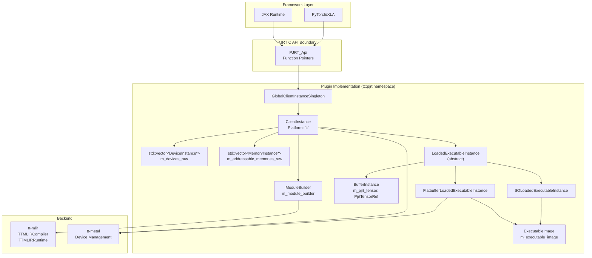
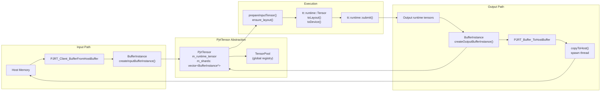
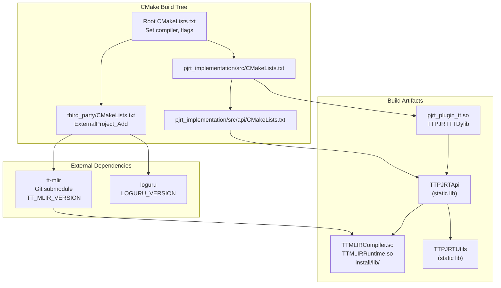

# PJRT Plugin System

Relevant source files
*   [CMakeLists.txt](https://github.com/tenstorrent/tt-xla/blob/c77995f6/CMakeLists.txt)
*   [third_party/CMakeLists.txt](https://github.com/tenstorrent/tt-xla/blob/c77995f6/third_party/CMakeLists.txt)

## Purpose and Scope

The PJRT Plugin System implements the [PJRT (Plugin for JAX Runtime)](https://openxla.org/xla/pjrt_integration) C API to enable JAX and PyTorch/XLA to execute models on Tenstorrent hardware. The plugin (`pjrt_plugin_tt.so`, also known as the `TTPJRTTTDylib` CMake target) serves as the interface layer between ML frameworks and the tt-mlir compilation toolchain and tt-metal runtime. This document covers the plugin's architecture, core data structures, API bindings, and lifecycle management.

For information about the compilation pipeline through MLIR, see [4.1](https://deepwiki.com/tenstorrent/tt-xla/4.1-compilation-pipeline). For framework-specific integration, see [5.1](https://deepwiki.com/tenstorrent/tt-xla/5.1-pytorchxla-backend) (PyTorch) and [5.2](https://deepwiki.com/tenstorrent/tt-xla/5.2-jax-backend) (JAX).

## PJRT C API Overview

The PJRT C API is a standard interface for pluggable accelerator backends in the OpenXLA ecosystem. It defines a set of opaque structures (`PJRT_Client`, `PJRT_Device`, `PJRT_Buffer`, `PJRT_Executable`, etc.) and function pointers that frameworks invoke to interact with hardware.

The plugin implements the following core API function groups:

| API Group | Primary Functions | Purpose |
| --- | --- | --- |
| **Client** | `PJRT_Client_Create`, `PJRT_Client_Destroy`, `PJRT_Client_Compile` | Client lifecycle and compilation |
| **Device** | `PJRT_Client_Devices`, `PJRT_Client_AddressableDevices` | Device enumeration and query |
| **Buffer** | `PJRT_Client_BufferFromHostBuffer`, `PJRT_Buffer_ToHostBuffer`, `PJRT_Buffer_CopyToDevice` | Data transfer between host and device |
| **Executable** | `PJRT_LoadedExecutable_Execute`, `PJRT_Executable_Serialize` | Execution and serialization |
| **Memory** | `PJRT_Client_AddressableMemories` | Memory space management |

Each PJRT structure is implemented as a C++ class in the `tt::pjrt` namespace. The opaque PJRT pointers are cast to/from these internal classes using `unwrap()` and `operator PJRT_*()` methods.

**Sources:**[pjrt_implementation/inc/api/client_instance.h 14-266](https://github.com/tenstorrent/tt-xla/blob/c77995f6/pjrt_implementation/inc/api/client_instance.h#L14-L266)[pjrt_implementation/src/api/client_instance.cc 294-310](https://github.com/tenstorrent/tt-xla/blob/c77995f6/pjrt_implementation/src/api/client_instance.cc#L294-L310)

## Plugin Architecture



**Core Components:**

- **`GlobalClientInstanceSingleton`**: Ensures a single `ClientInstance` per process, critical for proper device cleanup on process termination (workaround for frameworks not calling `PJRT_Client_Destroy` properly)
- **`ClientInstance`**: Manages the platform state, device/memory discovery, mesh device lifecycle, and compilation requests
- **`DeviceInstance`**: Represents a single Tenstorrent chip, tracks addressability and process ownership
- **`MemoryInstance`**: Represents host or device memory spaces
- **`BufferInstance`**: Wraps input/output tensors, manages data transfer between host and device
- **`LoadedExecutableInstance`**: Abstract base for executable execution (flatbuffer or shared object backends)
- **`ExecutableImage`**: Shared compilation artifact containing flatbuffer binary, metadata, and compile options
```


**Core Components:**

*   **`GlobalClientInstanceSingleton`**: Ensures a single `ClientInstance` per process, critical for proper device cleanup on process termination (workaround for frameworks not calling `PJRT_Client_Destroy` properly)
*   **`ClientInstance`**: Manages the platform state, device/memory discovery, mesh device lifecycle, and compilation requests
*   **`DeviceInstance`**: Represents a single Tenstorrent chip, tracks addressability and process ownership
*   **`MemoryInstance`**: Represents host or device memory spaces
*   **`BufferInstance`**: Wraps input/output tensors, manages data transfer between host and device
*   **`LoadedExecutableInstance`**: Abstract base for executable execution (flatbuffer or shared object backends)
*   **`ExecutableImage`**: Shared compilation artifact containing flatbuffer binary, metadata, and compile options

**Sources:**[pjrt_implementation/inc/api/client_instance.h 38-62](https://github.com/tenstorrent/tt-xla/blob/c77995f6/pjrt_implementation/inc/api/client_instance.h#L38-L62)[pjrt_implementation/inc/api/buffer_instance.h 40-52](https://github.com/tenstorrent/tt-xla/blob/c77995f6/pjrt_implementation/inc/api/buffer_instance.h#L40-L52)[pjrt_implementation/inc/api/loaded_executable_instance.h 40-152](https://github.com/tenstorrent/tt-xla/blob/c77995f6/pjrt_implementation/inc/api/loaded_executable_instance.h#L40-L152)

## Client Initialization and Lifecycle

### Singleton Pattern

The plugin uses a singleton pattern to ensure exactly one `ClientInstance` exists per process, even if frameworks repeatedly call `PJRT_Client_Create` or fail to call `PJRT_Client_Destroy`.

**Initialization Steps:**

1.   **Distributed Runtime Launch** (optional): If `TT_RUNTIME_ENABLE_DISTRIBUTED` is set, the plugin launches MPI workers for multi-node execution [pjrt_implementation/src/api/client_instance.cc 91-174](https://github.com/tenstorrent/tt-xla/blob/c77995f6/pjrt_implementation/src/api/client_instance.cc#L91-L174)
2.   **Memory Log Level Configuration**: Sets runtime memory logging based on `TT_RUNTIME_MEMORY_LOG_LEVEL`[pjrt_implementation/src/api/client_instance.cc 176-204](https://github.com/tenstorrent/tt-xla/blob/c77995f6/pjrt_implementation/src/api/client_instance.cc#L176-L204)
3.   **Device Discovery**: Queries `tt::runtime::getCurrentSystemDesc()` to enumerate chips, creates `DeviceInstance` for each [pjrt_implementation/src/api/client_instance.cc 312-359](https://github.com/tenstorrent/tt-xla/blob/c77995f6/pjrt_implementation/src/api/client_instance.cc#L312-L359)
4.   **Memory Population**: Creates host memory and per-device memory instances [pjrt_implementation/src/api/client_instance.cc 361-384](https://github.com/tenstorrent/tt-xla/blob/c77995f6/pjrt_implementation/src/api/client_instance.cc#L361-L384)
5.   **Parent Mesh Initialization**: Opens a 1×N mesh covering all devices [pjrt_implementation/src/api/client_instance.cc 355-356](https://github.com/tenstorrent/tt-xla/blob/c77995f6/pjrt_implementation/src/api/client_instance.cc#L355-L356)

**Sources:**[pjrt_implementation/inc/api/client_instance.h 38-62](https://github.com/tenstorrent/tt-xla/blob/c77995f6/pjrt_implementation/inc/api/client_instance.h#L38-L62)[pjrt_implementation/src/api/client_instance.cc 206-292](https://github.com/tenstorrent/tt-xla/blob/c77995f6/pjrt_implementation/src/api/client_instance.cc#L206-L292)[pjrt_implementation/src/api/client_instance.cc 578-613](https://github.com/tenstorrent/tt-xla/blob/c77995f6/pjrt_implementation/src/api/client_instance.cc#L578-L613)

### Device and Memory Discovery

The `ClientInstance` populates three device vectors:

| Vector | Type | Purpose |
| --- | --- | --- |
| `m_devices` | `std::vector<std::unique_ptr<DeviceInstance>>` | Owns all device instances |
| `m_devices_raw` | `std::vector<DeviceInstance*>` | Raw pointers for PJRT API return |
| `m_addressable_devices_raw` | `std::vector<DeviceInstance*>` | Subset of devices this process can control |

Each `DeviceInstance` has:

*   `m_global_device_id`: Chip ID in system descriptor (0-based global index)
*   `m_local_device_id`: Device index within this process (0-based local index)
*   `m_is_addressable`: Whether this process can send commands to the device
*   `m_process_index`: Process index that owns this device (for distributed)

Memory spaces are tracked similarly:

*   `m_addressable_host_memory`: Shared host memory accessible by all devices
*   `m_addressable_device_memories`: Per-device DRAM memories
*   `m_addressable_memories_raw`: Flat vector for PJRT API return

**Sources:**[pjrt_implementation/src/api/client_instance.cc 312-384](https://github.com/tenstorrent/tt-xla/blob/c77995f6/pjrt_implementation/src/api/client_instance.cc#L312-L384)[pjrt_implementation/inc/api/client_instance.h 161-185](https://github.com/tenstorrent/tt-xla/blob/c77995f6/pjrt_implementation/inc/api/client_instance.h#L161-L185)

## Mesh Device Management

The plugin manages mesh devices through the `ClientInstance`, which maintains:

*   **Parent Mesh** (`m_parent_mesh`): The primary multi-device mesh opened for computation
*   **Optimizer Submesh** (`m_optimizer_submesh`): Optional submesh for optimizer passes

### Mesh Reshaping Logic

When `getOrCreateMeshDevice()` is called with a new shape:

1.   **Check Existing Mesh**: If `m_parent_mesh` shape matches target, reuse it [pjrt_implementation/src/api/client_instance.cc 443-449](https://github.com/tenstorrent/tt-xla/blob/c77995f6/pjrt_implementation/src/api/client_instance.cc#L443-L449)
2.   **Move Tensors to Host**: Call `TensorPool::move_tensors_to_host()` to prevent data loss from device closure [pjrt_implementation/src/api/client_instance.cc 462](https://github.com/tenstorrent/tt-xla/blob/c77995f6/pjrt_implementation/src/api/client_instance.cc#L462-L462)
3.   **Close Old Mesh**: Release parent mesh and optimizer submesh [pjrt_implementation/src/api/client_instance.cc 474](https://github.com/tenstorrent/tt-xla/blob/c77995f6/pjrt_implementation/src/api/client_instance.cc#L474-L474)
4.   **Open New Mesh**: Configure fabric (1D for multi-device, disabled for single) and open mesh with new shape [pjrt_implementation/src/api/client_instance.cc 487-527](https://github.com/tenstorrent/tt-xla/blob/c77995f6/pjrt_implementation/src/api/client_instance.cc#L487-L527)

**Configuration Options:**

| Environment Variable | Purpose | Default |
| --- | --- | --- |
| `TT_RUNTIME_ENABLE_PROGRAM_CACHE` | Enable/disable program cache | Enabled |
| `TT_RUNTIME_TRACE_REGION_SIZE` | Set trace region size in bytes | None |

**Sources:**[pjrt_implementation/src/api/client_instance.cc 433-544](https://github.com/tenstorrent/tt-xla/blob/c77995f6/pjrt_implementation/src/api/client_instance.cc#L433-L544)[pjrt_implementation/inc/api/client_instance.h 113-141](https://github.com/tenstorrent/tt-xla/blob/c77995f6/pjrt_implementation/inc/api/client_instance.h#L113-L141)

## Buffer Management

### BufferInstance Lifecycle




`BufferInstance` represents a tensor shard (or full tensor) in the PJRT model. Each buffer maintains:

*   **Shape and Type**: Dimensions (`m_dimensions`), data type (`m_data_type`)
*   **Device Placement**: Device (`m_device`), memory space (`m_memory`), device ID (`m_device_id`)
*   **Data State**: Ready flag (`m_data_ready`), deleted flag (`m_data_deleted`)
*   **Tensor Reference**: `PjrtTensorRef` linking to shared `PjrtTensor`

**Sources:**[pjrt_implementation/inc/api/buffer_instance.h 40-269](https://github.com/tenstorrent/tt-xla/blob/c77995f6/pjrt_implementation/inc/api/buffer_instance.h#L40-L269)[pjrt_implementation/src/api/buffer_instance.cc 46-153](https://github.com/tenstorrent/tt-xla/blob/c77995f6/pjrt_implementation/src/api/buffer_instance.cc#L46-L153)

### Buffer Creation Paths

**Input Buffers** (from host to device):

1.   Framework calls `PJRT_Client_BufferFromHostBuffer` with host pointer and shape [pjrt_implementation/src/api/client_instance.cc 779-847](https://github.com/tenstorrent/tt-xla/blob/c77995f6/pjrt_implementation/src/api/client_instance.cc#L779-L847)
2.   Plugin creates `BufferInstance` via `createInputBufferInstance()`[pjrt_implementation/src/api/buffer_instance.cc 46-58](https://github.com/tenstorrent/tt-xla/blob/c77995f6/pjrt_implementation/src/api/buffer_instance.cc#L46-L58)
3.   `copyFromHost()` creates runtime tensor from host data: 
    *   **Owned Tensor**: Copies data if distributed runtime or `kImmutableOnlyDuringCall` semantics [pjrt_implementation/src/api/buffer_instance.cc 193-203](https://github.com/tenstorrent/tt-xla/blob/c77995f6/pjrt_implementation/src/api/buffer_instance.cc#L193-L203)
    *   **Borrowed Tensor**: Aliases host buffer if `kZeroCopy` semantics, defers event signal [pjrt_implementation/src/api/buffer_instance.cc 210-226](https://github.com/tenstorrent/tt-xla/blob/c77995f6/pjrt_implementation/src/api/buffer_instance.cc#L210-L226)

4.   `PjrtTensor::from_runtime_tensor()` wraps tensor and registers in `TensorPool`[pjrt_implementation/src/api/tensor.cc 52-66](https://github.com/tenstorrent/tt-xla/blob/c77995f6/pjrt_implementation/src/api/tensor.cc#L52-L66)

**Output Buffers** (from device to host):

1.   After execution, runtime returns device tensors [pjrt_implementation/src/api/flatbuffer_loaded_executable_instance.cc 88-137](https://github.com/tenstorrent/tt-xla/blob/c77995f6/pjrt_implementation/src/api/flatbuffer_loaded_executable_instance.cc#L88-L137)
2.   Plugin creates `BufferInstance` via `createOutputBufferInstance()` with device tensor [pjrt_implementation/src/api/buffer_instance.cc 60-74](https://github.com/tenstorrent/tt-xla/blob/c77995f6/pjrt_implementation/src/api/buffer_instance.cc#L60-L74)
3.   Data remains on device until `PJRT_Buffer_ToHostBuffer` is called
4.   `copyToHost()` spawns thread that: 
    *   Moves tensor to host with `move_to_host()`[pjrt_implementation/src/api/buffer_instance.cc 331](https://github.com/tenstorrent/tt-xla/blob/c77995f6/pjrt_implementation/src/api/buffer_instance.cc#L331-L331)
    *   Copies to user buffer with `tt::runtime::memcpy()`[pjrt_implementation/src/api/buffer_instance.cc 334](https://github.com/tenstorrent/tt-xla/blob/c77995f6/pjrt_implementation/src/api/buffer_instance.cc#L334-L334)
    *   Signals completion event [pjrt_implementation/src/api/buffer_instance.cc 337](https://github.com/tenstorrent/tt-xla/blob/c77995f6/pjrt_implementation/src/api/buffer_instance.cc#L337-L337)

**Sources:**[pjrt_implementation/src/api/buffer_instance.cc 155-349](https://github.com/tenstorrent/tt-xla/blob/c77995f6/pjrt_implementation/src/api/buffer_instance.cc#L155-L349)[pjrt_implementation/src/api/flatbuffer_loaded_executable_instance.cc 88-137](https://github.com/tenstorrent/tt-xla/blob/c77995f6/pjrt_implementation/src/api/flatbuffer_loaded_executable_instance.cc#L88-L137)

### PjrtTensor and Sharding

The `PjrtTensor` class abstracts tensor sharding across devices:

| Component | Purpose |
| --- | --- |
| `m_runtime_tensor` | Underlying `tt::runtime::Tensor` (may be multi-device) |
| `m_shards` | Vector of `BufferInstance*` pointing to this tensor |
| `m_uid` | Unique identifier for debugging |

**Initialization strategies:**

*   **Identity**: Single device, one shard → `m_shards.size() == 1`[pjrt_implementation/src/api/tensor.cc 180-182](https://github.com/tenstorrent/tt-xla/blob/c77995f6/pjrt_implementation/src/api/tensor.cc#L180-L182)
*   **Replicate**: N devices, N shards with same data → `createMultiDeviceHostTensor(..., "replicate")`[pjrt_implementation/src/api/tensor.cc 191-192](https://github.com/tenstorrent/tt-xla/blob/c77995f6/pjrt_implementation/src/api/tensor.cc#L191-L192)
*   **Shard/Shard2D**: N devices, N shards with partitioned data → `createMultiDeviceHostTensor(..., "shard")`[pjrt_implementation/src/api/tensor.cc 191-192](https://github.com/tenstorrent/tt-xla/blob/c77995f6/pjrt_implementation/src/api/tensor.cc#L191-L192)

When moving to host, multi-device tensors split into per-shard host tensors [pjrt_implementation/src/api/tensor.cc 113-133](https://github.com/tenstorrent/tt-xla/blob/c77995f6/pjrt_implementation/src/api/tensor.cc#L113-L133)

**Sources:**[pjrt_implementation/inc/api/tensor.h 26-122](https://github.com/tenstorrent/tt-xla/blob/c77995f6/pjrt_implementation/inc/api/tensor.h#L26-L122)[pjrt_implementation/src/api/tensor.cc 34-196](https://github.com/tenstorrent/tt-xla/blob/c77995f6/pjrt_implementation/src/api/tensor.cc#L34-L196)

## Compilation and Execution Flow

### Compilation Path

**Key Compilation Steps:**

1.   **Option Parsing**: `CompileOptionsParser::parseCompileOptions()` extracts protobuf-encoded options and replica device IDs [pjrt_implementation/src/api/client_instance.cc 732-743](https://github.com/tenstorrent/tt-xla/blob/c77995f6/pjrt_implementation/src/api/client_instance.cc#L732-L743)
2.   **Module Building**: `ModuleBuilder::buildModule()` orchestrates MLIR passes and backend selection (see [4.2](https://deepwiki.com/tenstorrent/tt-xla/4.2-pjrt-plugin-system))
3.   **Device Assignment**: Select subset of addressable devices based on mesh shape or replica IDs [pjrt_implementation/src/api/client_instance.cc 404-420](https://github.com/tenstorrent/tt-xla/blob/c77995f6/pjrt_implementation/src/api/client_instance.cc#L404-L420)
4.   **Executable Creation**: Convert `ExecutableImage` to `LoadedExecutableInstance` (flatbuffer or SO) [pjrt_implementation/src/api/client_instance.cc 422-428](https://github.com/tenstorrent/tt-xla/blob/c77995f6/pjrt_implementation/src/api/client_instance.cc#L422-L428)

**Sources:**[pjrt_implementation/src/api/client_instance.cc 386-431](https://github.com/tenstorrent/tt-xla/blob/c77995f6/pjrt_implementation/src/api/client_instance.cc#L386-L431)[pjrt_implementation/src/api/client_instance.cc 729-763](https://github.com/tenstorrent/tt-xla/blob/c77995f6/pjrt_implementation/src/api/client_instance.cc#L729-L763)

### Execution Path (Flatbuffer Backend)

**Execution Steps:**

1.   **Mesh Setup**: Ensure mesh device is opened with correct shape [pjrt_implementation/src/api/loaded_executable_instance.cc 106-143](https://github.com/tenstorrent/tt-xla/blob/c77995f6/pjrt_implementation/src/api/loaded_executable_instance.cc#L106-L143)
2.   **Input Preparation**: For each input: 
    *   Get/create `PjrtTensor` from buffer shards [pjrt_implementation/src/api/flatbuffer_loaded_executable_instance.cc 59-86](https://github.com/tenstorrent/tt-xla/blob/c77995f6/pjrt_implementation/src/api/flatbuffer_loaded_executable_instance.cc#L59-L86)
    *   Query expected layout from flatbuffer [pjrt_implementation/src/api/flatbuffer_loaded_executable_instance.cc 68-69](https://github.com/tenstorrent/tt-xla/blob/c77995f6/pjrt_implementation/src/api/flatbuffer_loaded_executable_instance.cc#L68-L69)
    *   Convert to target layout if needed (moves to device) [pjrt_implementation/src/api/flatbuffer_loaded_executable_instance.cc 83](https://github.com/tenstorrent/tt-xla/blob/c77995f6/pjrt_implementation/src/api/flatbuffer_loaded_executable_instance.cc#L83-L83)

3.   **Runtime Submission**: Call `tt::runtime::submit()` with device, flatbuffer, and inputs [pjrt_implementation/src/api/flatbuffer_loaded_executable_instance.cc 237-239](https://github.com/tenstorrent/tt-xla/blob/c77995f6/pjrt_implementation/src/api/flatbuffer_loaded_executable_instance.cc#L237-L239)
4.   **Output Creation**: Wrap output tensors in `BufferInstance` objects, keeping data on device [pjrt_implementation/src/api/flatbuffer_loaded_executable_instance.cc 98-136](https://github.com/tenstorrent/tt-xla/blob/c77995f6/pjrt_implementation/src/api/flatbuffer_loaded_executable_instance.cc#L98-L136)

**Sources:**[pjrt_implementation/src/api/flatbuffer_loaded_executable_instance.cc 59-165](https://github.com/tenstorrent/tt-xla/blob/c77995f6/pjrt_implementation/src/api/flatbuffer_loaded_executable_instance.cc#L59-L165)[pjrt_implementation/src/api/flatbuffer_loaded_executable_instance.cc 191-273](https://github.com/tenstorrent/tt-xla/blob/c77995f6/pjrt_implementation/src/api/flatbuffer_loaded_executable_instance.cc#L191-L273)

## API Binding Pattern

The plugin uses a consistent pattern to bind PJRT C API functions to internal implementations:

### Binding Registration

Each core class implements a `bindApi()` static method:

These are called during plugin initialization to populate the `PJRT_Api` struct with function pointers.

**Sources:**[pjrt_implementation/src/api/client_instance.cc 294-310](https://github.com/tenstorrent/tt-xla/blob/c77995f6/pjrt_implementation/src/api/client_instance.cc#L294-L310)[pjrt_implementation/src/api/buffer_instance.cc 97-113](https://github.com/tenstorrent/tt-xla/blob/c77995f6/pjrt_implementation/src/api/buffer_instance.cc#L97-L113)[pjrt_implementation/src/api/loaded_executable_instance.cc 54-63](https://github.com/tenstorrent/tt-xla/blob/c77995f6/pjrt_implementation/src/api/loaded_executable_instance.cc#L54-L63)

### Implementation Pattern

Each API function follows this pattern:

1.   **Tracy Profiling**: Wrap in `ZoneScoped` macro (if `TTXLA_TRACY_ZONES` enabled) [CMakeLists.txt 61](https://github.com/tenstorrent/tt-xla/blob/c77995f6/CMakeLists.txt#L61-L61)
2.   **Logging**: Log entry at `LOG_DEBUG` level [pjrt_implementation/src/api/client_instance.cc 580](https://github.com/tenstorrent/tt-xla/blob/c77995f6/pjrt_implementation/src/api/client_instance.cc#L580-L580)
3.   **Unwrap**: Cast opaque PJRT pointer to internal class [pjrt_implementation/src/api/client_instance.cc 607](https://github.com/tenstorrent/tt-xla/blob/c77995f6/pjrt_implementation/src/api/client_instance.cc#L607-L607)
4.   **Execute**: Call internal method, handle errors
5.   **Error Handling**: Return `PJRT_Error*` via `ErrorInstance::makeError()`[pjrt_implementation/src/api/client_instance.cc 762](https://github.com/tenstorrent/tt-xla/blob/c77995f6/pjrt_implementation/src/api/client_instance.cc#L762-L762)

**Example:**

**Sources:**[pjrt_implementation/src/api/client_instance.cc 729-763](https://github.com/tenstorrent/tt-xla/blob/c77995f6/pjrt_implementation/src/api/client_instance.cc#L729-L763)[CMakeLists.txt 61-62](https://github.com/tenstorrent/tt-xla/blob/c77995f6/CMakeLists.txt#L61-L62)

### Type Casting Utilities

Each class provides conversion utilities:

| Utility | Purpose | Example |
| --- | --- | --- |
| `operator PJRT_X*()` | Cast instance to PJRT pointer | `args->client = *client_instance` |
| `static unwrap(PJRT_X*)` | Cast PJRT pointer to instance | `ClientInstance::unwrap(args->client)` |

**Sources:**[pjrt_implementation/inc/api/client_instance.h 78-80](https://github.com/tenstorrent/tt-xla/blob/c77995f6/pjrt_implementation/inc/api/client_instance.h#L78-L80)[pjrt_implementation/inc/api/buffer_instance.h 73-78](https://github.com/tenstorrent/tt-xla/blob/c77995f6/pjrt_implementation/inc/api/buffer_instance.h#L73-L78)[pjrt_implementation/inc/api/loaded_executable_instance.h 54-62](https://github.com/tenstorrent/tt-xla/blob/c77995f6/pjrt_implementation/inc/api/loaded_executable_instance.h#L54-L62)

## Executable Image Hierarchy

The plugin supports multiple backend types through polymorphism:

**Backend Selection:** Determined by `CompileOptions.backend`:

*   `BackendRuntime::TTNNFlatbuffer`: Generates flatbuffer binary, executes via `tt::runtime::submit()`[pjrt_implementation/src/api/flatbuffer_loaded_executable_instance.cc 237-239](https://github.com/tenstorrent/tt-xla/blob/c77995f6/pjrt_implementation/src/api/flatbuffer_loaded_executable_instance.cc#L237-L239)
*   `BackendRuntime::TTNNCodegenPy` or `TTNNCodegenCpp`: Exports Python or C++ code, prints message instead of executing [pjrt_implementation/src/api/so_loaded_executable_instance.cc 124-127](https://github.com/tenstorrent/tt-xla/blob/c77995f6/pjrt_implementation/src/api/so_loaded_executable_instance.cc#L124-L127)

**Sources:**[pjrt_implementation/inc/api/executable_image.h](https://github.com/tenstorrent/tt-xla/blob/c77995f6/pjrt_implementation/inc/api/executable_image.h)[pjrt_implementation/inc/api/flatbuffer_loaded_executable_instance.h 31-76](https://github.com/tenstorrent/tt-xla/blob/c77995f6/pjrt_implementation/inc/api/flatbuffer_loaded_executable_instance.h#L31-L76)[pjrt_implementation/inc/api/so_loaded_executable_instance.h 33-71](https://github.com/tenstorrent/tt-xla/blob/c77995f6/pjrt_implementation/inc/api/so_loaded_executable_instance.h#L33-L71)

## Framework Integration Points

The plugin exposes different integration mechanisms for JAX and PyTorch:

### JAX Integration

JAX discovers the plugin via entry point registration:

1.   **Entry Point**: `setup.py` registers `jax_plugins` entry point → `jax_plugin_tt:initialize`[python_package/setup.py](https://github.com/tenstorrent/tt-xla/blob/c77995f6/python_package/setup.py)
2.   **Initialization**: JAX calls `initialize()` which returns platform name and library path
3.   **Client Creation**: JAX loads `pjrt_plugin_tt.so` and calls `PJRT_Client_Create` with platform "tt"

### PyTorch/XLA Integration

PyTorch has two integration paths:

**torch_xla Device Plugin:**

1.   **Entry Point**: `torch_xla_plugins` → `torch_plugin_tt:device_plugin`[python_package/setup.py](https://github.com/tenstorrent/tt-xla/blob/c77995f6/python_package/setup.py)
2.   **Device Registration**: Returns device type `XLA:TT`, library path, and device count
3.   **Client Creation**: torch_xla calls `PJRT_Client_Create` when `torch_xla.device('xla:TT')` is used

**torch.compile Backend:**

1.   **Backend Registration**: `torch._dynamo.list_backends()` includes `'tt'` backend
2.   **Compilation**: `xla_backend()` function (see [5.1.1](https://deepwiki.com/tenstorrent/tt-xla/5.1.1-graph-transformation-pipeline)) compiles FX graph to XLA
3.   **Execution**: torch.compile calls through PyTorch/XLA's PJRT client

**Sources:** Referenced in high-level diagrams 1 and 5

## Build System Integration



**Key Build Configuration:**

| CMake Variable | Purpose | Default |
|----------------|---------|---------|
| `TTMLIR_BUILD_TYPE` | Build type for tt-mlir | `Release` |
| `TTMLIR_ENABLE_PERF_TRACE` | Enable performance tracing | `ON` |
| `TTMLIR_ENABLE_BINDINGS_PYTHON` | Enable Python bindings | `OFF` |
| `TTXLA_ENABLE_EXPLORER` | Enable Explorer UI | `OFF` |
| `TTXLA_TRACY_ZONES` | Enable Tracy profiling zones | `OFF` |
| `CODE_COVERAGE` | Enable coverage instrumentation | `OFF` |

**Dependencies:**
- **tt-mlir**: Built as `ExternalProject` from git submodule, pinned to `TT_MLIR_VERSION` [third_party/CMakeLists.txt:8]()
- **loguru**: Logging library, also built as `ExternalProject` [third_party/CMakeLists.txt:114-128]()
- **protobuf**: Required for `CompileOptions` parsing [pjrt_implementation/src/api/CMakeLists.txt:14]()

**Library Dependencies:**
```
pjrt_plugin_tt.so
├── TTPJRTApi (static)
│   ├── TTMLIRCompiler (shared, from tt-mlir)
│   ├── TTMLIRRuntime (shared, from tt-mlir)
│   └── TTPJRTUtils (static)
│       └── loguru (static)
└── coverage_config (interface, optional)
```


The PJRT plugin is built as a shared library with dependencies on tt-mlir:

**Key Build Configuration:**

| CMake Variable | Purpose | Default |
| --- | --- | --- |
| `TTMLIR_BUILD_TYPE` | Build type for tt-mlir | `Release` |
| `TTMLIR_ENABLE_PERF_TRACE` | Enable performance tracing | `ON` |
| `TTMLIR_ENABLE_BINDINGS_PYTHON` | Enable Python bindings | `OFF` |
| `TTXLA_ENABLE_EXPLORER` | Enable Explorer UI | `OFF` |
| `TTXLA_TRACY_ZONES` | Enable Tracy profiling zones | `OFF` |
| `CODE_COVERAGE` | Enable coverage instrumentation | `OFF` |

**Dependencies:**

*   **tt-mlir**: Built as `ExternalProject` from git submodule, pinned to `TT_MLIR_VERSION`[third_party/CMakeLists.txt 8](https://github.com/tenstorrent/tt-xla/blob/c77995f6/third_party/CMakeLists.txt#L8-L8)
*   **loguru**: Logging library, also built as `ExternalProject`[third_party/CMakeLists.txt 114-128](https://github.com/tenstorrent/tt-xla/blob/c77995f6/third_party/CMakeLists.txt#L114-L128)
*   **protobuf**: Required for `CompileOptions` parsing [pjrt_implementation/src/api/CMakeLists.txt 14](https://github.com/tenstorrent/tt-xla/blob/c77995f6/pjrt_implementation/src/api/CMakeLists.txt#L14-L14)

**Library Dependencies:**

```
pjrt_plugin_tt.so
├── TTPJRTApi (static)
│   ├── TTMLIRCompiler (shared, from tt-mlir)
│   ├── TTMLIRRuntime (shared, from tt-mlir)
│   └── TTPJRTUtils (static)
│       └── loguru (static)
└── coverage_config (interface, optional)
```

**Sources:**[CMakeLists.txt 1-102](https://github.com/tenstorrent/tt-xla/blob/c77995f6/CMakeLists.txt#L1-L102)[third_party/CMakeLists.txt 1-130](https://github.com/tenstorrent/tt-xla/blob/c77995f6/third_party/CMakeLists.txt#L1-L130)[pjrt_implementation/src/api/CMakeLists.txt 10-82](https://github.com/tenstorrent/tt-xla/blob/c77995f6/pjrt_implementation/src/api/CMakeLists.txt#L10-L82)

Dismiss
Refresh this wiki

Enter email to refresh