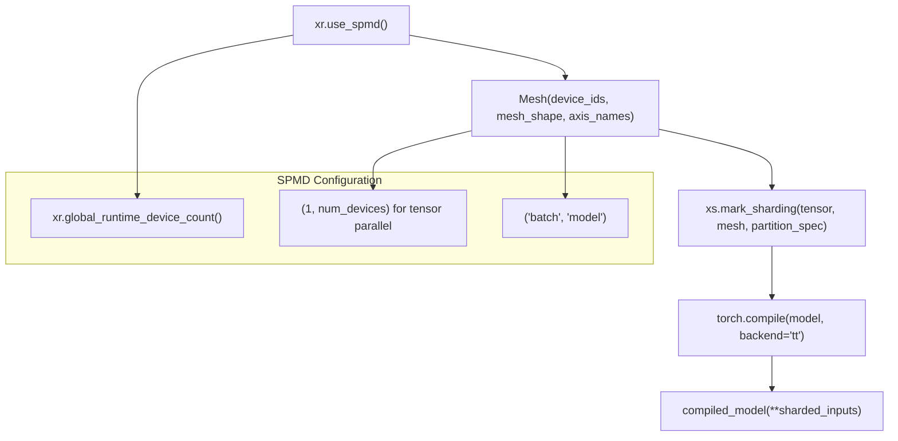
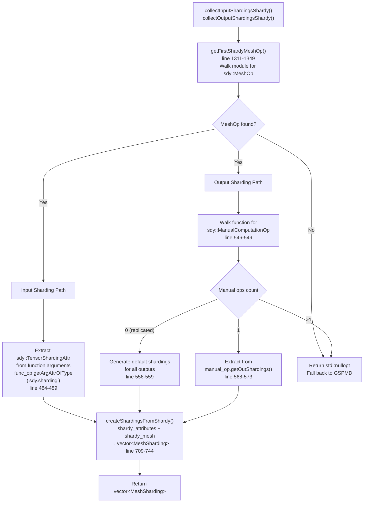
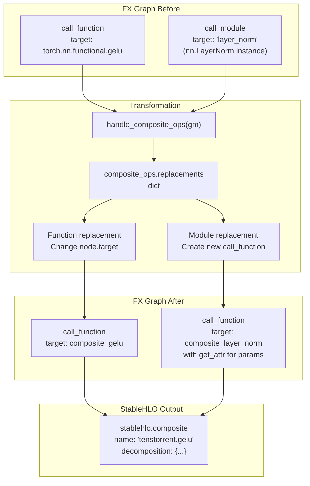
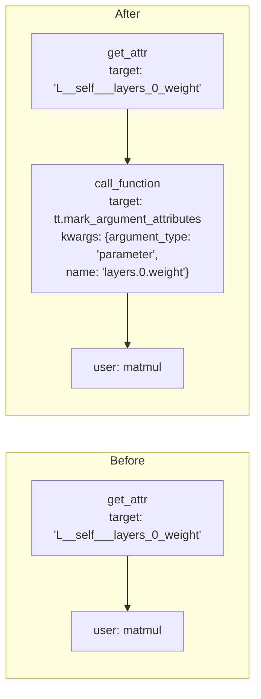
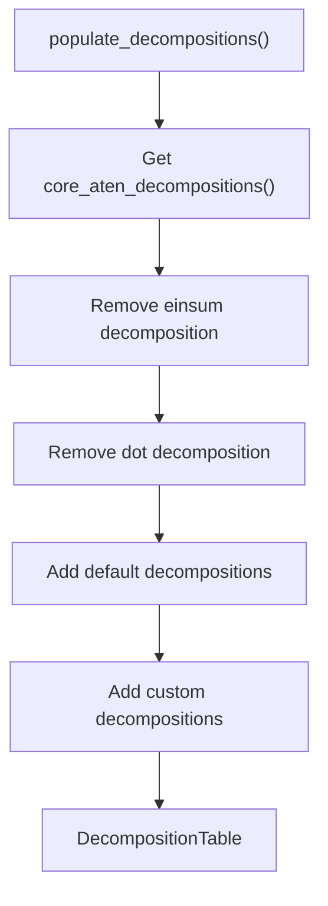
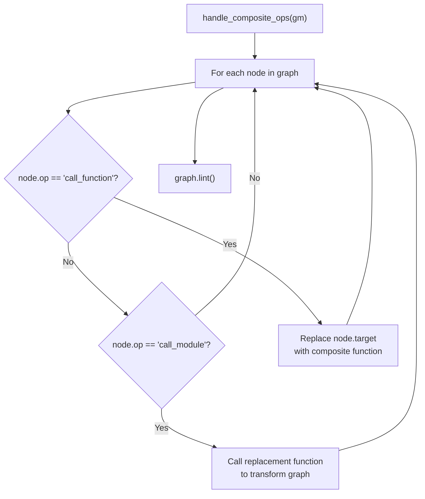
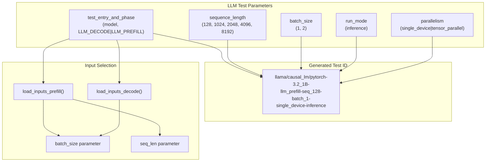
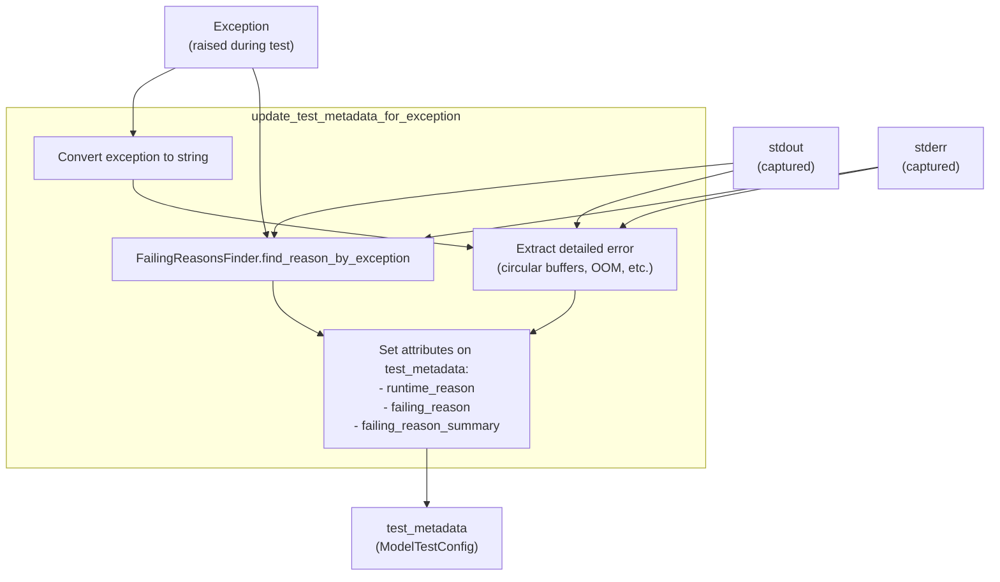

# Framework Integration

Relevant source files
*   [integrations/vllm_plugin/requirements-vllm-plugin.txt](https://github.com/tenstorrent/tt-xla/blob/c77995f6/integrations/vllm_plugin/requirements-vllm-plugin.txt)
*   [integrations/vllm_plugin/setup.py](https://github.com/tenstorrent/tt-xla/blob/c77995f6/integrations/vllm_plugin/setup.py)
*   [integrations/vllm_plugin/vllm_tt/__init__.py](https://github.com/tenstorrent/tt-xla/blob/c77995f6/integrations/vllm_plugin/vllm_tt/__init__.py)
*   [integrations/vllm_plugin/vllm_tt/attention.py](https://github.com/tenstorrent/tt-xla/blob/c77995f6/integrations/vllm_plugin/vllm_tt/attention.py)
*   [integrations/vllm_plugin/vllm_tt/input_batch.py](https://github.com/tenstorrent/tt-xla/blob/c77995f6/integrations/vllm_plugin/vllm_tt/input_batch.py)
*   [integrations/vllm_plugin/vllm_tt/model_runner.py](https://github.com/tenstorrent/tt-xla/blob/c77995f6/integrations/vllm_plugin/vllm_tt/model_runner.py)
*   [integrations/vllm_plugin/vllm_tt/overrides.py](https://github.com/tenstorrent/tt-xla/blob/c77995f6/integrations/vllm_plugin/vllm_tt/overrides.py)
*   [integrations/vllm_plugin/vllm_tt/platform.py](https://github.com/tenstorrent/tt-xla/blob/c77995f6/integrations/vllm_plugin/vllm_tt/platform.py)
*   [integrations/vllm_plugin/vllm_tt/pooling_runner.py](https://github.com/tenstorrent/tt-xla/blob/c77995f6/integrations/vllm_plugin/vllm_tt/pooling_runner.py)
*   [integrations/vllm_plugin/vllm_tt/scheduler/ascend_scheduler.py](https://github.com/tenstorrent/tt-xla/blob/c77995f6/integrations/vllm_plugin/vllm_tt/scheduler/ascend_scheduler.py)
*   [integrations/vllm_plugin/vllm_tt/vllm_distributed_utils.py](https://github.com/tenstorrent/tt-xla/blob/c77995f6/integrations/vllm_plugin/vllm_tt/vllm_distributed_utils.py)
*   [integrations/vllm_plugin/vllm_tt/worker.py](https://github.com/tenstorrent/tt-xla/blob/c77995f6/integrations/vllm_plugin/vllm_tt/worker.py)
*   [python_package/jax_plugin_tt/__init__.py](https://github.com/tenstorrent/tt-xla/blob/c77995f6/python_package/jax_plugin_tt/__init__.py)
*   [python_package/pjrt_plugin_tt/__init__.py](https://github.com/tenstorrent/tt-xla/blob/c77995f6/python_package/pjrt_plugin_tt/__init__.py)
*   [python_package/torch_plugin_tt/__init__.py](https://github.com/tenstorrent/tt-xla/blob/c77995f6/python_package/torch_plugin_tt/__init__.py)
*   [python_package/tt_torch/backend/backend.py](https://github.com/tenstorrent/tt-xla/blob/c77995f6/python_package/tt_torch/backend/backend.py)
*   [python_package/tt_torch/backend/metadata_propagation.py](https://github.com/tenstorrent/tt-xla/blob/c77995f6/python_package/tt_torch/backend/metadata_propagation.py)
*   [python_package/tt_torch/backend/passes.py](https://github.com/tenstorrent/tt-xla/blob/c77995f6/python_package/tt_torch/backend/passes.py)
*   [python_package/tt_torch/composite_ops.py](https://github.com/tenstorrent/tt-xla/blob/c77995f6/python_package/tt_torch/composite_ops.py)
*   [python_package/tt_torch/fusion_providers.py](https://github.com/tenstorrent/tt-xla/blob/c77995f6/python_package/tt_torch/fusion_providers.py)
*   [python_package/ttxla_tools/logging.py](https://github.com/tenstorrent/tt-xla/blob/c77995f6/python_package/ttxla_tools/logging.py)
*   [tests/infra/utilities/torch_multichip_utils.py](https://github.com/tenstorrent/tt-xla/blob/c77995f6/tests/infra/utilities/torch_multichip_utils.py)
*   [tests/torch/multi_host/__init__.py](https://github.com/tenstorrent/tt-xla/blob/c77995f6/tests/torch/multi_host/__init__.py)
*   [tests/torch/multi_host/llmbox/__init__.py](https://github.com/tenstorrent/tt-xla/blob/c77995f6/tests/torch/multi_host/llmbox/__init__.py)
*   [tests/torch/ops/test_fusion_ops.py](https://github.com/tenstorrent/tt-xla/blob/c77995f6/tests/torch/ops/test_fusion_ops.py)

This page provides an overview of how tt-xla integrates with the three supported ML frameworks: **PyTorch/XLA**, **JAX**, and **vLLM**. The purpose here is to describe the shared integration model and explain the role each framework-specific adapter plays. For detailed information about each framework, see the dedicated subsystem pages:

*   PyTorch/XLA backend: [PyTorch/XLA Backend](https://deepwiki.com/tenstorrent/tt-xla/5.1-pytorchxla-backend)
*   JAX backend: [JAX Backend](https://deepwiki.com/tenstorrent/tt-xla/5.2-jax-backend)
*   vLLM integration: [vLLM Integration](https://deepwiki.com/tenstorrent/tt-xla/5.3-vllm-integration)

For the underlying PJRT plugin implementation that all three frameworks share, see [PJRT Plugin System](https://deepwiki.com/tenstorrent/tt-xla/4.1-compilation-pipeline).

* * *

## Integration Model

All three frameworks funnel through a single shared binary: `pjrt_plugin_tt.so`. Each framework has a thin adapter layer that translates framework-native model representations into a StableHLO graph, which is then handed off to the PJRT plugin for compilation and execution on Tenstorrent hardware.

The shared plugin binary is distributed through the `pjrt_plugin_tt` Python package ([python_package/pjrt_plugin_tt/__init__.py](https://github.com/tenstorrent/tt-xla/blob/c77995f6/python_package/pjrt_plugin_tt/__init__.py)). Both the JAX and PyTorch/XLA adapters reference this package to locate the `.so` file and configure environment variables such as `TT_PJRT_PLUGIN_DIR` and `TT_METAL_RUNTIME_ROOT`.

**Overall framework integration flow:**

Sources: [python_package/pjrt_plugin_tt/__init__.py](https://github.com/tenstorrent/tt-xla/blob/c77995f6/python_package/pjrt_plugin_tt/__init__.py)[python_package/torch_plugin_tt/__init__.py](https://github.com/tenstorrent/tt-xla/blob/c77995f6/python_package/torch_plugin_tt/__init__.py)[README.md](https://github.com/tenstorrent/tt-xla/blob/c77995f6/README.md?plain=1)

* * *

## Shared Infrastructure

The `pjrt_plugin_tt` package is the single shared distribution unit for the compiled plugin binary. Both JAX and PyTorch/XLA plugins import from it to obtain the plugin path and set up the environment.

| Component | Package | Purpose |
| --- | --- | --- |
| `pjrt_plugin_tt` | `python_package/pjrt_plugin_tt/` | Holds `pjrt_plugin_tt.so` and environment setup helpers |
| `jax_plugin_tt` | `python_package/jax_plugin_tt/` | JAX entry point via `jax_plugins` entry group |
| `torch_plugin_tt` | `python_package/torch_plugin_tt/` | PyTorch/XLA entry point via `torch_xla.plugins` entry group |
| `tt_torch` | `python_package/tt_torch/` | `torch.compile` backend, graph passes, composite ops |
| `vllm_tt` | `python_package/vllm_tt/` | vLLM platform adapter |

Sources: [python_package/pjrt_plugin_tt/__init__.py](https://github.com/tenstorrent/tt-xla/blob/c77995f6/python_package/pjrt_plugin_tt/__init__.py)[python_package/torch_plugin_tt/__init__.py](https://github.com/tenstorrent/tt-xla/blob/c77995f6/python_package/torch_plugin_tt/__init__.py)

* * *

## Framework Adapters at a Glance

### PyTorch/XLA

The PyTorch path has two distinct layers that work together:

1.   **Device registration** — `TTPlugin` (a `DevicePlugin` subclass) registers the Tenstorrent device with `torch_xla`. On construction, it calls `setup_tt_pjrt_plugin_dir()` and `setup_tt_metal_home()` from `pjrt_plugin_tt`, then sets `XLA_STABLEHLO_COMPILE=1` to enable StableHLO-based compilation in `torch_xla`.

2.   **Compile backend** — The `"tt"` backend registered via `@register_backend(name="tt")` in `backend.py` intercepts `torch.compile(backend="tt")` calls. It runs `torch_pass_pipeline()` to transform the FX graph, then wraps it in an `XLAExecutor` that drives the `torch_xla` compilation path through PJRT.

Sources: [python_package/torch_plugin_tt/__init__.py](https://github.com/tenstorrent/tt-xla/blob/c77995f6/python_package/torch_plugin_tt/__init__.py)[python_package/tt_torch/backend/backend.py 37-96](https://github.com/tenstorrent/tt-xla/blob/c77995f6/python_package/tt_torch/backend/backend.py#L37-L96)[python_package/tt_torch/backend/backend.py 119-270](https://github.com/tenstorrent/tt-xla/blob/c77995f6/python_package/tt_torch/backend/backend.py#L119-L270)

* * *

### JAX

JAX uses the `jax_plugins` entry point group to auto-discover the plugin. The `jax_plugin_tt` package registers itself as a JAX device plugin, pointing JAX to the shared `pjrt_plugin_tt.so`. Once registered, `jax.jit`-compiled functions are automatically routed through PJRT to Tenstorrent hardware when a `"tt"` device is specified.

The JAX adapter also provides a monkeypatching mechanism (`setup_monkey_patches`) that wraps primitives like `tenstorrent.gelu` and `tenstorrent.uniform` as StableHLO composite operations, and introduces a `mark_weight_p` primitive for weight annotation. See [JAX Backend](https://deepwiki.com/tenstorrent/tt-xla/5.2-jax-backend) for details.

* * *

### vLLM

The vLLM integration is structured as a platform plugin, not a `torch.compile` backend. The `TTPlatform` class registers itself with vLLM's plugin registry and replaces the default platform, worker, and model runner classes with TT-specific implementations (`TTWorker`, `TTModelRunner`, `TTPoolingModelRunner`). These classes internally use `torch.compile(backend="tt")` to compile model components and route execution through PJRT.

See [vLLM Integration](https://deepwiki.com/tenstorrent/tt-xla/5.3-vllm-integration) and [Platform, Worker, and Model Runners](https://deepwiki.com/tenstorrent/tt-xla/5.3.1-platform-worker-and-model-runners) for details.

* * *

## The Graph Transformation Layer (PyTorch)

The PyTorch backend performs several FX graph transformations before handing the graph to `torch_xla` for PJRT compilation. The pipeline is orchestrated by `torch_pass_pipeline()` in [python_package/tt_torch/backend/backend.py 37-96](https://github.com/tenstorrent/tt-xla/blob/c77995f6/python_package/tt_torch/backend/backend.py#L37-L96)

**Transformation pipeline:**

Sources: [python_package/tt_torch/backend/backend.py 37-96](https://github.com/tenstorrent/tt-xla/blob/c77995f6/python_package/tt_torch/backend/backend.py#L37-L96)[python_package/tt_torch/backend/passes.py](https://github.com/tenstorrent/tt-xla/blob/c77995f6/python_package/tt_torch/backend/passes.py)[python_package/tt_torch/composite_ops.py](https://github.com/tenstorrent/tt-xla/blob/c77995f6/python_package/tt_torch/composite_ops.py)[python_package/tt_torch/fusion_providers.py](https://github.com/tenstorrent/tt-xla/blob/c77995f6/python_package/tt_torch/fusion_providers.py)

Key passes and what they do:

| Pass | Function | Effect |
| --- | --- | --- |
| Fusion pass | `run_fusion_passes()` | Detects multi-op patterns (e.g., `RMSNormFusionProvider`) and fuses them before composite wrapping |
| Composite ops | `handle_composite_ops()` | Substitutes `torch.nn.functional.gelu`, `rms_norm`, `layer_norm`, etc. with `StableHLOCompositeBuilder`-wrapped equivalents named `tenstorrent.*` |
| Decompositions | `populate_decompositions()` | Runs `torch.export` decompositions to flatten higher-level ATen ops |
| Argument markers | `insert_argument_type_markers()` | Inserts `torch.ops.tt.mark_argument_attributes` nodes to distinguish parameters, buffers, constants, and user inputs for the MLIR compiler |
| Cast bypass | `bypass_dtype_promotion_and_redundant_cast()` | Removes unwanted float32 promotions inserted by PyTorch decompositions |
| Getitem bypass | `bypass_redundant_getitem()` | Eliminates redundant tuple unpacking nodes |
| Assert bypass | `bypass_assert_tensor_metadata()` | Removes `aten._assert_tensor_metadata` nodes that would fail when running on XLA |

* * *

## Composite Operations

The `composite_ops` module ([python_package/tt_torch/composite_ops.py](https://github.com/tenstorrent/tt-xla/blob/c77995f6/python_package/tt_torch/composite_ops.py)) defines a `replacements` dict that maps standard PyTorch functions and module types to `StableHLOCompositeBuilder`-wrapped equivalents. This allows the MLIR compiler to recognize and optimize high-level operations (like `gelu`, `rms_norm`, `layer_norm`) that would otherwise decompose into dozens of low-level StableHLO ops.

| PyTorch API | Composite Name |
| --- | --- |
| `torch.nn.functional.gelu` | `tenstorrent.gelu` / `tenstorrent.gelu_tanh` |
| `torch.rms_norm` / `torch.nn.functional.rms_norm` | `tenstorrent.rms_norm` |
| `torch.nn.functional.layer_norm` / `torch.nn.LayerNorm` | `tenstorrent.layer_norm` |

For custom ATen overrides and LLM-specific ops like `scaled_dot_product_attention`, `update_cache`, and `sharding_constraint`, see [Custom Operations and Decompositions](https://deepwiki.com/tenstorrent/tt-xla/5.1.2-custom-operations-and-decompositions).

* * *

## Execution Modes

The PyTorch backend supports two execution modes in `XLAExecutor`:

| Mode | Flag | Description |
| --- | --- | --- |
| Experimental (default) | `tt_legacy_compile=False` | Uses `torch.export.export()` + `bridge.extract_compiled_graph()` to avoid re-tracing on subsequent invocations |
| Legacy | `tt_legacy_compile=True` | Directly runs the `GraphModule` through `torch_xla` on each call; simpler but re-traces every invocation |

The experimental mode calls `bridge.extract_compiled_graph()` from `torch_xla.core.dynamo_bridge` to produce an `optimized_mod` that caches the compiled graph, eliminating dynamo re-tracing after the first run.

In SPMD (multi-device) mode, `_mark_unsharded_args_replicated()` ([python_package/tt_torch/backend/backend.py 99-116](https://github.com/tenstorrent/tt-xla/blob/c77995f6/python_package/tt_torch/backend/backend.py#L99-L116)) marks any tensors that lack sharding annotations as `REPLICATED` before execution, ensuring consistency with the sharding spec captured at graph trace time.

Sources: [python_package/tt_torch/backend/backend.py 119-269](https://github.com/tenstorrent/tt-xla/blob/c77995f6/python_package/tt_torch/backend/backend.py#L119-L269)

* * *

## Metadata Propagation (Debug)

When `XLA_HLO_DEBUG=1` is set, the `MetadataInterpreter` and `MetadataDispatchMode` classes ([python_package/tt_torch/backend/metadata_propagation.py](https://github.com/tenstorrent/tt-xla/blob/c77995f6/python_package/tt_torch/backend/metadata_propagation.py)) attach FX node source location metadata (file path, line number, module hierarchy) to XLA tensor operations. This propagates through to the HLO IR, enabling better observability and debugging of compiled graphs.

This mechanism is intentionally disabled by default because it has a performance cost.

Sources: [python_package/tt_torch/backend/metadata_propagation.py](https://github.com/tenstorrent/tt-xla/blob/c77995f6/python_package/tt_torch/backend/metadata_propagation.py)

* * *

## SPMD / Multi-Device

Both the PyTorch and JAX backends support multi-device execution via SPMD. The PyTorch path uses `torch_xla`'s SPMD mode (`xr.use_spmd()`) with `Mesh` objects for device layout, and sets `CONVERT_SHLO_TO_SHARDY=1` so the `torch_xla` fork emits Shardy annotations expected by the `tt-mlir` pipeline. See [Sharding and Multi-Device Execution](https://deepwiki.com/tenstorrent/tt-xla/5-framework-integration#4.5) and [Multi-Chip Testing](https://deepwiki.com/tenstorrent/tt-xla/5-framework-integration#6.7) for more.

Sources: [tests/infra/utilities/torch_multichip_utils.py](https://github.com/tenstorrent/tt-xla/blob/c77995f6/tests/infra/utilities/torch_multichip_utils.py)

This wiki is featured in the [repository](https://github.com/tenstorrent/tt-xla/blob/main/README.md)

Dismiss
Refresh this wiki

Enter email to refresh

### Related: Multi-Chip Execution Pattern

### Related: Composite Op Mechanism

### Related: Test Metadata Update Flow

