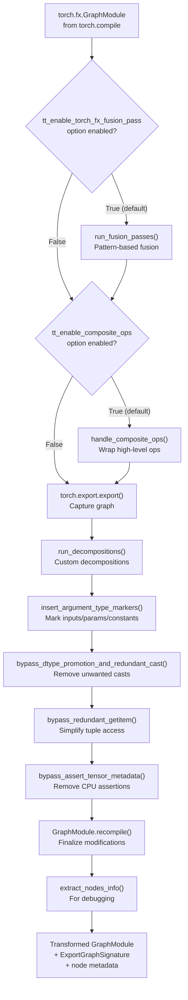
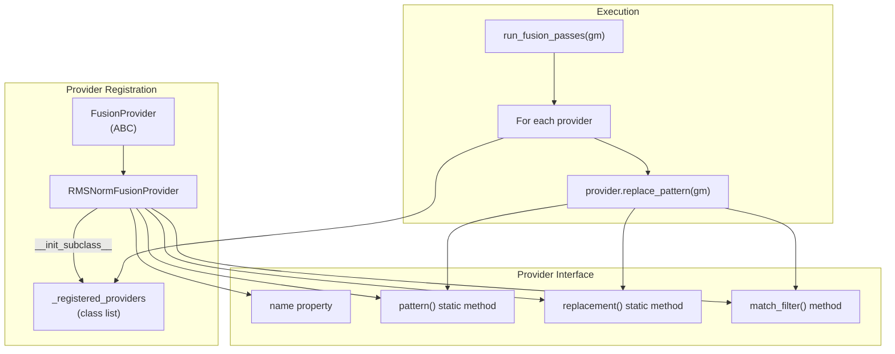
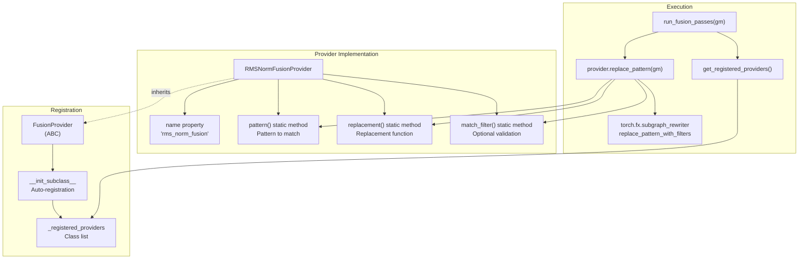
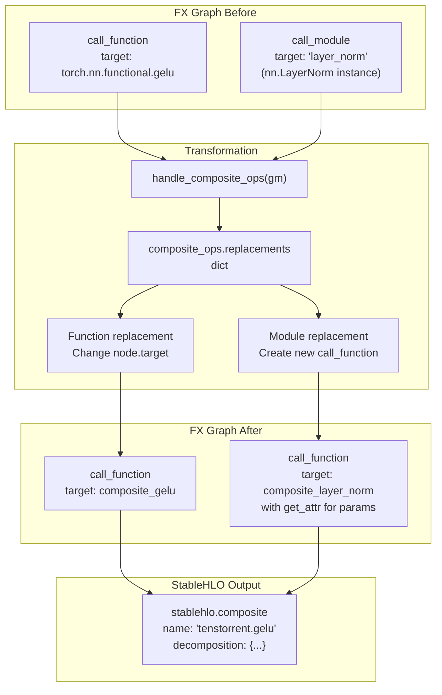
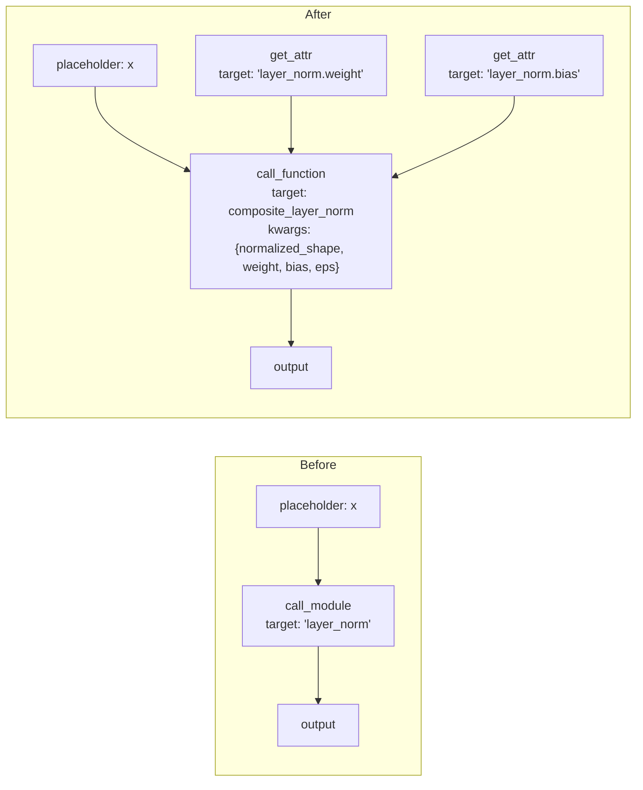
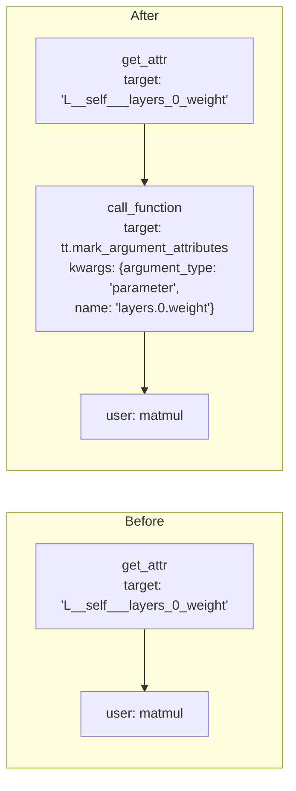
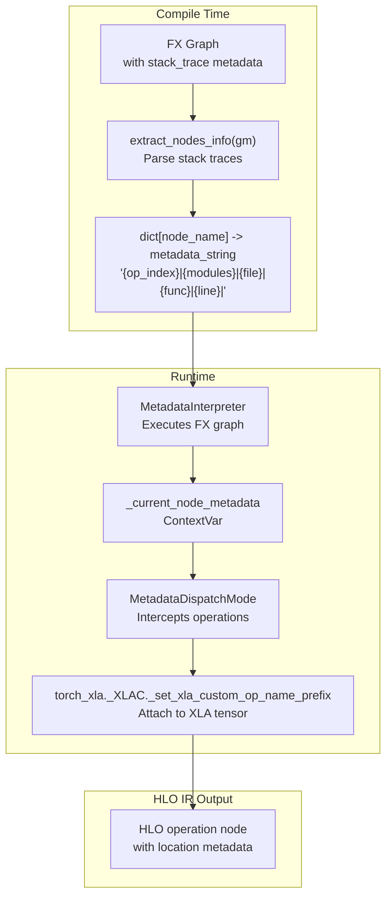
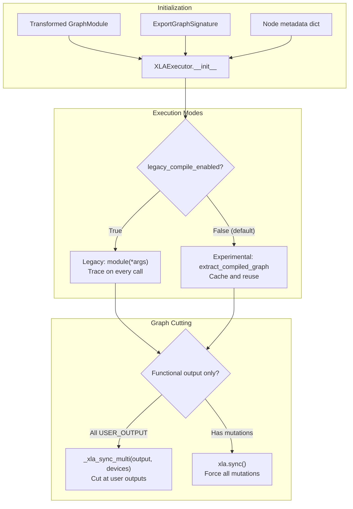

# Graph Transformation Pipeline

Relevant source files
*   [python_package/jax_plugin_tt/__init__.py](https://github.com/tenstorrent/tt-xla/blob/c77995f6/python_package/jax_plugin_tt/__init__.py)
*   [python_package/pjrt_plugin_tt/__init__.py](https://github.com/tenstorrent/tt-xla/blob/c77995f6/python_package/pjrt_plugin_tt/__init__.py)
*   [python_package/torch_plugin_tt/__init__.py](https://github.com/tenstorrent/tt-xla/blob/c77995f6/python_package/torch_plugin_tt/__init__.py)
*   [python_package/tt_torch/backend/backend.py](https://github.com/tenstorrent/tt-xla/blob/c77995f6/python_package/tt_torch/backend/backend.py)
*   [python_package/tt_torch/backend/metadata_propagation.py](https://github.com/tenstorrent/tt-xla/blob/c77995f6/python_package/tt_torch/backend/metadata_propagation.py)
*   [python_package/tt_torch/backend/passes.py](https://github.com/tenstorrent/tt-xla/blob/c77995f6/python_package/tt_torch/backend/passes.py)
*   [python_package/tt_torch/composite_ops.py](https://github.com/tenstorrent/tt-xla/blob/c77995f6/python_package/tt_torch/composite_ops.py)
*   [python_package/tt_torch/fusion_providers.py](https://github.com/tenstorrent/tt-xla/blob/c77995f6/python_package/tt_torch/fusion_providers.py)
*   [python_package/ttxla_tools/logging.py](https://github.com/tenstorrent/tt-xla/blob/c77995f6/python_package/ttxla_tools/logging.py)
*   [tests/infra/utilities/torch_multichip_utils.py](https://github.com/tenstorrent/tt-xla/blob/c77995f6/tests/infra/utilities/torch_multichip_utils.py)
*   [tests/torch/multi_host/__init__.py](https://github.com/tenstorrent/tt-xla/blob/c77995f6/tests/torch/multi_host/__init__.py)
*   [tests/torch/multi_host/llmbox/__init__.py](https://github.com/tenstorrent/tt-xla/blob/c77995f6/tests/torch/multi_host/llmbox/__init__.py)
*   [tests/torch/ops/test_fusion_ops.py](https://github.com/tenstorrent/tt-xla/blob/c77995f6/tests/torch/ops/test_fusion_ops.py)

This document explains the FX graph transformation pipeline in the PyTorch/XLA backend. This pipeline transforms PyTorch FX graphs into a form that can be efficiently compiled by tt-mlir. The transformations include pattern-based fusion, composite operation wrapping, custom decompositions, and various cleanup passes.

For information about custom decomposition implementations, see [Custom Operations and Decompositions](https://deepwiki.com/tenstorrent/tt-xla/5.1.2-custom-operations-and-decompositions). For the overall PyTorch backend architecture, see [PyTorch/XLA Backend](https://deepwiki.com/tenstorrent/tt-xla/5.1-pytorchxla-backend).

## Pipeline Overview

The transformation pipeline is orchestrated by the `torch_pass_pipeline` function, which runs a sequence of passes on a torch FX GraphModule before it is lowered to StableHLO and sent to tt-mlir for compilation.

**Sources:**[python_package/tt_torch/backend/backend.py 37-96](https://github.com/tenstorrent/tt-xla/blob/c77995f6/python_package/tt_torch/backend/backend.py#L37-L96)

The pipeline is configurable via the `options` dictionary passed to `torch.compile`:

`# Example usagemodel = torch.compile(model, backend="tt", options={    "tt_enable_torch_fx_fusion_pass": True,  # Enable fusion (default: True)    "tt_enable_composite_ops": True,          # Enable composite ops (default: True)})`
**Sources:**[python_package/tt_torch/backend/backend.py 45-59](https://github.com/tenstorrent/tt-xla/blob/c77995f6/python_package/tt_torch/backend/backend.py#L45-L59)



## Fusion Passes

Fusion passes detect and combine multi-operation patterns into single fused operations. This optimization runs before composite ops to allow fused patterns to be wrapped as composites.

### Fusion Provider Architecture

The fusion system uses a provider-based architecture where each fusion pattern is encapsulated in a `FusionProvider` subclass:

**Sources:**[python_package/tt_torch/fusion_providers.py 20-92](https://github.com/tenstorrent/tt-xla/blob/c77995f6/python_package/tt_torch/fusion_providers.py#L20-L92)[python_package/tt_torch/backend/passes.py 13-32](https://github.com/tenstorrent/tt-xla/blob/c77995f6/python_package/tt_torch/backend/passes.py#L13-L32)




**Diagram: Fusion provider architecture with automatic registration**

Sources: [python_package/tt_torch/fusion_providers.py:20-91]()
```



### RMS Normalization Fusion Example

The `RMSNormFusionProvider` demonstrates the fusion pattern system. It matches the expanded RMS normalization pattern commonly seen in LLM models and replaces it with a single `torch.nn.functional.rms_norm` call:

**Pattern Matched:**

`# LlamaRMSNorm implementation expands to:hidden_fp32 = hidden_states.to(torch.float32)variance = hidden_fp32.pow(2).mean(-1, keepdim=True)variance_eps = variance.add(eps)rsqrt_var = torch.rsqrt(variance_eps)hidden_normalized = hidden_fp32.mul(rsqrt_var)hidden_cast = hidden_normalized.to(dtype)output = weight.mul(hidden_cast)`
**Replacement:**

`output = torch.nn.functional.rms_norm(    hidden_states, normalized_shape=weight.shape, weight=weight, eps=eps)`
The provider includes a `match_filter` that validates weight tensor dimensions to ensure hardware compatibility, preventing fusion when the last dimension exceeds 3968 (a hardware-specific limitation).

**Sources:**[python_package/tt_torch/fusion_providers.py 97-166](https://github.com/tenstorrent/tt-xla/blob/c77995f6/python_package/tt_torch/fusion_providers.py#L97-L166)

### Creating New Fusion Providers

To add a new fusion pattern:

1.   Create a class inheriting from `FusionProvider`
2.   Implement the `name` property
3.   Define the `pattern` static method with the operations to match
4.   Define the `replacement` static method with the fused operation
5.   Optionally implement `match_filter` for validation

The provider is automatically registered via `__init_subclass__` and will be executed during `run_fusion_passes`.

**Sources:**[python_package/tt_torch/fusion_providers.py 20-73](https://github.com/tenstorrent/tt-xla/blob/c77995f6/python_package/tt_torch/fusion_providers.py#L20-L73)

## Composite Operations

Composite operations wrap high-level PyTorch operations into StableHLO composite ops that tt-mlir can recognize and handle natively. This prevents decomposition into primitive operations and allows the backend to use optimized implementations.

### Composite Op Mechanism

**Sources:**[python_package/tt_torch/backend/passes.py 34-59](https://github.com/tenstorrent/tt-xla/blob/c77995f6/python_package/tt_torch/backend/passes.py#L34-L59)[python_package/tt_torch/composite_ops.py 11-25](https://github.com/tenstorrent/tt-xla/blob/c77995f6/python_package/tt_torch/composite_ops.py#L11-L25)



### Supported Composite Operations

The `replacements` dictionary maps PyTorch operations to their composite implementations:

| PyTorch Operation | Composite Function | StableHLO Name |
| --- | --- | --- |
| `torch.nn.functional.gelu` | `composite_gelu` | `tenstorrent.gelu` or `tenstorrent.gelu_tanh` |
| `torch.rms_norm` | `composite_rms_norm` | `tenstorrent.rms_norm` |
| `torch.nn.functional.rms_norm` | `composite_rms_norm` | `tenstorrent.rms_norm` |
| `torch.nn.functional.layer_norm` | `composite_layer_norm` | `tenstorrent.layer_norm` |
| `torch.nn.LayerNorm` (module) | `replace_layer_norm_module` | `tenstorrent.layer_norm` |

**Sources:**[python_package/tt_torch/composite_ops.py 194-202](https://github.com/tenstorrent/tt-xla/blob/c77995f6/python_package/tt_torch/composite_ops.py#L194-L202)

### StableHLO Composite Builder

Composite operations use `StableHLOCompositeBuilder` from torch_xla to mark inputs and outputs:

`def composite_gelu(input: Tensor, approximate: str = "none") -> Tensor:    tanh = approximate == "tanh"    name = "tenstorrent.gelu" + ("_tanh" if tanh else "")    attr = {"approximate": "tanh"} if tanh else None        builder = StableHLOCompositeBuilder(name=name, attr=attr)    input = builder.mark_inputs(input)    input = torch.nn.functional.gelu(input, approximate=approximate)    input = builder.mark_outputs(input)        return input`
The builder creates a StableHLO composite operation with:

*   **name**: The operation name tt-mlir recognizes (must start with "tenstorrent.")
*   **attr**: Attributes passed to tt-mlir (e.g., epsilon, normalized_shape)
*   **decomposition**: The PyTorch operations enclosed between mark_inputs and mark_outputs

**Sources:**[python_package/tt_torch/composite_ops.py 30-47](https://github.com/tenstorrent/tt-xla/blob/c77995f6/python_package/tt_torch/composite_ops.py#L30-L47)

### Module Replacement Example

Module replacements (like `replace_layer_norm_module`) transform `call_module` nodes into `call_function` nodes by extracting module parameters:

**Sources:**[python_package/tt_torch/composite_ops.py 133-187](https://github.com/tenstorrent/tt-xla/blob/c77995f6/python_package/tt_torch/composite_ops.py#L133-L187)



## Decompositions

After composite operations are handled, the pipeline exports the graph and runs custom decompositions. These decompositions break down complex operations into simpler primitives that tt-mlir can compile.

The decomposition dictionary is populated by `populate_decompositions()` and passed to `program.run_decompositions()`:

`decompositions = populate_decompositions()program = torch.export.export(gm, tuple(example_inputs), strict=False)program = program.run_decompositions(decompositions)`
For details on specific decomposition implementations (e.g., upsample, matmul), see [Custom Operations and Decompositions](https://deepwiki.com/tenstorrent/tt-xla/5.1.2-custom-operations-and-decompositions).

**Sources:**[python_package/tt_torch/backend/backend.py 61-68](https://github.com/tenstorrent/tt-xla/blob/c77995f6/python_package/tt_torch/backend/backend.py#L61-L68)

## Argument Type Markers

The `insert_argument_type_markers` pass annotates graph inputs with type information (input, parameter, constant) to help tt-mlir optimize compilation. This is critical for operations like consteval hoisting.

### Type Classification

Input arguments are classified using the `ExportGraphSignature`:

| InputKind | Argument Type | Description |
| --- | --- | --- |
| `USER_INPUT` | `"input"` | Runtime user inputs |
| `PARAMETER` | `"parameter"` | Model parameters |
| `CONSTANT_TENSOR` | `"constant"` | Lifted constants |
| `BUFFER` (not mutated) | `"constant"` | Non-mutated buffers |
| `BUFFER` (mutated) | `"input"` | Mutated buffers (prevent consteval) |
| `TOKEN`, `CUSTOM_OBJ` | `"input"` | Not modeled in tt-mlir |

**Sources:**[python_package/tt_torch/backend/passes.py 86-113](https://github.com/tenstorrent/tt-xla/blob/c77995f6/python_package/tt_torch/backend/passes.py#L86-L113)

### Marker Insertion

For each input, a `torch.ops.tt.mark_argument_attributes` node is inserted:

**Sources:**[python_package/tt_torch/backend/passes.py 131-149](https://github.com/tenstorrent/tt-xla/blob/c77995f6/python_package/tt_torch/backend/passes.py#L131-L149)



### Name Demangling

PyTorch's torch.compile mangles parameter names during graph capture. The pass demangles them using `flat_name_to_original_fqn` from `GraphModule.meta`:

`# Mangled: "L__self___model_layers___0___weight"# Demangled: "model.layers.0.weight"`
The demangling process:

1.   Strips `getattr_` prefixes (from `nn.Sequential`/`ModuleList` indexing)
2.   Strips `L__self___` prefix (root module reference)
3.   Normalizes underscores (collapses `___N___` to `_N_`)
4.   Looks up in the FQN mapping

**Sources:**[python_package/tt_torch/backend/passes.py 243-296](https://github.com/tenstorrent/tt-xla/blob/c77995f6/python_package/tt_torch/backend/passes.py#L243-L296)

## Cleanup Passes

Several cleanup passes remove redundant or problematic operations from the graph.

### Bypass Dtype Promotion and Redundant Cast

This pass removes two types of cast operations:

1.   **Unwanted dtype promotions**: PyTorch decompositions insert `convert_element_type` to float32 even when the user specified a different dtype. These are removed unless they came from an explicit `_to_copy` operation.

2.   **Redundant casts**: Casts where the input and output dtypes are identical.

`# Removed: auto-promotion to float32 not from user codenode.args[0].meta["tensor_meta"].dtype == torch.bfloat16node.args[1] == torch.float32node.meta["original_aten"]._name != "aten::_to_copy"# Result: node is bypassed # Removed: redundant castnode.args[0].meta["tensor_meta"].dtype == torch.float32node.args[1] == torch.float32# Result: node is bypassed`
After removing non-redundant casts, the pass re-runs shape propagation and recursively removes newly-redundant casts.

**Sources:**[python_package/tt_torch/backend/passes.py 205-240](https://github.com/tenstorrent/tt-xla/blob/c77995f6/python_package/tt_torch/backend/passes.py#L205-L240)

### Bypass Redundant Getitem

Simplifies tuple access patterns by replacing `getitem` calls with direct references:

`# Before: tuple_result = operation(); x = tuple_result[0]# After: x = operation()[0]  # Direct reference`
**Sources:**[python_package/tt_torch/backend/passes.py 173-183](https://github.com/tenstorrent/tt-xla/blob/c77995f6/python_package/tt_torch/backend/passes.py#L173-L183)

### Bypass Assert Tensor Metadata

Removes `_assert_tensor_metadata` operations that verify tensor device placement. These assertions would fail when the graph is moved from CPU to XLA devices.

**Sources:**[python_package/tt_torch/backend/passes.py 155-170](https://github.com/tenstorrent/tt-xla/blob/c77995f6/python_package/tt_torch/backend/passes.py#L155-L170)

## Metadata Propagation

The metadata propagation system tracks source location information from FX nodes through to XLA HLO IR. This is used for debugging and code generation.

**Note:** Metadata propagation only runs when `XLA_HLO_DEBUG=1` is set, as it impacts performance.

**Sources:**[python_package/tt_torch/backend/metadata_propagation.py 1-33](https://github.com/tenstorrent/tt-xla/blob/c77995f6/python_package/tt_torch/backend/metadata_propagation.py#L1-L33)[python_package/tt_torch/backend/backend.py 138-139](https://github.com/tenstorrent/tt-xla/blob/c77995f6/python_package/tt_torch/backend/backend.py#L138-L139)



### Metadata Extraction Process

The extraction process parses stack traces from FX node metadata:

1.   **Find source location**: Parse stack trace to find the deepest user code location (skipping internal torch files)
2.   **Extract function context**: Use AST parsing to find the enclosing function definition
3.   **Extract module hierarchy**: Parse `nn_module_stack` metadata for module names
4.   **Format metadata string**: Combine into a structured string format

`# Example metadata string:# "0|Linear[layers.0]|/path/to/model.py:42|forward|47|"#  ^ op_index#    ^ module hierarchy#                     ^ function path and line#                                        ^ function name#                                                ^ operation line`
**Sources:**[python_package/tt_torch/backend/metadata_propagation.py 184-335](https://github.com/tenstorrent/tt-xla/blob/c77995f6/python_package/tt_torch/backend/metadata_propagation.py#L184-L335)

### Runtime Metadata Injection

The `MetadataInterpreter` and `MetadataDispatchMode` work together:

1.   **Interpreter**: Sets context variable before executing each FX node
2.   **DispatchMode**: Reads context variable when operations are dispatched
3.   **Attachment**: Attaches metadata to output XLA tensors

This ensures all aten operations from a single FX node (even if decomposed) receive the same metadata.

**Sources:**[python_package/tt_torch/backend/metadata_propagation.py 388-490](https://github.com/tenstorrent/tt-xla/blob/c77995f6/python_package/tt_torch/backend/metadata_propagation.py#L388-L490)

## XLAExecutor and Graph Cutting

After transformation, the `XLAExecutor` class executes the compiled graph and manages graph cutting for torch-xla:

**Sources:**[python_package/tt_torch/backend/backend.py 119-252](https://github.com/tenstorrent/tt-xla/blob/c77995f6/python_package/tt_torch/backend/backend.py#L119-L252)



### Experimental Compile Flow

The experimental compile flow (default) uses `torch_xla`'s `extract_compiled_graph` to cache the compiled graph:

1.   On first call: Export the graph, extract params/constants, compile to optimized_mod
2.   On subsequent calls: Reuse cached optimized_mod without retracing

This provides better performance than the legacy flow which retraces on every call.

**Sources:**[python_package/tt_torch/backend/backend.py 195-217](https://github.com/tenstorrent/tt-xla/blob/c77995f6/python_package/tt_torch/backend/backend.py#L195-L217)

### SPMD Sharding Workaround

In SPMD mode, the executor marks unsharded tensors as `REPLICATED` to prevent spurious retracing:

`# Freshly created tensors have no sharding annotation ('')# Mark them REPLICATED to match graph capture expectations_mark_unsharded_args_replicated(args)`
This is a temporary workaround until torch-xla automatically marks unsharded tensors in SPMD mode.

**Sources:**[python_package/tt_torch/backend/backend.py 99-117](https://github.com/tenstorrent/tt-xla/blob/c77995f6/python_package/tt_torch/backend/backend.py#L99-L117)[python_package/tt_torch/backend/backend.py 213-216](https://github.com/tenstorrent/tt-xla/blob/c77995f6/python_package/tt_torch/backend/backend.py#L213-L216)

This wiki is featured in the [repository](https://github.com/tenstorrent/tt-xla/blob/main/README.md)

Dismiss
Refresh this wiki

Enter email to refresh
