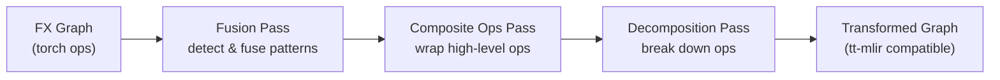
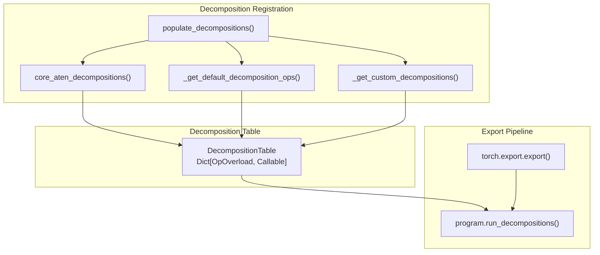
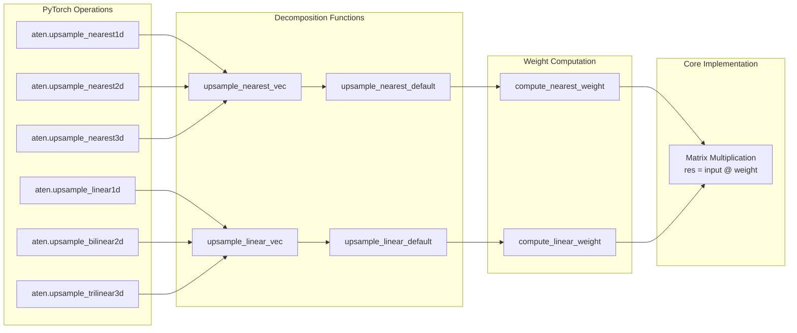
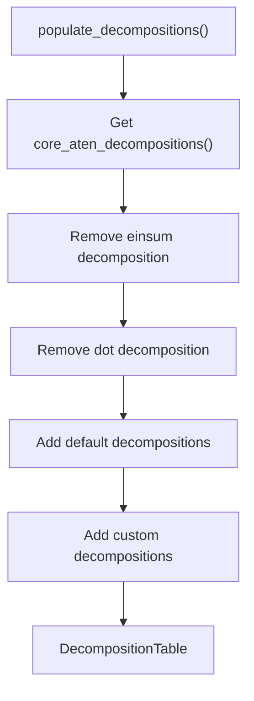
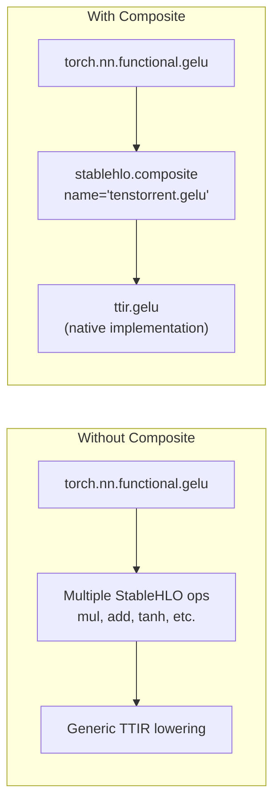
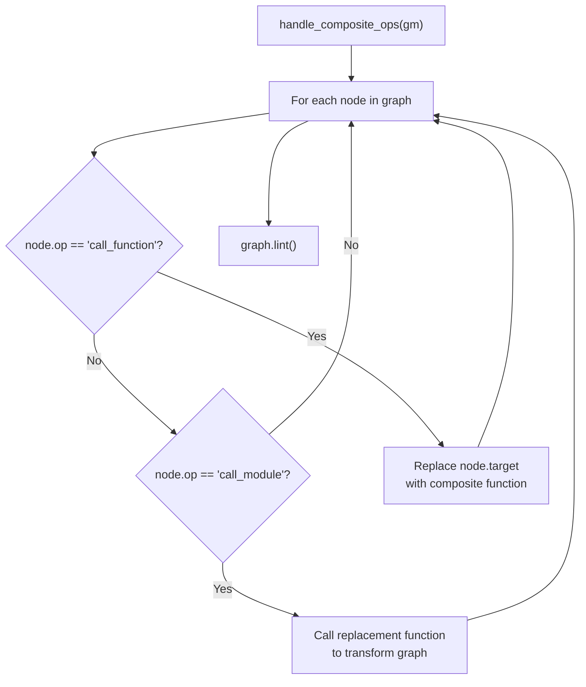
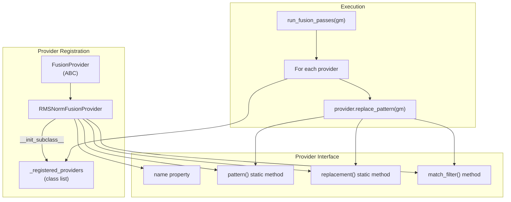
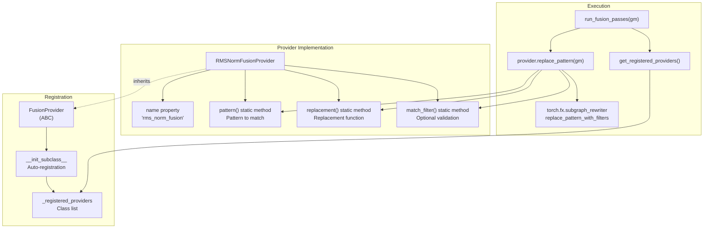
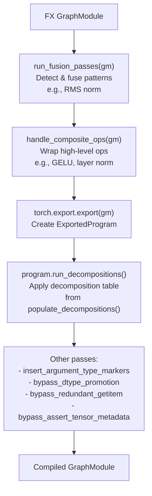

# Custom Operations and Decompositions

Relevant source files
*   [examples/pytorch/llama.py](https://github.com/tenstorrent/tt-xla/blob/c77995f6/examples/pytorch/llama.py)
*   [python_package/jax_plugin_tt/__init__.py](https://github.com/tenstorrent/tt-xla/blob/c77995f6/python_package/jax_plugin_tt/__init__.py)
*   [python_package/pjrt_plugin_tt/__init__.py](https://github.com/tenstorrent/tt-xla/blob/c77995f6/python_package/pjrt_plugin_tt/__init__.py)
*   [python_package/requirements.txt](https://github.com/tenstorrent/tt-xla/blob/c77995f6/python_package/requirements.txt)
*   [python_package/torch_plugin_tt/__init__.py](https://github.com/tenstorrent/tt-xla/blob/c77995f6/python_package/torch_plugin_tt/__init__.py)
*   [python_package/tt_torch/backend/backend.py](https://github.com/tenstorrent/tt-xla/blob/c77995f6/python_package/tt_torch/backend/backend.py)
*   [python_package/tt_torch/backend/decompositions.py](https://github.com/tenstorrent/tt-xla/blob/c77995f6/python_package/tt_torch/backend/decompositions.py)
*   [python_package/tt_torch/backend/metadata_propagation.py](https://github.com/tenstorrent/tt-xla/blob/c77995f6/python_package/tt_torch/backend/metadata_propagation.py)
*   [python_package/tt_torch/backend/passes.py](https://github.com/tenstorrent/tt-xla/blob/c77995f6/python_package/tt_torch/backend/passes.py)
*   [python_package/tt_torch/composite_ops.py](https://github.com/tenstorrent/tt-xla/blob/c77995f6/python_package/tt_torch/composite_ops.py)
*   [python_package/tt_torch/fusion_providers.py](https://github.com/tenstorrent/tt-xla/blob/c77995f6/python_package/tt_torch/fusion_providers.py)
*   [python_package/ttxla_tools/logging.py](https://github.com/tenstorrent/tt-xla/blob/c77995f6/python_package/ttxla_tools/logging.py)
*   [tests/infra/utilities/torch_multichip_utils.py](https://github.com/tenstorrent/tt-xla/blob/c77995f6/tests/infra/utilities/torch_multichip_utils.py)
*   [tests/torch/graphs/test_attention.py](https://github.com/tenstorrent/tt-xla/blob/c77995f6/tests/torch/graphs/test_attention.py)
*   [tests/torch/graphs/test_decoder_layer.py](https://github.com/tenstorrent/tt-xla/blob/c77995f6/tests/torch/graphs/test_decoder_layer.py)
*   [tests/torch/graphs/test_mlp.py](https://github.com/tenstorrent/tt-xla/blob/c77995f6/tests/torch/graphs/test_mlp.py)
*   [tests/torch/graphs/test_rms_norm.py](https://github.com/tenstorrent/tt-xla/blob/c77995f6/tests/torch/graphs/test_rms_norm.py)
*   [tests/torch/graphs/test_rotary_emb.py](https://github.com/tenstorrent/tt-xla/blob/c77995f6/tests/torch/graphs/test_rotary_emb.py)
*   [tests/torch/models/llama3/test_llama_step_n300.py](https://github.com/tenstorrent/tt-xla/blob/c77995f6/tests/torch/models/llama3/test_llama_step_n300.py)
*   [tests/torch/multi_host/__init__.py](https://github.com/tenstorrent/tt-xla/blob/c77995f6/tests/torch/multi_host/__init__.py)
*   [tests/torch/multi_host/llmbox/__init__.py](https://github.com/tenstorrent/tt-xla/blob/c77995f6/tests/torch/multi_host/llmbox/__init__.py)
*   [tests/torch/ops/test_fusion_ops.py](https://github.com/tenstorrent/tt-xla/blob/c77995f6/tests/torch/ops/test_fusion_ops.py)
*   [venv/requirements-dev.txt](https://github.com/tenstorrent/tt-xla/blob/c77995f6/venv/requirements-dev.txt)

This page documents the custom operation decompositions, composite operations, and fusion patterns in the PyTorch/XLA backend. These transformations bridge the gap between PyTorch operations and TT-MLIR's supported operation set by either breaking down complex operations into simpler primitives (decompositions) or combining multiple operations into single composite operations (fusion).

For information about the broader graph transformation pipeline that coordinates these passes, see [Graph Transformation Pipeline](https://deepwiki.com/tenstorrent/tt-xla/5.1.1-graph-transformation-pipeline).

## System Overview

The custom operations and decompositions system operates in three stages during graph compilation:

**Diagram: Three-stage transformation pipeline for custom operations**

Sources: [python_package/tt_torch/backend/backend.py 37-96](https://github.com/tenstorrent/tt-xla/blob/c77995f6/python_package/tt_torch/backend/backend.py#L37-L96)

The pipeline executes transformations in this order:

| Stage | Purpose | Implementation |
| --- | --- | --- |
| Fusion Passes | Detect multi-op patterns (e.g., RMS norm) and fuse them | `run_fusion_passes()` |
| Composite Ops | Wrap supported high-level ops (GELU, layer norm) as StableHLO composites | `handle_composite_ops()` |
| Decompositions | Break down unsupported ops into primitive operations | `populate_decompositions()` |

Sources: [python_package/tt_torch/backend/backend.py 43-68](https://github.com/tenstorrent/tt-xla/blob/c77995f6/python_package/tt_torch/backend/backend.py#L43-L68)




**Diagram: Three-stage transformation pipeline for custom operations**

Sources: [python_package/tt_torch/backend/backend.py:37-96]()

The pipeline executes transformations in this order:

| Stage | Purpose | Implementation |
|-------|---------|----------------|
| Fusion Passes | Detect multi-op patterns (e.g., RMS norm) and fuse them | `run_fusion_passes()` |
| Composite Ops | Wrap supported high-level ops (GELU, layer norm) as StableHLO composites | `handle_composite_ops()` |
| Decompositions | Break down unsupported ops into primitive operations | `populate_decompositions()` |

Sources: [python_package/tt_torch/backend/backend.py:43-68]()
```
## Decomposition System

### Architecture

The decomposition system extends PyTorch's default decomposition table with custom implementations optimized for TT hardware constraints:

**Diagram: Decomposition system architecture showing registration and execution flow**

Sources: [python_package/tt_torch/backend/decompositions.py 382-398](https://github.com/tenstorrent/tt-xla/blob/c77995f6/python_package/tt_torch/backend/decompositions.py#L382-L398)[python_package/tt_torch/backend/backend.py 61-68](https://github.com/tenstorrent/tt-xla/blob/c77995f6/python_package/tt_torch/backend/backend.py#L61-L68)




**Diagram: Decomposition system architecture showing registration and execution flow**

Sources: [python_package/tt_torch/backend/decompositions.py:382-398](), [python_package/tt_torch/backend/backend.py:61-68]()
```
### Custom Decomposition Categories

#### Interpolation Operations

Interpolation operations (upsample) are decomposed into matrix multiplications against constant weight tensors to avoid `gather` operations that TT-MLIR cannot efficiently lower:

**Diagram: Interpolation decomposition hierarchy showing operation mapping to matmul-based implementations**

The linear interpolation implementation is derived from JAX's `jax.image.resize` and modified to support PyTorch's `align_corners=True` mode:

Sources: [python_package/tt_torch/backend/decompositions.py 17-182](https://github.com/tenstorrent/tt-xla/blob/c77995f6/python_package/tt_torch/backend/decompositions.py#L17-L182)[python_package/tt_torch/backend/decompositions.py 358-369](https://github.com/tenstorrent/tt-xla/blob/c77995f6/python_package/tt_torch/backend/decompositions.py#L358-L369)

Key functions:

*   `compute_linear_weight()` [25-60]: Generates interpolation weight matrix
*   `compute_nearest_weight()` [63-72]: Generates nearest-neighbor weight matrix
*   `upsample_linear()` [75-100]: Applies successive 1D interpolations via matmul

#### Matrix Operations

High-dimensional matrix multiplication is decomposed into `einsum` to preserve sharding specifications in SPMD mode:

This decomposition prevents PyTorch from folding batch dimensions (which breaks shard spec propagation in head-parallel attention) and returns `NotImplemented` for lower-dimensional cases to fall back to default behavior.

Sources: [python_package/tt_torch/backend/decompositions.py 259-278](https://github.com/tenstorrent/tt-xla/blob/c77995f6/python_package/tt_torch/backend/decompositions.py#L259-L278)[python_package/tt_torch/backend/decompositions.py 385-393](https://github.com/tenstorrent/tt-xla/blob/c77995f6/python_package/tt_torch/backend/decompositions.py#L385-L393)

#### Type Conversion and Copying

The `aten.copy.default` operation receives a custom decomposition to handle broadcast semantics correctly with functional tensors:

This is necessary because functional tensors with XLA can return incorrect shapes with the native `copy.default` implementation.

Sources: [python_package/tt_torch/backend/decompositions.py 292-315](https://github.com/tenstorrent/tt-xla/blob/c77995f6/python_package/tt_torch/backend/decompositions.py#L292-L315)

#### Boolean Operations

Boolean bitwise operations are converted to logical operations when both operands have `bool` dtype:

| PyTorch Operation | Decomposition Target | Condition |
| --- | --- | --- |
| `aten.bitwise_and.Tensor` | `torch.logical_and()` | Both inputs are `torch.bool` |
| `aten.bitwise_or.Tensor` | `torch.logical_or()` | Both inputs are `torch.bool` |

Sources: [python_package/tt_torch/backend/decompositions.py 280-289](https://github.com/tenstorrent/tt-xla/blob/c77995f6/python_package/tt_torch/backend/decompositions.py#L280-L289)[python_package/tt_torch/backend/decompositions.py 377-378](https://github.com/tenstorrent/tt-xla/blob/c77995f6/python_package/tt_torch/backend/decompositions.py#L377-L378)




**Diagram: Interpolation decomposition hierarchy showing operation mapping to matmul-based implementations**

The linear interpolation implementation is derived from JAX's `jax.image.resize` and modified to support PyTorch's `align_corners=True` mode:

Sources: [python_package/tt_torch/backend/decompositions.py:17-182](), [python_package/tt_torch/backend/decompositions.py:358-369]()

Key functions:
- `compute_linear_weight()` [25-60]: Generates interpolation weight matrix
- `compute_nearest_weight()` [63-72]: Generates nearest-neighbor weight matrix  
- `upsample_linear()` [75-100]: Applies successive 1D interpolations via matmul

#### Matrix Operations

High-dimensional matrix multiplication is decomposed into `einsum` to preserve sharding specifications in SPMD mode:

```python
```
### Decomposition Registration

The `populate_decompositions()` function builds the final decomposition table:

**Diagram: Decomposition table construction pipeline**

Notable removals from default decompositions:

*   `torch.ops.aten.einsum.default` - Removed because custom matmul decomposition uses einsum, and PyTorch's bmm folding breaks SPMD shard specs
*   `torch.ops.aten.dot.default` - Removed because StableHLO lowering was incorrect; replaced with custom dot→matmul decomposition

Sources: [python_package/tt_torch/backend/decompositions.py 382-398](https://github.com/tenstorrent/tt-xla/blob/c77995f6/python_package/tt_torch/backend/decompositions.py#L382-L398)




**Diagram: Decomposition table construction pipeline**

Notable removals from default decompositions:
- `torch.ops.aten.einsum.default` - Removed because custom matmul decomposition uses einsum, and PyTorch's bmm folding breaks SPMD shard specs
- `torch.ops.aten.dot.default` - Removed because StableHLO lowering was incorrect; replaced with custom dot→matmul decomposition

Sources: [python_package/tt_torch/backend/decompositions.py:382-398]()
```
## Composite Operations

### Purpose and Mechanism

Composite operations wrap multi-op patterns into single StableHLO composite operations using `StableHLOCompositeBuilder`. This allows TT-MLIR to recognize and handle high-level operations with specialized implementations rather than processing decomposed primitive sequences.

**Diagram: Composite operations enable native TT-MLIR implementations**

Sources: [python_package/tt_torch/composite_ops.py 1-25](https://github.com/tenstorrent/tt-xla/blob/c77995f6/python_package/tt_torch/composite_ops.py#L1-L25)




**Diagram: Composite operations enable native TT-MLIR implementations**

Sources: [python_package/tt_torch/composite_ops.py:1-25]()
```
### Composite Operation Implementations

#### GELU Composite

The GELU activation function is wrapped as `tenstorrent.gelu` or `tenstorrent.gelu_tanh`:

Sources: [python_package/tt_torch/composite_ops.py 30-47](https://github.com/tenstorrent/tt-xla/blob/c77995f6/python_package/tt_torch/composite_ops.py#L30-L47)

#### RMS Normalization Composite

RMS normalization (used in Llama and similar architectures) is wrapped as `tenstorrent.rms_norm`:

Sources: [python_package/tt_torch/composite_ops.py 50-79](https://github.com/tenstorrent/tt-xla/blob/c77995f6/python_package/tt_torch/composite_ops.py#L50-L79)

#### Layer Normalization Composite

Layer normalization is wrapped as `tenstorrent.layer_norm` and handles both function and module forms:

**Function replacement:**

**Module replacement:**

For `nn.LayerNorm` modules (which appear as `call_module` nodes), the graph is transformed:

```
BEFORE: %out = call_module<FileRef file-url="https://github.com/tenstorrent/tt-xla/blob/c77995f6/target=layer_norm" undefined  file-path="target=layer_norm">Hii</FileRef>)

AFTER:  %weight = get_attr[target=layer_norm.weight]
        %bias = get_attr[target=layer_norm.bias]
        %out = call_function<FileRef file-url="https://github.com/tenstorrent/tt-xla/blob/c77995f6/target=composite_layer_norm" undefined  file-path="target=composite_layer_norm">Hii</FileRef>
            kwargs={normalized_shape: (768,), weight: %weight,
                    bias: %bias, eps: 1e-5}
        )
```

This transformation extracts parameters as separate `get_attr` nodes and replaces the module call with a function call.

Sources: [python_package/tt_torch/composite_ops.py 82-186](https://github.com/tenstorrent/tt-xla/blob/c77995f6/python_package/tt_torch/composite_ops.py#L82-L186)

### Composite Operation Pass

The `handle_composite_ops()` pass replaces operations from the `replacements` dictionary:

**Diagram: Composite operation replacement logic**

The replacements dictionary maps operations to their composite implementations:

Sources: [python_package/tt_torch/backend/passes.py 34-58](https://github.com/tenstorrent/tt-xla/blob/c77995f6/python_package/tt_torch/backend/passes.py#L34-L58)[python_package/tt_torch/composite_ops.py 194-202](https://github.com/tenstorrent/tt-xla/blob/c77995f6/python_package/tt_torch/composite_ops.py#L194-L202)




**Diagram: Composite operation replacement logic**

The replacements dictionary maps operations to their composite implementations:

```python
replacements = {
    # Function replacements
    torch.nn.functional.gelu: composite_gelu,
    torch.rms_norm: composite_rms_norm,
    torch.nn.functional.rms_norm: composite_rms_norm,
    torch.nn.functional.layer_norm: composite_layer_norm,
    # Module replacements
    torch.nn.LayerNorm: replace_layer_norm_module,
}
```

Sources: [python_package/tt_torch/backend/passes.py:34-58](), [python_package/tt_torch/composite_ops.py:194-202]()
```
## Fusion Passes

Fusion passes detect multi-op patterns in the graph and replace them with single composite operations. This happens **before** the composite ops pass to allow fusion patterns to be wrapped as composites.

### Fusion Provider Architecture

The fusion system uses a provider pattern with automatic registration:

**Diagram: Fusion provider architecture with automatic registration**

Sources: [python_package/tt_torch/fusion_providers.py 20-91](https://github.com/tenstorrent/tt-xla/blob/c77995f6/python_package/tt_torch/fusion_providers.py#L20-L91)




**Diagram: Fusion provider architecture with automatic registration**

Sources: [python_package/tt_torch/fusion_providers.py:20-91]()
```



### RMS Normalization Fusion

The RMS norm fusion provider detects the pattern used in LlamaRMSNorm and replaces it with `torch.nn.functional.rms_norm`:

**Pattern matched:**

**Implementation details:**

The pattern function uses method calls (`.add()`, `.mul()`) instead of operators (`+`, `*`) because Dynamo traces tensor operations as `call_method` nodes:

The `dtype` parameter serves as a wildcard that matches any dtype value in the graph.

**Match filter:**

The fusion includes a match filter to prevent fusion when the weight size exceeds hardware limitations:

This limitation exists because TT-Metal currently only supports splitting work across multiple cores on the row axis, not the column axis. This filter should be removed once column-axis parallelism is supported.

Sources: [python_package/tt_torch/fusion_providers.py 97-165](https://github.com/tenstorrent/tt-xla/blob/c77995f6/python_package/tt_torch/fusion_providers.py#L97-L165)[tests/torch/ops/test_fusion_ops.py 14-39](https://github.com/tenstorrent/tt-xla/blob/c77995f6/tests/torch/ops/test_fusion_ops.py#L14-L39)

## Integration in Compilation Pipeline

The custom operations and decompositions integrate into the PyTorch compilation pipeline through `torch_pass_pipeline()`:

**Diagram: Custom operations integration in torch_pass_pipeline**

The ordering is critical:

1.   **Fusion passes** run first to detect and fuse multi-op patterns
2.   **Composite ops** wrap fused patterns and individual high-level ops
3.   **Decompositions** break down remaining unsupported operations

This ensures that fusion patterns can be wrapped as composites, and decompositions only apply to operations that weren't fused or wrapped.

Sources: [python_package/tt_torch/backend/backend.py 37-96](https://github.com/tenstorrent/tt-xla/blob/c77995f6/python_package/tt_torch/backend/backend.py#L37-L96)




**Diagram: Custom operations integration in torch_pass_pipeline**

The ordering is critical:
1. **Fusion passes** run first to detect and fuse multi-op patterns
2. **Composite ops** wrap fused patterns and individual high-level ops
3. **Decompositions** break down remaining unsupported operations

This ensures that fusion patterns can be wrapped as composites, and decompositions only apply to operations that weren't fused or wrapped.

Sources: [python_package/tt_torch/backend/backend.py:37-96]()
```
### Configuration Options

The pipeline supports configuration flags to enable/disable transformations:

| Option | Default | Purpose |
| --- | --- | --- |
| `tt_enable_torch_fx_fusion_pass` | `True` | Enable fusion pattern detection |
| `tt_enable_composite_ops` | `True` | Enable composite operation wrapping |

These options are passed to `torch.compile(backend="tt", options={...})` and control whether the respective passes execute.

Sources: [python_package/tt_torch/backend/backend.py 45-59](https://github.com/tenstorrent/tt-xla/blob/c77995f6/python_package/tt_torch/backend/backend.py#L45-L59)

Dismiss
Refresh this wiki

Enter email to refresh
