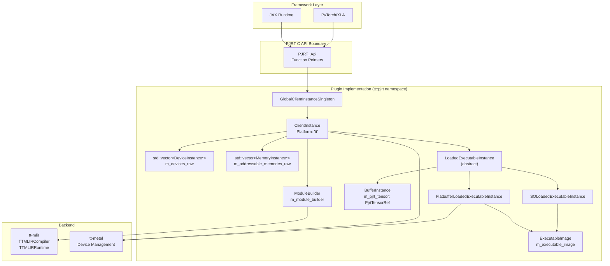
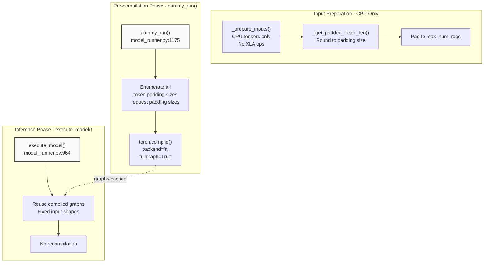
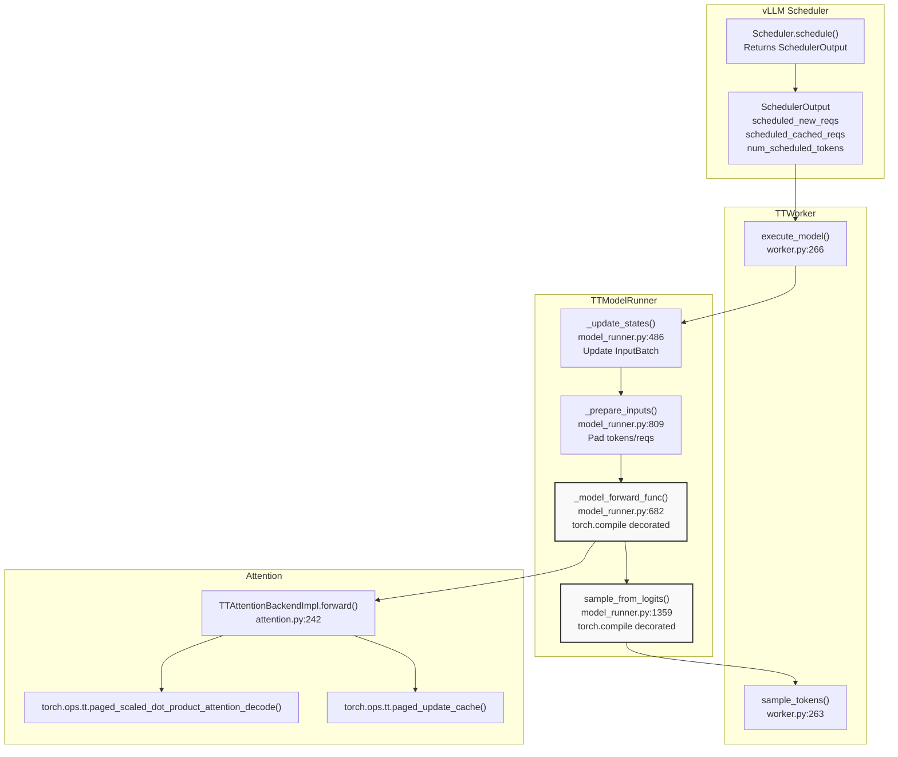
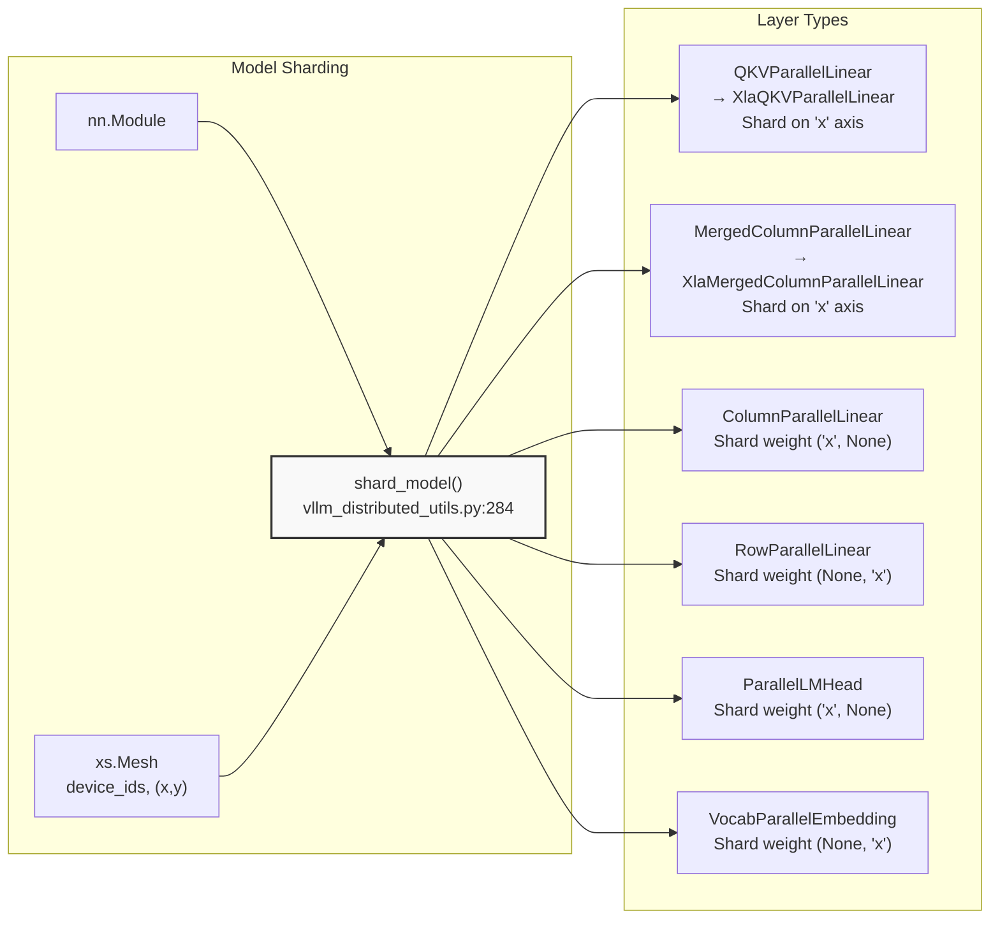
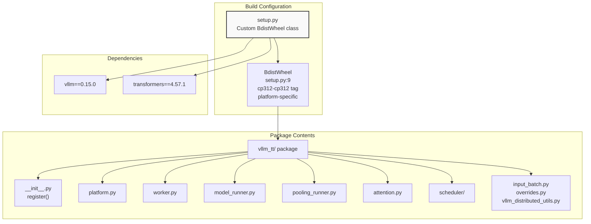

# vLLM Integration

Relevant source files
*   [integrations/vllm_plugin/requirements-vllm-plugin.txt](https://github.com/tenstorrent/tt-xla/blob/c77995f6/integrations/vllm_plugin/requirements-vllm-plugin.txt)
*   [integrations/vllm_plugin/setup.py](https://github.com/tenstorrent/tt-xla/blob/c77995f6/integrations/vllm_plugin/setup.py)
*   [integrations/vllm_plugin/vllm_tt/__init__.py](https://github.com/tenstorrent/tt-xla/blob/c77995f6/integrations/vllm_plugin/vllm_tt/__init__.py)
*   [integrations/vllm_plugin/vllm_tt/attention.py](https://github.com/tenstorrent/tt-xla/blob/c77995f6/integrations/vllm_plugin/vllm_tt/attention.py)
*   [integrations/vllm_plugin/vllm_tt/input_batch.py](https://github.com/tenstorrent/tt-xla/blob/c77995f6/integrations/vllm_plugin/vllm_tt/input_batch.py)
*   [integrations/vllm_plugin/vllm_tt/model_runner.py](https://github.com/tenstorrent/tt-xla/blob/c77995f6/integrations/vllm_plugin/vllm_tt/model_runner.py)
*   [integrations/vllm_plugin/vllm_tt/overrides.py](https://github.com/tenstorrent/tt-xla/blob/c77995f6/integrations/vllm_plugin/vllm_tt/overrides.py)
*   [integrations/vllm_plugin/vllm_tt/platform.py](https://github.com/tenstorrent/tt-xla/blob/c77995f6/integrations/vllm_plugin/vllm_tt/platform.py)
*   [integrations/vllm_plugin/vllm_tt/pooling_runner.py](https://github.com/tenstorrent/tt-xla/blob/c77995f6/integrations/vllm_plugin/vllm_tt/pooling_runner.py)
*   [integrations/vllm_plugin/vllm_tt/scheduler/ascend_scheduler.py](https://github.com/tenstorrent/tt-xla/blob/c77995f6/integrations/vllm_plugin/vllm_tt/scheduler/ascend_scheduler.py)
*   [integrations/vllm_plugin/vllm_tt/vllm_distributed_utils.py](https://github.com/tenstorrent/tt-xla/blob/c77995f6/integrations/vllm_plugin/vllm_tt/vllm_distributed_utils.py)
*   [integrations/vllm_plugin/vllm_tt/worker.py](https://github.com/tenstorrent/tt-xla/blob/c77995f6/integrations/vllm_plugin/vllm_tt/worker.py)

## Purpose and Scope

This document describes the vLLM integration layer that enables serving large language models on Tenstorrent hardware through the vLLM inference engine. The integration is implemented as a vLLM platform plugin (`vllm_tt`) that provides all necessary components for LLM inference: platform detection, device management, model execution, attention mechanisms, and sampling.

The vLLM plugin supports both **generation tasks** (text completion/chat) via `TTModelRunner` and **pooling tasks** (embeddings) via `TTPoolingModelRunner`. It implements compilation optimization strategies to minimize graph recompilation during inference, including pre-compilation with padded input shapes and fixed-shape execution.

For detailed information on specific subsystems:

*   Platform, worker, and model runner implementation: see [Platform, Worker, and Model Runners](https://deepwiki.com/tenstorrent/tt-xla/5.3.1-platform-worker-and-model-runners)
*   Sampling and token generation details: see [Sampling and Token Generation](https://deepwiki.com/tenstorrent/tt-xla/5.3.2-sampling-and-token-generation)
*   PyTorch/XLA backend compilation: see [PyTorch/XLA Backend](https://deepwiki.com/tenstorrent/tt-xla/5.1-pytorchxla-backend)
*   JAX backend details: see [JAX Backend](https://deepwiki.com/tenstorrent/tt-xla/5.2-jax-backend)

## Plugin Architecture



**Core Components:**

- **`GlobalClientInstanceSingleton`**: Ensures a single `ClientInstance` per process, critical for proper device cleanup on process termination (workaround for frameworks not calling `PJRT_Client_Destroy` properly)
- **`ClientInstance`**: Manages the platform state, device/memory discovery, mesh device lifecycle, and compilation requests
- **`DeviceInstance`**: Represents a single Tenstorrent chip, tracks addressability and process ownership
- **`MemoryInstance`**: Represents host or device memory spaces
- **`BufferInstance`**: Wraps input/output tensors, manages data transfer between host and device
- **`LoadedExecutableInstance`**: Abstract base for executable execution (flatbuffer or shared object backends)
- **`ExecutableImage`**: Shared compilation artifact containing flatbuffer binary, metadata, and compile options
```


The vLLM plugin is structured as a Python package that vLLM discovers and loads through its plugin system. The plugin provides custom implementations of vLLM's platform, worker, model runner, attention backend, and scheduler interfaces.

**Plugin Registration and Discovery**

**Sources:**[integrations/vllm_plugin/setup.py 46-60](https://github.com/tenstorrent/tt-xla/blob/c77995f6/integrations/vllm_plugin/setup.py#L46-L60)[integrations/vllm_plugin/vllm_tt/__init__.py 16-19](https://github.com/tenstorrent/tt-xla/blob/c77995f6/integrations/vllm_plugin/vllm_tt/__init__.py#L16-L19)

The plugin registers itself through Python entry points in `setup.py`, defining `vllm.platform_plugins` with the key `tt` mapping to `vllm_tt:register`. When vLLM initializes, it calls the `register()` function which returns the path to `TTPlatform`.

## Core Components

**Component Hierarchy**

**Sources:**[integrations/vllm_plugin/vllm_tt/platform.py 81-311](https://github.com/tenstorrent/tt-xla/blob/c77995f6/integrations/vllm_plugin/vllm_tt/platform.py#L81-L311)[integrations/vllm_plugin/vllm_tt/worker.py 51-359](https://github.com/tenstorrent/tt-xla/blob/c77995f6/integrations/vllm_plugin/vllm_tt/worker.py#L51-L359)[integrations/vllm_plugin/vllm_tt/model_runner.py 206-1478](https://github.com/tenstorrent/tt-xla/blob/c77995f6/integrations/vllm_plugin/vllm_tt/model_runner.py#L206-L1478)[integrations/vllm_plugin/vllm_tt/pooling_runner.py 218-1370](https://github.com/tenstorrent/tt-xla/blob/c77995f6/integrations/vllm_plugin/vllm_tt/pooling_runner.py#L218-L1370)[integrations/vllm_plugin/vllm_tt/attention.py 82-153](https://github.com/tenstorrent/tt-xla/blob/c77995f6/integrations/vllm_plugin/vllm_tt/attention.py#L82-L153)

| Component | File | Responsibility |
| --- | --- | --- |
| `TTPlatform` | [platform.py 81](https://github.com/tenstorrent/tt-xla/blob/c77995f6/platform.py#L81-L81) | Platform detection, config validation, device setup |
| `TTConfig` | [platform.py 40](https://github.com/tenstorrent/tt-xla/blob/c77995f6/platform.py#L40-L40) | Configuration dataclass (const eval, parallelism, optimization) |
| `TTWorker` | [worker.py 51](https://github.com/tenstorrent/tt-xla/blob/c77995f6/worker.py#L51-L51) | Device initialization, memory profiling, model execution coordination |
| `TTModelRunner` | [model_runner.py 206](https://github.com/tenstorrent/tt-xla/blob/c77995f6/model_runner.py#L206-L206) | Text generation model execution, KV cache management |
| `TTPoolingModelRunner` | [pooling_runner.py 218](https://github.com/tenstorrent/tt-xla/blob/c77995f6/pooling_runner.py#L218-L218) | Embedding/pooling model execution |
| `TTAttentionBackend` | [attention.py 82](https://github.com/tenstorrent/tt-xla/blob/c77995f6/attention.py#L82-L82) | Custom attention implementation for TT devices |
| `AscendScheduler` | [scheduler/ascend_scheduler.py 29](https://github.com/tenstorrent/tt-xla/blob/c77995f6/scheduler/ascend_scheduler.py#L29-L29) | Prefill-first scheduling strategy |
| `InputBatch` | [input_batch.py 24](https://github.com/tenstorrent/tt-xla/blob/c77995f6/input_batch.py#L24-L24) | Persistent batch state management |

## Configuration System

The `TTConfig` dataclass exposes configuration options that control compilation and execution behavior:

**Configuration Parameters**

**Sources:**[integrations/vllm_plugin/vllm_tt/platform.py 40-78](https://github.com/tenstorrent/tt-xla/blob/c77995f6/integrations/vllm_plugin/vllm_tt/platform.py#L40-L78)

These configuration options are passed to the PJRT plugin through `get_pjrt_compile_config()` and control tt-mlir compilation behavior. The configuration is specified via `additional_config` in vLLM's initialization.

## Compilation Optimization Strategy




A critical aspect of the vLLM integration is avoiding expensive recompilation during inference. The plugin implements several strategies documented in comments at [model_runner.py 171-205](https://github.com/tenstorrent/tt-xla/blob/c77995f6/model_runner.py#L171-L205) and [pooling_runner.py 183-217](https://github.com/tenstorrent/tt-xla/blob/c77995f6/pooling_runner.py#L183-L217):

**Compilation Avoidance Strategy**

**Sources:**[integrations/vllm_plugin/vllm_tt/model_runner.py 171-205](https://github.com/tenstorrent/tt-xla/blob/c77995f6/integrations/vllm_plugin/vllm_tt/model_runner.py#L171-L205)[integrations/vllm_plugin/vllm_tt/model_runner.py 1175-1294](https://github.com/tenstorrent/tt-xla/blob/c77995f6/integrations/vllm_plugin/vllm_tt/model_runner.py#L1175-L1294)[integrations/vllm_plugin/vllm_tt/model_runner.py 964-1042](https://github.com/tenstorrent/tt-xla/blob/c77995f6/integrations/vllm_plugin/vllm_tt/model_runner.py#L964-L1042)

**Key Principles:**

1.   **CPU-only input preparation**: Avoid XLA operations during input preparation. Use `cpu_tensor.to(xla_device)` which only triggers data transfer, not compilation [model_runner.py 186-189](https://github.com/tenstorrent/tt-xla/blob/c77995f6/model_runner.py#L186-L189)

2.   **Subgraph decomposition**: Split execution into separate compiled subgraphs (model, sampler, encoder) to ensure consistent topology between `dummy_run` and `execute_model`[model_runner.py 191-200](https://github.com/tenstorrent/tt-xla/blob/c77995f6/model_runner.py#L191-L200)

3.   **Comprehensive pre-compilation**: `dummy_run()` must cover all potential input shapes and branch predictions [model_runner.py 203-205](https://github.com/tenstorrent/tt-xla/blob/c77995f6/model_runner.py#L203-L205)

**Token Padding Computation**

The `_get_token_paddings()` function generates a list of valid padding sizes from `min_context_len` to `max_model_len`, typically using power-of-2 or similar alignment. During inference, input token counts are rounded up to the nearest padding size to ensure consistent graph shapes.

**Sources:**[integrations/vllm_plugin/vllm_tt/model_runner.py 286-293](https://github.com/tenstorrent/tt-xla/blob/c77995f6/integrations/vllm_plugin/vllm_tt/model_runner.py#L286-L293)

## Request Processing Flow




**End-to-End Request Flow**

**Sources:**[integrations/vllm_plugin/vllm_tt/worker.py 263-270](https://github.com/tenstorrent/tt-xla/blob/c77995f6/integrations/vllm_plugin/vllm_tt/worker.py#L263-L270)[integrations/vllm_plugin/vllm_tt/model_runner.py 486-624](https://github.com/tenstorrent/tt-xla/blob/c77995f6/integrations/vllm_plugin/vllm_tt/model_runner.py#L486-L624)[integrations/vllm_plugin/vllm_tt/model_runner.py 809-962](https://github.com/tenstorrent/tt-xla/blob/c77995f6/integrations/vllm_plugin/vllm_tt/model_runner.py#L809-L962)[integrations/vllm_plugin/vllm_tt/model_runner.py 682-804](https://github.com/tenstorrent/tt-xla/blob/c77995f6/integrations/vllm_plugin/vllm_tt/model_runner.py#L682-L804)[integrations/vllm_plugin/vllm_tt/model_runner.py 1359-1446](https://github.com/tenstorrent/tt-xla/blob/c77995f6/integrations/vllm_plugin/vllm_tt/model_runner.py#L1359-L1446)

**Processing Steps:**

1.   **Schedule**: vLLM's scheduler selects requests to process and returns `SchedulerOutput`
2.   **Update State**: `_update_states()` updates the persistent `InputBatch` with new/finished/preempted requests
3.   **Prepare Inputs**: `_prepare_inputs()` creates padded input tensors with fixed shapes for each request
4.   **Model Forward**: `_model_forward_func()` executes the model (torch.compile decorated) producing logits
5.   **Attention**: During forward pass, custom attention ops handle KV cache updates and attention computation
6.   **Sampling**: `sample_from_logits()` (torch.compile decorated) generates next tokens based on sampling parameters

## Distributed Execution Support




The vLLM plugin supports two forms of parallelism:

**Tensor Parallelism (SPMD)**

Enabled via `TTConfig.enable_tensor_parallel = True`. Uses torch_xla SPMD to shard model weights across devices:

**Sources:**[integrations/vllm_plugin/vllm_tt/vllm_distributed_utils.py 284-317](https://github.com/tenstorrent/tt-xla/blob/c77995f6/integrations/vllm_plugin/vllm_tt/vllm_distributed_utils.py#L284-L317)[integrations/vllm_plugin/vllm_tt/vllm_distributed_utils.py 31-208](https://github.com/tenstorrent/tt-xla/blob/c77995f6/integrations/vllm_plugin/vllm_tt/vllm_distributed_utils.py#L31-L208)

The `shard_model()` function walks the model and replaces vLLM's parallel layers with XLA-sharded equivalents. For example, `QKVParallelLinear` is replaced with `XlaQKVParallelLinear` which explicitly shards Q, K, V weights on the first dimension [vllm_distributed_utils.py 116-207](https://github.com/tenstorrent/tt-xla/blob/c77995f6/vllm_distributed_utils.py#L116-L207)

**Data Parallelism (Pooling Models)**

Enabled via `TTConfig.enable_data_parallel = True` for pooling/embedding models. Requires `batch_size > 1` and `max_num_seqs > 1`. Distributes different requests across devices for parallel processing [pooling_runner.py 254-266](https://github.com/tenstorrent/tt-xla/blob/c77995f6/pooling_runner.py#L254-L266)

## Platform Configuration

The `TTPlatform.check_and_update_config()` method enforces TT-specific constraints:

**Configuration Enforcement**

| Setting | Enforced Value | Reason |
| --- | --- | --- |
| `scheduler_cls` | `vllm_tt.scheduler.AscendScheduler` | Prefill-first scheduling for TT devices |
| `block_size` | `32` (default) | Alignment for TT attention kernels |
| `compilation_mode` | `DYNAMO_TRACE_ONCE` | TT only supports trace-once compilation |
| `cudagraph_mode` | `NONE` | CUDA graphs not supported on TT |
| `backend` | `tt` | Use TT torch.compile backend |
| `dtype` | `bfloat16` | Float16/float32 converted to bfloat16 |

**Sources:**[integrations/vllm_plugin/vllm_tt/platform.py 159-248](https://github.com/tenstorrent/tt-xla/blob/c77995f6/integrations/vllm_plugin/vllm_tt/platform.py#L159-L248)

The platform also disables speculative decoding [platform.py 196-197](https://github.com/tenstorrent/tt-xla/blob/c77995f6/platform.py#L196-L197) forces `disable_chunked_mm_input` for multimodal models [platform.py 226-235](https://github.com/tenstorrent/tt-xla/blob/c77995f6/platform.py#L226-L235) and adjusts batch sizes for MLA models [platform.py 237-247](https://github.com/tenstorrent/tt-xla/blob/c77995f6/platform.py#L237-L247)

## Package Structure




The vLLM plugin is packaged as a Python wheel with custom build configuration:

**Build System**

**Sources:**[integrations/vllm_plugin/setup.py 9-60](https://github.com/tenstorrent/tt-xla/blob/c77995f6/integrations/vllm_plugin/setup.py#L9-L60)[integrations/vllm_plugin/requirements-vllm-plugin.txt 1-3](https://github.com/tenstorrent/tt-xla/blob/c77995f6/integrations/vllm_plugin/requirements-vllm-plugin.txt#L1-L3)

The custom `BdistWheel` class forces Python 3.12 ABI format (`cp312-cp312`) and platform-specific tags [setup.py 34-43](https://github.com/tenstorrent/tt-xla/blob/c77995f6/setup.py#L34-L43) The wheel is marked as non-pure (`root_is_pure = False`) to properly handle native binaries [setup.py 31](https://github.com/tenstorrent/tt-xla/blob/c77995f6/setup.py#L31-L31)

## Module Overrides

The plugin includes compatibility fixes for vLLM layers that cause issues during torch.compile tracing:

**TTRMSNorm Override**

**Sources:**[integrations/vllm_plugin/vllm_tt/overrides.py 16-83](https://github.com/tenstorrent/tt-xla/blob/c77995f6/integrations/vllm_plugin/vllm_tt/overrides.py#L16-L83)[integrations/vllm_plugin/vllm_tt/overrides.py 104-121](https://github.com/tenstorrent/tt-xla/blob/c77995f6/integrations/vllm_plugin/vllm_tt/overrides.py#L104-L121)

The `replace_modules()` function walks the model and replaces incompatible layers. Currently only `RMSNorm` requires replacement [overrides.py 104-121](https://github.com/tenstorrent/tt-xla/blob/c77995f6/overrides.py#L104-L121)

## Attention Backend Implementation

```mermaid
graph TB
    subgraph "Backend Interface"
        Backend["TTAttentionBackend<br/>attention.py:82"]
        GetImplCls["get_impl_cls()<br/>Returns TTAttentionBackendImpl"]
        GetKVCacheShape["get_kv_cache_shape()<br/>(2, num_blocks, num_kv_heads,<br/>block_size, head_size)"]
        GetPageSize["get_page_size()<br/>Returns 32 (fixed)"]
    end
    
    subgraph "Implementation"
        Impl["TTAttentionBackendImpl<br/>attention.py:190"]
        Forward["forward()<br/>Query, Key, Value, KV Cache"]
        ComputeFullAttn["_compute_full_attention()<br/>torch.ops.tt.scaled_dot_product_attention"]
        ComputeDecodeAttn["_compute_decode_attention()<br/>torch.ops.tt.paged_scaled_dot_product_attention_decode"]
    end
    
    subgraph "Metadata"
        Metadata["TTMetadata<br/>attention.py:169"]
        CachePosition["cache_position: Tensor<br/>Current KV cache position"]
        AttnMask["attn_mask: Tensor<br/>Attention mask"]
        PageTable["page_table: Tensor<br/>Block mapping table"]
    end
    
    Backend --> GetImplCls
    GetImplCls --> Impl
    Backend --> GetKVCacheShape
    Backend --> GetPageSize
    
    Impl --> Forward
    Forward --> ComputeFullAttn
    Forward --> ComputeDecodeAttn
    Forward --> Metadata
    
    Metadata --> CachePosition
    Metadata --> AttnMask
    Metadata --> PageTable
    
    style Backend fill:#f9f9f9,stroke:#333,stroke-width:2px
    style Impl fill:#f9f9f9,stroke:#333,stroke-width:2px
```


The `TTAttentionBackend` provides custom attention kernels optimized for TT devices:

**Attention Backend Structure**

**Sources:**[integrations/vllm_plugin/vllm_tt/attention.py 82-153](https://github.com/tenstorrent/tt-xla/blob/c77995f6/integrations/vllm_plugin/vllm_tt/attention.py#L82-L153)[integrations/vllm_plugin/vllm_tt/attention.py 190-560](https://github.com/tenstorrent/tt-xla/blob/c77995f6/integrations/vllm_plugin/vllm_tt/attention.py#L190-L560)[integrations/vllm_plugin/vllm_tt/attention.py 169-187](https://github.com/tenstorrent/tt-xla/blob/c77995f6/integrations/vllm_plugin/vllm_tt/attention.py#L169-L187)

The attention backend uses custom XLA ops for paged attention:

*   `torch.ops.tt.scaled_dot_product_attention` for prefill (full attention)
*   `torch.ops.tt.paged_scaled_dot_product_attention_decode` for decode (single-token attention)
*   `torch.ops.tt.paged_update_cache` / `torch.ops.tt.paged_fill_cache` for KV cache updates

The KV cache shape is `[2, num_blocks, num_kv_heads, block_size, head_size]` where the first dimension separates keys (index 0) and values (index 1) [attention.py 98-104](https://github.com/tenstorrent/tt-xla/blob/c77995f6/attention.py#L98-L104)

Dismiss
Refresh this wiki

Enter email to refresh