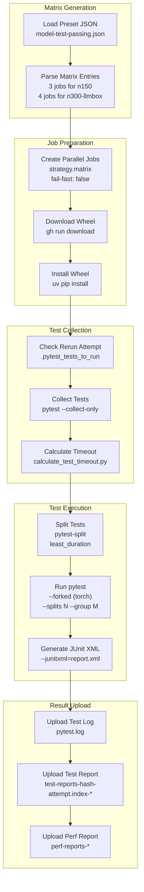

# Platform, Worker, and Model Runners

Relevant source files
*   [integrations/vllm_plugin/requirements-vllm-plugin.txt](https://github.com/tenstorrent/tt-xla/blob/c77995f6/integrations/vllm_plugin/requirements-vllm-plugin.txt)
*   [integrations/vllm_plugin/setup.py](https://github.com/tenstorrent/tt-xla/blob/c77995f6/integrations/vllm_plugin/setup.py)
*   [integrations/vllm_plugin/vllm_tt/__init__.py](https://github.com/tenstorrent/tt-xla/blob/c77995f6/integrations/vllm_plugin/vllm_tt/__init__.py)
*   [integrations/vllm_plugin/vllm_tt/attention.py](https://github.com/tenstorrent/tt-xla/blob/c77995f6/integrations/vllm_plugin/vllm_tt/attention.py)
*   [integrations/vllm_plugin/vllm_tt/input_batch.py](https://github.com/tenstorrent/tt-xla/blob/c77995f6/integrations/vllm_plugin/vllm_tt/input_batch.py)
*   [integrations/vllm_plugin/vllm_tt/model_runner.py](https://github.com/tenstorrent/tt-xla/blob/c77995f6/integrations/vllm_plugin/vllm_tt/model_runner.py)
*   [integrations/vllm_plugin/vllm_tt/overrides.py](https://github.com/tenstorrent/tt-xla/blob/c77995f6/integrations/vllm_plugin/vllm_tt/overrides.py)
*   [integrations/vllm_plugin/vllm_tt/platform.py](https://github.com/tenstorrent/tt-xla/blob/c77995f6/integrations/vllm_plugin/vllm_tt/platform.py)
*   [integrations/vllm_plugin/vllm_tt/pooling_runner.py](https://github.com/tenstorrent/tt-xla/blob/c77995f6/integrations/vllm_plugin/vllm_tt/pooling_runner.py)
*   [integrations/vllm_plugin/vllm_tt/scheduler/ascend_scheduler.py](https://github.com/tenstorrent/tt-xla/blob/c77995f6/integrations/vllm_plugin/vllm_tt/scheduler/ascend_scheduler.py)
*   [integrations/vllm_plugin/vllm_tt/vllm_distributed_utils.py](https://github.com/tenstorrent/tt-xla/blob/c77995f6/integrations/vllm_plugin/vllm_tt/vllm_distributed_utils.py)
*   [integrations/vllm_plugin/vllm_tt/worker.py](https://github.com/tenstorrent/tt-xla/blob/c77995f6/integrations/vllm_plugin/vllm_tt/worker.py)

This page documents the vLLM integration layer that enables serving language models on Tenstorrent hardware. It covers four interdependent classes — `TTPlatform`, `TTWorker`, `TTModelRunner`, and `TTPoolingModelRunner` — along with `TTAttentionBackend`, which implements paged attention for this stack. These components live entirely in the `vllm_tt` package under `integrations/vllm_plugin/`.

For an overview of the vLLM integration as a whole (plugin registration, `TTConfig` propagation from the CLI), see [5.3](https://github.com/tenstorrent/tt-xla/blob/c77995f6/5.3) For sampling and token generation specifics handled after `execute_model`, see [5.3.2](https://github.com/tenstorrent/tt-xla/blob/c77995f6/5.3.2)

* * *

## Component Overview

**Diagram: Class Hierarchy and Instantiation Flow**

Sources: [integrations/vllm_plugin/vllm_tt/__init__.py 1-19](https://github.com/tenstorrent/tt-xla/blob/c77995f6/integrations/vllm_plugin/vllm_tt/__init__.py#L1-L19)[integrations/vllm_plugin/vllm_tt/platform.py 81-317](https://github.com/tenstorrent/tt-xla/blob/c77995f6/integrations/vllm_plugin/vllm_tt/platform.py#L81-L317)[integrations/vllm_plugin/vllm_tt/worker.py 51-178](https://github.com/tenstorrent/tt-xla/blob/c77995f6/integrations/vllm_plugin/vllm_tt/worker.py#L51-L178)

* * *

## TTPlatform

`TTPlatform` extends vLLM's `Platform` interface. It is the first class instantiated by vLLM when the `tt` platform plugin is loaded.

**Key class attributes:**

| Attribute | Value | Purpose |
| --- | --- | --- |
| `_enum` | `PlatformEnum.OOT` | Marks as an out-of-tree platform |
| `device_name` | `"xla"` | XLA device string |
| `dispatch_key` | `"XLA"` | PyTorch dispatcher key |
| `dist_backend` | `"gloo"` | CPU-based distributed collectives |
| `simple_compile_backend` | `"tt"` | `torch.compile` backend name |
| `device_control_env_var` | `"TT_VISIBLE_DEVICES"` | Device visibility control |

Sources: [integrations/vllm_plugin/vllm_tt/platform.py 81-97](https://github.com/tenstorrent/tt-xla/blob/c77995f6/integrations/vllm_plugin/vllm_tt/platform.py#L81-L97)

### TTConfig

`TTConfig` is a dataclass populated from `vllm_config.additional_config`. It carries all TT-specific flags that downstream classes consume.

| Field | Default | Purpose |
| --- | --- | --- |
| `enable_const_eval` | `True` | Enable constant folding in tt-mlir |
| `enable_const_eval_on_cpu` | `False` | Hoist const-eval subgraphs to CPU |
| `min_context_len` | `128` | Smallest padded token length for pre-compilation |
| `batch_size` | `1` | Batch size (pooling runner only) |
| `enable_precompile_all` | `True` | Pre-compile all padding shapes during warm-up |
| `enable_data_parallel` | `False` | Data-parallel across devices (pooling, batch_size > 1) |
| `enable_tensor_parallel` | `False` | SPMD tensor parallelism |
| `optimization_level` | `0` | tt-mlir optimization level |
| `experimental_enable_weight_bfp8_conversion` | `False` | BFP8 weight quantization |

`get_pjrt_compile_config()` packages the compilation-relevant fields into a dict that is passed to `torch_xla.set_custom_compile_options()` at runner construction time.

Sources: [integrations/vllm_plugin/vllm_tt/platform.py 39-78](https://github.com/tenstorrent/tt-xla/blob/c77995f6/integrations/vllm_plugin/vllm_tt/platform.py#L39-L78)

### `check_and_update_config`

This classmethod is called by vLLM before any workers are created. It enforces constraints and applies TT-specific defaults:

*   **Compilation mode**: Forces `CompilationMode.DYNAMO_TRACE_ONCE`. CUDA graph support is disabled (`CUDAGraphMode.NONE`).
*   **dtype**: Downgrades `float16` and `float32` to `bfloat16`. TT hardware does not support those as primary compute types.
*   **Block size**: Calls `TTAttentionBackend.get_page_size(vllm_config)` and assigns the result to `cache_config.block_size`. Currently hardcoded to `32`.
*   **Worker class**: Sets `parallel_config.worker_cls = "vllm_tt.worker.TTWorker"`.
*   **Scheduler**: Uses `vllm_tt.scheduler.AscendScheduler` for generation models.
*   **MLA models**: Disables chunked prefill and forces `max_num_batched_tokens >= max_model_len`.
*   **Multimodal**: Forces `disable_chunked_mm_input = True`.

Sources: [integrations/vllm_plugin/vllm_tt/platform.py 159-247](https://github.com/tenstorrent/tt-xla/blob/c77995f6/integrations/vllm_plugin/vllm_tt/platform.py#L159-L247)

### Attention Backend Selection

`get_attn_backend_cls()` always returns `AttentionBackendEnum.CUSTOM.get_path()`, routing all attention through `TTAttentionBackend`. Sparse attention is explicitly rejected.

KV cache block transfer methods (`insert_blocks_to_device`, `swap_out_blocks_to_host`) are implemented as `@torch.compile(backend="tt")` classmethods and use `torch.ops.xla.dynamo_set_buffer_donor_` for efficient in-place XLA buffer management.

Sources: [integrations/vllm_plugin/vllm_tt/platform.py 102-117](https://github.com/tenstorrent/tt-xla/blob/c77995f6/integrations/vllm_plugin/vllm_tt/platform.py#L102-L117)[integrations/vllm_plugin/vllm_tt/platform.py 274-297](https://github.com/tenstorrent/tt-xla/blob/c77995f6/integrations/vllm_plugin/vllm_tt/platform.py#L274-L297)

* * *

## TTWorker

`TTWorker` is the single process-level worker. vLLM instantiates it based on the `worker_cls` set by `TTPlatform.check_and_update_config`.

**Diagram: TTWorker Initialization Sequence**

Sources: [integrations/vllm_plugin/vllm_tt/worker.py 51-302](https://github.com/tenstorrent/tt-xla/blob/c77995f6/integrations/vllm_plugin/vllm_tt/worker.py#L51-L302)

### Device Initialization (`init_device`)

[integrations/vllm_plugin/vllm_tt/worker.py 130-183](https://github.com/tenstorrent/tt-xla/blob/c77995f6/integrations/vllm_plugin/vllm_tt/worker.py#L130-L183)

1.   Calls `xr.set_device_type("TT")` to register the backend.
2.   Initializes the distributed environment (gloo backend for CPU coordination).
3.   If SPMD is enabled, calls `xr.use_spmd()` before environment init.
4.   Sets `torch._dynamo.config.cache_size_limit = 128` to accommodate large graph counts (LLMs can produce 80+ distinct XLA graphs across multiple sequence-length paddings).
5.   Initializes a per-rank XLA persistent compilation cache at `VLLM_XLA_CACHE_PATH/tp{world_size}_rank{rank}`.
6.   Selects runner class: `TTModelRunner` for `runner_type == "generate"`, `TTPoolingModelRunner` for `runner_type == "pooling"`.

### Memory Estimation (`determine_available_memory`)

[integrations/vllm_plugin/vllm_tt/worker.py 185-261](https://github.com/tenstorrent/tt-xla/blob/c77995f6/integrations/vllm_plugin/vllm_tt/worker.py#L185-L261)

Memory estimation has two paths:

*   **Pooling models**: Returns a hardcoded constant (`11596411699` bytes). The PJRT API needed to query actual device memory (`xm.get_memory_info`) is not yet implemented for Tenstorrent devices.
*   **Generation models**: Runs `profile_run` with dummy KV caches to warm up the model, then estimates available KV cache bytes using hardcoded totals (12 GB) and assumes zero current usage. Head size is padded to multiples of `TT_HEAD_SIZE_ALIGNMENT` (32), and the usable byte count is adjusted proportionally.

### SPMD Configuration

When `enable_tensor_parallel` or `enable_data_parallel` is true, `TTWorker.__init__` reduces `parallel_config` world size to 1 and sets the `CONVERT_SHLO_TO_SHARDY` environment variable. This causes torch-xla to convert GSPMD sharding annotations to the Shardy dialect for SPMD execution across multiple TT devices.

Sources: [integrations/vllm_plugin/vllm_tt/worker.py 68-87](https://github.com/tenstorrent/tt-xla/blob/c77995f6/integrations/vllm_plugin/vllm_tt/worker.py#L68-L87)[integrations/vllm_plugin/vllm_tt/worker.py 330-349](https://github.com/tenstorrent/tt-xla/blob/c77995f6/integrations/vllm_plugin/vllm_tt/worker.py#L330-L349)

* * *

## TTModelRunner

`TTModelRunner` handles generation (autoregressive) models. It inherits from `LoRAModelRunnerMixin` and `KVConnectorModelRunnerMixin`.

### Initialization

[integrations/vllm_plugin/vllm_tt/model_runner.py 205-451](https://github.com/tenstorrent/tt-xla/blob/c77995f6/integrations/vllm_plugin/vllm_tt/model_runner.py#L205-L451)

**Padding Strategy**

The core challenge for XLA compilation is avoiding recompilation when input shapes change. `TTModelRunner` pre-computes a fixed list of allowed token-count shapes, `num_tokens_paddings`, via `_get_token_paddings(min_context_len, max_model_len)`. Each unique padded shape produces one compiled XLA graph. At runtime, the actual token count is rounded up to the next entry in this list.

The runner also caps the number of concurrent requests per padding tier based on SMEM constraints:

```
num_reqs_max_model_len = min(
    TTAttentionBackend.get_max_num_seqs(max_model_len, block_size),
    max_num_reqs
)
```

**Tensor Parallel Setup**

If `enable_tensor_parallel` is set, the runner creates an SPMD mesh:

**Sampler Compilation**

The `sample_from_logits` function is compiled with `torch.compile(backend="tt", fullgraph=True, dynamic=False)` unless tensor parallel is active (SPMD mode handles compilation differently).

Sources: [integrations/vllm_plugin/vllm_tt/model_runner.py 205-451](https://github.com/tenstorrent/tt-xla/blob/c77995f6/integrations/vllm_plugin/vllm_tt/model_runner.py#L205-L451)

### KV Cache Specification (`get_kv_cache_spec`)

[integrations/vllm_plugin/vllm_tt/model_runner.py 651-729](https://github.com/tenstorrent/tt-xla/blob/c77995f6/integrations/vllm_plugin/vllm_tt/model_runner.py#L651-L729)

Iterates over all `AttentionLayerBase` instances in the model. For each:

| Attention Type | Resulting KVCacheSpec |
| --- | --- |
| `Decoder`, no sliding window | `FullAttentionSpec` |
| `Decoder`, with sliding window | `SlidingWindowSpec` |
| `Encoder` / `ENCODER_ONLY` | No KV cache (skipped) |
| `MLAAttention` | `MLAAttentionSpec` |
| Cross-layer KV sharing | Added to `shared_kv_cache_layers`, skipped |

### Input Preparation (`_prepare_inputs`)

[integrations/vllm_plugin/vllm_tt/model_runner.py 799-900](https://github.com/tenstorrent/tt-xla/blob/c77995f6/integrations/vllm_plugin/vllm_tt/model_runner.py#L799-L900)

All work here is intentionally on CPU to avoid triggering XLA compilation during input assembly. The flow:

1.   Determine active requests and their scheduled token counts.
2.   Select between `most_model_len` and `max_model_len` tiers based on whether any request exceeds `most_model_len`.
3.   Round total token count up to the next entry in `num_tokens_paddings`.
4.   Populate zero-padded position and token ID tensors of shape `[max_num_reqs, padded_total_tokens]`.
5.   Build block tables and slot mappings from the block allocator.
6.   Construct `TTMetadata` (attention mask, page table, cache positions).
7.   Transfer everything to the XLA device via `.to(device)`.

### Prefill vs. Decode Distinction

The attention backend determines the mode dynamically: if `query_num_tokens > 1`, it is a prefill. The metadata path and KV cache update ops differ:

**Diagram: Prefill vs. Decode in TTAttentionBackendImpl**

Sources: [integrations/vllm_plugin/vllm_tt/attention.py 242-559](https://github.com/tenstorrent/tt-xla/blob/c77995f6/integrations/vllm_plugin/vllm_tt/attention.py#L242-L559)

### XLA Compilation Strategy

Comments in the source ([integrations/vllm_plugin/vllm_tt/model_runner.py 170-202](https://github.com/tenstorrent/tt-xla/blob/c77995f6/integrations/vllm_plugin/vllm_tt/model_runner.py#L170-L202)) document the key design principle: **no XLA operations during input preparation**. The model execution is decomposed into separately compiled `torch.compile` subgraphs:

1.   Main model forward pass
2.   Hidden state selection per request
3.   Sampler (`sample_from_logits`)
4.   Encoder (multimodal, if applicable)

Results are transferred back to CPU (`xla_tensor.cpu()`) between subgraphs for further CPU-side processing.

The `_update_num_xla_graphs` / `_verify_num_xla_graphs` pair (controlled by `VLLM_XLA_CHECK_RECOMPILATION`) detects unexpected recompilation during steady-state execution.

Sources: [integrations/vllm_plugin/vllm_tt/model_runner.py 457-483](https://github.com/tenstorrent/tt-xla/blob/c77995f6/integrations/vllm_plugin/vllm_tt/model_runner.py#L457-L483)

* * *

## TTPoolingModelRunner

`TTPoolingModelRunner` serves embedding and pooling models. It shares most infrastructure with `TTModelRunner` but has several key differences.

**Diagram: TTModelRunner vs TTPoolingModelRunner Differences**

Sources: [integrations/vllm_plugin/vllm_tt/pooling_runner.py 218-509](https://github.com/tenstorrent/tt-xla/blob/c77995f6/integrations/vllm_plugin/vllm_tt/pooling_runner.py#L218-L509)

### Data Parallelism

When `enable_data_parallel=True` and `batch_size > 1`, the runner creates an SPMD mesh and distributes each item in the batch across devices. This mode requires `batch_size == max_num_seqs`. If either condition is unmet, data parallel is silently disabled with a warning.

### Attention Mask Generation

[integrations/vllm_plugin/vllm_tt/pooling_runner.py 109-180](https://github.com/tenstorrent/tt-xla/blob/c77995f6/integrations/vllm_plugin/vllm_tt/pooling_runner.py#L109-L180)

`generate_attn_mask()` produces a mask of shape `[batch_size, 1, num_query_tokens, num_query_tokens]`:

*   **Decoder-only**: Lower-triangular (causal) mask per segment.
*   **Encoder-only**: Full square (bidirectional) mask per segment.

When `batch_size == 1`, multiple sequences are concatenated; when `batch_size > 1`, each sequence occupies its own batch slot.

* * *

## TTAttentionBackend

### TTMetadata

[integrations/vllm_plugin/vllm_tt/attention.py 169-187](https://github.com/tenstorrent/tt-xla/blob/c77995f6/integrations/vllm_plugin/vllm_tt/attention.py#L169-L187)

All attention metadata passed into `TTAttentionBackendImpl.forward()` is carried in `TTMetadata`:

| Field | Shape | Purpose |
| --- | --- | --- |
| `cache_position` | `[num_users]` | Current decode position per sequence |
| `attn_mask` | `[1, 1, num_q_tokens, max_model_len]` or `None` | Pre-computed attention mask |
| `page_table` | `[num_users, max_num_blocks_per_req]` | Maps logical to physical KV cache blocks |
| `is_causal` | `bool` | Whether to apply causal masking |

### Block Size and SMEM Constraints

[integrations/vllm_plugin/vllm_tt/attention.py 82-152](https://github.com/tenstorrent/tt-xla/blob/c77995f6/integrations/vllm_plugin/vllm_tt/attention.py#L82-L152)

`TTAttentionBackend` exposes static methods for hardware-aware sizing:

*   `get_page_size()`: Currently returns `32` unconditionally. The commented-out logic would select between 16 and 256 based on model length.
*   `get_min_page_size()`: Computes the minimum block size such that `max_num_seqs * num_pages_per_req * 4 bytes <= 512 KB` (half of assumed 1 MB SMEM).
*   `get_max_num_seqs()`: Inverse of the above — maximum concurrent sequences for a given model length and block size.
*   `get_kv_cache_shape()`: Returns `(2, num_blocks, num_kv_heads, block_size, head_size)`. The leading `2` is the key/value split.

### Paged Attention Ops

[integrations/vllm_plugin/vllm_tt/attention.py 444-548](https://github.com/tenstorrent/tt-xla/blob/c77995f6/integrations/vllm_plugin/vllm_tt/attention.py#L444-L548)

| Phase | Op | Inputs |
| --- | --- | --- |
| Prefill cache fill | `torch.ops.tt.paged_fill_cache` | `k_cache`, `key[batch_idx]`, `page_table`, `batch_idx` |
| Decode cache update | `torch.ops.tt.paged_update_cache` | `k_cache`, `key`, `cache_position`, `page_table` |
| Prefill attention | `torch.ops.tt.scaled_dot_product_attention` | Q, K, V, `is_causal`, `attn_mask` |
| Decode attention | `torch.ops.tt.paged_scaled_dot_product_attention_decode` | Q, `k_cache`, `v_cache`, `page_table`, `cur_pos_tensor`, `is_causal` |

These custom ops are registered in `tt_torch` and route through the PJRT backend (see [5.1.2](https://github.com/tenstorrent/tt-xla/blob/c77995f6/5.1.2) for the custom op implementations).

* * *

## End-to-End Request Flow




**Diagram: Execution Flow from vLLM Scheduler to Hardware**

Sources: [integrations/vllm_plugin/vllm_tt/worker.py 263-270](https://github.com/tenstorrent/tt-xla/blob/c77995f6/integrations/vllm_plugin/vllm_tt/worker.py#L263-L270)[integrations/vllm_plugin/vllm_tt/model_runner.py 799-900](https://github.com/tenstorrent/tt-xla/blob/c77995f6/integrations/vllm_plugin/vllm_tt/model_runner.py#L799-L900)[integrations/vllm_plugin/vllm_tt/attention.py 242-559](https://github.com/tenstorrent/tt-xla/blob/c77995f6/integrations/vllm_plugin/vllm_tt/attention.py#L242-L559)

Dismiss
Refresh this wiki

Enter email to refresh
