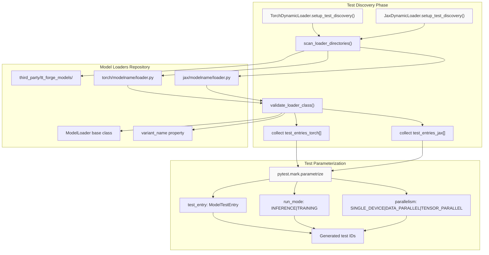
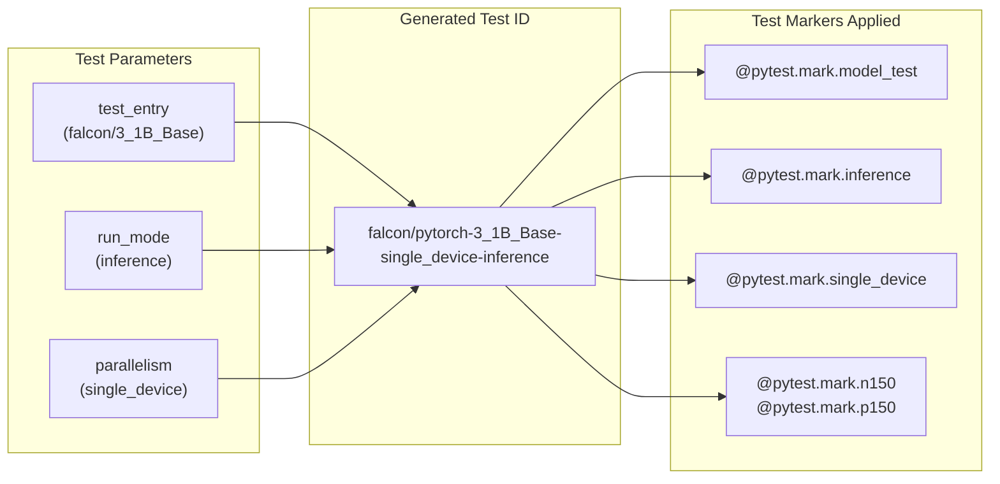
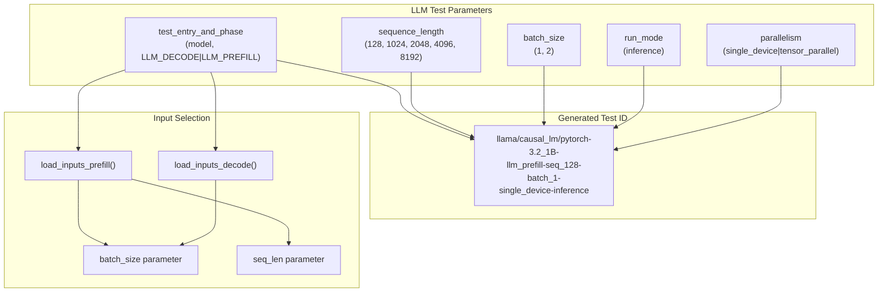
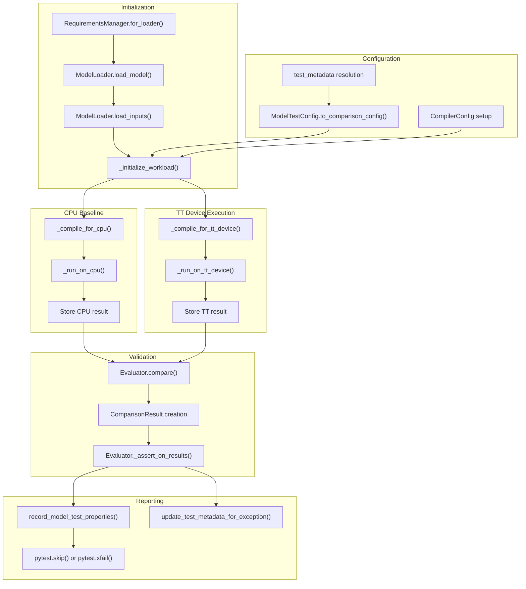
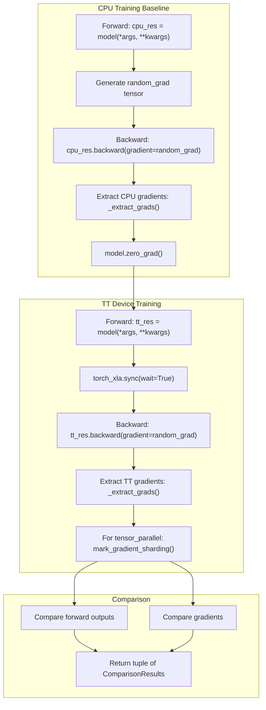
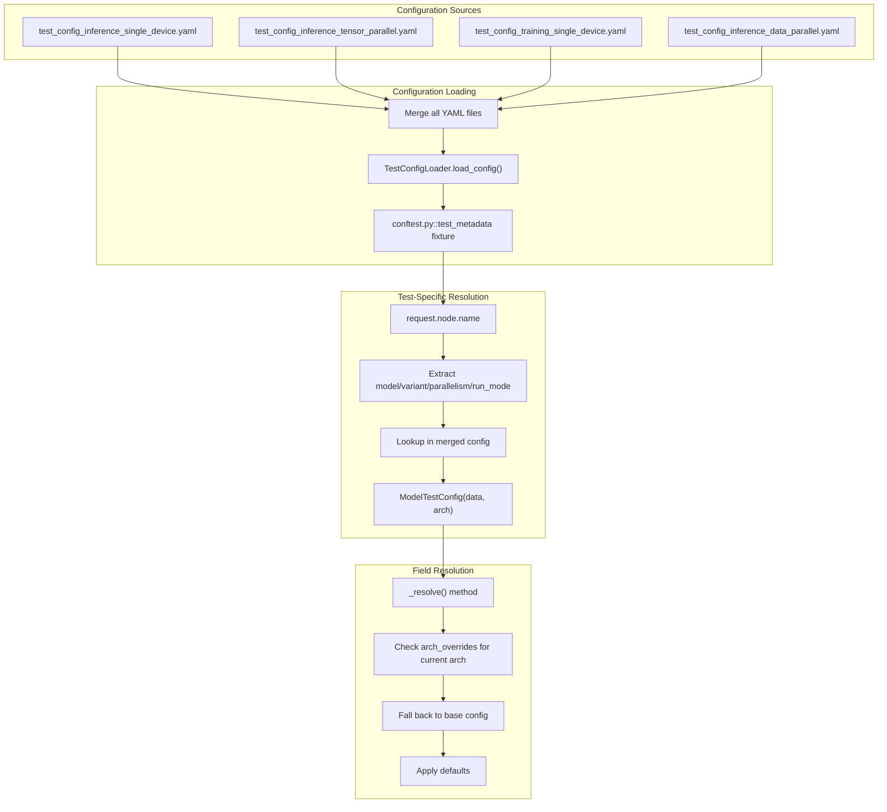
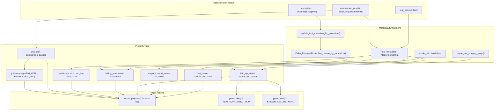
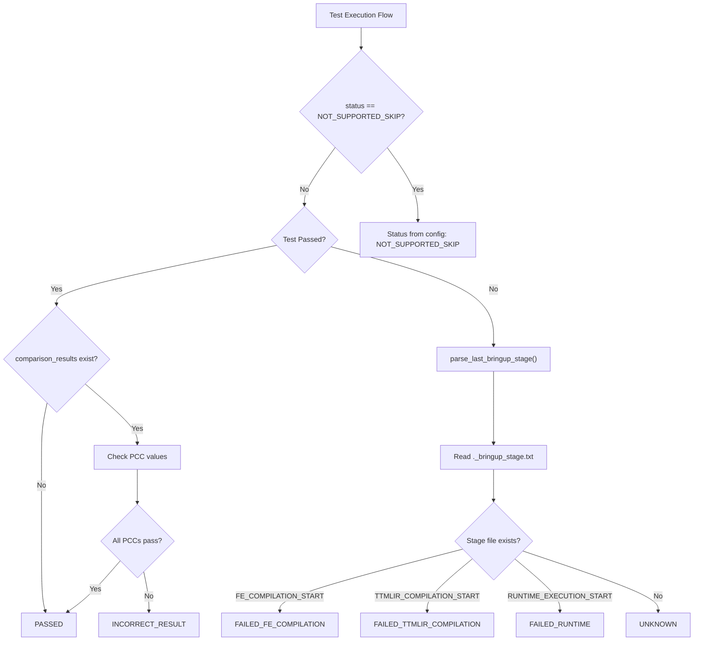
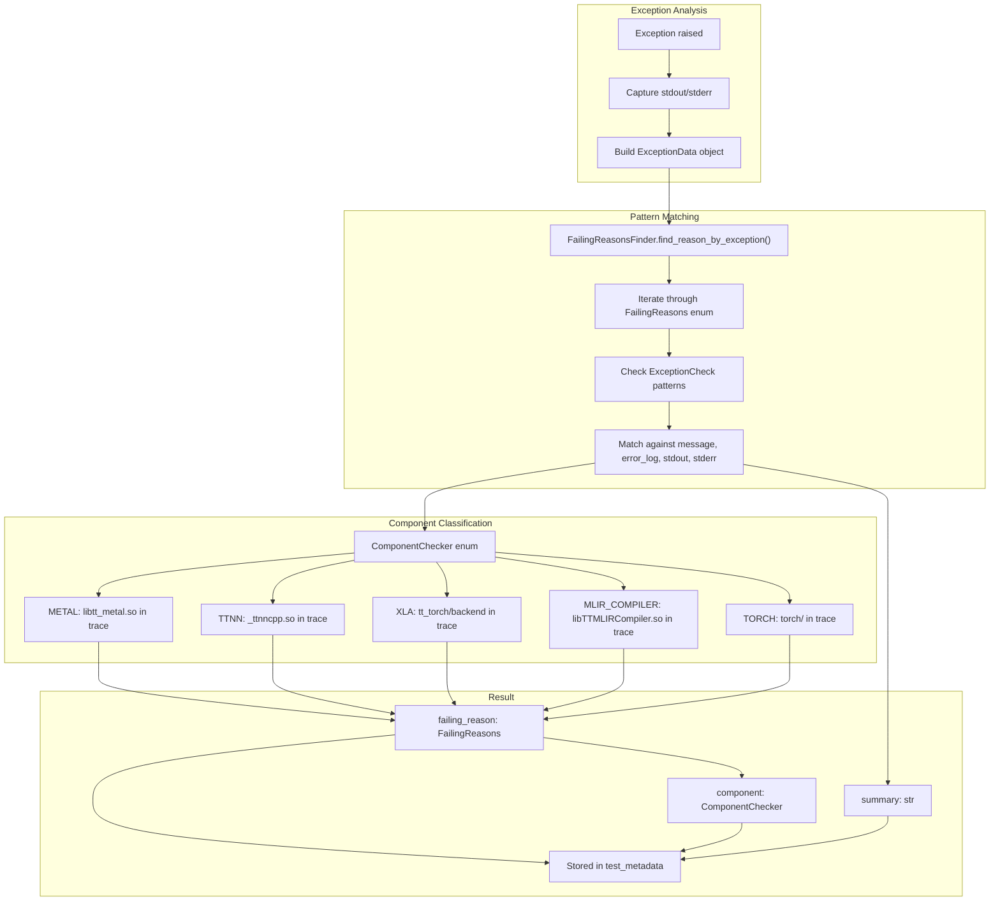

# Model Testing Workflow

Relevant source files
*   [.github/workflows/manual-test-single.yml](https://github.com/tenstorrent/tt-xla/blob/c77995f6/.github/workflows/manual-test-single.yml)
*   [.github/workflows/test-matrix-presets/model-test-passing.json](https://github.com/tenstorrent/tt-xla/blob/c77995f6/.github/workflows/test-matrix-presets/model-test-passing.json)
*   [.test_durations](https://github.com/tenstorrent/tt-xla/blob/c77995f6/.test_durations)
*   [pytest.ini](https://github.com/tenstorrent/tt-xla/blob/c77995f6/pytest.ini)
*   [tests/infra/testers/single_chip/model/model_tester.py](https://github.com/tenstorrent/tt-xla/blob/c77995f6/tests/infra/testers/single_chip/model/model_tester.py)
*   [tests/infra/testers/single_chip/model/torch_model_tester.py](https://github.com/tenstorrent/tt-xla/blob/c77995f6/tests/infra/testers/single_chip/model/torch_model_tester.py)
*   [tests/infra/utilities/failing_reasons/__init__.py](https://github.com/tenstorrent/tt-xla/blob/c77995f6/tests/infra/utilities/failing_reasons/__init__.py)
*   [tests/infra/utilities/failing_reasons/checks_xla.py](https://github.com/tenstorrent/tt-xla/blob/c77995f6/tests/infra/utilities/failing_reasons/checks_xla.py)
*   [tests/infra/utilities/failing_reasons/finder.py](https://github.com/tenstorrent/tt-xla/blob/c77995f6/tests/infra/utilities/failing_reasons/finder.py)
*   [tests/infra/utilities/failing_reasons/utils.py](https://github.com/tenstorrent/tt-xla/blob/c77995f6/tests/infra/utilities/failing_reasons/utils.py)
*   [tests/runner/test_config/jax/test_config_inference_data_parallel.yaml](https://github.com/tenstorrent/tt-xla/blob/c77995f6/tests/runner/test_config/jax/test_config_inference_data_parallel.yaml)
*   [tests/runner/test_config/jax/test_config_inference_single_device.yaml](https://github.com/tenstorrent/tt-xla/blob/c77995f6/tests/runner/test_config/jax/test_config_inference_single_device.yaml)
*   [tests/runner/test_config/jax/test_config_inference_tensor_parallel.yaml](https://github.com/tenstorrent/tt-xla/blob/c77995f6/tests/runner/test_config/jax/test_config_inference_tensor_parallel.yaml)
*   [tests/runner/test_config/jax/test_config_training_single_device.yaml](https://github.com/tenstorrent/tt-xla/blob/c77995f6/tests/runner/test_config/jax/test_config_training_single_device.yaml)
*   [tests/runner/test_config/torch/test_config_inference_data_parallel.yaml](https://github.com/tenstorrent/tt-xla/blob/c77995f6/tests/runner/test_config/torch/test_config_inference_data_parallel.yaml)
*   [tests/runner/test_config/torch/test_config_inference_single_device.yaml](https://github.com/tenstorrent/tt-xla/blob/c77995f6/tests/runner/test_config/torch/test_config_inference_single_device.yaml)
*   [tests/runner/test_config/torch/test_config_inference_tensor_parallel.yaml](https://github.com/tenstorrent/tt-xla/blob/c77995f6/tests/runner/test_config/torch/test_config_inference_tensor_parallel.yaml)
*   [tests/runner/test_config/torch/test_config_training_single_device.yaml](https://github.com/tenstorrent/tt-xla/blob/c77995f6/tests/runner/test_config/torch/test_config_training_single_device.yaml)
*   [tests/runner/test_config/torch_llm/test_config_inference_single_device.yaml](https://github.com/tenstorrent/tt-xla/blob/c77995f6/tests/runner/test_config/torch_llm/test_config_inference_single_device.yaml)
*   [tests/runner/test_config/torch_llm/test_config_inference_tensor_parallel.yaml](https://github.com/tenstorrent/tt-xla/blob/c77995f6/tests/runner/test_config/torch_llm/test_config_inference_tensor_parallel.yaml)
*   [tests/runner/test_models.py](https://github.com/tenstorrent/tt-xla/blob/c77995f6/tests/runner/test_models.py)
*   [tests/runner/test_utils.py](https://github.com/tenstorrent/tt-xla/blob/c77995f6/tests/runner/test_utils.py)
*   [tests/runner/testers/torch/dynamic_torch_model_tester.py](https://github.com/tenstorrent/tt-xla/blob/c77995f6/tests/runner/testers/torch/dynamic_torch_model_tester.py)
*   [tests/runner/utils/dynamic_loader.py](https://github.com/tenstorrent/tt-xla/blob/c77995f6/tests/runner/utils/dynamic_loader.py)

This page documents the end-to-end workflow for discovering, parameterizing, executing, and validating model tests in TT-XLA. It covers how test cases are dynamically generated from model loaders, how they are configured and executed across different modes and parallelism strategies, and how results are recorded.

For test configuration details (YAML format, status fields), see [Test Configuration System](https://deepwiki.com/tenstorrent/tt-xla/6.1-test-configuration-system). For the underlying testing infrastructure classes (`ModelTester`, `DynamicLoader`), see [Test Framework Architecture](https://deepwiki.com/tenstorrent/tt-xla/6.2-test-framework-architecture). For comparison metrics and validation logic, see [Comparison and Validation](https://deepwiki.com/tenstorrent/tt-xla/6.4-comparison-and-validation).

## Test Discovery and Generation

Model tests are dynamically discovered from the `tt_forge_models` repository using loader classes. The discovery process creates parameterized test cases for each model variant, run mode, and parallelism configuration.

### Discovery Flow

**Discovery Process**: At test collection time, `TorchDynamicLoader.setup_test_discovery()` and `JaxDynamicLoader.setup_test_discovery()` scan the `tt_forge_models` repository to find all loader classes. Each loader represents a model variant and must implement `load_model()` and `load_inputs()`. The loaders are validated and collected into `test_entries_torch` and `test_entries_jax` lists, which are then used by pytest's parametrize decorator.

Sources: [tests/runner/test_models.py 51-58](https://github.com/tenstorrent/tt-xla/blob/c77995f6/tests/runner/test_models.py#L51-L58)[tests/runner/utils/dynamic_loader.py 1-150](https://github.com/tenstorrent/tt-xla/blob/c77995f6/tests/runner/utils/dynamic_loader.py#L1-L150)




**Discovery Process**: At test collection time, `TorchDynamicLoader.setup_test_discovery()` and `JaxDynamicLoader.setup_test_discovery()` scan the `tt_forge_models` repository to find all loader classes. Each loader represents a model variant and must implement `load_model()` and `load_inputs()`. The loaders are validated and collected into `test_entries_torch` and `test_entries_jax` lists, which are then used by pytest's parametrize decorator.

Sources: [tests/runner/test_models.py:51-58](), [tests/runner/utils/dynamic_loader.py:1-150]()
```
### Test Entry Structure

**Test Entry**: A `ModelTestEntry` encapsulates the path to a loader file and its variant information (variant name and loader class). Each entry becomes a separate test case when combined with run mode and parallelism parameters.

Sources: [tests/runner/utils/dynamic_loader.py 20-27](https://github.com/tenstorrent/tt-xla/blob/c77995f6/tests/runner/utils/dynamic_loader.py#L20-L27)[tests/runner/test_models.py 276-280](https://github.com/tenstorrent/tt-xla/blob/c77995f6/tests/runner/test_models.py#L276-L280)

## Test Parameterization Matrix

Tests are parameterized across three dimensions: test entry (model variant), run mode, and parallelism. This creates a large matrix of test cases.

### Parameterization Structure

| Parameter | Values | Pytest Marker |
| --- | --- | --- |
| `test_entry` | One per model variant | Model-specific ID |
| `run_mode` | `INFERENCE`, `TRAINING` | `@pytest.mark.inference`, `@pytest.mark.training` |
| `parallelism` | `SINGLE_DEVICE`, `DATA_PARALLEL`, `TENSOR_PARALLEL` | `@pytest.mark.single_device`, `@pytest.mark.data_parallel`, `@pytest.mark.tensor_parallel` |

The full test matrix is defined in `test_all_models_torch` and `test_all_models_jax`:

**Test ID Generation**: Test IDs are generated by combining model path, variant, parallelism, and run mode. The format is `{model}/{framework}-{variant}-{parallelism}-{run_mode}`. Architecture markers (n150, p150, etc.) are added based on `supported_archs` in the test configuration.

Sources: [tests/runner/test_models.py 247-302](https://github.com/tenstorrent/tt-xla/blob/c77995f6/tests/runner/test_models.py#L247-L302)[tests/runner/utils/dynamic_loader.py 207-248](https://github.com/tenstorrent/tt-xla/blob/c77995f6/tests/runner/utils/dynamic_loader.py#L207-L248)




**Test ID Generation**: Test IDs are generated by combining model path, variant, parallelism, and run mode. The format is `{model}/{framework}-{variant}-{parallelism}-{run_mode}`. Architecture markers (n150, p150, etc.) are added based on `supported_archs` in the test configuration.

Sources: [tests/runner/test_models.py:247-302](), [tests/runner/utils/dynamic_loader.py:207-248]()
```
### LLM-Specific Parameterization

For LLM models, additional parameters control sequence length and batch size for prefill and decode phases:

**LLM Test IDs**: LLM tests include the run phase (prefill/decode), sequence length, and batch size in the test ID. Only models with `load_inputs_prefill()` or `load_inputs_decode()` methods are included in the LLM test suite.

Sources: [tests/runner/test_models.py 361-461](https://github.com/tenstorrent/tt-xla/blob/c77995f6/tests/runner/test_models.py#L361-L461)[tests/runner/test_utils.py 38-44](https://github.com/tenstorrent/tt-xla/blob/c77995f6/tests/runner/test_utils.py#L38-L44)




**LLM Test IDs**: LLM tests include the run phase (prefill/decode), sequence length, and batch size in the test ID. Only models with `load_inputs_prefill()` or `load_inputs_decode()` methods are included in the LLM test suite.

Sources: [tests/runner/test_models.py:361-461](), [tests/runner/test_utils.py:38-44]()
```
## Test Execution Lifecycle

The execution lifecycle follows a consistent pattern regardless of framework or parallelism configuration.

### Execution Flow

**Execution Phases**: The execution flow consists of model setup, CPU baseline execution, TT device execution, comparison, and result recording. Requirements are managed per-model to handle version conflicts.

Sources: [tests/runner/test_models.py 61-245](https://github.com/tenstorrent/tt-xla/blob/c77995f6/tests/runner/test_models.py#L61-L245)[tests/infra/testers/single_chip/model/torch_model_tester.py 1-300](https://github.com/tenstorrent/tt-xla/blob/c77995f6/tests/infra/testers/single_chip/model/torch_model_tester.py#L1-L300)

### Core Execution Steps

**Execution Steps**: After initialization and configuration, the model is executed on CPU to establish a baseline, then on TT device for comparison. Results are validated and recorded, with appropriate pytest markers applied based on status.

Sources: [tests/infra/testers/single_chip/model/model_tester.py 1-250](https://github.com/tenstorrent/tt-xla/blob/c77995f6/tests/infra/testers/single_chip/model/model_tester.py#L1-L250)[tests/runner/test_utils.py 483-628](https://github.com/tenstorrent/tt-xla/blob/c77995f6/tests/runner/test_utils.py#L483-L628)




**Execution Steps**: After initialization and configuration, the model is executed on CPU to establish a baseline, then on TT device for comparison. Results are validated and recorded, with appropriate pytest markers applied based on status.

Sources: [tests/infra/testers/single_chip/model/model_tester.py:1-250](), [tests/runner/test_utils.py:483-628]()
```
### Training-Specific Flow

For training tests, the execution includes forward and backward passes:

**Training Execution**: Training tests compare both forward outputs and gradients. The same random gradient tensor is used for both CPU and TT backward passes to ensure deterministic comparison. Gradient sharding is applied for tensor parallel training.

Sources: [tests/infra/testers/single_chip/model/torch_model_tester.py 247-328](https://github.com/tenstorrent/tt-xla/blob/c77995f6/tests/infra/testers/single_chip/model/torch_model_tester.py#L247-L328)




**Training Execution**: Training tests compare both forward outputs and gradients. The same random gradient tensor is used for both CPU and TT backward passes to ensure deterministic comparison. Gradient sharding is applied for tensor parallel training.

Sources: [tests/infra/testers/single_chip/model/torch_model_tester.py:247-328]()
```
## Test Configuration Resolution

Test behavior is controlled by YAML configuration files that specify status, comparison thresholds, and architecture-specific overrides.

### Configuration Hierarchy

**Configuration Resolution**: The `test_metadata` pytest fixture loads all YAML files, merges them, and extracts configuration for the current test based on its test ID. Architecture-specific overrides are applied when the test runs on a matching architecture.

Sources: [tests/runner/conftest.py](https://github.com/tenstorrent/tt-xla/blob/c77995f6/tests/runner/conftest.py)[tests/runner/test_utils.py 80-189](https://github.com/tenstorrent/tt-xla/blob/c77995f6/tests/runner/test_utils.py#L80-L189)




**Configuration Resolution**: The `test_metadata` pytest fixture loads all YAML files, merges them, and extracts configuration for the current test based on its test ID. Architecture-specific overrides are applied when the test runs on a matching architecture.

Sources: [tests/runner/conftest.py](), [tests/runner/test_utils.py:80-189]()
```
### ModelTestConfig Fields

The `ModelTestConfig` class provides structured access to test configuration:

| Field | Type | Purpose | Default |
| --- | --- | --- | --- |
| `status` | `ModelTestStatus` | Test status (EXPECTED_PASSING, KNOWN_FAILURE_XFAIL, etc.) | `UNSPECIFIED` |
| `required_pcc` | `float` | Minimum PCC threshold | `None` (uses default 0.99) |
| `assert_pcc` | `bool` | Enable/disable PCC assertion | `None` (enabled by default) |
| `assert_atol` | `bool` | Enable ATOL comparator | `False` |
| `required_atol` | `float` | Maximum absolute tolerance | `None` |
| `assert_allclose` | `bool` | Enable allclose comparator | `False` |
| `allclose_rtol` | `float` | Relative tolerance for allclose | `None` |
| `allclose_atol` | `float` | Absolute tolerance for allclose | `None` |
| `batch_size` | `int` | Override batch size | `None` |
| `seq_len` | `int` | Override sequence length | `None` |
| `reason` | `str` | Reason for skip/xfail | `None` |
| `bringup_status` | `BringupStatus` | Expected failure stage | `None` |
| `markers` | `List[str]` | Pytest markers to apply | `[]` |
| `supported_archs` | `List[str]` | Supported architectures | `[]` (all) |
| `filechecks` | `List[str]` | FileCheck pattern files | `[]` |
| `enable_weight_bfp8_conversion` | `bool` | Enable BFP8 weight conversion | `False` |

**Configuration Fields**: Most fields have architecture-specific override support via `arch_overrides` in the YAML. The `_resolve()` method checks the current architecture and applies overrides when present.

Sources: [tests/runner/test_utils.py 80-189](https://github.com/tenstorrent/tt-xla/blob/c77995f6/tests/runner/test_utils.py#L80-L189)

## Result Recording and Reporting

After test execution, results are recorded with detailed metadata for analysis and reporting.

### Property Recording Flow

**Property Recording**: `record_model_test_properties()` is called in the finally block to ensure properties are recorded even on failure. It computes bringup status, extracts metrics from comparison results, and applies pytest markers.

Sources: [tests/runner/test_utils.py 483-628](https://github.com/tenstorrent/tt-xla/blob/c77995f6/tests/runner/test_utils.py#L483-L628)




**Property Recording**: `record_model_test_properties()` is called in the finally block to ensure properties are recorded even on failure. It computes bringup status, extracts metrics from comparison results, and applies pytest markers.

Sources: [tests/runner/test_utils.py:483-628]()
```
### Bringup Status Classification

**Bringup Status**: The bringup status indicates where in the pipeline a test failed. It is determined from the `._bringup_stage.txt` file written by the C++ compilation pipeline, or by comparing PCC values for passing tests.

Sources: [tests/runner/test_utils.py 191-263](https://github.com/tenstorrent/tt-xla/blob/c77995f6/tests/runner/test_utils.py#L191-L263)[tests/runner/test_utils.py 504-567](https://github.com/tenstorrent/tt-xla/blob/c77995f6/tests/runner/test_utils.py#L504-L567)




**Bringup Status**: The bringup status indicates where in the pipeline a test failed. It is determined from the `._bringup_stage.txt` file written by the C++ compilation pipeline, or by comparing PCC values for passing tests.

Sources: [tests/runner/test_utils.py:191-263](), [tests/runner/test_utils.py:504-567]()
```
### Guidance Tag Generation

Guidance tags suggest configuration updates based on test behavior:

| Guidance Tag | Meaning | Trigger Condition |
| --- | --- | --- |
| `RM_XFAIL` | Remove xfail marker | Test marked `KNOWN_FAILURE_XFAIL` but passed or shows results |
| `ADD_CONFIG` | Add proper configuration | Test marked `UNSPECIFIED` but passed or shows results |
| `ENABLE_PCC` | Enable PCC check | PCC disabled but measured PCC > threshold + buffer |
| `ENABLE_PCC_099` | Enable PCC at 0.99 | PCC disabled, threshold ≥ 0.99, and measured PCC > threshold + buffer |
| `RAISE_PCC` | Raise PCC threshold | Measured PCC exceeds next centesimal step + buffer |
| `RAISE_PCC_099` | Raise PCC to 0.99 | Measured PCC exceeds 0.99 + buffer |

**Guidance Tags**: Tags are derived from comparing test status, bringup status, and PCC metrics. They help identify tests that can be promoted (stricter thresholds) or demoted (known failures that now pass).

Sources: [tests/runner/test_utils.py 304-481](https://github.com/tenstorrent/tt-xla/blob/c77995f6/tests/runner/test_utils.py#L304-L481)

### Failing Reason Classification

When a test fails, the exception is analyzed to determine the failing reason and responsible component:

**Failing Reason**: The `FailingReasonsFinder` uses pattern matching on exception messages and stack traces to classify failures by reason and responsible component. This helps with automated triage and issue tracking.

Sources: [tests/infra/utilities/failing_reasons/finder.py 1-100](https://github.com/tenstorrent/tt-xla/blob/c77995f6/tests/infra/utilities/failing_reasons/finder.py#L1-L100)[tests/infra/utilities/failing_reasons/checks_xla.py 1-200](https://github.com/tenstorrent/tt-xla/blob/c77995f6/tests/infra/utilities/failing_reasons/checks_xla.py#L1-L200)[tests/runner/test_utils.py 221-263](https://github.com/tenstorrent/tt-xla/blob/c77995f6/tests/runner/test_utils.py#L221-L263)




**Failing Reason**: The `FailingReasonsFinder` uses pattern matching on exception messages and stack traces to classify failures by reason and responsible component. This helps with automated triage and issue tracking.

Sources: [tests/infra/utilities/failing_reasons/finder.py:1-100](), [tests/infra/utilities/failing_reasons/checks_xla.py:1-200](), [tests/runner/test_utils.py:221-263]()
```
## Test Result Properties Schema

The complete set of properties recorded for each test:

**Properties Schema**: All properties are converted to marshal-safe types (basic Python types only) to support pytest-forked execution. Enums are converted to strings, numpy scalars to Python scalars, and collections are recursively converted.

Sources: [tests/runner/test_utils.py 609-695](https://github.com/tenstorrent/tt-xla/blob/c77995f6/tests/runner/test_utils.py#L609-L695)[tests/runner/test_utils.py 269-302](https://github.com/tenstorrent/tt-xla/blob/c77995f6/tests/runner/test_utils.py#L269-L302)

Dismiss
Refresh this wiki

Enter email to refresh
