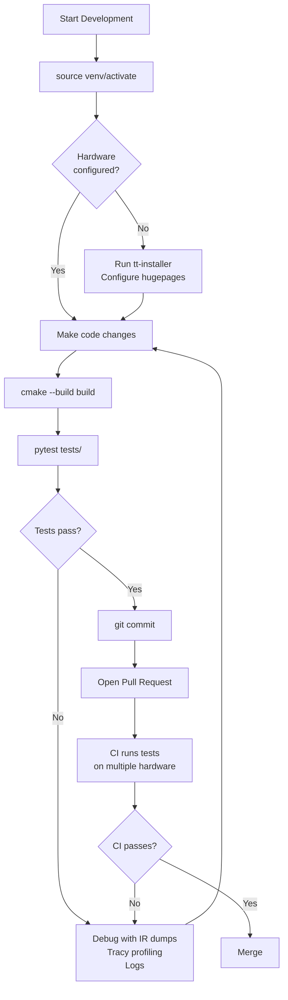
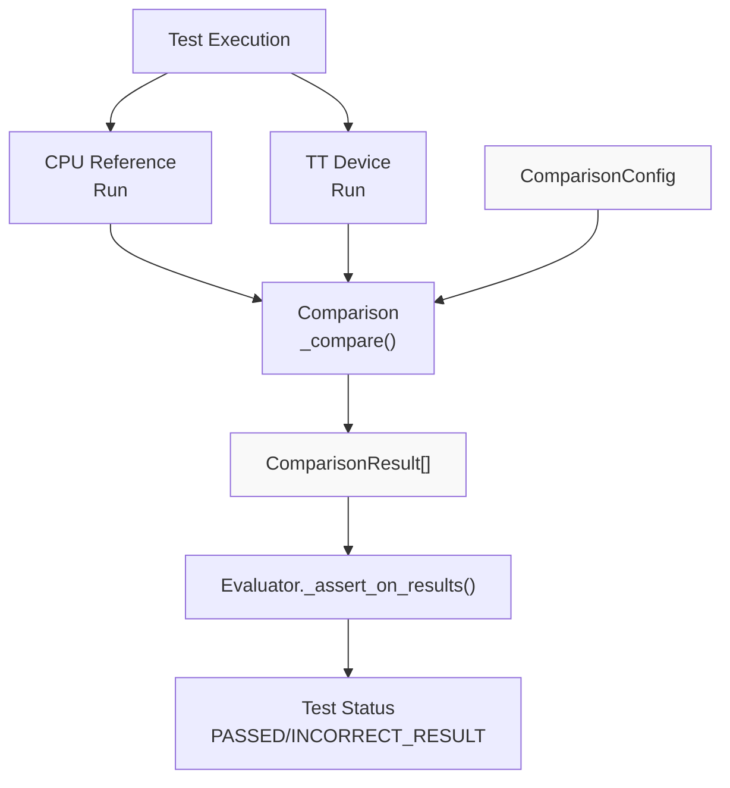

# Comparison and Validation

Relevant source files
*   [pytest.ini](https://github.com/tenstorrent/tt-xla/blob/c77995f6/pytest.ini)
*   [tests/infra/testers/single_chip/model/model_tester.py](https://github.com/tenstorrent/tt-xla/blob/c77995f6/tests/infra/testers/single_chip/model/model_tester.py)
*   [tests/infra/testers/single_chip/model/torch_model_tester.py](https://github.com/tenstorrent/tt-xla/blob/c77995f6/tests/infra/testers/single_chip/model/torch_model_tester.py)
*   [tests/infra/utilities/failing_reasons/__init__.py](https://github.com/tenstorrent/tt-xla/blob/c77995f6/tests/infra/utilities/failing_reasons/__init__.py)
*   [tests/infra/utilities/failing_reasons/checks_xla.py](https://github.com/tenstorrent/tt-xla/blob/c77995f6/tests/infra/utilities/failing_reasons/checks_xla.py)
*   [tests/infra/utilities/failing_reasons/finder.py](https://github.com/tenstorrent/tt-xla/blob/c77995f6/tests/infra/utilities/failing_reasons/finder.py)
*   [tests/infra/utilities/failing_reasons/utils.py](https://github.com/tenstorrent/tt-xla/blob/c77995f6/tests/infra/utilities/failing_reasons/utils.py)
*   [tests/runner/test_models.py](https://github.com/tenstorrent/tt-xla/blob/c77995f6/tests/runner/test_models.py)
*   [tests/runner/test_utils.py](https://github.com/tenstorrent/tt-xla/blob/c77995f6/tests/runner/test_utils.py)
*   [tests/runner/testers/torch/dynamic_torch_model_tester.py](https://github.com/tenstorrent/tt-xla/blob/c77995f6/tests/runner/testers/torch/dynamic_torch_model_tester.py)
*   [tests/runner/utils/dynamic_loader.py](https://github.com/tenstorrent/tt-xla/blob/c77995f6/tests/runner/utils/dynamic_loader.py)

This page documents the comparison and validation system used to verify model execution correctness in the tt-xla testing infrastructure. It covers how test outputs from Tenstorrent hardware are compared against CPU reference implementations, the metrics used for validation (PCC, ATOL, ALLCLOSE), and how comparison thresholds are configured and evaluated.

For information about test configuration metadata and status enums, see [Test Configuration System](https://deepwiki.com/tenstorrent/tt-xla/6.4-comparison-and-validation). For details on how test failures are classified and analyzed, see [Failure Analysis and Classification](https://deepwiki.com/tenstorrent/tt-xla/6.6-multi-chip-and-parallelism-testing).

## Overview

The comparison system validates that models executed on Tenstorrent hardware produce numerically similar results to CPU reference implementations. The validation process runs after each test execution and uses multiple comparison metrics with configurable thresholds.

**Diagram: High-level comparison flow during test execution**

Sources: [tests/infra/testers/single_chip/model/torch_model_tester.py 170-278](https://github.com/tenstorrent/tt-xla/blob/c77995f6/tests/infra/testers/single_chip/model/torch_model_tester.py#L170-L278)[tests/runner/test_utils.py 363-451](https://github.com/tenstorrent/tt-xla/blob/c77995f6/tests/runner/test_utils.py#L363-L451)







**Diagram: High-level comparison flow during test execution**

Sources: [tests/infra/testers/single_chip/model/torch_model_tester.py:170-278](), [tests/runner/test_utils.py:363-451]()
```
## ComparisonConfig System

The `ComparisonConfig` class defines how comparison is performed and which metrics are evaluated. Each comparator (PCC, ATOL, ALLCLOSE) can be independently enabled/disabled with custom thresholds.

### ComparisonConfig Structure

**Diagram: ComparisonConfig class hierarchy and comparator structure**

Sources: [tests/runner/test_utils.py 165-204](https://github.com/tenstorrent/tt-xla/blob/c77995f6/tests/runner/test_utils.py#L165-L204)

### Default Thresholds

| Comparator | Default State | Default Threshold | Description |
| --- | --- | --- | --- |
| PCC | Enabled | 0.99 | Pearson Correlation Coefficient |
| ATOL | Disabled | 1e-2 | Absolute Tolerance (only if enabled) |
| ALLCLOSE | Disabled | rtol=1e-5, atol=1e-8 | Relative and absolute tolerance |

The PCC comparator includes a fallback ALLCLOSE check (rtol=1e-5, atol=1e-8) that is evaluated when PCC comparison fails.

Sources: [tests/runner/test_utils.py 165-204](https://github.com/tenstorrent/tt-xla/blob/c77995f6/tests/runner/test_utils.py#L165-L204)

## Comparison Metrics

### PCC (Pearson Correlation Coefficient)

PCC is the primary metric for validating numerical correctness. It measures the linear correlation between CPU and device outputs, with values ranging from -1 to 1 (1 indicates perfect correlation).

**Key characteristics:**

*   Default threshold: 0.99
*   Scale-invariant (insensitive to output magnitude)
*   Most commonly used metric in the test suite
*   Configured via `required_pcc` in test configs

Example test configuration:

Sources: [tests/runner/test_config/torch/test_config_inference_single_device.yaml 18-20](https://github.com/tenstorrent/tt-xla/blob/c77995f6/tests/runner/test_config/torch/test_config_inference_single_device.yaml#L18-L20)[tests/runner/test_utils.py 169-174](https://github.com/tenstorrent/tt-xla/blob/c77995f6/tests/runner/test_utils.py#L169-L174)

### ATOL (Absolute Tolerance)

ATOL validates that absolute element-wise differences are within a specified threshold. It is useful for models where absolute error magnitude matters.

**Key characteristics:**

*   Disabled by default
*   Enabled via `assert_atol: true` or by setting `required_atol`
*   Default threshold: 1e-2 (when enabled)
*   Configured independently from PCC

Example test configuration:

Sources: [tests/runner/test_utils.py 177-180](https://github.com/tenstorrent/tt-xla/blob/c77995f6/tests/runner/test_utils.py#L177-L180)

### ALLCLOSE (Relative and Absolute Tolerance)

ALLCLOSE uses NumPy/PyTorch allclose semantics: validates that `|cpu_output - device_output| ≤ atol + rtol * |cpu_output|` for all elements.

**Key characteristics:**

*   Disabled by default
*   Enabled via `assert_allclose: true` or by setting `allclose_rtol`/`allclose_atol`
*   Default thresholds: rtol=1e-5, atol=1e-8
*   Provides both relative and absolute tolerance checking

Example test configuration:

Sources: [tests/runner/test_utils.py 183-201](https://github.com/tenstorrent/tt-xla/blob/c77995f6/tests/runner/test_utils.py#L183-L201)

## Test Configuration Integration

Test configuration YAML files specify comparison thresholds and enable/disable comparators for individual tests. The `ModelTestConfig` class parses these configurations and converts them to `ComparisonConfig` objects.

### ModelTestConfig to ComparisonConfig Conversion

**Diagram: Conversion from YAML test configuration to ComparisonConfig**

Sources: [tests/runner/test_utils.py 165-204](https://github.com/tenstorrent/tt-xla/blob/c77995f6/tests/runner/test_utils.py#L165-L204)

### Configuration Patterns

| Pattern | YAML Configuration | Effect |
| --- | --- | --- |
| Lower PCC threshold | `required_pcc: 0.98` | Relax PCC requirement to 0.98 |
| Disable PCC | `assert_pcc: false` | Skip PCC validation entirely |
| Enable ATOL | `assert_atol: true` | Enable absolute tolerance check with default 1e-2 |
| Custom ATOL | `required_atol: 5e-3` | Enable ATOL with custom threshold |
| Enable ALLCLOSE | `assert_allclose: true` | Enable allclose with defaults |
| Custom ALLCLOSE | `allclose_rtol: 1e-4` `allclose_atol: 1e-6` | Enable allclose with custom thresholds |

### Architecture-Specific Overrides

Test configurations support architecture-specific overrides via `arch_overrides`, allowing different thresholds for different hardware (n150, p150, n300-llmbox):

Sources: [tests/runner/test_config/torch/test_config_inference_single_device.yaml 51-56](https://github.com/tenstorrent/tt-xla/blob/c77995f6/tests/runner/test_config/torch/test_config_inference_single_device.yaml#L51-L56)[tests/runner/test_utils.py 159-163](https://github.com/tenstorrent/tt-xla/blob/c77995f6/tests/runner/test_utils.py#L159-L163)

## Comparison Execution Flow

The comparison process follows a consistent flow regardless of framework (PyTorch/JAX):

**Diagram: Sequence of comparison execution during test**

Sources: [tests/infra/testers/single_chip/model/torch_model_tester.py 215-277](https://github.com/tenstorrent/tt-xla/blob/c77995f6/tests/infra/testers/single_chip/model/torch_model_tester.py#L215-L277)[tests/runner/test_models.py 162-169](https://github.com/tenstorrent/tt-xla/blob/c77995f6/tests/runner/test_models.py#L162-L169)

### ComparisonResult Structure

Each comparison produces a `ComparisonResult` object containing:

| Field | Type | Description |
| --- | --- | --- |
| `pcc` | `float | None` | Calculated PCC value |
| `atol` | `float | None` | Calculated ATOL value |
| `passed` | `bool | None` | Overall pass/fail status |
| `error_message` | `str | None` | Failure reason if `passed=False` |

For tests with multiple outputs, a list of `ComparisonResult` objects is returned, one per output tensor.

Sources: [tests/runner/test_utils.py 363-406](https://github.com/tenstorrent/tt-xla/blob/c77995f6/tests/runner/test_utils.py#L363-L406)

## Result Classification

Test results are classified based on comparison outcomes and mapped to `BringupStatus` enums for reporting.

### Classification Logic

**Diagram: Result classification decision tree**

The `_process_comparison_results()` function implements this logic:

Sources: [tests/runner/test_utils.py 409-450](https://github.com/tenstorrent/tt-xla/blob/c77995f6/tests/runner/test_utils.py#L409-L450)

### Comparison Metrics Extraction

When recording test properties, the system extracts metrics from the first failing result, or the last result if all passed:

Sources: [tests/runner/test_utils.py 363-380](https://github.com/tenstorrent/tt-xla/blob/c77995f6/tests/runner/test_utils.py#L363-L380)

## Common Configuration Patterns

### Pattern 1: Lower PCC Threshold

Used when models produce slightly lower correlation due to numerical precision or algorithmic differences:

Sources: [tests/runner/test_config/torch/test_config_inference_single_device.yaml 35-37](https://github.com/tenstorrent/tt-xla/blob/c77995f6/tests/runner/test_config/torch/test_config_inference_single_device.yaml#L35-L37)

### Pattern 2: Disable PCC Assertion

Used when PCC is too low to pass but the model is otherwise functional:

Sources: [tests/runner/test_config/torch/test_config_inference_single_device.yaml 11-16](https://github.com/tenstorrent/tt-xla/blob/c77995f6/tests/runner/test_config/torch/test_config_inference_single_device.yaml#L11-L16)

### Pattern 3: Progressive Threshold Lowering

Some models have progressively lower PCC across variants:

Sources: [tests/runner/test_config/torch/test_config_inference_single_device.yaml 630-652](https://github.com/tenstorrent/tt-xla/blob/c77995f6/tests/runner/test_config/torch/test_config_inference_single_device.yaml#L630-L652)

## Guidance Tags for CI/CD

The system generates guidance tags to help identify tests that could have their comparison thresholds adjusted:

### PCC Guidance Tags

| Tag | Condition | Meaning |
| --- | --- | --- |
| `ENABLE_PCC` | `pcc_value > (threshold + 0.004)` and `pcc_enabled=False` | PCC is disabled but measured value is safely above threshold |
| `ENABLE_PCC_099` | Same as above, but `threshold >= 0.99` | Suggest enabling strict 0.99 default |
| `RAISE_PCC` | `pcc_value > (next_centesimal + 0.004)` and `threshold < 0.99` | Measured PCC exceeds next step (e.g., 0.97→0.98) |
| `RAISE_PCC_099` | `pcc_value > (0.99 + 0.004)` and `threshold < 0.99` | Measured PCC exceeds 0.99, suggest raising to default |

The 0.004 buffer prevents suggestions when values are within noise of boundaries.

Sources: [tests/runner/test_utils.py 453-506](https://github.com/tenstorrent/tt-xla/blob/c77995f6/tests/runner/test_utils.py#L453-L506)

### Status Guidance Tags

| Tag | Condition | Meaning |
| --- | --- | --- |
| `RM_XFAIL` | Test marked `KNOWN_FAILURE_XFAIL` but passing | Suggest removing xfail marker |
| `ADD_CONFIG` | Test marked `UNSPECIFIED` but passing/incorrect | Suggest adding proper configuration |

Sources: [tests/runner/test_utils.py 330-360](https://github.com/tenstorrent/tt-xla/blob/c77995f6/tests/runner/test_utils.py#L330-L360)

## Training Mode Comparison

Training mode tests perform two comparisons: forward pass and backward pass (gradients).

**Diagram: Training mode comparison flow with forward and backward passes**

Notes:

*   The backward result is returned first (index 0) as it's the primary validation metric
*   Gradient extraction only includes parameters with `requires_grad=True` and `grad is not None`
*   Both CPU and TT must have the same set of None gradients

Sources: [tests/infra/testers/single_chip/model/torch_model_tester.py 215-277](https://github.com/tenstorrent/tt-xla/blob/c77995f6/tests/infra/testers/single_chip/model/torch_model_tester.py#L215-L277)

## Multi-Output Comparison

Models with multiple outputs produce a list of `ComparisonResult` objects. All results must pass for the test to succeed:

Sources: [tests/runner/test_models.py 162-169](https://github.com/tenstorrent/tt-xla/blob/c77995f6/tests/runner/test_models.py#L162-L169)

## Integration with Test Properties

Comparison results are recorded as test properties for CI/CD reporting:

These properties are written to JUnit XML reports and used by result collection systems (see [Result Collection and Reporting](https://deepwiki.com/tenstorrent/tt-xla/7.5-result-collection-and-reporting)).

Sources: [tests/runner/test_utils.py 636-658](https://github.com/tenstorrent/tt-xla/blob/c77995f6/tests/runner/test_utils.py#L636-L658)

Dismiss
Refresh this wiki

Enter email to refresh
