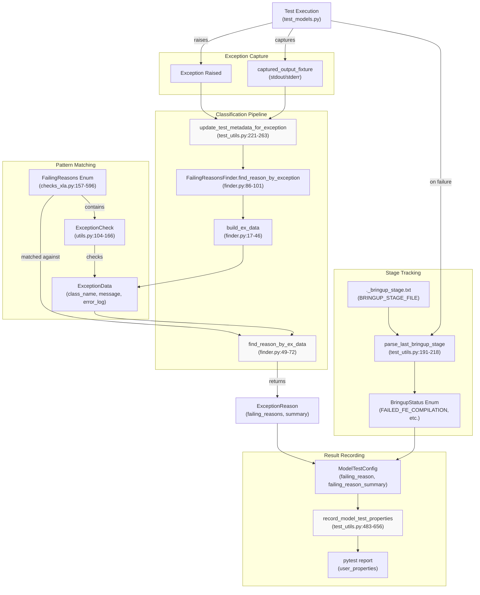
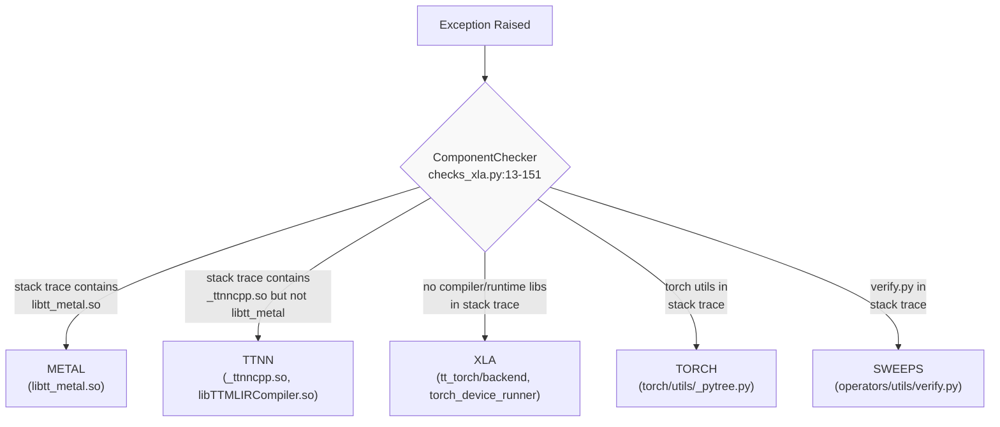
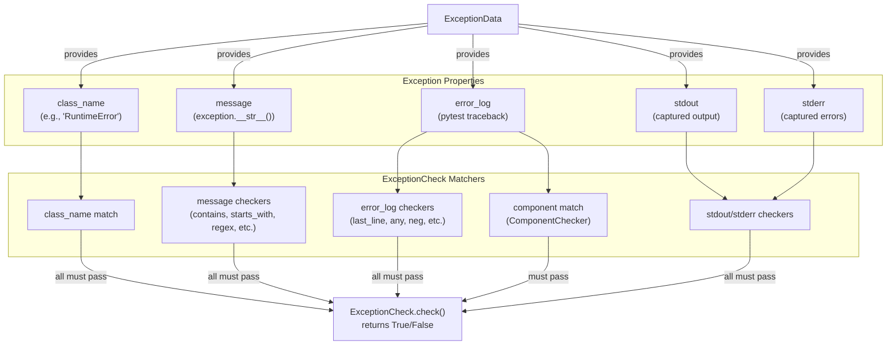
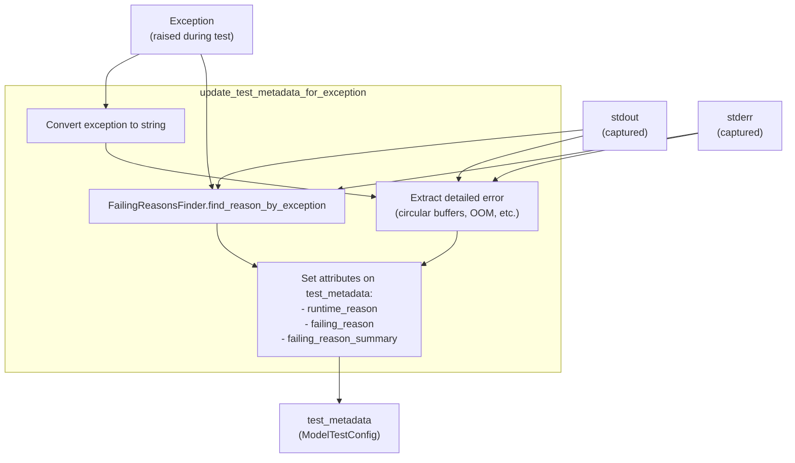
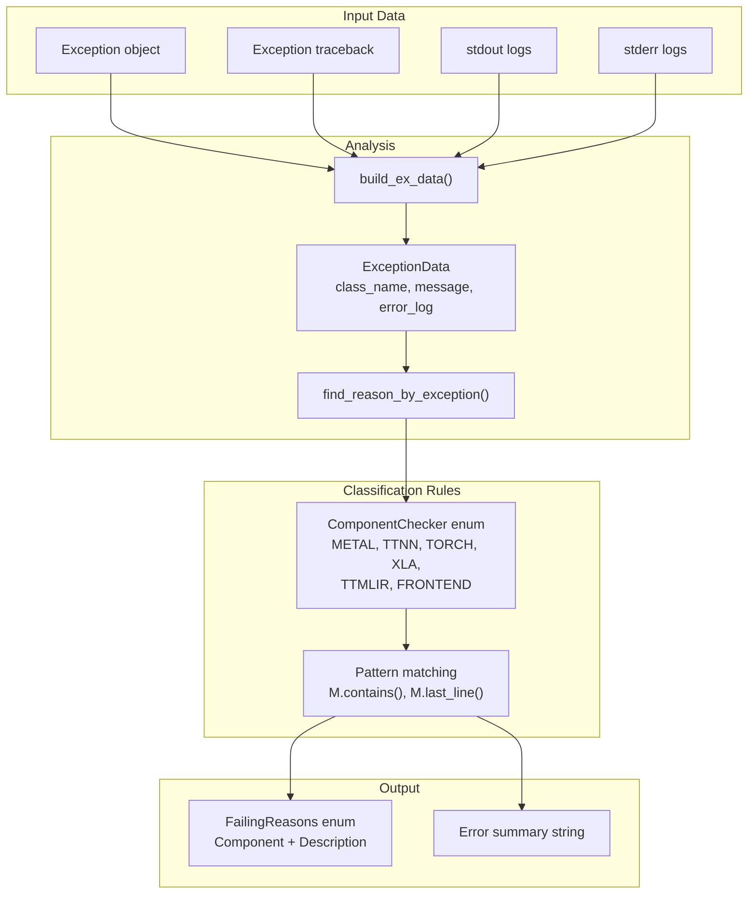

# Failure Analysis and Classification

Relevant source files
*   [pytest.ini](https://github.com/tenstorrent/tt-xla/blob/c77995f6/pytest.ini)
*   [tests/infra/testers/single_chip/model/model_tester.py](https://github.com/tenstorrent/tt-xla/blob/c77995f6/tests/infra/testers/single_chip/model/model_tester.py)
*   [tests/infra/testers/single_chip/model/torch_model_tester.py](https://github.com/tenstorrent/tt-xla/blob/c77995f6/tests/infra/testers/single_chip/model/torch_model_tester.py)
*   [tests/infra/utilities/failing_reasons/__init__.py](https://github.com/tenstorrent/tt-xla/blob/c77995f6/tests/infra/utilities/failing_reasons/__init__.py)
*   [tests/infra/utilities/failing_reasons/checks_xla.py](https://github.com/tenstorrent/tt-xla/blob/c77995f6/tests/infra/utilities/failing_reasons/checks_xla.py)
*   [tests/infra/utilities/failing_reasons/finder.py](https://github.com/tenstorrent/tt-xla/blob/c77995f6/tests/infra/utilities/failing_reasons/finder.py)
*   [tests/infra/utilities/failing_reasons/utils.py](https://github.com/tenstorrent/tt-xla/blob/c77995f6/tests/infra/utilities/failing_reasons/utils.py)
*   [tests/runner/test_models.py](https://github.com/tenstorrent/tt-xla/blob/c77995f6/tests/runner/test_models.py)
*   [tests/runner/test_utils.py](https://github.com/tenstorrent/tt-xla/blob/c77995f6/tests/runner/test_utils.py)
*   [tests/runner/testers/torch/dynamic_torch_model_tester.py](https://github.com/tenstorrent/tt-xla/blob/c77995f6/tests/runner/testers/torch/dynamic_torch_model_tester.py)
*   [tests/runner/utils/dynamic_loader.py](https://github.com/tenstorrent/tt-xla/blob/c77995f6/tests/runner/utils/dynamic_loader.py)

## Purpose and Scope

This document describes the failure analysis and classification system used in TT-XLA's testing infrastructure. The system automatically categorizes test failures based on exception types, error messages, stack traces, and compilation stage markers to provide actionable failure insights for debugging and triaging model tests.

For information about how tests are configured and executed, see [Test Configuration System](https://deepwiki.com/tenstorrent/tt-xla/6.1-test-configuration-system) and [Test Framework Architecture](https://deepwiki.com/tenstorrent/tt-xla/6.2-test-framework-architecture). For details on comparison metrics and validation, see [Comparison and Validation](https://deepwiki.com/tenstorrent/tt-xla/6.4-comparison-and-validation).

## Architecture Overview

The failure analysis system operates in two primary modes:

1.   **Exception-based classification**: When tests raise exceptions, the system analyzes exception type, message, and stack traces to determine the root cause component and specific failure type.

2.   **Stage-based classification**: For tests that fail during compilation or execution, a structured logging marker tracks the last successful stage before failure.

**Sources**: [tests/runner/test_utils.py 221-263](https://github.com/tenstorrent/tt-xla/blob/c77995f6/tests/runner/test_utils.py#L221-L263)[tests/infra/utilities/failing_reasons/finder.py 86-101](https://github.com/tenstorrent/tt-xla/blob/c77995f6/tests/infra/utilities/failing_reasons/finder.py#L86-L101)[tests/infra/utilities/failing_reasons/checks_xla.py 157-596](https://github.com/tenstorrent/tt-xla/blob/c77995f6/tests/infra/utilities/failing_reasons/checks_xla.py#L157-L596)[tests/infra/utilities/failing_reasons/utils.py 104-166](https://github.com/tenstorrent/tt-xla/blob/c77995f6/tests/infra/utilities/failing_reasons/utils.py#L104-L166)

## Failure Classification Taxonomy

### BringupStatus Enum

The `BringupStatus` enum categorizes failures by the compilation/execution stage reached before failure:

| Status | Description | Set By |
| --- | --- | --- |
| `PASSED` | Test completed successfully | Comparison result check |
| `INCORRECT_RESULT` | Test ran but output failed validation (PCC/ATOL) | Comparison result check |
| `FAILED_FE_COMPILATION` | Failure during frontend graph transformation | Stage marker: `FE_COMPILATION_START` |
| `FAILED_TTMLIR_COMPILATION` | Failure during TT-MLIR compilation (TTIR/TTNN) | Stage marker: `TTMLIR_COMPILATION_START` |
| `FAILED_RUNTIME` | Failure during device execution | Stage marker: `RUNTIME_EXECUTION_START` |
| `NOT_STARTED` | Model testing not yet started (placeholder) | Configuration |
| `UNKNOWN` | Failure stage could not be determined | Default fallback |

**Sources**: [tests/runner/test_utils.py 191-218](https://github.com/tenstorrent/tt-xla/blob/c77995f6/tests/runner/test_utils.py#L191-L218)[tests/runner/test_utils.py 529-567](https://github.com/tenstorrent/tt-xla/blob/c77995f6/tests/runner/test_utils.py#L529-L567)

### FailingReasons Enum

The `FailingReasons` enum provides fine-grained categorization of specific failure types. Key categories include:

**Unclassified/Special Cases**:

*   `UNCLASSIFIED`: No matching pattern found
*   `NOT_SUPPORTED_AND_SKIPPED`: Model marked as not supported
*   `INCORRECT_RESULT_PCC_DISABLED`: Incorrect result but PCC assertion disabled

**Environment/Dependencies**:

*   `SEGMENTATION_MODELS_PYTORCH_NOT_FOUND`: Missing `segmentation_models_pytorch` module
*   `TOKENIZER_CHAT_TEMPLATE_NOT_SET`: Missing tokenizer chat template configuration

**Data Mismatch**:

*   `DATA_MISMATCH_WRONG_PCC`: PCC value below threshold
*   `DATA_MISMATCH_PCC_IS_NAN`: PCC calculation resulted in NaN
*   `DATA_MISMATCH_ALL_CLOSE`: Allclose comparison failed

**Runtime Errors**:

*   `OUT_OF_MEMORY`: Device memory allocation failure
*   `ERROR_CODE_13_*`: Various Error 13 occurrences (to_device, xla_sync_multi, etc.)
*   `XLA_SYNC_MULTI_FATAL_ERROR`: Fatal error during XLA synchronization
*   `FATAL_ERROR`: General fatal error
*   `SEG_FAULT`: Segmentation fault

**Type/Shape Issues**:

*   `DATA_TYPE_NOT_SUPPORTED`: Unsupported tensor dtype
*   `SPLIT_WITH_SIZES_MISMATCH`: Shape mismatch in split operation
*   `MISSING_XLA_ARGS_ATTRIBUTE`: Missing `xla_args` attribute
*   `UNBOUND_LOCAL_ERROR`: Unbound local variable access

**Sources**: [tests/infra/utilities/failing_reasons/checks_xla.py 157-596](https://github.com/tenstorrent/tt-xla/blob/c77995f6/tests/infra/utilities/failing_reasons/checks_xla.py#L157-L596)

### ComponentChecker Enum

The `ComponentChecker` enum identifies which component in the stack caused the failure by analyzing stack traces:

**Sources**: [tests/infra/utilities/failing_reasons/checks_xla.py 13-151](https://github.com/tenstorrent/tt-xla/blob/c77995f6/tests/infra/utilities/failing_reasons/checks_xla.py#L13-L151)

## Detection Mechanisms

### Exception-Based Detection

The exception-based detection system uses pattern matching on multiple signals:

**Sources**: [tests/infra/utilities/failing_reasons/utils.py 39-82](https://github.com/tenstorrent/tt-xla/blob/c77995f6/tests/infra/utilities/failing_reasons/utils.py#L39-L82)[tests/infra/utilities/failing_reasons/utils.py 104-166](https://github.com/tenstorrent/tt-xla/blob/c77995f6/tests/infra/utilities/failing_reasons/utils.py#L104-L166)

The `MessageChecker` class provides composable predicates for pattern matching:

| Method | Description | Example |
| --- | --- | --- |
| `contains(s)` | Check if substring present | `M.contains("Out of Memory")` |
| `starts_with(s)` | Check if string prefix matches | `M.starts_with("Comparison result")` |
| `equals(s)` | Check for exact match | `M.equals("Error code: 13")` |
| `regex(pattern)` | Check regex pattern | `M.regex(r"PCC=\d+\.\d+")` |
| `any(*checkers)` | Logical OR of checkers | `M.any(M.contains("A"), M.contains("B"))` |
| `neg(checker)` | Logical NOT | `M.neg(M.contains("libtt_metal.so"))` |
| `last_line(checker)` | Apply to last line only | `M.last_line(M.contains("RuntimeError"))` |

**Sources**: [tests/infra/utilities/failing_reasons/utils.py 39-82](https://github.com/tenstorrent/tt-xla/blob/c77995f6/tests/infra/utilities/failing_reasons/utils.py#L39-L82)

### Stage-Based Detection

During compilation and execution, C++ code writes structured markers to `._bringup_stage.txt` when `ENABLE_BRINGUP_STAGE_LOGGING=1` is set. The Python layer reads this file to determine the last stage reached before failure:

**Sources**: [tests/runner/test_utils.py 191-218](https://github.com/tenstorrent/tt-xla/blob/c77995f6/tests/runner/test_utils.py#L191-L218)

The mapping from stage markers to `BringupStatus`:

**Sources**: [tests/runner/test_utils.py 212-216](https://github.com/tenstorrent/tt-xla/blob/c77995f6/tests/runner/test_utils.py#L212-L216)

## Failure Recording and Reporting

### Test Metadata Update Flow

When an exception occurs during test execution, `update_test_metadata_for_exception` enriches the test metadata with failure classification:

**Sources**: [tests/runner/test_utils.py 221-263](https://github.com/tenstorrent/tt-xla/blob/c77995f6/tests/runner/test_utils.py#L221-L263)

The detailed error extraction searches stdout/stderr for specific patterns:

**Sources**: [tests/runner/test_utils.py 238-256](https://github.com/tenstorrent/tt-xla/blob/c77995f6/tests/runner/test_utils.py#L238-L256)

### Recording to Pytest Properties

The `record_model_test_properties` function consolidates all failure information into pytest's report properties for consumption by CI/CD reporting systems:

**Key Properties Recorded**:

| Property | Type | Description |
| --- | --- | --- |
| `bringup_status` | `str` | High-level status (PASSED, FAILED_FE_COMPILATION, etc.) |
| `model_test_status` | `str` | Config status (EXPECTED_PASSING, KNOWN_FAILURE_XFAIL, etc.) |
| `failing_reason` | `dict` | Structured failure info (name, description, component, summary) |
| `pcc` / `atol` | `float` | Comparison metrics when available |
| `comparison_passed` | `bool` | Whether comparison passed |
| `comparison_error_message` | `str` | Error message from comparison |
| `pcc_threshold` / `atol_threshold` | `float` | Required thresholds |
| `error_message` | `str` | Human-readable reason string |
| `guidance` | `list[str]` | Automated suggestions (RM_XFAIL, ADD_CONFIG, ENABLE_PCC, etc.) |

**Sources**: [tests/runner/test_utils.py 483-656](https://github.com/tenstorrent/tt-xla/blob/c77995f6/tests/runner/test_utils.py#L483-L656)

The `failing_reason` dictionary structure:

**Sources**: [tests/runner/test_utils.py 579-593](https://github.com/tenstorrent/tt-xla/blob/c77995f6/tests/runner/test_utils.py#L579-L593)

## Implementation Details

### FailingReasonsFinder Class

The `FailingReasonsFinder` class provides the main API for failure classification:

**Core Methods**:

| Method | Purpose |
| --- | --- |
| `build_ex_data(exception, traceback, stdout, stderr)` | Convert exception to `ExceptionData` object |
| `find_reason_by_exception(exc, stdout, stderr)` | Main entry point: classify an exception |
| `find_reason_by_ex_data(ex)` | Find single best matching `FailingReason` |
| `find_reasons_by_ex_data(ex)` | Generator yielding all matching reasons |

**Sources**: [tests/infra/utilities/failing_reasons/finder.py 15-101](https://github.com/tenstorrent/tt-xla/blob/c77995f6/tests/infra/utilities/failing_reasons/finder.py#L15-L101)

### FailingReason Class

The `FailingReason` class associates a description with multiple `ExceptionCheck` patterns:

**Sources**: [tests/infra/utilities/failing_reasons/utils.py 168-220](https://github.com/tenstorrent/tt-xla/blob/c77995f6/tests/infra/utilities/failing_reasons/utils.py#L168-L220)[tests/infra/utilities/failing_reasons/utils.py 104-166](https://github.com/tenstorrent/tt-xla/blob/c77995f6/tests/infra/utilities/failing_reasons/utils.py#L104-L166)

### Example: OUT_OF_MEMORY Classification

Here's how the `OUT_OF_MEMORY` failing reason is defined:

This defines that:

*   Exception must be `RuntimeError`
*   Component must be Metal (stack trace contains `libtt_metal.so`)
*   Message must contain OOM text
*   Error log must contain allocator references
*   Summary extractor captures the full OOM message

**Sources**: [tests/infra/utilities/failing_reasons/checks_xla.py 596-616](https://github.com/tenstorrent/tt-xla/blob/c77995f6/tests/infra/utilities/failing_reasons/checks_xla.py#L596-L616)

### Guidance System

The system provides automated guidance tags to suggest test configuration updates:

**Guidance Tags**:

| Tag | Meaning | Condition |
| --- | --- | --- |
| `RM_XFAIL` | Remove xfail marker | Test marked `KNOWN_FAILURE_XFAIL` but passing |
| `ADD_CONFIG` | Add proper configuration | Test marked `UNSPECIFIED` but passing |
| `ENABLE_PCC` | Enable PCC assertion | PCC disabled but value safely above threshold |
| `ENABLE_PCC_099` | Enable PCC at 0.99 | PCC disabled, threshold ≥ 0.99, value above threshold |
| `RAISE_PCC` | Raise PCC threshold | Measured PCC exceeds next centesimal step |
| `RAISE_PCC_099` | Raise PCC to 0.99 | Measured PCC > 0.99, current threshold < 0.99 |

**Sources**: [tests/runner/test_utils.py 304-334](https://github.com/tenstorrent/tt-xla/blob/c77995f6/tests/runner/test_utils.py#L304-L334)[tests/runner/test_utils.py 427-480](https://github.com/tenstorrent/tt-xla/blob/c77995f6/tests/runner/test_utils.py#L427-L480)

The guidance derivation logic:

**Sources**: [tests/runner/test_utils.py 304-334](https://github.com/tenstorrent/tt-xla/blob/c77995f6/tests/runner/test_utils.py#L304-L334)

Dismiss
Refresh this wiki

Enter email to refresh
