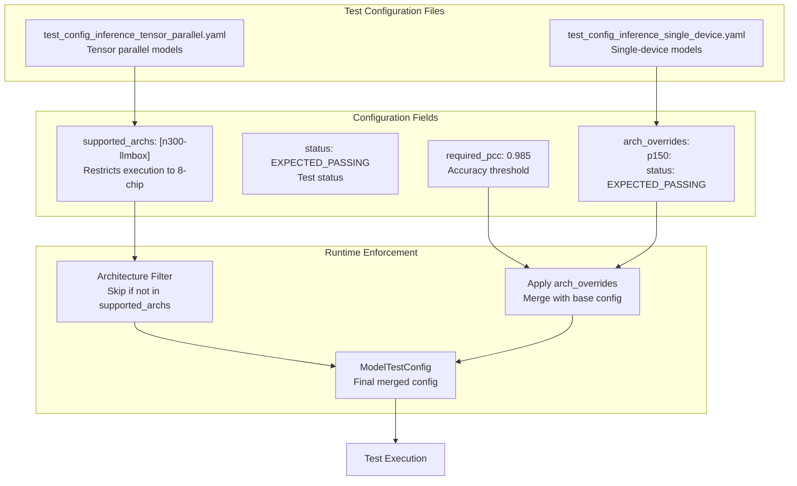
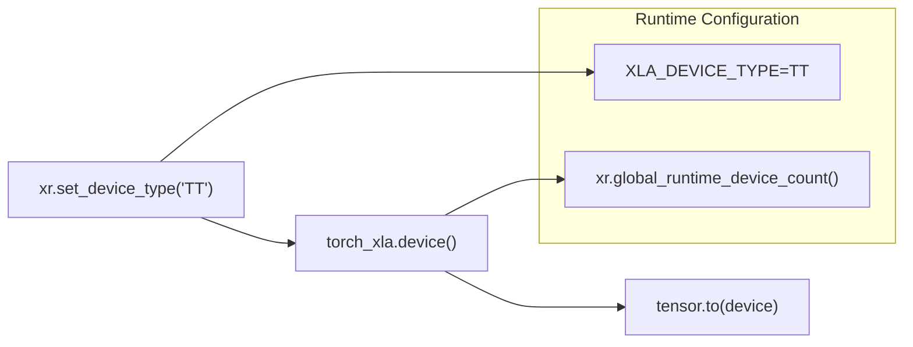
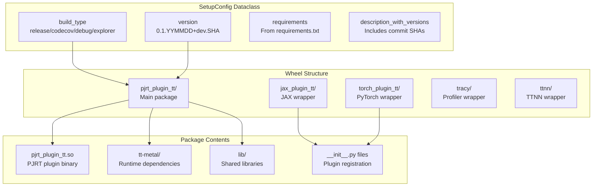
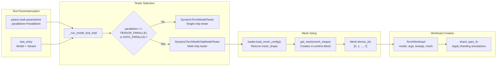
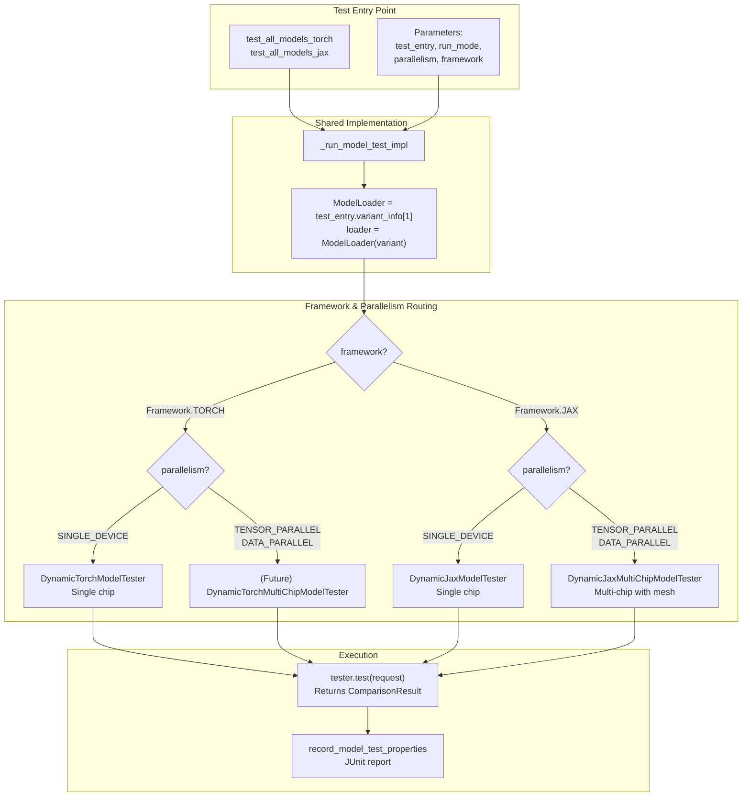
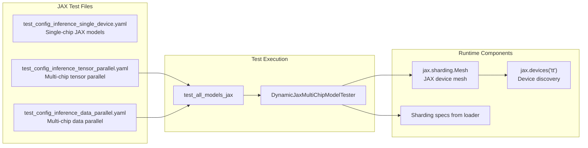
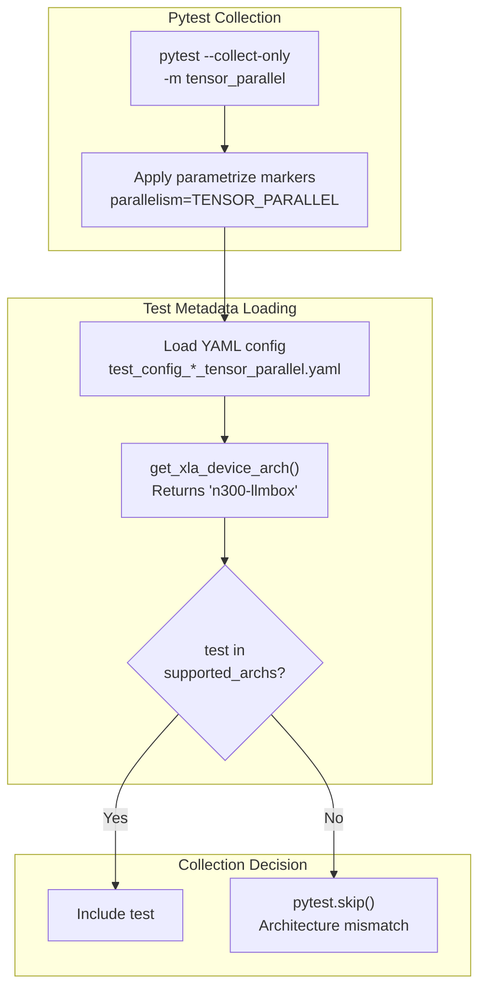
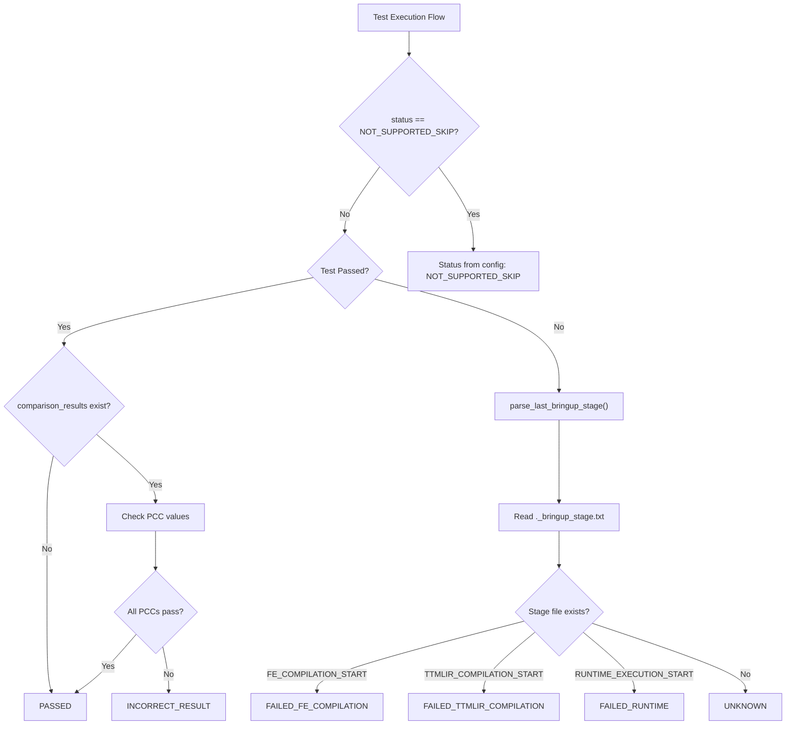

# Multi-Chip Testing

Relevant source files
*   [.github/workflows/manual-test-single.yml](https://github.com/tenstorrent/tt-xla/blob/c77995f6/.github/workflows/manual-test-single.yml)
*   [.github/workflows/test-matrix-presets/model-test-passing.json](https://github.com/tenstorrent/tt-xla/blob/c77995f6/.github/workflows/test-matrix-presets/model-test-passing.json)
*   [.test_durations](https://github.com/tenstorrent/tt-xla/blob/c77995f6/.test_durations)
*   [pytest.ini](https://github.com/tenstorrent/tt-xla/blob/c77995f6/pytest.ini)
*   [tests/infra/testers/single_chip/model/model_tester.py](https://github.com/tenstorrent/tt-xla/blob/c77995f6/tests/infra/testers/single_chip/model/model_tester.py)
*   [tests/infra/testers/single_chip/model/torch_model_tester.py](https://github.com/tenstorrent/tt-xla/blob/c77995f6/tests/infra/testers/single_chip/model/torch_model_tester.py)
*   [tests/infra/utilities/failing_reasons/__init__.py](https://github.com/tenstorrent/tt-xla/blob/c77995f6/tests/infra/utilities/failing_reasons/__init__.py)
*   [tests/infra/utilities/failing_reasons/checks_xla.py](https://github.com/tenstorrent/tt-xla/blob/c77995f6/tests/infra/utilities/failing_reasons/checks_xla.py)
*   [tests/infra/utilities/failing_reasons/finder.py](https://github.com/tenstorrent/tt-xla/blob/c77995f6/tests/infra/utilities/failing_reasons/finder.py)
*   [tests/infra/utilities/failing_reasons/utils.py](https://github.com/tenstorrent/tt-xla/blob/c77995f6/tests/infra/utilities/failing_reasons/utils.py)
*   [tests/runner/test_config/jax/test_config_inference_data_parallel.yaml](https://github.com/tenstorrent/tt-xla/blob/c77995f6/tests/runner/test_config/jax/test_config_inference_data_parallel.yaml)
*   [tests/runner/test_config/jax/test_config_inference_single_device.yaml](https://github.com/tenstorrent/tt-xla/blob/c77995f6/tests/runner/test_config/jax/test_config_inference_single_device.yaml)
*   [tests/runner/test_config/jax/test_config_inference_tensor_parallel.yaml](https://github.com/tenstorrent/tt-xla/blob/c77995f6/tests/runner/test_config/jax/test_config_inference_tensor_parallel.yaml)
*   [tests/runner/test_config/jax/test_config_training_single_device.yaml](https://github.com/tenstorrent/tt-xla/blob/c77995f6/tests/runner/test_config/jax/test_config_training_single_device.yaml)
*   [tests/runner/test_config/torch/test_config_inference_data_parallel.yaml](https://github.com/tenstorrent/tt-xla/blob/c77995f6/tests/runner/test_config/torch/test_config_inference_data_parallel.yaml)
*   [tests/runner/test_config/torch/test_config_inference_single_device.yaml](https://github.com/tenstorrent/tt-xla/blob/c77995f6/tests/runner/test_config/torch/test_config_inference_single_device.yaml)
*   [tests/runner/test_config/torch/test_config_inference_tensor_parallel.yaml](https://github.com/tenstorrent/tt-xla/blob/c77995f6/tests/runner/test_config/torch/test_config_inference_tensor_parallel.yaml)
*   [tests/runner/test_config/torch/test_config_training_single_device.yaml](https://github.com/tenstorrent/tt-xla/blob/c77995f6/tests/runner/test_config/torch/test_config_training_single_device.yaml)
*   [tests/runner/test_config/torch_llm/test_config_inference_single_device.yaml](https://github.com/tenstorrent/tt-xla/blob/c77995f6/tests/runner/test_config/torch_llm/test_config_inference_single_device.yaml)
*   [tests/runner/test_config/torch_llm/test_config_inference_tensor_parallel.yaml](https://github.com/tenstorrent/tt-xla/blob/c77995f6/tests/runner/test_config/torch_llm/test_config_inference_tensor_parallel.yaml)
*   [tests/runner/test_models.py](https://github.com/tenstorrent/tt-xla/blob/c77995f6/tests/runner/test_models.py)
*   [tests/runner/test_utils.py](https://github.com/tenstorrent/tt-xla/blob/c77995f6/tests/runner/test_utils.py)
*   [tests/runner/testers/torch/dynamic_torch_model_tester.py](https://github.com/tenstorrent/tt-xla/blob/c77995f6/tests/runner/testers/torch/dynamic_torch_model_tester.py)
*   [tests/runner/utils/dynamic_loader.py](https://github.com/tenstorrent/tt-xla/blob/c77995f6/tests/runner/utils/dynamic_loader.py)

## Purpose and Scope

This page documents the multi-chip testing infrastructure in tt-xla, which enables model execution and validation across different parallelism strategies (data parallel, tensor parallel) on various Tenstorrent hardware configurations. The testing framework automatically configures device meshes, applies architecture-specific overrides, and validates correctness across single-chip and multi-chip setups.

For general test framework architecture, see [Test Framework Architecture](https://deepwiki.com/tenstorrent/tt-xla/6.1-test-configuration-system). For test configuration details, see [Test Configuration System](https://deepwiki.com/tenstorrent/tt-xla/6.4-comparison-and-validation).

* * *

## Parallelism Modes

The test infrastructure supports three parallelism modes, parameterized through pytest markers and the `Parallelism` enum:

| Parallelism Mode | Description | Use Case | Minimum Chips |
| --- | --- | --- | --- |
| `SINGLE_DEVICE` | Model executes on a single chip | Small models, baseline testing | 1 |
| `DATA_PARALLEL` | Batch dimension sharded across chips | Throughput scaling | 2 |
| `TENSOR_PARALLEL` | Model weights/activations sharded | Large models (7B+) | 2 |

The `Parallelism` enum is defined in [third_party/tt_forge_models/config.py](https://github.com/tenstorrent/tt-xla/blob/c77995f6/third_party/tt_forge_models/config.py) and used throughout the test infrastructure to determine execution strategy.

**Sources:**[tests/runner/test_models.py 247-275](https://github.com/tenstorrent/tt-xla/blob/c77995f6/tests/runner/test_models.py#L247-L275)[third_party/tt_forge_models/config.py](https://github.com/tenstorrent/tt-xla/blob/c77995f6/third_party/tt_forge_models/config.py)

* * *

## Hardware Architecture Support

### Architecture Types

Tests are configured to run on specific hardware architectures using the `supported_archs` field in YAML configuration:

| Architecture | Chip Type | Device Count | Primary Use Case |
| --- | --- | --- | --- |
| `n150` | Wormhole B0 | 1 | Single-chip models |
| `p150` | Blackhole | 1 | Single-chip models, larger memory |
| `n300` | Wormhole B0 | 2 | Dual-chip data/tensor parallel |
| `n300-llmbox` | Wormhole B0 | 8 | Large model tensor parallel |

### Architecture-Specific Overrides

Test configurations support per-architecture overrides for thresholds and status:

The test framework reads the current architecture via `get_xla_device_arch()` and applies the appropriate override when loading test metadata.

**Sources:**[tests/runner/test_config/torch/test_config_inference_tensor_parallel.yaml 1-221](https://github.com/tenstorrent/tt-xla/blob/c77995f6/tests/runner/test_config/torch/test_config_inference_tensor_parallel.yaml#L1-L221)[tests/runner/test_config/torch/test_config_inference_single_device.yaml 51-76](https://github.com/tenstorrent/tt-xla/blob/c77995f6/tests/runner/test_config/torch/test_config_inference_single_device.yaml#L51-L76)

* * *

## Test Configuration for Multi-Chip

### Tensor Parallel Configuration

**Tensor Parallel Test Configuration Example**

**Sources:**[tests/runner/test_config/torch/test_config_inference_tensor_parallel.yaml 7-18](https://github.com/tenstorrent/tt-xla/blob/c77995f6/tests/runner/test_config/torch/test_config_inference_tensor_parallel.yaml#L7-L18)[tests/runner/test_models.py 269-273](https://github.com/tenstorrent/tt-xla/blob/c77995f6/tests/runner/test_models.py#L269-L273)

* * *




**Tensor Parallel Test Configuration Example**

```yaml
```
## Mesh Configuration and Device Setup






### Mesh Creation Flow



### Mesh Configuration Code Path

The mesh configuration follows this flow for tensor parallel tests:

1.   **Test Parameterization**: Test is parameterized with `parallelism=Parallelism.TENSOR_PARALLEL`[tests/runner/test_models.py 264-268](https://github.com/tenstorrent/tt-xla/blob/c77995f6/tests/runner/test_models.py#L264-L268)

2.   **Loader Mesh Configuration**: Loader provides mesh shape via `load_mesh_config()`:

1.   **Runtime Mesh Creation**: `get_mesh()` utility creates `torch_xla.runtime.Mesh`:

1.   **Workload Initialization**: `TorchWorkload` is created with the mesh [tests/infra/testers/single_chip/model/torch_model_tester.py 130-155](https://github.com/tenstorrent/tt-xla/blob/c77995f6/tests/infra/testers/single_chip/model/torch_model_tester.py#L130-L155)

2.   **Sharding Application**: Shard spec function applies `mark_sharding()` annotations to model parameters and activations

**Sources:**[tests/runner/testers/torch/dynamic_torch_model_tester.py 28-82](https://github.com/tenstorrent/tt-xla/blob/c77995f6/tests/runner/testers/torch/dynamic_torch_model_tester.py#L28-L82)[tests/infra/testers/single_chip/model/torch_model_tester.py 131-156](https://github.com/tenstorrent/tt-xla/blob/c77995f6/tests/infra/testers/single_chip/model/torch_model_tester.py#L131-L156)[tests/infra/utilities/torch_multichip_utils.py](https://github.com/tenstorrent/tt-xla/blob/c77995f6/tests/infra/utilities/torch_multichip_utils.py)

* * *

## Multi-Chip Test Execution

### Test Routing by Parallelism



### Tester Instantiation Logic

The `_run_model_test_impl()` function routes to the appropriate tester based on framework and parallelism:

**PyTorch Routing**[tests/runner/test_models.py 114-124](https://github.com/tenstorrent/tt-xla/blob/c77995f6/tests/runner/test_models.py#L114-L124):

**JAX Routing**[tests/runner/test_models.py 124-153](https://github.com/tenstorrent/tt-xla/blob/c77995f6/tests/runner/test_models.py#L124-L153):

**Sources:**[tests/runner/test_models.py 61-204](https://github.com/tenstorrent/tt-xla/blob/c77995f6/tests/runner/test_models.py#L61-L204)[tests/runner/test_models.py 281-303](https://github.com/tenstorrent/tt-xla/blob/c77995f6/tests/runner/test_models.py#L281-L303)

* * *

## JAX Multi-Chip Testing

### JAX-Specific Multi-Chip Testers

JAX has explicit multi-chip tester classes that handle mesh setup and sharding:

| Tester Class | Use Case | Mesh Configuration |
| --- | --- | --- |
| `DynamicJaxModelTester` | Single device | No mesh |
| `DynamicJaxMultiChipModelTester` | Multi-chip data/tensor parallel | Configurable mesh shape |

**JAX Multi-Chip Test Files:**

**JAX Multi-Chip Configuration Examples:**

**Sources:**[tests/runner/test_config/jax/test_config_inference_tensor_parallel.yaml 11-50](https://github.com/tenstorrent/tt-xla/blob/c77995f6/tests/runner/test_config/jax/test_config_inference_tensor_parallel.yaml#L11-L50)[tests/runner/test_config/jax/test_config_inference_data_parallel.yaml 7-49](https://github.com/tenstorrent/tt-xla/blob/c77995f6/tests/runner/test_config/jax/test_config_inference_data_parallel.yaml#L7-L49)[tests/runner/test_models.py 124-153](https://github.com/tenstorrent/tt-xla/blob/c77995f6/tests/runner/test_models.py#L124-L153)

* * *




**JAX Multi-Chip Configuration Examples:**

```yaml
```
## Environment Variables and Runtime Configuration

### Multi-Chip Environment Setup

Multi-chip execution requires specific environment variables for device discovery and mesh configuration. These are typically set in the CI workflow files and test infrastructure:

| Environment Variable | Purpose | Example Value |
| --- | --- | --- |
| `TT_METAL_DEVICE_PROFILER` | Enable device profiling | `1` |
| `TT_MLIR_ENABLE_LOGGING` | Enable MLIR logging | `1` |
| `ENABLE_BRINGUP_STAGE_LOGGING` | Track compilation/runtime stages | `1` |
| `TTXLA_LOGGER_LEVEL` | Control logging verbosity | `DEBUG`, `INFO` |

The `xr.global_runtime_device_count()` function from `torch_xla.runtime` is used to discover available devices during mesh initialization.

### Device Discovery and Mesh Setup

### Mesh Device Initialization

The mesh device initialization occurs during workload execution [tests/infra/testers/single_chip/model/torch_model_tester.py 149-156](https://github.com/tenstorrent/tt-xla/blob/c77995f6/tests/infra/testers/single_chip/model/torch_model_tester.py#L149-L156):

**Sources:**[tests/infra/utilities/torch_multichip_utils.py](https://github.com/tenstorrent/tt-xla/blob/c77995f6/tests/infra/utilities/torch_multichip_utils.py)[tests/infra/testers/single_chip/model/torch_model_tester.py 149-156](https://github.com/tenstorrent/tt-xla/blob/c77995f6/tests/infra/testers/single_chip/model/torch_model_tester.py#L149-L156)

* * *

## Test Duration Tracking for Multi-Chip

The `.test_durations` file tracks execution times for all tests, including multi-chip tests, enabling intelligent timeout calculation and test splitting:

Multi-chip tests typically have longer execution times due to:

*   Device synchronization overhead
*   Multi-chip communication (collective ops: all-reduce, all-gather)
*   Larger model sizes requiring more memory transfers

The CI system uses these durations to:

1.   Calculate appropriate test timeouts (`duration * timeout_multiplier`)
2.   Balance parallel test execution across runners
3.   Identify performance regressions

**Sources:**[.test_durations 77-137](https://github.com/tenstorrent/tt-xla/blob/c77995f6/.test_durations#L77-L137)[.github/workflows/call-test.yml](https://github.com/tenstorrent/tt-xla/blob/c77995f6/.github/workflows/call-test.yml)

* * *

## Multi-Chip Test Markers and Filtering

### Pytest Markers for Multi-Chip

### Test Selection by Architecture

Tests are filtered at collection time based on:

1.   **Parallelism mode**: Single device tests skipped for data/tensor parallel runs
2.   **Supported architectures**: Tests with `supported_archs: ["n300-llmbox"]` only run on 8-chip hardware
3.   **Architecture overrides**: Per-arch status can skip tests (e.g., `NOT_SUPPORTED_SKIP` on n150)

**Test Collection Flow:**

**Sources:**[pytest.ini 1-34](https://github.com/tenstorrent/tt-xla/blob/c77995f6/pytest.ini#L1-L34)[tests/runner/test_models.py 247-303](https://github.com/tenstorrent/tt-xla/blob/c77995f6/tests/runner/test_models.py#L247-L303)

* * *



## Multi-Chip Test Examples

### PyTorch Tensor Parallel Example

**Test Configuration:**

**Test Execution Path:**

1.   Test parameterized as `test_all_models_torch[qwen_3/causal_lm/pytorch-8B-tensor_parallel-inference]`
2.   `parallelism=Parallelism.TENSOR_PARALLEL` parameter applied
3.   `DynamicTorchModelTester` created with mesh configuration
4.   Loader provides shard spec function via `load_shard_spec()`
5.   Model parameters marked with `xs.mark_sharding()` for distribution
6.   Execution runs on 8-chip mesh, results compared with CPU reference

### JAX Data Parallel Example

**Test Configuration:**

**Test Execution Path:**

1.   Test parameterized as `test_all_models_jax[gpt2/causal_lm/jax-Base-data_parallel-inference]`
2.   `parallelism=Parallelism.DATA_PARALLEL` parameter applied
3.   `DynamicJaxMultiChipModelTester` created
4.   JAX mesh created with batch dimension sharded
5.   Input batch split across devices
6.   Execution runs with data parallelism, results aggregated and compared

**Sources:**[tests/runner/test_config/torch/test_config_inference_tensor_parallel.yaml 80-89](https://github.com/tenstorrent/tt-xla/blob/c77995f6/tests/runner/test_config/torch/test_config_inference_tensor_parallel.yaml#L80-L89)[tests/runner/test_config/jax/test_config_inference_data_parallel.yaml 17-20](https://github.com/tenstorrent/tt-xla/blob/c77995f6/tests/runner/test_config/jax/test_config_inference_data_parallel.yaml#L17-L20)

* * *

## Comparison and Validation for Multi-Chip

### Multi-Chip Comparison Strategy

Multi-chip tests follow the same comparison strategy as single-chip tests, with CPU as the reference:

1.   **CPU Reference Execution**: Model runs on CPU with `torch.compile(backend='inductor')`
2.   **Multi-Chip Execution**: Model runs on distributed mesh with sharding
3.   **Result Comparison**: Outputs compared using PCC/ATOL thresholds from test config

**Key Differences for Multi-Chip:**

*   **Reduced PCC thresholds**: Multi-chip tests often have slightly lower PCC due to distributed computation
*   **Per-architecture thresholds**: Different accuracy expectations for n300 vs n300-llmbox
*   **Collective op overhead**: All-reduce, all-gather introduce numerical variations

**Sources:**[tests/runner/test_config/torch/test_config_inference_tensor_parallel.yaml 80-89](https://github.com/tenstorrent/tt-xla/blob/c77995f6/tests/runner/test_config/torch/test_config_inference_tensor_parallel.yaml#L80-L89)[tests/runner/test_utils.py 383-481](https://github.com/tenstorrent/tt-xla/blob/c77995f6/tests/runner/test_utils.py#L383-L481)

* * *

## Failure Analysis for Multi-Chip Tests

### Multi-Chip Specific Failure Patterns

The `FailingReasonsFinder` classifies multi-chip failures into categories:

| Failure Type | Description | Example |
| --- | --- | --- |
| `FAILED_RUNTIME` | Device OOM, mesh setup failure | "Not enough space to allocate DRAM buffer" |
| `FAILED_TTMLIR_COMPILATION` | Sharding legalization failure | "Compare operation not supported for meshes not 1x1" |
| `INCORRECT_RESULT` | PCC failure on multi-chip | "PCC comparison failed on n300-llmbox" |

**Multi-Chip Failure Example:**

### Bringup Status Classification




**Bringup Status**: The bringup status indicates where in the pipeline a test failed. It is determined from the `._bringup_stage.txt` file written by the C++ compilation pipeline, or by comparing PCC values for passing tests.

Sources: [tests/runner/test_utils.py:191-263](), [tests/runner/test_utils.py:504-567]()
```

Multi-chip tests record detailed failure stages via `bringup_status`:

**Sources:**[tests/runner/test_config/torch/test_config_inference_tensor_parallel.yaml 16-18](https://github.com/tenstorrent/tt-xla/blob/c77995f6/tests/runner/test_config/torch/test_config_inference_tensor_parallel.yaml#L16-L18)[tests/runner/test_utils.py 218-244](https://github.com/tenstorrent/tt-xla/blob/c77995f6/tests/runner/test_utils.py#L218-L244)[tests/infra/utilities/failing_reasons/checks_xla.py](https://github.com/tenstorrent/tt-xla/blob/c77995f6/tests/infra/utilities/failing_reasons/checks_xla.py)

Dismiss
Refresh this wiki

Enter email to refresh
