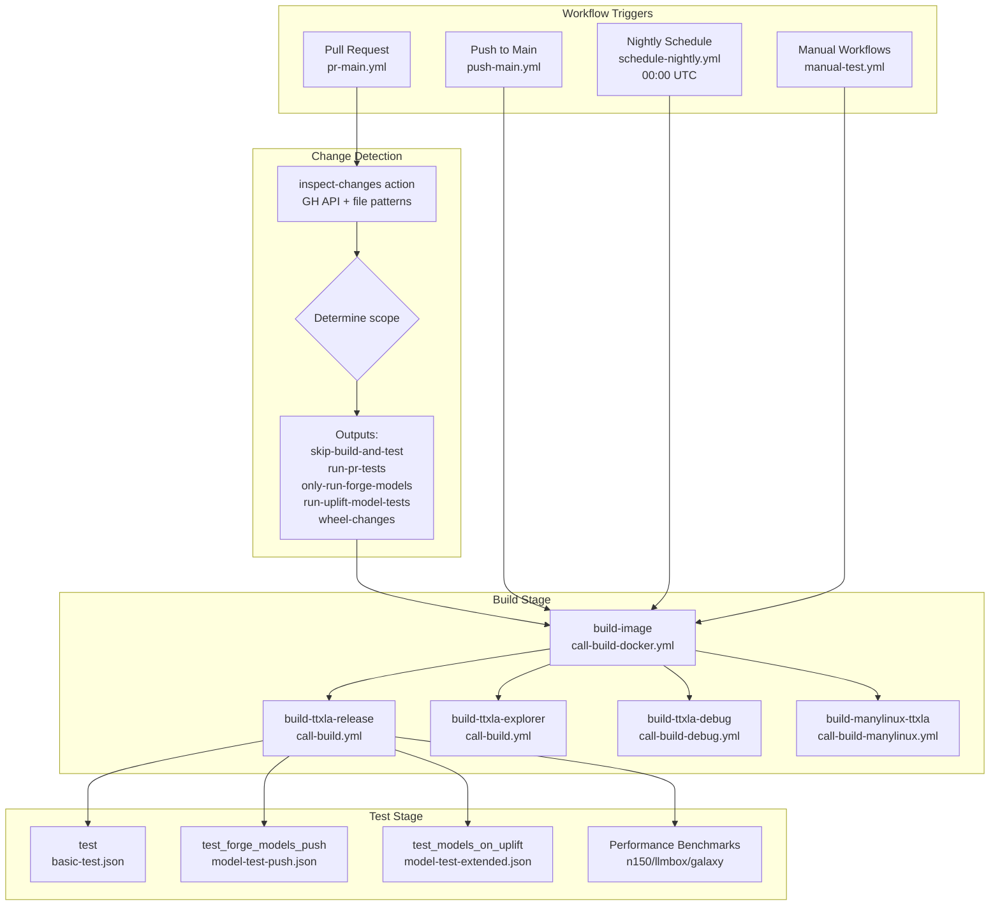
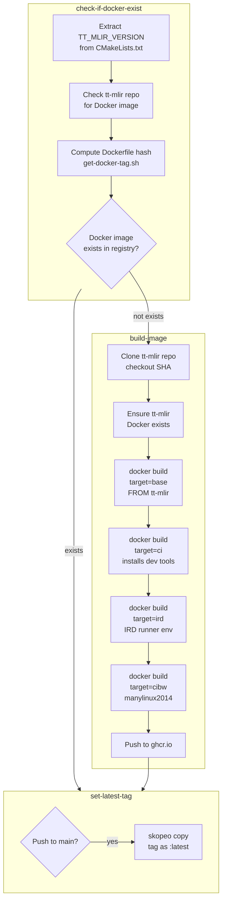
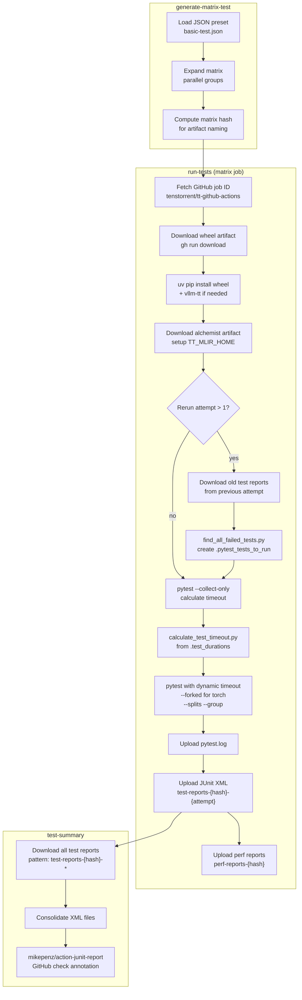
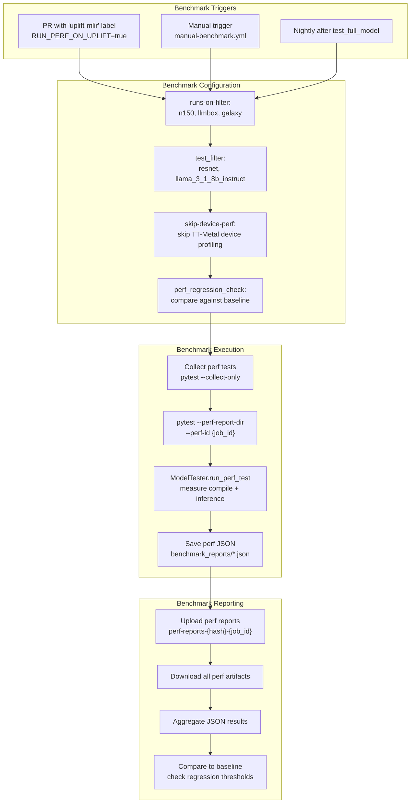
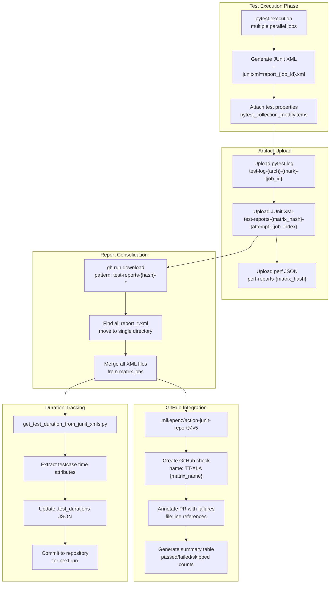
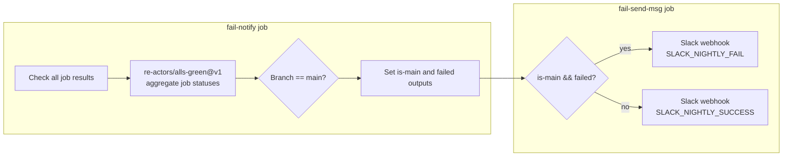

```mermaid
graph TB
    subgraph CheckArtifact["check-existing-artifact"]
        GenName["Generate artifact name<br/>xla-whl-{build_type}"]
        AddSHA{"Reusable artifact?<br/>not PR and<br/>no mlir_override and<br/>single parent"}
        AppendSHA["Append commit SHA<br/>xla-whl-{type}-{sha}"]
        QueryAPI["GitHub API<br/>search artifacts"]
        Found{"Artifact<br/>exists?"}
    end
    
    subgraph BuildTTXLA["build-ttxla"]
        Setup["Setup ccache<br/>container environment"]
        CMakeBuild["CMake configure<br/>-DTTXLA_ENABLE_TOOLS<br/>-DCODE_COVERAGE"]
        NinjaBuild["ninja build<br/>compile PJRT plugin"]
        InstallStep["cmake install<br/>to python_package/build/lib"]
        SetupPy["setup.py bdist_wheel<br/>--build-type {release|explorer|debug}"]
        PruneWheel["Prune install tree<br/>remove static libs<br/>strip symbols<br/>deduplicate .so files"]
        ValidateWheel["wheel-inspect<br/>verify build type metadata"]
        UploadWheel["Upload wheel artifact"]
        UploadAlchemist["Upload alchemist lib<br/>and templates"]
    end
    
    subgraph BuildVLLM["build-vllm-plugin"]
        VLLMSetup["integrations/vllm_plugin/setup.py"]
        VLLMWheel["bdist_wheel"]
        UploadVLLM["Upload vllm-tt wheel"]
    end
    
    GenName --> AddSHA
    AddSHA -->|yes| AppendSHA
    AddSHA -->|no| QueryAPI
    AppendSHA --> QueryAPI
    QueryAPI --> Found
    
    Found -->|no| Setup
    Found -->|yes| UploadWheel
    
    Setup --> CMakeBuild
    CMakeBuild --> NinjaBuild
    NinjaBuild --> InstallStep
    InstallStep --> SetupPy
    SetupPy --> PruneWheel
    PruneWheel --> ValidateWheel
    ValidateWheel --> UploadWheel
    UploadWheel --> UploadAlchemist
    UploadAlchemist --> VLLMSetup
    VLLMSetup --> VLLMWheel
    VLLMWheel --> UploadVLLM
```

# CI/CD Pipeline

Relevant source files
*   [.github/actions/inspect-changes/action.yml](https://github.com/tenstorrent/tt-xla/blob/c77995f6/.github/actions/inspect-changes/action.yml)
*   [.github/build-docker-images.sh](https://github.com/tenstorrent/tt-xla/blob/c77995f6/.github/build-docker-images.sh)
*   [.github/entrypoint.sh](https://github.com/tenstorrent/tt-xla/blob/c77995f6/.github/entrypoint.sh)
*   [.github/scripts/get_test_duration_from_junit_xmls.py](https://github.com/tenstorrent/tt-xla/blob/c77995f6/.github/scripts/get_test_duration_from_junit_xmls.py)
*   [.github/workflows/call-build-docker.yml](https://github.com/tenstorrent/tt-xla/blob/c77995f6/.github/workflows/call-build-docker.yml)
*   [.github/workflows/call-build.yml](https://github.com/tenstorrent/tt-xla/blob/c77995f6/.github/workflows/call-build.yml)
*   [.github/workflows/call-test.yml](https://github.com/tenstorrent/tt-xla/blob/c77995f6/.github/workflows/call-test.yml)
*   [.github/workflows/pr-main.yml](https://github.com/tenstorrent/tt-xla/blob/c77995f6/.github/workflows/pr-main.yml)
*   [.github/workflows/push-main.yml](https://github.com/tenstorrent/tt-xla/blob/c77995f6/.github/workflows/push-main.yml)
*   [.github/workflows/schedule-nightly-experimental.yml](https://github.com/tenstorrent/tt-xla/blob/c77995f6/.github/workflows/schedule-nightly-experimental.yml)
*   [.github/workflows/schedule-nightly.yml](https://github.com/tenstorrent/tt-xla/blob/c77995f6/.github/workflows/schedule-nightly.yml)
*   [.github/workflows/test-matrix-presets/basic-test-nightly.json](https://github.com/tenstorrent/tt-xla/blob/c77995f6/.github/workflows/test-matrix-presets/basic-test-nightly.json)
*   [.github/workflows/test-matrix-presets/basic-test.json](https://github.com/tenstorrent/tt-xla/blob/c77995f6/.github/workflows/test-matrix-presets/basic-test.json)
*   [.github/workflows/test-matrix-presets/model-test-full.json](https://github.com/tenstorrent/tt-xla/blob/c77995f6/.github/workflows/test-matrix-presets/model-test-full.json)
*   [.github/workflows/test-matrix-presets/vllm-model-tests.json](https://github.com/tenstorrent/tt-xla/blob/c77995f6/.github/workflows/test-matrix-presets/vllm-model-tests.json)
*   [examples/pytorch/sdxl-pipeline.py](https://github.com/tenstorrent/tt-xla/blob/c77995f6/examples/pytorch/sdxl-pipeline.py)
*   [python_package/setup.py](https://github.com/tenstorrent/tt-xla/blob/c77995f6/python_package/setup.py)
*   [tests/conftest.py](https://github.com/tenstorrent/tt-xla/blob/c77995f6/tests/conftest.py)
*   [tests/integrations/vllm_plugin/pooling/baseline/e5_mistral_7b_instruct_baseline.pt](https://github.com/tenstorrent/tt-xla/blob/c77995f6/tests/integrations/vllm_plugin/pooling/baseline/e5_mistral_7b_instruct_baseline.pt)
*   [tests/integrations/vllm_plugin/pooling/baseline/qwen3_embedding_8B_baseline.pt](https://github.com/tenstorrent/tt-xla/blob/c77995f6/tests/integrations/vllm_plugin/pooling/baseline/qwen3_embedding_8B_baseline.pt)
*   [tests/integrations/vllm_plugin/pooling/test_single_device.py](https://github.com/tenstorrent/tt-xla/blob/c77995f6/tests/integrations/vllm_plugin/pooling/test_single_device.py)
*   [tests/integrations/vllm_plugin/pooling/utils.py](https://github.com/tenstorrent/tt-xla/blob/c77995f6/tests/integrations/vllm_plugin/pooling/utils.py)
*   [tests/runner/test_config/model_diff.py](https://github.com/tenstorrent/tt-xla/blob/c77995f6/tests/runner/test_config/model_diff.py)
*   [venv/activate](https://github.com/tenstorrent/tt-xla/blob/c77995f6/venv/activate)

## Purpose and Scope

This page documents the GitHub Actions-based CI/CD system that builds, tests, and releases TT-XLA. The pipeline handles Docker image creation, wheel building, test execution across multiple hardware configurations, and artifact publishing. For information about the test framework itself (test configuration, execution, and validation logic), see [Testing Infrastructure](https://deepwiki.com/tenstorrent/tt-xla/6-testing-infrastructure). For build system details (CMake configuration and dependency management), see [Build System](https://deepwiki.com/tenstorrent/tt-xla/3-build-system).

* * *

## Workflow Architecture

The CI/CD system uses GitHub Actions with three primary triggers: pull requests, pushes to main, and scheduled nightly runs. Each trigger activates different job combinations based on change detection and testing requirements.

### Trigger Flow

**Sources:**[.github/workflows/pr-main.yml](https://github.com/tenstorrent/tt-xla/blob/c77995f6/.github/workflows/pr-main.yml)[.github/workflows/push-main.yml](https://github.com/tenstorrent/tt-xla/blob/c77995f6/.github/workflows/push-main.yml)[.github/workflows/schedule-nightly.yml](https://github.com/tenstorrent/tt-xla/blob/c77995f6/.github/workflows/schedule-nightly.yml)[.github/actions/inspect-changes/action.yml](https://github.com/tenstorrent/tt-xla/blob/c77995f6/.github/actions/inspect-changes/action.yml)



### Change Detection Logic

The `inspect-changes` action analyzes modified files in pull requests to optimize CI runtime by skipping unnecessary builds and tests.

**Skip Patterns** (allow build/test skip):

*   Documentation files (`*.md`, `docs/*`)
*   Metadata files (`.gitignore`, `LICENSE`, `CODEOWNERS`)
*   Nightly/experimental test configs
*   Test runner Python files (`tests/runner/*`)

**Wheel-Related Changes** (trigger manylinux build):

*   `CMakeLists.txt` and all nested CMake files
*   `python_package/*` files

**TT-MLIR Uplift Detection:**

*   Parses `third_party/CMakeLists.txt` for `TT_MLIR_VERSION` changes
*   Sets `run-uplift-model-tests=true` to trigger extended testing

**Forge Models Only Mode:**

*   When only test config YAML files under `tests/runner/` change
*   Runs `model_diff.py` to check if test status changed (e.g., NOT_SUPPORTED_SKIP → EXPECTED_PASSING)
*   If only status metadata changed, runs model tests without rebuilding

**Sources:**[.github/actions/inspect-changes/action.yml 32-186](https://github.com/tenstorrent/tt-xla/blob/c77995f6/.github/actions/inspect-changes/action.yml#L32-L186)[tests/runner/test_config/model_diff.py](https://github.com/tenstorrent/tt-xla/blob/c77995f6/tests/runner/test_config/model_diff.py)

* * *

## Build and Artifact Management

### Docker Image Pipeline

The Docker build system creates layered images from a base TT-MLIR image, with caching to avoid redundant builds.

**Image Types:**

*   `tt-xla-base-ubuntu-22-04`: Minimal runtime environment
*   `tt-xla-ci-ubuntu-22-04`: Development tools, pytest, etc.
*   `tt-xla-ird-ubuntu-22-04`: IRD (Internal Runner Daemon) environment
*   `tt-xla-cibuildwheel-manylinux-2-34`: Manylinux wheel building

**Tagging Strategy:**

*   Tag format: `ghcr.io/tenstorrent/tt-xla/<image-name>:<hash>`
*   Hash computed from: Dockerfile content + TT-MLIR SHA + toolchain version
*   Main branch commits get `:latest` tag via `skopeo copy`

**Sources:**[.github/workflows/call-build-docker.yml](https://github.com/tenstorrent/tt-xla/blob/c77995f6/.github/workflows/call-build-docker.yml)[.github/build-docker-images.sh](https://github.com/tenstorrent/tt-xla/blob/c77995f6/.github/build-docker-images.sh)




**Image Types:**
- `tt-xla-base-ubuntu-22-04`: Minimal runtime environment
- `tt-xla-ci-ubuntu-22-04`: Development tools, pytest, etc.
- `tt-xla-ird-ubuntu-22-04`: IRD (Internal Runner Daemon) environment
- `tt-xla-cibuildwheel-manylinux-2-34`: Manylinux wheel building

**Tagging Strategy:**
- Tag format: `ghcr.io/tenstorrent/tt-xla/<image-name>:<hash>`
- Hash computed from: Dockerfile content + TT-MLIR SHA + toolchain version
- Main branch commits get `:latest` tag via `skopeo copy`
```
### Wheel Build and Artifact Caching

The build system compiles TT-XLA wheels with intelligent artifact caching to skip redundant builds.

**Artifact Naming:**

*   Release build: `xla-whl-release-{sha}`
*   Explorer build: `xla-whl-explorer-{sha}` (includes tt-alchemist tools)
*   Debug build: `xla-whl-debug` (no SHA, always rebuild)
*   vLLM plugin: `vllm-tt-whl-release-{sha}`
*   Alchemist: `alchemist-lib-release-{sha}` (library + templates)

**Reuse Conditions** (artifact cache hit):

1.   Not a pull request event (`github.event_name != 'pull_request'`)
2.   Not a merge commit (exactly 1 parent)
3.   No `mlir_override` input specified
4.   Exact artifact name match in repository

**Pruning Operations** (reduce wheel size):

*   Remove static archives (`.a` files) from `lib/` and `lib64/`
*   Remove CMake and pkgconfig files
*   Remove include directories
*   Strip debug symbols from `.so` files using `strip --strip-unneeded`
*   Deduplicate shared objects by SHA256 hash, replace with symlinks
*   Remove broken symlinks (from tt-umd issues)

**Sources:**[.github/workflows/call-build.yml](https://github.com/tenstorrent/tt-xla/blob/c77995f6/.github/workflows/call-build.yml)[python_package/setup.py 255-471](https://github.com/tenstorrent/tt-xla/blob/c77995f6/python_package/setup.py#L255-L471)

* * *




**Artifact Naming:**
- Release build: `xla-whl-release-{sha}`
- Explorer build: `xla-whl-explorer-{sha}` (includes tt-alchemist tools)
- Debug build: `xla-whl-debug` (no SHA, always rebuild)
- vLLM plugin: `vllm-tt-whl-release-{sha}`
- Alchemist: `alchemist-lib-release-{sha}` (library + templates)

**Reuse Conditions** (artifact cache hit):
1. Not a pull request event (`github.event_name != 'pull_request'`)
2. Not a merge commit (exactly 1 parent)
3. No `mlir_override` input specified
4. Exact artifact name match in repository

**Pruning Operations** (reduce wheel size):
- Remove static archives (`.a` files) from `lib/` and `lib64/`
- Remove CMake and pkgconfig files
- Remove include directories
- Strip debug symbols from `.so` files using `strip --strip-unneeded`
- Deduplicate shared objects by SHA256 hash, replace with symlinks
- Remove broken symlinks (from tt-umd issues)
```
## Test Matrix Generation and Execution

### Test Matrix Structure

Test execution is controlled by JSON preset files that define test configurations for different hardware and scenarios.

**Matrix Preset Files:**

*   `basic-test.json`: PR and push tests (push marker)
*   `basic-test-nightly.json`: Nightly smoke tests (nightly marker)
*   `model-test-push.json`: Forge model push tests
*   `model-test-passing.json`: All passing forge models
*   `model-test-xfail.json`: Known failures (KNOWN_FAILURE_XFAIL)
*   `model-test-experimental.json`: Experimental/unknown status
*   `model-test-extended.json`: Extended tests for MLIR uplifts

**JSON Schema:**

`{  "runs-on": "hardware_arch",  "name": "job_name",  "dir": "test_directory",  "test-mark": "pytest_markers",  "parallel-groups": 1,  "shared-runners": "true|false",  "args": "additional_pytest_args",  "contains": "test_filter"}`
**Hardware Targets:**

*   `wormhole_b0`: Single Wormhole B0 chip
*   `n150`: Nebula 150 single device
*   `p150`: Phoenix 150 single device
*   `n300`: Nebula 300 dual-chip
*   `n300-llmbox`: 4-device or 8-device LLM box
*   `galaxy-wh-6u`: Galaxy 6U rack

**Sources:**[.github/workflows/test-matrix-presets/basic-test.json](https://github.com/tenstorrent/tt-xla/blob/c77995f6/.github/workflows/test-matrix-presets/basic-test.json)[.github/workflows/test-matrix-presets/basic-test-nightly.json](https://github.com/tenstorrent/tt-xla/blob/c77995f6/.github/workflows/test-matrix-presets/basic-test-nightly.json)

### Test Execution Flow

**Key Test Execution Features:**

1.   **Dynamic Timeout Calculation:**

    *   Reads `.test_durations` file with historical test times
    *   Uses `calculate_test_timeout.py` to estimate group runtime
    *   Adds buffer for variance
    *   Falls back to 240 minutes for tests with `notimeout` marker

2.   **Test Splitting:**

    *   Uses pytest-split plugin with `--splitting-algorithm least_duration`
    *   Distributes tests across `parallel-groups` workers
    *   Each worker runs `--group N` of `--splits M`

3.   **Rerun Logic:**

    *   On GitHub Actions retry (`github.run_attempt > 1`)
    *   Downloads test reports from previous attempt
    *   Extracts failed test names with `find_all_failed_tests.py`
    *   Creates `.pytest_tests_to_run` file
    *   Pytest runs only tests in that file

4.   **Pytest Forking:**

    *   Used for torch tests to isolate FX graph compilation
    *   Controlled by job name pattern matching
    *   Skipped for multichip tests due to subprocess issues
    *   Provides better progress reporting (`-vv` vs `-sv`)

**Sources:**[.github/workflows/call-test.yml](https://github.com/tenstorrent/tt-xla/blob/c77995f6/.github/workflows/call-test.yml)[tests/conftest.py 69-180](https://github.com/tenstorrent/tt-xla/blob/c77995f6/tests/conftest.py#L69-L180)




**Key Test Execution Features:**

1. **Dynamic Timeout Calculation:**
   - Reads `.test_durations` file with historical test times
   - Uses `calculate_test_timeout.py` to estimate group runtime
   - Adds buffer for variance
   - Falls back to 240 minutes for tests with `notimeout` marker

2. **Test Splitting:**
   - Uses pytest-split plugin with `--splitting-algorithm least_duration`
   - Distributes tests across `parallel-groups` workers
   - Each worker runs `--group N` of `--splits M`

3. **Rerun Logic:**
   - On GitHub Actions retry (`github.run_attempt > 1`)
   - Downloads test reports from previous attempt
   - Extracts failed test names with `find_all_failed_tests.py`
   - Creates `.pytest_tests_to_run` file
   - Pytest runs only tests in that file

4. **Pytest Forking:**
   - Used for torch tests to isolate FX graph compilation
   - Controlled by job name pattern matching
   - Skipped for multichip tests due to subprocess issues
   - Provides better progress reporting (`-vv` vs `-sv`)
```
### Container Configuration

Test jobs run in Docker containers with device access and volume mounts.

`container:  image: ${{ inputs.docker_image }}  options: --device /dev/tenstorrent  volumes:    - /dev/hugepages:/dev/hugepages    - /dev/hugepages-1G:/dev/hugepages-1G    - /etc/udev/rules.d:/etc/udev/rules.d    - /lib/modules:/lib/modules    - /opt/tt_metal_infra/provisioning/provisioning_env:/opt/tt_metal_infra/provisioning/provisioning_env    - /mnt/dockercache:/mnt/dockercache`
**Environment Variables:**

*   `TT_XLA_CI=1`: Marks CI environment
*   `TT_METAL_OPERATION_TIMEOUT_SECONDS`: Op timeout (default 300s)
*   `TT_METAL_DISPATCH_TIMEOUT_COMMAND_TO_EXECUTE`: Triage command on timeout
*   `HF_HOME=/mnt/dockercache/huggingface`: HuggingFace cache
*   `TORCH_HOME=/mnt/dockercache/torchhub`: PyTorch hub cache
*   `DOCKER_CACHE_ROOT=/mnt/dockercache`: General cache (CIv1)
*   `IRD_LF_CACHE`: IRD large file cache (CIv2)

**Sources:**[.github/workflows/call-test.yml 68-97](https://github.com/tenstorrent/tt-xla/blob/c77995f6/.github/workflows/call-test.yml#L68-L97)

* * *

## Performance Benchmarking

Performance tests measure execution time and throughput on different hardware configurations.

### Benchmark Workflow

**Performance Metrics Collected:**

*   Compilation time (first run)
*   Inference time (warm runs)
*   Throughput (tokens/second for LLMs)
*   Memory usage (if `--log-memory` enabled)

**Benchmark Hardware Configurations:**

*   **n150**: Single device performance baseline
*   **llmbox**: Multi-device tensor parallel (4 or 8 chips)
*   **galaxy**: Large-scale deployment (6U rack)

**Report Format:**

`{  "test_id": "job_id",  "model_name": "llama_3_1_8b_instruct",  "hardware": "n150",  "compile_time_ms": 12500,  "inference_time_ms": 850,  "throughput_tokens_per_sec": 42.3}`
**Sources:**[.github/workflows/pr-main.yml 96-139](https://github.com/tenstorrent/tt-xla/blob/c77995f6/.github/workflows/pr-main.yml#L96-L139)[.github/workflows/call-test.yml 373-381](https://github.com/tenstorrent/tt-xla/blob/c77995f6/.github/workflows/call-test.yml#L373-L381)

* * *




**Performance Metrics Collected:**
- Compilation time (first run)
- Inference time (warm runs)
- Throughput (tokens/second for LLMs)
- Memory usage (if `--log-memory` enabled)

**Benchmark Hardware Configurations:**
- **n150**: Single device performance baseline
- **llmbox**: Multi-device tensor parallel (4 or 8 chips)
- **galaxy**: Large-scale deployment (6U rack)

**Report Format:**
```json
{
  "test_id": "job_id",
  "model_name": "llama_3_1_8b_instruct",
  "hardware": "n150",
  "compile_time_ms": 12500,
  "inference_time_ms": 850,
  "throughput_tokens_per_sec": 42.3
}
```
## Result Collection and Reporting

### Test Report Processing

**Test Property Tags** (attached via `pytest_collection_modifyitems`):

`tags = {    "test_name": "test_llama_inference",    "specific_test_case": "test_llama_inference[llama-2-7b-single-device]",    "model_name": "llama-2-7b",    "model_info": {...},  # ModelInfo.to_report_dict()    "run_mode": "inference",    "parallelism": "single_device",    "bringup_status": "EXPECTED_PASSING",    "pcc": "0.99",    "atol": "0.01"}`
These properties are serialized into the JUnit XML `<testcase>` elements and used for dashboard visualization and failure analysis.

**Sources:**[.github/workflows/call-test.yml 384-410](https://github.com/tenstorrent/tt-xla/blob/c77995f6/.github/workflows/call-test.yml#L384-L410)[tests/conftest.py 27-180](https://github.com/tenstorrent/tt-xla/blob/c77995f6/tests/conftest.py#L27-L180)[.github/scripts/get_test_duration_from_junit_xmls.py](https://github.com/tenstorrent/tt-xla/blob/c77995f6/.github/scripts/get_test_duration_from_junit_xmls.py)




**Test Property Tags** (attached via `pytest_collection_modifyitems`):
```python
tags = {
    "test_name": "test_llama_inference",
    "specific_test_case": "test_llama_inference[llama-2-7b-single-device]",
    "model_name": "llama-2-7b",
    "model_info": {...},  # ModelInfo.to_report_dict()
    "run_mode": "inference",
    "parallelism": "single_device",
    "bringup_status": "EXPECTED_PASSING",
    "pcc": "0.99",
    "atol": "0.01"
}
```

These properties are serialized into the JUnit XML `<testcase>` elements and used for dashboard visualization and failure analysis.
```
### Failure Notification

Nightly builds send Slack notifications on success or failure.

**Slack Payload:**

`{  "text": "Bad bad nightly: <workflow_run_url>",  "channel": "C08GYB57C8M",  "unfurl_links": false,  "unfurl_media": false}`
**Sources:**[.github/workflows/schedule-nightly.yml 95-149](https://github.com/tenstorrent/tt-xla/blob/c77995f6/.github/workflows/schedule-nightly.yml#L95-L149)

* * *




**Slack Payload:**
```json
{
  "text": "Bad bad nightly: <workflow_run_url>",
  "channel": "C08GYB57C8M",
  "unfurl_links": false,
  "unfurl_media": false
}
```
## Key Code Entities Reference

### GitHub Actions Workflows

*   `pr-main.yml`: PR validation workflow
*   `push-main.yml`: Main branch post-merge workflow
*   `schedule-nightly.yml`: Daily scheduled tests
*   `call-test.yml`: Reusable test workflow
*   `call-build.yml`: Reusable build workflow
*   `call-build-docker.yml`: Reusable Docker build workflow
*   `call-generate-matrix.yml`: Matrix generation workflow

### Scripts and Actions

*   `inspect-changes/action.yml`: Change detection logic
*   `build-docker-images.sh`: Docker image builder
*   `get-docker-tag.sh`: Docker tag computation
*   `find_all_failed_tests.py`: Rerun failure extraction
*   `calculate_test_timeout.py`: Dynamic timeout calculation
*   `get_test_duration_from_junit_xmls.py`: Duration extraction

### Build System

*   `python_package/setup.py`: Wheel building (`CMakeBuildPy`, `BdistWheel`)
*   `venv/activate`: Environment setup script

### Configuration Files

*   `test-matrix-presets/*.json`: Test matrix definitions
*   `.test_durations`: Historical test durations (JSON)
*   `pytest.ini`: Pytest configuration

**Sources:** All files listed above from provided context.

Dismiss
Refresh this wiki

Enter email to refresh
