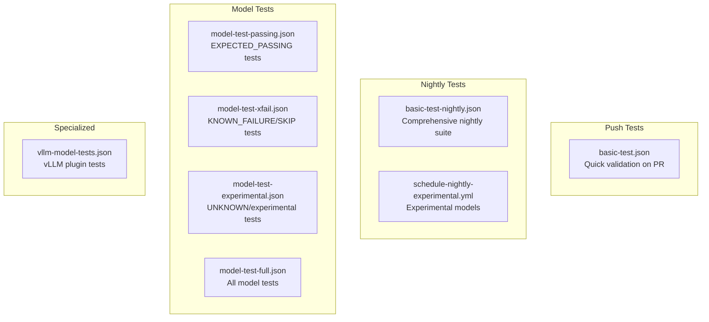
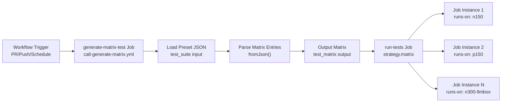
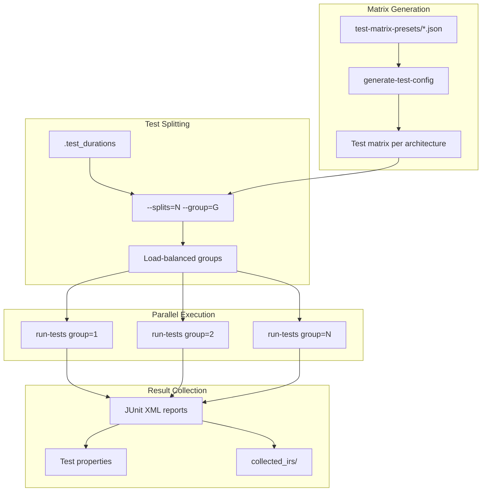
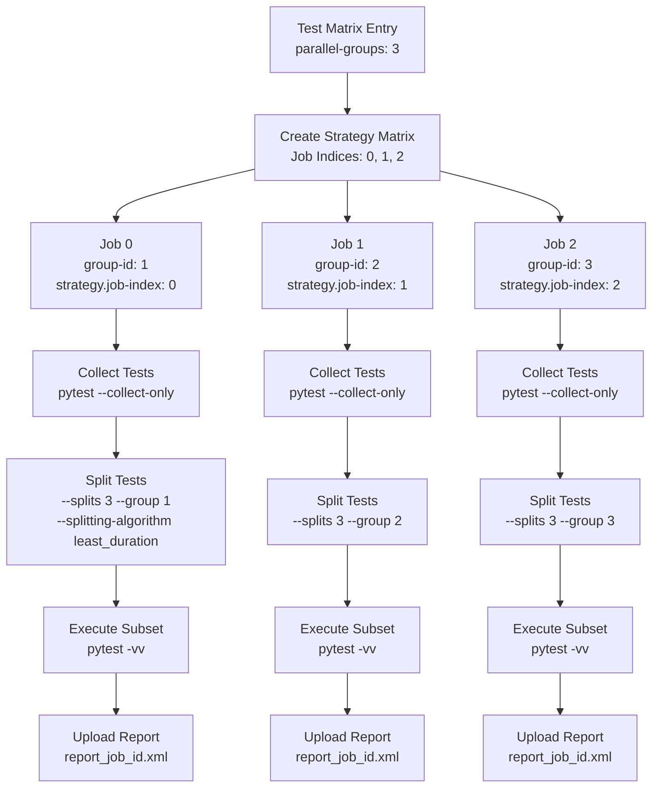
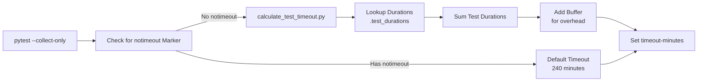
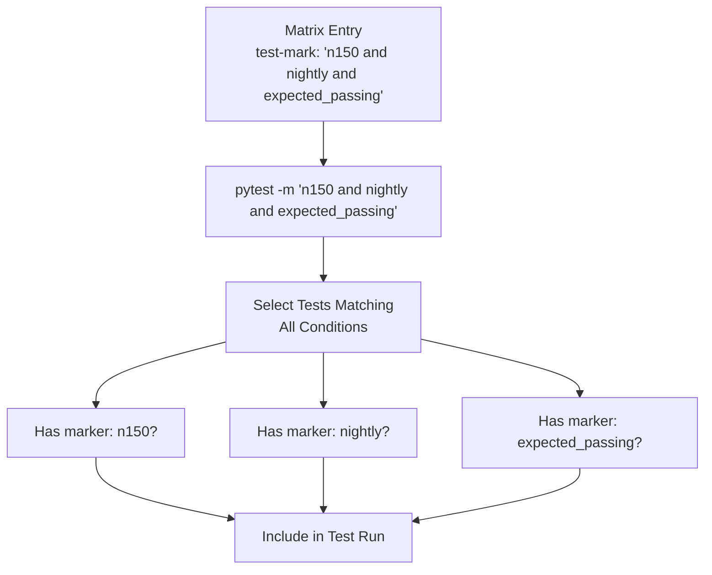
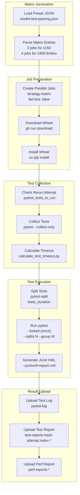

# Test Matrix Generation and Execution

Relevant source files
*   [.github/workflows/call-test.yml](https://github.com/tenstorrent/tt-xla/blob/c77995f6/.github/workflows/call-test.yml)
*   [.github/workflows/manual-test-single.yml](https://github.com/tenstorrent/tt-xla/blob/c77995f6/.github/workflows/manual-test-single.yml)
*   [.github/workflows/schedule-nightly-experimental.yml](https://github.com/tenstorrent/tt-xla/blob/c77995f6/.github/workflows/schedule-nightly-experimental.yml)
*   [.github/workflows/schedule-nightly.yml](https://github.com/tenstorrent/tt-xla/blob/c77995f6/.github/workflows/schedule-nightly.yml)
*   [.github/workflows/test-matrix-presets/basic-test-nightly.json](https://github.com/tenstorrent/tt-xla/blob/c77995f6/.github/workflows/test-matrix-presets/basic-test-nightly.json)
*   [.github/workflows/test-matrix-presets/basic-test.json](https://github.com/tenstorrent/tt-xla/blob/c77995f6/.github/workflows/test-matrix-presets/basic-test.json)
*   [.github/workflows/test-matrix-presets/model-test-full.json](https://github.com/tenstorrent/tt-xla/blob/c77995f6/.github/workflows/test-matrix-presets/model-test-full.json)
*   [.github/workflows/test-matrix-presets/model-test-passing.json](https://github.com/tenstorrent/tt-xla/blob/c77995f6/.github/workflows/test-matrix-presets/model-test-passing.json)
*   [.github/workflows/test-matrix-presets/vllm-model-tests.json](https://github.com/tenstorrent/tt-xla/blob/c77995f6/.github/workflows/test-matrix-presets/vllm-model-tests.json)
*   [.test_durations](https://github.com/tenstorrent/tt-xla/blob/c77995f6/.test_durations)
*   [examples/pytorch/sdxl-pipeline.py](https://github.com/tenstorrent/tt-xla/blob/c77995f6/examples/pytorch/sdxl-pipeline.py)
*   [tests/conftest.py](https://github.com/tenstorrent/tt-xla/blob/c77995f6/tests/conftest.py)
*   [tests/integrations/vllm_plugin/pooling/baseline/e5_mistral_7b_instruct_baseline.pt](https://github.com/tenstorrent/tt-xla/blob/c77995f6/tests/integrations/vllm_plugin/pooling/baseline/e5_mistral_7b_instruct_baseline.pt)
*   [tests/integrations/vllm_plugin/pooling/baseline/qwen3_embedding_8B_baseline.pt](https://github.com/tenstorrent/tt-xla/blob/c77995f6/tests/integrations/vllm_plugin/pooling/baseline/qwen3_embedding_8B_baseline.pt)
*   [tests/integrations/vllm_plugin/pooling/test_single_device.py](https://github.com/tenstorrent/tt-xla/blob/c77995f6/tests/integrations/vllm_plugin/pooling/test_single_device.py)
*   [tests/integrations/vllm_plugin/pooling/utils.py](https://github.com/tenstorrent/tt-xla/blob/c77995f6/tests/integrations/vllm_plugin/pooling/utils.py)
*   [tests/runner/test_config/jax/test_config_inference_data_parallel.yaml](https://github.com/tenstorrent/tt-xla/blob/c77995f6/tests/runner/test_config/jax/test_config_inference_data_parallel.yaml)
*   [tests/runner/test_config/jax/test_config_inference_single_device.yaml](https://github.com/tenstorrent/tt-xla/blob/c77995f6/tests/runner/test_config/jax/test_config_inference_single_device.yaml)
*   [tests/runner/test_config/jax/test_config_inference_tensor_parallel.yaml](https://github.com/tenstorrent/tt-xla/blob/c77995f6/tests/runner/test_config/jax/test_config_inference_tensor_parallel.yaml)
*   [tests/runner/test_config/jax/test_config_training_single_device.yaml](https://github.com/tenstorrent/tt-xla/blob/c77995f6/tests/runner/test_config/jax/test_config_training_single_device.yaml)
*   [tests/runner/test_config/torch/test_config_inference_data_parallel.yaml](https://github.com/tenstorrent/tt-xla/blob/c77995f6/tests/runner/test_config/torch/test_config_inference_data_parallel.yaml)
*   [tests/runner/test_config/torch/test_config_inference_single_device.yaml](https://github.com/tenstorrent/tt-xla/blob/c77995f6/tests/runner/test_config/torch/test_config_inference_single_device.yaml)
*   [tests/runner/test_config/torch/test_config_inference_tensor_parallel.yaml](https://github.com/tenstorrent/tt-xla/blob/c77995f6/tests/runner/test_config/torch/test_config_inference_tensor_parallel.yaml)
*   [tests/runner/test_config/torch/test_config_training_single_device.yaml](https://github.com/tenstorrent/tt-xla/blob/c77995f6/tests/runner/test_config/torch/test_config_training_single_device.yaml)
*   [tests/runner/test_config/torch_llm/test_config_inference_single_device.yaml](https://github.com/tenstorrent/tt-xla/blob/c77995f6/tests/runner/test_config/torch_llm/test_config_inference_single_device.yaml)
*   [tests/runner/test_config/torch_llm/test_config_inference_tensor_parallel.yaml](https://github.com/tenstorrent/tt-xla/blob/c77995f6/tests/runner/test_config/torch_llm/test_config_inference_tensor_parallel.yaml)

## Purpose and Scope

This page documents the test matrix generation and execution system in TT-XLA's CI/CD pipeline. The test matrix system dynamically creates parallel test jobs from JSON preset files, distributes tests across hardware runners, and optimizes execution through duration-based splitting.

For information about workflow architecture and triggers, see [Workflow Architecture](https://deepwiki.com/tenstorrent/tt-xla/7.1-workflow-architecture). For result collection and reporting, see [Result Collection and Reporting](https://deepwiki.com/tenstorrent/tt-xla/7.5-result-collection-and-reporting).

* * *

## Test Matrix Preset Files

Test matrix presets are JSON files that define collections of test jobs to execute. Each preset targets specific test scenarios (push, nightly, model tests, etc.) and hardware configurations.

### Preset File Structure

Each preset file contains an array of test job definitions with the following fields:

| Field | Required | Description |
| --- | --- | --- |
| `runs-on` | Yes | Target hardware: `n150`, `p150`, `n300`, `n300-llmbox`, `galaxy-wh-6u` |
| `name` | Yes | Job identifier used in CI logs and reports |
| `dir` | Yes | Path to test directory passed to pytest |
| `test-mark` | Yes | Pytest marker expression for test selection |
| `parallel-groups` | No | Number of parallel workers (default: 1) |
| `shared-runners` | No | Use CIv2 shared runners instead of dedicated hardware |
| `contains` | No | Filter tests by name substring (pytest `-k`) |
| `args` | No | Additional pytest arguments |

### Available Preset Files

**Sources:**[.github/workflows/test-matrix-presets/basic-test.json](https://github.com/tenstorrent/tt-xla/blob/c77995f6/.github/workflows/test-matrix-presets/basic-test.json)[.github/workflows/test-matrix-presets/basic-test-nightly.json](https://github.com/tenstorrent/tt-xla/blob/c77995f6/.github/workflows/test-matrix-presets/basic-test-nightly.json)[.github/workflows/test-matrix-presets/model-test-passing.json](https://github.com/tenstorrent/tt-xla/blob/c77995f6/.github/workflows/test-matrix-presets/model-test-passing.json)[.github/workflows/test-matrix-presets/model-test-experimental.json](https://github.com/tenstorrent/tt-xla/blob/c77995f6/.github/workflows/test-matrix-presets/model-test-experimental.json)

* * *



## Matrix Generation Workflow

### Generation Process

The `generate-matrix-test` job at [.github/workflows/call-test.yml 48-53](https://github.com/tenstorrent/tt-xla/blob/c77995f6/.github/workflows/call-test.yml#L48-L53) calls `call-generate-matrix.yml` with the `test_suite` input parameter. This workflow:

1.   Loads the specified JSON preset file
2.   Parses the matrix entries
3.   Outputs the matrix as `test_matrix` for downstream jobs
4.   Generates a hash `test_matrix_hash` for artifact naming




The `generate-matrix-test` job at [.github/workflows/call-test.yml:48-53]() calls `call-generate-matrix.yml` with the `test_suite` input parameter. This workflow:

1. Loads the specified JSON preset file
2. Parses the matrix entries
3. Outputs the matrix as `test_matrix` for downstream jobs
4. Generates a hash `test_matrix_hash` for artifact naming
```
### Example Preset Entry

From [.github/workflows/test-matrix-presets/basic-test.json 2-3](https://github.com/tenstorrent/tt-xla/blob/c77995f6/.github/workflows/test-matrix-presets/basic-test.json#L2-L3):

This creates 5 parallel test jobs on `n150` hardware, each running a subset of torch tests marked with `push and single_device`.

**Sources:**[.github/workflows/call-test.yml 48-53](https://github.com/tenstorrent/tt-xla/blob/c77995f6/.github/workflows/call-test.yml#L48-L53)[.github/workflows/test-matrix-presets/basic-test.json 1-17](https://github.com/tenstorrent/tt-xla/blob/c77995f6/.github/workflows/test-matrix-presets/basic-test.json#L1-L17)

* * *

## Test Configuration System

Test configuration YAML files complement matrix presets by providing per-model test settings. These are located under `tests/runner/test_config/` organized by framework and test type.

### Configuration File Hierarchy

```mermaid
graph TB
    TestConfig["tests/runner/test_config/"]
    
    TestConfig --> Torch["torch/"]
    TestConfig --> JAX["jax/"]
    TestConfig --> TorchLLM["torch_llm/"]
    
    Torch --> TorchInfSingle["test_config_inference_single_device.yaml"]
    Torch --> TorchInfTensor["test_config_inference_tensor_parallel.yaml"]
    Torch --> TorchInfData["test_config_inference_data_parallel.yaml"]
    Torch --> TorchTraining["test_config_training_single_device.yaml"]
    
    JAX --> JAXInfSingle["test_config_inference_single_device.yaml"]
    JAX --> JAXInfTensor["test_config_inference_tensor_parallel.yaml"]
    JAX --> JAXTraining["test_config_training_single_device.yaml"]
    
    TorchLLM --> LLMInfSingle["test_config_inference_single_device.yaml"]
    TorchLLM --> LLMInfTensor["test_config_inference_tensor_parallel.yaml"]
```



### YAML Configuration Structure

Each test entry in the YAML file follows this format:

### Test Status Values

| Status | Pytest Behavior | Purpose |
| --- | --- | --- |
| `EXPECTED_PASSING` | Test must pass | Production-ready tests |
| `KNOWN_FAILURE_XFAIL` | Expected failure (xfail) | Known issues being tracked |
| `NOT_SUPPORTED_SKIP` | Skipped | Features not yet supported |
| `EXCLUDE_MODEL` | Not collected | Model variant excluded from test suite |

### Example Configuration Entry

From [tests/runner/test_config/torch/test_config_inference_single_device.yaml 11-20](https://github.com/tenstorrent/tt-xla/blob/c77995f6/tests/runner/test_config/torch/test_config_inference_single_device.yaml#L11-L20):

**Sources:**[tests/runner/test_config/torch/test_config_inference_single_device.yaml 1-100](https://github.com/tenstorrent/tt-xla/blob/c77995f6/tests/runner/test_config/torch/test_config_inference_single_device.yaml#L1-L100)[tests/runner/test_config/jax/test_config_inference_single_device.yaml 1-50](https://github.com/tenstorrent/tt-xla/blob/c77995f6/tests/runner/test_config/jax/test_config_inference_single_device.yaml#L1-L50)[tests/runner/test_config/torch_llm/test_config_inference_single_device.yaml 1-50](https://github.com/tenstorrent/tt-xla/blob/c77995f6/tests/runner/test_config/torch_llm/test_config_inference_single_device.yaml#L1-L50)

* * *

## Parallel Test Execution



### Execution Flow with Parallelization



### Test Splitting Strategy

The `pytest-split` plugin divides tests across parallel workers using the `least_duration` algorithm, which:

1.   Reads historical test durations from `.test_durations`
2.   Sorts tests by duration (longest first)
3.   Assigns tests to workers in a round-robin fashion to balance total duration

From [.github/workflows/call-test.yml 262-265](https://github.com/tenstorrent/tt-xla/blob/c77995f6/.github/workflows/call-test.yml#L262-L265):

### Duration-Based Timeout Calculation

Each job calculates its timeout dynamically based on collected tests:

From [.github/workflows/call-test.yml 303-318](https://github.com/tenstorrent/tt-xla/blob/c77995f6/.github/workflows/call-test.yml#L303-L318):

The script at `.github/scripts/calculate_test_timeout.py` looks up each test in `.test_durations` and calculates the estimated runtime with a buffer for compilation and overhead.

**Sources:**[.github/workflows/call-test.yml 228-276](https://github.com/tenstorrent/tt-xla/blob/c77995f6/.github/workflows/call-test.yml#L228-L276)[.github/workflows/call-test.yml 303-318](https://github.com/tenstorrent/tt-xla/blob/c77995f6/.github/workflows/call-test.yml#L303-L318)[.test_durations 1-100](https://github.com/tenstorrent/tt-xla/blob/c77995f6/.test_durations#L1-L100)

* * *




From [.github/workflows/call-test.yml:303-318]():

The script at `.github/scripts/calculate_test_timeout.py` looks up each test in `.test_durations` and calculates the estimated runtime with a buffer for compilation and overhead.
```
## Hardware Targeting

### Available Hardware Runners

| Runner Label | Hardware | Chips | Memory | Typical Use |
| --- | --- | --- | --- | --- |
| `n150` / `wormhole_b0` | Wormhole B0 | 1 | ~1GB DRAM/chip | Single-device tests |
| `p150` | Blackhole | 1 | ~4GB DRAM/chip | Single-device tests, larger models |
| `n300` | Wormhole B0 | 2 | ~1GB DRAM/chip | Data parallel, dual-chip tests |
| `n300-llmbox` | Wormhole B0 | 8 | ~1GB DRAM/chip | Tensor parallel, LLM tests |
| `galaxy-wh-6u` | Wormhole B0 | 32+ | ~1GB DRAM/chip | Large-scale tensor parallel |

### Runner Selection Logic

From [.github/workflows/call-test.yml 63](https://github.com/tenstorrent/tt-xla/blob/c77995f6/.github/workflows/call-test.yml#L63-L63):

This logic:

*   Uses dedicated hardware runners with `["label", "in-service"]` format for CIv1
*   Uses shared runners with simple label format for CIv2 (when `shared-runners: "true"`)

### Architecture-Specific Test Selection

Test configuration supports `supported_archs` and `arch_overrides` to handle hardware-specific behavior:

From [tests/runner/test_config/torch/test_config_inference_single_device.yaml 53-56](https://github.com/tenstorrent/tt-xla/blob/c77995f6/tests/runner/test_config/torch/test_config_inference_single_device.yaml#L53-L56):

The `--arch` parameter is passed to pytest for forge model tests at [.github/workflows/call-test.yml 250-253](https://github.com/tenstorrent/tt-xla/blob/c77995f6/.github/workflows/call-test.yml#L250-L253):

**Sources:**[.github/workflows/call-test.yml 63](https://github.com/tenstorrent/tt-xla/blob/c77995f6/.github/workflows/call-test.yml#L63-L63)[.github/workflows/call-test.yml 250-253](https://github.com/tenstorrent/tt-xla/blob/c77995f6/.github/workflows/call-test.yml#L250-L253)[tests/runner/test_config/torch/test_config_inference_single_device.yaml 53-76](https://github.com/tenstorrent/tt-xla/blob/c77995f6/tests/runner/test_config/torch/test_config_inference_single_device.yaml#L53-L76)

* * *

## Test Selection and Filtering

### Pytest Marker System

Tests are selected using pytest markers combined with logical expressions. The `test-mark` field in matrix presets is passed to `pytest -m`:

Common marker categories:

| Marker Category | Examples | Purpose |
| --- | --- | --- |
| **Hardware** | `n150`, `p150`, `n300`, `n300-llmbox` | Target specific hardware |
| **Trigger** | `push`, `nightly`, `extended` | Control when tests run |
| **Status** | `expected_passing`, `model_test` | Filter by test status |
| **Size** | `large`, `notimeout` | Handle resource-intensive tests |
| **Parallelism** | `single_device`, `dual_chip`, `tensor_parallel`, `data_parallel` | Filter by parallelism mode |




Common marker categories:

| Marker Category | Examples | Purpose |
|-----------------|----------|---------|
| **Hardware** | `n150`, `p150`, `n300`, `n300-llmbox` | Target specific hardware |
| **Trigger** | `push`, `nightly`, `extended` | Control when tests run |
| **Status** | `expected_passing`, `model_test` | Filter by test status |
| **Size** | `large`, `notimeout` | Handle resource-intensive tests |
| **Parallelism** | `single_device`, `dual_chip`, `tensor_parallel`, `data_parallel` | Filter by parallelism mode |
```
### Test Rerun Logic

The workflow supports rerunning only failed tests from previous attempts:

From [.github/workflows/call-test.yml 187-226](https://github.com/tenstorrent/tt-xla/blob/c77995f6/.github/workflows/call-test.yml#L187-L226):

When `.pytest_tests_to_run` exists, pytest's `pytest_collection_modifyitems` hook filters the test collection at [tests/conftest.py 126-133](https://github.com/tenstorrent/tt-xla/blob/c77995f6/tests/conftest.py#L126-L133):

**Sources:**[.github/workflows/call-test.yml 187-226](https://github.com/tenstorrent/tt-xla/blob/c77995f6/.github/workflows/call-test.yml#L187-L226)[.github/workflows/call-test.yml 228-276](https://github.com/tenstorrent/tt-xla/blob/c77995f6/.github/workflows/call-test.yml#L228-L276)[tests/conftest.py 126-133](https://github.com/tenstorrent/tt-xla/blob/c77995f6/tests/conftest.py#L126-L133)

* * *

## Complete Execution Pipeline

### End-to-End Flow



### Key Pytest Command Construction

From [.github/workflows/call-test.yml 267-273](https://github.com/tenstorrent/tt-xla/blob/c77995f6/.github/workflows/call-test.yml#L267-L273):

Where:

*   `$PYTEST_FORKED`: `--forked` for torch tests to ensure process isolation
*   `--log-memory`: Track memory usage during tests
*   `--durations=0`: Record test durations for future splitting
*   `$ARCH`: `--arch n150` for forge model tests
*   `-m "$MARKS"`: Pytest marker expression from matrix
*   `-k`: Substring filter for test names
*   `$PYTEST_SPLITS`: `--splits N --group M --splitting-algorithm least_duration`

**Sources:**[.github/workflows/call-test.yml 56-382](https://github.com/tenstorrent/tt-xla/blob/c77995f6/.github/workflows/call-test.yml#L56-L382)[.github/workflows/call-test.yml 267-273](https://github.com/tenstorrent/tt-xla/blob/c77995f6/.github/workflows/call-test.yml#L267-L273)[tests/conftest.py 182-230](https://github.com/tenstorrent/tt-xla/blob/c77995f6/tests/conftest.py#L182-L230)

Dismiss
Refresh this wiki

Enter email to refresh
