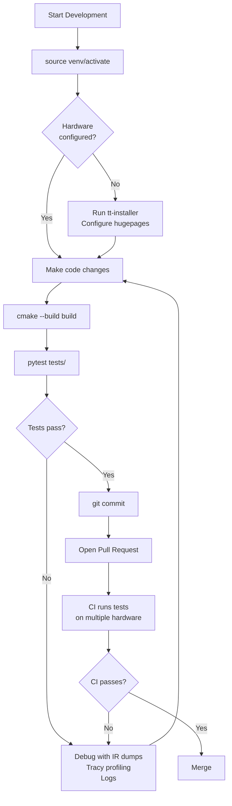
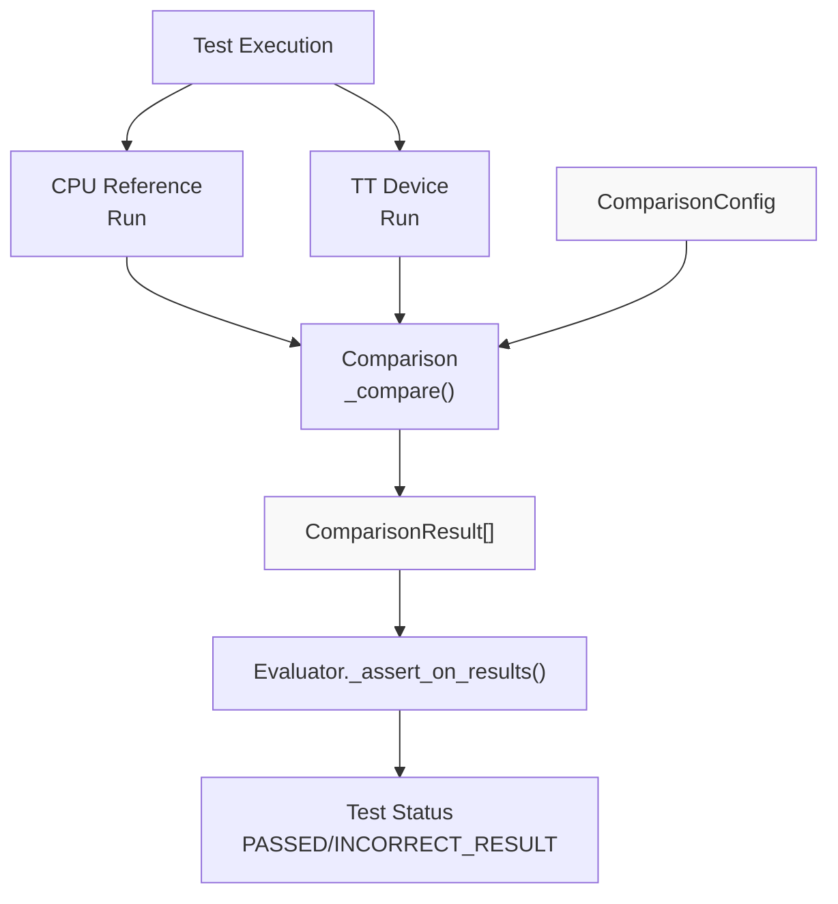
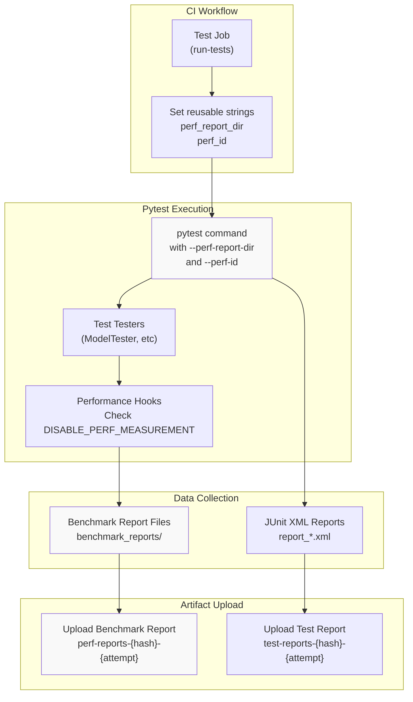
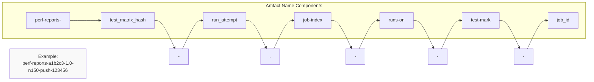
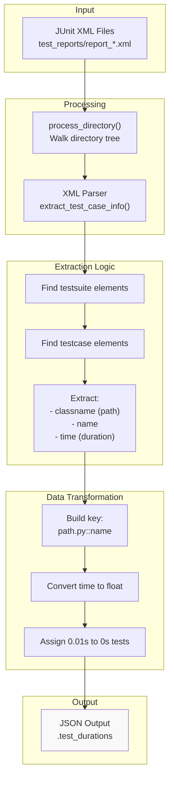
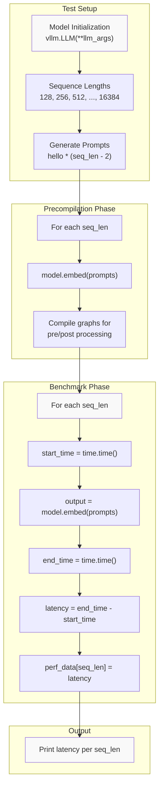
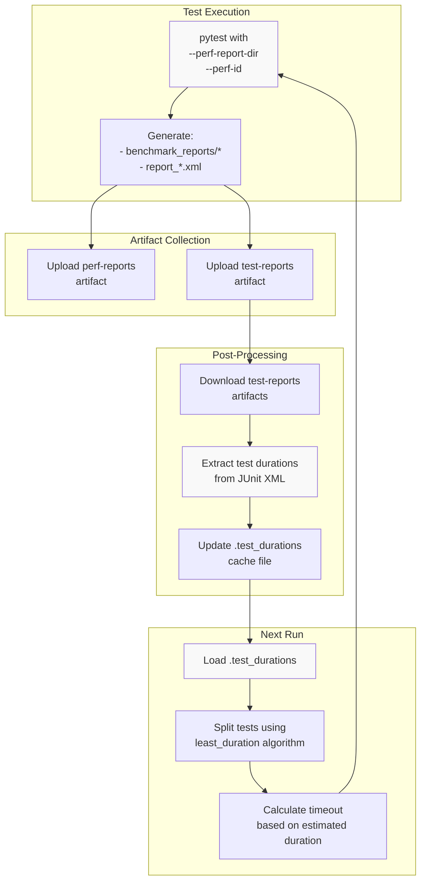

# Performance Benchmarking

Relevant source files
*   [.github/scripts/get_test_duration_from_junit_xmls.py](https://github.com/tenstorrent/tt-xla/blob/c77995f6/.github/scripts/get_test_duration_from_junit_xmls.py)
*   [.github/workflows/call-test.yml](https://github.com/tenstorrent/tt-xla/blob/c77995f6/.github/workflows/call-test.yml)
*   [.github/workflows/schedule-nightly-experimental.yml](https://github.com/tenstorrent/tt-xla/blob/c77995f6/.github/workflows/schedule-nightly-experimental.yml)
*   [.github/workflows/schedule-nightly.yml](https://github.com/tenstorrent/tt-xla/blob/c77995f6/.github/workflows/schedule-nightly.yml)
*   [.github/workflows/test-matrix-presets/basic-test-nightly.json](https://github.com/tenstorrent/tt-xla/blob/c77995f6/.github/workflows/test-matrix-presets/basic-test-nightly.json)
*   [.github/workflows/test-matrix-presets/basic-test.json](https://github.com/tenstorrent/tt-xla/blob/c77995f6/.github/workflows/test-matrix-presets/basic-test.json)
*   [.github/workflows/test-matrix-presets/model-test-full.json](https://github.com/tenstorrent/tt-xla/blob/c77995f6/.github/workflows/test-matrix-presets/model-test-full.json)
*   [.github/workflows/test-matrix-presets/vllm-model-tests.json](https://github.com/tenstorrent/tt-xla/blob/c77995f6/.github/workflows/test-matrix-presets/vllm-model-tests.json)
*   [examples/pytorch/sdxl-pipeline.py](https://github.com/tenstorrent/tt-xla/blob/c77995f6/examples/pytorch/sdxl-pipeline.py)
*   [tests/conftest.py](https://github.com/tenstorrent/tt-xla/blob/c77995f6/tests/conftest.py)
*   [tests/integrations/vllm_plugin/pooling/baseline/e5_mistral_7b_instruct_baseline.pt](https://github.com/tenstorrent/tt-xla/blob/c77995f6/tests/integrations/vllm_plugin/pooling/baseline/e5_mistral_7b_instruct_baseline.pt)
*   [tests/integrations/vllm_plugin/pooling/baseline/qwen3_embedding_8B_baseline.pt](https://github.com/tenstorrent/tt-xla/blob/c77995f6/tests/integrations/vllm_plugin/pooling/baseline/qwen3_embedding_8B_baseline.pt)
*   [tests/integrations/vllm_plugin/pooling/test_single_device.py](https://github.com/tenstorrent/tt-xla/blob/c77995f6/tests/integrations/vllm_plugin/pooling/test_single_device.py)
*   [tests/integrations/vllm_plugin/pooling/utils.py](https://github.com/tenstorrent/tt-xla/blob/c77995f6/tests/integrations/vllm_plugin/pooling/utils.py)

## Purpose and Scope

This document describes the performance benchmarking infrastructure integrated into TT-XLA's CI/CD pipeline. The system measures test execution times, collects performance metrics during test runs, and tracks historical performance data to enable regression detection and optimization analysis.

For information about general test execution and result collection, see [Result Collection and Reporting](https://deepwiki.com/tenstorrent/tt-xla/7.5-result-collection-and-reporting). For test matrix generation and parallel execution, see [Test Matrix Generation and Execution](https://deepwiki.com/tenstorrent/tt-xla/7.3-test-matrix-generation-and-execution).

## Overview

The performance benchmarking system operates at multiple levels:

1.   **Test Duration Tracking**: Records execution time for every test case through JUnit XML reports
2.   **Performance Measurement Hooks**: Optional pytest flags to enable/disable performance data collection during test execution
3.   **Benchmark Report Generation**: Collects performance metrics and stores them as structured artifacts
4.   **CI/CD Integration**: Uploads benchmark data as GitHub Actions artifacts for analysis and historical tracking







**Diagram: High-level comparison flow during test execution**

Sources: [tests/infra/testers/single_chip/model/torch_model_tester.py:170-278](), [tests/runner/test_utils.py:363-451]()
```
## Pytest Integration

### Command-Line Options

The benchmarking system provides several pytest command-line options configured in [tests/conftest.py 182-223](https://github.com/tenstorrent/tt-xla/blob/c77995f6/tests/conftest.py#L182-L223):

| Option | Description | Default | Effect |
| --- | --- | --- | --- |
| `--disable-perf-measurement` | Disables performance benchmark measurement in testers | `False` | Sets `DISABLE_PERF_MEASUREMENT=1` environment variable |
| `--perf-report-dir` | Output directory for performance benchmark reports | `None` | If not given, no benchmark files generated |
| `--perf-id` | Identifier for performance benchmark reports | `None` | Used to label benchmark data (typically job ID) |
| `--log-memory` | Enables memory usage tracking during tests | `False` | Tracks min/max/avg memory consumption |

**Sources**: [tests/conftest.py 182-230](https://github.com/tenstorrent/tt-xla/blob/c77995f6/tests/conftest.py#L182-L230)

### Performance Measurement Control

The `disable_perf_measurement` fixture automatically sets environment variables based on command-line flags:

`@pytest.fixture(autouse=True)def disable_perf_measurement(request):    if request.config.getoption("--disable-perf-measurement"):        os.environ["DISABLE_PERF_MEASUREMENT"] = "1"`
This autouse fixture runs before every test, allowing testers to check the `DISABLE_PERF_MEASUREMENT` environment variable and conditionally skip performance measurement operations.

**Sources**: [tests/conftest.py 232-238](https://github.com/tenstorrent/tt-xla/blob/c77995f6/tests/conftest.py#L232-L238)

## Benchmark Data Collection Flow

**Sources**: [.github/workflows/call-test.yml 120-381](https://github.com/tenstorrent/tt-xla/blob/c77995f6/.github/workflows/call-test.yml#L120-L381)



### CI Workflow Configuration

In the `run-tests` job, performance-related paths and identifiers are configured as reusable outputs:

[.github/workflows/call-test.yml 120-133](https://github.com/tenstorrent/tt-xla/blob/c77995f6/.github/workflows/call-test.yml#L120-L133)

The `perf_report_dir` is set to `$(pwd)/benchmark_reports` and the `perf_id` is set to the GitHub Actions job ID obtained from the `fetch-job-id` step.

### Pytest Command Construction

The pytest command includes performance flags when executing tests:

[.github/workflows/call-test.yml 337-341](https://github.com/tenstorrent/tt-xla/blob/c77995f6/.github/workflows/call-test.yml#L337-L341)

The command passes both `--perf-report-dir` and `--perf-id` to pytest, enabling benchmark data collection with proper identification.

**Sources**: [.github/workflows/call-test.yml 320-341](https://github.com/tenstorrent/tt-xla/blob/c77995f6/.github/workflows/call-test.yml#L320-L341)

## Artifact Upload and Storage

### Benchmark Report Upload

After test execution completes (whether successful or failed), benchmark reports are uploaded as GitHub Actions artifacts:

[.github/workflows/call-test.yml 374-381](https://github.com/tenstorrent/tt-xla/blob/c77995f6/.github/workflows/call-test.yml#L374-L381)

The artifact naming includes:

*   `test_matrix_hash`: Identifies the test matrix configuration
*   `github.run_attempt`: Tracks re-run attempts
*   `strategy.job-index`: Identifies parallel job instance
*   `runs-on`: Hardware target (n150, p150, n300, llmbox)
*   `test-mark`: Test marker filter applied
*   `job_id`: Unique job identifier

The `if-no-files-found: 'ignore'` setting ensures that jobs without performance tests don't fail when no benchmark files are generated.

**Sources**: [.github/workflows/call-test.yml 373-381](https://github.com/tenstorrent/tt-xla/blob/c77995f6/.github/workflows/call-test.yml#L373-L381)

### Artifact Naming Convention

**Sources**: [.github/workflows/call-test.yml 378](https://github.com/tenstorrent/tt-xla/blob/c77995f6/.github/workflows/call-test.yml#L378-L378)



## Test Duration Tracking

### Duration Extraction from JUnit XML

The CI system extracts test execution durations from JUnit XML reports to optimize test splitting and track performance over time. The script [.github/scripts/get_test_duration_from_junit_xmls.py](https://github.com/tenstorrent/tt-xla/blob/c77995f6/.github/scripts/get_test_duration_from_junit_xmls.py) processes XML reports:

**Sources**: [.github/scripts/get_test_duration_from_junit_xmls.py 1-102](https://github.com/tenstorrent/tt-xla/blob/c77995f6/.github/scripts/get_test_duration_from_junit_xmls.py#L1-L102)



### Duration Data Format

The extracted duration data is stored in JSON format with test case identifiers as keys and execution times (in seconds) as values:

[.github/scripts/get_test_duration_from_junit_xmls.py 10-42](https://github.com/tenstorrent/tt-xla/blob/c77995f6/.github/scripts/get_test_duration_from_junit_xmls.py#L10-L42)

The script constructs test case keys by replacing dots in the `classname` attribute with slashes and appending the test name: `f"{path}.py::{name}"`.

Tests with zero duration are assigned a default duration of `0.01` seconds to ensure proper distribution by pytest's `least_duration` splitting algorithm:

[.github/scripts/get_test_duration_from_junit_xmls.py 84-90](https://github.com/tenstorrent/tt-xla/blob/c77995f6/.github/scripts/get_test_duration_from_junit_xmls.py#L84-L90)

**Sources**: [.github/scripts/get_test_duration_from_junit_xmls.py 71-98](https://github.com/tenstorrent/tt-xla/blob/c77995f6/.github/scripts/get_test_duration_from_junit_xmls.py#L71-L98)

### Usage in Test Splitting

The collected duration data (stored in `.test_durations`) is referenced by the test timeout calculation script:

[.github/workflows/call-test.yml 309-315](https://github.com/tenstorrent/tt-xla/blob/c77995f6/.github/workflows/call-test.yml#L309-L315)

This enables intelligent test splitting across parallel workers by distributing tests based on their historical execution times rather than simply dividing by count.

**Sources**: [.github/workflows/call-test.yml 294-318](https://github.com/tenstorrent/tt-xla/blob/c77995f6/.github/workflows/call-test.yml#L294-L318)

## Performance Test Examples

### vLLM Pooling Performance Test

The vLLM integration includes dedicated performance tests that measure end-to-end latency for embedding models. The test [tests/integrations/vllm_plugin/pooling/test_single_device.py 216-257](https://github.com/tenstorrent/tt-xla/blob/c77995f6/tests/integrations/vllm_plugin/pooling/test_single_device.py#L216-L257) demonstrates performance benchmarking:

**Sources**: [tests/integrations/vllm_plugin/pooling/test_single_device.py 214-257](https://github.com/tenstorrent/tt-xla/blob/c77995f6/tests/integrations/vllm_plugin/pooling/test_single_device.py#L214-L257)



### Key Performance Test Characteristics

1.   **Model Backbone Precompilation**: The model is initialized once to compile the core inference graphs
2.   **Input Shape Precompilation**: All input shapes are executed once to compile preprocessing/postprocessing graphs
3.   **Clean Benchmark Measurement**: After precompilation, clean timing measurements capture only inference latency without compilation overhead
4.   **Multiple Sequence Lengths**: Tests measure performance across different input sizes (powers of 2) to understand scaling characteristics

The test configuration uses:

*   `max_model_len`: 16384 tokens (2^14)
*   `enable_prefix_caching`: False (to avoid caching effects in benchmarks)
*   `enable_const_eval`: False (to measure actual inference without constant folding)

**Sources**: [tests/integrations/vllm_plugin/pooling/test_single_device.py 216-257](https://github.com/tenstorrent/tt-xla/blob/c77995f6/tests/integrations/vllm_plugin/pooling/test_single_device.py#L216-L257)

### SDXL Pipeline Performance Tracking

The SDXL example demonstrates performance measurement in production-like pipelines:

[examples/pytorch/sdxl-pipeline.py 282-323](https://github.com/tenstorrent/tt-xla/blob/c77995f6/examples/pytorch/sdxl-pipeline.py#L282-L323)

The pipeline measures:

*   **UNet inference time**: Denoising loop across all timesteps
*   **VAE decode time**: Latent-to-image decoding

Time measurements use simple `time.time()` calls around the critical sections, printing results for manual analysis.

**Sources**: [examples/pytorch/sdxl-pipeline.py 282-339](https://github.com/tenstorrent/tt-xla/blob/c77995f6/examples/pytorch/sdxl-pipeline.py#L282-L339)

## Test Matrix and Hardware Targeting

Performance benchmarks run across different hardware configurations defined in test matrix presets:

### Hardware Targets

| Hardware | Usage | Shared Runners | Example Tests |
| --- | --- | --- | --- |
| `n150` | Single-chip Wormhole | Yes/No | Large models, vLLM single device |
| `p150` | Single-chip Poseidon | No | JAX/Torch tests |
| `n300` | Dual-chip Wormhole | No | Multi-chip tests, vLLM TP/DP |
| `n300-llmbox` | 4/8-chip Wormhole | Yes | vLLM tensor parallel LLM tests |

**Sources**: [.github/workflows/test-matrix-presets/basic-test-nightly.json 1-17](https://github.com/tenstorrent/tt-xla/blob/c77995f6/.github/workflows/test-matrix-presets/basic-test-nightly.json#L1-L17)[.github/workflows/test-matrix-presets/basic-test.json 1-17](https://github.com/tenstorrent/tt-xla/blob/c77995f6/.github/workflows/test-matrix-presets/basic-test.json#L1-L17)

### Nightly Performance Test Suite

The nightly test schedule includes performance-sensitive configurations:

[.github/workflows/schedule-nightly.yml 27-37](https://github.com/tenstorrent/tt-xla/blob/c77995f6/.github/workflows/schedule-nightly.yml#L27-L37)

Nightly tests provide:

*   **Extended coverage**: Runs more comprehensive test suites with `nightly` marker
*   **Large model tests**: Includes `large` marker tests that may have significant performance impact
*   **Multi-configuration**: Tests across all hardware targets to detect platform-specific regressions

**Sources**: [.github/workflows/schedule-nightly.yml 1-149](https://github.com/tenstorrent/tt-xla/blob/c77995f6/.github/workflows/schedule-nightly.yml#L1-L149)[.github/workflows/test-matrix-presets/basic-test-nightly.json 1-17](https://github.com/tenstorrent/tt-xla/blob/c77995f6/.github/workflows/test-matrix-presets/basic-test-nightly.json#L1-L17)

## Memory Usage Tracking

In addition to execution time, the system can track memory consumption through the `--log-memory` pytest option:

[tests/conftest.py 356-422](https://github.com/tenstorrent/tt-xla/blob/c77995f6/tests/conftest.py#L356-L422)

The memory tracker:

1.   Samples memory usage every 0.1 seconds in a background thread
2.   Records minimum, maximum, and average memory consumption
3.   Tracks RSS (Resident Set Size) of the test process
4.   Logs memory usage before and after garbage collection

Memory tracking provides insights into:

*   Memory growth during test execution
*   Peak memory requirements
*   Memory leak detection through post-GC measurements

**Sources**: [tests/conftest.py 356-422](https://github.com/tenstorrent/tt-xla/blob/c77995f6/tests/conftest.py#L356-L422)

## Performance Data Workflow Summary




**Sources**: [.github/workflows/call-test.yml 120-381](https://github.com/tenstorrent/tt-xla/blob/c77995f6/.github/workflows/call-test.yml#L120-L381)[.github/scripts/get_test_duration_from_junit_xmls.py 1-102](https://github.com/tenstorrent/tt-xla/blob/c77995f6/.github/scripts/get_test_duration_from_junit_xmls.py#L1-L102)

This wiki is featured in the [repository](https://github.com/tenstorrent/tt-xla/blob/main/README.md)

Dismiss
Refresh this wiki

Enter email to refresh
