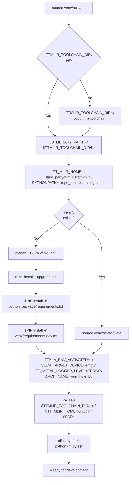
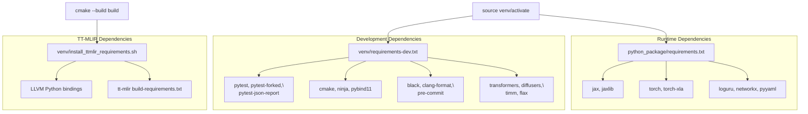
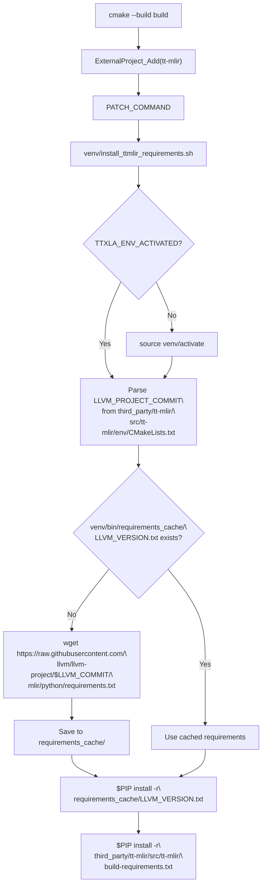
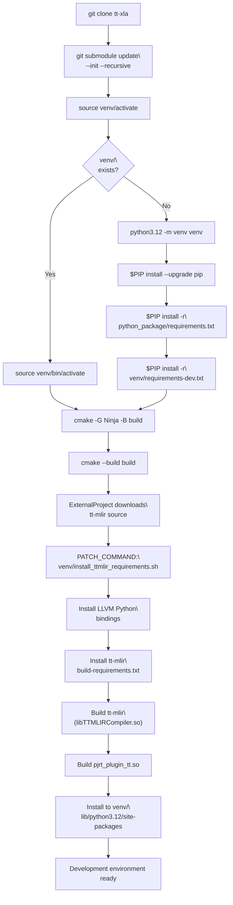

# Development Environment Setup

Relevant source files
*   [.github/workflows/test-matrix-presets/model-test-experimental.json](https://github.com/tenstorrent/tt-xla/blob/c77995f6/.github/workflows/test-matrix-presets/model-test-experimental.json)
*   [.gitignore](https://github.com/tenstorrent/tt-xla/blob/c77995f6/.gitignore)
*   [.pre-commit-config.yaml](https://github.com/tenstorrent/tt-xla/blob/c77995f6/.pre-commit-config.yaml)
*   [README.md](https://github.com/tenstorrent/tt-xla/blob/c77995f6/README.md?plain=1)
*   [docs/src/getting_started.md](https://github.com/tenstorrent/tt-xla/blob/c77995f6/docs/src/getting_started.md?plain=1)
*   [docs/src/getting_started_build_from_source.md](https://github.com/tenstorrent/tt-xla/blob/c77995f6/docs/src/getting_started_build_from_source.md?plain=1)
*   [docs/src/getting_started_docker.md](https://github.com/tenstorrent/tt-xla/blob/c77995f6/docs/src/getting_started_docker.md?plain=1)
*   [docs/src/imgs/test_infra.png](https://github.com/tenstorrent/tt-xla/blob/c77995f6/docs/src/imgs/test_infra.png)
*   [docs/src/imgs/tt_smi.png](https://github.com/tenstorrent/tt-xla/blob/c77995f6/docs/src/imgs/tt_smi.png)
*   [docs/src/imgs/tt_xla_logo.png](https://github.com/tenstorrent/tt-xla/blob/c77995f6/docs/src/imgs/tt_xla_logo.png)
*   [docs/src/test_infra.md](https://github.com/tenstorrent/tt-xla/blob/c77995f6/docs/src/test_infra.md?plain=1)
*   [tests/filecheck/add.ttnn.mlir](https://github.com/tenstorrent/tt-xla/blob/c77995f6/tests/filecheck/add.ttnn.mlir)
*   [tests/filecheck/rms_norm.ttir.mlir](https://github.com/tenstorrent/tt-xla/blob/c77995f6/tests/filecheck/rms_norm.ttir.mlir)
*   [tests/runner/test_config/__init__.py](https://github.com/tenstorrent/tt-xla/blob/c77995f6/tests/runner/test_config/__init__.py)

## Purpose and Scope

This page documents the development environment setup for contributors working on TT-XLA. It covers the `venv/activate` script, environment variables, pre-commit hooks, and development dependencies. For end-user installation, see [Installation Options](https://deepwiki.com/tenstorrent/tt-xla/2.1-installation-options). For build system details, see [Build System](https://deepwiki.com/tenstorrent/tt-xla/3-build-system).

## System Requirements

### Operating System and Core Tools

TT-XLA development requires Ubuntu 22.04 with specific toolchain versions:

| Component | Version | Installation Command |
| --- | --- | --- |
| Ubuntu | 22.04 | N/A |
| Python | 3.12 | `sudo apt install python3.12 python3.12-venv` |
| Clang | 17 | See Clang installation below |
| GCC | 12 | `sudo apt install g++-12` (installs gcc-12, libstdc++-12-dev) |
| Ninja | latest | `sudo apt install ninja-build` |
| CMake | 4.0.3+ | `pip install cmake==4.0.3` |

Sources: [docs/src/getting_started_build_from_source.md 22-31](https://github.com/tenstorrent/tt-xla/blob/c77995f6/docs/src/getting_started_build_from_source.md?plain=1#L22-L31)[docs/src/getting_started_build_from_source.md 32-94](https://github.com/tenstorrent/tt-xla/blob/c77995f6/docs/src/getting_started_build_from_source.md?plain=1#L32-L94)

### Clang 17 Installation

Clang 17 is required for building TT-XLA and TT-MLIR:

Verify GCC 12 is selected as the standard library:

Sources: [docs/src/getting_started_build_from_source.md 62-86](https://github.com/tenstorrent/tt-xla/blob/c77995f6/docs/src/getting_started_build_from_source.md?plain=1#L62-L86)

### Additional Libraries

Required system libraries for TT-XLA and TT-Metal:

Sources: [docs/src/getting_started_build_from_source.md 102-112](https://github.com/tenstorrent/tt-xla/blob/c77995f6/docs/src/getting_started_build_from_source.md?plain=1#L102-L112)

### OpenMPI for Multi-Device Support

For distributed execution across multiple Tenstorrent devices:

Sources: [docs/src/getting_started_build_from_source.md 95-100](https://github.com/tenstorrent/tt-xla/blob/c77995f6/docs/src/getting_started_build_from_source.md?plain=1#L95-L100)

## Hardware Prerequisites

Before setting up the development environment:

1.   **Hardware configured**: See [Hardware Configuration](https://deepwiki.com/tenstorrent/tt-xla/2.2-hardware-configuration) for TT-Installer setup and hugepages
2.   **Repository cloned**: `git clone https://github.com/tenstorrent/tt-xla.git && cd tt-xla`
3.   **Submodules initialized**: `git submodule update --init --recursive`

Sources: [README.md 1-62](https://github.com/tenstorrent/tt-xla/blob/c77995f6/README.md?plain=1#L1-L62)[docs/src/getting_started.md 1-99](https://github.com/tenstorrent/tt-xla/blob/c77995f6/docs/src/getting_started.md?plain=1#L1-L99)

## Virtual Environment Activation Script

The `venv/activate` script is the primary entry point for development. It configures the complete environment including toolchains, Python paths, and build tools.

### Activation Script Workflow

Sources: [docs/src/getting_started_build_from_source.md 123-149](https://github.com/tenstorrent/tt-xla/blob/c77995f6/docs/src/getting_started_build_from_source.md?plain=1#L123-L149)




Sources: [docs/src/getting_started_build_from_source.md:123-149]()
```
### Environment Variables Set by Activation

The activation script configures environment variables that connect the development environment to build artifacts and runtime components:

| Variable | Default Value | Purpose | Used By |
| --- | --- | --- | --- |
| `TTMLIR_TOOLCHAIN_DIR` | `/opt/ttmlir-toolchain` | LLVM 17 toolchain root | CMake, linker |
| `TT_MLIR_HOME` | `third_party/tt-mlir/src/tt-mlir/` | TT-MLIR source tree | Python imports, CMake |
| `PYTHONPATH` | Repo root, tests/, integrations/, TT-MLIR packages | Python module resolution | Python interpreter |
| `UV_INDEX_STRATEGY` | `unsafe-best-match` | Multi-index package resolution | uv package manager |
| `TTMLIR_VENV_DIR` | `$(pwd)/venv` | Virtual environment root | Build scripts |
| `VLLM_TARGET_DEVICE` | `empty` | vLLM device selection | vllm_plugin |
| `TTXLA_ENV_ACTIVATED` | `1` | Activation marker | Build scripts, tests |
| `TTMLIR_ENV_ACTIVATED` | `1` | Legacy activation marker | TT-MLIR scripts |
| `TT_METAL_LOGGER_LEVEL` | `ERROR` | Runtime logging | TT-Metal runtime |
| `ARCH_NAME` | `wormhole_b0` | Target architecture | Device detection |
| `PATH` | Prepends `$TTMLIR_TOOLCHAIN_DIR/bin` and `$TT_MLIR_HOME/build/bin` | Executable search | Shell, build tools |

Sources: [docs/src/getting_started_build_from_source.md 123-149](https://github.com/tenstorrent/tt-xla/blob/c77995f6/docs/src/getting_started_build_from_source.md?plain=1#L123-L149)

### Package Manager Selection

The activation script detects and uses `uv` (a faster Rust-based package manager) when available, falling back to `pip`:

Benefits of using `uv`:

*   **10-100x faster** package installation compared to pip
*   **Better dependency resolution** across multiple package indexes
*   **Drop-in replacement** - same command syntax as pip

The `UV_INDEX_STRATEGY=unsafe-best-match` environment variable enables resolution of packages like PyTorch from both PyPI and PyTorch's CPU index simultaneously.

Sources: [docs/src/getting_started_build_from_source.md 145-149](https://github.com/tenstorrent/tt-xla/blob/c77995f6/docs/src/getting_started_build_from_source.md?plain=1#L145-L149)

### Shell Aliases

The activation script sets up convenience aliases:

This ensures pytest uses the virtual environment's Python interpreter and has access to all installed test dependencies, preventing issues with system-wide pytest installations.

Sources: [docs/src/getting_started_build_from_source.md 145-149](https://github.com/tenstorrent/tt-xla/blob/c77995f6/docs/src/getting_started_build_from_source.md?plain=1#L145-L149)

## Development Dependencies

### Dependency File Structure

TT-XLA organizes dependencies across multiple files:

Sources: [.gitignore 20-30](https://github.com/tenstorrent/tt-xla/blob/c77995f6/.gitignore#L20-L30)




Sources: [.gitignore:20-30]()
```
### Runtime Dependencies (python_package/requirements.txt)

Core dependencies included in the distributed wheel:

| Package | Version | Purpose |
| --- | --- | --- |
| `jax` | 0.7.1 | JAX framework support |
| `jaxlib` | 0.7.1 | JAX XLA backend |
| `torch` | 2.9.0+cpu | PyTorch framework support |
| `torch-xla` | 2.9.0+git061c1e7 | PyTorch/XLA integration |
| `loguru` | 0.7.3 | Structured logging (also used by C++ via loguru submodule) |
| `requests` | latest | HTTP client for model downloads |
| `networkx` | 3.6.1 | Graph operations for TTNN IR |
| `graphviz` | 0.21 | TTNN graph visualization |
| `seaborn` | 0.13.2 | Statistical plotting for TTNN |
| `pyyaml` | 6.0.1 | Test configuration parsing |
| `click` | 8.3.1 | CLI framework |
| `pandas` | 3.0.0 | Data analysis for TTNN metrics |

Sources: [README.md 1-62](https://github.com/tenstorrent/tt-xla/blob/c77995f6/README.md?plain=1#L1-L62)

### Development Dependencies (venv/requirements-dev.txt)

Development-only dependencies for testing, building, and running models:

#### Code Quality Tools

| Package | Purpose | Config File |
| --- | --- | --- |
| `black` | Python code formatter | `.pre-commit-config.yaml` |
| `clang-format` | C++ code formatter | `.pre-commit-config.yaml` |
| `pre-commit` | Git hook framework | `.pre-commit-config.yaml` |

#### Build Tools

| Package | Version | Purpose |
| --- | --- | --- |
| `cmake` | 4.2.1 | Meta-build system |
| `ninja` | latest | Fast parallel build backend |
| `pybind11` | latest | C++/Python bindings generator |
| `setuptools` | latest | Python package builder |
| `wheel` | latest | Binary distribution format |

#### Testing Infrastructure

| Package | Purpose |
| --- | --- |
| `pytest` | Test framework (alias: `python -m pytest`) |
| `pytest-forked` | Isolate test execution in subprocesses |
| `pytest-json-report` | Generate JSON test reports for CI |
| `pytest-split` | Split tests across parallel workers |

#### ML Framework Dependencies

| Package | Version | Purpose |
| --- | --- | --- |
| `transformers` | 4.57.1 | HuggingFace models (tests/runner/test_models.py) |
| `datasets` | 4.5.0 | HuggingFace datasets |
| `diffusers` | latest | Stable Diffusion and other diffusion models |
| `timm` | latest | PyTorch image models |
| `torchvision` | 0.24.0+cpu | Vision utilities |
| `flax` | 0.10.4 | JAX neural network library |
| `einops` | latest | Tensor dimension rearrangement |
| `sentencepiece` | latest | Tokenization for LLMs |
| `librosa` | 0.11.0 | Audio feature extraction |
| `soundfile` | latest | Audio file I/O |
| `pillow` | latest | Image processing |
| `matplotlib` | latest | Visualization |

#### Specialized Model Dependencies

For specific model architectures tested in `tests/runner/`:

| Package | Model Family |
| --- | --- |
| `pytorchcv` | Computer vision models |
| `vgg_pytorch` | VGG architectures |
| `torchxrayvision` | Medical imaging |
| `yolov5`, `yolov6detect` | Object detection |
| `surya-ocr` | Optical character recognition |
| `FlagEmbedding` | BGE-M3 embedding model |
| `qwen-vl-utils` | Qwen2.5 VL multimodal models |
| `torchcodec` | Video decoding for Whisper/Wav2Vec2 |
| `open_clip_torch` | CLIP metric computation |

Sources: [.github/workflows/test-matrix-presets/model-test-experimental.json 1-9](https://github.com/tenstorrent/tt-xla/blob/c77995f6/.github/workflows/test-matrix-presets/model-test-experimental.json#L1-L9)

### TT-MLIR Dependency Installation

The `venv/install_ttmlir_requirements.sh` script is invoked during CMake configuration to install TT-MLIR's Python dependencies:

The script performs version-aware caching to avoid re-downloading LLVM requirements on every build. Requirements are cached in `venv/bin/requirements_cache/` and keyed by LLVM commit hash.

Sources: [docs/src/getting_started_build_from_source.md 117-121](https://github.com/tenstorrent/tt-xla/blob/c77995f6/docs/src/getting_started_build_from_source.md?plain=1#L117-L121)




The script performs version-aware caching to avoid re-downloading LLVM requirements on every build. Requirements are cached in `venv/bin/requirements_cache/` and keyed by LLVM commit hash.

Sources: [docs/src/getting_started_build_from_source.md:117-121]()
```
### Complete Installation Flow

Sources: [docs/src/getting_started_build_from_source.md 114-172](https://github.com/tenstorrent/tt-xla/blob/c77995f6/docs/src/getting_started_build_from_source.md?plain=1#L114-L172)




Sources: [docs/src/getting_started_build_from_source.md:114-172]()
```
## Pre-commit Hooks

TT-XLA uses pre-commit hooks to enforce code quality standards before commits. The hooks run automatically after installation.

### Installation

This creates a `.git/hooks/pre-commit` script that runs on every `git commit`.

### Hook Configuration

The `.pre-commit-config.yaml` file defines the following hooks:

| Hook | Repository | Purpose | Files Affected |
| --- | --- | --- | --- |
| `black` | psf/black (v25.9.0) | Format Python code | `*.py` |
| `clang-format` | mirrors/clang-format (v21.1.1) | Format C++ code | `*.cpp`, `*.h`, `*.cc` |
| `check-copyright` | espressif/check-copyright (v1.1.1) | Verify SPDX headers | All source files |
| `trailing-whitespace` | pre-commit-hooks (v6.0.0) | Remove trailing whitespace | All files |
| `end-of-file-fixer` | pre-commit-hooks (v6.0.0) | Ensure newline at EOF | All files |
| `check-added-large-files` | pre-commit-hooks (v6.0.0) | Prevent committing large files | All files |
| `check-yaml` | pre-commit-hooks (v6.0.0) | Validate YAML syntax | `*.yaml`, `*.yml` |
| `isort` | pycqa/isort (v5.13.2) | Sort Python imports | `*.py` |

Sources: [.pre-commit-config.yaml 1-30](https://github.com/tenstorrent/tt-xla/blob/c77995f6/.pre-commit-config.yaml#L1-L30)

### Running Hooks Manually

Run hooks on all files without committing:

Run a specific hook:

### Copyright Header Format

The `check-copyright` hook validates SPDX headers. All source files should begin with:

Configuration: `.github/check-spdx.yaml`

Sources: [.pre-commit-config.yaml 13-17](https://github.com/tenstorrent/tt-xla/blob/c77995f6/.pre-commit-config.yaml#L13-L17)[tests/runner/test_config/__init__.py 1-4](https://github.com/tenstorrent/tt-xla/blob/c77995f6/tests/runner/test_config/__init__.py#L1-L4)

### Bypassing Hooks

To commit without running hooks (not recommended):

## Troubleshooting

### Common Issues

**Issue: Build fails with "tt-xla environment not activated"**

Solution:

**Issue: CMake can't find Clang 17**

Solution:

**Issue: Wrong GCC version selected by Clang**

Solution:

Sources: [docs/src/getting_started_build_from_source.md 192-194](https://github.com/tenstorrent/tt-xla/blob/c77995f6/docs/src/getting_started_build_from_source.md?plain=1#L192-L194)

**Issue: tt-mlir build fails with Python import errors**

Solution:

**Issue: Missing tt-smi or device not detected**

Solution:

Sources: [docs/src/getting_started.md 42-47](https://github.com/tenstorrent/tt-xla/blob/c77995f6/docs/src/getting_started.md?plain=1#L42-L47)

**Issue: Linker errors about undefined references**

Solution:

**Issue: Pre-commit hooks fail on commit**

Solution:

Sources: [.pre-commit-config.yaml 1-30](https://github.com/tenstorrent/tt-xla/blob/c77995f6/.pre-commit-config.yaml#L1-L30)

### Enabling Debug Logging

Control logging verbosity with environment variables:

The `TTXLA_LOGGER_LEVEL` variable is checked in Python code and C++ (via loguru integration).

Sources: [docs/src/getting_started_build_from_source.md 123](https://github.com/tenstorrent/tt-xla/blob/c77995f6/docs/src/getting_started_build_from_source.md?plain=1#L123-L123)

### CMake Build Configuration

Build types affect optimization and debug symbols:

View configured CMake variables:

### IDE Integration

The build generates `compile_commands.json` for clangd/clang-tidy integration:

The `.gitignore` file excludes `.cache/` and `compile_commands.json` from version control.

Sources: [.gitignore 13-15](https://github.com/tenstorrent/tt-xla/blob/c77995f6/.gitignore#L13-L15)

## Next Steps

After setting up your development environment:

*   **Understand the architecture**: See [Core Architecture](https://deepwiki.com/tenstorrent/tt-xla/4-system-architecture) for system design
*   **Debug compilation issues**: See [Compilation and Debugging](https://deepwiki.com/tenstorrent/tt-xla/8.2-building-from-source)
*   **Analyze performance**: See [Performance Analysis and Debugging Tools](https://deepwiki.com/tenstorrent/tt-xla/8.3-running-and-debugging-tests)
*   **Contribute code**: See [Contributing Guidelines](https://deepwiki.com/tenstorrent/tt-xla/9-contributing-guidelines)

Sources: [README.md 1-62](https://github.com/tenstorrent/tt-xla/blob/c77995f6/README.md?plain=1#L1-L62)

Dismiss
Refresh this wiki

Enter email to refresh
