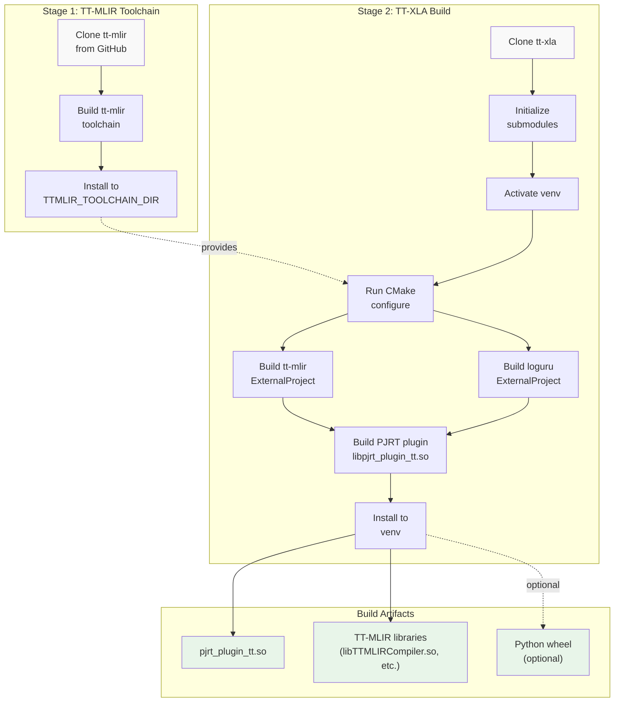
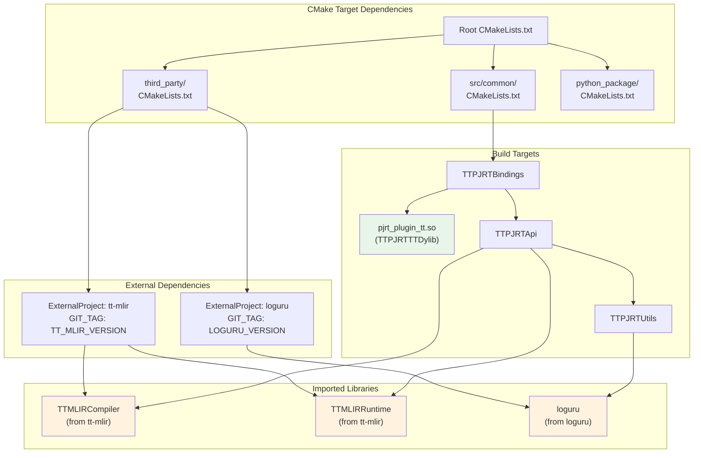
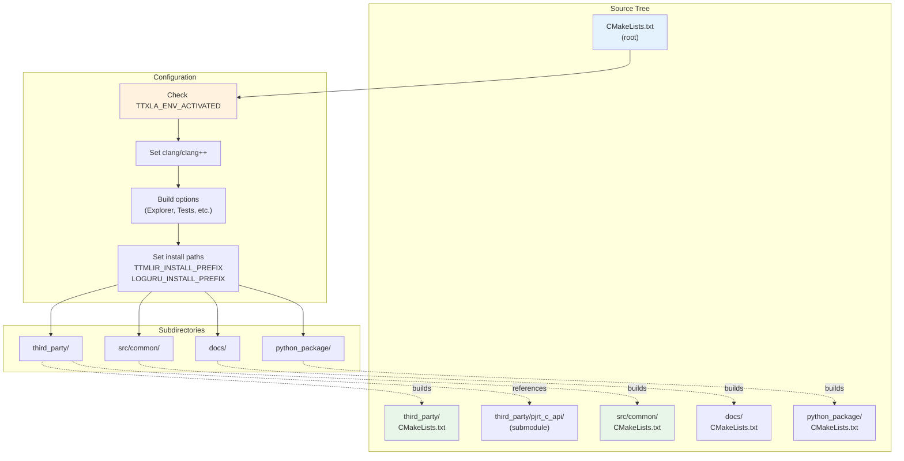

# Building from Source

Relevant source files
*   [.gitignore](https://github.com/tenstorrent/tt-xla/blob/c77995f6/.gitignore)
*   [CMakeLists.txt](https://github.com/tenstorrent/tt-xla/blob/c77995f6/CMakeLists.txt)
*   [README.md](https://github.com/tenstorrent/tt-xla/blob/c77995f6/README.md?plain=1)
*   [docs/src/getting_started.md](https://github.com/tenstorrent/tt-xla/blob/c77995f6/docs/src/getting_started.md?plain=1)
*   [docs/src/getting_started_build_from_source.md](https://github.com/tenstorrent/tt-xla/blob/c77995f6/docs/src/getting_started_build_from_source.md?plain=1)
*   [docs/src/getting_started_docker.md](https://github.com/tenstorrent/tt-xla/blob/c77995f6/docs/src/getting_started_docker.md?plain=1)
*   [docs/src/imgs/test_infra.png](https://github.com/tenstorrent/tt-xla/blob/c77995f6/docs/src/imgs/test_infra.png)
*   [docs/src/imgs/tt_smi.png](https://github.com/tenstorrent/tt-xla/blob/c77995f6/docs/src/imgs/tt_smi.png)
*   [docs/src/imgs/tt_xla_logo.png](https://github.com/tenstorrent/tt-xla/blob/c77995f6/docs/src/imgs/tt_xla_logo.png)
*   [docs/src/test_infra.md](https://github.com/tenstorrent/tt-xla/blob/c77995f6/docs/src/test_infra.md?plain=1)
*   [tests/filecheck/add.ttnn.mlir](https://github.com/tenstorrent/tt-xla/blob/c77995f6/tests/filecheck/add.ttnn.mlir)
*   [tests/filecheck/rms_norm.ttir.mlir](https://github.com/tenstorrent/tt-xla/blob/c77995f6/tests/filecheck/rms_norm.ttir.mlir)
*   [third_party/CMakeLists.txt](https://github.com/tenstorrent/tt-xla/blob/c77995f6/third_party/CMakeLists.txt)

This page provides step-by-step instructions for building TT-XLA from source. Building from source is required for developers who want to modify TT-XLA or contribute to the project. If you only need to run models, see [Installation Options](https://deepwiki.com/tenstorrent/tt-xla/2.1-installation-options) for simpler setup methods.

For information about setting up your development environment (system dependencies, toolchain installation), see [Development Environment Setup](https://deepwiki.com/tenstorrent/tt-xla/8.1-development-environment-setup). For architectural details about the build system itself, see [Build System](https://deepwiki.com/tenstorrent/tt-xla/3-build-system).

* * *

## Prerequisites

Before building from source, ensure the following are installed and configured:

| Component | Version | Purpose |
| --- | --- | --- |
| Ubuntu | 22.04 | Base OS |
| Python | 3.12 | Runtime environment |
| Clang | 17 | C/C++ compiler |
| GCC | 12 | Standard library dependency |
| CMake | ≥4.0.3 | Build system generator |
| Ninja | Latest | Build backend |
| ccache | Latest | Compilation caching |

Additionally, the following libraries must be present:

*   `protobuf-compiler` and `libprotobuf-dev`
*   `libnuma-dev`
*   `libhwloc-dev`
*   `libboost-all-dev`
*   OpenMPI (ULFM variant)

Hardware must be configured with TT-Installer, hugepages enabled, and devices visible via `tt-smi`. See [Hardware Configuration](https://deepwiki.com/tenstorrent/tt-xla/2.2-hardware-configuration) for details.

**Sources:**[docs/src/getting_started_build_from_source.md 21-112](https://github.com/tenstorrent/tt-xla/blob/c77995f6/docs/src/getting_started_build_from_source.md?plain=1#L21-L112)

* * *

## Build Process Overview

The TT-XLA build process follows a two-stage approach: first building the TT-MLIR toolchain as an external dependency, then building the TT-XLA PJRT plugin itself.

**Sources:**[docs/src/getting_started_build_from_source.md 114-172](https://github.com/tenstorrent/tt-xla/blob/c77995f6/docs/src/getting_started_build_from_source.md?plain=1#L114-L172)[CMakeLists.txt 1-111](https://github.com/tenstorrent/tt-xla/blob/c77995f6/CMakeLists.txt#L1-L111)

* * *



## Step 1: Build the TT-MLIR Toolchain

TT-XLA requires a pre-built TT-MLIR toolchain that provides the compiler infrastructure. This must be built separately before building TT-XLA.

### Clone and Build TT-MLIR

`# Clone the tt-mlir repositorygit clone https://github.com/tenstorrent/tt-mlir.gitcd tt-mlir # Follow the tt-mlir build instructions to create the toolchain# This will create a toolchain directory (e.g., /opt/ttmlir-toolchain/)`
### Set Environment Variable

After building the toolchain, set the `TTMLIR_TOOLCHAIN_DIR` environment variable:

`export TTMLIR_TOOLCHAIN_DIR=/path/to/ttmlir-toolchain`
This variable must be set before building TT-XLA. The CMake configuration will link against libraries in `${TTMLIR_TOOLCHAIN_DIR}/lib`.

**Sources:**[docs/src/getting_started_build_from_source.md 117-123](https://github.com/tenstorrent/tt-xla/blob/c77995f6/docs/src/getting_started_build_from_source.md?plain=1#L117-L123)[CMakeLists.txt 37-90](https://github.com/tenstorrent/tt-xla/blob/c77995f6/CMakeLists.txt#L37-L90)

* * *

## Step 2: Clone and Initialize TT-XLA

`# Clone the repositorygit clone https://github.com/tenstorrent/tt-xla.gitcd tt-xla # Initialize third-party submodulesgit submodule update --init --recursive`
The submodules include the PJRT C API headers located at `third_party/pjrt_c_api/`.

**Sources:**[docs/src/getting_started_build_from_source.md 128-143](https://github.com/tenstorrent/tt-xla/blob/c77995f6/docs/src/getting_started_build_from_source.md?plain=1#L128-L143)[.gitignore 1-46](https://github.com/tenstorrent/tt-xla/blob/c77995f6/.gitignore#L1-L46)

* * *

## Step 3: Activate the Virtual Environment

TT-XLA provides a custom virtual environment setup that ensures proper Python dependencies:

`source venv/activate`
This activation script:

*   Sets `TTXLA_ENV_ACTIVATED` environment variable (required by CMake)
*   Installs required Python packages
*   Configures the environment for editable installation

The CMake configuration at [CMakeLists.txt 29-31](https://github.com/tenstorrent/tt-xla/blob/c77995f6/CMakeLists.txt#L29-L31) checks for `TTXLA_ENV_ACTIVATED` and fails if not present.

**Sources:**[CMakeLists.txt 29-31](https://github.com/tenstorrent/tt-xla/blob/c77995f6/CMakeLists.txt#L29-L31)[docs/src/getting_started_build_from_source.md 145-151](https://github.com/tenstorrent/tt-xla/blob/c77995f6/docs/src/getting_started_build_from_source.md?plain=1#L145-L151)

* * *

## Step 4: CMake Configuration

The CMake configuration supports several build options:

| Option | Default | Description |
| --- | --- | --- |
| `CMAKE_BUILD_TYPE` | Release | Build type: Debug, Release, RelWithDebInfo, MinSizeRel |
| `TTMLIR_BUILD_TYPE` | Release | TT-MLIR build type (separate from main build) |
| `TTXLA_ENABLE_EXPLORER` | OFF | Enable Explorer visualization tool |
| `TTXLA_ENABLE_PJRT_TESTS` | OFF | Enable PJRT unit tests (auto ON for Debug builds) |
| `TTXLA_ENABLE_TOOLS` | ON | Build additional tools |
| `TTMLIR_ENABLE_PERF_TRACE` | ON | Enable Tracy performance tracing |
| `TTMLIR_ENABLE_BINDINGS_PYTHON` | OFF | Enable Python bindings in TT-MLIR |

### Configure for Release Build

`cmake -G Ninja -B build`
### Configure for Debug Build

`cmake -G Ninja -B build -DCMAKE_BUILD_TYPE=Debug`
The configuration process:

1.   Validates environment variables
2.   Sets compiler to `clang`/`clang++`
3.   Configures third-party dependencies
4.   Sets up installation paths

**Sources:**[CMakeLists.txt 46-78](https://github.com/tenstorrent/tt-xla/blob/c77995f6/CMakeLists.txt#L46-L78)[docs/src/getting_started_build_from_source.md 145-151](https://github.com/tenstorrent/tt-xla/blob/c77995f6/docs/src/getting_started_build_from_source.md?plain=1#L145-L151)

* * *

## Step 5: Build Process

Execute the build:

`cmake --build build`
### Build Flow Diagram

**Sources:**[CMakeLists.txt 1-111](https://github.com/tenstorrent/tt-xla/blob/c77995f6/CMakeLists.txt#L1-L111)[third_party/CMakeLists.txt 1-133](https://github.com/tenstorrent/tt-xla/blob/c77995f6/third_party/CMakeLists.txt#L1-L133)

* * *



## Step 6: Understanding the Build Stages

### Stage 1: External Project Downloads

CMake downloads and builds external dependencies using `ExternalProject_Add`:

#### TT-MLIR Build Configuration

The tt-mlir external project is configured at [third_party/CMakeLists.txt 47-84](https://github.com/tenstorrent/tt-xla/blob/c77995f6/third_party/CMakeLists.txt#L47-L84):

```
ExternalProject_Add(
    tt-mlir
    GIT_REPOSITORY https://github.com/tenstorrent/tt-mlir.git
    GIT_TAG ${TT_MLIR_VERSION}  # Pinned to specific SHA
    CMAKE_GENERATOR Ninja
    CMAKE_ARGS
      -DCMAKE_BUILD_TYPE=${TTMLIR_BUILD_TYPE}
      -DCMAKE_C_COMPILER=clang
      -DCMAKE_CXX_COMPILER=clang++
      -DTT_RUNTIME_ENABLE_TTNN=ON
      -DTTMLIR_ENABLE_STABLEHLO=ON
      -DTTMLIR_ENABLE_RUNTIME=ON
      ...
)
```

Key points:

*   **Version pinning**: TT-MLIR is pinned to a specific git SHA at [third_party/CMakeLists.txt 8](https://github.com/tenstorrent/tt-xla/blob/c77995f6/third_party/CMakeLists.txt#L8-L8)
*   **Separate build type**: Uses `TTMLIR_BUILD_TYPE` which can differ from main build
*   **Metal runtime**: Sets `TT_METAL_RUNTIME_ROOT` if not already defined
*   **Component installation**: Installs only `SharedLib` and `DistributedRuntime` components

#### Loguru Build

Loguru (logging library) is built similarly at [third_party/CMakeLists.txt 116-130](https://github.com/tenstorrent/tt-xla/blob/c77995f6/third_party/CMakeLists.txt#L116-L130) with a pinned version.

**Sources:**[third_party/CMakeLists.txt 5-133](https://github.com/tenstorrent/tt-xla/blob/c77995f6/third_party/CMakeLists.txt#L5-L133)

### Stage 2: PJRT Plugin Compilation

After external dependencies are built, the PJRT plugin is compiled by linking against the imported libraries. The plugin structure is defined in the root CMakeLists.txt comment at [CMakeLists.txt 10-23](https://github.com/tenstorrent/tt-xla/blob/c77995f6/CMakeLists.txt#L10-L23):

```
pjrt_plugin_tt.so (TTPJRTTTDylib)
├── TTPJRTBindings
│   └── TTPJRTApi
│       ├── TTMLIRCompiler (tt-mlir dynamic lib)
│       ├── TTMLIRRuntime (tt-mlir dynamic lib)
│       └── TTPJRTUtils
│           └── loguru
└── coverage_config
```

**Sources:**[CMakeLists.txt 10-23](https://github.com/tenstorrent/tt-xla/blob/c77995f6/CMakeLists.txt#L10-L23)

* * *

## Step 7: Verification

After the build completes, verify the installation:

`python -c "import jax; print(jax.devices('tt'))"`
Expected output:

```
[TTDevice(id=0, arch=Wormhole_b0)]
```

This confirms:

1.   The PJRT plugin is properly installed in the venv
2.   JAX can discover and load the plugin
3.   TT devices are visible

**Sources:**[docs/src/getting_started_build_from_source.md 153-159](https://github.com/tenstorrent/tt-xla/blob/c77995f6/docs/src/getting_started_build_from_source.md?plain=1#L153-L159)

* * *

## Step 8: Building Wheels (Optional)

To create a distributable wheel package:

`cd python_packagepython setup.py bdist_wheel`
This generates `python_package/dist/pjrt_plugin_tt*.whl`.

### Wheel Structure

The wheel contains the following components at [docs/src/getting_started_build_from_source.md 174-185](https://github.com/tenstorrent/tt-xla/blob/c77995f6/docs/src/getting_started_build_from_source.md?plain=1#L174-L185):

```
pjrt_plugin_tt/
├── __init__.py
├── pjrt_plugin_tt.so          # PJRT plugin binary
├── tt-metal/                   # Runtime dependencies
│   ├── kernels/
│   ├── compiler/
│   └── ...
└── lib/                        # Shared libraries
    ├── libTTMLIRCompiler.so
    ├── libTTMLIRRuntime.so
    └── ...

jax_plugin_tt/
└── __init__.py                 # JAX integration

torch_plugin_tt/
└── __init__.py                 # PyTorch/XLA integration
```

To install the wheel:

`pip install dist/pjrt_plugin_tt*.whl`
**Sources:**[docs/src/getting_started_build_from_source.md 161-186](https://github.com/tenstorrent/tt-xla/blob/c77995f6/docs/src/getting_started_build_from_source.md?plain=1#L161-L186)

* * *

## Build Output Locations

After a successful build, artifacts are located as follows:

| Artifact | Location | Description |
| --- | --- | --- |
| PJRT plugin | `build/src/common/libpjrt_plugin_tt.so` | Main shared library |
| TT-MLIR libs | `third_party/tt-mlir/install/lib/` | Compiler and runtime libs |
| Loguru lib | `third_party/loguru/src/loguru-install/lib/` | Logging library |
| Install prefix | `install/` | Final installation directory |
| Python wheel | `python_package/dist/` | Distributable package (if built) |

The `.gitignore` at [.gitignore 1-46](https://github.com/tenstorrent/tt-xla/blob/c77995f6/.gitignore#L1-L46) excludes `build/`, `install/`, and `third_party/loguru` and `third_party/tt-mlir` from version control.

**Sources:**[.gitignore 1-46](https://github.com/tenstorrent/tt-xla/blob/c77995f6/.gitignore#L1-L46)[CMakeLists.txt 96-101](https://github.com/tenstorrent/tt-xla/blob/c77995f6/CMakeLists.txt#L96-L101)

* * *

## Build System Architecture

```mermaid
graph TB
    subgraph "Build Inputs"
        SourceCode["Source Code<br/>src/common, src/tt"]
        PythonPkg["Python Packages<br/>python_package/"]
        ThirdParty["External Deps<br/>third_party/CMakeLists.txt"]
        VenvActivate["venv/activate"]
    end
    
    subgraph "CMake Build Layer"
        RootCMake["CMakeLists.txt<br/>Root configuration"]
        CommonCMake["src/common/CMakeLists.txt<br/>PJRT plugin build"]
        ExtProjects["ExternalProject_Add<br/>tt-mlir, loguru"]
        BuildDir["build/<br/>Intermediate objects"]
    end
    
    subgraph "Python Packaging Layer"
        SetupPy["python_package/setup.py<br/>SetupConfig, CMakeBuildPy"]
        BdistWheel["bdist_wheel<br/>BdistWheel command"]
        BuildLib["build/lib/<br/>Staging directory"]
    end
    
    subgraph "Docker Build Layer"
        Dockerfile[".github/Dockerfile<br/>Multi-stage builds"]
        BuildScript[".github/build-docker-images.sh<br/>Build orchestration"]
        DockerTag[".github/get-docker-tag.sh<br/>Tag computation"]
    end
    
    subgraph "Build Outputs"
        PJRTPlugin["pjrt_plugin_tt.so<br/>PJRT plugin library"]
        TTMLIRLibs["libTTMLIRCompiler.so<br/>libTTMLIRRuntime.so"]
        Wheel["pjrt_plugin_tt-*.whl<br/>Python wheel"]
        DockerImages["Docker Images<br/>base, ci, ird, cibw"]
    end
    
    SourceCode --> RootCMake
    ThirdParty --> ExtProjects
    VenvActivate --> SetupPy
    
    RootCMake --> CommonCMake
    RootCMake --> ExtProjects
    
    ExtProjects --> TTMLIRLibs
    CommonCMake --> PJRTPlugin
    
    SetupPy --> BdistWheel
    BdistWheel --> BuildLib
    BuildLib --> Wheel
    
    PJRTPlugin --> Wheel
    TTMLIRLibs --> Wheel
    PythonPkg --> Wheel
    
    Dockerfile --> BuildScript
    BuildScript --> DockerTag
    DockerTag --> DockerImages
    
    Wheel --> DockerImages
```



### CMake Directory Structure

**Sources:**[CMakeLists.txt 25-107](https://github.com/tenstorrent/tt-xla/blob/c77995f6/CMakeLists.txt#L25-L107)



### Dependency Resolution Order

The build system resolves dependencies in this order:

1.   **Environment validation**: [CMakeLists.txt 29-31](https://github.com/tenstorrent/tt-xla/blob/c77995f6/CMakeLists.txt#L29-L31) checks `TTXLA_ENV_ACTIVATED`
2.   **Compiler selection**: [CMakeLists.txt 39-40](https://github.com/tenstorrent/tt-xla/blob/c77995f6/CMakeLists.txt#L39-L40) sets clang compilers
3.   **External dependencies**: [CMakeLists.txt 104](https://github.com/tenstorrent/tt-xla/blob/c77995f6/CMakeLists.txt#L104-L104) triggers `third_party/CMakeLists.txt`
4.   **TT-MLIR download and build**: [third_party/CMakeLists.txt 47-84](https://github.com/tenstorrent/tt-xla/blob/c77995f6/third_party/CMakeLists.txt#L47-L84)
5.   **Loguru download and build**: [third_party/CMakeLists.txt 116-130](https://github.com/tenstorrent/tt-xla/blob/c77995f6/third_party/CMakeLists.txt#L116-L130)
6.   **Library import**: [third_party/CMakeLists.txt 100-112](https://github.com/tenstorrent/tt-xla/blob/c77995f6/third_party/CMakeLists.txt#L100-L112) creates imported targets
7.   **Source compilation**: [CMakeLists.txt 103](https://github.com/tenstorrent/tt-xla/blob/c77995f6/CMakeLists.txt#L103-L103) builds `src/common/`
8.   **Python package**: [CMakeLists.txt 106](https://github.com/tenstorrent/tt-xla/blob/c77995f6/CMakeLists.txt#L106-L106) installs Python components

**Sources:**[CMakeLists.txt 29-107](https://github.com/tenstorrent/tt-xla/blob/c77995f6/CMakeLists.txt#L29-L107)[third_party/CMakeLists.txt 28-132](https://github.com/tenstorrent/tt-xla/blob/c77995f6/third_party/CMakeLists.txt#L28-L132)

* * *

## Configuration Options Reference

### Core Build Options

Defined at [CMakeLists.txt 46-61](https://github.com/tenstorrent/tt-xla/blob/c77995f6/CMakeLists.txt#L46-L61):

*   **`TTMLIR_ENABLE_PERF_TRACE`** (default: ON): Enables Tracy performance profiling in tt-mlir
*   **`TTMLIR_ENABLE_BINDINGS_PYTHON`** (default: OFF): Builds Python bindings for tt-mlir (auto-enabled if Explorer is ON)
*   **`TTXLA_ENABLE_EXPLORER`** (default: OFF): Enables the Explorer visualization tool, implies Python bindings and Debug runtime
*   **`TTXLA_ENABLE_PJRT_TESTS`** (default: OFF): Builds PJRT unit tests (auto-enabled for Debug builds)
*   **`TTXLA_ENABLE_EWHEEL_INSTALL`** (default: ON): Enables editable wheel installation
*   **`TTXLA_ENABLE_TOOLS`** (default: ON): Builds additional development tools

### TT-MLIR Build Options

Configured at [CMakeLists.txt 56-57](https://github.com/tenstorrent/tt-xla/blob/c77995f6/CMakeLists.txt#L56-L57):

*   **`TTMLIR_BUILD_TYPE`**: Separate build type for tt-mlir (Release/Debug/RelWithDebInfo/MinSizeRel)

### Advanced Options

At [CMakeLists.txt 63](https://github.com/tenstorrent/tt-xla/blob/c77995f6/CMakeLists.txt#L63-L63):

*   **`TTXLA_TRACY_ZONES`** (default: OFF): Enables Tracy profiling zones in PJRT code

### Coverage Options

At [CMakeLists.txt 67-81](https://github.com/tenstorrent/tt-xla/blob/c77995f6/CMakeLists.txt#L67-L81):

*   **`CODE_COVERAGE`** (default: OFF): Enables code coverage instrumentation (GCC/Clang)

**Sources:**[CMakeLists.txt 46-81](https://github.com/tenstorrent/tt-xla/blob/c77995f6/CMakeLists.txt#L46-L81)

* * *

## Troubleshooting

### Common Build Errors

| Error | Solution |
| --- | --- |
| `TTXLA_ENV_ACTIVATED not set` | Run `source venv/activate` before CMake |
| `TTMLIR_TOOLCHAIN_DIR not set` | Export the variable pointing to tt-mlir toolchain |
| `clang-17 not found` | Install clang-17 and create symlinks (see [Development Environment Setup](https://deepwiki.com/tenstorrent/tt-xla/8.1-development-environment-setup)) |
| `Selected GCC installation` not GCC 12 | Install `g++-12` package |
| Submodule errors | Run `git submodule update --init --recursive` |
| tt-mlir build failures | Check TT-MLIR documentation for build requirements |

### Checking Build Dependencies

The external project versions are pinned at:

*   **TT-MLIR**: [third_party/CMakeLists.txt 8](https://github.com/tenstorrent/tt-xla/blob/c77995f6/third_party/CMakeLists.txt#L8-L8) - `TT_MLIR_VERSION`
*   **Loguru**: [third_party/CMakeLists.txt 11](https://github.com/tenstorrent/tt-xla/blob/c77995f6/third_party/CMakeLists.txt#L11-L11) - `LOGURU_VERSION`

To use a custom tt-mlir version:

`cmake -G Ninja -B build -DUSE_CUSTOM_TT_MLIR_VERSION=ON -DTT_MLIR_VERSION=<sha>`
See [third_party/CMakeLists.txt 5-9](https://github.com/tenstorrent/tt-xla/blob/c77995f6/third_party/CMakeLists.txt#L5-L9) for the version override mechanism.

### Clean Build

To perform a clean build:

`rm -rf build/ install/ third_party/tt-mlir/ third_party/loguru/cmake -G Ninja -B buildcmake --build build`
**Sources:**[docs/src/getting_started_build_from_source.md 192-194](https://github.com/tenstorrent/tt-xla/blob/c77995f6/docs/src/getting_started_build_from_source.md?plain=1#L192-L194)[third_party/CMakeLists.txt 5-11](https://github.com/tenstorrent/tt-xla/blob/c77995f6/third_party/CMakeLists.txt#L5-L11)

* * *

## Advanced: Toolchain Mode

For building the tt-mlir toolchain separately, the `TOOLCHAIN` option at [third_party/CMakeLists.txt 13-27](https://github.com/tenstorrent/tt-xla/blob/c77995f6/third_party/CMakeLists.txt#L13-L27) provides a special mode that clones and checks out tt-mlir without building it as an ExternalProject. This is used by the tt-mlir project itself and not typically needed for TT-XLA development.

**Sources:**[third_party/CMakeLists.txt 13-27](https://github.com/tenstorrent/tt-xla/blob/c77995f6/third_party/CMakeLists.txt#L13-L27)

This wiki is featured in the [repository](https://github.com/tenstorrent/tt-xla/blob/main/README.md)

Dismiss
Refresh this wiki

Enter email to refresh
